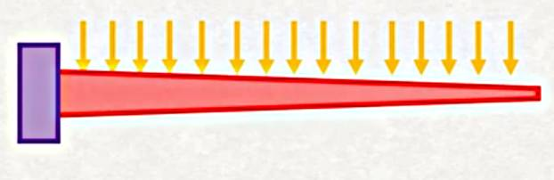
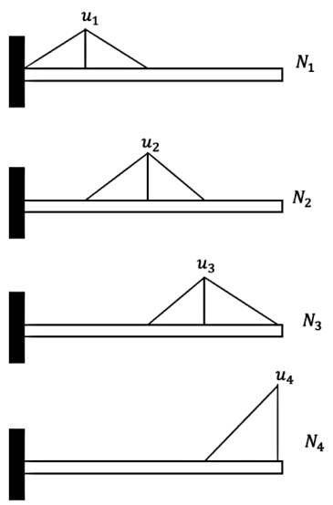

# Sonlu Öğeler Metotu (Finite Elements Method -FEM-), Sürekli (Continuous) Yaklaşım

Mittal

Fonksiyonların İç Çarpımı (Inner Product)

Vektörlerden bildiğimiz çoğu tekniği fonksiyonlara uygulamak mümkündür [3].
Elimizde $f(x), g(x), ...$ reel değerli, $\alpha \le x \le \beta$ aralığında
tanımlı fonksiyonları olduğunu düşünelim, bu fonksiyonlar bir reel vektör uzayı
oluştururlar. Şimdi $(f,g)$ iç çarpımını düşünelim, ki bu çarpım tanımı

$$
(f,g) = \int_{\alpha}^{\beta} f(x) g(x) \mathrm{d} x
$$

olsun. Üstteki bizim tanımımız tabii, başkaları ekler yapabilirler, mesela
bazıları iç çarpıma bir ağırlıklama fonksiyonu $w$ ekliyorlar, yani üstteki
entegralde $f,g$ ve $w$ çarpılıyor. Bizim dersimizin amaçları için biz
gördüğümüz tanımla yetineceğiz.

Üstteki entegral lineer. Simetrik olduğu bariz. Ayrıca kesin artı (positive
definite) özelliği de var.

Eldeki iç çarpım tanımıyla artık "bir fonksiyonun uzunluğu'' bile
hesaplanabiliyor, aynen vektörlerin uzunluğunun hesaplanabildiği gibi.

$$
|| f || = \sqrt{ (f,f) } =
\sqrt{\int_{\alpha}^{\beta} f(x) f(x) \mathrm{d} x } =
\sqrt{\int_{\alpha}^{\beta} [f(x)]^2 \mathrm{d} x }
$$

Bu sayede birim fonksiyonlar bile yaratabilirim, mesela $f(x)$'i uzunluğu
$||f(x)||$ ile bölersem onu normalize etmiş olurum, yani uzunluğu bire inmiş
olur, $g$, $h$, vs ile bunu aynı şekilde gerçekleştirebilirim.

Tamlık (Completeness)

Bir $\alpha \le x \le \beta$ aralığında tanımlı fonksiyonlar kümesi $S$ olsun.
Ayrıca $y_0,y_1,..$ aynı $S$ kümesinde tanımlı birimdik (orthonormal)
fonksiyonlar olsun (yani her $y_i$ fonksiyonun birbiri ile iç çarpımı sıfır
sonucu verecek). Bu birimdik fonksiyonlar kümesine tam denir eğer herhangi bir
$f \in S$'i o baz fonksiyonların lineer kombinasyonu olarak yaklaşık şekilde
temsil edebiliyorsam. Yaklaşıklık derecesi benim tanımladığım $\epsilon > 0$ ile
ölçülecektir, ve kaç tane fonksiyonu kombine ettiğim de yine benim tarafımdan
tanımlı olacaktır. Yaklaşıklık

$$
|| f - (k_0 y_0 + k_1 y_1 + k_2 y_2 + ... + k_m y_m)  || < \epsilon
$$

ile ölçülebilir.

Not: Birimdiklik tamlık için şart değil, fakat birimdiklik bazı rahat işlemler
yapabilmemizi sağlar, o bakımdan tercih edilir.

Örnek

$-\pi \le x \le \pi$ arasında tanımlı bir $f(x)$ olsun. O zaman Fourier
fonksiyonları $1$, $\sin x$, $\cos x$, $\sin 2x$, $\cos 2x$, ... bir tam küme
oluştururlar. Çünkü $-\pi \le x \le \pi$ arasında bana verilen herhangi bir
fonksiyonu Fourier fonksiyonlarının bir kombinasyonu olarak temsil edebilirim,
ya da doğru terminoloji kullanmak gerekirse, onu bir "Fourier Serisi'' olarak
temsil edebilirim. Görülen o her birimdik fonksiyonu $a_0$, $b_0$, $a_1$, $b_1$,
.. sabitleriyle çarpıp toplarım ve yaklaşık temsili yaparım, tabii katsayıların
ne olduğunu bulmam gerekir, doğru olanlarını bulunca $f$'yi iyi temsil etmiş
olurum. Seriyi uzattıkça, daha fazla Fourier terimi ekledikçe, $f$'ye daha da
yaklaşırım, benden beklenen $\epsilon$ yakınlığını böylece elde edebilirim. 
Mesela kabaca bir yaklaşıklık için 4-5 tane terim, çok iyi olması için
yüzlerce. 

Örnek

Herhangi bir küpsel polinomu temsil etmek bağlamında $1,x,x^2,x^3$ bir tam küme
oluşturur. Fakat bu küme yegane küme mi? Hayır. Mesela $5$, $3+x$, $9 + 2x +
6x^2$, $5x + 20x^2$ kümesi de tamdır.

Tam küme öğelerinin bir özelliğine dikkat çekmek gerekir, onların birini
diğerlerinin lineer kombinasyonu olarak temsil etmek mümkün değildir.
Mesela $x^3$'u $1$, $x$, $x^2$'yi lineer olarak birleştirerek erisemem. 

Örnek

Bu örnekte tam olmayan bir kümeye bakalım. Mesela küpsel polinomları temsil
etmek için $1,x,x^3$ tam değildir, çünkü $x^2$ eksik. Mesela üstteki
$9 + 2x + 6x^2$ fonksiyonu.. onu eldeki bu baz ile temsil edemem çünkü
$x^2$ bazı yok. Evet $x^3$ var ama oradan "aşağı inerek'' karesel temsil
yapmak mümkün değil, en azından benden istenen $\epsilon$ yakınlığında,
ve lineer kombinasyonlar kullanarak bunu yapmak mümkün değil.

Teori

$y_0,y_1,y_2,..$ fonksiyonları $S$ kümesi için, $\alpha \le x \le \beta$
aralığında tanımlı, tam, ve birimdik (bu sefer şart) bir küme olsun. O zaman
$f \in S$ bir sürekli fonksiyon ise ve her $y_m$'e dikgen ise bu demektir ki
$f$ muhakkak sıfırdır.

Mesela iki boyutta basit bir örnek üzerinde görelim; iki birimdik baz var, $x$
ve $y$ üzerinde kalın çizgi ile gösterdiğim, $i,j$ diyelim, şimdi bir $A$
vektörü düşünelim, bu vektör çizildiği haliyle tabii, birimdik $i,j$
kombinasyonu ile temsil edilebilir. Fakat şimdi düşünelim, eğer $A$
hem $i$'ye hem $j$'ye dikgen olsaydı, yani öyle bir vektör olsaydı ki
ne $x$ ne $y$ üzerinde hiçbir yansıması olmasaydı, bu $A$ sıfırdan başka
bir şey olamazdı, değil mi? Üstteki teorinin söylediği bundan ibaret. 


Ağırlıklı Artıklar Metotu (Weighted Residual Method -WRM-)

Önceki derste iyi koşullu bir sistemi elde etmeyi gördük, bu kötü koşullu (ill
conditioned) olmanın tersi tabii. Bu derste WRM'yi kurmayı göreceğiz [1], ki bu
metot aslında kapsayıcı bir tarif, altında farklı hesap yöntemleri de
olabiliyor, WRM'nin kendisi hata kontrolünü nasıl yapacağımızı tarif ediyor.

Basit bir problemle başlayalım. Laplace formülü mesela, iki boyutu baz alalım,
ama birazdan göreceğimiz fikirler 1D ya da 3D için de geçerli. Problem bölgesi
(domain) $\Omega$ olsun onun sınırları $\Gamma$, 


İlgilendiğimiz alan (field) $T(x,y)$, bu reel değerli bir fonksiyon, ve
kurduğumuz sistem için bu fonksiyonun şu şartlara tabi olmasını istiyoruz,

$$
\nabla^2 T = 0 \quad \Omega \textrm{ üzerinde } 
$$

$$
\Gamma \textrm{ için } T = T_0
$$

Bu tür problemlere Drichlet problemleri deniyor.

Üstteki şartları yerine getiren bir $T(x,y)$ çözümü bulmak istiyoruz. O zaman
ilk akla gelen nedir? Diferansiyel denklemi alıyorum ve $\Omega$ içindeki tüm
noktalar için çözmeye uğraşıyorum. Fakat bu kolay değil. Ayrıca $\Omega$'daki
eşitlik $\Gamma$ sınırında geçerli değil, ikinci şart sebebiyle. Bu arada
matematiksel olarak çözüm nedir? $\Omega$'daki sonsuz tane nokta için geçerli
olan şeydir. Buna kesin çözüm (exact solution) deniyor. 

Fakat bu çözümü bulmak mümkün değilse, ya da yaklaşık bir çözüm de yeterli
oluyorsa o zaman yaklaşık yöntemler kullanabilirim.. $\nabla^2 T = 0$ eşitliği
$\Omega$'daki her nokta için, her $\Gamma$ sınır şartında değil belli seçilmiş
noktalarda olsun diyebilirim.

Ama "belli noktalarda'' deyince de iş bitmiyor, o seçilmiş noktalarda kesin
çözüm mü yapsam, yoksa o noktalarda da yaklaşık çözüm yapsam? Ya da tüm
noktalarda yaklaşık çözüm üzerinden bir hata hesaplayıp, tüm seçilmiş noktalarla
hesaplanan ortalama bir hatanın sıfır olması için mi uğraşsam?

Şöyle bir yöntem deneyelim; elimizde / verili belli bir baz fonksiyon "sınıfı''
olsun, bu fonksiyonlar Fourier bazı $\sin$, $\cos$ olabilir, ya da Chebisev
polinomları olabilir. Bu "test'', baz fonksiyonları $T_i(x,y)$ içinde,
$i=1,2,...,N$, ve nihai $T$'yi

$$
T = T_0 + \sum_{i=1}^{N} c_i T_i(x,y)
$$

ile hesaplayayım, $c_i$'ler başta bilmediğim katsayı değerleri olsun. Bilinen /
verili test fonksiyonları üzerinden doğru $c_i$'leri bulursam bu beni gerçek
fonksiyon $T$'ye yaklaştırır. Üstteki toplamda $T_0$ terimi özellikle o şekilde
formüle dahil edildi, $T_i$ toplamının sınırda sıfır olmasını ayarlayabilirsem,
$T=T_0$ şartını otomatik olarak tatmin etmiş olurum.

$N$ sayısına dikkat, gerçek fonksiyonu aşağı yukarı temsil etmek istesem $N$'yi
az tutardım, birkaç tane temel fonksiyon birleşimi.. Ama $N$'i arttırarak, hatta
sonsuza yaklaştığımızda gerçek fonksiyona tıpatıp eşit olacağımızı
bekleyebilirdik, o zaman $N$ sayısı bir anlamda yaklaşıklamanın kalitesini
kontrol edecektir. $N$ arttıkça hata azalır, yaklaşıklama gerçeğe yaklaşır.
Bir ödünleşim (trade-off) durumu var muhakkak, çok büyük $N$ hesaplaması zor
olan bir sistem ortaya çıkartabilir, vs.

Bu bizi hata tanımına getiriyor. Onu gerçek ve yaklaşık değerler arasındaki
fark, "artık'' (residual) üzerinden tanımlayacağız, artık $R$,

$$
R(c_i,x,y) = \nabla^2 T
$$

Bu kadar basit. Niye artığı direk $\nabla^2 T$'e eşitlemek yeterli? Çünkü ana
formüle bakarsak $\nabla^2 T$ ideal durumda sıfır olmalı değil mi?  Ama
yaklaşıklama mükemmel olmadığı için sıfırdan farklı (fakat umuyoruz ki ona
yakın) değerler döndürecektir, o zaman bu değeri alıp direk hata / artık değeri
olarak kullanabiliriz. O zaman

$$
R(c_i,x,y) = T_0 + \sum_{i=1}^{N} c_i T_i(x,y)
$$

diyelim. Üstteki denklem bana her veri noktası, belli bir $x,y$ için olan hatayı
verir. Sınır koşulunu denklem doğal olarak karşıladığı için orada zaten hata
yok. Yani tanım itibariyle sınırda hata sıfır, ve sınırlar içinde muhtemel
olarak sıfır olmayan bir değerde.

Şimdi $c_i$'lerin bulunmasına gelelim, yaklaşık temsil onlar üzerinden mümkün
olacak. $N$ tane $c_i$ bilinmiyor o zaman bir şekilde $N$ tane denklem üretmem
lazım, ki onları çözerek bilinmeyenleri elde edeyim. WRM burada devreye giriyor.

Ağırlıklı artıklar dedik, ağırlıklardan da (dikkat $c_i$ katsayılarından, ve
test fonksiyonlarından farklı bu) da $N$ tane var, $N$ tane fonksiyon. Onları
$j$ ile indisleyebiliriz, $w_j$, $j=1,...,N$. Artıkları şöyle ağırlıklıyoruz,

$$
\int_\Omega w_j R \mathrm{d} \Omega
$$

Biraz önce söylediğimiz artığın sıfır olma hedefini biraz genişletip
ağırlıklanmış artığın sıfır olması haline getiriyoruz. O zaman $N$ tane denklemi
şöyle üretiriz,

$$
j=1,\quad
\int_\Omega w_1 (x,y) \left[
  \nabla^2 T_0 + \sum_{i=1}^{N} c_i \nabla^2 T_i(x,y) 
  \right] \mathrm{d} \Omega
$$

$$
j=2,\quad
\int_\Omega w_2 (x,y) \left[
  \nabla^2 T_0 + \sum_{i=1}^{N} c_i \nabla^2 T_i(x,y) 
  \right] \mathrm{d} \Omega
$$

$$
\vdots
$$

$$
j=N,\quad
\int_\Omega w_N (x,y) \left[
  \nabla^2 T_0 + \sum_{i=1}^{N} c_i \nabla^2 T_i(x,y) 
  \right] \mathrm{d} \Omega
$$

Böylece $N$ tane bilinmeyen için $N$ tane formül elde ettim, ve bu şekilde
çözümü yapabilirim.

$w_j$'ler ne yapıyor? Başta hataların ortalamasından bahsetmiştik hatırlarsak,
her $w_j$ bir nevi ortalamadır, ama her $j$ için farklı bir ortalama şekli
seçebiliriz, mesela alttaki resimde


karalanmış kısma daha fazla ağırlık ver diyebiliriz, vs. Genel anlamda
hatırlarsak üç sayı A,B,C ortalaması demek aslında her sayının 1/3 "ağırlığı''
ile çarpılıp, toplanması ve sonucun 3'e bölünmesi demektir. Bu ağırlıkları
değiştirebiliriz, o zaman farklı bir ortalama elde ederiz, mesela 1/2, 1/4, 1/4
kullansam A'ya daha fazla ağırlık vermiş olurdum.

Bu açıdan bakınca üstte üretilen her denklem belli bir artık formülünün
farklı şekillerde ağırlıklanması sonucu elde edilen denklemlerdir.

Galerkin Metotu

Bu metot FEM'in temelini oluşturur [2], 1915, 1913'te Galerkin, Bubnov
tarafından ayrı ayrı keşfedilmiştir. Galerkin metotunun özü şu basit önermeden
ibaret, daha önce gördüğümüz ağırlıklı artıklar metotunda Galerkin metotu der ki
$w_j = T_j$, yani ağırlık fonksiyonu test fonksiyonu ile aynı olsun. Ayrıca
hatırlarsak $T_j$'lerin bir tam küme oluşturması gerekiyor, o zaman $w_j$'lerin
de tam küme oluşturması gerekiyor. Bu durumda ağırlıklı artıklar metotu bizi şu
noktaya getirir,

$$
(w_j,R) = 0
$$

Yani $R$ her $w_j$'e dikgen, bu daha önceki dikgenlik teorisini hatırlatmalı
bize, eğer $R$ her birimdik baz fonksiyonuna dik ise, kendisi sıfırdan başka bir
şey olamaz. Bu çok kuvvetli bir sonuç. $R$ hatasının tam kümedeki her fonksiyon
ile iç çarpımının sıfır olma şartına bakıyoruz.. bu tür bir ilişkinin bize
ileride faydalı olacağını görmek zor değil, dikgenlikten direk $R$'nin sıfır
olmasına atlayabilmiş oluyoruz, bunu lineer cebirsel işlemlerimizde
kullanabiliriz.

Alberta Üniversitesi

Galerkin, Ağırlıklı Artıklar Metotu (Weighted Residual Method)

WRS diferansiyel denklemleri yaklaşık (approximate) olarak çözebilen bir
metottur, bunu tüm yaklaşık fonksiyonun tanım kümesi üzerinden ağırlıklı hata
artıklarını sıfıra eşitleyerek yapar. Bununla ne demek istediğimizi birazdan
yakından göreceğiz [4, Ders 3].

Euler-Bernoulli kirişlerini tanımlayan denklemi hatırlayalım,

$$
E I \frac{\mathrm{d}^4 y}{\mathrm{d} X_1^4} = q
\qquad (1)
$$

Galerkin ve şekil fonksiyonlarını gördük. Metotun dayandığı ana prensip şudur;
eğer çözmeye uğraştığım (1)'deki gibi bir problemde eğer $y$ yerine $y_{approx}$
kullanırsam

$$
\frac{\mathrm{d}^4 y}{\mathrm{d} X_1^4} - q = 0 \qquad
\frac{\mathrm{d}^4 y_{approx}}{\mathrm{d} X_1^4} - q \ne 0
$$

tabii ki sıfır olmayan bir sonuç alırdım. Ama $y_{approx}$ eğer $y$'ye oldukca
yakınsa sıfır olmasa bile sıfıra yakın bir sonuç alabilirdim.. belki?

Bu yakınlığı bir artık $R$ ile ölçebiliriz,

$$
R = \frac{\mathrm{d}^4 y_{approx}}{\mathrm{d} X_1^4} - q 
$$

Üstteki formül içinde bilinmeyen $a_i$ değerleri var hatırlarsak. O zaman, eğer
"iyi'' $a_i$ değerleri seçebilirsem teorik olarak $y_{approx}$ değeri $y$
değerine yaklaşacaktır, ve dolaylı olarak bu $R$'yi minimize eder. Demek ki
$R$'yi minimize edebilen bir yaklaşım aynı zamanda $y$'yi yaklaşık olarak
çözebilen bir yaklaşım olacaktır. 

Daha detaylı olarak ifade etmek gerekirse $D$ tanım alanı üzerinde ifade edilen
ağırlıklı artık hataların toplamını sıfıra eşitleyerek bilinmeyen $a$
parametrelerini bulmaya uğraşacağız.

Matematiksel olarak üstteki

$$
\int_D W_i R \mathrm{d} x = 0
$$

olarak formülize edilebilir. Fakat hala bir sorumuz var, ağırlıklı dedik,
formüldeki $W_i$ onun için, fakat bu $W_i$ nereden geliyor?

Ağırlık için farklı fonksiyonlar seçilebilir, ve her seçilen fonksiyon tipine
göre farklı sonuçlar elde edilebilir. Galerkin metotuna göre $W_i$ deneme
fonksiyonu $\phi_i$ ile aynı olacak şekilde seçilir. Bu ve ileriki derslerde
öğreneceğimiz Galerkin yaklaşımı çünkü çoğu profosyonel FEM paketi bu yaklaşımı
kullanır.

Örnek olarak [6]'te gördüğümüz eksenel yükleme (axial loading) modelini
kullanalım. 


Eksenel yükleme formülünü üstteki probleme uygulayınca

$$
EA \left( \frac{\mathrm{d}^2 u}{\mathrm{d} X_1^2}  \right) = -c X_1
$$

Eşitliğin sağındakileri sola geçirip her şeyi $EA$ ile bölersem, artık
(residual) hatasını bulabilirim,

$$
R = \frac{\mathrm{d}^2 u_{approx}}{\mathrm{d} X_1^2} + \frac{c X_1}{EA}
$$

Yaklaşıklama fonksiyonumuz ne olacak? Genel formu hatırlayalım,

$$
u_{approx} = a_0 \phi_0(X_1) + a_1 \phi_1(X_1) + a_2 \phi_2(X_1) + a_3 \phi_3(X_1) 
$$

3'üncü derece polinom kullanabiliriz, tüm dereceler $X_1$'in fonksiyonu olsun
$\phi_i = a_i X_1^i$, 

$$
u_{approx} = a_0 + a_1 X_1 + a_2 X_1^2 + a_3 X_1^3 
$$

Bir gerekli (essential) sınır şartı ekleyebiliriz, ki bu $u_{approx}(0)=0$,
çünkü kiriş sol tarafında sabitlenmiştir, ve bunun polinoma yansıması
$a_0=0$ olacaktır, yani bu katsayı çıkartılabilir. Yeni hal,

$$
u_{approx} = a_1 X_1 + a_2 X_1^2 + a_3 X_1^3 
$$

Galerkin yöntemi kullandığımız için şimdi ağırlık fonksiyonlarını seçiyoruz,
fakat daha önce belirttiğimiz gibi Galerkin yönteminde $\phi_i$ ve ağırlık $W_i$
aynı seçilir, yani

$$
W_1 = \phi_1(X_1) = X_1 \qquad 
W_2 = \phi_2(X_1) = X_1^2 \qquad 
W_3 = \phi_3(X_1) = X_1^3
$$

Artık elimizde 

$$
\int_D W_i R \mathrm{d} x = 0
$$

problemini çözmek için gerekli her şey var. $R$'nin ne olduğunu biliyoruz
çünkü o ana problem tanımından geliyor,

$$
= \int_{0}^{L} W_i
\left(
 \frac{\mathrm{d}^2 u_{approx}}{\mathrm{d} X_1^2} + \frac{c X_1}{EA}
\right) \mathrm{d} X_1 = 0
$$

Entegral sınırını 0 ila $L$ arası yaptık çünkü etki alanını biliyoruz artık,
hesap tüm kiriş boyunca yapılacak, $L$.

Şimdi bulmamız gereken bilinmeyenlere bakıyoruz, üç tane var $a_1$, $a_2$,
$a_3$. Üç tane bilinmeyeni çözmek için üç tane denklem gerekir, ki tüm sistemi
çözünce bilinmeyenler bulunabilsin. Ama üstte bir tane denklem var, nasıl
üç tane denklem bulacağız?

Aslında üstteki denklem bir denklem kalıbı, her $i$ için bu kalıp bize ayrı bir
ağırlık $W_i$ üzerinden farklı bir denklem verebilir. Ağırlıklar $W_1 = X_1$,
$W_2 = X_1^2$, $W_3 = X_1^3$ demiştik, o zaman 

$$
\int_{0}^{L} X_1 \left( \frac{\mathrm{d}^2 u_{approx}}{\mathrm{d} X_1^2} + \frac{c X_1}{EA}  \right) \mathrm{d} X_1 = 0
$$

$$
\int_{0}^{L} X_1^2 \left( \frac{\mathrm{d}^2 u_{approx}}{\mathrm{d} X_1^2} + \frac{c X_1}{EA}  \right) \mathrm{d} X_1 = 0
$$

$$
\int_{0}^{L} X_1^3 \left( \frac{\mathrm{d}^2 u_{approx}}{\mathrm{d} X_1^2} + \frac{c X_1}{EA}  \right) \mathrm{d} X_1 = 0
$$

formüllerini elde edebiliriz.

Fakat hala bir problem var; bilinmeyen katsayı kadar denklem var, fakat
diferansiyel denklem derecesini tatmin edecek kadar sınır şartı
yok. $u_{approx}(0)=0$ üzerinden bir şart elde ettik, fakat hala bir tane
daha şart gerekli. Bu duruma cevap bulmazsak hala üstteki yaklaşımla bile
sonsuz tane sonuç elde edilebilir.

O zaman bir sınır şartı daha lazım, gerekli olmayan (non-essential) sınır şartı
burada devreye giriyor. Kirişin sol tarafı sabitlenmiştir dedik, fakat sağ
tarafında neler oluyor acaba? O uçta stres sıfır denebilir, çünkü o uç serbest
uçtur, ve şimdiye kadar gördüğümüz iç stres tanımı kuvvet uygulanan bir nesne
içindeki bir kesitte etki eden hayali bir düzlem farz etmişti. Serbest uçta buna
gerek yoktur, o uç açıktır. Orada stres sıfır kabul edilebilir. Tabii stres
yokluğu tek eksenel durumda gerilmeye yansır, $X_1=L$'de stres sıfırsa yer
değişimin türevi olan gerilme de sıfırdır,

$$
\epsilon = \frac{\mathrm{d} u}{\mathrm{d} X_1} = \frac{\sigma}{E} = 0
$$

O zaman ikinci sınır şartı şöyle gösterilebilir [4, Ders 3, 2:00:00],

$$
\frac{\mathrm{d} u}{\mathrm{d} X_1}(L) = 0 
$$

Bu sınır şartına literatürde gerekli olmayan (non-essential) sınır şartı da
denebiliyor.

Peki bu ikinci şartı nasıl çözüme uygulayacağız? Parçalı Entegral tekniğini
kullanabiliriz.

Ana genel denklemi tekrarlarsak,

$$
= \int_{0}^{L} W_i \left(
  \frac{\mathrm{d}^2 u_{approx}}{\mathrm{d} X_1^2} + \frac{c X_1}{EA}
\right) \mathrm{d} X_1 = 0
$$

Parantez içindeki ikinci terimi sağ tarafa taşıyabiliriz,

$$
= \int_{0}^{L} W_i \left( \frac{\mathrm{d}^2 u_{approx}}{\mathrm{d} X_1^2} \right) \mathrm{d} X_1 =
\int_{0}^{L} - W_i  \left( \frac{c X_1}{EA} \right) \mathrm{d} X_1
\qquad (2)
$$

Şimdi eşitliğin sol tarafına Parçalı Entegral tekniğini uygulayacağım,

$$
\int_{0}^{L} W_i \left( \frac{\mathrm{d}^2 u_{approx}}{\mathrm{d} X_1^2} \right) \mathrm{d} X_1 =
W_i \left( \frac{\mathrm{d} u_{approx}}{\mathrm{d} X_1} \right) \big\vert_{X_1=0}^{X_1=L} -
\int_{0}^{L} \left( \frac{\mathrm{d} W_i}{\mathrm{d} X_1}  \right) \left( \frac{\mathrm{d} u_{approx}}{\mathrm{d} X_1}\right) \mathrm{d} X_1
$$

Oldukça karışık bir sonuç elde ettik, fakat eşitliğin sağındaki birinci terime
bakarsak oraya ikinci şartı uygulayabileceğimizi görüyoruz. Entegral hesabında
$X_1=L$ ikinci sınır şartı sıfır değerini denkleme sokar, $X_1=0$'da zaten
entegral sınır hesabı sıfır değerinde, o zaman o terim tamamen yok sayılabilir,
geriye kalanlar,

$$
= - \int_{0}^{L} \left( \frac{\mathrm{d} W_i}{\mathrm{d} X_1}  \right)
\left( \frac{\mathrm{d} u_{approx}}{\mathrm{d} X_1}\right) \mathrm{d} X_1
$$

Bu denklem (2)'nin sağ tarafına eşit tabii ki, hepsi bir arada (eksi
işaretler birbirini iptal etti),

$$
\int_{0}^{L} \left( \frac{\mathrm{d} W_i}{\mathrm{d} X_1}  \right)
\left( \frac{\mathrm{d} u_{approx}}{\mathrm{d} X_1}\right) \mathrm{d} X_1 =
\int_{0}^{L} W_i  \left( \frac{c X_1}{EA} \right) \mathrm{d} X_1
$$

Bu çok daha temiz bir genel denklem. İkinci derece türev kayboldu, herşey
birinci derece türev halinde. Bunu ikinci sınır şartını parçalı entegral
üzerinden sisteme dahil ederek elde ettik. Ağırlık fonksiyonu iki yerde mevcut,
solda türevi üzerinden, fena değil. Bu genel forma farklı ağırlık
fonksiyonlarını sokarak üç tane farklı denklem elde edebileceğiz, ve bu
denklemleri nihai çözüme ulaşmak için kullanacağız. Bunu yapalım, sırayla
$W_1 = X_1$, $W_2 = X_1^2$, $W_3 = X_1^3$ için,

$$
\int_{0}^{L} \left( \frac{\mathrm{d}}{\mathrm{d} X_1} (X_1) \right)
\left( \frac{\mathrm{d} u_{approx}}{\mathrm{d} X_1}\right) \mathrm{d} X_1 =
\int_{0}^{L} X_1  \left( \frac{c X_1}{EA} \right) \mathrm{d} X_1
\implies a_1 L + a_2 L^2 + a_3 L^3 = \frac{c L^3}{3EA}
$$

$$
\int_{0}^{L} \left( \frac{\mathrm{d}}{\mathrm{d} X_1} (X_1^2) \right)
\left( \frac{\mathrm{d} u_{approx}}{\mathrm{d} X_1}\right) \mathrm{d} X_1 =
\int_{0}^{L} X_1^2  \left( \frac{c X_1}{EA} \right) \mathrm{d} X_1
\implies a_1 L^2 + \frac{4 a_2 L^3}{3} + \frac{3 a_3 L^4}{2} = \frac{cL^4}{4EA}
$$

$$
\int_{0}^{L} \left( \frac{\mathrm{d}}{\mathrm{d} X_1} (X_1^3) \right)
\left( \frac{\mathrm{d} u_{approx}}{\mathrm{d} X_1}\right) \mathrm{d} X_1 =
\int_{0}^{L} X_1^3  \left( \frac{c X_1}{EA} \right) \mathrm{d} X_1
\implies a_1 L^3 + \frac{3 a_2 L^4}{2} + \frac{9 a_3 L^5}{5} = \frac{cL^5}{5EA}
$$

Eşitliğin sağındaki üç denklemi bir sistem olarak çözersem,

$$
a_1 = \frac{c L^2}{2EA}, \quad a_2 = 0, \quad a_3 = -\frac{c}{6EA}
$$

sonucunu elde ederim. Bu katsayıları $u_{approx}$ içine koyunca,

$$
u_{approx} = \frac{c L^2}{2EA} X_1 -\frac{c}{6EA} X_1^3
$$


Önceki örnekler standart eni değişmeyen kiriş yapısını temel aldı.  Fakat ya
kiriş alttaki gibi olsaydı?



Bu kirişi temsilen

$$
E I \frac{\mathrm{d}^4 y}{\mathrm{d} X_1^4} = q
$$

diferansiyel denklemini hala kullanabilir miyiz? Dikkat edersek en değiştiğine
göre $X_1$ ile beraber, ona bağlı olarak, atalet momenti $I$ sabit değil,
değişken demektir.. Bazıları düşünebilir "ama o zaman değişken $I$'yi alırız,
üstteki denklemdeki $I$'ya sokarız olur biter''. Bunu yapamayız çünkü $I$'nin
sabit olması üstteki denklemi türetmek için bir önkabuldu, yani $I$ değişken ise
üstteki denklemi kullanmak mümkün değildir [7, Ders 4].

Problem şu ki pek çok gerçek dünya uygulaması üstteki Euler-Bernoulli kiriş
formülüne erişirken kullandığımız faraziyelere uymaz, bunları hatırlarsak lineer
elastiklik, yok sayılabilecek Poisson etkileri, düzlemlerin düz kalması idi.
Fakat mesela beton materyelini ele alalım, bu materyel ucuzdur, basınca, yani
içe doğru strese karşı çok dayanıklıdır, ki bu yüzden pek çok yapıda kullanılır,
fakat beton dışa doğru stres, yani gerilime karşı dayanıklı değildir. Çok az bir
yükü bile beton parçaya dışa doğru uygulasam çatlamaya başlar, çatlamak demek
oradaki yüzeyin bozulmaya uğraması demektir, ki dolaylı olarak $I$
değişecektir. Diğer bir problem yüke bağlı olarak betonun $E$ değerinin de
değişmesi. Yani gerçek dünyada $I$ neredeyse hiçbir zaman sabit değildir, $E$
benzer şekilde, durumu daha kötü yapan bu değişimlerin çoğunlukla yük $q$
değerine bağlı olması. Bu tüm hesapları arap saçına döndürür.

Problemin çözümü FEM yaklaşımında. Nasıl? Çünkü eğer bir kirişi yeterince ufak
parçalara bölebilirsem o parçalarda $I$, ve $E$ sabit kabul edebilirim ve bu
parçalarda daha basit olan denklemleri kullanabilirim. FEM matematiği bana bu
parçaları birleştirmem için güzel bir mekanizma sağlıyor zaten.


Üstteki resimdeki yeşil bölgeyi düşünelim, o bölgenin iki yan yüzeylerini
düşünürsek, belki soldan sağa giderken biraz değişim olur ama parça çok ufak
olduğu için bu değişim fazla değildir. 

FEM maceramıza çubuk/makaskiriş (bar/truss) öğeleri ile devam edeceğiz.  Bu
yapılar çok basit olmalarına rağmen FEM metadolojisini gösterebilmeleri
açısından uygunlar. Onları sadece küçülme, esneme açısından inceleyeceğiz,
moment, kaykılma gibi konuları şimdilik yok sayacağız. Fakat işleyeceğimiz pek
çok yaklaşım, "direngenlikleri (stiffness)'' hesaplarken kullandığımız adımlar
her FEM yaklaşımında faydalı olan kavramlar.

Not düşelim, önceki FEM çözümü Galerkin yaklaşımı ile tüm denkleme analitik bir
çözüm buldu. Bu derste ve gerisinde göreceğimiz türden FEM, Galerkin çözümünü
her parçaya uygulayıp ayrıksal sonuçları birleştiriyor.


Makaskiriş üstteki gibi olsun, onu parçalara bölelim, sarı noktalar düğümler
(nodes), düğümleri birleştiren öğeler (elements) var. Bu yaklaşımda yer
değişimleri tüm nesne için değil, her düğümde hesaplayacağız. Yer değişimleri
birbiriyle bağlayan şeyler ögeler, kırmızı ile görülen parçalar.  Bu öğe
parçaları aslında bir aradeğerlemeyi (interpolation) temsil ediyor olacaklar,
eğer iki düğümün yer değişimini biliyorsam onları bağlayan parçanın yer
değişimini bunları kullanarak, aradeğerleme yaparak hesaplayabilirim.

Eğer tek bir öğeye bakarsak,


Yer değişimler her düğüm için demiştik, $u_1,u_2$, amacımız onları hesaplamak.
Eğer bu değişimleri hesaplayabilirsem, daha önce belirttiğimiz gibi, aradaki
öğenin yer değişimini yaklaşık olarak, iki uca bağlı olarak hesaplayabilirim.
Yani eğer düğümlerin her değişimini biliyorsam her şeyin yer değişimini
biliyorum demektir.

Galerkin metotuna başlayalım. Metot uygulanınca bize yer değişimleri için bir
direngenlik matrisi ve öğeler için düğümsel kuvvet vektörü vermeli. Her şey
düğümlerde hesaplanıyor dedik, peki sisteme dağıtık bir yük uygulanıyorsa
ne yapacağız? Bu tür kuvvetlerin düğümler arasında etkili olduğunu biliyoruz,
o zaman bu tür kuvvetleri $x,y,z$ bileşenlerine ayırıp onları düğümlere etkili
vektörler haline getirebilirim.

Ana denklemle başlarsak,

$$
E A \frac{\mathrm{d}^2 y}{\mathrm{d} X_1^2} = -p
$$

Artıksal (residual) hesap şöyle,

$$
R = EA \frac{\mathrm{d}^2 u}{\mathrm{d} X_1^2} + p
$$

Bu artığın tanım bölgesi üzerinden ağırlıklı entegralinin sıfır olmasını
istiyoruz,

$$
\int_\Omega R N_i \mathrm{d} x = 0 
$$

Dikkat, daha önce ağırlık $W_i$ kullanmıştık, şimdi $N_i$ var, bu fonksiyonlar
her düğümde tanımlı şekil fonksiyonu (shape function) olacak. O şekillerin ne
seçildiği FEM'in ana özelliklerinden, detayları göreceğiz.. Şimdi $R$'yi açıp
düzenleme yaparsak,

$$
\int_{0}^{L} \left( EA \frac{\mathrm{d}^2 u}{\mathrm{d} X_1^2} + p  \right) N_i \mathrm{d} X_1 = 0 
$$

$$
\int_{0}^{L} \left( EA \frac{\mathrm{d}^2 u}{\mathrm{d} X_1^2} \right) N_i \mathrm{d} X_1 =
- \int_{0}^{L} p N_i \mathrm{d} X_1
$$

Parçalı Entegral tekniğini uygulayalım,

$$
\int_{0}^{L} EA \left( \frac{\mathrm{d}^2 u}{\mathrm{d} X_1^2}  \right) N_i \mathrm{d} X_1 =
\left( EA \frac{\mathrm{d} u}{\mathrm{d} X_1} N_i \right) \bigg\vert_{X_1=0}^{X_1=L} -
\int_{0}^{L} EA
\left( \frac{\mathrm{d} u}{\mathrm{d} X_1} \right)
\left( \frac{\mathrm{d} N_i}{\mathrm{d} X_1} \right) \mathrm{d} X_1 =
- \int_{0}^{L} p N_i \mathrm{d} X_1
$$

Ekşi işaretler olmasın diye birkaç yer değişimi yapalım,

$$
\int_{0}^{L} EA
\left( \frac{\mathrm{d} u}{\mathrm{d} X_1} \right)
\left( \frac{\mathrm{d} N_i}{\mathrm{d} X_1} \right) \mathrm{d} X_1
=
\left( EA \frac{\mathrm{d} u}{\mathrm{d} X_1} N_i \right) \bigg\vert_{X_1=0}^{X_1=L} +
\int_{0}^{L} p N_i \mathrm{d} X_1 
$$

Eşitliğin sağındaki birinci terime dikkat edelim, orada fiziksel anlamı olan bir
ilişki görüyor muyuz? $EA$ çarpı $\mathrm{d} u / \mathrm{d} x$.. Tanıdık geliyor mu?  O ifade
aslında bir kuvvet değil mi? Çünkü hatırlarsak $\mathrm{d} u / \mathrm{d} x$ yer değişimin
türevi, ki bu gerilme, gerilmeyi Young Genliği $E$ ile çarpınca stres elde
ederim. Ek olarak $A$ ile alan çarpımı var, stres kuvvet bölü alan olduğu için
stresi alanla çarpınca geriye kuvvet kalır. Demek ki o terimle eksenel kuvvet
elde ediyorum, bir düğümde konsantre edilmiş $f = E A \epsilon$ kuvvetini
hesaplıyorum. 

Bu mantık zinciriyle devam edersem üstteki kuvvet bir düğümdeki kuvveti
gösteriyor ve bu kuvvetin dışarıdan uygulandığı hali temsil ediyor. Hem
yanındaki düğümde bu kuvveti dengeleyen karşı bir kuvvet olacaktır ve
bu kuvvetler birbirini iptal edecektir. O zaman eşitliğin sağındaki
ilk terim iptal edilebilir.

O terimi iptal etmeden hesapları yapabilirdik fakat sonuç aynı çıkardı. Fakat
ekstra, gereksiz hesapları önceden çıkartmak hesap zamanımızı kısaltacağı için
iptali şimdiden yapmak bizim için iyi olacak. Neyse, iptal sonrası geriye
kalanlar

$$
\int_{0}^{L} EA
\left( \frac{\mathrm{d} u}{\mathrm{d} X_1} \right)
\left( \frac{\mathrm{d} N_i}{\mathrm{d} X_1} \right) \mathrm{d} X_1
= \int_{0}^{L} p N_i \mathrm{d} X_1 
$$

Şimdi $N_i$ fonksiyonlarına gelelim, onlara şekil fonksiyonları demiştik.  Bu
şekilleri daha önce anlattık.

Şapka fonksiyonlarını ifade etmenin daha genel bir yöntemi [8, sf. 9], ki $h =
x_{j+1}-x_j$, ya da 1 uzunluğundaki bir yatay eksen için $h = 1/N$ ve $j =
1,2,...,N$ olmak üzere,

$$
N_1 = \left\{ \begin{array}{rr}
(x_2 - X_1)/h, & x_1 \le X_1 \le x_2,\\
0, & \textrm{diğer}
\end{array} \right.
$$

$$
N_j = \left\{ \begin{array}{rr}
(X_1 - x_{j-1})/h, & x_{j-1} \le X_1 \le x_j,\\
(x_{j+1} - X_1)/h, & x_j \le X_1 \le x_{j+1},\\
0, & \textrm{diğer}
\end{array} \right.
$$

$$
N_{N+1} = \left\{ \begin{array}{rr}
(X_1 - x_N)/h, & x_N \le X_1 \le x_{N+1},\\
0, & \textrm{diğer}
\end{array} \right.
$$


Daha önceki örnekte iki parça kullanılmıştı, bu parçaları arttırırsak daha
gerçek probleme yaklaşırız, dört parça kullanalım [9], çubuk uzunluğu $L$,
o zaman $h = L/4$ olur, baz / şekil fonksiyonları alttaki noktalarda tanımlı,


$$
N_1 = \left\{ \begin{array}{rr}
X_1 / h & 0 \le X_1 \le L/4 \\
(L/2 - X_1) / h & L/4 \le X_1 \le L/2
\end{array} \right.
$$

$$
N_2 = \left\{ \begin{array}{rr}
(X_1 - L/4)/h & L/4 \le X_1 \le L/2 \\
(3L/4 - X_1)/h & L/2 \le X_1 \le 3L/4
\end{array} \right.
$$

$$
N_3 = \left\{ \begin{array}{rr}
(X_1-L/2)/h & L/2 \le X_1 \le 3L/4 \\
(L-X_1)/h & 3L/4 \le X_1 \le L
\end{array} \right.
$$

$$
N_4 = (X_1 - 3L/4) / h
$$

Böylece alttaki fonksiyonları yaratmış olduk,



Şekil fonksiyonlarının türevleri oldukca basit,

$$
\frac{\mathrm{d} N_1}{\mathrm{d} X_1} = \left\{ \begin{array}{rr}
4/L   & 0 \le X_1 \le L/4 \\
-4/L  & L/4 \le X_1 \le L/2
\end{array} \right.
$$

$$
\frac{\mathrm{d} N_2}{\mathrm{d} X_1} = \left\{ \begin{array}{rr}
4/L  & L/4 \le X_1 \le L/2 \\
-4/L & L/2 \le X_1 \le 3L/4
\end{array} \right.
$$

$$
\frac{\mathrm{d} N_3}{\mathrm{d} X_1} = \left\{ \begin{array}{rr}
4/L  & L/2 \le X_1 \le 3L/4 \\
-4/L & 3L/4 \le X_1 \le L
\end{array} \right.
$$

$$
\frac{\mathrm{d} N_4}{\mathrm{d} X_1} = 4/L
$$

Artık $N_i$, onun türevleri için bir tanıma sahibiz, hesaplamaya
başlayabiliriz. Genel FEM formülasyonunda en son alttaki noktaya gelmiştik,

$$
\int_{0}^{L} EA
\left( \frac{\mathrm{d} N_i}{\mathrm{d} X_1} \right)
\left( \frac{\mathrm{d} u}{\mathrm{d} X_1} \right)  \mathrm{d} X_1
= \int_{0}^{L} p N_i \mathrm{d} X_1
$$

$p = cX_1$ olarak kabul edelim, 

$$
\int_{0}^{L} EA
\left( \frac{\mathrm{d} N_i}{\mathrm{d} X_1} \right) 
\left( \frac{\mathrm{d} u}{\mathrm{d} X_1} \right) \mathrm{d} X_1
= \int_{0}^{L} N_i c X_1 \mathrm{d} X_1
\qquad (1)
$$

Üstteki formülü kullanarak 4 tane denklem ortaya çıkartabiliriz.

1)

$N_1$ formülü $0 \le X_1 \le L/2$ harici diğer her yerde yokolur, ki o
aralıkta $N_3,N_4$ geçerli değildir. O zaman ilk denklemimiz

$$
u = u_1 N_1 + u_2 N_2 
$$

Onun türevi 

$$
\frac{\mathrm{d} u}{\mathrm{d} X_1} = u_1 \frac{\mathrm{d} N_1}{\mathrm{d} X_1} + u_2 \frac{\mathrm{d} N_2}{\mathrm{d} X_1} 
$$

İlk denklem için (1) formülü

$$
\int_{0}^{L} EA
\left( \frac{\mathrm{d} N_1}{\mathrm{d} X_1} \right) 
\left( \frac{\mathrm{d} u}{\mathrm{d} X_1} \right) \mathrm{d} X_1
= \int_{0}^{L} N_1 c X_1 \mathrm{d} X_1
$$

Bunun içine iki üstteki formülü koyunca ve entegral sınırlarını ayarladıktan
sonra

$$
u_1 \int_{0}^{L/2} EA \frac{\mathrm{d} N_1}{\mathrm{d} X_1} \frac{\mathrm{d} N_1}{\mathrm{d} X_1} \mathrm{d} X_1 +
u_2 \int_{0}^{L/2} EA \frac{\mathrm{d} N_1}{\mathrm{d} X_1} \frac{\mathrm{d} N_2}{\mathrm{d} X_1} \mathrm{d} X_1 =
\int_{0}^{L/2} N_1 c X_1 \mathrm{d} X_1
$$

İkinci entegral teriminin alt sınırını daha yukarı çekebiliriz $\frac{\mathrm{d} N_2}{\mathrm{d} X_1}$
hesabının sıfır olduğu yerler var, 

$$
u_1 \int_{0}^{L/2} EA \frac{\mathrm{d} N_1}{\mathrm{d} X_1} \frac{\mathrm{d} N_1}{\mathrm{d} X_1} \mathrm{d} X_1 +
u_2 \int_{L/4}^{L/2} EA \frac{\mathrm{d} N_1}{\mathrm{d} X_1} \frac{\mathrm{d} N_2}{\mathrm{d} X_1} \mathrm{d} X_1 =
\int_{0}^{L/2} N_1 c X_1 \mathrm{d} X_1
$$

2)

$N_2$ formülü $L/4 \le X_1 \le 3L/4$ harici her yerde yokolur, bu aralıkta
ise $N_4$ mevcut değildir, yani

$$
u = u_1 N_1 + u_2 N_2 + u_3 N_3
$$

$$
\frac{\mathrm{d} u}{\mathrm{d} X_1} =
u_1 \frac{\mathrm{d} N_1}{\mathrm{d} X_1} + 
u_2 \frac{\mathrm{d} N_2}{\mathrm{d} X_1} + 
u_3 \frac{\mathrm{d} N_3}{\mathrm{d} X_1} 
$$

Üstteki sonuçları (1) içine koyarsak,

$$
u_1 \int_{L/4}^{3L/4} EA \frac{\mathrm{d} N_2}{\mathrm{d} X_1} \frac{\mathrm{d} N_1}{\mathrm{d} X_1} \mathrm{d} X_1 +
u_2 \int_{L/4}^{3L/4} EA \frac{\mathrm{d} N_2}{\mathrm{d} X_1} \frac{\mathrm{d} N_2}{\mathrm{d} X_1} \mathrm{d} X_1  +
u_3 \int_{L/4}^{3L/4} EA \frac{\mathrm{d} N_2}{\mathrm{d} X_1} \frac{\mathrm{d} N_3}{\mathrm{d} X_1} \mathrm{d} X_1 =
\int_{L/4}^{3L/4} N_2 c X_1 \mathrm{d} X_1
$$

Üçüncü entegral teriminin alt sınırını güncelleyebiliriz,

$$
u_1 \int_{L/4}^{3L/4} EA \frac{\mathrm{d} N_2}{\mathrm{d} X_1} \frac{\mathrm{d} N_1}{\mathrm{d} X_1} \mathrm{d} X_1 +
u_2 \int_{L/4}^{3L/4} EA \frac{\mathrm{d} N_2}{\mathrm{d} X_1} \frac{\mathrm{d} N_2}{\mathrm{d} X_1} \mathrm{d} X_1  +
u_3 \int_{L/2}^{3L/4} EA \frac{\mathrm{d} N_2}{\mathrm{d} X_1} \frac{\mathrm{d} N_3}{\mathrm{d} X_1} \mathrm{d} X_1 =
\int_{L/4}^{3L/4} N_2 c X_1 \mathrm{d} X_1
$$

3)

$N_3$ formülü $L/2 \le X_1 \le L$ harici her yerde yokolur, o bölümde $N_1$
sıfırdır. 

$$
u = u_2 N_2 + u_3 N_3 + u_4 N_4
$$

$$
\frac{\mathrm{d} u}{\mathrm{d} X_1} =
u_2 \frac{\mathrm{d} N_2}{\mathrm{d} X_1} + 
u_3 \frac{\mathrm{d} N_3}{\mathrm{d} X_1} + 
u_4 \frac{\mathrm{d} N_4}{\mathrm{d} X_1} 
$$

O zaman üçüncü denklem için (ve sınır güncellemesi sonrası)

$$
u_2 \int_{L/2}^{3L/4} EA \frac{\mathrm{d} N_3}{\mathrm{d} X_1} \frac{\mathrm{d} N_2}{\mathrm{d} X_1} \mathrm{d} X_1  +
u_3 \int_{L/2}^{L} EA \frac{\mathrm{d} N_3}{\mathrm{d} X_1} \frac{\mathrm{d} N_3}{\mathrm{d} X_1} \mathrm{d} X_1  +
u_4 \int_{3L/4}^{L} EA \frac{\mathrm{d} N_3}{\mathrm{d} X_1} \frac{\mathrm{d} N_4}{\mathrm{d} X_1} \mathrm{d} X_1 =
\int_{L/2}^{L} N_3 c X_1 \mathrm{d} X_1
$$

4)

$3L/4 \le X_1 \le L$ harici her yerde $N_4$ yokolur, o aralıkta $N_1$ ve $N_2$
yokolur. Son denklem için

$$
u = u_3 N_3 + u_4 N_4
$$

$$
\frac{\mathrm{d} u}{\mathrm{d} X_1} =
u_3 \frac{\mathrm{d} N_3}{\mathrm{d} X_1} + 
u_4 \frac{\mathrm{d} N_4}{\mathrm{d} X_1} 
$$

Bu denklem için de (yine sınır güncellemesi sonrası)

$$
u_3 \int_{3L/4}^{L} EA \frac{\mathrm{d} N_4}{\mathrm{d} X_1} \frac{\mathrm{d} N_3}{\mathrm{d} X_1} \mathrm{d} X_1  +
u_4 \int_{3L/4}^{L} EA \frac{\mathrm{d} N_4}{\mathrm{d} X_1} \frac{\mathrm{d} N_4}{\mathrm{d} X_1} \mathrm{d} X_1  =
\int_{L/2}^{L} N_4 c X_1 \mathrm{d} X_1
$$

Dört tane denklem elde ettikten sonra bunları matris formunda şöyle yazabiliriz,

$$
K = \left[\begin{array}{cccc}
% first row
  \int_{0}^{L/2} EA \frac{\mathrm{d} N_1}{\mathrm{d} X_1} \frac{\mathrm{d} N_1}{\mathrm{d} X_1} \mathrm{d} X_1 &
  \int_{L/4}^{L/2} EA \frac{\mathrm{d} N_1}{\mathrm{d} X_1} \frac{\mathrm{d} N_2}{\mathrm{d} X_1} \mathrm{d} X_1 &
  0 &
  0 \\
% second row
  \int_{L/4}^{3L/4} EA \frac{\mathrm{d} N_2}{\mathrm{d} X_1} \frac{\mathrm{d} N_1}{\mathrm{d} X_1} \mathrm{d} X_1 &
  \int_{L/4}^{3L/4} EA \frac{\mathrm{d} N_2}{\mathrm{d} X_1} \frac{\mathrm{d} N_2}{\mathrm{d} X_1} \mathrm{d} X_1 &
  \int_{L/2}^{3L/4} EA \frac{\mathrm{d} N_2}{\mathrm{d} X_1} \frac{\mathrm{d} N_3}{\mathrm{d} X_1} \mathrm{d} X_1 &
  0 \\
% third row
  0 &
  \int_{L/2}^{3L/4} EA \frac{\mathrm{d} N_3}{\mathrm{d} X_1} \frac{\mathrm{d} N_2}{\mathrm{d} X_1} \mathrm{d} X_1 &
  \int_{L/2}^{L} EA \frac{\mathrm{d} N_3}{\mathrm{d} X_1} \frac{\mathrm{d} N_3}{\mathrm{d} X_1} \mathrm{d} X_1  &
  \int_{3L/4}^{L} EA \frac{\mathrm{d} N_3}{\mathrm{d} X_1} \frac{\mathrm{d} N_4}{\mathrm{d} X_1} \mathrm{d} X_1 \\
% fourth row
  0 &
  0 &
  \int_{3L/4}^{L} EA \frac{\mathrm{d} N_4}{\mathrm{d} X_1} \frac{\mathrm{d} N_3}{\mathrm{d} X_1} \mathrm{d} X_1 &
  \int_{3L/4}^{L} EA \frac{\mathrm{d} N_4}{\mathrm{d} X_1} \frac{\mathrm{d} N_4}{\mathrm{d} X_1} \mathrm{d} X_1
\end{array}\right]
$$

Ve çözmek istediğimiz sistem alttaki formda olacaktır,

$$
\left[\begin{array}{c}
K
\end{array}\right]
\left[\begin{array}{c}
u_1 \\ u_2 \\ u_3 \\ u_4 
\end{array}\right] = 
\left[\begin{array}{c}
f_1 \\ f_2 \\ f_3 \\ f_4 
\end{array}\right] 
$$

Her $K$ hücresindeki ve eşitliğin sağındaki entegral hesaplarını teker teker
yaparsak, 

$$
\left[\begin{array}{cccc}
8/L  & -4/L  & 0    & 0    \\
-4/L &  8/L  & -4/L & 0    \\
0    &  -4/L & 8/L  & -4/L \\
0    &  0    & -4/L & 4/L
\end{array}\right]
\left[\begin{array}{c}
u_1 \\ u_2 \\ u_3 \\ u_4 
\end{array}\right] =
\frac{cL^2}{EA}
\left[\begin{array}{c}
1/16 \\ 1/8 \\ 3/16 \\ 11/96
\end{array}\right] 
$$

sistemi ortaya çıkıyor. Bu sistem çözülünce $u$ için alttaki değerler bulunur,

```python
from sympy import symbols
from sympy.matrices import Matrix
L, c, E, A = symbols("L, c, E, A")
K = Matrix([[8/L, -4/L,   0,    0],
            [-4/L, 8/L, -4/L,   0],
            [0,   -4/L,  8/L,-4/L],
            [0,     0,  -4/L, 4/L]])           
b = (c*L**2)/(E*A) * Matrix([1/16., 1/8., 3/16., 11/96.])
u = K.solve(b)
u
```

```
Out[1]: 
Matrix([
[0.122395833333333*L**3*c/(A*E)],
[0.229166666666667*L**3*c/(A*E)],
[        0.3046875*L**3*c/(A*E)],
[0.333333333333333*L**3*c/(A*E)]])
```

Ders notları [9] bu çıktıyı

$$
\left[\begin{array}{c}
u_1 \\ u_2 \\ u_3 \\ u_4 
\end{array}\right] =
\frac{cL^3}{EA}
\left[\begin{array}{c}
47/384 \\ 11/48 \\ 39/128 \\ 1/3
\end{array}\right]
$$

olarak göstermiştir, ki bu sonuç mesela $u_1$ içinde olan $47/384$, üstteki
0.12239 sonucu ile aynıdır.

İki boyutta FEM kullanımına gelelim. Diyelim ki alttaki gibi bir problem
yarattım [10, Video 5],


Üçgen şeklinde bir yapı var, onun üzerinde iki noktadan kuvvet uygulanmış, şimdi
bu üçgendeki stres ve gerilmeyi bulmak istiyorum. Bu problemi nasıl çözerdik?
Euler-Bernoulli kiriş denklemini kullanmak zor, şekil ona uygun değil. Zor bir
iş.

Fakat üstteki problemi bir FEM problemine dönüştürürsem işler
kolaylaşabilir. Bir ızgara oluşturabilirim mesela,


Altı tane düğüm noktası ortaya çıktı, düğümsel yer değişimini hesaplayabiliriz,
ve dikkat edersek düğümlerin üçü altta sabitlenmiş halde. Ama hesapla devam
etmem için o görülen tüm yapının direngenliğini (stiffness) bulmam lazım, bu
derste göreceğimiz ilk konu o ızgaradaki her üçgenin ayrı ayrı direngenliğini
bulabilmek çünkü düğümler üzerindeki kuvvetleri biliyorsam (ki biliyorum)
direngenliği kullanarak çözümde ilerleyebilirim.

Hatırlarsak çubuk ve kirişleri modellerken bir yaklaşıklama fonksiyonu
kullanmıştım, bu fonksiyon yukarı ya da yana doğru bir hareketi, yer değişimini
yaklaşık olarak temsil ediyordu. İki boyutta benzer bir prosedürü kullanacağız,
fakat tek yön yerine iki yönü aynı anda temsil etmemiz gerekecek.


Demek ki $u_{2D} = [\begin{array}{cc} u & v \end{array}]^T$ vektörünü
yaklaşıklamam lazım, genel bir metot şöyle olabilir,

$$
u_{2D} = \left[\begin{array}{c}
a_0 + a_1 X_1 + a_2 X_2 + a_3 X_1 X_2 + ...\\
b_0 + b_1 X_1 + b_2 X_2 + b_3 X_1 X_2 + ...
\end{array}\right]
$$

Tek yaptığımız tek yönde yaklaşıklama yerine iki yönde yaklaşık bir temsil
kullanmak. 

Fakat daha önce baktığımız 1D FEM örneğinden hatırlarsak yer değişim yaklaşık
fonksiyonunu düğümsel yer değişiklikleri ($u_i$ ve $v_i$) ve şekil fonksiyonları
($N_i$ gibi) üzerinden temsil etmek istiyoruz. Üstteki değişim tüm üçgene
bakıyor, biz üçgenin düğümlerini temsil etmek istiyoruz. 


O zaman herhangi bir FEM öğesi için yer değişimini, genel olarak, düğümleri
üzerinden

$$
u_{2D} = \left[\begin{array}{c}
u_1 N_1 + u_2 N_2 + .. + u_n N_N \\
v_1 N_1 + v_2 N_2 + .. + v_n N_N
\end{array}\right]
$$

ile gösterebilirim. Üstteki üçgen öğe örneğinde 

$$
u_{2D} = \left[\begin{array}{c}
u_1 N_1 + u_2 N_2 + u_3 N_3 \\
v_1 N_1 + v_2 N_2 + v_3 N_3
\end{array}\right]
$$

yeterlidir. $x_{2D}$ vektörünü bir matris vektör çarpımı haline getirebiliriz,

$$
u_{2D} =
\left[\begin{array}{c}
u \\ v
\end{array}\right] = 
\left[\begin{array}{ccccccc}
N_1 & 0 & N_2 & 0 & \dots & N_n & 0 \\
0 & N_1 & 0 & N_2 & 0 & \dots & N_n 
\end{array}\right]
\left[\begin{array}{c}
u_1 \\ v_1 \\ u_2 \\ v_2 \\ \dots \\ u_n \\ v_n
\end{array}\right]
\qquad (1)
$$

Daha kısa olarak

$$
\implies u_{2D} = [N] u_e
$$

denebilir. Dikkat edersek $N$ fonksiyonları $X_1,X_2$ değişkenlerinin
birer fonksiyonu, $u_i,v_i$ değerleri ise sabit.

Bu noktada elimde genel bir yer değişim fonksiyonu var, onu kullanarak bir
gerilme (strain) vektörü hesaplayabilirim, [12,13]'te işlendi, iki boyutta
$\epsilon$'un sadece üç tane öğesi var,

$$
\epsilon = \left[\begin{array}{c}
\epsilon_{11} \\ \epsilon_{22} \\ 2 \epsilon_{12} 
\end{array}\right]
= \left[\begin{array}{c}
\dfrac{\partial u}{\partial X_1} \\
\dfrac{\partial v}{\partial X_2} \\
\dfrac{\partial u}{\partial X_2} + \dfrac{\partial v}{\partial X_1} 
\end{array}\right]
\qquad (2)
$$

Üstteki degerler nereden geldi? Sonsuz Küçük Gerinim Tensörünü hatırlarsak,

$$
\left[\begin{array}{ccc}
  \frac{\partial u_1}{\partial X_1} &
  \frac{1}{2}(\frac{\partial u_1}{\partial X_2} + \frac{\partial u_2}{\partial X_1} ) & 
  \frac{1}{2}(\frac{\partial u_1}{\partial X_3} + \frac{\partial u_3}{\partial  X_1} )
\\
  \frac{1}{2}(\frac{\partial u_1}{\partial X_2} + \frac{\partial u_2}{\partial X_1} ) &
  \frac{\partial u_2}{\partial X_2} &
  \frac{1}{2}(\frac{\partial u_2}{\partial X_3} + \frac{\partial u_3}{\partial X_2} )
\\
  \frac{1}{2}(\frac{\partial u_1}{\partial X_3} + \frac{\partial u_3}{\partial X_1} ) &
  \frac{1}{2}(\frac{\partial u_2}{\partial X_3} + \frac{\partial u_3}{\partial X_2} ) &
  \frac{\partial u_3}{\partial X_3} 
\end{array}\right]
$$

Bu tensörün 1'inci satır 1'inci kolonu $\epsilon_{11}$, 1'inci satır 2'inci
kolonu $\epsilon_{12}$ vs. ayrıca bizim burada $u$ dediğimiz üstteki matriste
$u_1$, $v$ dediğimiz ise üstteki matriste $u_2$ ve iki boyutta olduğumuzu
hatırlayalım, o zaman $u_3$ ile ilgilenmiyoruz. Aynı sebepten dolayı
$\epsilon_{33}$, $\epsilon_{31}$ gerekli değil. Üç boyuta sonra geleceğiz ve o
zaman garanti ederim çok daha karmaşık sonuçlar göreceğiz.

Notasyonel bir konuya dikkat, [10, Video 5]'te $x_{2D}$ kullanıldı, bu harf daha
önceki $x$, değişim sonrası varılan yer ile karıştırılmasın, hoca çok boyutlu
bir yer değişimden bahsediyor daha önce $u$ ile gösterilen.  Yani üstteki
matriste $u$'nun $X_1$'e göre türevi $x_{2D}$ üzerinden, yani $x_{2D} = [N] u_e$
üzerinden alınacak.

Devam edelim, (2) türev işlemlerini (1) üzerinde uygulayalım şimdi. $u_e$ içeriği
sabit olacağı için türev $[N]$ matrisi üzerinden alınır.

$$
\epsilon =
\left[\begin{array}{ccccccc}
\dfrac{\partial N_1}{\partial X_1} & 0 &
\dfrac{\partial N_2}{\partial X_1} & 0 & \dots &
\dfrac{\partial N_n}{\partial X_1} & 0  \\
0 & \dfrac{\partial N_1}{\partial X_1} &
0 & \dfrac{\partial N_2}{\partial X_1} & \dots &
0 & \dfrac{\partial N_n}{\partial X_1}  \\
\dfrac{\partial N_1}{\partial X_2} & \dfrac{\partial N_1}{\partial X_1} & 
\dfrac{\partial N_2}{\partial X_2} & \dfrac{\partial N_2}{\partial X_1} & \dots &
\dfrac{\partial N_n}{\partial X_2} & \dfrac{\partial N_n}{\partial X_1} 
\end{array}\right]
\left[\begin{array}{c}
u_1 \\ v_1 \\ u_2 \\ v_2 \\ \dots \\ u_n \\ v_n
\end{array}\right]
$$

Yukarıdaki formülü $\epsilon = [B] u_e$ olarak ta gösterebiliriz, üstte görülen
matris $B$ matrisi olarak biliniyor.

Bir kez gerilme sonuçlarını elde edince stres matrisini hesaplayabiliriz, bu tek
boyutta bir katsayı çarpımı ile oluyordu çok boyutta bir katsayı matrisi $[C]$
ile çarpacağız,

$$
\sigma = \left[\begin{array}{c}
\sigma_{11} \\ \sigma_{22} \\ \sigma_{12}
\end{array}\right] =
[C] \left[\begin{array}{c}
\epsilon_{11} \\ \epsilon_{22} \\ 2 \epsilon_{12}
\end{array}\right] = [C] \epsilon
$$

Kaynaklar

[1] Mittal, *FEM for Fluid Dynamics, Lecture 07 Part A, Method of Weighted Residuals, IIT Kanpur*,
    [https://www.youtube.com/channel/UCWheqBdP45xBVp_Eqi1eltQ/videos](https://www.youtube.com/channel/UCWheqBdP45xBVp_Eqi1eltQ/videos)

[2] Mittal, *FEM for Fluid Dynamics, Lecture 07 Part B, IIT Kanpur*,
    [https://www.youtube.com/channel/UCWheqBdP45xBVp_Eqi1eltQ/videos](https://www.youtube.com/channel/UCWheqBdP45xBVp_Eqi1eltQ/videos)

[3] Mittal, *FEM for Fluid Dynamics, Lecture 05 Part C, Inner Product for functions,Orthogonality,Completeness, IIT Kanpur*,
    [https://www.youtube.com/channel/UCWheqBdP45xBVp_Eqi1eltQ/videos](https://www.youtube.com/channel/UCWheqBdP45xBVp_Eqi1eltQ/videos)
    
[4] Petitt, *Intro to the Finite Element Method*, University of Alberta,
    [https://www.youtube.com/watch?v=2iUnfPRk6Ro&list=PLLSzlda_AXa3yQEJAb5JcmsVDy9i9K_fi](https://www.youtube.com/watch?v=2iUnfPRk6Ro&list=PLLSzlda_AXa3yQEJAb5JcmsVDy9i9K_fi)

[5] Bayramlı, *Fizik, Materyel Mekaniği - 2*
    
[6] Bayramlı, *Fizik, Materyel Mekaniği - 4*

[7] Petitt, *Intro to the Finite Element Method*, University of Alberta,
    [https://www.youtube.com/watch?v=2iUnfPRk6Ro&list=PLLSzlda_AXa3yQEJAb5JcmsVDy9i9K_fi](https://www.youtube.com/watch?v=2iUnfPRk6Ro&list=PLLSzlda_AXa3yQEJAb5JcmsVDy9i9K_fi)

[8] Whiteley, *Finite Elements Methods, A Practical Guide*
    
[9] Adeeb, *Introduction to Solid Mechanics, Online Book*,
    [https://engcourses-uofa.ca/books/introduction-to-solid-mechanics/](https://engcourses-uofa.ca/books/introduction-to-solid-mechanics/)

[10] Petitt, *Intro to the Finite Element Method*, University of Alberta,
    [https://www.youtube.com/watch?v=2iUnfPRk6Ro&list=PLLSzlda_AXa3yQEJAb5JcmsVDy9i9K_fi](https://www.youtube.com/watch?v=2iUnfPRk6Ro&list=PLLSzlda_AXa3yQEJAb5JcmsVDy9i9K_fi)

[12] Bayramlı, *Fizik, Materyel Mekaniği 2*
    
[13] Bayramlı, *Fizik, Materyel Mekaniği 1*


