# Sonlu Hacim (Finite Volume) Yöntemi

Üç boyutlu kütle muhafazası üzerinden süreklilik formül [2]'de işlendi.  Şimdi
tek boyutlu ortamda muhafaza kanunlarını işleyeceğiz, gaz dinamiği, genel
aerodinamik konularında bu yaklaşım faydalı olacak. Sayısal çözmeye çalışılacak
problemler, ki sonlu hacim (finite volume -FV-) yöntemi burada lazım, muhafaza
kanunları içeren hiperbolik sistemleridir (hyperbolic systems of conservation
laws). Bu tür sistemler zamana bağlı çoğunlukla gayrı lineer kısmi türevsel
denklemlerdir (nonlinear PDE), ve aslında basit yapıları vardır. Tek yersel
boyutta şuna benzerler [3, sf. 1],

$$
\frac{\partial }{\partial t} u(x,t) + 
\frac{\partial }{\partial x} f(u(x,t)) = 0
\qquad (1)
$$

Daha önce [1]'de Burgers'in denklemini görmüştük, bir PDE,

$$
u_t + uu_x = 0
\qquad (2a)
$$

Bu denklem (1) ışığında düşünülebilir, eğer $f(u) = u^2/2$ tanımlarsak,
(1) formülü, yani $u_t + f(u)_x = 0$, formül (2a) ile aynıdır. O zaman,

$$
u_t + f(u)_x = 0, \qquad f(u) = \frac{1}{2}u^2
\qquad (2b)
$$

İleride lazım olur, (1)'i açarsak [6, sf. 29],

$$
\frac{\partial u}{\partial t} + 
f'(u) \frac{\partial u}{\partial x} = 0
\qquad (5)
$$

denklemi de doğrudur, ki $f'(u) = \frac{\mathrm{d} f}{\mathrm{d} u}$.

(2) türünden denklemleri tek boyutta çözmeyi işleyeceğiz öncelikle, çünkü çok
boyutta çözüm tek boyuta indirgenerek yapılabiliyor.

Hiperbolik denklemleri analitik, kesin (exact) çözmek için birkaç konuyu
yakından anlamak lazım. Birincisi Riemann problemleri; bu yaklaşımla hiperbolik
PDE'nin başlangıç koşulu kesintili (discontinuous) bir fonksiyonla belirtiliyor
ve bu çözümleri çoğu durumda daha rahatlaştırılıyor, diğeri hiperbolik muhafaza
kanunlarının entegral formu.

İleride hiperbolik denklemleri FV ile sayısal çözerken de Riemann yaklaşımı
faydalı olacak. Kesintili başlangıç içeren denklemler çözebilmek önemli çünkü FV
ile sayısal çözüm yaparken uzayı parçalara bölüyoruz, ve her iki parçayı bir
kesintili başlangıç içeren Riemann problemi olarak temsil ediyoruz, bu pek çok
parça ortaya çıkartır tabii, bu sebeple tipik bir FV yaklaşımı her adımda pek
çok Riemann problemini çözecektir.

Entegral form lazım, çünkü sınırlı farklılıklarda (finite difference) olduğu
gibi ayrıksal olan fonksiyonun eşit aralıklarda tanımlı bir ızgaranın seçilmiş
belli noktaları değil, her bölge, parçanın ortalaması, yani entegrali.

Entegral form ile başlayalım. Aslında diferansiyel form entegral formden
türetilmiştir -bu türetim pürüzsüzlük faraziyesi üzerinden
yapılmıştır-. Özellikle kesintili başlangıç şartları olduğu durumlarda
diferansiyel formun her yerde düzgün işlemesi mümkün değil, çünkü kesintilerde
türev alınamıyor. Ayrıca pür kesintisiz olsa bile şok oluşumu denen sebeplerle
türevsel fonksiyonlar çözülemiyor. Bu problemlerle başedebilmek için entegral
formu kullanmak gerekecek.

Bu formu [12]'de bulabiliriz. 

Riemann Problemi

Kesintili ve iki parça içeren bir fonksiyon ile Burgers denkleminin çözümü
mümkün; bu aslında basit, $u_t + u u_x = 0$ denklemi için başlangıç şartları

$$
u(x,0) = 
\left\{ \begin{array}{ll}
u_l & x < 0 \\
u_r & x > 0 
\end{array} \right.
\qquad (9)
$$

olduğu durumda çözüm özgün bir zayıf çözümdür, eğer $u_l > u_r$ ise (bu mümkün
seçeneklerden birincisi)

$$
u(x,t) = 
\left\{ \begin{array}{ll}
u_l & x < st \\
u_r & x > st 
\end{array} \right.
$$

ki $s$ şok hızıdır. Ya da

$$
u(x,t) = 
\left\{ \begin{array}{ll}
u_l & x/t < s \\
u_r & x/t > s 
\end{array} \right.
$$

Kesinti noktası $s$ hızında sağa ilerler, $t$ anında olacağı yer $st$'dir.

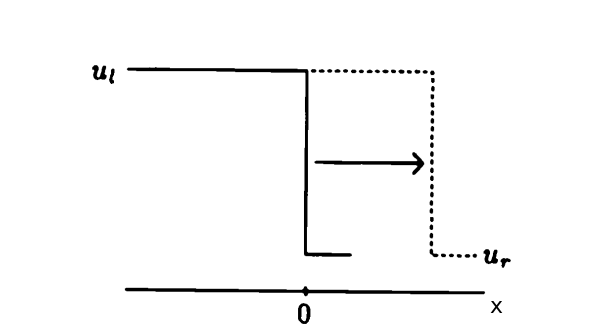

Karakteristik Eğriler

Üstteki çözümü anlamak, hatta ona ulaşmak için karakteristik eğriler faydalı
oluyor. Karakteristik eğrilerle $x,t$ ilişkisine odaklanıyoruz, $u$'nun zamana
göre değişmediği duruma bakıyoruz (yani $\mathrm{d} u / \mathrm{d} t = 0$) ve bu başlangıçtan
bir $\mathrm{d} x / \mathrm{d} t$ türevine erişmeye uğraşıyoruz, ve seçilen bazı başlangıç
noktaları ve sabit bir eğim için ortaya çıkan grafiği inceliyoruz. Türev basit
bir dalga denkleminde,

$$
x'(t) = a, \quad x(0) = x_0
$$

olur daha çetrefil dalgalarda farklı. $\mathrm{d} x / \mathrm{d} t$ elde etmek için $t$ ve $x$
değişkenleri olduğunu ve $x = x(t)$ olduğunu hatırlayalım, yani $u = u(x,t) =
u(x(t),t)$ olur. İki değişkenli fonksionlar üzerinde genel zincirleme kanununu
[10]'da gördük, mesela $g(x(t),y(t))$ için $\mathrm{d} g / \mathrm{d} t$

$$
\frac{\mathrm{d} g}{\mathrm{d} t} =
\frac{\partial g}{\partial x} \cdot \frac{\mathrm{d} x}{\mathrm{d} t} +
\frac{\partial g}{\partial y} \cdot \frac{\mathrm{d} y}{\mathrm{d} t} 
$$

İki değişkenli $u$'nun zamana göre türevi o zaman [9, sf. 17],

$$
\frac{\mathrm{d}}{\mathrm{d} t} u (x(t),t)) =
\frac{\partial u}{\partial x} \frac{\mathrm{d} x}{\mathrm{d} t} +
\frac{\partial u}{\partial t} \cancelto{1}{\frac{\mathrm{d} t}{\mathrm{d} t}}
$$

$$
\frac{\mathrm{d}}{\mathrm{d} t} u (x(t),t)) =
\frac{\partial u}{\partial x} \frac{\mathrm{d} x}{\mathrm{d} t} +
\frac{\partial u}{\partial t}
$$

Üsttekini sıfıra eşitlersek, 

$$
u_t  + u_x x'(t) = 0
$$

(2a)'yı hatırlayalım ve üstteki formülle eşleştirelim, Burgers denklemi için
$x'(t) = u$ elde ederdik. Karakteristik diferansiyel denklemi,

$$
x'(t) = u(x(t),t), \qquad x(0) = x_0
$$

Not: İki üsttekini (5) ile eşleyerek

$$
f'(u) = \frac{\mathrm{d} x(t)}{\mathrm{d} t}
$$

karakteristik diferansiyeli de doğru.

Bu denklemi grafiklemek için $t,x$ yerine $x,t$ bazlı düşünmek daha iyi (bir
önceki grafikle alakayı görmek için, her iki grafikte $x$ değişkeni yatay
kordinatta oluyor) altta bir başlangıç $x_0$ seçiyoruz, ve buradan yukarı doğru
$u(x_0)$ eğiminde (çünkü $'x = u$ demiştik) bir çizgi gidiyor. Ama dikkat hayal
etmek için eğimi tersine çevirmek lazım, giriş Calculus'ta eğimler $y/t$, $z/t$
bazında düşünülür burada $t/x$.

Devam edelim, ayrıca Riemann problemi çözdüğümüzü unutmayalım, $u$ değerleri
değişik $x$ noktalarında bir değerden diğerine geçiyor, bir $u_L$ var, bir de
$u_R$ var, eğimler bu değerleri yansıtmalı. Grafikleme sonrası,

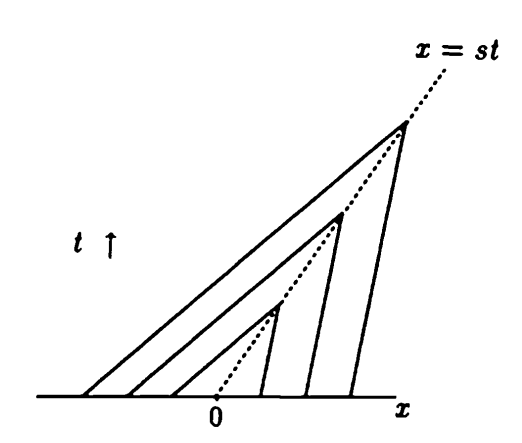

O zihindeki ters çevirme işleminden önceki hali göstermek gerekirse, alttaki gibi

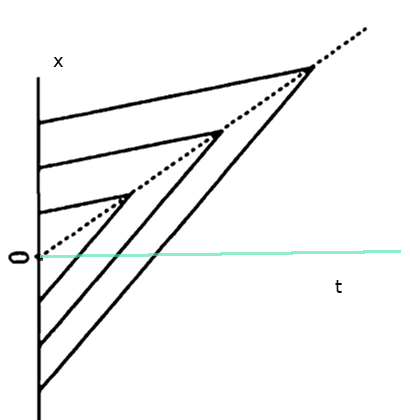

Görüldüğü gibi sıfırdan küçük $x$'ler için $u_L$ devrede orada bizim klasik
bildiğimiz eğim daha fazla, sıfırdan yukarı çıkınca eğim azalıyor, çünkü
orada $u_R$ daha küçük.

Şimdi iki üstteki ana grafiğe tekrar bakarsak, orada bir problem gözüküyor
[11, 10:13]. Soldan gelen ve sağdan gelen karakteristikler kesişiyor. O zaman
o noktada iki çözüm olurdu. Bu nasıl mümkün olabilir ki? Doğanın o noktada
yaptığı şudur; oraya bir şok yerleştirmek, o bölgeyi bir şok bölgesi haline
getirmek. O bölgede, çizgi üzerinde eğim $s$ olacak ve bu $s$ aslında $u_L$
ve $u_R$'nin ortalaması.

$st$ değeri nereden geliyor? $x,u$, $x,t$ grafiklerini $x$'ler çakışacak şekilde
alt alta gösterelim, ve $x,t$ grafiğinde bir $t$ noktası işaretleyelim (yatay
çizgi), O çizginin şok bölgesini kestiği yerden aşağı doğru $x,u$ grafiğine
inelim, alttaki grafikte o noktadaki $u$ değeri $t$ anındaki çözüm $u(x,t)$.

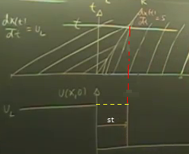

O noktada katedilmiş mesafe $st$ çünkü o noktada $x'(t) = s$. Bu işlemi daha
önceki $t$ zamanları için yaparsak, kesikli sarı çizgi ortaya çıkacaktır. Bu da
dalganın sağa doğru akışını gösteriyor bir bakıma.

Şok hızını cebirsel bulalım. Daha önce tek boyutlu lineer taşınım akımı
(convection) ile gördüğümüz durum burada da var, orada çözüm $u(x,y) =
u_0(x-ct)$ idi, dalga hızı $c$. Şimdi hız $u$ bu $s$ şok hızınını verir, Burgers
için hesabı $s = (u_l + u_r) / 2$.  Şok hızının hesabı için kesinti bölgesinin
yeterince uzağında $M$ ve $-M$ noktalarını seçelim, bu iki nokta arasındaki
toplam kütlenin / dalganın değişiminin hızı şok hızı $s$ olacaktır.

$$
\frac{\mathrm{d}}{\mathrm{d} t} \int_{-M}^{M} u(x,t) \mathrm{d} x = f(u_l) - f(u_r)
\qquad (8)
$$

Salt entegralin nasıl hesaplanacağına bakarsak [3, sf. 31],

$$
\int_{-M}^{M} u(x,t) \mathrm{d} x =
\int_{-M}^{st} u_l \mathrm{d} x + 
\int_{st}^{M} u_r \mathrm{d} x
$$

$$
= (M+st)u_l + (M-st)u_r
$$

Şimdi zaman türevini geri koyalım, bu sağ tarafta $s(u_l-u_r)$ verir, hepsi
bir arada,

$$
\frac{\mathrm{d}}{\mathrm{d} t} \int_{-M}^{M} u(x,t) \mathrm{d} x = s(u_l-u_r)
$$

(8)'in sağ tarafını üstteki formüle koyunca,

$$
f(u_l) - f(u_r) = s(u_l-u_r)
$$

$$
s = \frac{f(u_l) - f(u_r)}{u_l-u_r}
$$

Böylece genel bir ifade elde ettik. Burgers denklemi özelinde,
$f(u) = u^2 / 2$ olduğuna göre,

$$
f(u_l) - f(u_r) = \frac{1}{2} u_l^2 -  \frac{1}{2} u_r^2
$$

O zaman

$$
\frac{1}{2} (u_l + u_r)(u_l - u_r) = s(u_l-u_r)
$$

diyebiliriz [5, sf. 46], basitleştirince,

$$
s = \frac{1}{2} (u_l + u_r)
$$

Seyreltilmiş Dalga

İkinci seçenek, seyreltilmiş dalga sonucu, bu zayıf çözüm başlangıçta
$u_l < u_r$ olduğu zaman ortaya çıkıyor.

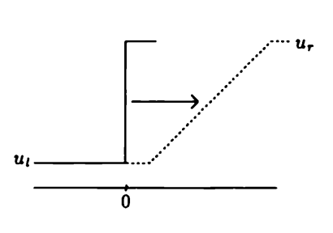

Daha önceki formu tekrarlarsak, karakteristik ve $x,u$ grafiği alt alta,

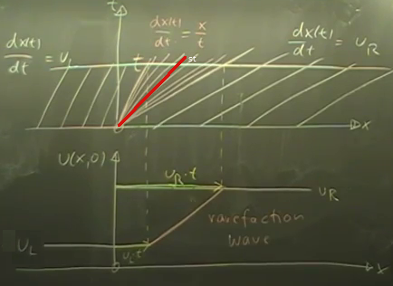

Bu grafikte karakteristik çizgilerini bulmak kolay değil, $u_L$, $u_R$ kısımları
yapılabilir ama ortadaki kısmı anlamak için bu sefer $x,u$ grafiğinden dönerek
$x,t$'ye gitmek gerekiyor. Altta $u_R \cdot t$ ve $u_L \cdot t$ noktaları
bulunduktan sonra doğal olan onların düz çizgi ile birleştirilmesidir, bu çizgi
de karakteristiklerdeki o yayılma (fan) şeklini ortaya çıkartır, tam ortasnda da
tabii ki şok cizgisi olacaktır. 

Bir çözüm, ki zayıf çözümlerde (bu konu ileride işlenecek), alttaki gibi olabilir,

$$
u(x,t) =
\left\{ \begin{array}{ll}
u_l & x < u_l t  \\
x/t & u_l t \le x \le u_r t \\
u_r & x > u_r t
\end{array} \right.
$$

Sağ taraf yine daha önce olduğu gibi şu hale çevirilebilir (ki birazdan
görülecek kodu anlamak için de bu form faydalı)

$$
u(x,t) =
\left\{ \begin{array}{ll}
u_l & x/t < u_l \\
x/t & u_l \le x/t \le u_r  \\
u_r & x/t > u_r 
\end{array} \right. 
$$

Çözümün Burgers denklemi için doğru olduğunun sağlamasını yapabiliriz, 
[9, sf. 34], mesela orta şart $u_l \le x/t \le u_r$ kısmına bakalım,
bu çözümü (2a)'ya sokarsak,

$$
\frac{\partial u}{\partial t} + u \frac{\partial u}{\partial x} =
\frac{\partial }{\partial t} \left( \frac{x}{t}  \right) +
\frac{x}{t} \frac{\partial }{\partial x} \left( \frac{x}{t}  \right) =
-\frac{x}{t^2} + \frac{x}{t} \frac{1}{t} = 0
$$

İlk ve üçüncü şartın çözüm olduğu bariz çünkü sabit sayılar, ve türevleri
alınırken sıfırlanacaklar.

Entropi

Aslında üstteki seyreltilmiş dalga çözümü tek mümkün çözüm değil. Bu çözüm bir
zayıf çözüm (ileride göreceğiz) bu sebeple özgün değiller. Mesela $u_L = 0$,
$u_R = 1$ örnekleri üzerinden alttakiler de birer çözüm olabilirdi [4, sf. 27],


Çözümler soldan sağa doğru,

$$
u(x,t) =
\left\{ \begin{array}{ll}
0 & x < \frac{1}{2} t  \\
1 & x > \frac{1}{2} t  \\
\end{array} \right.
$$

Hız $s$ tabii ki daha önceki formülden hesaplandı, 

$$
s = \frac{u_R^2 / 2 - u_L^2 / 2 }{u_R - u_L} = 1/2
$$

Ve

$$
u(x,t) =
\left\{ \begin{array}{ll}
0 & x < \frac{1}{3} t  \\
\frac{2}{3} & \frac{1}{3} t < x < \frac{5}{6} t  \\
1 & x > \frac{5}{6} t  
\end{array} \right.
$$

Fakat bu çözümler fiziksel değildir. Niye? Çünkü grafiklere dikkat edersek
her iki durumda da bazı karakteristik çizgiler *şoktan* dışarı çıkıyorlar,
kıyasla en başta ilk karakteristik grafiğinde karakteristikler şoka doğru
gidiyorlar. Karakteristikler bir anlamda bilgi akışının temsil ediyorlar,
deterministik bir denklemi baz alan bir evrimsel, dinamik denklem her zaman
başlangıç verisinden başlayarak ileri gitmelidir. Fakat hemen üstteki iki
çözümde şok noktasında yeni bilgi yaratılıyor. Bir diğer açıdan [6, sf. 35]
belirtmek gerekirse, istediğimiz, bir karakteristiği zamanı geriye sararak
başlangıç şartına bağlayabilmektir. Üstteki iki çözümde bunu yapmak mümkün değil. 

Animasyon

Altta Burgers denkleminin şok ve seyreltilmiş dalga formu için çözümlerini
animasyon olarak bulabiliriz.

```python
def qf(q): return 0.5*q*q
    
def exact_riemann_solution(xi,u_l,u_r):
    # Shock wave
    if u_l > u_r: 
        shock_speed = (qf(u_l)-qf(u_r))/(u_l-u_r)
        q = (xi < shock_speed)*u_l \
          + (xi >=shock_speed)*u_r
        return q
    # Rarefaction wave
    else:  
        q = (xi<=u_l)*u_l \
          + (xi>=u_r)*u_r \
          + (u_l<xi)*(xi<u_r)*xi
        return q
```

```python
def shock():
    u_l, u_r = 5.0, 1.0

    for i,t in enumerate(np.linspace(0,1,6)):
        outfile = 'rieout/shock-%02d.png' % i
        fig, ax = plt.subplots(figsize=(5, 3))
                    
        x = np.linspace(-4, 4, 1000)
        
        q = np.array([exact_riemann_solution(xi/(t+1e-10),u_l,u_r) for xi in x])

        ax.set_xlim(-4,4)

        ax.plot(x,q,'-k',lw=2)

        ax.set_title('t=%f' % t)
    
        plt.savefig(outfile)

shock() 
```


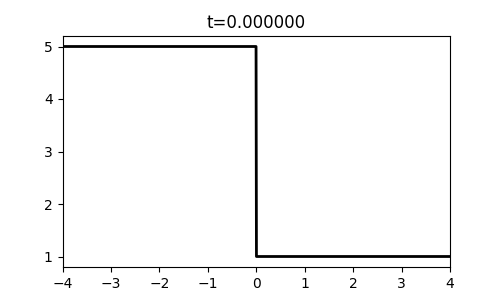

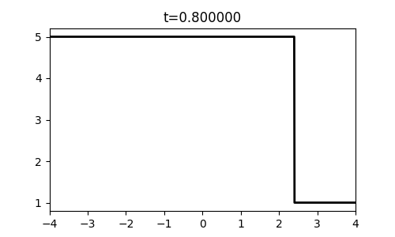


```python
def rarefaction():
    u_l, u_r = 2.0, 4.0
    
    for i,t in enumerate(np.linspace(0,1,6)):
        outfile = 'rieout/rarefaction-%02d.png' % (t*10)

        fig, ax = plt.subplots(figsize=(5, 3))
                    
        x = np.linspace(-4, 4, 1000)
        
        q = np.array([exact_riemann_solution(xi/(t+1e-10),u_l,u_r) for xi in x])

        ax.set_xlim(-4,4)

        ax.plot(x,q,'-k',lw=2)
    
        ax.set_title('t=%f' % t)

        plt.savefig(outfile)

rarefaction()
```


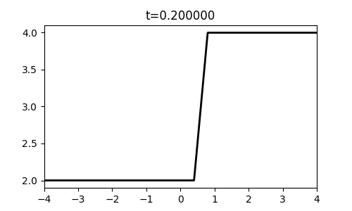

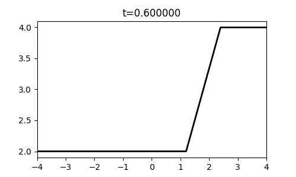

Animasyon olarak

```python
! convert -delay 20 -loop 0 rieout/shock*.png shock.gif
```

```python
! convert -delay 20 -loop 0 rieout/rare*.png rarefaction.gif
```

Animasyon sonuç dosyaları [7] ve [8]'de bulunabilir.

Amaç bir diferansiyel denklemi sayısal olarak çözmek. Metot olarak sonlu
farklılık (finite difference -FD-) yöntemi daha önce işlendi, bu yöntemde bir
sürekli fonksiyonun değerlerini ayrıksal noktalar üzerinden temsil etmeye
uğraşıyorduk.  Bu noktalar bir ekseni eşit aralıklara bölerek ortaya
çıkartılıyordu, mesela altta görülen bir tepeyle başlayıp inen $f$ fonksiyonu
$i-2,i-1,i,..$ noktalarında $x_i$ değerleri üzerinden $u_i = u(x_i)$ ile
tanımlanıyordu.


Sonlu hacim (FV) yönteminde durum biraz farklı; bir fonksiyonu belli
noktalarındaki noktasal değerlerle değil, belli aralıklar arasında kalan
değerlerinin *averajı* olarak temsil ediyoruz.


Farklı bir grafik

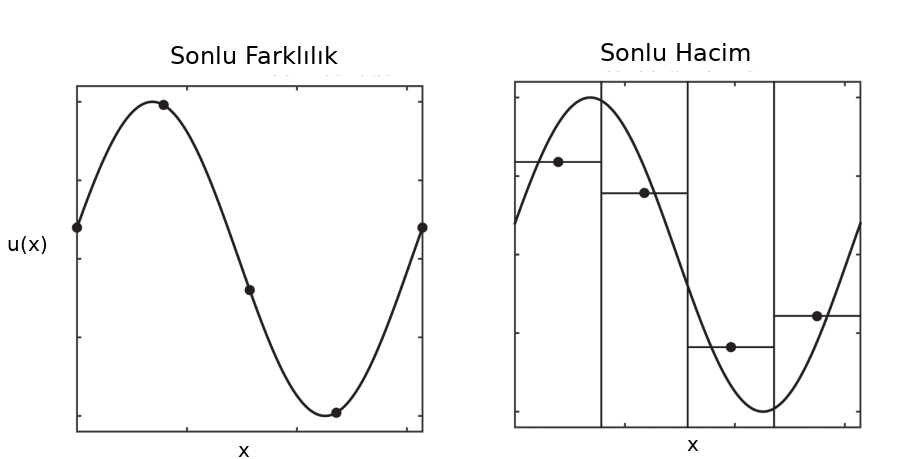

İki üstte görülen grafikte mesela $i$ ile $i+1$ noktası ortasındaki $i+1/2$
noktası ve $i$ ile $i-1$ noktası ortasındaki $i-1/2$ arasında kalan fonksiyonun
averajı alınacak, ona $< u_i >$ ya da $\overline{u}_i$ diyoruz.

$$
\overline{u}_i = \frac{1}{\Delta x} \int_{x_{i-1/2}}^{x_{i+1/2}} u(x) \mathrm{d} x
$$

Dikkat; $i-1,i-2$ değerleri $i$ referanslı olduğu için eksi içerikli, $i=4$
olsaydı onlar $3,2,..$ diye gidebilirdi. Ayrıca FD yönteminin aksine, indis
değerlerine tekabül eden $x_i,x_{i+1}$ değerleri herhangi bir yerde olabilir,
böylece eşit aralıklı olmayan ızgaralarla çalışmamız mümkün olur, bu FV
yönteminin kuvvetlerinden biri. 

Gerçi biz bu anlatımda ve kodda eşit aralık farz edeceğiz, $\Delta x$, $h_x$
burada devreye girer. 

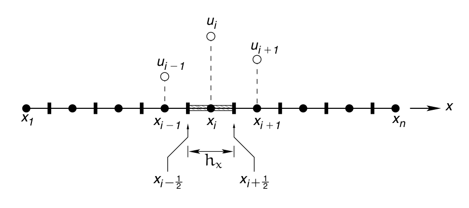

Muhafaza Kanunu Hesaplamak

Notasyonda $f$ akış (flux) için kullanılır [14], $\Delta x$ için $h_x$,

$$
\overline{u}_i =  \frac{1}{h_x} \int_{x_{i-1/2}}^{x_{i+1/2}} u(x) \mathrm{d} x
\qquad (1)
$$

[17] yazısında muhafaza kanununun entegral formunu görmüştük,

$$
\int_{x_1}^{x_2} \rho(x,t_2) \mathrm{d} x =
\int_{x_1}^{x_2} \rho(x,t_1) \mathrm{d} x  +
\int_{t_1}^{t_2} \rho(x_1,t) v(x_1,t) \mathrm{d} t -
\int_{t_1}^{t_2}  \rho(x_2,t) v(x_2,t) \mathrm{d} t
$$

$f(\rho) = \rho(x,t) v(x,t)$ denebilir, ya da herhangi daha genel olarak $\rho$
yerine herhangi bir ölçüm $u$ için $f(u) = u(x,t) v(x,t)$, o zaman, ve
biraz yer değişim sonrası,

$$
\int_{x_1}^{x_2} u(x,t_2) \mathrm{d} x -
\int_{x_1}^{x_2} u(x,t_1) \mathrm{d} x  +
\int_{t_1}^{t_2} f(x_2,t) \mathrm{d} t  -
\int_{t_1}^{t_2} f(x_1,t) \mathrm{d} t = 0
$$

Bu formülü her sonlu hacim hücresi için kullanacağız. Zaman indisleri $t,t+1$
olacak, üstte $t_1,t_2$ yerine. Yer için $x_1,x_2$ yerine bir $j$ indisi
merkezli $x_{j-1/2}$ ve $x_{j+1/2}$. Devam edelim, $u(x_1,t_1)$ içinde
$x_{j-1/2}$ ve $t_l$ oluyor, (zaman $l$ indisi) ona da $u_{j-1}^l$
diyelim. $x_2$ yerine $x_{j+1/2}$, sonuncuda zamanın hala değişken olduğu durum
$u_{j+1}$ olsun. Eğer $x$ değişken ise, zaman indisi $t_2 = t_{l+1}$ için
$u^{l}$. Üstteki formülü bu notasyonla değiştirip istenen zaman ve yer
aralıklarına uygularsak,

$$
\int_{x_{j-1/2}}^{x_{j+1/2}} u^{l+1} \mathrm{d} x -
\int_{x_{j-1/2}}^{x_{j+1/2}} u^{l} \mathrm{d} x  +
\int_{t_l}^{t_{l+1}} f(u_{j+1/2}) \mathrm{d} t  -
\int_{t_l}^{t_{l+1}} f(u_{j-1/2}) \mathrm{d} t = 0
$$

Her şeyi $h_x$ ile bölelim,

$$
\frac{1}{h_x} \int_{x_{j-1/2}}^{x_{j+1/2}} u^{l+1} \mathrm{d} x -
\frac{1}{h_x} \int_{x_{j-1/2}}^{x_{j+1/2}} u^{l} \mathrm{d} x  +
\frac{1}{h_x} \int_{t_l}^{t_{l+1}} f(u_{j+1/2}) \mathrm{d} t  -
\frac{1}{h_x} \int_{t_l}^{t_{l+1}} f(u_{j-1/2}) \mathrm{d} t = 0
$$

Bu formülde (1)'de tanımlanan ortalama formunu görüyoruz, kısaltma amaçlı
$\overline{u}_{j,l}$ notasyonu oralarda kullanabiliriz,

$$
\overline{u}_{j,l+1} - \overline{u}_{j,l} + 
\frac{1}{h_x} \int_{t_l}^{t_{l+1}} f(u_{j+1/2}) \mathrm{d} t  -
\frac{1}{h_x} \int_{t_l}^{t_{l+1}} f(u_{j-1/2}) \mathrm{d} t = 0
$$

Şimdi son iki terime dikkat edelim, bu iki entegral zaman üzerinden alınıyor,
fakat Riemann problemini hatırlarsak çözüm $u(x,t)$ sadece $x/t$ değişkeni
üzerinden düşünülebilir, ve eğer $x$ değişmiyorsa (ki öyle çünkü üstteki iki
entegral $t$ üzerinden, $x$ aynı) o zaman $\mathrm{d} t$ üzerinden entegral yerine,
sabit $u$ ile bir ayrıksal $h_t$ çarpımı yeterlidir. Öyle ya sabit $u$ üzerinden
ve yine sabit / bilinen $t$ adımı $h_t$ üzerinden alan bir dikdörtgendir, bu
alanın hesabı için çetrefil entegral yerine direk çarpım yeterli.. Mesela ilk
entegral,

$$
\frac{1}{h_x} \int_{t_l}^{t_{l+1}} f(u_{j+1/2}) \mathrm{d} t =
\frac{h_t}{h_x} f(u_{j+1/2})
$$

olarak hesaplanabilir, çünkü $u$ değeri $x = x_{j \pm 1/2}$ üzerinde değişmiyor.
Aynı durum ikinci entegral için de geçerli, o zaman iki üstteki formül

$$
\overline{u}_{j,l+1} = \overline{u}_{j,l} -
\frac{h_t}{h_x} ( f(u_{j+1/2}) - f(u_{j-1/2}) )
\qquad (2)
$$

olacak. Böylece $l$ anındaki $j$ hücresinin ortalamasını bir sonraki zaman adımı
$l+1$'e nasıl aktaracağımızı, oraya geçiş yapacağımızın formülünü bulmuş olduk.

Eğer $\frac{1}{h_x} \int_{t_l}^{t_{l+1}} f(u_{j+1/2}) \mathrm{d} t$ entegralini
entegral içindekiler çarpı $h_t$ ile gösterebiliyorsak, tüm
entegrali $h_t$ ile bölmek bize yaklaşık, "sayısal'' bir $f(u_{j+1/2})$
verecektir, ona büyük harf ile $F_{j+1/2}^l$ diyelim, formülü [16, sf. 103]

$$
F_{j+1/2}^l = \frac{1}{h_t} \int_{t_l}^{t_{l+1}} f(u_{j+1/2,l}) \mathrm{d} t
$$

$F$'ye sayısal akış (numerical flux) ismi de veriliyor. O zaman (2) formülü
"akış diferansiyel formunda'' da yazılabilir,

$$
\overline{u}_{j,l+1} = \overline{u}_{j,l} -
\frac{h_t}{h_x} ( F_{j+1/2,l} - F_{j-1/2,l} )
$$

Sayısal akışı elde etmek için bize bir sayısal $u$ lazım, bunu FV ile bulacağız,
sonra bu $u$'ları bildiğimiz $f()$ akışına verince sayısal $F$ elde edilecek.

Bu kod alttaki gibidir,

```python
import scipy.integrate as integrate
import matplotlib.pyplot as plt
import numpy as np

alpha = 0.0
beta  = 1.0

def init(z, alpha, beta):
    return alpha + beta*np.sin(z)

# 
#  u_t + f(u)_x = 0 denklemi icin akis (flux) fonksiyonu 
#
def flux(u):
    return 0.5*u**2

def godunov_flux(uval):
    fhat = np.zeros((len(uval),1))

    for i in range(0,len(uval)-1):
        ul = uval[i]; ur = uval[i+1]

        s=(ul+ur)/2;
        if ul > ur:
            if s < 0:
                fhat[i] = flux(ur)
            else:
                fhat[i] = flux(ul)
        elif ul < ur:
            if ur < 0:
                fhat[i] = flux(ur)
            elif ul > 0.:
                fhat[i] = flux(ul)
            else:
                fhat[i] = 0
                
    return fhat

a = 0
b = 2*np.pi
N  = 80
T = 2.0

x = np.linspace(a,b,N)     
dx = (b-a)/(N-1);  
u = np.zeros((len(x)-1,1)); 

for i in range(0,N-1):
    u[i] = (1.0/dx)*integrate.quad(init, x[i], x[i+1], args=(alpha,beta))[0]

dt = dx/(2*np.amax(np.amax(u)))

t = 0.0
i = 0
while t < T:
    fR = godunov_flux(u) 
    fL = np.roll(fR,1)
    u -= dt/dx*(fR - fL)
    t = t+dt
    i += 1

    if i % 5 == 0:
        plt.figure()
        plt.plot(u)
        plt.ylim(-1,1)
        plt.savefig('/tmp/out-%03d.png' % i)
        plt.close('all')
```

Kodda ilk önce başlangıç fonksiyonu tanımlandı, içinde sinüs olan `init`
bu; Bu fonksiyonun hücre bazında `integrate.quad` ile entegrali alındı,
böylece her hücreyi temsil eden o tek değeri elde ettik.


FV yöntemi bundan sonra o hücreler üzerinden hesabını yapacak, dinamik denklemi
zamanda ilerletirken bunun hücrelerdeki o temsili değer üzerinden yapacak.

Hücrelerin FV matematiği şöyle; mesela yanyana iki hücreye bakarsak, üstteki
resimde $x_{i-2}$ ve $x_{i-1}$ diyelim, soldan ilk iki hücre, bu iki değer sanki
bir Riemann problemini andırmıyor mu? Evet; ve Godunov'un icat ettiği FV çözümü
için kullanılan teknik te zaten budur. İki hücre ortasındaki $x_{i-1/2}$ noktası
hücre sınırı kabul edilir ve önceki sonraki değerler $u_L$ ve $u_R$ imiş gibi
Riemann çözümü işletilir. Bu işlem tüm yanyana hücreler için işletilince bir
zaman dilimi çözümü elde edilir, sonraki zaman dilimi için bu işlem tekrar
baştan hesaplanır.

Şimdi $x_{i}$ ile $x_{i+1}$ arasındaki $x_{1+1/2}$ sınırını baz alıp, önce
gördüğümüz Riemann çözümünü baz alarak şunu yazalım [16, sf. 109],

$u_i^l \ge u_{i+1}^l$ için,

$$
u^\star_{i+1/2} = 
\left\{ \begin{array}{lll}
u_i^l & \textrm{eğer} & s > (x-x_{i+1/2}) / t  \\
u_{i+1}^l & \textrm{eğer} & s < (x-x_{i+1/2}) / t
\end{array} \right.
$$

Daha önce gördük $s$ dalga hızı, bu örnekte $s = (u_i^n + u_{i+1}^n)/2$.

$u_i^l < u_{i+1}^l$ için,

$$
u^\star_{i+1/2} = 
\left\{ \begin{array}{lll}
u_i^l & \textrm{eğer} & (x-x_{i+1/2})/t \le u_i^l   \\
(x-x_{i+1/2})/t & \textrm{eğer} & u_i^l < (x-x_{i+1/2})/t < u_{i+1}^l   \\
u_{i+1}^l & \textrm{eğer} & (x-x_{i+1/2})/t \ge u_{i+1}^l   \\
\end{array} \right.
$$

Bir kez Riemann çözümü elde edilince Godunov sayısal akışı $u^\star_{i+1/2}$ ile
kolayca hesaplanabilir, akış fonksiyonu $f()$ üzerinden $F = f(u^\star_{i+1/2})$.

Üstteki formülleri daha da kolaylaştırmak mümkün, Godunov akışlarını
$x = x_{i+1/2}$ noktasında hesapladığımız için bunu formülde $x$ yerine
koyunca,

$u_i^l \ge u_{i+1}^l$ için,

$$
u^\star_{i+1/2} = 
\left\{ \begin{array}{lll}
u_i^l & \textrm{eğer} & s > 0  \\
u_{i+1}^l & \textrm{eğer} & s < 0
\end{array} \right.
$$

$u_i^l < u_{i+1}^l$ için,

$$
u^\star_{i+1/2} = 
\left\{ \begin{array}{lll}
u_i^l & \textrm{eğer} & 0 \le u_i^l   \\
(x-x_{i+1/2})/t & \textrm{eğer} & u_i^l < 0 < u_{i+1}^l   \\
u_{i+1}^l & \textrm{eğer} & 0 \ge u_{i+1}^l   \\
\end{array} \right.
$$

Kod içinde üstte görülen hesabı tüm hücreler için yaptık, $i$,$i+1$,$i+2$.. ve
$F_{j+1/2,l}$ hesabından bir önceki $F_{j-1/2,l}$, kod içinde önceki `fL`
sonraki `fR`, onun için `np.roll` ile vektör içindeki değerleri bir
ilerleterek önceki ve sonraki hücrelerin aynı hizaya düşmesini sağlıyoruz
böylece $F_{j+1/2,l}-F_{j-1/2,l}$ hesabı kolay bir şekilde `fR-fL`
ile bulunabiliyor.

Belli $t$ anlarından alınmış görüntüler altta bulunabilir.


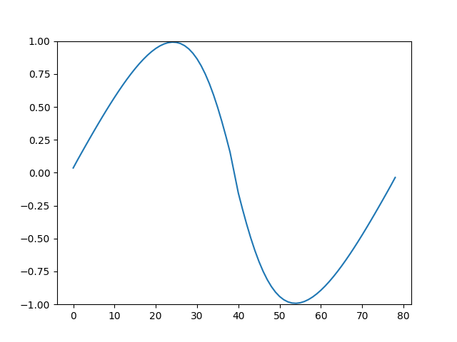

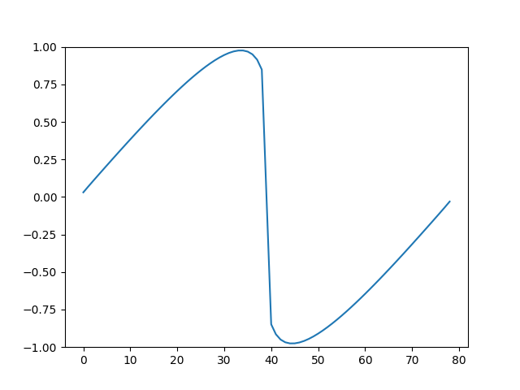

Animasyon [13],

```python
! convert -delay 20 -loop 0 /tmp/out-*.png wave.gif
```
  
Kaynaklar

[1] Bayramlı, *Hesapsal Bilim, Hesapsal Sıvı Dinamiğine Giriş*

[2] Bayramlı, *Fizik, Gazlar, Sıvılar 1*

[3] Leveque, *Numerical Methods for Conservation Laws*

[4] Mishra, *Numerical methods for conservation laws and related equations*

[5] Cooper, *Introduction to PDEs with Matlab*

[6] Hesthaven, *Numerical Methods for Conservation Laws*

[7] Bayramlı, *Animasyon, Şok Dalgası*,
    [https://github.com/burakbayramli/classnotes/raw/master/compscieng/compscieng_bpp50fv/shock.gif](https://github.com/burakbayramli/classnotes/raw/master/compscieng/compscieng_bpp50fv/shock.gif)

[8] Bayramlı, *Animasyon, Seyrelen (Rarefaction) Dalga*
    [https://github.com/burakbayramli/classnotes/raw/master/compscieng/compscieng_bpp50fv/rarefaction.gif](https://github.com/burakbayramli/classnotes/raw/master/compscieng/compscieng_bpp50fv/rarefaction.gif)

[9] Lee, *AM 260, Computational Fluid Dynamics*,
    [https://users.soe.ucsc.edu/~dongwook/wp-content/uploads/2021/am260/html/](https://users.soe.ucsc.edu/~dongwook/wp-content/uploads/2021/am260/html/)

[10] Bayramlı, *Cok Degiskenli Calculus, Ders 11*

[11] Muller, {Learn CFD, Lecture 15 - Part b},
     [https://youtu.be/f8fuMRFZYwQ](https://youtu.be/f8fuMRFZYwQ)

[12] Bayramlı, *Fizik, Gazlar, Sıvılar 2*


[13] Bayramlı, *Animasyon, Godunov Sonlu Hacim Yontemi ile Burgers Denklem Cozumu*
    [https://github.com/burakbayramli/classnotes/raw/master/compscieng/compscieng_bpp50fv/wave.gif](https://github.com/burakbayramli/classnotes/raw/master/compscieng/compscieng_bpp50fv/wave.gif)

[14] Kloeckner, *Numerical Methods for Partial Differential Equations CS555 / MATH555 / CSE510*
    [https://relate.cs.illinois.edu/course/cs555-s20/](https://relate.cs.illinois.edu/course/cs555-s20/)

[16] Lee, *Computational Fluid Dynamics*

[17] Bayramlı, *Fizik, Gazlar, Sivilar - 2*


