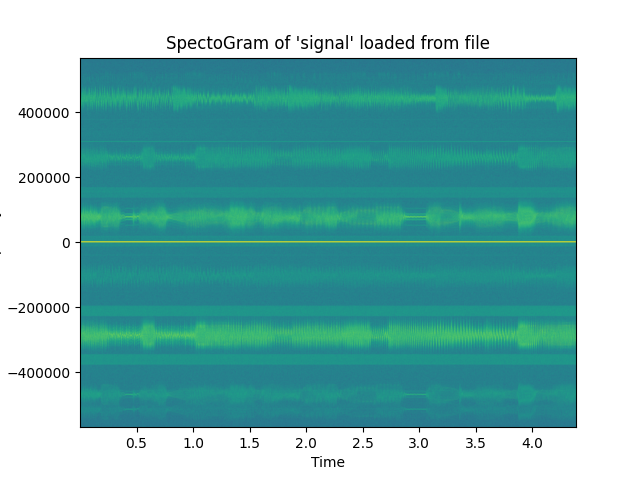
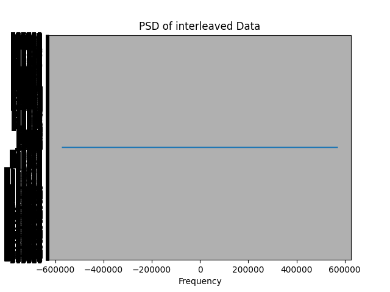
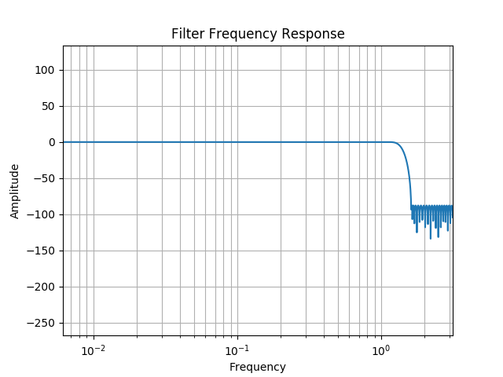
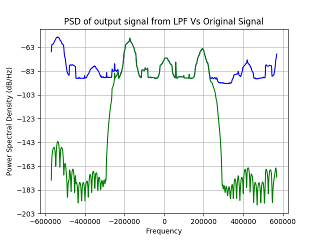
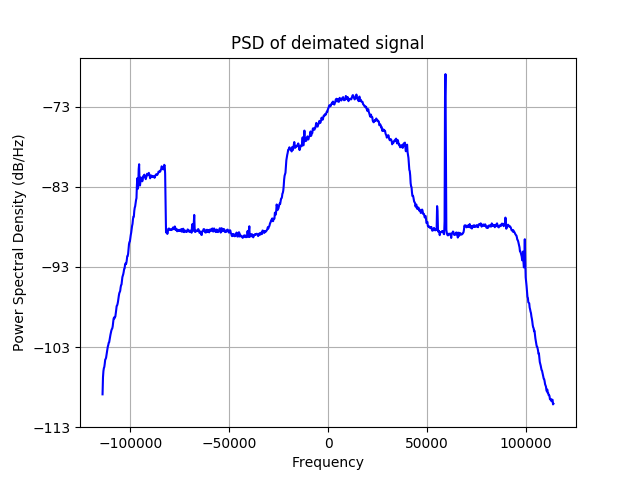
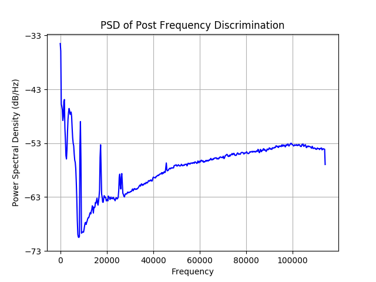
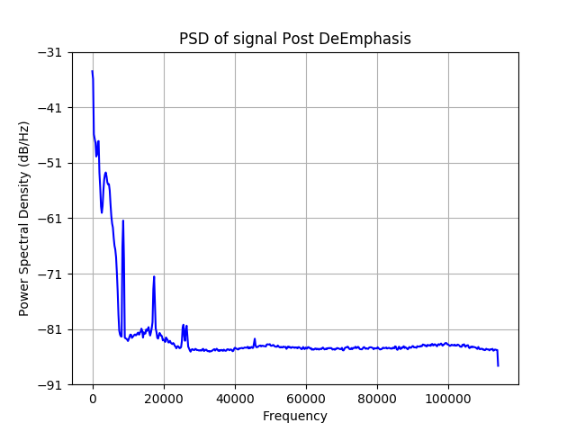

# Radyo Dalgaları


```python
import numpy as np
import matplotlib.pyplot as plt
import scipy.signal as signal
dir = "/opt/Downloads/skdata"
extract_data = np.fromfile(dir + "/fm1.dat",dtype="uint8")
interleavedData = extract_data[0::2] + 1j*extract_data[1::2]
```

```python
plt.title("SpectoGram of 'signal' loaded from file")
plt.xlabel("Time")
plt.ylabel("Frequency")
plt.specgram(interleavedData, NFFT =1024, Fs=1140000)
plt.savefig('compscieng_app60wave_07.png')
```



```python
plt.title("PSD of interleaved Data")
plt.psd(interleavedData, NFFT=1024, Fs=1140000)
plt.savefig('compscieng_app60wave_08.png')
```



```python
calculate_range = max(interleavedData) - min(interleavedData);
data = (interleavedData - min(interleavedData))/ calculate_range
x1 = (data*2) - 1
plt.title("SpectoGram of signal post normalization")
plt.xlabel("Time")
plt.ylabel("Frequency")
plt.specgram(x1, NFFT =1024, Fs=1140000)
plt.savefig('compscieng_app60wave_09.png')
```


```python
plt.title("PSD of normalized signal")
plt.psd(x1, NFFT=1024, Fs=1140000)
plt.savefig('compscieng_app60wave_10.png')
```


```python
Fs = 1140000
fc = np.exp(-1.0j*2.0*np.pi* 250000/Fs*np.arange(len(x1)))
x2 = x1*fc
f_bw=200000
Fs=1140000
n_taps=64
lpf= signal.remez(n_taps, [0, f_bw, f_bw +(Fs/2-f_bw)/4,Fs/2], [1,0], fs=Fs)
plt.xscale('log')
plt.title('Filter Frequency Response')
plt.xlabel('Frequency')
plt.ylabel('Amplitude')
plt.margins(0,1)
plt.grid(which='both',axis='both')
plt.plot(w, 20*np.log10(abs(h)))
plt.savefig('compscieng_app60wave_11.png')
```




```python
w,h = signal.freqz(lpf)
x3 = signal.lfilter(lpf, 1.0, x2)
plt.psd(x2, NFFT=1024, Fs=1140000, color="blue")  # original
plt.psd(x3, NFFT=1024, Fs=1140000, color="green")  # filtered
plt.title("PSD of output signal from LPF Vs Original Signal")
plt.savefig('compscieng_app60wave_12.png')
```



```python
dec_rate = int(Fs/f_bw)
x4 = signal.decimate(x3, dec_rate)
Fs_x4 = Fs/dec_rate
plt.psd(x4, NFFT=1024, Fs=Fs_x4, color="blue")
plt.title("PSD of deimated signal")
plt.savefig('compscieng_app60wave_13.png')
```



```python
y = x4[1:] * np.conj(x4[:-1])
x5 = np.angle(y)
plt.psd(x5, NFFT=1024, Fs=Fs_x4, color="blue")
plt.title("PSD of Post Frequency Discrimination")
plt.savefig('compscieng_app60wave_14.png')
```



```python
d = Fs_x4 * 75e-6   # Calculate the # of samples to hit the -3dB point
r = np.exp(-1/d)   # Calculate the decay between each sample
b = [1-r]          # Create the filter coefficients
a = [1,-r]
x6 = signal.lfilter(b,a,x5)
plt.psd(x6, NFFT=1024, Fs=Fs_x4, color="blue")
plt.title("PSD of signal Post DeEmphasis")
plt.savefig('compscieng_app60wave_15.png')
```



```python
d = Fs_x4 * 75e-6   # Calculate the # of samples to hit the -3dB point
r = np.exp(-1/d)   # Calculate the decay between each sample
b = [1-r]          # Create the filter coefficients
a = [1,-r]
dec_rate = int(Fs/f_bw)
x7=signal.decimate(x6,dec_rate)
x7*= 10000 / np.max(np.abs(x7))               # scale so it's audible
x7.astype("int16").tofile("radio.raw")
```

```
os.system("aplay radio.raw -r 100000.0 -f S16_LE -t raw -c 1")
```

```
os.system("aplay radio.raw -r 45600 -f S16_LE -t raw -c 1")
```

Kaynaklar

[1] *The Basic Facts About Radio Signals*, [https://www.windows2universe.org/spaceweather/wave_modulation.html](https://www.windows2universe.org/spaceweather/wave_modulation.html)

[2] [Veri 1](https://www.dropbox.com/scl/fi/70llfzz03cdtyouxpbqgo/fm1.dat?rlkey=11p5qvp3y7xjitdaj53jkbvef&st=pp97zxq5&raw=1)

[3] [Veri 2](https://www.dropbox.com/scl/fi/dcecslmf7grwle84gc3s2/fm2.dat?rlkey=y0459x5c6ytnt8qcgmbzbd8ch&st=b7g6lplk&raw=1)

[4] Scher, *How to capture raw IQ data from a RTL-SDR dongle and FM demodulate with MATLAB*,[http://www.aaronscher.com/wireless_com_SDR/RTL_SDR_AM_spectrum_demod.html](http://www.aaronscher.com/wireless_com_SDR/RTL_SDR_AM_spectrum_demod.html)

[5] *EE123: Digital Signal Processing*, [http://inst.eecs.berkeley.edu/~ee123/sp14/](http://inst.eecs.berkeley.edu/~ee123/sp14/)

[6] Fund, *Capture and decode FM radio*, [https://witestlab.poly.edu/blog/capture-and-decode-fm-radio/](https://witestlab.poly.edu/blog/capture-and-decode-fm-radio/)

[7] Fund, *Lab 1: Working with IQ data in Python*, [http://witestlab.poly.edu/~ffund/el9043/labs/lab1.html](http://witestlab.poly.edu/~ffund/el9043/labs/lab1.html)

[9] Swiston, *pyFmRadio - A Stereo FM Receiver For Your PC*, [http://davidswiston.blogspot.de/2014/10/pyfmradio-stereo-fm-receiver-for-your-pc.html](http://davidswiston.blogspot.de/2014/10/pyfmradio-stereo-fm-receiver-for-your-pc.html)
