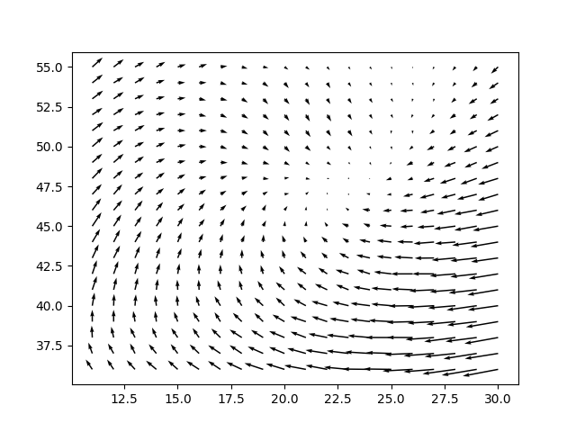

# Vektör Alanları ve Hesaplar

Entegre Edilmiş Kinetik Enerji (Integrated Kinetic Enerji)

Bir kasırganın tahrip edici kuvveti nedir? Katrina, İvan, Ian gibi kasırgalar 1
ila 5 arası sayılar ile kategorize ediliyorlar. Bu sayılar Saffir-Simpson
skalasıyla, ölçüm sistemiyle alakalı, bu sisteme göre fırtanın bir dakika
içindeki en yüksek ani rüzgarı (gust) ölçülür, ve tüm fırtına bu ölçüme göre
kategorize edilir [1].

Bu sayının problemi kasırgayı sadece varabildiği en yüksek rüzgar hızı üzerinden
ölçmesi. Bu en yüksek hızın ölçülmesinin teknik olarak çıkarttığı problemler bir
yana, bu sayı bize fırtınanın kapladığı alan ve bu alan içinde rüzgar şiddetinin
nasıl dağıldığı hakkında hiçbir şey söylemiyor.

Camille ve Katrina örneklerini düşünelim, birincisinde şiddetli rüzgarlar var
ama ufak alana odaklı, ikincisinin en yüksek rüzgar hızı daha az olmasına rağmen
daha geniş alana yayılı ve SS skalasında daha küçük bir kasırga olarak geçiyor.
Fakat Katrinanın çok daha zarar verici olduğunu biliyoruz.

Acaba daha iyi bir ölçüm olamaz mı? Kasırgalar tehlikelidir çünkü ittikleri,
hareket ettirdikleri hava bloklarında kinetik enerji vardır. Daha az yoğun olsa
da havanın bir kütlesi var, günlük hayatta fazla düşünmesek bile bu kütle yeteri
kadar hiza ulaştığında etraftaki nesnelere çarpıp onları darmadığın
edebiliyorlar, ağaçlar, binalar, ve bunu yaparken bir enerji transferi
gerçekleştirmiş oluyorlar.

Bazı bilimciler bu sebeple SS skalası yerine İKE adlı bir hesabı tercih
ediyorlar. Bu hesap

$$
IKE = \int_v \frac{1}{2} \rho U^2 dV
$$

ile yapılır, $v$ hacim, $\rho$ yoğunluk, $U$ ise hızdır. Aslında burada yapılan
standart $1/2 m v^2$ hesabının bir çeşidi (son $v$ hız, hacim değil). Üstteki
formül enerji hesabını tüm rüzgar vektör alanı üzerinden entegre ediyor, yani
sonsuz ufak alanların hızları üzerinden enerji hesaplayıp bunları topluyor,
sayısal bağlamda elimizde sonlu sayıda kutular olacak, her kutu içindeki hava
miktarını biliyoruz. Bu kutunun içindeki kütleyi referans alabiliriz, kütle
hesabı için aslında tek alan hesabı yeterli olacak çünkü hava yoğunluğu olarak 1
$kg/m^3$ farzedeceğiz, kutu yüksekliği olarak 1 metre, böylece kutu alanı hesabı
sonrası çarpı 1 $kg/m^3$ ve çarpı 1 metre ile aynı sayıdır, kütleyi direk
alandan elde etmiş oluruz.

Her kutu içindeki rüzgar hızı yatay ve dikey bileşenleri $u,v$ ile gelecek, $hız
= \sqrt{u^2+v^2}$ ile hız hesaplanabilir ya da, nasıl olsa hız karesi enerji
için lazım, $u^2+v^2$ yeterli. 0.5 çarpı hız karesi çarpı üstte bahsedilen
kütleyi çarpıp bunu kasırganın etkili olduğu coğrafyadaki tüm kutular için
yapıp toplarsak kasırga İKE'sini elde etmiş oluruz 

Katrina fırtınası IKE hesabı için NOAA kurumundan gerekli veriyi alabiliriz.
Script `wdata.py` içinde enlem 25 boylam -90 noktasında 2005 yılı Ağustos
30 tarihindeki 1400 x 1400 km büyüklüğündeki bir alanın rüzgar verisini indirmek
için gerekli kodlar var. Bu kodlar işletildi ve gerekli veri `'uwind.npz`,
`'vwind.npz` içinde.

```python
u_wind = np.load('uwind.npz')['arr_0']
v_wind = np.load('vwind.npz')['arr_0']
# ufak bir bolgeyi grafikle
xx,yy = np.meshgrid(np.linspace(1,59,59),np.linspace(1,60,60))
mi,mj = np.meshgrid(np.array(range(35,55,1)),np.array(range(10,30,1)))
plt.quiver(xx[mi,mj],yy[mi,mj],u_wind[mi,mj],v_wind[mi,mj])
plt.savefig('compscieng_xpp01vec_01.png')
```



Tüm veri üzerinden IKE hesabını yapalım şimdi,

```python
gi,gj = u_wind.shape
cell_count = gi*gj
area = 2000*1e9 # m2, bu alani veriyi alirken tanimlamistik
cell_area = area / cell_count

wspeedsquare = u_wind**2+v_wind**2
wspeedsquare = wspeedsquare.reshape(-1)
wspeedsquare = wspeedsquare[wspeedsquare > 30.0]
IKE = np.sum(0.5*wspeedsquare*cell_area) / 1e12
print (np.round(IKE,2), 'terrajoule')
```

```
340.98 terrajoule
```

Bu enerji Camille fırtınasının enerjisinden daha fazladır. 


Kaynaklar

[1] *Wired*, [https://www.wired.com/2012/11/what-is-the-true-measure-of-a-storm](https://www.wired.com/2012/11/what-is-the-true-measure-of-a-storm)


