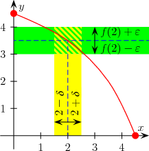
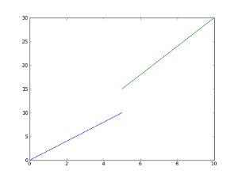
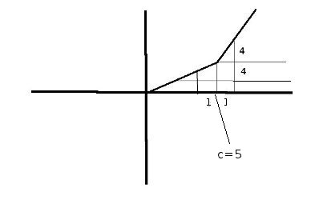
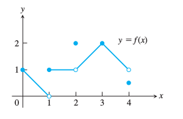
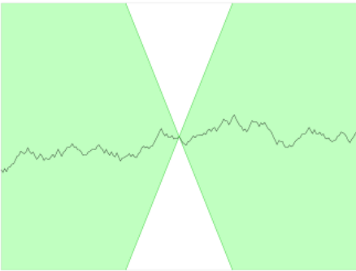
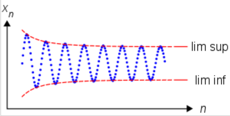

# Ders 2

Süreklilik

Tanım

$S \subset \mathbb{R}$, $f: S \to \mathbb{R}$ bir fonksiyon olsun, ve $c \in S$
bir sayı olsun. "$f$'in $c$'de sürekli olduğu'' söylenir, şu durumda: Eğer her
$\epsilon>0$ için bir $\delta > 0$ var ise, öyle ki ne zaman $x \in S$ ve $|x-c|
< \delta$ işe, o zaman $|f(x) - f(c)| < \epsilon$ doğrudur.

Eğer $f: S \to \mathbb{R}$ her $c \in S$ için doğru ise, yani bir $c$ noktası
değil tüm $c$'ler için geçerli ise, o zaman $f$'in sürekli olduğunu
söyleriz. Yani nokta belirtmeye ihtiyaç kalmaz.

Üstteki tanım Analizde doğru anlaşılması gereken en önemli teorilerden biridir,
ve tam anlaması pek kolay olmayabilir. Dikkat edilirse $\delta$, hem
$\epsilon$'a hem de $c$'ye bağlı. Yani her $c \in S$ için aynı $\delta$
seçilmiyor.

Ayrıca sürekli fonksiyonların tanımının limitlerin tanımına benziyor olması
raslantı değil, sürekli fonksiyonların önemli bir özelliği zaten onların düzgün
limitleri olmaları.

Tanımın işlemesinde mutlak değer (absolute value, $||$ işareti) kritik bir rol
oynuyor. Grafiksel olarak şöyle gösterebiliriz. Bir fonksiyonun değerleri
etrafında, yukarı, aşağı olmak üzere $\epsilon$ kadar bir pencere tanımlıyoruz
(yeşil olarak görülen bölüm). Şimdi örnekte $c=2$ etrafında, yani $x$ bazında
öyle bir başka pencere tanımlayalım ki, bu penceredeki değerler tamamen yeşil
kısıma tekabül eden değerlerin içinde kalsın. Bu şekilde tek bir pencere
bulabildiğimiz anda iş tamamdır. Ve bunu tüm $\epsilon > 0$ için yapabiliyorsak,
o fonksiyon sürekli demektir.

Diğer yandan üstteki grafikte gösterilen 

$$ 
f(x) = 
\left\{ \begin{array}{ll}
x < 5 & 2x \\
x \ge 5 & 3x
\end{array} \right.
$$

fonksiyonu sürekli değildir. Eğer $c=5$ etrafında $\epsilon = 4$ alırsak mesela,
bu pencereye tekabül eden bir $\delta$ bulamayız. Fakat şu fonksiyon süreklidir.

$$ 
f(x) = 
\left\{ \begin{array}{ll}
x < 5 & 2x \\
x \ge 5 & 3x + 10
\end{array} \right.
$$

Fonksiyonun pürüzsüz (smooth) olmadığına dikkat, yani iki parçalı bir fonksiyon,
kesikli bir şekilde tanımlı, ama yine de sürekli.

Süreklilik için limitlere dayalı bir tanım daha açıklayıcı olabilir [1,
sf. 125]. Bir iç nokta (interior point) $c$ için, $y=f(x)$ o noktada
sürekli denir eğer

$$ \lim_{x \to c} = f(c)$$

ise. Yani bir noktadaki fonksiyon limiti eğer fonksiyonun o noktadaki
değerine eşit ise fonksiyon o noktada süreklidir.

Mesela üstteki parçalı fonksiyonda $x=3$ noktasında süreklilik vardır (her
ne kadar kırılış varsa bile), çünkü o noktada

$$ \lim_{x \to 3} f(x) = f(3) $$

Eşit Süreklilik (Uniform Continuity) 

Süreklilik tanımında $\delta$'nin $c$ noktasına bağlı olduğunu söylemiştik. Ama
bazı durumlarda $\delta$'nin bağımsız olması daha faydalıdır.

Tanım

$S \subset \mathbb{R}$, $f:S \to \mathbb{R}$ bir fonksiyon olsun. Farz edelim ki
her $\epsilon > 0$ için bir $\delta > 0$ mevcut, ki $x,c \in S$ ve $|x-c| <
\delta$ olduğu zaman, $|f(x) - f(c)| < \epsilon$.  Bu durumlarda fonksiyona eşit
sürekli denir.

Eşit Sürekli bir fonksiyonun (normal) sürekli bir fonksiyon olacağını görmek zor
olmaz. Buradaki tek fark her seçilen $\epsilon > 0$ için öyle bir $\delta > 0$
seçiyoruz ki bu $\delta$ her $c \in S$ için ise yarıyor. Yani bu yeni tanıma
göre artık $\delta$, $c$'ye bağlı değil, sadece $\epsilon$'a bağlı. Tanımın
yapıldığı arka plan, bölge (domain) bir fark yaratacak. Daha büyük bir kümede
eşit sürekli olmayan bir fonksiyon, daha ufak bir küme içinde eşit sürekli
haline gelebilecek.

Lipschitz Sürekliliği 

Tanım 

$f:S \to \mathbb{R}$ bir fonksiyon olsun, öyle ki $S$ içindeki her $x,y$ için
bir $K$ sayısı mevcut, ve tüm bunlarla alttaki eşitsizlik doğru

$$ |f(x) - f(y)| \le K|x-y| $$

O zaman $f$'e Lipschitz Sürekli adı verilir. 

Çok geniş bir fonksiyon kategorisi Lipschitz süreklidir. 

Aslında Lipschitz fonksiyonları fonksiyonun türevi için bir üst limit
tanımlar, eğer üstteki ifadeyi şu şekilde yazarsak,

$$ \left|\frac{f(x) - f(y)}{|x-y|} \right| \le K $$

her $x,y$ için üstteki hesabın daha az olacağı bir $K$ vardır diyoruz ve bu
$K$ fonksiyonun her noktasında türevi için bir üst sınır olacaktır. Alttaki
gibi bir resim üzerinde anlatırsak,

söylediğimiz fonksiyonun hep beyaz koni dışında kalacağının
garantisidir. O koni dışında kalmak ta dolaylı olarak eğimin çok aşırı
büyük olmaması anlamına geliyor. Yani demek istiyoruz ki bu fonksiyon
"patlamayacak''. Örnek olarak $\sin(x^2)$, ya da $\sin(1/x)$ Lipschitz
değildir. Pek çok polinom, "normal'' fonksiyon Lipschitz'dir. İlla türevin
mevcut olması bile gerekmez, mesela $f(x) = |x|$'in her noktada türevi
yoktur ama Lipschitz'dir/ 

Fakat dikkat edelim, aynen eşit süreklilikte olduğu gibi Lipschitz
sürekliliğinde de fonksiyonun tanımlandığı bölge (domain) çok
önemlidir. Şimdi "sürekli'' kelimesini kullanmamızın doğruluğunu kontrol
edelim.

Teori 

Her Lipschitz sürekli fonksiyon, aynı zamanda eşit sürekli bir fonksiyondur.

İspat

$f: S \to \mathbb{R}$ olduğunu kabul edelim, ve öyle bir $K$ sayısı olsun ki $S$
içindeki her $x$ ve $y$ için $f(x) - f(y)| \le K|x-y|$. Bu Lipschitz süreklilik
tanımının bir tekrarı. Bir $\epsilon > 0$ seçelim. Sonra $\delta = \epsilon / K$
alalım.  $|x-y| < \delta$ olacak şekilde her $x,y \in S$ için

$$ |f(x) - f(y)| \le K|x-y| < K\delta = K \frac{ \epsilon}{K} = \epsilon $$

Birinci eşitsizlik Lipschitz tanımından geliyor. Bu eşitsizliğin sağ tarafında
diğer bildiklerimizi yerine koyunca, $\epsilon$ elde ediyoruz.

Teori

Eğer $f$ fonksiyonunun $[a,b]$ aralığında sürekli bir türevi var ise,
o zaman ortalama değer teorisine (mean-value theorem) göre $f$ aynı aralıkta
Lipschitz durumuna uyar.

İspat

Ortalama Değer Teorisine göre [3],

$$
f(x)-f(y) = f'(\xi)(x-y)
$$

ki $\xi \in (y,x)$. Fakat $f'$ sürekli olduğu ve $[a,b]$ kompakt (compact)
olduğu için $f'$ o aralıkla sınırlanmış demektir, diyelim ki $C$. Demek ki
mutlak değeri alırsak,

$$
|f(x)-f(y)| \le C|x-y|
$$

elde ederiz, ki üstteki ifade Lipschitz şartının tarifidir.

Tamlık (Completeness) 

Tanım

Bir metrik uzayı $(X,d)$ tamdır (complete) eğer $X$ alanındaki her Cauchy serisi
(o da $X$ içinde olan) bir öğeye yaklaşıyor ise.

Üstteki tanımı önceki dersteki Cauchy tanımı ile birleştirirsek, $\mathbb{R}$
uzayının "tam'' olduğunu görebiliriz. Çünkü her Cauchy dizisinin
$\mathbb{R}$'de yakınlaştığını biliyoruz, ayrıca bir bir reel sayıya
yaklaşıldığını biliyoruz. Bu reel sayı $L$'in kendisi de zaten $\mathbb{R}$
içinde olduğuna göre, $\mathbb{R}$ uzayı tamdır.

Inf ve Sup

Sup

Eğer $S$ kümesi "yukarıdan sınırlanmış (bounded from above)'' ise o zaman $x
\in S$ için öyle bir $y$ var demektir ki her $x$ için $x \le y$ olsun. Yani $S$
içindeki her değer bu $y$ değerinden küçük olsun. Bu $x$ değerine $S$'in
supremum'u da deniyor, ve $\sup\limits_{x \in S}(x)$ ya da $sup\{x:x \in S\}$
olarak gösterilebiliyor.

Inf

Benzer şekilde kümenin en alt sınırı, yani infimum değeri $\inf\limits_{x \in
 S}(x)$ ya da $inf\{x:x \in S\}$ olarak gösteriliyor.

Eğer elimizde bir seri (sequence) var ise o zaman şartları biraz daha gevşetmek
iyidir, burada limit superior kavramı devreye girer. Inf ve sup değerleri altı /
üstü değer olamaz, ama limit superior öyle bir sayıdır ki onun sonrasında sonlu
(finite) / belli sayıda küme öğesi olmasına izin verilir. Limit superior aslında
bir serinin yakınsadığı (converge) değerden başkası değildir.

Bu kavramların minimum ve maksimum kavramlarından farkı ne? Inf ve sup bir küme
*dışında da* olabilirler. Bir kümenin minimal değeri muhakkak o küme içinde
olmalı ama öyle kümeler vardır ki minimal ya da maksimal değeri yoktur. Mesela
$\mathbb{R}+$ yani sıfır hariç tüm pozitif reel sayıları düşünelim: minimumu
nedir? Hangi "çok küçük'' değeri alırsak alalım, o değeri iki ile bölerek daha
küçük bir değer elde edebilirim, yani minimum yoktur. Fakat bu kümenin bir
infimumu vardır, sıfır değeri. Sıfır bu küme içinde değildir ama kümeyi
sınırlayan bir değerdir.

Benzer örnek ters yönden supremum için de geçerli. 

Formel olarak diyelim ki $\{x_n\}$ bir seri, ve diyelim ki bir reel sayı $S$
var, ki bu reel sayı şu şartları tatmin ediyor 1) Her $\epsilon > 0$ için bir
$N$ var, öyle ki her $n>N$ için $x_n < S + \epsilon$ ve 2) her $\epsilon > 0$ ve
$M>0$ için bir $n>M$ var ki $x_n > S - \epsilon$. O zaman $S$ sayısına $\{x_n\}$
serisinin limit superior'u denir.

Bu tanımın söylemeye çalıştığı serinin yaklaştığı değerden sonra ve önce sonlu
büyüklükte bir pencere tanımlarsak bu pencere içinde sonlu sayıda eleman
olacaktır (sonsuz değil). Bu pencerenin tanımlanabiliyor olması, onun makul bir
noktada olmasını gerektirir, ki bu nokta da yaklaşılan değerden başkası
değildir.

Limit inferior bunun tersidir, 

$$ \lim \inf x_n  = -\lim \sup(-x_n)$$

Vektör Uzayları 

Her vektör uzayıyla ilintili olan bir tek sayı / skalar (scalar) kümesi vardır,
ve bu büyüklükler ile o uzayda çarpım işlemi tanımlanır. Soyut bağlamda
çalışılanlar için bu büyüklüklerin cebirsel bir alan (algebraiç field -bir soyut
matematik kavramı-) üyesi olması yeterlidir. Fakat bu notlarda kullanacağımız
büyüklükler ya reel sayılar, ya da kompleks sayılar olacak. Bu iki olasılık
arasında hangisini kullandığımızı belli etmek için vektör uzayına "reel vektör
uzayı'' ya da "kompleks vektörü uzayı'' diyebiliriz. Odağımız ise çoğunlukla
reel vektör uzayları olacak, kompleks olanları nadir kullanacağız. Yani eğer
uzayın şekli söylenmemişse, onun reel olduğunu farz edin.

Tanım 

Vektör uzayı $X$, "vektör'' denen öğeleri içeren bir küme, artı iki
operasyondan oluşur. İlk operasyon toplama, diğeri çarpmadır. Toplama işlemi iki
vektör $x,y \in X$'i bir diğer vektör $x+y \in X$ ile bağdaştırır. Çarpma işlemi
$x \in X$ ve herhangi bir sayı, skalar $\alpha$ ile vektör $\alpha x$'i
bağdaştırır.

$\theta$ sıfır vektörüdür. 

$$  0 \ x = \theta, \ 1 \ x = x $$

[diğer önşartlar atlandı, sırabağımsızlık (commutative) kuralı, vs, toplam 7
  tane]

Örnek

Herhalde vektör uzaylarına verilecek en basit örnek reel sayılar kümesidir. Bu
durumda küme elemanları olan "vektörler'' tek boyutludur. Vektörü uzayı (doğal
olarak) bir reel vektör uzayıdır, toplama, çarpma reel sayıların üzerinden
tanımlıdır. Sıfır vektörü $\theta$, sıfır sayısıdır. Bu uzaya reel kordinat
uzayı, ya da basit ifadeyle "reel çizgi (real line)'' adı da verilebilir,
$R^1$, ya da $R$ olarak gösterilir.

Kaynaklar

[1] Thomas, *Thomas' Calculus, 11th Edition* 

[2] Wikipedia, *Lipschitz continuity*
    [https://en.wikipedia.org/wiki/Lipschitz_continuity](https://en.wikipedia.org/wiki/Lipschitz_continuity)

[3] StackExchange, *Continuous differentiability implies Lipschitz continuity*
    [https://math.stackexchange.com/questions/476072/continuous-differentiability-implies-lipschitz-continuity](https://math.stackexchange.com/questions/476072/continuous-differentiability-implies-lipschitz-continuity)
    

