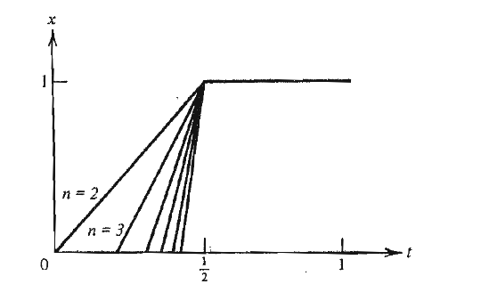
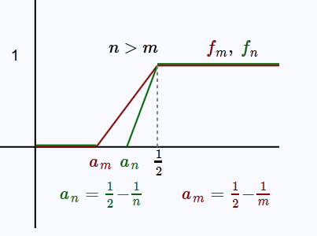

# Ders 5

Teori 

Bir küme $F$ kapalıdır (closed), eğer $F$ içindeki her yakınsayan dizinin
limiti yine $F$ içindeyse [ispat atlandı]. 

Tanım 

Vektörü uzayı $X$'ten reel (ya da kompleks) skalar uzayına yapılan
transformasyona $X$ üzerinde tanımlı bir *fonksiyonel* denir. 

Dikkat fonksiyon değil, fonksiyonel. Fonksiyonelleri diğer daha genel
transformasyonlardan ayırtetmek için onlara notasyon olarak küçük harfler
verilir, mesela $f,g$ gibi. 

Norm edilmiş uzayda $f(x) = ||x||$ bir fonksiyonel örneğidir. Yani norm
operatörünün kendisi de bir fonksiyoneldir. Reel değerli fonksiyoneller
optimizasyon teorisi açısından çok önemlidir normal olarak çünkü
optimizasyonun amacı bir fonksiyoneli minimize (ya da maksimize) edecek bir
vektörü bulmaktır. 

$l_p$ ve $L_p$ Uzayları 

Şimdi derslerin geri kalanında çok kullanacağımız, faydalı olacak bazı
klasik norm edilmiş uzayları görelim. 

Tanım 

$0 < p < \infty$ olacak şekilde $p$ bir reel sayı olsun. $l_p$ uzayı $\{
\xi_1,\xi_2,...\xi_n\}$ skalar dizisidir, ki bu dizi şu şarta uymalıdır,

$$ \sum_{i=1}^{\infty} |\xi_i|^p < \infty $$

$p$ sayısı tanımlanan uzaya göre değişir, yani $l_3$ olabilir, bir diğeri
$l_5$, vs. Bu uzayın normu nedir? Dikkat, üstteki bir norm değil, uzayı
tanımlamak için kullandığımız şartlardan biri. Norm, 

$$ ||x||_p = \bigg( \sum_{i=1}^\infty |\xi_i|^p \bigg)^{1/p}  $$

$l_\infty$ uzayı tüm sınırlı (bounded) dizileri içinde barındırır. $p =
\infty$ kullanılması biraz garip gelebilir, $|\xi_i|$'in hem $\infty$ ile 
katı alınacak, hem de tüm bu katların toplamı sonsuzluktan küçük olacak! 

$l_\infty$ içindeki bir öğe $x = \{ \xi_i \}$'in normu 

$$ ||x||_\infty = \sup_i |\xi_i| $$

Banach Uzayları 

Tanım

Bir norm edilmiş uzayda $\{x_n\}$ dizisine Cauchy dizisi denmesinin şartı şudur:
Eğer $m,n \to \infty$ iken $||x_n - x_m|| \to 0$ doğru olmalıdır; mesela verilen $\epsilon > 0$
için öyle  bir $N$ olmalıdır ki, her $n,m > N$ için $||x_n - x_m|| < \epsilon$ doğru
olmalıdır.

Bir norm edilmiş uzayda her yaklaşan dizi Cauchy dizisidir. Eğer $x_n \to
x$ ise, o zaman 

$$ ||x_n - x_m|| = ||x_n -x +x -x_m|| \le 
||x_n - x|| + ||x-x_m|| \to 0
 $$

Fakat bu kuralın tersi her zaman doğru olmayabilir, yani her Cauchy dizisi
yaklaşıksal olmayabilir. 

İçinde her Cauchy dizisinin yakınsayan olduğu norm edilmiş uzaylar
analizde özellikle ilgi görür, önemlidir, çünkü bu tür uzaylarda
yaklaşıksal dizileri bulmak / göstermek için onların limitlerini bulmak
gerekmez (sadece Cauchy olduklarını göstermek yeter). Bu tür norm edilmiş
uzaylara tam (complete) uzaylar denir.

Tanım

Norm edilmiş uzay $X$ içindeki her Cauchy dizisinin $X$ içinde bir limiti
var ise, bu uzaya tam denir. Tam olan bir norm edilmiş uzaya Banach Uzayı
ismi verilir. 

Uygulamalarda önümüze çıkan problemleri Banach uzayına olan yansımasını /
orada da aynen işleyecek bir versiyonunu / eşdeğerini yaratmak için oldukça
çaba sarfederiz. Bu problemleri diğer, çoğunlukla tam olmayan, uzaylardan
çıkartmak için çok uğraşırız, çünkü optimizasyon problemlerinde Banach
uzaylarının bir avantajı vardır; hedef fonsiyonunu maksimize edecek optimal
vektörü bulmak için çoğunlukla bir vektör dizisi yaratırız, ve bu dizideki
her eleman bir öncekinden daha iyi olur, ve o zaman aradığımız optimal
vektör otomatik olarak bu dizinin limiti olacaktır. Bu tekniğin ise
yaraması için limiti hesaplayamıyor olsak bile, bu dizinin yaklaştığını bir
şekilde bilmemiz gerekir / bunu bize gösterecek bir test
gerekir. Yakınsaklık için Cauchy kriteri işte bunu sağlar, temel
aldığımız uzay tam ise, Cauchy dizisinin yaklaşacağından emin olabiliriz.

Şimdi tam olmayan bir norm edilmiş uzay görelim. 

Örnek

$X$ uzayı $[0,1]$ üzerinde tanımlı tüm sürekli fonsiyonlar olsun, ve norm
$\|x\| = \int_{0}^{1} |x(t)| \mathrm{d} t$. $X$'in tam olmadığını ispat için $X$
içinde şöyle bir dizi yaratacağız, 

$$ 
 x_n(t) =
\left\{ \begin{array}{ll}
0 &  0 \le t \le \frac{1}{2} - \frac{1}{n} \\ \\
nt-\frac{n}{2} + 1 &  \frac{1}{2} - \frac{1}{n} \le t \le \frac{1}{2} \\ \\
1 & t \ge \frac{1}{2}
\end{array} \right.
 $$

Bu dizinin her elemanı bir sürekli fonsiyondur ve bu yüzden $X$'in bir
üyesidir. 

Bu dizi Cauchy midir? $||x_n - x_m||$'i hesaplayalım ve $n,m \to \infty$
iken ne oluyor ona bakalım. Aslında hesap için entegralleri cebirsel olarak
hesaplamaya gerek yok, entegral $f$'in altındaki alanı hesapladığına göre,
görsel olarak düşünebiliriz. Üstteki grafikte gördüğümüz gibi her $n$ yeni
bir fonsiyon yaratır. Fakat $n,m$ sonsuza gittikçe ikisi de basamak (step)
fonsiyonu olmaya yaklaşacaktır, ve farklarının normu $||x_n - x_m||$ sıfıra
yaklaşacaktır. Alan farkı için tam formül

$$ 
\frac{1}{2} \cdot 1 \cdot (\frac{ 1}{2}-a_m) - 
\frac{1}{2} \cdot 1 \cdot (\frac{ 1}{2}-a_n) =
\frac{ 1}{2}\frac{ 1}{m} - 
\frac{ 1}{2}\frac{ 1}{n} 
 $$

Yani

$$ ||x_n - x_m|| = \frac{ 1}{2}|1/n - 1/m| $$

Grafikte sadece pozitif kısım gözüküyor çünkü unutmayalım, $t$ değerleri
$[0,1]$ arasında geliyor, ve formüldeki tüm parçalar buna göre pozitif
değerler üretiyorlar. 

Teori 

Bir Cauchy dizisi sınırlıdır

İspat

$\{x_n\}$ bir Cauchy dizisi diyelim, ve $N$ öyle bir tam sayı olsun ki $n >
N$ için $||x_n - x_N|| < 1$ doğru olacak. $n > N$ için

$$ ||x_n|| = ||x_n - x_N + x_N || \le ||x_N|| + ||x_n - x_N|| < ||x_N|| + 1 $$

$\square$

Örnek

$C[0,1]$ bir Banach uzayıdır. Daha önce bu uzayın tam olduğunu
söylemiştik. $C[0,1]$'in tam olduğunu ispatlamak için $C[0,1]$ içindeki her
Cauchy dizisinin bir limiti olduğunu göstermek yeterlidir. 

Diyelim ki $\{x_n\}$ $C[0,1]$ içinde bir Cauchy dizisi. Her sabit $t \in
[0,1]$ için $|x_n(t) - x_m(t)| \le ||x_n - x_m|| \to 0$, o zaman  $\{x_n(t)\}$
reel sayılardan oluşan bir Cauchy dizisidir. Bu dizi doğal olarak reel
sayılar uzayı $\mathbb{R}$'dedir, ve $\mathbb{R}$'nin tam olduğunu
biliyoruz. O zaman bu dizinin yaklaştığı bir $x(t)$ her zaman olacaktır,
yani $x_n(t) \to x(t)$. Bunun sonucu olarak $x_n$ fonksiyonları da $x$'e
yaklaşmalıdır. 

Genel olarak tarif etmek gerekirse, $x_n$ dizisini $\mathbb{R}$'deki bir
başka dizi $\{x_n(t)\}$'ye indirgiyoruz, yani yansımasını yaratıyoruz,
seçtiğimiz tek bir $t$ üzerinden. Uzayı değiştirmemizin avantajı şu,
$\mathbb{R}$'nin tam olduğunu biliyoruz. O zaman oraya indirgediğimiz
Cauchy dizisinin o uzayda muhakkak bir limiti olmalıdır. Şimdi,
$\mathbb{R}$'den filmi geriye sarıyoruz, her $t$ için "yukarı çıkarken''
elimizdeki limitleri toparlıyoruz, ve $x_n$ seviyesine getiriyoruz. Bunu
tüm $t$'ler için yapabildiğimize göre, o zaman tüm $x_n$'nin de bir limiti
olmalıdır.

