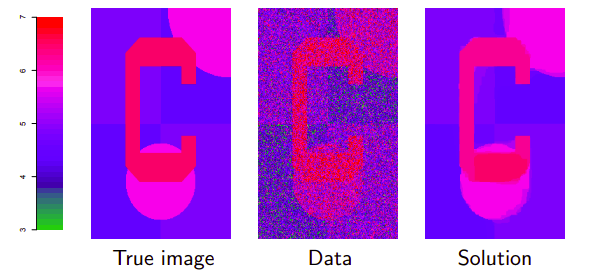
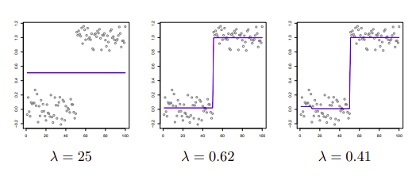
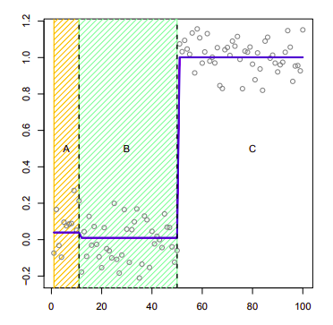
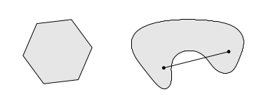
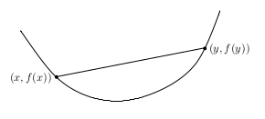
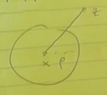

# Dışbükey Optimizasyonuna (Convex Optimization) Giriş

Yapay öğrenme (machine learning) ve optimizasyonda sürekli optimizasyonu
görürüz. Diğer disiplenlerde de görülür tabii ama bu ikisi benim ana
konularım o yüzden o konulardan bu derste daha fazla bahsedeceğiz. Derste
belirli bir amaç için gereken optimizasyon problemini çözmekten çok
optimizasyon mekanizmasının detaylarını inceleyeceğiz. Optimallik
şartlarına bakmak, varılan çözümün niteliğine bakmak bu detaylardan
bazıları.

Şimdi aklınıza gelen bazı optimizasyon örneklerini verin bana [öğrenciler
söylüyor]

1) Regresyon - En Az Kareler. Evet. Hata karelerinin toplamı minimize
edilir burada, bir hedef $y$ vardır, onu bir formül üzerinden katsayıları
olan bir denklem vardır, ve model uyum iyiliğini hata kare toplamı
üzerinden ölçeriz.

$$
\min_\beta \sum (y_i - x_i^T \beta)^2 
$$

Başka ne tür regresyon şekilleri var?  

2) Regülarize Edilmiş Regresyon - Lasso. Burada yine hata karelerin toplamı
var, ama üstüne katsayıların L1 norm'unu minimize etmeye çalışırız. Yani 

$$
\min_\beta \sum (y_i - x_i^T \beta)^2 \quad \textrm{oyle ki}
$$
$$
\sum |\beta| \le t
$$

3) En Az Mutlak Sapma Regresyonu (Least Absolute Deviations) - bu da
benden. Bu tür regresyon ile kare yerine mutlak değer operasyonu
kullanılıyor [1, 14:35].   

$$
\min_\beta \sum |y_i - x_i^T \beta |
$$

BU tür regresyon ile aykırı (outlier) değerlere daha az önem verilmiş
olur. Fakat mutlak değer hesabı kullanınca optimizasyon zorlaşıyor çünkü
üstteki formül artık pürüzsüz değil. 

4) Sınıflama - Lojistik Regresyon. LR ile $y_i$ ikisel olur, 0 ya da 1. LR
formülizasyonu normal regresyona benziyor, 

5) Bilgisayar Bilim - Seyahet Eden Satış Görevlisi Problemi (TSP),
Planlama, Ayrıksal Optimizasyon. Bu ders bloklarının sonunda Tam Sayı
Programlama (İnteğer Programming) konusuna bakacağız, bu tür konulara orada
daha çok yaklaşmış olacağız. 

6) İstastistik - Maksimum Olurluk. MO istatistikte pek çok yaptığımız işin
mihenk taşıdır. Hatta LR, En Az Kareler, vs aslinda MO'nun özel, spesifik
halleridir. Burada vurgu içbükey olurluk elde etmek, ki bir içbükey
fonksiyonu maksimize etmiş olalım, bu bir dışbükey fonksiyonu minimize
etmek ile aynı şey. 

Böyle devam edebilirdik, optimizasyon örnekleri sayfalar
doldurabilirdik. Optimizasyon her yerde. Ama belki de neyin optimizasyon
olmadığına da bakmak iyi olur. Mesela istatistikte optimizasyon olmayan
problemler nedir?

Hipotez test etmek, p-değerleri. Ya da takviyelemek (boosting), önemli bir
konu ama optimizasyon değil. Rasgele Ormanlar (Random Forests),
değil. Önyükleyiciler (bootstrap), çapraz-sağlama (cross-validation), yine
değil [1, 22:09].  

Ve iddiam şu ki optimizasyon olmayan konular hakkında olanlara kıyasla daha
fazla teorik bilgimiz var. Üstteki teknikler çoğunlukla prosedürsel. Ama
mesela Lasso diyelim, bu bir dışbükey optimizasyonun çıktısı olduğu için
optimalite şartları üzerinden onun çözümünün özellikleri hakkında konuşmak
kolaylaşıyor. 

Peki biz niye bu dersteki konuyu öğrenmek isteriz, isteyebiliriz? Sonuçta
Lasso'yu birisi bulmuş onun kodunu çağırırız, iş biter. Üç sebep
var. Birincisi farklı algoritmalar duruma göre daha iyi performans
gösterebilir, durum derken veriden bahsediyorum. Bu sebeple her
algoritmanin özünü anlamak çok önemli. İkincisi herhangi bir alandaki
problemi çözen optimizasyonun temelini bilmek bize alan hakkında ek görüş
kazandırabilir. 

Üçüncü sebep optimizasyon hızlı hareket eden bir alan, eğlenceli! Mesela
optimizasyon alanındaki NIPS Çalıştayına (Workshop) bakarsanız, her sene
değişiyor! Birkaç sene önce dışbükey olmayan optimizasyon büyük konuydu,
tabii o zaman bu dersi işlerken utanır gibi oluyorduk çünkü bizim konu
dışbükey optimizasyon ve yapay öğrenimdeki en büyük konferansta dışbükey
olmayan konular işleniyor.. Fakat o zamanki odağın sebebi o zamanlarda bir
sürü yeni dışbükey olmayan ve yakınsadığı ispat edilen metotların bulunmuş
olmasıydı. Ama bir sonraki sene rasgele (stochastic) optimizasyon geri
dönüş yapmıştı, rasgele gradyan inişi vs. Böyle her sene değişim oluyor, bu
güzel bir şey demek ki hala ilerleme için oldukça alan var.

Ornekler

Bu orneklerin cogu tam varyasyon gurultu yoketmek (denoising) etrafinda,
bunun bir diger ismi kaynasmis (fused) lasso. Elimizde iki boyutlu izgara
halinde bir veri var, bir goruntu, $i,j$ kordinatlarinda bir renk degeri
var, 3 ile 7 arasindaki renkler. 

En soldaki gerçek resim. Ortadaki ise onun gürültülü hali, bizim elimizdeki
veri bu diyelim. Görüntüyü $y$ vektörü olarak temil edeceğiz, bu tek
boyutlu ama düşünün ki görüntüdeki iki boyutu alıp düzleştirdik, tek vektör
yaptık, alt alta satır satırları yanyana koyduk mesela, vs. Bu resim
hakkında şunu biliyoruz, görüntü parçasal olarak sabit, yani yanyana
hücreler birbirinden çok farklı değil. Bazı yerlerde olabilir mesela mavi
arka plandan kırmızı objeye geçiş yapılan yerlerde, ama diğer yerlerde
benzerlik var. Biz gürültülü resimden gürültüsüz resmi çıkartmak istiyoruz.

Gürültü yoketme alanında pek çok yöntem var. Fakat gürültü yoketme
problemine optimizasyon açısından yaklaşabiliriz. Mesela, hedef kriteri şu
haldeki bir optimizasyon problemi,

$$
\min_{\beta \in \mathbb{R}^n} 
\frac{1}{2} \sum_{i=1}^{n} (y_i - \beta_i)^2 + 
\lambda \sum_{(i,j) \in E)}  |\beta_i - \beta_j|
$$

İlk terimde aradığımız ideal resim ile gerçek resim arasındaki karesel
kayıp hesabı var, yani her hücredeki $\theta_i$'in olabildiği kadar $y_i$
verisine yakın olmasını istiyoruz. İkinci terimdeki $\lambda$ bizim
dışarıdan atadığımız bir parametre, iki terim arasındaki dengeyi
kuruyor. Bu parametrenin çarptığı ikinci terim bir ceza terimi. Yanyana
olan her $i,j$'ye bakıyor, sağda solda altta üstte olsun, bu hücrelerin
renk farkını cezalandırıyor, yani farkın daha az olmasını zorluyor çünkü
resimde genel olarak bir süreklilik olmasını istiyoruz. Oldukça sofistike
bir işlem aslında, ama optimizasyon formülasyonu açısından oldukca
basit. İki terim var, o kadar.

Çözüm resimde en sağdaki resimde görülüyor. $\lambda=25$ seçtim onun için,
ve çözdüm. $\lambda$'yi arttırdıkça resmin daha kaba görüntülü olmaya
başladığını görebilirdiniz, mesela kırmızı ile pembe bölgeler birbiri içine
geçmeye başlayabilirdi. $\lambda=\infty$ için ne olur? Her şey tek bir renk
olur, o renk $y$'nin ortalaması olurdu. $\lambda=0$ için gürültülü verinin
aynısını elde ederiz. 

Çözümü nasıl elde ettim? Üstteki sonucu ADMM ile elde ettim. Bu ders
bloğunun sonunda bu algoritmayi göreceğiz. Bu problemde ADMM'in spesifik
bir versiyonunu kullandım, bu versiyonun bu problemde iyi işleyeceğini
biliyordum. 300x200 boyutunda bir resimdi, 20 döngü sonrası sonucu elde
ettim, her döngüde lineer zaman harcadı. Tüm işleyişi bir saniyenin ufak
bir parçasıydı. 

Proksimal gradyan inişi ile 1000 kere döndük, sonuç fena değil ama bazı
renkler tam birleşmedi. Eğer 10000 kere döndürseydim ADMM sonucuna
yaklaşırdı. Bu metot ile de her döngüde lineer zaman harcanıyor, ama
algoritmanın tamamı daha yavaş yakınsadı. Yani, amaç için doğru araç
diyemeyiz. 

Sonra kordina iniş adında çok popüler bir diğer metot işlettim, 10000 kere
döndü, adımlar lineer zaman, ama yakınsama olmadı. Hatta sonuç oldukca
kötüydü. Kesinlikle amaç için yanlış araç. Yani iyi ile kötü metot arasında
boyutsal fark var (order of magnitude), işlem hızı bakımından 1, 2, daha
kötü değil, 10, 100 kat daha kötüden bahsediyoruz, ve kalite iyi değil.

Bu arada kordinat inişini öğrenince üstteki kriteri nasıl kullandığım kafa
karıştırabilir, cevap algoritmayi kriterin ikizi üzeride
işlettim. Dersimizde ilerledikçe bunun anlamını öğreneceğiz. Bir problemin
ikizini almak ve bu ikize algoritmaları nasıl uygulanacağını
görmek.. bunları hep göreceğiz. 

Mesajım ne? ADMM her yerde çok iyi işler demek mi? Hayır. ADMM bazı
yerlerde daha kötü işler. Diğer yerlerde proksimal gradyan daha iyidir. Bu
sebeple tüm seçenek yelpazesinin bilmek, her algoritmanin özelliklerini
anlamak faydalıdır. 

Bir diger ornek [1, 42:53]. Tam varyasyon gurultu yoketme yapiliyor yine
ama burada iki boyuta bakmak yerine tek boyuta bakiyoruz, yani bazi
acilardan bu problem daha kolay. Veri yine $y_1,..,y_n$ ama duzlestirilmis
goruntu yerine tek bir eksende veri. Ayrica verinin ortalamasi parcasal
sabit, yani tek duz cizgi. 

$$
\min_\theta \frac{1}{2} (y_i-\theta_i)^2 + 
\lambda \sum_{i=1}^{n-1} |\theta_i - \theta_{i+1}|
$$

Burada ceza teriminde yanyana olan iki $\theta$'nin farkini
cezalandiriyoruz, yani yanyana verinin benzer olmasini istiyoruz. 

Veriye bakarsak iki bolge var, bir bolgede ortalama sabit digerinde de
(baska) bir sabit. Ama algoritma bunu bilmiyor tabii onu kesfetmesi
gerekecek. Eger $\lambda$ buyukse global ortalama ortaya cikiyor, tek
cizgi. Goruntu orneginde soyledigimiz oluyor yani ama tek
boyutta. $\lambda$ kuculdukce farkli ortalama bloklarinin ortaya cikmasini
sagliyoruz. Ortadaki sonuc oldukca iyi. 3. resimde $\lambda$ biraz daha
kucultuldu, burada bakiyoruz algoritma basta ufak bir blok daha yaratmayi
secti. Bloklarin arasindaki noktaya "degisim noktasi (changepoints)''
denir. 

Bir değişim noktası elde edince, şimdi kendimize bir istatistiki soru
sorabiliriz. Bu değişim noktalarının istatistiki önemi (significance)
nedir? Görsel olarak ben bakınca diyorum ki 3. resimde sağdaki değişim
noktası önemli ama o baştaki ufak değişim değil. O yapma (spurious) bir
değişim herhalde. Tabii $\lambda$'yi daha da ufaltsam daha da fazla uyduruk
değişim noktaları elde ederdim. Optimizasyon probleminin özü böyle, ayar
değişkeni $\lambda$ elde edilen sonuçlara, neye ne kadar ağırlık
verildiğini kontrol ediyor. Fakat istatistiki öneme dönersek bu tür
soruları sadece tam varyasyonu iyi anladığımız takdirde
cevaplandırabiliriz. 

Çünkü istatistiki önem hesabı için mesela 1. blok ile 2. bloktaki noktaların
ortalamasının farkına bakılır, ve bir Normal dağılım referans alınarak
sıfır hipotezi test edilir, ve bu hipotez neredeyse her seferinde
rededilecektir (yani test bloklar farklıdır diyor ama biz olmadığını
görüyoruz). Niye böyle oldu? Çünkü optimizasyonun kriterine bakarsak biz
orada aktif olarak ortalama farkını fazlalaştırmaya uğraşıyoruz. Ve tabii
ki uğraştığımız şeyi test edince farklılık olduğunu buluyoruz. Bu doğru
değil! Eğer optimizasyonun ne yaptığını bilmesek bu sonuca varamazdık.

Devam edelim; Bu dersin merkezi kavramı dışbükeylik. Tarihsel olarak ilk
başta lineer programlar vardı, çok ciddi bir şekilde araştırıldı bu konu,
koca dersler bu konuya harcandı. O zamanlar düşünülüyordu ki lineer olan ve
olmayan ayrımı optimizasyonda en önemli ayrımdır. Bir tarafta
çözebildiğimiz LP'ler var, diğer tarafta daha zor, çözülmez LP olmayan
problemler.

Ama sonradan anlaşıldı ki bazı LP olmayan problemler aslında o kadar
çözülemez değil. Mesela biraz önceki 1D lasso problemi LP değil ama
çözülebiliyor. Ama tabii bazı LP olmayan ve çok çetin problemler de
var.. Devam eden araştırmayla ortaya çıktı ki esas ayrım LP/olmayan değil,
dışbükey / olmayan arasında. Çünkü dışbükey problemler ve olmayan
problemler çok çok farklı mahlukatlar. Dişbukey problemlerde genel
algoritmalardan bahsedebiliyoruz, bu algoritmalar bazı şartlarda iyi, kötü
işleyebilir ama hepsinin ispatlanabilir yakınsanabilirliği var. Elimizde
KKT optimallik şartları ve ikizlik gibi teorik araçlar var bu sayede
dışbükeylikte elde edilen sonuçların özelliğini anlamamıza yardım ediyor. 

Teoriye giriş yapalım artık. 

Dışbukey Kümeler ve Fonksiyonlar

Dışbukey küme $C \subseteq \mathbb{R}^n$, öyle ki 

$$
x,y \in C \Rightarrow tx + (1-t) y \in C, \quad \forall 0 \le t \le 1
$$

Yani dışbükey küme $C$ de seceğim herhangi iki nokta arasında çekeceğim düz
çizgi o küme içinde kalmalıdır [1, 1:00:24]. 

Üstteki resimde soldaki küme dışbükey değil, sağdaki dışbükey.

Dışbükey fonksiyon $f: \mathbb{R}^n \to \mathbb{R}$, ki
$\mathrm{dom}{(f)} \subseteq \mathbb{R}^n$ dışbükey olacak şekilde, ve 

$$
f( tx + (1-t) y ) \le t f(x) + (1-t) f(y), \quad 0 \le t \le 1 \textrm{ için.} 
$$

Üstteki diyor ki dışbükey fonksiyonun tanım kümesi, alanı dışbükey küme
olmalı, ki $\mathbb{R}^n$ öyledir, ve bu fonksiyonu herhangi iki noktada
hesaplayınca elde ettiğim değer o iki nokta arasında çektiğim düz çizgi
altında kalmalı. 

Tipik problem 

$$
\min_{x \in D} f(x), \quad \textrm{öyle ki}
$$
$$
g_i(x) \le 0, \quad i=1,..,m
$$
$$
h_j(x) \le 0, \quad j=1,..,r
$$

ki $D$ her $f,g,h$ fonksiyonunun ortak tanım kümesi. Dişbukey optimizasyon
probleminde $f,g$ dışbükey ve $h$ ilgin (affine) olmalıdır. $f,g$ üzerinden
gösterilen şartlara uyan değerler olurlu (feasible) değerler olarak
bilinir.

Dişbukey problemler için yerel minimum [1, 1:06:03] global minimumdur. Yani
tek başına diğerlerinden izole bir yerel minima diye bir şey yoktur. Bu
demektir ki eğer optimizasyon sırasında bir alt noktaya varırsanız, bu
nokta global çözümdür. 

Formel şekilde, bir $x$ noktası yerel minimumdur, eğer

$$
f(x) \le f(y) \quad ||x-y||_2 \le \rho \textrm{ ve her olurlu } y \textrm{ icin}
$$

doğru ise, yani alt noktadayım ve $\rho$ büyüklüğünde bir top içinde olurlu
değerler üzerinden etrafa bakınca $f(x)$'den daha ufak bir değer
görmüyorum. 

Dişbukey problemlerde 

$$
f(x) \le f(y) \textrm{ her olurlu } y \textrm{ icin}
$$

ifadesi doğrudur, yani $\rho$ sonsuzluktur. Minimuma geldik, ne kadar uzağa
bakarsak bakalım, sonsuz büyüklükte top içinde her yerde en minimum biziz.

İspatlayalım. Bunu çelişki ile ispat üzerinden yapacağız. Diyelim ki
elimizde olurlu bir nokta $z$ var, yani $\exists z \in D$ ve öyle ki 
$f(z) < f(x)$. Bu $z$ noktası $x$'den daha minimal. O zaman $||z-x||_2 >
\rho$ olmali, yerel optimal $x$'in etrafındaki $\rho$ topunun dışındayım. 

Şimdi $x$ ve $z$ arasındaki $y$ noktalarına bakalım, 

$$
y = tx + (1-t) z, \quad 0 \le t \le 1
$$

$y$ hakkında neler biliyoruz? 

- $y \in D$? $y$ ortak küme içinde mi? $x,y$ küme içinde onların kesiştiği
$y$ kümesi tabi ki $D$ içinde. 

- $y$ olurlu mu? Evet. 

$$
g_i(tx + (1-t) z) \le t g_i(x) + (1-t) g_i(z)
$$

$$
\le 0
$$

Ayrıca, bunu ödev olarak kontrol edin,

$$
h_i(tx + (1-t) z) = 0
$$

çünkü $h$ lineer. 

Yani $y$ olurlu, her kısıtlamaya uygun. 

Ayrıca yeterince büyük (1'e yakın) $t$ için 

$$
||x-y||_2 \le \rho
$$

demek istiyoruz ki $x$'den $z$'ye bir çizgi çekiyorum ve yeterince $z$'ye
yakın bir notkada $\rho$ topunun dışına çıkmış oluyorum. 

Güzel. Top içinde olurlu bir noktam var, tanım kümesi içinde, $y$ de
orada. $f(y)$ hakkında ne söyleyebilirim?

$$
f( t x + (1-t) z) 
$$

$f$ dışbükey değil mi? O zaman üsttekini dışbükeylik üzerinden açarsam,

$$
\le t f(x) + (1-t) f(z) 
$$

Ve biliyorum ki $f(z) < f(x)$, yani harfiyen küçüklük var, çünkü daha önce
söylemiştik, $x$ global minimum değil, kriterler ışığında $z$ ondan daha
iyi. Ayrıca üstte "yeterince büyük $t$'' dedik, bunun için, topun dışına
çıkıyoruz, $z$'ye yakınız ama tam $z$ değiliz. O zaman üstteki formül

$$
< f(x)
$$

olacaktır. Şimdi çelişkiye geldik, top içinde öyle bir $y$ noktası bulduk
bu nokta harfiyen $f(x)$'den küçük ama bunu yapınca yerel minimum /
optimumluk faraziyesini ihlal etmiş olduk. 

Kaynaklar

[1] Tibshirani, *Convex Optimization, Lecture Video 7*, 
[https://www.youtube.com/channel/UCIvaLZcfz3ikJ1cD-zMpIXg](https://www.youtube.com/channel/UCIvaLZcfz3ikJ1cD-zMpIXg)

