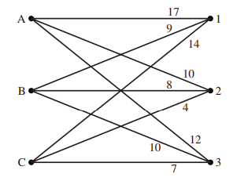
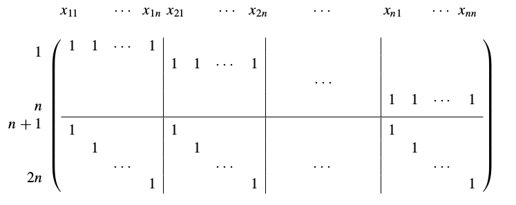

# Lineer Programlar, Örnekler

Bir lineer program (LP), 

$$
\min_x c^Tx \quad \textrm{öyle ki}
$$
$$
Dx \le d
$$
$$
Ax = b
$$

formundaki problemlerdir. Atama problemleri, nakliyat (transportation)
problemleri hep LP olarak çözülebilir. 

Örnekler

Bir atama problemi gorelim. Ufak [1, sf. 29] örneğinden hareket edelim,
elimizde üç tane işçi A, B, C var, ve üç tane iş 1,2,3 var. Her işçinin her
işi ne kadar sürede yaptığı alttaki tabloda. Satırlar işçi, kolonlar iş,

```python
C = [[17,10,12],[9,8,10], [14,4,7]]
C = np.array(C)
print (C)
```

```
[[17 10 12]
 [ 9  8 10]
 [14  4  7]]
```

Problemin yapısı alttaki ağ ile gösterilebilir,



Karar değişkenleri $x_{A1}$, $x_{A2}$, .. şeklinde olacak. o zaman bedel

$$
17 x_{A1} + 10 x_{A2} + 12 x_{A3} + 
9 x_{B1} + 8 x_{B2} + 10 x_{B3} + 
14 x_{C1} + 4 x_{C2} + 7 x_{C3}
$$

Önemli bir nokta her işin sadece bir kişiye verilmesi. Bunu mesela A için

$$
x_{A1} + x_{A2} +  x_{A3}  = 1
$$

kısıtlaması ile hallederiz, B,C için benzer durum. 

Her isin tek kisiye verilmesi icin, mesela 1 icin

$$
x_{A1} + x_{B1} + x_{C1} = 1
$$

kısıtlaması, 2,3 için benzer şekilde halledilir. Tüm bu kısıtlamaları
matris formunda vermek için, alttaki gibi bir matris yaratılabilir,



Notasyon $x_{11}$ diyor bizim örnek için $x_{A1}$ diye düşünülebilir. Bu
matrisi LP çözümüne $Ax = b$ kısıtlaması olarak verebiliriz, $Ax$ çarpımını
takip edersek bu çarpımın belli $x$'ler üzerinde toplama yaptığını
görüyoruz, mesela ilk satır sol üst blok $x_{A1} + x_{B1} + x_{C1} $
toplamını yapıyor ve ona tekabül eden kısma $b$ içinde 1 verirsek, LP
mekanizması bu kısıtlamaya göre gerisini halleder.

Kodda yapalım,

```python
n = 3
X = np.zeros((2*n,n**2))
X[0,0:n] = np.ones((1,n))
X[1,n:n+n] = np.ones((1,n))
X[2,2*n:2*n+n] = np.ones((1,n))
X[3:6,0:3] = np.eye(n,n)
X[3:6,3:6] = np.eye(n,n)
X[3:6,6:9] = np.eye(n,n)
print (X)
```

```
[[1. 1. 1. 0. 0. 0. 0. 0. 0.]
 [0. 0. 0. 1. 1. 1. 0. 0. 0.]
 [0. 0. 0. 0. 0. 0. 1. 1. 1.]
 [1. 0. 0. 1. 0. 0. 1. 0. 0.]
 [0. 1. 0. 0. 1. 0. 0. 1. 0.]
 [0. 0. 1. 0. 0. 1. 0. 0. 1.]]
```

```python
print (C.flatten())
```

```
[17 10 12  9  8 10 14  4  7]
```

Şimdi LP çağrısı,

```python
b = [1, 1, 1, 1, 1, 1]

from scipy.optimize import linprog, linear_sum_assignment
res = linprog(C.flatten(), A_eq=X, b_eq=b)
res = np.round(res.x)
print (res)
```

```
[0. 0. 1. 1. 0. 0. 0. 1. 0.]
```

Yani $x_{A3}$, $x_{B1}$, $x_{C2}$ ataması yapıldı. Doğrulamasını yapalım,

```python
row_ind, col_ind = linear_sum_assignment(C)
print (col_ind)
print (row_ind)
print (C[row_ind, col_ind].sum())
```

```
[2 0 1]
[0 1 2]
25
```

Aynı sonucu aldık. 


Kaynaklar

[1] Hebborn, *Decision Mathematics*, 
    [https://www.pearsonschoolsandfecolleges.co.uk/Secondary/Mathematics/16plus/HeinemannModularMathematicsForEdexcelASAndALevel/Samples/Samplematerial/Chapter2.pdf](https://www.pearsonschoolsandfecolleges.co.uk/Secondary/Mathematics/16plus/HeinemannModularMathematicsForEdexcelASAndALevel/Samples/Samplematerial/Chapter2.pdf)

[2] Burkard, *Assignment Problems*


