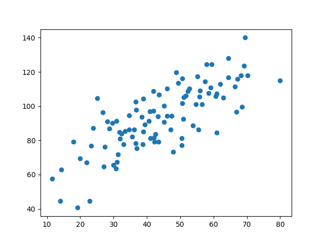
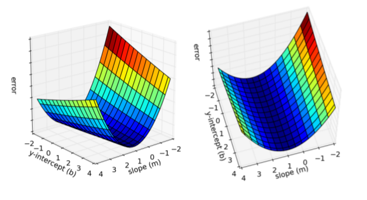
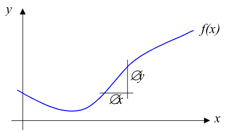
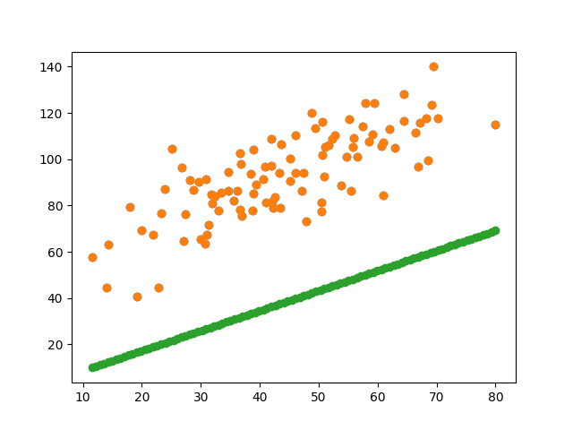
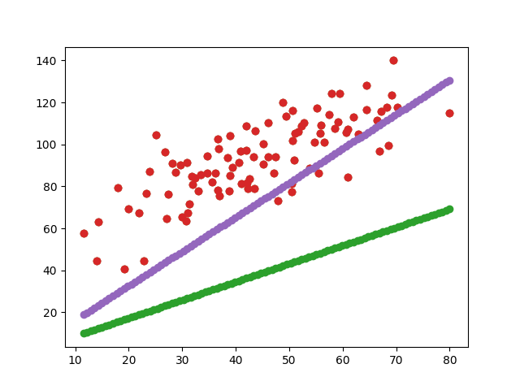
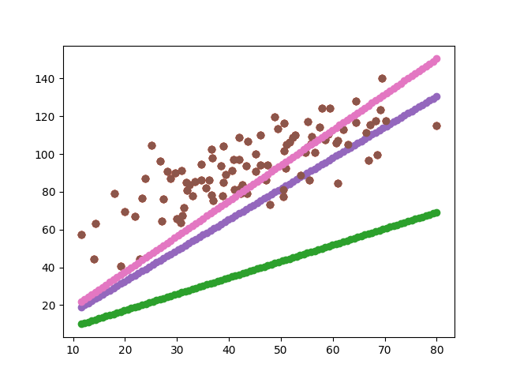
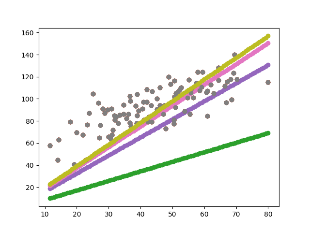

# En Dik İniş (Steepest Descent)

Daha önce gradyan inişi konusunda işlediğimiz üzere bir $f$ fonksiyonu için
hesaplanan $-\nabla f(x)$ gradyanı $x$ noktasında fonksiyon için en yüksek
iniş (descent) olacak yönü gösteriyordu [1, sf. 151]. Fakat dikkat, {\em
  yön} kelimesini kullandık, o yönde ne kadar adım atılacağını
belirtmedik. Gradyanın temel hesabı türeve dayalı olduğu için ve türev
hesapladığı noktaya yakın bir yerde doğru bir yaklaşıklama olacağı için o
yönde atılan adımın büyüklüğüne göre minimizasyon iyi ya da kötü sonuçlar
verebilir. Bu sebeple gradyan inişi algoritmaları, ki

$$
x^{x+1} = x^k + \alpha_k \nabla f(x^k)
$$

ile kodlanırlar, çoğunlukla ufak ve pek çok adım atarlar, yani $\alpha_k$
sabitleri ufak seçilir. En Dik İniş (SD) algoritmasi bu noktada bir
ilerleme. Her $\alpha$, yani $\alpha_k$ öyle seçilir ki
$\phi(\alpha) \equiv f(x^k - \alpha \nabla f(x^k))$ kesinlikle minimize
edilsin / belli bir yöndeki en minimum noktaya vardıracak büyüklükte adım
atılsın. Ya da

$$
\alpha_k = \arg\min_{\alpha \ge 0} f(x^k - \alpha \nabla f(x^k))
$$

Yani gradyanın işaret ettiği yönde bir tür "arama'' yapmış oluyoruz, adım
büyüklüğünü öyle seçiyoruz ki fonksiyon o yönde o kadar adım atıldığında en
fazla inişi gerçekleştirmiş olsun. Bu sebeple bu metota çizgi araması (line
search) metotu deniyor.

Tabii arama derken akla ikinci bir döngü içinde yine ufak ufak adımlar
atarak çizgi üzerinde gelinen yere bakıp büyüklük hesabını böyle yapmak
gelebilir, bu sonuçsal olarak, kabaca doğru, ama asıl adım hesabı bazı
cebirsel temellerle, ya da onu çözen yaklaşıksal şekilde yapılıyor. 

En basiti atılan adım $\alpha$'yi pür cebirsel olarak çözmek, altta bir
örnek [3, sf. 101].

Soru

$f(x) = 9x_1^2 + 4x_1x_2 + 7x_2^2$ fonksiyonunun optimal noktasını bul.

Çözüm

Gradyanın öğeleri

$\frac{\partial f}{\partial x_1} = 18 x_1 + 4x_2$ ve 
$\frac{\partial  f}{\partial x_2} = 4 x_1 + 14 x_2$. Şimdi SD yöntemini
uygulayalım, başlangıç noktası $x^0 = [\begin{array}{cc} 1 & 1 \end{array}]^T$
olsun. Bu durumda $f(x^0) = 20$, ve $\nabla f(x_0) = [\begin{array}{cc} 22 & 18 \end{array}]^T$. 
Adım denklemine göre, 

$$
x^1 = x^0 - \alpha_0 \nabla f(x^0)
$$

ya da 

$$
\left[\begin{array}{c}
x_1 \\ x_2
\end{array}\right]
= 
\left[\begin{array}{c}
1 \\ 1
\end{array}\right]
\alpha_0 
\left[\begin{array}{c}
22 \\ 18
\end{array}\right]
$$

Şimdi öyle bir $\alpha_0$ seçmeliyiz ki $f(x^1)$ minimum olsun. Üstteki
değerlerin bize verdiği $x_1$ ve $x_2$ değerleri (ki $\alpha_0$ bazlı
olacaklar) ana formüle yeni $x$ olarak sokarsak, $\alpha_o$ bazlı bir
denklem edeceğiz,

$$
f(\alpha_0) = 20 - 808 \alpha_0 + 8208 (\alpha_0)^2
$$

$\frac{\mathrm{d} f(\alpha_0)}{\mathrm{d} \alpha_0} = 0$ üzerinden $\alpha_0$'nun optimum
değeri $0.05$'tır. Yani adımı şu şekilde atmalıyız,

$$
x^1 = 
\left[\begin{array}{c}
x_1 \\ x_2
\end{array}\right]
= 
\left[\begin{array}{c}
1 \\ 1
\end{array}\right]
0.05
\left[\begin{array}{c}
22 \\ 18
\end{array}\right]
$$

ki bu hesap bize $f(x^1) = 0.12$ verir. Bu şekilde özyineli döngüye devam
edersek nihai optimum noktayı buluruz.

Sekant Yöntemi

Basit cebirsel numaralar ile üstte adımı bulduk. Daha çetrefil durumlar
için sekant yöntemini kullanabiliriz. Bu yöntemi [2]'de işledik, ayrıca bkz
[1, sf. 120]. Sonuçta aradığımız $d$ yönündeki minimum

$$
\phi_k(\alpha) = f(x^k + \alpha d^k)
$$

değerini bulmaktır. Üstteki formülün $\alpha$ üzerinden türevi

$$
\phi_k'(\alpha) = {d^k}^T \nabla f(x^k + \alpha d^k) 
$$

O zaman minimum $\alpha$ icin 

$$
0 = {d^k}^T \nabla f(x^k + \alpha d^k) 
$$

denklemini çözen $\alpha$ gerekli. Bu bir kök bulma problemi ve sekant
yöntemini kullanabiliriz. 

```python
def linesearch_secant(grad, d, x):
    epsilon=10**(-8)
    max = 500
    alpha_curr=0
    alpha=10**-8
    dphi_zero=np.dot(np.array(grad(x)).T,d)

    dphi_curr=dphi_zero
    i=0;
    while np.abs(dphi_curr)>epsilon*np.abs(dphi_zero):
        alpha_old=alpha_curr
        alpha_curr=alpha
        dphi_old=dphi_curr        
        dphi_curr=np.dot(np.array(grad(x+alpha_curr*d)).T,d)
        alpha=(dphi_curr*alpha_old-dphi_old*alpha_curr)/(dphi_curr-dphi_old);
        i += 1
        if (i >= max) and (np.abs(dphi_curr)>epsilon*np.abs(dphi_zero)):
            print('Line search terminating with number of iterations:')
            print(i)
            print(alpha)
            break
        
    return alpha
```

Örnek

$f(x_1,x_2,x_3) = (x_1 - 4)^4 + (x_2 - 3)^2 + 4(x_3 + 5)^4$ fonksiyonunun
minimize edicisini bul.

Başlangıç noktamız $\left[\begin{array}{ccc} 4 & 2 & -1 \end{array}\right]^T$
olacak. 

Üstteki fonksiyonun gradyanı

$$
\nabla f(x) = \left[\begin{array}{ccc}  
4(x_1-4)^3 & 2(x_2-3) & 16(x_3+5)^3
\end{array}\right]^T
$$

Kod olarak,

```python
def g(x): return np.array([4*(x[0]-4)**3, 2*(x[1]-3), 16*(x[2]+5)**3])
```

$x^1$ hesaplamak için 

$$
\alpha_0 = \arg\min_{\alpha \ge 0} f(x^0 - \alpha \nabla f(x^0))
$$

lazım, tam açılmış haliyle, 

$$
= \arg\min_{\alpha \ge 0} (0 + (2+2\alpha-3)^2 + 4(-1-1024\alpha+5)^4
$$

Ama üstteki cebirle boğuşmaya gerek yok, gradyan fonksiyonu ve gidiş yönü
üzerinden kök bulup bize döndürecek üstteki çizgi araması kodunu
kullanabiliriz,

```python
x0 = np.array([4,2,-1])
print (g(x0))
d0 = -g(x0)
alpha0 = linesearch_secant(g, d0, x0)
alpha0 = np.round(alpha0, 5)
print ('alpha0 =',alpha0)
x1 = x0 - alpha0*g(x0)
print ('x1',x1)
```

```
[   0   -2 1024]
alpha0 = 0.00397
x1 [ 4.       2.00794 -5.06528]
```

Arka arkaya iki adım daha atarsak,

```python
print ('g1',g(x1))
d1 = -g(x1)
alpha1 = linesearch_secant(g, d1, x1)
print (alpha1)
x2 = x1 - alpha1*g(x1)
print ('x2',x2)
print ('\n')
print ('g2',g(x2))
d2 = -g(x2)
alpha3 = linesearch_secant(g, d2, x2)
print (alpha3)
x3 = x2 - alpha3*g(x2)
print ('x3',x3)
```

```
g1 [ 0.         -1.98412    -0.00445103]
0.5000022675782785
x2 [ 4.          3.0000045  -5.06305448]


g2 [ 0.00000000e+00  8.99829483e-06 -4.01113920e-03]
14.894217818923421
x3 [ 4.          2.99987048 -5.00331169]
```

Optimal noktaya erişmiş olduk.

Duruş Şartları 

Optimizasyonda minimum varlığı için birinci-derecen gerekli şart
(first-order necessary condition -FONC-) minimumda $\nabla f(x) = 0$
olması. Eğer böyle bir noktaya erişmişsek, diyelim $x^k$ için
$\nabla f(x^k) = 0$ olmuş, bu nokta FONC'yi tatmin eder çünkü o zaman
$x^{k+1} = x^k$ olur, ve minimumdayız demektir. Bu teorik bilgiyi
algoritmamızın ne zaman duracağını anlaması için bir şart olarak kullanamaz
mıyız?

Ne yazık ki sayısal hesaplarda, yani pratikte $\nabla f(x^k) = 0$ hesabı
nadiren ortaya çıkar. Bir çözüm gradyanın normu $|| \nabla f(x) ||$ sıfır
olmasına bakmak. 

Ya da $| f(x^{k+1}) - f(x^k) |$ mutlak değerine bakmak, yani hedef
fonksiyonun iki nokta arasındaki farkının mutlak değerine, bu değer eğer
daha önceden belirlenmiş bir eşik değeri $\epsilon$'un altına düşmüşse
durmak. Aynı şeyi $x^{n+1}$ ve $x^n$ değerlerinin kendisi için de
yapabiliriz.

Fakat bu yöntemler ölçek açısından problemli olabilir. Mesela 1 ve 1000
arasında gidip gelen $f(x)$'lerle 0 ve 1 arasında gidip gelen $f(x)$'lerin
kullanacağı $\epsilon$ farklı olabilir. Bir tanesi için $\epsilon = 100$
iyidir, diğeri için belki $\epsilon = 0.001$. Bu sebeple izafi bir hesap
daha faydalı olur, mesela

$$
\frac{|f(x^{k+1} - f(x^k))|}{|f(x^k)|} < \epsilon
$$

ya da 

$$
\frac{||x^{k+1} - x^k||}{||x^k||} < \epsilon
$$


Üstteki yaklaşım "ölçekten bağımsız'' olduğu için daha tercih edilir
yaklaşım, bir problemden diğerine geçtiğimizde farklı bir $\epsilon$
kullanmamız gerekmez.

Uygulama

Gradyan İnişi ve Model Uydurmak

Pek çok farklı probleme çözüm sağlayan bir teknik gradyan inişidir. Ne yazık ki
bilgisayar bilim lisans seviyesinde bu teknik genellikle öğretilmiyor. Bu yazıda
Gİ'nin hepimizin bildiği bir problemi, lineer regresyonu çözmek için nasıl
kullanılacağını anlatacağım [1].

Teorik seviyede Gİ bir fonksiyonu minimize etmeye yarar. Elde bazı parametreler
üzerinden tanımlı bir fonksiyon vardır, ve Gİ bir başlangıç değerinden
başlayarak azar azar o parametreleri değiştirerek fonksiyonun minimal olduğu
yeri bulmaya uğraşır. Bu azar azar, adım atılarak yapılan minimizasyon Calculus
sayesindedir, fonksiyonun gradyanının negatif yönünde adım atılarak mümkün
olur. Bazen bu matematiksel açıklamanın pratik kullanımı nasıl olur görmek zor
oluyor; Örnek olarak bir veriye lineer bir çizgi / model uyduralım.

Basit bir tanım yaparsak lineer regresyonun amacı eldeki bir veri kümesine düz
çizgi uydurmaktır. Veri alttaki gibi olabilir,

```python
points = np.genfromtxt("data.csv", delimiter=",")
plt.scatter(points[:,0],points[:,1])
plt.savefig('vision_90fitting_04.png')
```



Üstteki veriyi düz çizgi olarak modellemek istiyoruz, bunun için lise
matematiğinden bilinen $y = mx + b$ formülünü kullanacağız, $m$ eğim (slope),
$b$ ise kesi (intercept), yani y-ekseninin kesildiği yer. Veriye uyan en iyi
çizgiyi bulmak demek en iyi $m,b$ değerlerini bulmak demek.

Bunu yapmanının standart yolu bir hata fonksiyonu tanımlamak (bazen bedel
fonksiyonu da deniyor). Hata fonksiyonu bir çizginin ne kadar "iyi'' olduğunu
ölçebilen bir fonksiyondur, bir $m,b$ çiftini alacak, veriye bakacak, ve bize
uyumun ne kadar iyi olduğunu bir hata değeri üzerinden raporlayacak. Hata değeri
hesabı için elimizdeki verideki tüm $x,y$ değerlerine bakacağız, ve bunu
yaparken her veri $y$ değeri ile, yine veri $x$'i üzerinden hesapladığımız
$mx+b$ değeri arasındaki farka bakacağız; daha doğrusu farkın karesini alacağız,
ve her veri noktası için hesaplanan tüm bu kare hesaplarını toplayacağız. Kare
alınıyor, çünkü bu hatayı pozitif hale çevirmemizi sağlıyor, bir diğer fayda
tabii kare fonksiyonun türevi alınabilir olması (kıyasla mutlak değer fonksiyonu
işleri daha karıştırırdı). Pozitif bir hata yeterli, çünkü hata yapılmışsa
alttan mı üstten mi olduğu bizi ilgilendirmiyor. Hata $E$ hesabı şöyle,

Matematiksel olarak

$$ E_{(m,b)} = \frac{1}{N} \sum_{i=1}^{N} (y_i - (mx_i + b))^2$$

```python
# y = mx + b
# m is slope, b is y-intercept
def compute_error_for_line_given_points(b, m, points):
    totalError = 0
    for i in range(0, len(points)):
        x = points[i, 0]
        y = points[i, 1]
        totalError += (y - (m * x + b)) ** 2
    return totalError / float(len(points))
```

Veriye daha iyi uyan çizgiler (ki "daha iyi''nin ne olduğu hata fonksiyonumuz
üzerinden tanımlı) daha az hata değerleri anlamına gelecektir. O zaman, eğer
hata fonksiyonunu minimize edersek, veriye uyan iyi çizgiyi bulacağız
demektir. Hata fonksiyonumuz iki parametreli olduğu için onu iki boyutlu bir
yüzey olarak grafikleyebiliriz,



Bu iki boyutlu yüzey üzerindeki her nokta değişik bir çizgiyi temsil
ediyor. Yüzeyin alt düzlemden olan yüksekliği o çizgiye tekabül eden
hata. Gördüğümüz gibi bazı çizgiler bazılarından daha az hataya sahip (yani
veriye daha iyi uymuş). Gradyan inişi ile arama yaptığımız zaman bu yüzeyin
herhangi bir noktasından başlayacağız, ve yokuş aşağı inerek hatası en az olan
çizgiyi bulacağız.

Hata fonksiyonu üzerinde Gİ işletmek için önce fonksiyonun gradyanını
hesaplamamız lazım. Gradyan bizim için nerede olursak olalım her zaman dip
noktasını gösteren bir pusula görevini görüyor. Gradyan hesabı için hata
fonksiyonunun türevi alınmalı. Hata fonksiyonunun $m,b$ adında iki tane
parametresi olduğuna göre bu iki parametrenin her biri için ayrı ayrı kısmi
türev almamız lazım. Bu türevler,

$$ 
\frac{\partial E}{\partial m} =
\frac{2}{N} \sum_{i=1}^{N} -x_i (y_i - (mx_i+b))
$$

$$ 
\frac{\partial E}{\partial b} =
\frac{2}{N} \sum_{i=1}^{N} -(y_i - (mx_i+b))
$$

Artık Gİ işletmek için gerekli tüm araçlara sahibiz. Aramayı herhangi bir $m,b$
noktasından (herhangi bir çizgi) başlatırız, ve Gİ yokuş aşağı en iyi çizgi
parametrelerine doğru gider. Her döngü $m,b$ değerlerini bu inişe göre günceller
(dikkat inen *parametreler* değil, hatada inilirken bu inişe tekabül eden
$m,b$ değerleri), ki bu sayede döngünün bir sonraki adımındaki hata bir öncekine
göre azalmış olur.

Matematiğe biraz daha yakından bakalım [2]. Türev almak, türeve göre adım atmak
bir fonksiyonunun minimum noktasını bulmamızı nasıl sağlıyor? Basit bir
fonksiyon $f(x)$'i düşünelim, 



Gradyan, ya da belli bir $x$ noktasındaki değişim oranı $\oslash y / \oslash x$
ile yaklaşıksallanabilir (çoğunlukla literatur $\Delta$ sembolünü kullanır, [2]
$\oslash$ kullanmış, önemli değil). Ya da bu yaklaşıksallığı şöyle yazabiliriz,

$$ 
\frac{\partial f}{\partial x} =
\lim_{\oslash \to 0} \frac{\oslash y}{\oslash x} =
\lim_{\oslash \to 0} \frac{f(x + \oslash x) - f(x)}{\oslash x}
$$

ki bu ifade $f(x)$'in $x$'e göre kısmi türevi olarak bilinir. Üstteki yöntem ile
sembolik olarak pek çok ifadenin türevini almayı biliyoruz, mesela $ax^2$ için
$2ax$, vs.

Şimdi elimizde bir $f(x)$ olduğunu düşünelim, ve $x$'i öyle bir şekilde
değiştirmek istiyoruz ki $f(x)$ minimize olsun. Ne yapacağımız $f(x)$'in
gradyanının ne olduğuna bağlı. Üç tane mümkün durum var:

Eğer $\frac{\partial f}{\partial x} > 0$ ise $x$ artarken $f(x)$ artar, o zaman
$x$'i azaltmalıyız.

Eğer $\frac{\partial f}{\partial x} < 0$ ise $x$ artarken $f(x)$ azalır, o zaman
$x$'i arttırmalıyız.

Eğer $\frac{\partial f}{\partial x} = 0$ ise $f(x)$ ya minimum ya da maksimum
noktasındadır, o zaman $x$'i olduğu gibi bırakmalıyız.

Özet olarak $x$'i alttaki miktar kadar azaltırsak $f(x)$'i de azaltabiliriz,

$$ \oslash x = x_{yeni} - x_{eski} = -\eta  \frac{\partial f}{\partial x}$$

ki $\eta$ ufak bir pozitif sabittir, $x$'i değiştirirken bu atılan adımın
büyüklüğünü dışarıdan ayarlayabilmemizi sağlar, değişimin hangi yönde olacağını
$\frac{\partial f}{\partial x}$ belirtiyor zaten. Bu formülü ardı ardına
kullanırsak, $f(x)$ yavaş yavaş minimum noktasına doğru "inecektir'', bu
yönteme gradyan inişi minimizasyonu adı verilmesinin sebebi de budur. 

Örneğimize dönelim, 

```python
def step_gradient(b_current, m_current, points, eta):
    b_gradient = 0
    m_gradient = 0
    N = float(len(points))
    for i in range(0, len(points)):
        x = points[i, 0]
        y = points[i, 1]
        b_gradient += -(2/N) * (y - ((m_current * x) + b_current))
        m_gradient += -(2/N) * x * (y - ((m_current * x) + b_current))
    new_b = b_current - (eta * b_gradient)
    new_m = m_current - (eta * m_gradient)
    return [new_b, new_m]

eta = 0.0001
initial_b = 0 # initial y-intercept guess
initial_m = 0 # initial slope guess
num_iterations = 8
print "Starting gradient descent at b = {0}, m = {1}, error = {2}".format(initial_b, initial_m, compute_error_for_line_given_points(initial_b, initial_m, points))
print "Running..."
b = initial_b
m = initial_m
xx = np.linspace(np.min(points[:,0]),np.max(points[:,0]), 100)
for i in range(num_iterations):
    b, m = step_gradient(b, m, np.array(points), eta)
    if i % 2 == 0: 
        print i, b,m
        yy = m * xx + b
        plt.scatter(points[:,0],points[:,1])
        plt.hold(True)
        plt.scatter(xx,yy)
        plt.hold(False)
        plt.savefig('grad_desc_%d' % i)
print "After {0} iterations b = {1}, m = {2}, error = {3}".format(num_iterations, b, m, compute_error_for_line_given_points(b, m, points))    
```

```
Starting gradient descent at b = 0, m = 0, error = 5565.10783448
Running...
0 0.0145470101107 0.737070297359
2 0.0255792243213 1.29225466491
4 0.0284450719817 1.43194723238
6 0.029256114126 1.46709461772
After 8 iterations b = 0.0294319691638, m = 1.47298329822, error = 112.737981876
```






Optimal $m,b$ değerleri bulundu. $m=-1, b=0$'da başladık ve optimal sonucu
bulduk. Değişken `eta` (yani $\eta$) adım büyüklüğü demiştik, dikkat eğer
adım çok büyük seçilirse minimum "atlanabilir'', yani varış noktası
kaçırılabilir. Eğer $\eta$ çok küçük ise minimuma erişmek için çok vakit
geçebilir. Ayrıca Gİ'nin doğru işlediğini anlamanın iyi yollarından birisi her
döngüde hatanın azalıp azalmadığına bakmaktır.

Bu basit bir örnekti, fakat bir bedel fonksiyonunu minimize edecek parametre
değişimlerini yapma kavramı yüksek dereceli polinomlarda, ya da diğer Yapay
Öğrenim problemlerinde de işe yarıyor.

Gİ ile akılda tutulması gereken bazı konular:

1) Dışbükeylik (Convexity): Üstteki problemde sadece bir tane minimum vardı,
hata yüzeyi dışbükeydi. Nereden başlarsak başlayalım, adım atarak minimuma
erişecektik. Çoğunlukla durum böyle olmaz. Bazı problemlerde yerel minimumda
takılı kalmak mümkün olabiliyor, bu problemleri aşmak için farklı çözümler var,
mesela Rasgele Gradyan İnişi (Stochastic Gradient Descent) kullanmak gibi.

2) Performans: Örnekte basit bir Gİ yaklaşımı kullandık, çizgi arama (line
search) gibi yaklaşımlarla döngü sayısının azaltmak mümkün olabiliyor.

3) Yakınsama (Convergence): Aramanın bittiğinin kararlaştırılmasını kodlamadık,
bu çoğunlukla hata döngüsündeki değişimlere bakılarak yapılır; eğer hatadaki
değişim belli bir eşik değerinden daha küçük ise, gradyanın sıfır olduğu yere
yaklaşılmış demektir, ve arama durdurulabilir.

Not: Lineer regresyon tabii ki direk, tek bir adımda çözülebilen bir
problem. Gİ'yi burada bir örnek amaçlı kullandık. 

Kaynaklar 

[1] Zak, *An Introduction to Optimization, 4th Edition*

[2] Bayramlı, *Diferansiyel Denklemler, Kök Bulmak, Karesel Formül (Root Finding, Quadratic Formula)*

[3] Dutta, *Optimization in Chemical Engineering*


