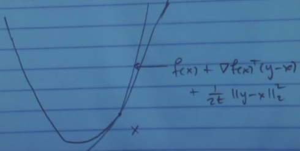
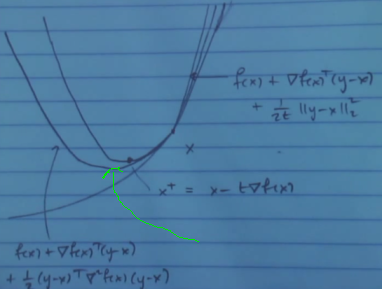
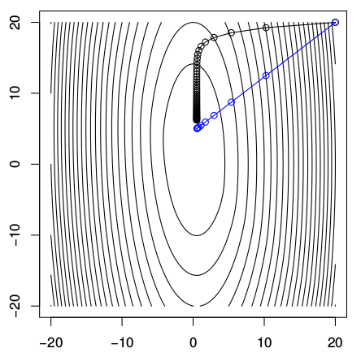
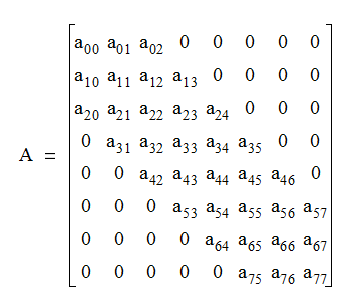
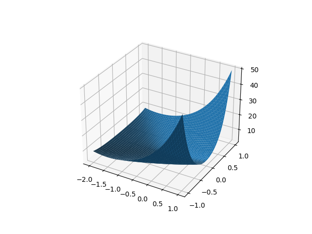
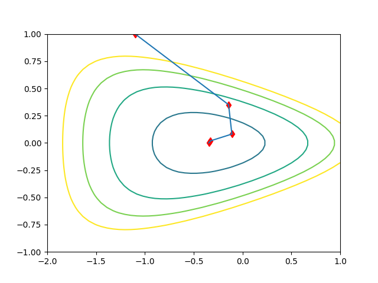

# Newton'un Metodu (Newton's Method)

Kısıtlanmamış bir pürüzsüz optimizasyon problemini düşünelim [6, 6:00], 

$$
\min f(x)
$$

Baktığımız $f$'in iki kez türevi alınabilir olduğunu düşünelim. Hatırlarsak
gradyan inişi nasıl işliyordu? Alttaki gibi,

$$
x^{k} = x^{k-1} - t_k \cdot \nabla f(x^{k-1}), k=1,2,...
$$

Bir başlangıç $x^{(0)} \in \mathbb{R}^n$ seçiliyor ve üstteki ardı ardına
işletiliyor, her adımda negatif gradyan yönünde $t_k$ boyunda adım
atılıyor.

Kıyasla Newton metotu alttakini işletir,

$$
x^{k} = x^{k-1} - 
\left( \nabla^2 f(x^{(k-1)}) \right)^{-1} \nabla f(x^{k-1}), k=1,2,...
$$

ki $\nabla^2 f(x^{(k-1)})$ $f$'in $x^{(k-1)}$ noktasındaki Hessian'ı. Yani
$t_k$ boyunda eksi gradyan yönünde gitmek yerine gradyanin "negatif
Hessian'ı yönünde'' gideceğiz. Dikkat edersek bu yöntemde adım büyüklüğü
kavramı yok, seçilen yönde tam bir adım atılıyor.

Newton metotunu nasıl yorumlamak gerekir? Gradyan inişini hatırlarsak, bir
fonksiyon $f$'i alalım, ve onu $x$ noktasında karesel olarak
yaklaşıklamasını alıyorduk,



Hessian nerede? Aslında var, ama birim matris $\frac{1}{2t} I$ olarak
alındı. Alttaki resimde Newton metotu için yaratılan yaklaşıklamayı
görüyoruz, bu büyük ihtimalle daha iyi bir yaklaşıklama olacak çünkü
karesel açılımda daha fazla bilgi kullanıyor, bu sefer formülde $\nabla^2
f(x)$ ile Hessian da var. 



Bu yeni yaklaşıklama üzerinden $x - (\nabla^2 f(x))^{-1}\nabla f(x)$ ile
adım atınca belki yeşil okla gösterilen yere geleceğiz, bu daha iyi bir
nokta olabilecek. Atılan adım formülünün resimdeki karesel formun minimize
edicisi olduğunu görmek zor değil.

Gradyan inişi ve Newton metotu adımları arasındaki farkı görmek için örnek
bir fonksiyona bakalım, $f(x) = (10 x_1^2 + x_2^2)/2 + 5 \log (1+e^{-x_1 - x_2})$. 
Fonksiyonu kontur grafiğini basınca alttaki gibi çıkıyor, 



Siyah çizgi gradyan inişi, mavi Newton. Aynı yerden başlattım, ve
gördüğümüz gibi minimal noktaya doğru çok farklı yollar takip
ediyorlar. Karşılaştırması kolay olsun diye her iki tarafta atılan adım
büyüklüklerini aynı tutmaya uğraştım. Graydan inişinin attığı adımların
yönünün niye böyle olduğu gayet bariz, tüm adımlar görüldüğü gibi o
noktadaki kontura dikgen, ki bu gradyanın tanımıdır zaten, bir noktadaki
gradyan oradaki konturun teğetine diktir / normaldir. 

Newton tamamen farklı bir şekilde gidiyor. Resimde tüm adımlar tek bir
çizgide gibi duruyor ama aslında değil, başka bir yerden başlatsaydım bazen
zigzaglı bile gidilebileceğini görürdük [6, 13:40]. Newton'un adımlarını
yorumlamanın görsel olarak zihinde hayal etmenin iyi bir yolu onun her
adımda bir küre, bir balon yarattığını düşünmek, ve o balonun gradyanina
göre adım atmak. 

Dersin geri kalanında Newton metotunda geriye çizgisel iz sürme
(backtracking) yöntemini göreceğiz, ki "Newton metotu'' denince aslında bu
çeşitten bahsedilir, üstteki bahsettiğimize "pür Newton'' adı
veriliyor. Sonra bazı yakınsama özelliklerine bakacağız, ardından Newton
metotunun bir çeşidi, eşitlik kısıtlamalı Newton metotunu göreceğiz. Eğer
zaman kalırsa Newton-umsu (quasi-Newton) metotlara da bakmak istiyorum.

Newton metotuna bakmanın bir diğer yolu nedir? Onun her adımda bir karesel
açılımı minimize ettiğini biliyoruz. Bir diğeri [6, 17:04] birinci derece
optimalite şartını lineerize etmek. Biz $x$'teyiz diyelim, öyle bir yön $v$
arıyoruz ki o yönde bir adım atınca gradyan sıfır hale gelsin, 
$\nabla f(x+v)=0$. Bu genel bir ifade değil mi, ayrıca $v$ bağlamında
lineer, $x$ sabit. Şimdi bu gradyanin lineer yaklaşıklamasını yaparsak
doğal olarak Hessian'lı ifadeye eriseceğiz, 

$$
0 = \nabla f(x+v) \approx \nabla f(x) + \nabla^2 f(x) v
$$

Ve üstteki formülü $v$ için çözersek, bu bizi tekrar daha önce
gösterdiğimiz Newton adımına götürüyor, 
$v = - \left( \nabla^2 f(x) \right)^{-1} \nabla f(x)$

Bu metotun tarihi bir arka planı da var, İsaac Newton bizim bugün Newton
metotu dediğimiz yöntemi minimizasyon için değil, kök bulmak için
keşfetti. Düşündü ki gayrı-lineer bir denklemin çözümlerini bulmak
istiyorsan böyle bir metot gerekli. Tek boyutta düşünelim, mesela bir $g$
var, onun köklerini bulmak istiyoruz, o zaman Newton metotu kullan. Hatta
genel fonksiyonlar için bile değil, polinomlar için bu yöntemi
bulmuştu. Rhapson, bir diğer bilimci, aynı şekilde, aynı metotu düşündü. O
sebeple bu metota bazen Newton-Rhapson adı verildiğini de görebilirsiniz.
Çok sonraları bilimciler bu metotu minimizasyon için kullanmayı akıl etti,
gradyanı sıfıra eşitliyerek. Bu kullanım çoğunlukla Simpson'a atfedilir.

Devam edelim, Newton adımının önemli bir özelliği onun ılgın değişmezliği
(affine invariance). Bu ne demek? Bir lineer transformasyona
bakalım. Diyelim ki $f,x$ üzerinden Newton adımı hesaplıyorken ben gelip
diyorum ki "$x$ üzerinde değil yeni bir değişken $y$ üzerinden bunu
yapmanı istiyorum'' ve formül $x = Ay$, ve $g(y) = f(Ay)$. O zaman $g$
üzerinde Newton adımları neye benzer? 

$$
y^+ = y - (\nabla^2 g(y))^{-1} \nabla g(y)
$$

$$
= y - (A^T \nabla^2 f(Ay) A)^{-1} A^T \nabla f(Ay)
$$

$$
= y - A^{-1} (\nabla^2 f(Ay))^{-1} f(Ay)
$$

Eğer üsttekini $A$ ile çarparsam, ki solda $Ay^+$ elde edebileyim, 


$$
Ay^+ = Ay -  (\nabla^2 f(Ay))^{-1} f(Ay)
$$

ki

$$
\underbrace{Ay^+}_{x^+} =
\underbrace{Ay}_{x} -  
(\nabla^2 f(\underbrace{Ay}_{x}))^{-1} f(\underbrace{Ay}_{x})
$$

$x$'e göre atmış olacağımız adıma eriştik yani [6, 22:30]. 

Bu demektir ki lineer ölçeklemeden bağımsız davranabiliyoruz. Mesela size
bir problem verdim, Hessian'ı hesapsal bağlamda uygunsuz (poorly
conditioned) ama bir lineer transformasyon uygularsam iyi hale gelecek, o
zaman prensipsel olarak ilk ya da transform edilmiş problem üzerinde Newton
işletmeniz bir fark yaratmaz.  Dikkat, bu durum gradyan inişi için geçerli
değildir.

Newton azalışı (decrement)

Yeni bir kavram bu, Newton azalışı. Bu kavram bize Newton adımını
yorumlamada bir açı daha kazandırıyor, ayrıca birazdan geriye çizgisel iz
sürmeden bahsederken, ve duruş kriterini hesaplamada da yardımcı oluyor. 

[atlandı]

Geriye çizgisel iz sürmek

Eğer pür Newton adımı atarsak başladığımız noktaya göre uzaksama (diverge)
mümkündür, yani optimal noktadan uzaklaşabiliriz. Newton metotunun çok
hızlı bir yakınsama oranı vardır, ama belirttiğimiz bu durumlarda aynı
şekilde çok hızlı bir şekilde de uzaksayabilir. Yani başladığımız noktaya
göre Newton metotu ya çok iyi, ya da çok kötüdür. O sebeple araştırmacılar
pratik uygulamalarda muhakkak geriye çizgisel iz sürme yönteminin Newton'la
beraber kullanırlar. Pür Newton metotunu olduğu gibi kullanan neredeyse
kimse tanımıyorum. Gradyan inişi de benzer şekilde kullanılır, hatta bu iki
yöntemi aslında aynı altyapı odaklı görebiliriz.  

İz sürme yöntemi adım büyüklüğü $t$'yi hesaplamak için kullanılır, pür
metot $t=1$ kullanıyor tabii ki.  Arama algoritması iki parametreyi baz
alır, $\alpha,\beta$. Bu parametreler için iyi işleyen bazı değerler mesela 
$0 < \alpha <1/2$ ve $0 < \beta < 1$. Her adımda $t=1$ ile başlarız, ve

$$
f(x+tv) > f(x) + \alpha t \nabla f(x)^T v
$$

koşuluna bakarız. Soldaki Newton adımı, sağdaki o yönde ama daha ufak,
$\alpha t$ kadar ufak bir lineer yaklaşıklama, ara değerleme
(interpolation). Yani $t$'nin bir kısmı kadar, $\alpha$ kısmı kadar yönde
bir ilerleme kaydedip etmeyeceğimize bakıyoruz, eğer üstteki şart doğruysa
o $t$'yi adım olarak seçiyoruz. Yoksa $t = \beta t$ ile $t$'yi küçültüp alt
döngüde aynı işlemi bir daha tekrarlıyoruz. 

Newton yönteminin çok hızlı yakınsadığını söylemiştik, arama adımını hesaba
katınca bile bu doğru. Peki hiç dezavantajı yok mu? Bir tane var, eğer
Hessian yoğun (dense) matris ise o zaman temel lineer cebir'e göre tersini
hesaplamak ne kadar yük getirir? $O(n^3)$ değil mi? Bu ağır bir yük olabilir.

[yakınsama analizi atlandı]

Şimdi Newton'un yöntemini birinci derece yöntemlerle (gradyan inişi gibi)
karşılaştıralım.


   * Bellek: her adımda Newton yöntemi $O(n^2)$ yer tutar, çünkü
     Hessian $n \times n$ boyutunda, kıyasla her gradyan adımı $O(n)$ yer
     tutar, çünkü $n$ boyutlu gradyan var. 

   * Hesap: her adıma $O(n^3)$ hızında, eğer yoğun $n \times n$
     boyutunda bir lineer sistemi çözmek gerekiyorsa. Ama her gradyan iniş
     adımı $O(n)$ hızında işler, çünkü $n$ boyutlu bir vektörü topluyoruz,
     ölçekliyoruz, basit işlemler yapıyoruz yani.

   * Geriye iz sürme: her iki yöntem için de $O(n)$ hızında işler. 

   * Uyumlama, transformasyon: Newton yöntemi problemin mevcut haline
     çok bağımlı değil, eğer transforme edersek eşit bir başka problem elde
     ediyoruz, ve Newton onu da çözüyor. Gradyan inişi problem çeşidine
     göre hızlı bir şekilde dejenere olabilir, sonuca varamayabilir.
     
   * Kırılganlık: Newton yönteminin hatalar, sayısal hesap
     problemlerine biraz daha hassas olduğu söylenebilir, gradyan inişi
     daha sağlamdır. 


O zaman Newton yöntemini hangi durumlarda kullanmak iyidir? Eğer Hessian
seyrek ve bir iç yapıya sahip ise o zaman o lineer sistemi çözmek hızlı
olur, bu durumda Newton yöntemi kullanmak uygundur. Yapıya sahip ile ne
demek istiyorum? Mesela bantlı bir matris var ise. Bantlı matris köşegende
bir veya daha fazla çapraz satır olduğu durumlardır, bir şerit, bir
"bant'' vardır, alttaki gibi,



Bu durumda bellek ve hesapsal yük her adım için $O(n)$ olacaktır. 

Yapıya sahip Hessian'lar alttaki gibi durumlarda ortaya çıkabilir, 


* Eğer $g(\beta) = f(X\beta)$ ise o zaman
  $\nabla^2 g(\beta) = X^T \nabla ^2 f(X\beta) X$ olur. Yani eğer $X$ bir
  yapıya sahip tahmin edici matris ise ve $\nabla^2 f$ köşegen ise o zaman
  $\nabla^2 g$ yapıya sahiptir.

* Amacımız $f(\beta) + g(D\beta)$'yi minimize etmek, $\nabla^2$
  köşegen, $g$ pürüzsüz değil, ve $D$ yapıya sahip bir ceza matrisi, o
  zaman Lagrange ikiz fonksiyonu $-f^\ast(-D^Tu)-g^\ast(-u)$. Çoğunlukla bu
  durumlarda $\nabla^2f^\ast$ köşegen olur (mesela
  $f(\beta) = \sum_{i=1}^{p}f_i (\beta_i)$ ise bu durumda ikizdeki Hessian
  yapıya sahiptir.


Eşitlik kısıtlamalı Newton yöntemi

Şu formdaki bir problem düşünelim, 

$$
\min_x f(x) \quad \textrm{öyle ki} \quad Ax = b
$$
  
Bu tür problemleri çözmek için elimizde aşağı yukarı üç yöntem var. 

1) Eşitlik sınırlamalarını yoket. Problemi $A$'nin sıfır uzayı bağlamında
tekrar parametrize et, yani $x = My + x_o$ yap, $M$, $A$'nin sıfır uzayını
kapsar, ve $A x_0 = b$'dir. Çözümü $y$ bağlamında yap.

Bu fena bir çözüm değil, ama $A$'nin sıfır uzayını kapsayan bir $M$
bulmamızı gerektiriyor. Ayrıca problemde yapı varsa bunu bozmuş olabiliriz,
seyrek Hessian elimizde olabilir ama değişim sonrası Hessian yoğun
olabilir. 

2) İkizi türet. Daha önce gördük ki bu tür problemlerde ikizi hesaplarken
eşitlik sınırı kritere dahil ediliyordu. Ama bu da her zaman kolay
değildir. 

3) Eşitlik kısıtlamalı Newton yöntemi. Çoğu durumda en direk yaklaşım
budur. Bu yöntemde $x^{(0)}$ ile başlarız, ki $Ax^{(0)}=b$ olacak şekilde,
ve

$$
x^+ = x + tv
$$

adımı atarız, ama normal Hessian'lı karesel açılımı minimize etmek yerine
yeni bir sınırlama ekleyeceğiz, her Newton adımının saygı göstermesi
gereken $Az=0$ şartı koyacağız,  

$$
v = \arg\min_{Az=0} \nabla f(x)^T (z-x) + \frac{1}{2} (z-x)^T \nabla^2 f(x)(z-x)
$$

Böylece her adımda kısıtlanmış bölge içinde kalmış olacağız. Üstteki
eşitlik şartını KKT dersimizde görmüştük, bu hesap tek bir lineer sistemi
çözmeye indirgenebiliyordu. Lineer sistemi tekrar altta veriyorum, 

$$
\left[\begin{array}{cc}
\nabla^2 f(x) & A^T \\ A & 0
\end{array}\right]
\left[\begin{array}{cc}
v \\ w
\end{array}\right] = 
\left[\begin{array}{cc}
-\nabla f(x) \\ 0
\end{array}\right] 
$$

Bu lineer sistemi $v$ için çözersek bu bize eşitlikle sınırlanmış
Newton adımını verecektir. Eşitliğin solundaki matris çoğunlukla seyrek ve
yapıya sahiptir, çünkü $\nabla^2 f(x)$ Hessian'ı içindeki seyreklik ve
yapı aynen orada da mevcuttur, ve $A$'lar blok halinde belli yerdeler, vs. 
Ayrıca Boyd [7, 1:04:00]'da benzer bir anlatım var.

Alternatif Anlatım

Newton birazdan bahsedeceğimiz yöntemi tek boyutlu problemler için kullandı
[2]. Rhapson adlı bilimci yöntemi çok boyutlu problemler için
genişletti. Biz bu yönteme optimizasyon çerçevesinde bakacağız.  Konunun
tarihinden biraz bahsetmek istiyorum, bu dersi öğretmeye başladığımda 1986
senesiydi, Newton'un metodunu nasıl gördüğümüz o zamandan beri değişime
uğradı, o zamanlar son başvurulan metot diye öğretiliyordu, çünkü kullanmak
için "büyük'' bir denklem sistemi çözmek gerekiyordu, 500 x 500 bir sistem
mesela. Bugüne gelelim Newton metotu artık ilk başvurulan metot haline
geldi, 50,000 x 50,000 boyutlarında bir sistem çözmek "yetiyor'' ve böyle
bir sistem artık idare edilebilen bir boyut haline geldi. Yani hesapsal
kapasite Newton metodunun optimizasyon alanında oynadığı rolü tamamen
değiştirdi.

Diğer bir faktör ileride öğreneceğimiz iç nokta (interior-point)
metotlarının Newton'un metodunu kullanıyor olmaları. İç nokta metotları
içbükey optimizasyonda çok popüler, onlar için Newton metotu gerekiyor, bu
da onun popülaritesini arttırıyor.

NM nedir? Elimde bir kısıtlanmamış (unconstrained) problemim var diyelim,

$$
\min f(x), \quad \textrm{ öyle ki } \quad x \in X = \mathbb{R}^n
$$

Bir Taylor açılımı yapabiliriz,

$$
f(x) \approx 
f(\bar{x}) + 
\nabla f(\bar{x})^T (x-\bar{x}) + 
\frac{1}{2} (x-\bar{x})^T F (x-\bar{x}) 
$$

ki $F$ Hessian matrisi. Üstteki formüle $h(x)$ diyelim. Böylece bir karesel
model ortaya çıkartmış oldum, formülün sağ tarafındaki çarpım onu karesel
yapıyor, ve şimdi onu kesin olarak çözmek istiyorum. Bunu nasıl yaparım?
Formülün gradyanını sıfıra eşitleyebilirim. Üstteki fonksiyonun $x$'teki
gradyanı nedir? 

Gradyanı $x$'e göre aldığımızı unutmayalım, $h(x)$'in ikinci terimi
$\nabla f(\bar{x})^T$ bir sabit sayı, ikinci gradyan alınırken sıfırlanır,
ve tüm ikinci terim sıfırlanır. Üçüncü terimin gradyanını almak bir nevi
$\frac{\partial (x^TAx)}{\partial x}$ almak gibi [1], $F$ belli bir
noktadaki ikinci türev matrisi olduğu için $A$ gibi bir sabit matris kabul
edilebilir, $A$ simetrik olunca gradyan $2Ax$ sonucunu veriyordu, $F$
simetrik, o zaman üçüncü terimde $F$ kalır, 2 ve $1/2$ birbirini iptal
eder, sonuç

$$
\nabla h(\bar{x}) = \nabla f(\bar{x}) + F(\bar{x})(x-\bar{x}) 
$$

İki üstteki karesel yaklaşıksal ifadenin gradyanı bu işte. Onu sıfıra
eşitleriz ve çözeriz. $F$ tersi alinabilir bir matristir, o zaman 

$$
\nabla h(\bar{x}) = \nabla f(\bar{x}) + F(\bar{x})(x-\bar{x}) = 0
$$


$$
(x-\bar{x}) = -F^{-1} \nabla f(\bar{x})
$$
 
Üstteki ifadeye $d$ diyebilirim, ve bu $d$ benim Newton yönüm olarak
görülebilir, yön derken optimizasyon bağlamında minimuma giden yön. 

Bu bizi gayet basit 4 adımlık bir algoritmaya taşıyor,

0) $x^0$ verildi, bu başlangıç noktası, $k = 0$ yap.

1) $d^k = -F(x^k)^{-1} \nabla f(x^k)$. Eğer $d^k=0$ ise dur.

2) $\alpha^k = 1$ adım boyu seç

3) $x^{k+1} = x^k + \alpha^k d^k$, $k = k + 1$ yap, ve 1. adıma geri dön.

Bu metodun önemli bir özelliğinin her adımda sadece bir lineer sistemi
çözmek olduğunu görüyoruz (tersini alma işlemi). Bir lineer sistemi çözmek
kolay mıdır? Sisteme göre değişir, 100 x 100 sistem, problem yok. 10,000 x
10,000 yoğun bir sistem var ise (seyrek matrisle temsil edilen lineer
sisteme nazaran) işimiz daha zor olacaktır. Bu tür sistemlerde Gaussian
eliminasyon işlemeyebilir, bir tür özyineli metot gerekli. Demek istediğim
Newton yönteminin darboğazı bir lineer denklem sistemini her seferinde
sıfırdan başlayarak çözmek, ve bunu her döngüde yapmak.

Fakat bu çözümün bize pek çok şey kazandırdığını da görmek lazım;
bahsedilen sistemi çözmek bize pek çok bilgi kazandırıyor çünkü çözülen
problem içinde 1. ve 2. türev bilgisi var. Bu bilgi minimizasyon açısından
daha akıllıca adım atılabilmesini sağlıyor. 

Metot Hessian'ın her adımda tersi alınabilir olduğunu farzediyor, bu her
zaman doğru olmayabilir. O sebeple bunun doğru olduğu türden problemler ile
uğraşacağız, ya da Hessian'ın tersi alınabilir olmasını sağlayan
mekanizmaları göreceğiz. $F$'nin özünü bozmadan değiştirerek tersi
alınabilir olmasını sağlayan yöntemler var. 

Ayrıca hedef her adımda fonksiyonunu oluşturduğumda bu fonksiyonun azalma
garantisi yok. Öyle ya akıllı bir algoritmanin her adımda hedef
fonksiyonumu daha iyiye götürdüğümü düşünebilirdim, ama şu anda kadar
gördüklerimiz ışığında, bunun garantisi yok. Bu konuya sonra değineceğiz. 

Bir diğer nokta 2. adımın çizgi arama ile genişletilebilmesi [bu konuya
altta baska kaynaklardan deginiyoruz]

NY'nin en çekici tarafı, eğer yakınsama (convergence) mümkün ise bu
yakınsamanın çok hızlı bir şekilde olması, ki bu iyi. Bu konuya gelmeden
metodun bazı ek özelliklerini görelim.

Terminoloji: bir matrise SPD denir eger matris simetrik, pozitif kesin ise
(simetric positive-definite). 

Teklif (Proposition) 1: 

Eğer $F(x)$ SPD ise $d \ne 0$, o zaman $d$ $\bar{x}$ noktasında bir iniş
yönüne işaret eder. İniş yönü olması demek, eğer makul ufak bir adım
çerçevesinde gidilen noktada $f$'in değerinin o an olduğumuz noktadan daha
az olması demektir.

Nasıl ispatlarım? Önceki dersten hatırlarsak, eğer yönüm gradyan ile
negatif iç çarpıma sahip ise, o zaman yönüm kesinlikle bir iniş yönüydü.

Teori 

Diyelim ki $f(x)$ fonksiyonu $\bar{x}$ noktasında türevi alınabilir halde
[2, sf. 9]. Eğer elimizde $\nabla f(\bar{x})^T d < 0$ sonucunu veren bir
$d$ vektörü var ise, öyle ki her yeterince küçük $\lambda > 0$ için
$f(\bar{x}+\lambda d) < f(\bar{x})$ olacak şekilde, o zaman $d$ bir iniş
yönüdür.

İspat 

Taylor açılımı ile yönsel türev tanımına bakarsak,

$$
f(\bar{x} + \lambda d ) = 
f(\bar{x}) + \lambda \nabla f(\bar{x})^T d + 
\lambda ||d|| \alpha(\bar{x},\lambda d)
$$

öyle ki $\alpha(\bar{x},\lambda d) \to 0$, $\lambda \to 0$ olurken. Not:
Norm içeren üçüncü terimdeki $\lambda ||d|| \alpha(\bar{x},\lambda d)$
ifadesi Taylor serisinin artıklı tanımından geliyor. Detaylar için [3,
sf. 360]'a bakılabilir.

Üstteki ifadeyi tekrar düzenlersek,

$$
\frac{f(\bar{x} + \lambda d) - f(\bar{x})}{\lambda} = 
\nabla f(\bar{x})^T + ||d||\alpha(\bar{x},\lambda d)
$$

$\nabla f(\bar{x})^T d < 0$ olduğuna göre (aradığımız şart bu) o zaman, ve
$\alpha(\bar{x},\lambda d) \to 0$, $\lambda \to 0$ iken, her yeterince
küçük $\lambda > 0$ için $f(\bar{x} + \lambda d)-f(\bar{x}) < 0$ olmalıdır,
yani her hangi bir yönde atılan adım bir önceki $f$ değerinden bizi daha
ufak bir $f$ değerine götürmelidir. 

Ana Teklif'e dönelim. Newton adımınıdaki SPD $F$ için $0 < d^T \nabla f$
olduğunu göstermemiz lazım (ki böylece iniş yönü olduğunu ispatlayabilelim,
bir önceki teori),

$$
d = -F^{-1} \nabla f(\bar{x})
$$

demiştik, her iki tarafı $\nabla f(x)$ ile çarpalım,

$$
d \nabla f(x) = -\nabla f(x) F^{-1} \nabla f(x) 
$$

Eşitliğin sağ tarafındaki ifade hangi şartlarda eksi olur? Eğer $F$ matrisi
pozitif kesin ise değil mi? Genel matrislerden hatırlarsak, matris $A$ ve
bir vektör için $v$ eğer $A$ pozitif kesin ise $v^TAv > 0$. Daha önce
$F$'nin pozitif kesin olduğunu söylemiştik, o zaman bir şekilde eğer $F$
pozitif kesin olmasının sadece ve sadece $F$'nin tersinin pozitif kesin
olmasına bağlı olduğuna gösterebilirsem amacıma ulaşabilirim.

Bunu yapmak aslında pek zor değil. Biliyorum ki $F(x)$ SPD. Simdi herhangi
bir vektor $v$ icin 

$$
0 < v^T F(x)^{-1}v
$$

ifadeyi şöyle genişletelim, $F(x)F(x)^{-1}$ eklemek hiçbir şeyi değiştirmez
çünkü bu çarpım birim matristir, 

$$
v^T F(x)^{-1}v = v^T F(x)^{-1} F(x)F(x)^{-1} v > 0
$$

Genişlemiş ifadenin harfiyen pozitif olduğunu biliyorum, iki üstteki
tanımdan. Ama şimdi üstteki ifadeye farklı bir şekilde bakarsak,

$$
v^T F(x)^{-1}v = \underbrace{v^TF(x)^{-1}} F(x) \underbrace{F(x)^{-1} v} > 0
$$

İşaretlenen bölümlerin birer vektör olduğunu görebiliriz, bu durumda
$v^TAv > 0$ pozitif kesinlik formülü farklı bir $v$ için hala geçerlidir, o
zaman ortadaki $A$, bu durumda $F(x)$ pozitif kesin olmalıdır. 

Örnek 1

$f(x) = 7x - \ln(x)$ olsun. O zaman $\nabla f(x) = 7 - \frac{1}{x}$ ve
$F(x) = f''(x) = \frac{1}{x^2}$. Bu fonksiyonun özgün global minimumunun
$x^\ast  = 1/7 = 1.428..$ olduğunu kontrol etmek zor değil. $x$ noktasındaki
Newton yönü

$$
d = -F(x)^{-1} \nabla f(x) = -\frac{f'(x)}{f''(x)} = 
-x^2 \left( 7 - \frac{1}{x}  \right)=
x - 7x^2
$$

Newton yöntemi $\{ x^k \}$ serisini üretecek, öyle ki

$$
x^{k+1} = x^k + ( x^k - 7(x^k)^2  ) = 2x^k - 7(x^k)^2
$$

Altta farklı başlangıç noktalarına göre üretilen serileri
görüyoruz. Yakınsamanın hangi değere doğru olduğu bariz, ve global minimum
da o değer zaten. 

```python
import pandas as pd
pd.set_option('display.notebook_repr_html', False)
pd.set_option('display.max_columns', 20)
pd.set_option('display.max_rows', 30) 
pd.set_option('display.width', 82) 
```

```python
df = pd.DataFrame(index=np.arange(11))

def calculate_newton_ex1(x):
    arr = []
    for i in range(11):
        arr.append(x)
        x = 2*x - 7*x**2
        if (x > 1e100):  x = np.inf
        if (x < -1e100):  x = -np.inf
    return arr

df['1'] = calculate_newton_ex1(1.0)
df['2'] = calculate_newton_ex1(0.0)
df['3'] = calculate_newton_ex1(0.1)
df['4'] = calculate_newton_ex1(0.01)

print (df)    
```

```
               1    2         3         4
0   1.000000e+00  0.0  0.100000  0.010000
1  -5.000000e+00  0.0  0.130000  0.019300
2  -1.850000e+02  0.0  0.141700  0.035993
3  -2.399450e+05  0.0  0.142848  0.062917
4  -4.030157e+11  0.0  0.142857  0.098124
5  -1.136952e+24  0.0  0.142857  0.128850
6  -9.048612e+48  0.0  0.142857  0.141484
7  -5.731417e+98  0.0  0.142857  0.142844
8           -inf  0.0  0.142857  0.142857
9           -inf  0.0  0.142857  0.142857
10          -inf  0.0  0.142857  0.142857
```

Örnek 2

Bu örnekte iki değişkenli bir fonksiyon görelim. Global minimum
$(1/3,1/3)$. Bakalım bu değeri bulabilecek miyiz?

$f(x) = -\ln( 1 - x_1 - x_2) - \ln x_1 - \ln x_2$

$$
\nabla f(x) = 
\left[\begin{array}{r}
\frac{1}{1-x_1-x_2} - \frac{1}{x_1} \\
\frac{1}{1-x_1-x_2} - \frac{1}{x_2} 
\end{array}\right]
$$

$$
F(x) = 
\left[\begin{array}{rr}
(\frac{1}{1-x_1-x_2})^2 - (\frac{1}{x_1})^2 & (\frac{1}{1-x_1-x_2} )^2 \\
(\frac{1}{1-x_1-x_2} )^2 & (\frac{1}{1-x_1-x_2})^2 - (\frac{1}{x_2})^2
\end{array}\right]
$$

```python
import numpy.linalg as lin
df = pd.DataFrame(index=np.arange(11))

def calculate_newton_ex2(x):    
    arr = []
    for i in range(8):
        arr.append(x)
        x1,x2 = x[0],x[1]    
        F = [[(1.0/(1.0-x1-x2))**2 + (1.0/x1)**2.0, (1.0/(1.0-x1-x2))**2.0],
             [(1.0/(1.0-x1-x2))**2, (1.0/(1.0-x1-x2))**2.0 + (1.0/x2)**2.0]]
        F = np.array(F)

        Df = [[1.0/(1.0-x1-x2) - (1.0/x1)], [1.0/(1.0-x1-x2)-(1.0/x2)]]
        Df = np.array(Df)

        d = np.dot(-lin.inv(F),Df)
        x = x + d.flatten()

    return np.array(arr)

res = calculate_newton_ex2([0.85,0.05])
print (res)
```

```
[[0.85  0.05 ]
 [0.717 0.097]
 [0.513 0.176]
 [0.352 0.273]
 [0.338 0.326]
 [0.333 0.333]
 [0.333 0.333]
 [0.333 0.333]]
```

[diğer yakınsama konusu atlandı]

Dikkat edilirse şimdiye kadar dışbükeylik (convexity) farzını yapmadık,
sadece Hessian matrinin tersi alınabilir olduğunu farzettik. 

Devam edersek, özyineli şekilde güncelememizi yaparken Hessian'ın eşsiz
olduğu bazı noktalara gelmiş olabiliriz. Bu olduğunda çoğu yazılım bu
durumu yakalayacak şekilde yazılmıştır, "yeterince eşsiz'' Hessian
matrislere önceden tanımlı ufak bir $\epsilon$ çarpı birim matrisi kadar
bir ekleme yaparlar, böylece tersin alınamama durumundan kurtulunmuş olur. 
Bu metotlara Newton-umsu (quasi-Newton) ismi de veriliyor. 

Eskiden Newton-umsu metotlar koca bir araştırma sahasıydı. Benim bildiğim
kadarıyla tarihte 15 sene kadar geriye gidersek, üstteki görüldüğü gibi her
adımda büyük bir denklem sistemi çözmek istemiyoruz, $x$ noktasındayım,
Hessian işliyorum, Newton yönümü buluyorum, adım atıyorum, yeni bir
noktadayım. Newton-umsu metotlarda bu yeni noktada sil baştan bir Hessian
işlemek yerine bir önceki adımdaki işlenen Hessian sonuçlarını, bir
şekilde, az ek işlem yaparak sonraki adımda kullanmaya uğraşıyorlar.
Aslında pek çok farklı Newton-umsu metot var, hepsi farklı şekilde Newton
metotundan farklı (!)

[teori 1.1 ispatı atlandı]

Newton metodunun eğer başlangıç noktası nihai minimuma yakınsa iyi
yakınsaklık özellikleri var. Fakat eğer sonuca uzaktan bir yerden
başlamışsak yakınsaklık garantisi yok. Geldiğimiz yeni noktada Hessian
eşsiz olabilir. Bu sebeple metot sürekli iniş özelliğine (descent property)
sahip olmayacaktır, yani $f(x_{x+1}) \ge f(x_k)$ olabilir, ve yakınsaklık
garantisi bu durumda kaybolur [4, sf. 167]. Fakat bu algoritmayı biraz
değiştirerek sürekli iniş özelliğine sahip olmasını sağlayabiliriz. 

Teori

$x_1,x_2,...$ ya da kısaca $\{x_k\}$ Newton'un metodu tarafından üretilmiş
$f(x)$ hedef fonksiyonunu minimize etme amaçlı bir çözüm dizisi olsun. Eğer
Hessian $F(x)_k$ pozitif kesin ise ve gradyan $g_k = \nabla f(x_k) \ne 0$
ise, o zaman çözüm yönü

$$
d_k = -F(x_k)^{-1} g_k = x_{k+1} - x_k
$$

bir iniş yönüdür, ki bu ifadeyle kastedilen bir $\bar{\alpha} > 0$
kesinlikle vardır öyle ki her $\alpha \in  (0,\bar{\alpha})$ için 

$$
f(x_k + \alpha d_k) < f(x_k)
$$

ifadesi doğrudur. 

İspat

$\phi(\alpha)$ diye yeni bir eşitlik yaratalım,

$$
\phi(\alpha) = f(x_k + \alpha d_k)
$$

Üstteki formülün türevini alalım. Zincirleme Kuralını kullanarak,

$$
\phi(\alpha)' = f(x_k + \alpha d_k) d_k
$$

elde ederiz. Şimdi $\phi(0)'$ ne oluyor ona bakalım,

$$
\phi(0)' = \nabla f(x_k) d_k = -g_k^T F(x_k) ^{-1} g_k < 0
$$

$-g_k^T F(x_k) ^{-1} g_k$ ifadesinin sıfırdan küçük olduğunu biliyoruz
çünkü $F(x_k) ^{-1}$ pozitif kesin, ve $g_k \ne 0$. O zaman diyebiliriz ki 
bir $\bar{\alpha} > 0$ mevcuttur öyle ki her $\alpha \in (0,\bar{\alpha})$
için $\phi(\alpha) < \phi(0)$. Bu da demektir ki her $\alpha \in
(0,\bar{\alpha})$ için

$$
\phi(\alpha) < \phi(0) =  f(x_k + \alpha x_k) < f(x_k)
$$

İspat tamamlandı.

Üstteki gördüklerimiz $d_k$ yönünde bir arama yaparsak, muhakkak bir
minimum bulacağımızı söylüyor. Eğer her geldiğimiz noktada, bir sonraki
gidiş noktasını hesap için bu minimum yeri ararsak, sürekli iniş özelliğine
kavuşmuş olacağız, ve böylece Newton metodunu kurtarmış olacağız. Demek ki
Newton metotunu şu şekilde değiştirmemiz gerekiyor, 

$$
x_{k+1} = x_k - \alpha_k F(x_k)^{-1} g_k
$$

ki 

$$
\alpha_k = \arg\min_{\alpha \ge 0} f(x_k -\alpha F(x_k)^{-1} g_k)
$$

Yani döngünün her adımında $-F(x_k)^{-1} g_k$ yönünde bir arama
gerçekleştiriyoruz, o yöndeki en fazla azalmayı buluyoruz, ve $\alpha_k$
adımını o büyüklükte seçiyoruz. Ve üstteki teori sayesinde $g_k \ne 0$
olduğu sürece 

$$
f(x_{k+1}) < f(x_k)
$$

sürekli iniş özelliğinin mevcut olduğundan emin oluyoruz. 

Örnek

Newton metodunu bir örnek üzerinde görelim, fonksiyon [8, 10-9]'dan
geliyor, 

$$
f(x_1,x_2) = e^{x_1 + 3x_2 - 0.1} + e^{x_1 - 3x_2 - 0.1} + e^{-x_1 - 0.1}
$$

Hessian ve gradyan hesaplarını otomatik türev üzerinden yapacağız. 

```python
import autograd.numpy as anp
import numpy.linalg as lin
import autograd

def f(x):
    x1,x2=x
    return anp.exp(x1 + 3.0*x2 - 0.1) + anp.exp( x1 - 3.0*x2 - 0.1 ) + anp.exp(-x1-0.1)

alpha = 0.1
beta = 0.7
eps = 0.001
x0 = np.array([-1.1, 1.0])
x = x0
hist = []
for i in range(10):
   h = autograd.hessian(f)
   g = autograd.grad(f)
   v = np.dot(-lin.inv(h(x)),g(x))
   lamsq = np.dot(np.dot(g(x).T,lin.inv(h(x))),g(x))
   hist.append(x)
   if lamsq/2 <= eps:
      print ('done')
      break
   t = 1.0
   while f(x+t*v) >= f(x)+alpha*t*np.dot(g(x).T,v): t = t*beta
   x = x + t*v
h = np.array(hist)
h = np.reshape(h,(len(h),2))
print (h)
```

```
done
[[-1.10000000e+00  1.00000000e+00]
 [-1.43075233e-01  3.50917569e-01]
 [-1.09323466e-01  8.11516892e-02]
 [-3.28295993e-01  1.89932171e-02]
 [-3.45760583e-01  3.51878538e-04]]
```

```python
from mpl_toolkits.mplot3d import Axes3D

def f2(x1,x2):
    return f([x1,x2])

D = 50
x = np.linspace(-2.0,1.0,D)
y = np.linspace(-1.0,1.0,D)

xx,yy = np.meshgrid(x,y)
zz = f2(xx,yy)

contours = [1,2,3,4,5,6]
cs=plt.contour(xx,yy,zz,contours)
plt.plot(h[:,0],h[:,1],'rd')
plt.plot(h[:,0],h[:,1])
plt.savefig('boyd-1092.png')

fig, ax = plt.subplots(1, 1, subplot_kw={'projection': '3d'})
surf = ax.plot_surface(xx, yy, zz)
plt.savefig('boyd-1091.png')
```





Kaynaklar 

[1] Bayramlı, Çok Boyutlu Calculus, *Vektör Calculus, Kurallar, Matris Türevleri*

[2] Freund, *MIT OCW Nonlinear Programming Lecture*,
    [https://ocw.mit.edu/courses/sloan-school-of-management/15-084j-nonlinear-programming-spring-2004/](https://ocw.mit.edu/courses/sloan-school-of-management/15-084j-nonlinear-programming-spring-2004/)

[3] Miller, *Numerical Analysis for Scientists and Engineers*

[4] Zak, *An Introduction to Optimization, 4th Edition*

[6] Tibshirani, *Convex Optimization, Lecture Video 14*, 
[https://www.youtube.com/channel/UCIvaLZcfz3ikJ1cD-zMpIXg](https://www.youtube.com/channel/UCIvaLZcfz3ikJ1cD-zMpIXg)   

[7], Boyd, *Convex Optimization I, Video Lecture 16*

[8], Boyd, *Convex Optimization I, Lecture Notes*


