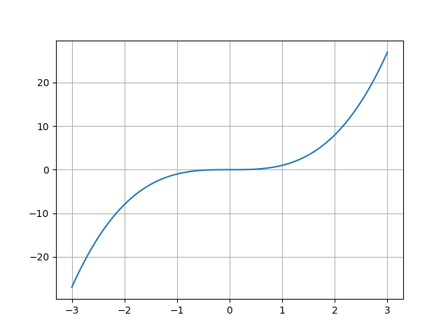
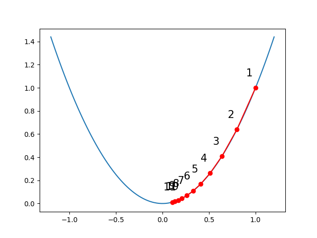
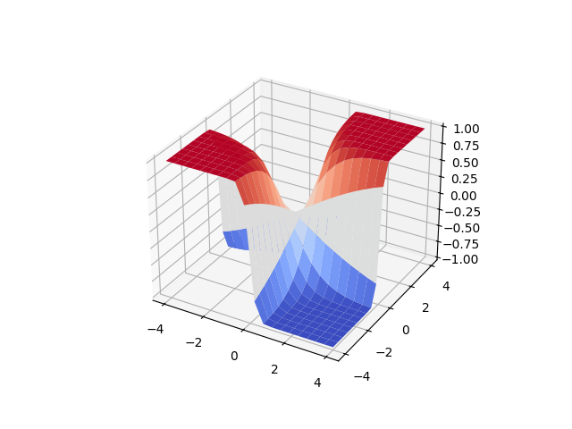

# Genel Optimizasyon, Paketler, Autograd

Otomatik türevin nasıl işlediğini [1] yazısında gördük. Programlama dilinde
yazılmış, içinde `if`, `case`, hatta döngüler bile içerebilen
herhangi bir kod parçasının türevini alabilmemizi sağlayan otomatik türev
almak pek çok alanda işimize yarar. Optimizasyon alanı bunların başında
geliyor. Düşünürsek, eğer sembolik olarak türev alması çok çetrefil bir
durum varsa, tasaya gerek yok; bir fonksiyonu kodlayabildiğimiz anda onun
türevini de alabiliriz demektir.

Autograd

Çok boyutlu bir fonksiyonun gradyani ve Hessian'ı,

```python
from autograd import grad, hessian

def objective(X): 
    x, y, z = X
    return x**2 + y**2 + z**2

x,y,z = 1.0,1.0,1.0

h = hessian(objective, 0)
res = h(np.array([x, y, z]))
print (res)

g = grad(objective, 0)
res = g(np.array([x, y, z]))
print (res)
```

```
[[2. 0. 0.]
 [0. 2. 0.]
 [0. 0. 2.]]
[2. 2. 2.]
```

Ya da

Hessian

Mesela $f(x_1,x_2) = x_2^3 + x_2^3 + x_1^2x_2^2$ gibi bir fonksiyon var
diyelim. Belli bir noktadaki Hessian

$$
H = \left[\begin{array}{rr}
\frac{\partial f}{\partial x_1x_1} & \frac{\partial f}{\partial x_1x_2} \\
\frac{\partial f}{\partial x_2x_1} & \frac{\partial f}{\partial x_2x_2} 
\end{array}\right]
$$

hesaplatmak için `autograd.hessian` kullanırız,

```python
import autograd 

def f(x):
    x1,x2=x[0],x[1]
    return x1**3 + x2**3 + (x1**2)*(x2**2)

print
xx = np.array([1.0,1.0])
h = autograd.hessian(f)
print (h(xx))
```

```
[[8. 4.]
 [4. 8.]]
```

Şimdi bazı genel optimizasyon konularını işleyelim. 

Sınırlanmamış optimizasyonda (unconstrained optimization) $f(x)$
fonksiyonunu minimum değerde tutacak $x$ değerini bulmaya uğraşıyoruz, ki
$x$ tek boyutlu skalar, ya da çok boyutlu $x \in \mathbb{R}^n$
olabilir. Yani yapmaya uğraştığımız

$$
\min_x f(x)
$$

işlemi. Peki minimumu nasıl tanımlarız? Bir nokta $x^\ast$ global minimize
edicidir eğer tüm $x$'ler için $f(x^\ast) \le f(x)$ ise, ki
$x \in \mathbb{R}^n$, en azından $x$ modelleyeni ilgilendiren tüm küme
öğeleri için.

Fakat çoğu zaman bir global $f$'i kullanmak mümkün olmayabilir, fonksiyon
çok çetrefil, çok boyutlu, bilinmez durumdadır, ve elimizde sadece yerel
bilgi vardır. Bu durumda üstteki tanımı "bir $N$ bölgesi içinde'' olacak
şekilde değiştiririz ki bölge, $x^\ast$ etrafındaki, yakınındaki bölgedir.

Üstteki tanımı okuyunca  $x^\ast$'in yerel minimum olup olmadığını anlamanın
tek yolunun yakındaki diğer tüm noktalara teker teker bakmak olduğu anlamı
çıkabilir, fakat eğer $f$ pürüzsüz bir fonksiyon ise yerel minimumu
doğrulamanın çok daha hızlı bir yöntemi vardır. Hatta ve hatta eğer
fonksiyon $f$ iki kez türevi alınabilir haldeyse $x^\ast$'in yerel minimum
olduğunu ispatlamak daha kolaylaşır, $\nabla f(x^\ast)$ ve Hessian $\nabla^2
f(x^\ast)$'e bakarak bunu yapabiliriz.

Minimallik için 1. ve 2. derece şartlar var. 1. derece gerekli şart (ama
yeterli değil) $\nabla f = 0$ olması. Bu standard Calculus'tan bildiğimiz
bir şey, minimum ya da maksimumda birinci türev sıfırdır. Ama türevin sıfır
olup minimum ya da maksimum olmadığı durum da olabilir, mesela
$f(x) = x^3$. $f'(0) = 0$'dir fakat $x=0$ ne maksimum ne de
minimumdur. Daha iyi bir termioloji $\nabla f = 0$ noktalarını {\em kritik
  nokta} olarak tanımlamaktır. $x=0$ noktasında bir değişim oluyor, bu
değişim kritik bir değişim, her ne kadar minimum ya da maksimum olmasa da.

```python
x = np.linspace(-3,3,100)
plt.plot(x,x**3)
plt.grid(True)
plt.savefig('func_40_autograd_01.png')
```



Bir kritik noktanın yerel maksimum ya da yerel minimum olup olmadığını
anlamak için fonksiyonun ikinci türevine bakabiliriz. Bir
$f: \mathbb{R}^n \to \mathbb{R}$ var ve $x^\ast$ noktasının kritik nokta
olduğunu düşünelim, yani $\nabla f(x^\ast) = 0$. Şimdi çok ufak bir $h$ adımı
için $f(x^\ast + h)$'a ne olduğuna bakalım. Burada Taylor açılımı
kullanabiliriz [2], 

$$
f(x + h^\ast) = 
f(x^\ast) + \nabla f(x^\ast) h + 
\frac{1}{2} h^T f(x^\ast) \nabla^2 (x^\ast) f(x^\ast) h + 
O(3)
$$

$\nabla^2 (x^\ast)$ bir matristır içinde $f$'nin ikinci derece türevleri
vardır [6]. Şimdi, kritik noktada olduğumuz için $\nabla f(x^\ast) = 0$, ve
$O(3)$ terimlerini iptal edersek, üstteki

$$
f(x^\ast + h^\ast) - f(x^\ast) = \frac{1}{2} h^T \nabla^2 (x^\ast)  h + O(3)
$$

haline gelir. Simdi "bir noktanın mesela yerel maksimum olması'' sözünü
$f(x^\ast + h^\ast) - f(x^\ast) < 0$ ile ifade edebiliriz, çünkü $x^\ast$ etrafındaki
tüm $x$'lerin $f$'in daha az değerlerinden olma şartını aramış oluyoruz
(adım atılıyor, çıkartma yapılıyor, sonuç sıfırdan küçük). Tabii bu "tüm''
söylemi yaklaşıksal, o sebeple minimumluk ifadesi *yerel*.

Devam edersek $f(x^\ast + h^\ast) - f(x^\ast) < 0$ olması şartı aynı zamanda
$\frac{1}{2} h^T \nabla^2 (x^\ast) h < 0$ anlamına gelir, bu da
$\nabla^2 (x^\ast )$ negatif kesin demektir. Çünkü $A$ simetrik bir matris
olduğu zaman

$x^TAx < 0$ ise matris negatif kesin

$x^TAx \le 0$ ise matris negatif yarı-kesin (negatif semi-definite)

$x^TAx > 0$ ise matris pozitif kesin

$x^TAx \ge 0$ ise matris pozitif yarı-kesin (positive semi-definite)

Gradyan Inisi

Optimizasyonun mekaniğine gelelim. Diyelim ki basit, tek boyutlu bir $f(x)
= x^2$ fonksiyonumuz var. Tek boyutlu bu ortamda bir noktadan başlayıp
gradyanın (1. türev) işaret ettiği yönde ufak bir adım atmak bizi minimuma
daha yaklaştırır, ve bunu ardı ardına yaparak yerel bir minimuma
erisebiliriz. Örnek $f(x)$ dışbükey (convex) olduğu için bu bizi global
minimuma götürür [3]. Formül

$$
x_{i+1} = x_i + \alpha \nabla f(x_i)
$$

Başlangıç $x_0$ herhangi bir nokta, üstteki formülle adım ata ata
ilerliyoruz, adım boyutunu bizim tanımladığımız bir $\alpha$ sabitiyle
ayarlayabiliyoruz. 


```python
import autograd

def fun(x):
    return x**2

def grad_desc(x, fun, alpha=0.1, max_iter=100):
    xs = np.zeros(1 + max_iter)
    xs[0] = x
    grad = autograd.grad(fun)
    
    for step in range(max_iter):
        x = x - alpha * grad(x)
        xs[step + 1] = x
        

    return xs

alpha = 0.1
x0 = 1.

x_opt = grad_desc(x0, fun, alpha = alpha, max_iter = 10)
y_opt = fun(x_opt)

x_true = np.linspace(-1.2, 1.2, 100)
y_true = fun(x_true)

plt.plot(x_true, y_true)
plt.plot(x_opt, y_opt, 'o-', c='red')

for i, (x, y) in enumerate(zip(x_opt, y_opt), 1):
      plt.text(x - 0.1, y + 0.1, i, fontsize=15)

plt.show()
```


Türevi `autograd` ile aldık, bu örnekte sembolik türev kolaydı, elle
$f'(x)=2x$ diyebilirdik ama gösterim amaçlı direk yazılımla türevi aldık.

Kısıtlanmış Optimizasyon

Mühendislik problemlerinde kısıtlanmış optimizasyon çok ortaya
çıkar. Prototipik örnek bir düzlem üzerindeki orijine en yakın noktayı
bulmak. Mesela düzlem $2x - y + z = 3$ olsun, ve mesafeyi minimize etmek
istiyoruz, bunu $x^2+y^2+z^2$ ile hesaplayabiliriz. Yani optimizasyon
problemi düzlem denklemi ile sınırlanan mesafe formülünün minimal noktasını
bulmak [5]. 

Problemi direk `scipy.optimize.minimize` ile çözelim. 

```python
from scipy.optimize import minimize

def objective(X): # hedef
    x, y, z = X
    return x**2 + y**2 + z**2

def cons(X): # kisitlama
    x, y, z = X
    return 2 * x - y + z - 3

x0 = [1, 1, 1]
sol = minimize(objective, x0, constraints={'type': 'eq', 'fun': cons})
print (sol)
```

```
     fun: 1.5000000035790053
     jac: array([ 1.99997392, -1.00010441,  0.99994774])
 message: 'Optimization terminated successfully.'
    nfev: 22
     nit: 4
    njev: 4
  status: 0
 success: True
       x: array([ 0.99998696, -0.50005221,  0.49997386])
```

Fonksiyon `minimize` için kısıtlamalar `eq` ile sıfıra eşit olma
üzerinden tanımlanır. Eğer `ineq` kullanılırsa sıfırdan büyük olma
tanımlanıyor o zaman mesela $x>0$ ve $x<5$ kısıtlamalarını getirmek
istersek, 

```python
cons=({'type': 'ineq','fun': lambda xvec: 5.0-xvec[1]}, # y<5
      {'type': 'ineq','fun': lambda xvec: xvec[1]}) # y>0
sol = minimize(objective, x0, method = 'SLSQP', constraints=cons)
print (sol)
```

Not: `SLSQP` metotu gradyana ihtiyaç duymuyor. 

```
     fun: 1.1090612774580318e-16
     jac: array([7.79817877e-12, 1.49011612e-08, 7.79860898e-12])
 message: 'Optimization terminated successfully.'
    nfev: 20
     nit: 4
    njev: 4
  status: 0
 success: True
       x: array([-7.44668151e-09,  2.73897702e-24, -7.44668129e-09])
```

Bazen her şeyi kendimiz yaparak tüm adımların ne yaptığından emin olmak
isteyebiliriz. Mesela kısıtlama şartlarını kendimiz bir Lagrange çarpanı
$f(x) f(x) - \lambda g(x)$ ifadesi üzerinden tanımlayıp, türevi alıp sıfıra
eşitleyip, $f_x(x)=f_y(x)=f_z(x)=g(x)=0$ ile, elde edilen kısıtsız
optimizasyonu çözmeyi tercih edebiliriz. Türevin alınmasını direk
`autograd`'a yaptırırız.

```python
import autograd.numpy as np
from autograd import grad

def F(L):
    x, y, z, _lambda = L
    return objective([x, y, z]) - _lambda * eq([x, y, z])

dfdL = grad(F, 0)

# Find L that returns all zeros in this function.
def obj(L):
    x, y, z, _lambda = L
    dFdx, dFdy, dFdz, dFdlam = dfdL(L)
    return [dFdx, dFdy, dFdz, eq([x, y, z])]

from scipy.optimize import fsolve
x, y, z, _lam = fsolve(obj, [0.0, 0.0, 0.0, 1.0])
print (x,y,z)
```

```
1.0 -0.5 0.5
```

Aynı sonuç bulundu. Şimdi merak ediyoruz, bu sonuç gerçekten minimum mu?
Üstteki noktada Hessian'ın pozitif kesin olup olmadığını kontrol
edebiliriz. Hessian'ı da `autograd` hesaplar! Once gradyan,

```python
from autograd import hessian
h = hessian(objective, 0)
res = h(np.array([x,y,z]))
print (res)
```

```
[[2. 0. 0.]
 [0. 2. 0.]
 [0. 0. 2.]]
```

Bu matris pozitif kesin, ama çıplak gözle bariz değilse, tüm özdeğerleri
pozitif olup olmadığına bakabiliriz, 

```python
print (np.linalg.eig(h(np.array([x, y, z])))[0])
```

```
[2. 2. 2.]
```

Birden Fazla Gradyan Değişkeni

Diyelim ki elimizde 

$$
g(w_1,w_2) = \tanh (w_1w_2)
$$

fonksiyonu var, bu üç boyutlu bir fonksiyon, ve optimizasyon amaçlı gradyan
gerekiyor, gradyanın iki değişken üzerinden alınması gerekli [7]. 

```python
import autograd
from autograd import numpy as anp

def g(w_1,w_2):
    return anp.tanh(w_1*w_2)

from mpl_toolkits.mplot3d import Axes3D
from matplotlib import cm
x = np.linspace(-4,4,20)
y = np.linspace(-4,4,20)
xx,yy = np.meshgrid(x,y)
zz = g(xx,yy)
fig = plt.figure()
ax = fig.gca(projection='3d')
surf = ax.plot_surface(xx, yy, zz, cmap=cm.coolwarm)
plt.savefig('func_40_autograd_03.png')
```



$g$'nin her iki kısmi türevini ve gradyanını, 

$$
\nabla g(w_1,w_2) = \left[\begin{array}{r}
\frac{\partial }{\partial w_1} g(w_1,w_2) \\
\frac{\partial }{\partial w_2} g(w_1,w_2) 
\end{array}\right]
$$

`autograd` ile hesaplamak için 

```python
dgdw1 = autograd.grad(g,0)
dgdw2 = autograd.grad(g,1)
```

Dikkat edersek, 0 ve 1 parametreleri geçildi, bunlar sırasıyla $w_1$ ve
$w_2$ değişkenlerine tekabül ediyorlar (`g` tanımındaki sıralarına
göre, 0. ve 1. parametreler). Şimdi mesela (1.0,2.0) noktasındaki gradyanı
hesaplayabiliriz,

```python
gradg = [dgdw1(1.0,2.0), dgdw2(1.0,2.0)]
print (gradg)
```

```
[0.14130164970632894, 0.07065082485316447]
```

Tabii çok boyutlu ortamda yazının başındaki teknikleri kullanmak daha iyi,
üstteki bir seçenek.

Kaynaklar 

[1] Bayramlı, Ders Notları, *Otomatik Türev Almak (Automatic Differentiation -AD-)*

[2] Schrimpf, [http://faculty.arts.ubc.ca/pschrimpf/526/526.html](http://faculty.arts.ubc.ca/pschrimpf/526/526.html)

[3] Stoyanov, [https://nikstoyanov.me/post/2019-04-14-numerical-optimizations](https://nikstoyanov.me/post/2019-04-14-numerical-optimizations)

[5] Kitchin, [http://kitchingroup.cheme.cmu.edu/blog/2018/11/03/Constrained-optimization-with-Lagrange-multipliers-and-autograd/](http://kitchingroup.cheme.cmu.edu/blog/2018/11/03/Constrained-optimization-with-Lagrange-multipliers-and-autograd/)

[6] Bayramlı, Cok Boyutlu Calculus, *Vektör Calculus, Kurallar, Matris Türevleri*

[7] Watt, *Automatic Differentiation*, 
    [https://jermwatt.github.io/machine_learning_refined/notes/3_First_order_methods/3_5_Automatic.html](https://jermwatt.github.io/machine_learning_refined/notes/3_First_order_methods/3_5_Automatic.html)


    


