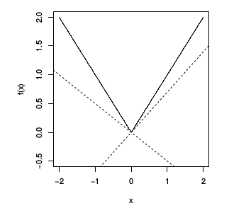
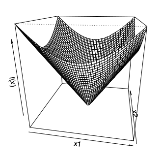
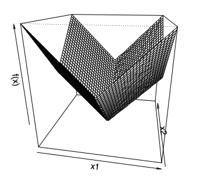
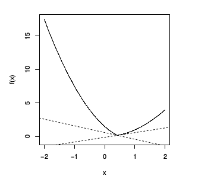
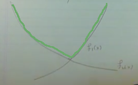

# Altgradyanlar (Subgradients) 

Altgradyanlar aslında bir algoritma değil, bir matematiksel kavram [1,
40:29], ve hem optimizasyon, hem analiz, hem de pratik bağlamda çok faydalı
bir kavram.  Hatırlarsak dışbükey ve türevi alınabilir bir $f$ için

$$
f(y) \ge f(x) + \nabla f(x)^T (y-x)  \quad \forall x,y
$$

gerekli ve yeterli bir şart. Yani fonksiyonuma herhangi bir noktada
oluşturacağım teğet eğri, lineer yaklaşıksallık, fonksiyonum için bir
global eksik / az tahmin edici (underestimator) olacaktır, yani hep ondan
küçük kalacaktır.

Altgradyan nedir? Altgradyan üstteki gradyanin yerini alabilecek herhangi
bir $g$ vektörüdür, yerine alabilecek derken üstteki ifade her $y$ için
hala doğru olacak şekilde. Dışbükey fonksiyon $f$'nin $x$ noktasında
altgradyanı herhangi bir $g \in \mathbb{R}^n$'dir öyle ki

$$
f(y) \ge f(x) + g^T (y-x) \quad \forall y
$$

Teğet çizgi hakkında: görsel olaral hayal edersek kap şeklinde, yani
dışbükey olan bir fonksiyona nerede teğet çizgi çekersem çekeyim
fonksiyonun kendisi hep o çizginin üstünde kalır. Eğer fonksiyonum kap
olmasaydı, habire aşağı yukarı inip çıkıyor olsaydı bir noktada o çizginin
altına düşülebilirdi. Eğer $f$ türevi alınabilir ise dışbükey olmasının
şartı üstteki ifadenin doğru olması.

Dışbükey fonksiyonlar için 

1) $g$ her zaman mevcuttur (dışbükey olmayan fonksiyonlar için $g$'nin
mevcudiyeti şart değildir). Bu güzel bir özellik. 

2) Eğer $x$ noktasında $f$'in türevi alınabilir ise, tek bir altgradyan
vardır, o da türevin kendisidir [1, 43:12], $g = \nabla f(x)$.

Aslında \#2 kalemi dışbükey olmayan bir $f$ için bile geçerli, eğer $g$
varsa. Bu durumlarda illa altgradyan olması gerekmiyor, hatta türevi
alınabilir dışbükey olmayan $f$ için bile $g$ olmayabiliyor. 

Dışbükey olmayan (pürüzsüz) ve altgradyanı olmayan bir fonksiyon örneği
nedir? Alttaki,


Bu fonksiyonun hiçbir yerde altgradyanı yok. Eğri üzerinde bir nokta
arıyorum öyle ki oradan geçen bir çizgi tüm fonksiyonu üstte
bıraksın.. böyle bir çizgi çizilemez. Altgradyan yok [1,
43:54]. Bazılarımız itiraz edebilir, "üstteki bir içbükey fonksiyon,
dışbükeyin ters çevrilmiş hali''. O zaman $x^3$ diyelim, pürüzsüz, ve
altgradyanı yok.

Altgradyanı mevcut fonksiyonlar görelim, mesela mutlak değer fonksiyonu
$f(x) = |x|$.



Altgradyanlar için farklı şartları görelim.

$x>0$ için tek bir altgradyan var, o da $g = 1$, yani fonksiyonun eğiminin
ta kendisi, eğim=1. Aynı şekilde $x<0$ için, o zaman $g=-1$. Bu sonuç
"eğer $f$'in $x$'te türevi alınabilir ise o noktada $g=\nabla f$''
açıklaması ile uyuyor. $x=0$ noktası için birçok seçenek var, herhangi bir
$[-1,1]$ öğesi için, yani -1 ve +1 arasındaki herhangi bir sayı olabilir,
çizgili noktalar seçeneklerden ikisi.

Boyut atlayalım, $f(x) = ||x||_2$ fonksiyonunu görelim, $x$'in L2
norm'u. İki boyutta [1, 45:51],



Eğer $x \ne 0$ ise bu fonksiyonun türevi alınabilir (yoksa alınamaz, bir
yaygın görüşe göre $x=0$'da problem yok, ama var) ve altgradyanı onun
mevcut gradyanı, $x / ||x||_2$. $x=0$ noktasında altgradyan $g$
$\{ z: ||z||_2 < 1\}$ kümesinin herhangi bir öğesi.

Şimdi $f(x) = ||x||_1$'e bakalım,



Bu fonksiyonun $x=0$'da türevi alınamaz, aynen tek boyutlu (mutlak değer
fonksiyonu) versiyonunda olduğu gibi. Ayrıca bu fonksiyonun herhangi bir
eksende sıfır değer olduğu zamanda da türevi alınamaz. Altgradyan için öğe öğe
yaklaşmak lazım, eğer bir öğe $x_i \ne 0$ ise $g_i = \mathrm{sign}(x_i)$, eğer
$x_i = 0$ ise $g_i \in [-1,+1]$.

En son örnek [1, 48:35] iki dışbükey fonksiyonun maksimumu olanı, yani
$f(x) = \max \{f_1(x),f_2(x) \}$ ki $f_1,f_2$ dışbükey ve türevi alınabilir
olmak üzere, ve $f(x)$ bu iki fonksiyonun her $x$ noktasında $f_1(x)$ ve
$f_2(x)$'den hangisi büyükse o. Bu tür bir maks fonksiyonunun sonucunun
dışbükey olduğunu önceki derslerden biliyoruz.



Altgradyan yine farklı şartlara göre değişik oluyor. Eğer $f_1(x) > f_2(x)$
o zaman altgradyan özgün, $g = \nabla f_1(x)$. Eğer $f_2(x) > f_1(x)$ ise
altgradyan özgün, $g = \nabla f_2(x)$. 

Kabaca çizersek birbirlerini kesen $f_1$ ve $f_2$ düşünelim, 



onların maks halleri yeşil ile [çok kabaca benim eklediğim] çizgi, yani
kesişmenin solunda $f_2$ sağında $f_1$. Tabii ki sol tarafta $f_2$ aktif o
zaman onun gradyanı geçerli, sağ tarafta $f_1$. Kesişme noktası, $f_1=f_2$
ilginç, $g = \alpha \nabla f_1(x) + (1-\alpha) f_2(x)$, yani $f_1,f_2$'nin
herhangi bir dışbükey kombinasyonu, ki iki üstteki resimde görülen iki
kesikli çizgiler bazı örnekler. 

Altdiferansiyel (Subdifferential)

Dişbükey $f$'in tüm altgradyanlarına altdiferansiyel denir [1,
52:35]. Çoğunlukla kısmi türev için kullanılan aynı sembolle gösterilir,
$\partial$ ile.

$$
\partial f(x) = \{ 
g \in \mathbb{R}^n: \quad g, f\textrm{'in altgradyanıdır}
\}
$$

Yani $x$ noktasındaki tüm mümkün altgradyanların kümesi altdiferansiyel
oluyor. 

1) $\partial f(x)$ kapalı ve dışbükey bir kümedir. İşin ilginç tarafı bu
dışbükey olmayan $f$'ler için bile geçerlidir. Niye olduğuna bakalım,
$\partial f(x)$ $x$'te $f(x)$'in tüm altgradyanlarıdır. Diyelim ki
$g_1,g_2$ altgradyanları bu altdiferansiyel kümesinde, $g_1 \in \partial
f(x)$ ve $g_2 \in \partial f(x)$. Simdi $\alpha g_1 + (1-\alpha) g_2$
nerededir ona bakalım [1, 53:59]. Bu değerin $y-x$ ile iş çarpımını alırsak
ve ona $f(x)$ eklersek acaba $f(y)$'den büyük bir değer elde eder miyiz?

$$
(\alpha g_1 + (1-\alpha) g_2)^T (y-x) + f(x) 
\underbrace{\le}_{?} f(y) \quad \forall y
\qquad (1)
$$

Üsttekini ispatlayabilirsek $\partial f(x)$'in bir dışbükey küme olduğunu
ispatlayabilirim, çünkü iki geçerli altgradyanın herhangi bir dışbükey
kombinasyonunu almışım ve hala küme içindeysem o küme dışbükey küme
demektir. 

Alttaki iki ifadenin doğru olduğunu biliyoruz, 

$$
 g_1^T (y-x) + f(x) \le f(y) 
$$

$$
 g_2^T (y-x) + f(x) \le f(y) 
$$

Eğer iki üstteki ifadeyi $\alpha$ ile bir üstteki ifadeyi $1-\alpha$ ile
çarparsam ve toplarsam, basitleştirme sonrası (1)'i elde ederim. İspat
böylece tamamlanır [1, 55:11].

Dikkat edersek $f$'nin dışbükey olup olmadığından bahsetmedik bile. 

2) Boş Olmamak: eğer $f$ dışbükey ise $\partial f(x)$ boş değildir.

3) Tek Altgradyan: önceden bahsettik ama eğer $f$ $x$ noktasında türevi
alınabilir ise altdiferansiyelde tek bir öğe vardır o da o noktadaki
gradyandır, $\partial f(x) = \{ \nabla f(x) \}$. 

4) Üstteki özelliğe tersten bakarsak, eğer $\partial f(x) = \{ g \}$, yani
altdiferansiyelde tek bir öğe var ise, o zaman $f$ o noktada türevi
alınabilir demektir ve o noktadaki gradyan $g$'dir. 

[disbukey geometri baglantisi atlanti]

Altdiferansiyel Calculus

Altgradyanların kendine has bir Calculus'u var, aynen gradyanları,
vs. içeren Çok Değişkenli Calculus'ta olduğu gibi [1, 59:53]. Birazdan
göstereceklerimizden daha fazlası ama alttakiler en faydalı olanları [1,
1:00:00]. Dişbukey $f$ fonksiyonları için alttakiler geçerlidir,

Ölçekleme: $\partial (af) = a \cdot \partial f$, $a$ sabit ise ve $a > 0$
olacak şekilde

Toplama: $\partial (f_1 + f_2) = \partial f_1 + \partial f_2$

Doğrusal Bileşim: Eğer $g(x) = f(Ax + b)$ ise o zaman
$\partial g(x) = A^T \partial f(Ax + b)$. Bu altgradyanlar için bir tür
Zincirleme Kanunu gibi. Hatta eğer $f$ türevi alınabilir ise, bu ifade tamı
tamına Zincirleme Kanunu olurdu. 

Noktasal Sonlu Maksimum: Eğer $f(x) = \max_{i=1,..,m} f_i(x)$ ise, o zaman 

$$
\partial f(x) = conv \left( 
\bigcup_{i: f_i(x)=f(x)} \partial f_i(x)
\right)
$$

Biraz karmaşık duruyor ama daha önce iki fonksiyon maksimumu üzerinden
gördüğümüz kavrama benziyor. Her noktada maks olan $f_i$'leri alıyoruz, ve
bu fonksiyonların altgradyanlarını hesaplıyoruz. Ama bu altgradyanların
birleşimi her zaman bir dışbükey küme oluşturmayabilir, ve
altdiferansiyelin bir dışbükey küme olması gerekir, o zaman için elimizde
olan altgradyanların $conv$ ile dışbükey zarfına (convex hull)
bakarız. Yani sadece birleşim $\cup$ ile elde ettiğim kümeyi bir işlemden
daha geçirerek onun dışbükey küme halini alıyorum.

[atlandi, norm, 1:09:00]

Niye Altgradyanlar? 

1) Optimizasyon: Önemli bir sebep [1, 1:12:00]. Bir dışbükey fonksiyonun
altgradyanını hesaplamak her zaman mümkündür, o zaman her dışbükey
fonksiyonu minimize edebilirim. Bazı durumlarda bu yavaş olabilir ama en
azından minimizasyon mümkün olur.

2) Dışbükey Analizi: Her $f$ için, dışbükey olsun olmasın, 

$$
f(x^\ast) = \min_x f(x) \iff 0 \in \partial f(x^\ast)
$$

Yani $x^\ast$ bir minimize edicidir sadece ve sadece 0 değeri $f$'in $x^\ast$
noktasında bir altgradyanı ise. Bu özelliğe çoğunlukla "altgradyan
optimalliği'' adı veriliyor. İspatı basit. Eğer $g$ vektörü $x^\ast$
noktasındaki altgradyan ise o zaman alttaki ifade her $y$ için doğrudur,

$$
f(y) \ge f(x^\ast) + 0^T (y-x^\ast) = f(x^\ast)
$$

$$
f(y) \ge f(x^\ast) \quad \forall y
$$

Üstteki ifade $x^\ast$ bir minimize edicidir diyor, o zaman sıfır bir
altgradyandır. 

Bazen üstteki ifadenin dışbükey olmayan fonksiyonlar için bile geçerli
olduğunu unutanlar oluyor [1:14:32]. Bu her $f$ için doğru diyorum bazen
bana şaşırmış şekilde bakıyorlar. Söylenen biraz sürpriz edici,
evet. İkizlik ve KKT şartları hakkında konuşurken benzer şaşırtıcı ifadeler
olacak.

Tabii eklemek gerekir bazen dışbükey olmayan fonksiyonlar için altgradyan
hesaplanamaz, ya da mevcut değillerdir. Her problemi çözmek için bir yemek
tarifi değil bu. Mesela başta gördüğümüz içbükey fonksiyon,


Altgradyanı yok (ama tabii minimize edicisi de yok). 

Altgradyanlarla devam edelim [2, 01:11], onlar bir dışbükey fonksiyonun
gradyanı kavramının genelleştirilmiş hali idi. 

Bir dikkat edilmesi gereken durum var ama, altgradyanlar bir dışbükey
fonksiyon için her zaman mevcuttur, ama bunu spesifik olarak "tanım
kümesinin nispeten iç bölgelerinde olacak şekilde'' diye vurgulamak
gerekir. Mesela gösterge fonksiyonu $I$'nin uç noktalarında mevcut değildir.

Şimdi altgradyan yönteminin gücüne bir örnek görelim. Derslerimizin başında
1. derece optimallik şartını görmüştük [2, 05:30],

$$
\min_x f(x) \quad \textrm{öyle ki} \quad x \in C
\qquad (3)
$$

problemini çözmek istiyoruz, diyelim $f$ dışbükey ve türevi alınabilir. Bu
problem için $x$'in çözüm olmasının şartı 

$$
\nabla f(x)^T (y-x) \ge 0 \quad \forall y \in C
$$

eşitsizliğinin doğru olmasıdır. Yani 1. derece minimallik gradyan sıfırı
verir, o zaman herhangi bir $\nabla f(x)^T(y-x)$ yönünde adım atmak bizi
her zaman bu minimallikten uzaklaştırmalıdır. Bu durum her olurlu $y \in C$
için doğru ise minimal yerdeyiz demektir [2, 05:50]. Ya da şöyle anlatalım,
$x$ noktasındayız, $y$ noktasına gitmeyi düşünüyoruz. O zaman $y-x$
vektörünü oluşturuyoruz, ve su soruyu soruyoruz, "kriter fonksiyonunun
gradyanı aynı çizgi de mi?''. Eğer aynı yönde ise o yönde hareket etmek
kriter $f(x)$'i arttırır. Yani eğer gradyan her mümkün olurlu yön ile aşağı
yukarı aynı yönü gösteriyorsa (azaltma / çoğaltma, -90/+90 derece
bağlamında) o zaman minimum noktadayız demektir. 


İşte bunu altgradyan perspektifinden ispatlayabiliriz [2, 06:33]. 

Üsttekini altgradyan perspektifinden ispatlayabiliriz. Önce problemimizi
sınırsız bir formatta tekrar tanımlayacağız.  Sınırlamayı bir gösterge $I_C$
haline getirerek bunu yapabiliriz,

$$
\min_x f(x) + I_C(x)
\qquad (2)
$$

ki $I_C(x) = 0$ eğer $x$, $C$ kümesi içindeyse, dışındaysa sonsuzluk. Şimdi
üstteki fonksiyona altgradyan optimalliği uygulayalım, eğer üstteki
fonksiyonu minimize eden bir nokta varsa elimde, bunun tercümesi sıfırın o
noktada fonksiyonun altgradyanı olması. Fonksiyonun altgradyanını
hesaplayalım, kurallarımıza göre iki dışbükey fonksiyon toplamının
altgradyani o fonksiyonların ayrı ayrı altgradyanlarının toplamı. $f$
dışbükey, $I_C$ dışbükey (çünkü $C$ kümesi dışbükey küme). $f$ pürüzsüz, o
zaman $x$'te onun altgradyan kümesi sadece o noktadaki gradyan. $I_C$'nin
altgradyanı normal koni $N_C$. O zaman 

$$
0 \in \partial ( f(x) + I_C(x) ) 
$$

$$
\iff 0 \in \nabla f(x) + N_C(x) 
$$


olmalı, ya da

$$
\iff - \nabla f(x) \in N_C(x) 
$$

olmalı. Şimdi normal koniyi hatırlayalım, tanımı

$$
N_C(x) = \{ g \in \mathbb{R}^n: g^T x \ge g^T y \quad \forall y \in C
$$

buna göre iki üstteki $N_C$, $g=-\nabla f$ üzerinden

$$
\iff -\nabla f(x)^T x \ge -\nabla f(x)^T y \quad \forall y \in C
$$

olarak açılabilir. Ya da

$$
\iff \nabla f(x)^T(y-x) \ge 0 \quad \forall y \in C
$$

Üstteki 1. derece optimallik şartına benziyor zaten. $-\nabla f(x)$ üstteki
tanımın bir öğesidir, o zaman 0 altgradyan kümesinin öğesidir. 

İşte gayet temiz bir şekilde optimallik ispatı yapmış olduk. Bu arada
sınırlama içeren optimizasiyon problemi için alttaki tanım

$$
0 \in \partial f(x) + N_c
$$

ifadesi her nasılsa tamamen genel, yani dışbükey bir problem tanımı için
gerekli ve yeterli bir şart çünkü hatırlarsak bahsettik ki tüm dışbükey
problemleri (2) ya da (3) formunda öne sürmek mümkün. Tabii üstteki formlea
iş yapmak kolay değildir, çünkü $N_C$ ile çalışmak zor. Eğer $C$ çetrefil
bir küme ise, mesela

$$
C = \{ x: g_i(x) \le 0, Ax = b \}
$$

gibi, o zaman normal koniyi oluşturmak zor olacaktır. Yani iki üstteki
tanımın her zaman faydalı olduğunu söyleyemeyiz, ama her dışbükey problem
için gerekli ve yeterli şart olduğunu söyleyebiliyoruz.

Sonradan optimalliği tanımlamanın farklı bir yolunu göreceğiz. Sınırlama
ifadeleri olduğu zaman problemler daha az çetin / çözülür hale gelir,
problemler sınırsız-sınırlı halde birbirine eşit şekilde tanımlanabilirler,
ama sınırlı tanımları çözmek daha kolay. KKT koşulları burada devreye
girecek.  Yani her şeyi kritere tıkmak, gösterge vs ile uğraşmak,
altgradyan almak yerine bu tür tanımla çalışmak daha rahat oluyor [2, 12:00].

Altgradyan optimalliğinin bazı diğer örneklerini görelim, mesela Lasso
için altgradyan optimalliği. Bazılarının bilebileceği üzere Lasso
problemini parametrize etmenin iki yolu vardır, birisi katsayılar üzerinde
bir L1 norm kısıtlaması tanımlamak, diğeri ise alttaki gibi onu kritere
dahil etmek, 

$$
\min_\beta \frac{1}{2} || y - X \beta ||_2^2 + \lambda ||\beta||_1
\qquad (5)
$$

ki $\lambda \ge 0$. Altgradyan optimalliğinde sadece ve sadece alttaki şart
geçerliyse elimizde bir çözüm var diyebiliyoruz, bu şart, 

$$
0 \in \big( 
\frac{1}{2} || y - X \beta ||_2^2 + \lambda ||\beta||_1
\big)
$$

yani eğer 0 kriterimin altgradyan kümesinde ise. Üstteki altgradyanın
uygulandığı toplam işaretinin iki tarafı da dışbükey o zaman onları
altgradyanların toplamı olarak açabilirim, ayrıca soldaki terim bir de
pürüzsüz olduğu için tek altgradyan normal gradyandır,

$$
\iff 0 \in -X^T (y - X\beta) + \lambda \partial ||\beta||_1
$$

$$
\iff X^T (y - X\beta) = \lambda v 
\qquad (4)
$$

herhangi bir $v \in \partial ||\beta||_1$ için. L1 norm'un altgradyanı için
daha önce gördüğümüz üzere bileşen bileşen bakmak gerekiyor, ve farklı
şartlara göre parçalı bir fonksiyon elde edeceğiz, 

$$
v_i \in
\left\{ \begin{array}{ll}
\{1\} & \textrm{eğer } \beta_i > 0 \\
\{-1\} & \textrm{eğer } \beta_i < 0 \\
{[} -1,+1{]} & \textrm{eger } \beta_i = 0 
\end{array} \right.
$$

Yeni öyle bir $\beta$ arıyorum ki herhangi bir $v$ vektörü için (4)'u
tatmin edecek ve bu $v$ geçerli bir altgradyan olacak, yani üstteki
şartlara uyacak. O zaman çözüme erişmişim demektir. Çözümü şu anda
vermiyoruz, bunlar çözüm için uyulması gereken optimallik şartları [2,
15:24].

Her $\beta_i$ için üstteki denklemin nasıl oluşacağını görmek istersek, ve
$X_1,..,X_p$ değerleri $X$ matrisinin kolonları olacak şekilde

$$
\left[\begin{array}{ccc}
\uparrow & \uparrow & \\
&& \\
X_1 & X_2 & \dots \\
&& \\
\downarrow & \downarrow & 
\end{array}\right]^T
\left[\begin{array}{c}
y_1 \\ \vdots \\ y_p 
\end{array}\right] 
- 
\left[\begin{array}{ccc}
\uparrow & \uparrow & \\
&& \\
X_1 & X_2 & \dots \\
&& \\
\downarrow & \downarrow & 
\end{array}\right]
\left[\begin{array}{c}
\beta_1 \\ \vdots \\ \beta_p 
\end{array}\right]  =
\lambda
\left[\begin{array}{c}
v_1 \\ \vdots \\ v_p 
\end{array}\right] 
$$

O zaman bunu her $v_i$ olasılığı için yazarsak, $\beta_i$'in sıfır olup
olmadığı üzerinden bir parçalı fonksiyon ortaya çıkartabiliriz. Altgradyan
optimallik şartı,

$$
\left\{ \begin{array}{ll}
X_i^T (y-X\beta) = \lambda \cdot \mathrm{sign}(\beta_i) & \textrm{eger } \beta_i \ne 0 \\
| X_i^T (y-X\beta)  | \le \lambda  & \textrm{eger } \beta_i = 0 
\end{array} \right.
$$

haline geldi. İkinci satırı nasıl elde ettik? Eğer $\beta_i=0$ ise bu bana
$\lambda v$ ifadesi $-\lambda$ ve $+\lambda$ arasında herhangi bir yerde
olabilir diyor (çünkü $v_i$ parçalı fonksiyonunda $\beta_i=0$ ise $v_i$ -1
ve +1 arası herhangi bir değer dedik), ve $-\lambda$ ve $+\lambda$ arası
olma durumunu son satırdaki mutlak değer ifadesine tercüme edebiliriz.

Dikkat, üstteki ifade optimalliğe bakma / kontrol etmek için bir
yöntem. Birisi size bir vektör veriyor [2, 16:57], sonra soruyor "bu
vektör Lasso kriterine göre optimal midir?'' Öyle olup olmadığına bakmak
için vektörün her ögesine bakıyoruz, ve üstteki kontrolü işletiyoruz. Eğer
her öge optimal ise evet diyoruz, tek bir öğe bile optimal değilse hayır
diyoruz.

Üstteki parçalı formüldeki ikinci bölümü ilginç bir şekilde
kullanabiliriz. Diyelim ki 100 değişkenlik modeli Lasso ile veriye
uydurduk, ve $\beta$ katsayıları elde ettik, bir regresyon yaptık
yani. Diyelim ki çözümden sonra birisi geliyor size 101. kolon veriyor,
acaba tüm uydurma işlemini baştan tekrar mı yapmak lazım? Belki hayır, 
$| X_{101}^T (y-X\beta)  | \le \lambda$ kontrolünü yaparız, eğer koşul
doğru ise o zaman $\beta_{100} = 0$ demektir, ve bu katsayıya gerek
yoktur, modelin geri kalanı değişmeden kalır [2, 20:42]. 

Bir diğer ilginç uygulama Lasso'nun basitleştirilmiş hali; $X = I$ yani
birim matrisi olduğu durum. Bu yaklaşımla bazılarının gürültü silme
(denoising) dediği işlemi yapabilmiş oluyoruz. $X=I$ deyince Lasso'da geri
kalan, 

$$
\min_\beta \frac{1}{2} || y - \beta ||_2^2 + \lambda ||\beta||_1
$$

Bu problem ifadesi diyor ki "öyle bir $\beta$ vektörü bul ki $y$'ye
olabildiği kadar yakın olsun ve $\beta$ üzerinde bir L1 cezası
olsun''. Yana bana içinde bir sürü gözlem noktası taşıyan bir $y$ veriliyor
ve ben bu gözlemleri en iyi şekilde yaklaşıklayan $\beta$'yi arıyorum ve bu
$\beta$'nin seyrek olmasını [2, 24:23] tercih ediyorum (L1 cezası ile bu
oluyor, büyük değerler cezalandırılınca çözü katsayının sıfıra yakın
olmasını özendirmiş oluruz). Artık biliyoruz ki üstteki problemi altgradyan
optimalliği ile çözmek mümkün.

Daha önce gördüğümüz Lasso altgradyan optimalliğini $X=I$  için tekrar
yazarsak

$$
\left\{ \begin{array}{ll}
(y-\beta_i) = \lambda \cdot \mathrm{sign}(\beta_i) & \textrm{eger } \beta_i \ne 0 \\
| |y-\beta_i|  | \le \lambda  & \textrm{eger } \beta_i = 0 
\end{array} \right.
$$

Çözüm $\beta = S_\lambda(y)$, ki $S_\lambda(y)$'ye yumuşak eşikleme
(soft-threshold) operatörü deniyor. Üstteki optimalliğe uyan bir çözüm,
hatta tek çözüm, budur.

$$
[ S_\lambda(y) ]_i = 
\left\{ \begin{array}{ll}
y_i - \lambda & \textrm{eğer } y_i > \lambda_i \\
0 & \textrm{eğer } -\lambda \ge y_i \ge \lambda, \quad i=1,..,n \\
y_i + \lambda & \textrm{eğer } y_i < -\lambda_i 
\end{array} \right.
$$

Çözümün optimallik şartlarına uyup uymadığı rahatça kontrol
edilebilir. Formülde $\beta=S_\lambda(y)$ diyerek alttakilerin doğru olup
olmadığına bakarız, 

Eğer $y_i > \lambda, \beta_i = y_i - \lambda > 0$ ise $y_i-\beta_i =
\lambda = \lambda \cdot 1$ mı?

Eğer $y_i < -\lambda$ ise benzer şekilde

Eğer $|y_i| \ge \lambda, \beta_i=0$ ise $|y_i-\beta_i| = |y_i| \ge \lambda$ mi?

[distance to convex set örneği atlandı]

Daha önce gradyan inişi (gradient descent) algoritmasını görmüştük, bu
algoritma çok basittir. Şimdi işleri biraz daha zorlaştıracağız [2,
48:00]. Bu metotun bir dezavantajı optimize edilen $f$'nin türevi
alınabilir bir fonksiyon olma zorunluluğu. Diğer bir dezavantaj
yakınsamanın uzun zaman alabilmesi.

Altgradyan Metodu

Gradyan inişi yapısına benziyor, $f$'in dışbükey olması ve
$\mathrm{dom}(f) = \mathbb{R}^n$ olması lazım, ama $f$'nin pürüzsüz olma
zorunluluğu yok.

Gradyan inişi gibi özyineli bir şekilde, $x^{(0)}$'dan başlıyoruz, ve

$$
x^{(k)} = x^{(k-1)} - t_k \cdot g^{(k-1)}, \quad k=1,2,3,..
$$

adım atarak ilerliyoruz, öyle ki $g^{(k-1)} \in \partial f(x^{(k-1)})$
yani $f$'nin $x^{(k-1)}$ noktasındaki herhangi bir altgradyanı. Adım ata
ata gidiyorum, her adımda mevcut altgradyanlara bakıyorum, herhangi birini
seçiyorum, ona $g^{(k-1)}$ diyelim, ve $x$'i bu yönde olacak şekilde bir
$t_k$'ye oranlı olarak güncelliyorum [2, 49:50]. 

Altgradyan metotunun ilginç özelliklerinden biri her adımda iniş yapmanın
garanti olmaması (herhalde onun için "altgradyan inişi'' yerine
"altgradyan metotu'' ismi verilmiş). Bu sebeple adım atarken o ana kadar,
yani $x^{(0)},.., x^{(k)}$ içinde olan en iyi (best) (en minimal) noktayı
hatırlamak gerekiyor, $x_{best}^{(k)}$, ki 

$$
f(x_{best}^{(k)}) = \min_{i=0,..,k} f(x^{(i)})
$$

Eğer mesela altgradyan metotunun 100,000 adım işletmişsem erişilmiş minimal
nokta olarak bu hatırlanan en iyi noktayı sonuç olarak rapor ederim.

Adım büyüklüğü nasıl seçilir?

Sabit adım büyüklüğü seçmek bir seçenek. Küçükçe seçilen böyle bir
büyüklük işler. 

Çokça kullanılan bir diğer seçenek "gittikçe yokolan'' adım büyüklüğü. Bu
tür adım seçimi için kullanabilecek pek çok kural var, aranan bir nitelik
sıfıra gidilmesi ama çok hızlı gidilmemesi. Mesela $t_k = 1/k$ uygun.
Altgradyanlarda geriye iz sürmenin karşılığı yok.

Yakınsama analizi

Altgradyan metotunun yakınsama analizi gradyan inişinin analizinden biraz
farklı [2, 54:15]. Diyelim ki elimizde bir dışbükey fonksiyon $f$ var ve
tanım kümesi herşey, $\mathrm{dom}(f) = \mathbb{R}^n$. Fonksiyon ayrıca Lipschitz
sürekli, fonksiyonun sürekli olduğunun söylemiyoruz dikkat, fonksiyon sabit
$G > 0$ üzerinden Lipschitz sürekli, yani

$$
|f(x) - f(y)| \ge G || x-y ||_2 \quad \forall x,y
$$

Bunu baz alarak iki tane teori öne sürebiliriz, birisi sabit adım
büyüklüğü, diğeri azalan adım büyüklüğü için.

Yokolan adım büyüklüğü için iki şart tanımlayalım, "kare toplanabilir ama
toplanabilir değil'', yani şu iki şart,

$$
\sum_{k=1}^{\infty} t_k^2 < \infty, \quad \sum_{k=1}^{\infty} t_k - \infty
$$

Şimdi iki teoriyi tanımlayabiliriz,

Teori 1

Sabitlenmiş $t$ için altgradyan metotu alttaki şartı tanımlar, 

$$
\lim_{k \to \infty} f(x_{best}^{(k)} ) \le f^\ast + G^2 t / 2
$$

Üstteki ifade diyor ki eğer altgradyan metotunu sonsuza kadar işletirsek
eldeki en iyi noktadan elde edilecek fonksiyon değeri gerçek optimum artı
Lipschitz sabitinin karesi çarpı $t/2$'dan küçük olacaktır, ki $t$
sabitlenmiş adım büyüklüğü. Ama üstteki yine de çözüm için bir limit
vermiyor. Onun için alttaki lazım,

Teori 2

Yokolan adım büyüklükleri için

$$
\lim_{k \to \infty} f(x_{best}^{(k)} ) = f^\ast 
$$

[ek detaylar atlandı]

Altgradyan metotuna bir örnek olarak [2, 1:01:36] regülarize edilmiş
lojistik regresyona bakabiliriz. $\beta$ katsayılarını bulmaya uğraşıyoruz,
ve veriye uydurma bağlamında bir kayıp fonksiyonunu minimize etmeye
uğracağız. Önce normal regresyon,

$$
f(\beta) = \sum_{i=1}^{n} \left(-y_ix_i^T\beta + \log( 1 + \exp (x_i^T\beta) \right) 
$$

Üstteki pürüzsüz ve dışbükey bir fonksiyon. 

$$
\nabla f(\beta) = \sum_{i=1}^{n} (y_i - p_i(\beta)) x_i
$$

ki $p_i(x) = \exp(x_i^T\beta) / (1+ \exp(x_i^T\beta))$, $i=1,..,n$. 

Regülarize edilmiş lojistik regresyon

$$
\min_\beta f(\beta) + \lambda \cdot P(\beta)
$$

ki $P(\beta) = ||\beta||_2^2$ olabilir (Ridge cezası) ya da
$P(\beta) = ||\beta|_1|$ (Lasso cezası). Bu cezalardan ilki pürüzsüz,
diğeri değil. Böylece birinde gradyan inişi diğerinde altgradyan metotu
kullanmak zorunda olacağız.

Ekler

Alttaki örnek [3]'ten,

$$
\min_w F(w) = \frac{1}{2} \sum_{i=1}^{N} (x_i^T w - y_i)^2 + \lambda ||w||_1
$$

gibi bir Lasso örneği var. 

```python
import pandas as pd
import numpy as np
import matplotlib.pyplot as plt

def subgrad(w):
    return X.T*(X*w-y) + lamda*np.sign(w)

def obj(w):
    r = X*w-y;
    return np.sum(np.multiply(r,r))/2 + lamda * np.sum(np.abs(w))

N = 40
dim = 10
max_iter = 200
lamda = 1/np.sqrt(N);
np.random.seed(50)
w = np.matrix(np.random.multivariate_normal([0.0]*dim, np.eye(dim))).T
X = np.matrix(np.random.multivariate_normal([0.0]*dim, np.eye(dim), size = N))
y = X*w

w = np.matrix([0.0]*dim).T
obj_SD = []
gamma = 0.01
for t in range(0, max_iter):
    obj_val = obj(w)
    w = w - gamma * subgrad(w)/np.sqrt(t+1)
    obj_SD.append(obj_val.item())
    if (t%5==0): print('iter= {},\tobjective= {:3f}'.format(t, obj_val.item()))

print (w)
```

```
iter= 0,	objective= 169.279279
iter= 5,	objective= 24.721959
iter= 10,	objective= 13.195682
iter= 15,	objective= 8.739994
iter= 20,	objective= 6.419780
iter= 25,	objective= 5.034598
iter= 30,	objective= 4.138547
iter= 35,	objective= 3.526977
iter= 40,	objective= 3.093047
iter= 45,	objective= 2.775883
iter= 50,	objective= 2.538530
iter= 55,	objective= 2.357443
iter= 60,	objective= 2.217031
iter= 65,	objective= 2.106647
iter= 70,	objective= 2.018829
iter= 75,	objective= 1.948229
iter= 80,	objective= 1.890943
iter= 85,	objective= 1.844077
iter= 90,	objective= 1.805447
iter= 95,	objective= 1.773392
iter= 100,	objective= 1.746629
iter= 105,	objective= 1.724158
iter= 110,	objective= 1.705193
iter= 115,	objective= 1.689110
iter= 120,	objective= 1.675411
iter= 125,	objective= 1.663694
iter= 130,	objective= 1.653633
iter= 135,	objective= 1.644963
iter= 140,	objective= 1.637466
iter= 145,	objective= 1.630964
iter= 150,	objective= 1.625306
iter= 155,	objective= 1.620369
iter= 160,	objective= 1.616050
iter= 165,	objective= 1.612262
iter= 170,	objective= 1.608931
iter= 175,	objective= 1.605996
iter= 180,	objective= 1.603403
iter= 185,	objective= 1.601108
iter= 190,	objective= 1.599073
iter= 195,	objective= 1.597264
[[-1.53942055]
 [-0.02366012]
 [-0.61081721]
 [-1.43597808]
 [ 1.3626909 ]
 [-0.47342589]
 [-0.78826118]
 [ 1.04965236]
 [-1.27159815]
 [-1.32969646]]
```

Bir diğer örnek [4]'ten, burada kodlanan (5)'teki formül aslında, kodun
sembollerini kullanırsak,  

$$
\min_x \frac{1}{2} || Ax - b||_2 + \lambda ||x||_1
$$

L1 normu $||x||_1$ gradyan inişi için problemli o sebeple altgradyan metotu
kullanacağız. Veri olarak [5]'te görülen diyabet verisini alabiliriz,

```python
import scipy.io as sio
import pandas as pd
import numpy as np
import matplotlib.pyplot as plt
import numpy.linalg as lin

def subgrad_func(A,b,lam):
    n2 = A.shape[1]
    x = np.zeros((n2,1))
    k=1
    g = np.ones((n2,1))
    t = 0.01
    f = []
    while True:
        if k>3: 
            crit = np.abs(f[k-2]-f[k-3])/f[k-2]
            if crit < 1e-5: break
        tmp = 0.5*lin.norm(np.dot(A,x)-b,2)**2+lam*lin.norm(x,1);        
        if k%10==0: print (tmp)
        f.append(tmp)
        s = x.copy()
        s[x>0]=1
        s[x<0]=-1
        if len(s[x==0])>0: 
            s[x==0] = -2*np.random.rand(len(x==0))+1
        g = np.dot(A.T,np.dot(A,x)-b) + lam*s
        x = x - t*g
        k = k+1
    return x
                
diabetes = pd.read_csv("../../stat/stat_120_regular/diabetes.csv",sep=';')
y = np.array(diabetes['response'].astype(float)).reshape(442,1)
A = np.array(diabetes.drop("response",axis=1))

lam = 0.1;
x = subgrad_func(A,y,lam);
print ('x')
print (x)
```

```
6167530.253256479
6017359.332614086
5936043.378499364
5887955.958919385
5856837.417105291
5835069.931049544
5818932.590413047
5806489.16976122
5796653.745550204
5788760.388544399
5782366.953999686
5777155.717300746
5772889.40103409
5769385.329280358
5766499.620202982
5764117.531938736
5762146.838816163
5760513.025122407
5759155.660694774
5758025.5987459235
5757082.775086282
5756294.462375693
5755633.876252789
x
[[   5.34807751]
 [-200.87752927]
 [ 490.9420537 ]
 [ 304.14877939]
 [ -43.03872491]
 [-107.97583692]
 [-207.47086585]
 [ 127.15527296]
 [ 410.70880916]
 [ 115.41867007]]
```

Bir dışbükey kümesi üzerinden tanımlı ama pürüzsüz olmayabilecek bir
dışbükey fonksiyonu minimize etmek için yansıtılan altgradyan (projected
subgradient) metotu adlı bir metot ta kullanılabilir [2, 22:04].  

Dışbükey $f$'yi dışbükey küme $C$ üzerinden optimize etmek için 

$$
\min_x f(x) \quad \textrm{öyle ki} \quad x \in C
$$

$$
x^{(k)} = P_C \left( x^{(k-1)} - t_k g_k^{(k-1)} \right)
$$

Bu metot normal altgradyan metotu gibi, tek fark parantez içinde görülen
altgradyan adımı atıldıktan sonra elde edilen sonucun $C$ kümesine geri
yansıtılması (projection), çünkü atılan adım sonucunda olurlu bir sonuç
elde etmemiş olabiliriz. 

Yakınsama analizi normal altgraydan metotuna benziyor, bu metotla da benzer
yakınsama garantisi elde edilebiliyor, yakınsama oranı da buna dahil.

Yansıtma adımı bazen zor olabilir, hangi durumlarda kolay olduğunun listesi
aşağıda [2, 23:53]. Hangi kümelere yansıtmak kolaydır?

1) Doğrusal görüntüler: $\{  Ax + b: x \in \mathbb{R}^n  \}$

2) $\{ x: Ax = b \}$ sisteminin çözüm kümesi 

3) Negatif olmayan bölge: $\mathbb{R}_{+}^n = \{x: x \ge 0 \}$. Verilen
vektörün negatif değerlerinin sıfır yapmak, pozitifleri tutmak bize o
vektörün negatif olmayan bölge karşılığını veriyor. 

4) Bazı norm topları $\{ x: ||x||_p \le 1 \}$, $p=1,2,..,\infty$ için. Daha
önce 2-norm topuna yansıtmayı gördük, vektörü alıp normalize edersek bu
kümeye yansıtma yapmış oluyoruz aslında. Bu yansıtma bizi o vektörün 2-norm
topundaki en yakın diğer vektöre götürüyor. Sonsuz norm kolay, bir kutuya
yansıtma yapmış oluyoruz, bunun ne demek olduğunu düşünmeyi size
bırakıyorum, 1-norm en zoru. 

5) Bazı çokyüzlüler (polyhedra) ve basit koniler.

Bir uyarıda bulunalım, tanımı basit duran kümeler ortaya çıkartmak
kolaydır, fakat bu kümelere yansıtma yapan operatörler çok zor
olabilir. Mesela gelişigüzel bir çokyüzlü $C = \{ x: Ax \le b \}$ kümesine
yansıtma yapmak zordur. Bu problemin kendisi apayrı bir optimizasyon
problemi aslında, bir QP. 

[stochastic subgradient method atlandı]

Altgradyanların iyi tarafı genel uygulanabilirlik. Altgradyan metotları
dışbükey, Lipschitz fonksiyonları üzerinde bir anlamda optimaldir. Ünlü
bilimci Nesterov'un bu bağlamda bir teorisi vardır [2, 45:12], pürüzsüz
durumlarda ve 1. derece yöntemlerde altgradyanların lineer kombinasyonları
üzerinden güncellemenin sonucu olan adımların başarısına bir alt sınır
tanımlar. 


Kaynaklar

[1] Tibshirani, *Convex Optimization, Lecture Video 6*, 
[https://www.youtube.com/channel/UCIvaLZcfz3ikJ1cD-zMpIXg](https://www.youtube.com/channel/UCIvaLZcfz3ikJ1cD-zMpIXg)

[2] Tibshirani, *Convex Optimization, Lecture Video 7*, 
[https://www.youtube.com/channel/UCIvaLZcfz3ikJ1cD-zMpIXg](https://www.youtube.com/channel/UCIvaLZcfz3ikJ1cD-zMpIXg)

[3] He, *IE 598 - BIG DATA OPTIMIZATION*,  
    [http://niaohe.ise.illinois.edu/IE598_2016/](http://niaohe.ise.illinois.edu/IE598_2016/)

[4] Feng, *Lasso*, 
    [https://github.com/fengcls/Lasso](https://github.com/fengcls/Lasso)

[5] Bayramlı, {\em Istatistik, Regresyon, Ridge, Lasso, Çapraz Sağlama, Regülarize Etmek


