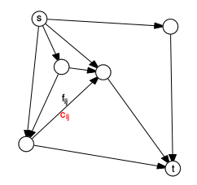
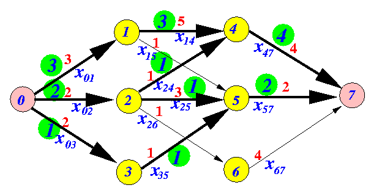
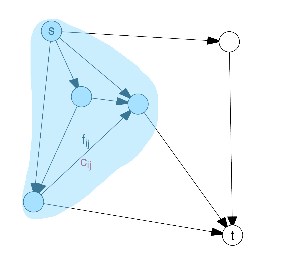
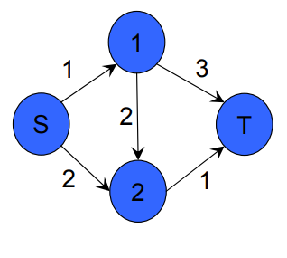
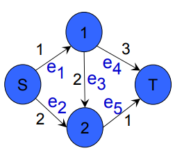

# Çifteşlik, İkizlik (Duality)

Bu benim en favori konularımdan [1]. Çok faydalı ve çok güzel bir teknik,
bakış açısı. Bu konu üzerinde iki ders zamanı harcayacağız. Konuyu lineer
programlama (LP) üzerinden göreceğiz, çünkü bu alanda çifteşlik pratik
olarak rahatça gösterilebiliyor.

[önceki ders özeti atlandı]

Önümüzdeki iki ders için teori şapkamızı takacağız, tabii çifteşliğin pek
çok optimizasyon problemi üzerinde çok ciddi etkileri var. Yani bu konu
bulutlar üzerinde, aşırı soyut bir konu değil, onu vurgulamak istiyorum. 

Ama şimdilik soyut denebilecek bir problemle başlayalım. Diyelim ki elimde
bir LP var ve bu LP'nin optimal değeri için bir alt sınır bulmak istiyorum,
$B \le \min_x f(x)$. Çifteşliğe bu çok basit soru üzerinden giriş
yapacağız. Örnek

$$
\min_{x,y} x+y, \quad \textrm{öyle ki}
$$
$$
x + y \ge 2 
$$
$$
x,y \ge 0
$$

dogru olsun. 

İki skalar değişken var, ve pozitif olmalılar. Bu problem için alt sınır
nedir? Çıplak gözle bile bakarak bunu bulabiliriz, cevap 2. Değil mi? $x+y
\ge 2$ şartına uymak gerekiyorsa alt sınır 2 olacaktır. 

Bazılarınız düşünebilir ki "şanslıydık, problem şartları aradığımız şeyi
söylüyordu zaten''. Doğru fakat iddia ediyorum ki bu stratejiyi metodik bir
şekilde de kullanabilirdik. Benzer bir problem, 

$$
\min_{x,y} x + 3y, \quad \textrm{öyle ki}
$$
$$
x + y \ge 2 
$$
$$
x \ge 0, y \ge 0
$$

Bu problemin alt sınırını nasıl buluruz?

Eğer $y \ge 0$ şartını ikiyle çarparsak $2y \ge 0$ diye yeni bir şart elde
ederiz (hala doğru), bu yeni şartı alıp $x + y \ge 2$'a eklersek
$x + 3y \ge 2$ şeklinde bir şart daha elde etmiş oluruz. Bu şart hedef
fonksiyonuna benzediği için alt sınırı direk söylüyor, alt sınır yine 2.
 
Üstteki probleme daha genel bir açıdan bakalım,

$$
\min_{x,y} px + qy, \quad \textrm{öyle ki}
$$
$$
x + y \ge 2
$$
$$
x,y \ge 0
$$

Alt sınır nedir? Öncekine göre biraz farklı bir strateji izleyeceğiz,
diyelim ki her şartı $a,b,c$ sabitleri ile çarptım, 

$$
ax + ay \ge 2a
$$
$$
bx \ge 0
$$
$$
cy \ge 0
$$

Bu tabii ki $a,b,c \ge 0$ ise yapılabilir yoksa işaretler değişirdi. Devam
edelim, yine bazı ek koşullar yaratmış oldum. Bu yeni şartları toplarsam
bir yeni şart daha elde ederim,

$$
(a+b)x + (a+c)y \ge 2a
$$

Yeni değişken isimleri $p,q$ atarsam

$$
px + qy \ge 2a
$$

atama

$$
a+b = p, \quad a+c = q
$$

Aslında alt sınırı iki üstteki denklemden bulmuş olduk, $2a$ (bir üstteki
şartlara uyulduğu sürece tabii).

Eğer en iyi alt sınırı isteseydim, onu nasıl elde ederdim? Bu demektir ki
$2a$ olabildiğince büyük olmalı, tabii belli şartlara uyulduğu
sürece. Aslında bu soru bizi ikinci bir LP'ye götürüyor, literatürde ana
LP'nin çifteşi / ikizi denen LP'ye. İki değişkenli ortamda,

$$
\max_{a,b,c} 2a \quad \textrm{öyle ki}
$$
$$
a + b = p
$$
$$
a + c = q
$$
$$
a,b,c \ge 0
$$

Maksimum arandığına dikkat ve bu problemde üç tane değişken var (ana
problemde iki taneydi). Ve böylece deriz ki üstteki şartlara uyan her
$a,b,c$ (ki bu şartlara ikizin olurluk / fizibilite şartları deniyor)
maksimal noktada ana problemin alt sınırını minimize eder.

Bir soru sorayım: acaba üstteki problemden bir eşitlik elde etmem mümkün
mü? Yani ikizdeki problemin optimal değeri ana problemdeki optimal değere
eşit olabilir mi? Cevap evet. Peki arada boşluk olması mümkün mü? Cevap
(bazen) evet. İyi bir sezgisel bakış bu, ana ve ikiz LP optimal değerleri
neredeyse her zaman birbirine eşittir, bazı istanai patolojik durumlar
dışında.

Farklı bir probleme bakalım. Bu problemde bir eşitlik te olacak. 

$$
\min_{a,b,c} px + qy \quad \textrm{öyle ki}
$$
$$
x \ge 0
$$
$$
y \le 1
$$
$$
3x + y = 2
$$

İkizi bulmak için her koşul için bir değişken atayalım, ama ondan önce her
ana koşulda eşitsizlikler aynı şekilde ise işimiz daha rahatlaşır (çünkü
$a,b,c,..$ değişkenlerini sıfırdan büyük yapacağız, ama farklı yönleri
gösteren ana koşullar ile bu zorlaşıyor), $y \le 1$ yerine $-y \ge -1$
mesela, o zaman

$$
\min_{a,b,c} px + qy \quad \textrm{öyle ki}
$$
$$
x \ge 0
$$
$$
-y \ge -1
$$
$$
3x + y = 2
$$

Yine $a,b,c$ ile çarpıyorum, 

$$
a x \ge 0
$$
$$
-by \ge -b
$$
$$
3cx + cy = 2c
$$
$$
a,b \ge 0
$$


$c$ üzerinde koşul var mı? Hayır, çünkü $c$'nin çarptığı koşul bir eşitlik,
$c$ ne olursa olsun yeni koşul geçerli, işaret değişiminden korkmaya gerek
yok.

Önceden olduğu gibi bir toplam alıyoruz, 

$$
(a+3c) x + (-b+c)y \ge -b + 2c
$$

Yine $p,q$ atamasını yaparsam,

$$
p x + q y \ge -b + 2c
$$

$$
p = a+3c, \quad q = -b + c 
$$

İkiz problemi elde ettik, amaç ana problemin alt sınırı $-b+2c$'yi maksimize
etmek, üstteki iki şart ve $a,b \ge 0$ olacak şekilde. 

$$
\max_{a,b,c} 2c - b \quad \textrm{öyle ki}
$$
$$
a + 3c = p
$$
$$
-b + c = q
$$
$$
a,b \ge 0
$$

Dersin geri kalanında ikizlikten genel bir çerçevede bahsedeceğim, sonra 
bir ilginç örnek göreceğiz, ardından ikizliğe yeni bir bakış açısından
yaklaşacağız, bu açı çok önemli olacak. Dersi ikinci bir örnekle
bitireceğiz. 

LP'lere tüm genelliği ile bakalım şimdi. Önceki format neler olup bittiğini
görmek açısından faydalı, ama genel şablonu da görmek lazım. 

Tanımlar

$c \in \mathbb{R}^n$, 
$A \in \mathbb{R}^{m \times n}$, 
$b \in \mathbb{R}^m$,
$G \in \mathbb{R}^{r \times n}$, 
$h \in \mathbb{R}^r$ verili. 

Ana Problem

$$
\min_x c^T x \quad \textrm{öyle ki}
$$
$$
Ax = b
$$
$$
Gx \le h
\qquad (1)
$$

İkiz Problem

$$
\max_{u,v} -b^T u - h^T v \quad \textrm{öyle ki}
$$
$$
-A^Tu - G^Tv = c
$$
$$
v \ge 0
\qquad (2)
$$

İkizi nasıl elde ettik? 

$Ax = b$ ve $Gx \le h$ için iki (vektör) değişkeni tanımlıyoruz, sırasıyla
$u,v$. $u$ için kısıtlama yok, çünkü eşitlik için. Sadece $v \ge 0$
olmalı. 

Eger $x$ olurlu ise 

$$
a^T (Ax - b) + v^T (Gx-h) \le 0
$$

olur çünkü olurluluk noktasında $Ax - b=0$ ve $Gx-h \le 0$, bu sebeple
üstteki toplam tabii ki sıfırdan küçük.

Gruplarsak,

$$
(A^T u + G^T v)^T x - b^Tu - h^T v \ge 0
$$

$$
(-A^T u - G^T v)^T x \ge  -b^Tu - h^T v 
$$

Parantez içini $c$'ye atarsam o zaman 

$$
c^T x \ge  -b^Tu - h^T v 
$$

Böylece eşitliğin sağ tarafı alt sınırım olur, sol tarafı ise ikiz
değişkenlerim üzerinde kısıtlama haline gelir, $v \ge 0$. Böylece ikiz
probleme erişmiş oluyoruz.

Sonraki örneğe gelelim. Bu probleme maks akış min kesiş (max flow min cut)
problemi deniyor. Konunun gelişmesindeki ilginç bir hikaye 20. yüzyıl
başında Sovyetler maks akış Amerikalılar ise min kesiş problemlerini
çözmeye odaklanmıştı, fakat bu iki problem ikizlik üzerinden aslında aynı
problem.

Maksimum akış problemi şöyle: bir yönlü çizit verildi diyelim,



İki nokta arasında bağlantı varsa $c_{ij}$ o iki nokta $i,j$ arasındaki
bağlantının kapasitesini gösteriyor, eğer bir tren hattından bahsediyorsak
o bağlantıdan geçebilecek yük miktarı, eğer su borusu ise oradan akabilecek
su miktarı, ya da bir yol ise o yolun uzunluğu, vs. olabilir. Bir
bağlantıdan gerçekte olan akışı $f_{ij}$ olarak tanımlayabiliriz,

$$
0 \le f_{ij} \le c_{ij}
$$

ve $i,j \in E$ olacak, burada $E$ tüm kenarların (edges) indisleri, çizit
$G = (V,E)$ olarak tanımlı, $V$ çizitin düğüm noktaları (vertices). Bir
diğer şart (ki aslında bu bariz) bir düğüme giren akışın çıkan akışla eşit
olması. 

$$
\sum_{(i,k) \in E} f_{ik} = \sum_{kj} f_{kj} \quad k \in V \backslash \{s,t\} 
$$

Not: $\backslash$ işareti "hariç" demek. 

Maks akış problemi eldeki bir malı, nakliyatı diyelim, bir başlangıç
noktası $s$ bitişi noktası $t$'ye maksimum miktarda nakil edebilecek yolları
bulmaktır. Dikkat: $s$'den mal göndermek deyince $s$'den çıkan pek çok
yoldan nakliyat paylaştırılarak gönderilebilir, altta görüldüğü gibi
(kırmızı hat kapasitesi, yeşil bir optimal akış örneği, başlangıç 0 bitiş
7).



O zaman maksimum akışı bir LP olarak kodlayalım,

$$
\max_{f \in \mathbb{R}^{|E|}} \sum_{(s,j)\in E} f_{sj}, \quad \textrm{öyle ki}
$$
$$
0 \le f_{ij} \le c_{ij}, \quad \forall i,j \in E
$$
$$
\sum_{(i,k) \in E} f_{ik} = \sum_{kj} f_{kj} \quad k \in V \backslash \{s,t\} 
$$

Fakat tek bir toplam ile tüm çizit üzerinden maksimum akışı nasıl formülize
edebildik? Hedef fonksiyonundaki toplam sadece başlangıç $s$'den çıkan
akışa bakıyor? Buradaki ufak numara yaptığımız kısıtlamayla bağlantılı,
akışın muhafaza edilmesini şart koştuğumuz için optimal akış, her ne ise,
çıkış noktasından olan toplamı ile varış noktasına girişi aynı tutmalı
(aradaki geçiş düğümleri için de aynı şey geçerli olduğu için tabii), bu
sebeple optimizasyonu tek bir toplam ile tanımlayabildik. Üstteki grafik
örnekte görülüyor, çıkış toplam 3+2+1 varış toplam 4+2. O zaman çıkışı
optimize edersek $t$'ye varan, tüm düğümler üzerinden olabilecek akışı
maksimize etmiş oluruz.

Bu programın ikizini hesaplayabiliriz, üstteki bir LP ikizini bulmayı
biliyoruz, ana LP'dekiler kısıtlamalar kadar yeni değişken elde ederiz,
vs.. Daha önce minimizasyon problemlerinin ikizine baktık, ana problemde
bir alt sınır elde etmeye uğraşıyorduk. Şimdi ana problem maksimizasyon, o
zaman hedef için üst sınır aramak bizi ikize götürür. Min probleminde bile
hedefe bir eksi işareti eklesem onu maksimizasyon olarak görebilirdim, ve
üst sınıra bakabilirdim. İkizin türetilmesi için notlara bakılabilir
[2]. Sonuçta şu minimizasyonu elde ediyorum,

$$
\min_{b \in \mathbb{R}^{|E|}, x \in \mathbb{R}^{|V|}} 
\sum_{(i,j) \in E} b_{ij} c_{ij} \quad \textrm{öyle ki}
$$

$$
b_{ij} \ge x_i - x_j
$$
$$
b_{ij}, x_i,x_j \in \{ 0,1\} \quad \forall i,j
$$

Elde ettiğimiz sonuç (hala ikize gelmedik) şunu söylüyor, elimdeki
düğümleri öyle iki gruba ayırmak istiyorum ki (altta bir grup görülüyor,
renkli kısım), bir gruptan diğer gruba geçen kapasitelerin, geçen
kenarların kapasitelerinin toplamı minimal olsun.



Bu arada üstteki program bir LP değil, bir tamsayı programı (integer
program) çünkü eldeki düğümleri bir gruba ya da diğerine (0,1 değerleri
üzerinden) atıyoruz, değişkenler ikisel, doğal olarak tam sayılar. Şimdi
ikize geliyoruz, ana problemi ikiz üstteki tamsayı programının gevşetilmiş
(relaxation) hali. 0,1 tamsayılarını alıp onları 0 ile 1 arasında gidip
gelebilen reel değişkenler olarak tanımlarsak bir LP elde ederiz. 

Yani ana / ikizlik ve üstteki gevşetme arasındaki ilişkiler şöyle

maksimum akış değeri $\le$ 
gevşetilmiş minimum kesiş $\le$ 
minimum kesişin kapasitesi

Gevşetme ile minimum değer daha azaldı, tamsayı programını gevşetip
dışbükey program haline getirince bunun olduğu biliniyor, kısıtlama
kümesini genişlettim, bu minimumu küçültecektir. 

Herhalde kesiş kelimesinin nereden geldiği anlaşılıyor şimdi, eğer elimde
bir makasla renkli bölgeye giden bağlantıları kessem, en az miktarda akışı
kesmiş olurum, ve o renkli bölge içindeki akış en yüksek kapasitede olur.
Ve buradaki problemde güçlü ikizlik durumu olduğu için bu iki değer
birbirine eşit! 

Şimdi LP ikizliğine farklı bir açıdan bakalım, ki bu açı oldukça faydalı
olacak. 

Şimdi (1) ve (2) formunu tekrar hatırlayalım. Ana problemdeki $c^Tx$'e
eşitlik ve eşitsizlik kısıtlamalarını daha önce bir kez gördüğümüz
gibi ekleyince,

$$
c^T x \ge c^T x + u^T (Ax-b) + v^T (Gx-h)
$$

Bu doğru çünkü olurlu $x$ için $Ax-b$ sıfır ve $Gx-h$ sıfırdan küçük,
$v \ge 0$. Yani toplam $c^T x$'dan muhakkak daha küçük. 

Ayrıca şunu da söylemek mümkün, diyelim ki $x \in C$ olurlu değerler, 

$$
f^\ast = \min_{x \in C} c^T x \ge 
\min_{x \in C} c^T x + u^T (Ax-b) + v^T (Gx-h) \ge
\min_x c^T x + u^T (Ax-b) + v^T (Gx-h)
$$

En sağdaki eşitsizlik yeni eklendi, buradaki ifadenin ortadakinen tek farkı
$x$'lerinin sadece olurlu kümeden değil mümkün tüm $x$'ler
olabilmesi. Herhangi bir $x$ de bizi herhangi bir hedefe götürebilecegi
icin (kısıtlama kalmadı) $-\infty$ bile olmak mümkün, üstteki eşitsizlik bu
sebeple doğru.

En sağdaki ifadeyi $g(u,v)$ olarak yazabiliriz, $u,v$'nin bir
fonksiyonu olarak. Bu fonksiyon $f^\ast$'ye bir alt sınır sağlar, 

$$
f^\ast \ge g(u,v)
$$

ki $v \ge 0$ olduğu sürece. 

O zaman mümkün olan en büyük alt sınır $g(u,v)$'yi hesaplamak istiyorsak,
ikiz problemimiz $g(u,v)$'yi olabildiğince büyük yapmak olabilir, yani onu
maksimize etmek. 

$$
\max_{u,v} g(u,v) \quad \textrm{öyle ki}
$$
$$
v \ge 0
$$

Bu ikizi türetmenin bir başka yoludur. Üstteki problemden gelen $g$ ki ona
çoğunlukla $g^\ast$ denir, $f^\ast$ için bir alt sınır oluşturacaktır,

$$
g^\ast \le f^\ast
$$

Şimdi $g$'nin nasıl bir fonksiyon olduğuna yakında bakalım. Tanım şöyleydi,

$$
g(u,v) = \min_x c^T x + u^T (Ax-b) + v^T (Gx-h)
$$

Bir gruplama yapalım,

$$
= \min_x (c^T + A^Tu + G^T v)^T x - b^T u - h^Tu
$$

Üstteki $x$ bağlamında bir lineer fonksiyon değil mi? Birşeyler devriği
çarpı $x$ artı birşeyler. Tüm $x$'ler üzerinden bu fonksiyonun minimumu
nedir? Eksi sonsuzluk, eğer parantez içindeki değer sıfır değilse.. Değil
mi? Eğer $x$ sıfırla çarpılıp yokedilmiyorsa $x$'i istediğim tarafa çekip
hedefi istediğim kadar negatife götürebilirim.

Ama $c^T + A^Tu + G^T v$ sıfır ise o zaman minimum nedir? Sıfırdan geri
kalanlar, $- b^T u - h^Tu$, o zaman 

$$
= \left\{ \begin{array}{ll}
-\infty & \text{eğer} \quad c^T + A^Tu + G^T v \ne 0 \\
- b^T u - h^Tu & \text{eğer} \quad c^T + A^Tu + G^T v = 0 
\end{array} \right.
$$

Negatif sonsuz olmayan duruma bakıyoruz, $c^T + A^Tu + G^T v = 0 $ şartı
aynı zamanda $c = -A^Tu - G^T v $ demektir, o zaman $g(u,v)$'yi
$v \ge 0$ olacak şekilde maksimize etmek demek

$$
\max_{u,v} - b^T u - h^Tu   \quad \textrm{öyle ki}
$$
$$
c = -A^Tu - G^T v, \quad v \ge 0
$$

programıyla eşdeğerdir. 

İkiz programa erişmiş olduk, farklı bir yönden geldik, ama yine (2) ile
aynı noktaya ulaştık. 

Bu ikinci türetiş şeklinin daha faydalı olmasının sebebini anlatalım
şimdi. İlk ikiz alma stratejimiz neydi? Elimizde 

$$
\min f(x) \quad \textrm{öyle ki}
$$
$$
Ax = b
$$
$$
Gx \ge h
$$
$$
v \ge 0
$$

var, her kısıtlamaları ikiz değişkenler $u,v$ ile çarpıyoruz, birleşik bir
denklem, bir lineer kombinasyon elde ediyoruz,

$$
u^T(Ax-b) + v^T (Gx-h) \le 0
$$

Sonra üstteki ifadeyi bir şekilde $f(x)$'e eşitlemem lazım, ya da $f(x)$'i
içeren bir şeylere eşitlemem lazım, ki onu kullanarak ana değer için bir
alt sınır elde edebileyim. İlk stratejimiz buydu değil mi? 

$$
f(x) + \textrm{birşeyler} \ge 0
$$

elde etmek. 

Bu iyi güzel ama genel bağlamda bu yöntem her zaman işlemez. Eğer $f(x)$
lineer değilse, onu lineer kombinasyonlar kullanarak nasıl elde edebiliriz
ki? Mümkün değil. Yani üstteki yöntem $f(x)$ lineer ise işler, diğer
durumlarda işlemez.

İkinci stratejinin güzel tarafı burada. Her zaman işler, yeter ki $f$
dışbükey olsun. Aslında bir açıdan dışbükeylik olmasa da işliyor, buna
sonra geleceğiz. İkinci stratejiyi tekrar hatırlarsak, bir Lagrangian
oluşturmuştuk, bu ifadede ana hedefe ikiz değişkenlerle noktasal çarpım
üzerinden eklenen kısıtlamalar vardı, ve minimizasyonu olurlu set yerine
tüm $x$'ler üzerinden yapıyorduk, ve bu bize her zaman ana hedef için bir
alt sınır veriyordu.

[Matris oyunları örneği atlandı]

Ekler

Altta maksimum akışı LP olarak çözen sayısal bir örnek görüyoruz.

Örnek

Alttaki örnekte [3] bir maksimum akış çözümü görelim. Çizit ve her kenarın
kapasiteleri görülüyor




```python
from scipy.optimize import linprog
import numpy as np

A_ub = np.eye(5)
b_ub = np.array([1.,2.,2.,3.,1.])
A_eq = np.array([[1, 0, -1, -1, 0],
                 [0, 1, 1, 0, -1]])
b_eq = np.array([ 0, 0 ]);
f = np.array( [ 1, 1, 0, 0, 0 ])
res = linprog(-f, A_ub=A_ub, b_ub=b_ub, \
                 A_eq=A_eq, b_eq=b_eq)
print (np.round(res.x))
```

```
[1. 1. 0. 1. 1.]
```

```python
print (res.x.dot(f))
```

```
1.9999999998438802
```

Not: `linprog` minimize etmeye ayarlı olduğu için hedefi eksi ile
çarptık, yani maksimizasyon yaptırmış olduk.

Maksimum akış 2.0 olarak bulundu. 

Optimize edilen $-f^T x$ dersek vektör $x$ içindeki öğeler
$e_1,e_2,e_3,e_4,e_5$, ve $f$ içinde $1,1,0,0,0$ var, yani aslında sadece
$e_1,e_2$'nin akış toplamına bakmış oluyoruz. Bu normal, sebeplerinden önce
bahsetmiştik. Bulunan sonuç $x^\ast = (1,1,0,1,1)$, ve $f^Tx^\ast$ çarpımı ilk
iki öğeyi toplatıyor, ve 1+1 = 2, maksimum akış.

Eşitlik kısıtlamaları $A_{eq}$ ve $b_{eq}$ içinde, $A_{eq}x = b_{eq}$ için.
Sadece iki kısıtlama var, bu kısıtlamalardan ilki 1'e giren $e_1$ ile ondan
çıkan $e_3,e_4$'un eşit olması gerektiğini söylüyor, bu sebeple ilk
kısıtlama $1,0,-1,-1,0$, ve ona tekabül eden $b_{eq}$ sıfır değerinde,
$e_1$ akışı ile $e_3,e_4$ toplanırsa sıfır olsun demiş oluyoruz. İkinci
kısıtlama 2'ye giren iki akış $e_2,e_3$ ile çıkan $e_5$'i dengeliyor.

Eşitsizlik kısıtlamaları $A_{ub}x \le b_{ub}$. Burada kapasiteleri
kodluyoruz, her kenarın kapasitesi belli, $e_1$ için 1, $e_2$ için 2, vs.
Ve optimal sonuç bulunuyor.

Not: bu problemi lineer program olarak kodlayabilmek çok şey
kazandırdı. Diğer yandan üstteki problemi bilgisayar bilim bağlamında çözen
yaklaşımlar da vardır, hatta çizitin özel yapısından faydalanarak bu
yaklaşımların bazıları oldukca hızlı.

Kaynaklar

[1] Tibshirani, *Convex Optimization, Lecture Video 10*, 
[https://www.youtube.com/channel/UCIvaLZcfz3ikJ1cD-zMpIXg](https://www.youtube.com/channel/UCIvaLZcfz3ikJ1cD-zMpIXg)   

[2] Tibshirani, *Convex Optimization, Lecture Notes*, 
[https://www.stat.cmu.edu/~ryantibs/convexopt/](https://www.stat.cmu.edu/~ryantibs/convexopt/)

[3] Zisserman, *C25 Optimization*, 
[http://www.robots.ox.ac.uk/~az/lectures/opt/](http://www.robots.ox.ac.uk/~az/lectures/opt/)   


