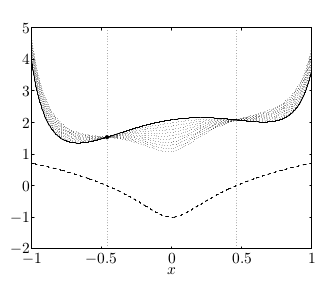
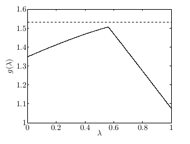
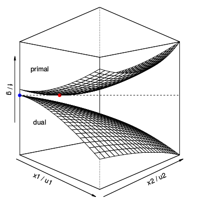
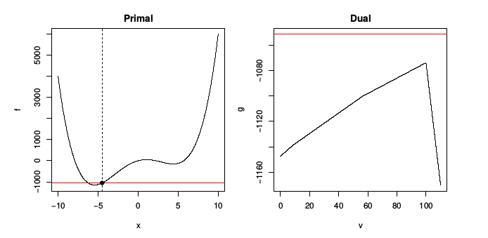

# Genel Çifteşlik / İkizlik (General Duality)

Bu derste [1] genel dışbükey problemlerinde ikizlik konusunu göreceğiz, ek
olarak dışbükey olmayan durumlara da bakacağız. İkizlik oldukça genel bir
konu.

Önceki derste ikizliği elde etmenin ikinci yönteminde 

$$
L(x,u,v) \equiv c^T x + u^T (Ax-b) + v^T (Gx-h) 
$$

tanımı üzerinden (Lagrangian)

$$
f^\ast = \min_{x \in C} L(x,u,v) \ge \min_x L(x,u,v) \equiv g(u,v)
$$

şeklinde bir formül elde etmiştik, $u,v$ sabitlendiği durumda ve $x \in C$
olurlu çözümleri kümesi olacak şekilde, ve bu küme üzerinden Lagrangian'ın,
tüm $x$'ler üzerinden olan Lagrangian'dan her zaman daha büyük olacağını
görmüştük. Aslında bu çok basit bir fikir ama bu basit ve kuvvetli fikir
sayesinde ikizliği genel problemlere uygulamak mümkün oluyor. 

Ayrıca, sonradan göreceğimiz üzere, en sağdaki eşitsizlik ikiz çözüm $u,v$
noktasına sıkı (tight), yani olurlu kümeyi bir yana atarak bir şey
kaybetmiş olmadık. Yani üstte görülen eşitsizlik bazılarına gevşek
gelebilir, ama doğru $u,v$'de son derece sıkıdır. 

Neyse devam edersek, yine üstte görülen $g(u,v)$ $u,v$'nin bir fonksiyonu
ve işin güzel tarafı çoğunlukla hesaplanabilir bir fonksiyon. Yani
$L(x,u,v)$'yi $x$ üzeriden minimize etmek $u,v$'nin bir fonksiyonu. 

Bir diğer deyişle, $g(u,v)$ fonksiyonu $f^\ast$ üzerinde herhangi bir $u$ ve
$v \ge 0$ için bir alt sınır. Ikiz fonksiyonu olarak isimlendirilen $g$.

Lagrangian'ı tekrar düzenleyerek alttakini elde etmiştik, 

$$
g(u,v) = \left\{ \begin{array}{ll}
-\infty & \text{eğer} \quad c^T + A^Tu + G^T v \ne 0 \\
- b^T u - h^Tu & \text{eğer} \quad c^T + A^Tu + G^T v = 0 
\end{array} \right.
$$

Şimdi LP'lerden ilerleyip, düşünebildiğimiz en genel optimizasyon formuna
bakacağız. Dişbükey (convex) olması şart değil ama tabii ki dışbükey
durumlara özel ilgi göstereceğiz. Form,

$$
\min_{x} f(x), \quad \textrm{öyle ki}
$$
$$
h_i(x) \le 0, \quad i=1,..,m
$$
$$
l_j(x) \le 0, \quad j=1,..,r
$$

Eğer sadece dışbükeylige bakıyor olsaydık $f,h_i$'lerin dışbükey,
$l_i$'lerin ise doğrusal olması gerekirdi. Lagrangian'i tanımlayalım, hala
çok genel bir şekilde yaklaşıyoruz tabii, 

$$
L(x,u,v) = f(x) + \sum_{i=1}^{m} u_i h_i(x) + \sum_{i=1}^{r} v_i l_i(x) 
$$

Eşitlik ve eşitsizlik kritlerini ikiz değişkenler ile çarpıp topluyoruz, ve
hedefe ekliyoruz. Daha önce olduğu gibi eşitlik kısıtlamarını çarpan
$u_i$'lar sıfır olmamalı çünkü $f(x)$ ile Lagrangian arasında bir ilişki
kuracağız, ve ana problemdeki eşitsizlin işaret değiştirmesini
istemiyoruz. 

Bu arada "ikiz değişkenler'' kelimesi duruma göre bazen "Lagrange
çarpanı'' olarak görülebilir. 

Önemli özellik, her $v$ ve $u \ge 0$ için, her olurlu $x$ noktasında

$$
f(x) \ge L(x,u,v)
$$

Niye? Daha önce LP'lerle gördüğümüz fikirle aynı durum, olurlu noktalarda

$$
L(x,u,v) =  f(x) + 
\sum_{i=1}^{m} u_i \underbrace{h_i(x)}_{\le 0} + 
\sum_{i=1}^{r} v_i \underbrace{l_i(x)}_{=0}
$$

Olurlu noktalarda $l_i$'ler sıfır, o zaman tüm $l_i$'leri toplamı yokolur,
$u_i$'lerin hepsi sıfırdan büyük olmalı ve olurlu noktada $h_i$'ler
sıfırdan küçük, pozitif çarpı negatif eşittir negatif, toplam negatif,
$f(x)$'den bir değer eksiltilmiş olacaktır, bu da muhakkak $f(x)$'den küçük
bir sonuca sebep olacaktır, iki üstteki bu şekilde ispatlanmış olur.

Üstteki fonksiyonu, parçalarını grafiksel olarak alttaki gibi görebiliriz,

Kesiksiz çizgi kriter / hedef fonksiyonu örnek bir $f$. Dikkat edersek
görülen $f$ dışbükey değil, bunu genel dışbükey olmayan ortamlarda da
tekniğin işlediğini göstermek için yaptık. 

Noktalı eğrilerin her biri farklı $u$'lar için $L$'nin değerleri, ayrıca
olurlu kümeyi $[-0.46,0.46]$ arasında olacak şekilde seçtik. Yani 

$$
\min_{x} f(x), \quad \textrm{öyle ki}
$$
$$
h_i(x) \le 0
$$

programını ele almış olduk, noktalalı eğriler ile çizilen ise 

$$
L(x,u) = f(x) + u l(x)
$$

Devam edersek belli bir $f^\ast$ minimumu düşünelim, 

$$
f^\ast \ge \min_{x \in C} L(x,u,v) \ge \min_x L(x,u,v) \equiv g(u,v)
$$ 

LP örneğindeki yaklaşım, sadece olurlu küme $C$ yerine tüm $x$'ler
üzerinden minimizasiyon bir alt sınır oluşturur. $g(u,v)$'ye ikiz fonksiyon
diyoruz.

Peki niye $g(u,v)$ tanımını $\min_{x \in C} L(x,u,v)$ için yapmadım, tüm
$x$'ler üzerinden olan kısıtlanmamış versiyon için yaptım? Çünkü tüm
$x$'ler üzerinden olan tanım bizim için daha faydalı. O tür ifadeler
üzerinde analitik çözüm geliştirmek daha rahattır, analitik çözüm olmasa
bile tüm $x$'ler üzerinden yaklaşım daha faydalı. Tabii hala bazı
kısıtlamalar var, mesela $u \ge 0$ olmalı.

İkiz fonksiyon $g$'nin $\lambda$'ya (aslında $u$) gore bir grafiğini altta görüyoruz,

Kesikli çizgi kriter, ve $g$ her $\lambda$ için kriterin hep altında.

Peki niye ikizi yapabildiğim en büyük değer kriterin olurlu kümede
olabilecek en ufak değerine eşit değil (ikizin tepesi kesikli çizgiye
değmiyor)? Çünkü elimizdeki bir dışbükey olmayan fonksiyon. Dişbükeylik
olsaydı alt sınır sıkı olurdu. Dışbükey olmayan fonksiyonlarda da sıkılık
görülebilir ama dışbükeylik durumundaki gibi bu şart değildir.

Biraz daha zor bir örneğe bakalım. 

Standart formda bir karesel program (QP). 

$$
\min_x \frac{1}{2} x^T Q x + c^T x \quad \textrm{öyle ki}
$$
$$
Ax = b, \quad x \ge 0
$$

ki $Q$ pozitif kesin, $Q \succ 0$ olarak gösterilir, en küçük özdeğeri
harfiyen sıfırdan büyük (yani $>0$, $\ge 0$ değil), bu durumda üstteki
problem harfiyen dışbükey olur.

Lagrangian için öğrendiğimiz tarifi uygularsak, 

$$
L(x,u,v) = \frac{1}{2} x^T Q x + c^Tx  - u^T x + v^T (Ax - b)
\qquad (2)
$$

İkiz fonksiyonu bulalım şimdi. $x$, üzerinden minimizasyon yapılan değişken
olacağı için $g$'de olmayacak, yani

$$
g(u,v) = \min_x L(x,u,v) 
$$

$x$'ler üzerinden ufak bir gruplama sonrası

$$
= \min_x \frac{1}{2} x^T Q x + (c - u + A^T v)^T x - b^T v  
\qquad (1)
$$

Bu minimumu nasıl buluruz? Gradyanı alıp sıfıra eşitleriz değil mi? Tabii
üstteki tanıdık bir formda, eğer tek boyuttan hatırlarsak, 

$$
ax^2 + bx + c
$$

formülü olsaydı, çözüm $x^\ast = \frac{-b}{2a}$ olurdu. Çok boyutlu vektörel
formda

$$
\frac{1}{2} x^T Q x + b^T x
$$

için çözüm $x^\ast = -Q^{-1} b$. Bunu biliyorum çünkü pek çok kez bu çözümü
türettim, hatırlıyorum. Bu formu bizim probleme uygularsak, (1) içindeki
parantezde görülen $c - u + A^T v$ kısmı üstteki $b$ oluyor. O zaman
Lagrangian'ın minimize edicisi

$$
x^\ast = -Q^{-1} (c - u + A^T v)
$$

O zaman Lagrangian'ın minimum noktası üstteki minimize ediciyi formüle geri
sokunca elde edeceğim şey

$$
\min_x L(x,u,v) = L(x^\ast,u,v)
$$

$$
= \frac{1}{2} 
(c - u + A^Tv)^T Q^{-1} (c - u + A^Tv) - 
(c - u + A^Tv)^T Q^{-1} (c - u + A^Tv) - b^T v
$$

Geriye tek $Q^{-1} $ kaldı çünkü (2)'ye $x^\ast$'i soktuğumuz zaman $Q$ ile
çarpılan ilk $Q^{-1} $ iptal oldu, ikincisi geriye kaldı, basitleştirince
Lagrange ikiz fonksiyonu elde ediyoruz,

$$
g(u,v) = -\frac{1}{2} (c - u + A^Tv)^T Q^{-1}  (c - u + A^Tv) - b^Tv
\qquad (3)
$$

Yani bana verilen her $u \ge 0$ ve herhangi $v$ için hesaplayacağım üstteki
formül, bana karesel programın optimumu için bir alt sınır veriyor.

Hiç te önemsiz olmayan bir sonuç, ama bu noktaya son derece önemsiz (gibi
gözüken), gayet basit ifadeleri bir araya koyarak geldik. Ama karesel
program için elde ettiğimiz sonuca bakın. Başta gördüğümüz genel form bir
QP. (3)'un bu QP'nin optimal değeri için bir alt sınır oluşturacağı ilk
bakışta bariz gibi durmuyor. Ama bu böyle, ve Lagrangian ikiz fonksiyonun
bir özelliğinin sonucu bizi buraya getiriyor, birkaç satırlık ifadeyle
üstteki kuvvetli sonucu doğrulayabiliyoruz.

Farklı bir varyasyona bakalım şimdi, ya $Q \succeq 0$ olsaydı, yani $Q$
pozitif yarı kesin olsaydı?

Bu durumda yine Lagrangian'in gradyanını alıp sıfıra eşitlerdik, vs. ve 

$$
Qx = -(c-u+A^Tv) 
\qquad (4)
$$

elde ederdik, fakat $Q$'nun tersini alıp $x$'i elde edemezdik çünkü $Q$
pozitif kesin değil. 

Çözüm için iki şartı gözönüne almak lazım,

1) $c-u+A^T v \in col(Q)$ ki $col(Q)$ $Q$'nun kolon uzayı demek, yani (4)
lineer ifadesini tatmin eden bir $x$ var. Bu durumda $x^\ast$

$$
x^\ast = -Q^{+}(c-u+A^Tv)
$$

olarak yazılabilir, ki $^+$ işareti genelleştirilmiş ters (generalized
inverse) demek. Bu işleme bazen sözde ters (pseudo inverse) ismi de
veriliyor, ve çoğunlukla eşsiz değer ayrıştırması (singular value
decomposition) üzerinden tanımlanıyor. Ama $Q$ simetrik olduğu için onun öz
ayrıştırmasını (eigen decomposition) yazsam da olur herhalde, $Q$'yu şu
sekilde yazsaydım,

$$
Q = U D U^T
$$

Eğer $Q$ pozitif yarı kesin ise o zaman $D$ içinde bazı değerlerin sıfır
olması mümkün, yani şunun gibi bir durum olabilir, 

$$
= U \left[\begin{array}{ccccc}
d_1 & & & & \\
& \ddots & & & \\
& & d_r & & \\
& &  & 0 & \\
& &  &  & 0 
\end{array}\right]
U^T
$$

$Q^+$ sözde tersini tanımlamanın bir yolu üstteki öz ayrıştırma
üzerindendir (dikdörtgensel matrisler için SVD üzerinden). 

Ama ondan önce bir soru, eğer tüm değerleri sıfır olmayan bir $D$ üzerinden
bir öz ayrıştırmam olsaydı? Basit, $U D^{-1} U^T$ değil mi? Unutmayalım $U$
matrisi dikgen.

Ama pozitif yarı kesinlik var, o yüzden $D$'nin tersini alamıyorum. Bu
sebeple sözde ters işlemi $D$ içindeki tersi alınabilen değerlerin tersini
alıp diğerlerini olduğu gibi bırakmak üzerinden tanımlanmıştır. 

$$
Q^+ = U \left[\begin{array}{ccccc}
1/d_1 & & & & \\
& \ddots & & & \\
& & 1/d_r & & \\
& &  & 0 & \\
& &  &  & 0 
\end{array}\right]
U^T
$$

Üsttekine bazen "Moore-Penrose sözde tersi'' ismi verildiğini de
duyabilirsiniz, aslında pek çok farklı sözde ters yöntemleri var, ama
standart olan üstteki.

Yani bu durumda $c-u+A^T v$'nin içinde $Q$'nun kolon uzayında olmayan bazı
öğeleri var, yani bu bazı öğeler $col(Q)$'a dikgen olan bir uzaydalar,
sıfır (null) uzayındalar. $Q$ simetrik olduğu için kolon uzayıyla sıfır
uzayı birbirini dikgen tamamlıyor.

$$
c-u+A^T v \perp null(Q)
$$

2) Bu durumda üstteki sıfır uzayıyla olan dikgenlik doğru değil. O zaman ne
olur? O durumda (4)'ün çözümü yoktur. O zaman (1)'ın minimizasyonuna ne
olacak? (1)'i istediğimiz kadar ufak yapabiliriz, yani $-\infty$'a kadar
gidebiliriz. Çünkü düşünürsek sıfır uzayında olan $x$ seçeneği (1)'in ilk
terimini sıfır yapar, ama ikinci terimi istediğimiz yöne çekebiliriz, ta ki
$-\infty$ olana kadar.

$$
g(u,v) = 
\left\{ \begin{array}{ll}
-\frac{1}{2} (c - u + A^Tv)^T Q^{-1}  (c - u + A^Tv) - b^Tv & 
  \textrm{eğer } c - u + A^Tv \perp null(Q)\\
-\infty & \textrm{eğer tersi doğruysa}
\end{array} \right.
$$

Şimdi geri bir adım atıp her şeye bakalım. Elimizde bir QP varsa Lagrange
ikiz fonksiyon da karesel, o zaman Lagrange ikizi maksimize etmek hala bir
QP. Yani QP'lerin ikizleri yine QP. 

Biraz önce gördüğümüz QP örneğinde Lagrange ikiz karesel, ama tanım
kümesinde (domain) bir kısıtlama var, üstteki $g(u,v)$'de görüyoruz. Fakat
bu tanım kümesi kısıtlamasını bir QP kısıtlamasına çevirebiliriz, spesifik
olarak $u,v$ üzerinde bir eşitlik kısıtlamasına. $null(Q)$'ya dikgen olmak
demek $Q$'nun sıfır uzayına olan yansıtma matrisini, $P$ diyelim, alıp
$c - u + A^Tv$ ile çarparsam sıfır sonucunu almalıyım. Bunu eşitlik
kısıtlaması olarak kodlayabilirim. Tabii bu tür bir eşitlik kısıtlaması
eklemek ikiz problemi daha çetrefil hale getirecektir.

Bir diğer örneğe bakalım. Bu çok daha basit bir karesel program, iki
boyutlu. 

$$
\min_{x \in (x_1,x_2)} f(x) = \frac{1}{2} x^T Q x b^T x \quad \textrm{öyle ki}
$$
$$
x \ge 0
$$

İkiz fonksiyon

$$
g(u) = \min_x \frac{1}{2} x^T Q x + b^T x - u^T x 
$$

ki $u = (u_1,u_2)$

Ana problem karesel, ikiz de karesel. Problemleri grafik olarak görelim,
hem ana (primal) hem de ikiz (dual) aynı grafikte olacak şekilde,

İkizin nasıl gözükeceğini daha önceki örneklerden tahmin edebilirdik, (3)
formülünde eksi işareti var, ikiz bir içbükey yüzey olacak.

İlginç bir şey görüyoruz, ana problemin en küçük olduğu nokta ikizin en
büyük olduğu noktada. Üstteki sistem sıkı olacak gibi duruyor, eğer üstteki
$g(u)$'yu maksimize etmek bana $f^\ast$'i geri verecek.  Bu durumun bu örneğe
özel olmadığını belirtmek isterim, dışbükey problemlerde sık sık olan bir
şey bu. 

Bir diğer ilginç durum, ikiz çözümün nerede olduğu, yani $u_1,u_2$'den
bahsediyorum, kriterden değil. Kriter çözüm noktasında ana ve ikizde
uymalı. İkiz çözüm $(0,0)$'da. Ana çözüm, resimden pek belli olmuyor ama
$x_1,x_2$ kordinat sisteminin içlerine doğru bir yerlerde yani her ikisi de
harfiyen pozitif. Bu bir raslantı mı? Yani $x_1,x_2$ harfiyen pozitif ise
(yani $>0$) ikizin sıfır olma durumu? 

Değil. Burada olan birbirini tamamlayan serbestlik (complementary
slackness) durumu. Bu kavramı Karush-Kuhn-Tucker (KKT) şartlarını
işlediğimizde öğreneceğiz. Eğer problemde gördüğümüz sınırlamaların
herhangi biri çözüm noktasında sıkı değilse ona tekabül eden ikiz değişken
sıfır olmalı. Bu olması gereken bir fenomen ve ispatını da yapacağız.
Üstteki örnekte her iki şart da çözümde sıkı değil, $x$ her iki kordinatta
da sıfırdan büyük, bu her iki ikiz değişkeni çözümde sıfır olmaya zorluyor.

Tekrar üzerinden geçersek, bir ana problem,

$$
\min_x f(x) \quad \textrm{öyle ki}
$$
$$
h_i(x) \le 0, \quad i=1,..,m
$$
$$
l_j(x) = 0, \quad j=1,..,r
$$

için bir ikiz $g(u,v)$ oluşturabiliriz ki her zaman $f^\ast \ge g(u,v)$
olacaktır her $u \ge 0$ ve $v$ için. O zaman en iyi alt sınır $g(u,v)$'yi
*tüm* olurlu $u,v$'ler üzerinden maksimize ederek elde edilir. Bu bize
Lagrange ikizi problemi verir,

$$
\max_{u,v} g(u,v) \quad \textrm{öyle ki}
$$
$$
u \ge 0
$$

Önemli bir özellik zayıf ikizlik durumu, eğer ikizin optimal değerine $g^\ast$
dersek $f^\ast \ge g^\ast$.

Üstteki ilişki ana problem dışbükey olmasa bile işliyor. Yani elimizde
müthiş dışbükey olmayan çok zor bir optimizasyon problemi olabilir, ama
onun ikizini oluşturursak bu yeni problemin optimal değeri her zaman ana
problem için bir alt sınır oluşturuyor. Bazen bu optimal değerin kendisi
bile faydalı, belki kriter fonksiyonun kendisi mesela bir ekonomik bedel,
bir yol miktarı, vs gibi bir şeyi temsil ediyor ve ona iyi bir alt sınır
bulmak bile bize önemli bir bilgi veriyor.

Şimdi sıkı durun, dahası da var. Birazdan bahsedeceğim şey ilk duyanları
çok şaşırtıyor. İkiz problem *her zaman* bir içbükey / dışbükey
optimizasyon problemi. Bu önemli çünkü dışbükey programları bir şekilde
muhakkak sayısal olarak çözebiliyoruz, `cvx` paketi ile belki, ya da
altgradyan (subgradient) metotlarıyla.. bir şekilde bu olur. Bilimin
vardığı nokta burası, o problem çözüldü. Bu çok iyi çünkü eğer ana problem
minimizasyon problemi ise ikiz her zaman içbükey maksimizasyon, ya da diğer
yönde ana problem maksimizasyon ise ikiz dışbükey minimizasyon, ve içbükey
/ dışbükey problemi çözebiliyoruz. Bu her zaman doğru, ana problem ne
olursa olsun.

Niye? İspatını yapacağız, ana maksimizasyondan başlayarak $g$'nin her zaman
bir içbükey fonksiyon olduğunu ispatlayacağız. Bu ispat çok basit
aslında. Tanım itibariyle,

$$
g(u,v) = \min_x \left\{ 
f(x) + \sum_{i=1}^{m} u_i h_i(x) + \sum_{i=1}^{r} v_i l_i(x) 
\right\}
$$

Her şeyi eksi ile çarparsak üsttekini bir maksimizasyona çevirebiliriz,

$$
= -\max_x \left\{ 
-f(x) - \sum_{i=1}^{m} u_i h_i(x) - \sum_{i=1}^{r} v_i l_i(x) 
\right\}
$$

Şimdi $\max$ başındaki eksiye bakmadan geri kalanlara bakalım. $u,v$
üzerinden düşünürsek üstte çarpımlar ve toplamlar var. $u,v$ açısından
$f(x)$ bile bir sabitin toplamı demektir. Çarpım toplamlar doğrusal
fonksiyondur, doğrusal fonksiyonlar ise dışbükeydir. Şimdi $\max$ basındaki
eksiyi de hesaba katarsak dışbükey içbükey olur (ama hala aynı
familyadayız). Yani ikizde elimizde kesinlikle bir içbükey problem olmalı.

Fakat genel uygulamalarda önümüze bazı engeller çıkabiliyor. Mesela
Lagrangian'ın kendisinin hesabı oldukca çetrefil olabilir. Eğer ana problem
dışbükey ise Lagrangian hesabı kolay ama çetrefil $f(x)$'ler için bu iş
daha zor. Yani dışbükey olmayan ana problemin şanslıysak ikiz hesabı
kolaydır, ama çoğunlukla iş zor. 

Altta bir örnek seçtim, öyle ki ikiz hesaplanabilir halde olacak, her ne
kadar ana problem olmasa da. 

$$
\max f(x) = x^4 - 50x^2 + 100x, \quad \textrm{öyle ki} \quad x \ge -4.5
$$

Problemin grafigi altta

Sol grafikteki koyu siyah nokta ikizdeki maksimuma tekabül eden nokta,
gerçek minimum değil, o minimum biraz daha sola doğru. Sağdaki ikiz
grafiğini hesapladım, $u$ yok tabii çünkü eşitlik kısıtlaması yok. İkizin
içbükey olduğuna dikkat. Ana problem dışbükey değil, ama ikiz içbükey. 

Ayrıca ikiz aşağı yukarı "parçalı lineer'' denebilecek bir halde, ki bu
durum da ana problem dışbükey olmadığında yaygın şekilde görülen bir durum.

Bu arada eğer $g$'yi cebirsel olarak türetirsek, oldukca çetrefil bir form
elde edeceğimizi görebiliriz [türetim atlandı, burada benim notum, içbükey
bir problemi pür sayısal olarak çözmenin nasıl olsa mümkün olacağı].

Güçlü İkizlik 

Daha önce $f^\ast \ge g^\ast$ olması gerektiğini gördük. Fakat pek çok problemde 

$$
f^\ast = g^\ast
$$

olduğunu da gördük. Yani ana ve ikiz problem arasında hiç boşluk yok. Buna
güçlü ikizlik ismi veriliyor. Hatta bu durum neredeyse her dışbükey
optimizasyon probleminde ortaya çıkıyor. Neredeyse dedik çünkü Slater şartı
denen bir şart da lazım bu şarta göre eğer olurlu kümede tüm eşitlik tüm
eşitsizlik şartlarını harfiyen yerine getiren en az bir nokta varsa o zaman
güçlü ikizlik var. Harfiyen derken tüm eşitlik şartları sıfıra eşit, tüm
eşitsizlikler sıfırdan küçük olmalı.

Çoğunlukla bu çok, çok zayıf bir şart, yani yerine getirmesi çok
kolay. Yani ana problemin dışbükey olup da Slater şartına uymaması çok
nadirdir, eğer ana problemde çok absürt şartların olması lazım. 

Slater şartının LP'ler için anlamı nedir? LP'ler zaten doğal olarak
dışbükeydir, ama onlar için zaten tüm şartlar doğrusal olduğu için LP
olurlu ise otomatik olarak güçlü ikizlik vardır [gerisi atlandı] 

İkizlik Boşluğu (Duality Gap)

Bir basit kavrama daha değinelim. Basit ama çok faydalı olabilir, mesela
ana ve ikizi optimize etmek içi bir özyineli algoritma geliştiriyorsunuz,
ve bir olurlu $x$'imiz ve olurlu $u,v$'miz var ise, 

$$
f(x) - g(u,v)
$$

büyüklüğünü hesaplayabiliriz. Bu niye faydalı? Çünkü ikizlik boşluğu her
zaman $f(x)$'in optimale yakınlığına bir üst sınır oluşturur, 

$$
f(x) - f^\ast \le f(x) - g(u,v) 
\qquad (5)
$$

Nasıl türetildi? $g(u,v) \le f^\ast$ olduğunu biliyoruz, ya da
$-g(u,v) \ge -f^\ast$. Sonra $f(x)=f(x)$ ile başlayarak bir tarafa $-f^\ast$
diğerine $-g(u,v)$ ekleriz, üstteki eşitsizliği elde ederiz.

O zaman ana ve ikizi optimize etmek içi bir özyineli algoritma
geliştirirken "optimal kritere ne kadar yakınım?'' diye merak ediyorsak,
(5) hesabını yaparsak o değerden daha uzak olamayacağımızı biliriz. Eğer
0.001 almışsak, 0.001'dan uzak olamayız. Tabii aynı argüman ikiz kriteri
için de geçerli, ondan da 0.001'den daha uzakta olamayız, $g^\ast-g(u,v)$ aynı
şekilde sınırlanmıştır.

Bu kavramları özyineli algoritmada bir durma şartı olarak kullanabiliriz.
Eğer $f(x) - g(u,v) < \epsilon$ ise $f(x) - f^\ast < \epsilon$ olması
garantidir, geldiğimiz nokta bir "$\epsilon$ alt optimalliktir'', ya da
bir "$\epsilon$ alt optimal sonucu'' elde etmişizdir.

Bu kavram KKT şartlarına gelince de faydalı olacak. 

Kaynaklar

[1] Tibshirani, *Convex Optimization, Lecture Video 11*, 
[https://www.youtube.com/channel/UCIvaLZcfz3ikJ1cD-zMpIXg](https://www.youtube.com/channel/UCIvaLZcfz3ikJ1cD-zMpIXg)   

