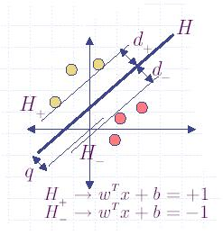
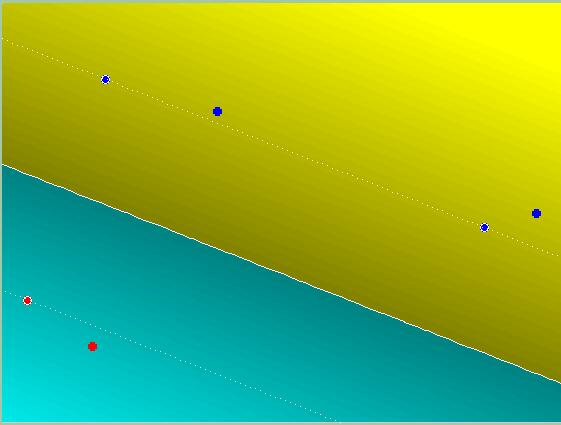
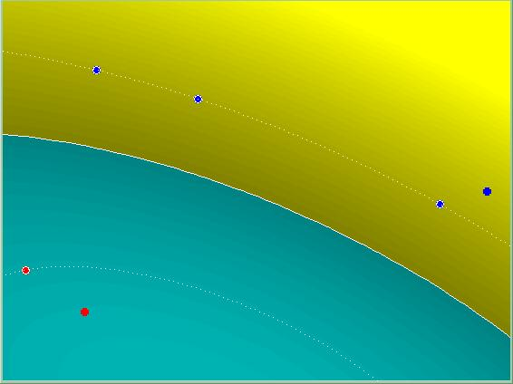

# Destek Vektor Makinaları (Support Vector Machines)

En basit halleriyle SVM'ler risk minimize eden lineer sınıflayıcısıdırlar. 

$$
R(\Theta) \leq J(\Theta) = R_{emp}(\Theta) +
\sqrt{ \frac{h \times (\log(\frac{2N}{h}) + 1) - \log(\frac{\eta}{4})}{N}}
$$

h: sınıflayıcının kapasitesi 

N: eğitim verisinde kaç veri noktası olduğu

Vapnik ve Chernovenkis $1-\eta$ olasılıkla ispaladı ki üstteki denklem doğrudur. 
SVM algoritması hem $h$ değerini hem de sayısal, ölçümsel riski aynı
anda minimize etmektedir, ve bunu sınır noktalarını noktalarını
ayırmakla yapmaktadır. Türetelim, 



Karar düzlemi: $w^{T}x + b=0$ 

Şöyle bir tanım yapalım:

$$
q = \min_{x}\big\|x - 0\big\|, \quad w^T x+b=0 \textrm { sartina gore }
$$

$q$, $H^{+}$ ve $H^{-}$ formüllerini ileride kullanacağız.

Lagrange:

$$
\min_{x}\frac{1}{2} \big\|x - 0\big\|^2+\lambda(w^{T}x+b)
$$

Gradyanı alalım ve 0 değerine eşitleyelim,

$$
\frac{\partial}{\partial x} ( \frac{1}{2} x^T x + \lambda( w^T x + b ) ) = 0
$$

$$ x + \lambda w = 0 $$

$$ x = -\lambda w $$

Üsteki sonucu $w^T x+b=0$ şartına sokalım,

$$ w^T(-\lambda w) + b = 0 $$

$$ \lambda = \frac{b}{w^Tw} $$

Yani çözüm

$$ \hat{x} = - \bigg( \frac{b}{w^Tw}  \bigg) w $$

O zaman $q$

$$ q = || \hat{x}-0 || = \bigg|\bigg| -  \frac{b}{w^Tw} w \bigg|\bigg|  $$

$$ \big|\frac{b}{w^Tw}\big| \times \sqrt{w^Tw}  $$

$$ q = \frac{|b|}{||w||} $$

Tanım:

$$ H^{+} = w^{T}x + b=+1 $$

$$ H^{-} = w^{T}x + b=-1 $$

grafikte görüldüğü gibi yani. Üstteki şekilde tanımın bir zararı yok (çünkü
+1,-1 sabit durunca ayraç genişlemesi nasıl olacak diye düşünülebilir, ama bu
tanım genelliği kaybetmeden yapabilabiliyor çünkü $b,w$ değerlerinde hala
oynanabilir.

$q^{+}$ ve $q^{-}$ değerlerini hesapla

$$ q^{+} = \frac{|b-1|}{||w||} $$

$$ q^{-} = \frac{|-b-1|}{||w||} $$

Ayraç o zaman şöyle 

$$ m=q^{+}+q^{-} =
\frac{|b-1-b-1|}{||w||} = \frac{|-2|}{||w||} = \frac{2}{||w||} $$

Ayraçların olabildiğince ayırmasını istiyorsak $m$'i arttırız (yani
$\frac{2}{||w||}$'i maksimize ederiz), ya da $||w||$ değerini minimize
ederiz. 

Sınırlar

Veri noktalarını öyle sınıflamak istiyoruz ki + ve - noktalar
hiperdüzlemlerin doğru noktalarında kalsınlar. 

$$ w^{T}x+b \geq +1, \quad \forall y_{i}=+1   $$

$$ w^{T}x+b \leq -1, \quad \forall y_{i}=-1  $$

Bu iki denklemi birleştirelim

$$ y_{i}(w^{T}x+b)-1 \geq 0  $$

Her şeyi biraraya koyalım

$$ \min_w \frac{1}{2}{||w||^2}, \quad y_{i}(w^Tx_{i}+b)-1 \ge 0
\textrm{ olsun. }$$


Bu form tanıdık geliyor mu? Bu qp ile çözülebilecek karesel (quadratic)
bir formül, programdır!

qp

Python dilinde cvxopt paketi vardır Matlab Optimization Toolbox'da qp() var. QP
fonksiyonları problemleri genelde

$$\frac{1}{2}x^{T}Px+q^{T}x$$

formunda görmek isterler. Biraz önce elde ettiğimiz denklemi bu istenen formata
doğru "masajlayabiliriz''

İkiz (dual)

SVM ihtiyaçları için ikiz formül (dual) ile çalışmak daha rahattır
Lagrange (tekrar) oluşturalım, türevi alalım, ve sıfıra eşitleyelim.
Bunun sonucunda elimize KKT noktaları geçecektir

$$
L_{p} = \frac{1}{2}||w||^{2}-\sum_{i}\alpha_{i}(y_{i}(w^{T}x_{i}+b)-1)  
$$

$$
\frac{\partial}{\partial w} L_{p} = w-\sum_{i}\alpha_{i}y_{i}x_{i}=0  $$

$$
w = \sum_{i}\alpha_{i}y_{i}x_{i} 
$$

$$
\frac{\partial}{\partial b} L_{p} = -\sum_{i}\alpha_{i}y_{i}=0  
$$

Üstteki iki denklemi asal (primal) denkleme koyduğumuz zaman

$$
\textrm{ Maksimize et } L_{D}= \sum_{i}\alpha_{i}-\frac{1}{2}
\sum_{i} \sum_{j} \alpha_{i} \alpha_{j} y_{i}y_{j}x_{i}^{T}x_{j} 
$$

sınırlar

$$ \sum_{i}\alpha_{i}y_{i}=0  $$

$$ \alpha_{i} \geq 0  $$ 

qp

Bu yine qp() formunda bir problem! Sadece bu sefer çözeceğimiz değişkenler
$\alpha_i$'lar, $x$'lar değil.  Üstteki denklem şu forma
$\frac{1}{2}x^{T}Px+q^{T}x$ masajlanabilir Bunun yapmak için $P_{i,j}$'ye
$-y_{i}y_{j}x_{i}^{T}x_{j}$ değerini atarız.  Ve qp'yi çağırırız Sonuç bir
$\alpha$'lar listesi olacaktır.

$b$ değerini hesaplamak

KKT koşulunun sebebiyle sıfır olmayan her $\alpha_{i}$ için ana problemde ona
tekabül eden kısıtlayıcı şart şıkıdır (tight), yani bir eşitliktir.  O zaman
sıfır olmayan her $\alpha_{i}$ için $b$'yi $w^{T}x_{i}+b = y_{i}$ ifadesini
kullanarak hesaplarız.  Sıfır olmayan her $\alpha_{i}$'dan gelen $b$ yaklaşık
olarak diğer other $b$'lere eşit olacaktır. Final $b$'yi hesaplamak için tüm
$b$'lerin ortalamasını almak sayısal (numeric) olarak daha garantidir.

Sınıflayıcı Tamamlandı

Her yeni $x$ noktası için artık $sign(x^{T}w+b)$ ibaresini sınıflayıcımız olarak
kullanabiliriz. $-1$ ya da $+1$ olarak geri gelecek sonuç bize yeni noktanın
hangi sınıfa ait olduğunu söyleyecektir.

Örnek Çıktı



Çekirdekler (Kernels)

Şimdiye kadar lineer ayraçlardan bahsettik.  SVM'ler lineer olmayan
ayraçlarla da çalışabilir.  Çok basit: Bir temel fonksiyon kullanarak
girdiyi daha yüksek boyuta doğru bir önişlemden geçirirsek bunu
başarabiliriz.  Algoritmanın geri kalanı değişmeden kalacaktır.

Gayri Lineer Çekirdek



Esneme Payı Bazen bir problem ayrılmaya müsait olmayabilir.  Çok üç
noktalardaki bazı noktalar sınıflayıcının çalışmasını imkansız hale
getirebilir Bunun çözümü için sınıflayıcıya "esneme payı" dahil
edebiliriz.  Mesela $y_{i}=+1$ için verinin yanlış tarafa düşmesini şu
durumda izin verebiliriz: $w^{T}+b \geq -0.03$ Fakat eklemek gerekir
ki bu tür noktaların "çok fazla'' olmasını da istemiyoruz, bu sebeple
bu "yanlış" noktaların sayısına da bir ceza getirebiliriz.

```python
from numpy import linalg
import cvxopt
import cvxopt.solvers

def svm(X, y):
    n_samples, n_features = X.shape

    # Gram matrix
    K = np.zeros((n_samples, n_samples))
    for i in range(n_samples):
        for j in range(n_samples):
            K[i,j] = np.dot(X[i], X[j])

    P = cvxopt.matrix(np.outer(y,y) * K)
    q = cvxopt.matrix(np.ones(n_samples) * -1)
    A = cvxopt.matrix(y, (1,n_samples))
    b = cvxopt.matrix(0.0)

    G = cvxopt.matrix(np.diag(np.ones(n_samples) * -1))
    h = cvxopt.matrix(np.zeros(n_samples))

    # solve QP problem
    solution = cvxopt.solvers.qp(P, q, G, h, A, b)

    print solution
    
    # Lagrange multipliers
    a = np.ravel(solution['x'])
    
    print "a", a

    # Support vectors have non zero lagrange multipliers
    ssv = a > 1e-5
    ind = np.arange(len(a))[ssv]
    a = a[ssv]
    sv = X[ssv]
    sv_y = y[ssv]
    print "%d support vectors out of %d points" % (len(a), n_samples)
    print "sv", sv
    print "sv_y", sv_y

    # Intercept
    b = 0
    for n in range(len(a)):
        b += sv_y[n]
        b -= np.sum(a * sv_y * K[ind[n],ssv])
    b /= len(a)
        
    # Weight vector
    w = np.zeros(n_features)
    for n in range(len(a)):
        w += a[n] * sv_y[n] * sv[n]

    print "a", a
    return w, b, sv_y, sv, a

X = np.array([[3.,3.],[4.,4.],[7.,7.],[8.,8.]])
y = np.array([1.,1.,-1.,-1.])
w, b, sv_y, sv, a = svm(X, y)
print "w", w
print "b", b
print 'test points'
print np.dot([2.,2.], w) + b # > 1
print np.dot([9.,9.], w) + b # < -1
```

```
     pcost       dcost       gap    pres   dres
 0: -2.9061e-01 -5.0286e-01  6e+00  2e+00  1e+00
 1: -3.6857e-02 -3.0976e-01  3e-01  4e-16  1e-15
 2: -1.0255e-01 -1.2816e-01  3e-02  3e-17  7e-16
 3: -1.1074e-01 -1.1128e-01  5e-04  3e-17  7e-16
 4: -1.1111e-01 -1.1111e-01  5e-06  4e-17  7e-16
 5: -1.1111e-01 -1.1111e-01  5e-08  1e-17  6e-16
Optimal solution found.
{'status': 'optimal', 'dual slack': 7.403425105865883e-08, 'iterations': 5, 'relative gap': 4.79718822391507e-07, 'dual objective': -0.11111112756316754, 'gap': 5.330207369918724e-08, 'primal objective': -0.11111107426109389, 'primal slack': 2.7637512517768505e-08, 's': <4x1 matrix, tc='d'>, 'primal infeasibility': 1.077377601559697e-17, 'dual infeasibility': 6.043668397566901e-16, 'y': <1x1 matrix, tc='d'>, 'x': <4x1 matrix, tc='d'>, 'z': <4x1 matrix, tc='d'>}
a [  2.76375125e-08   1.11111073e-01   1.11111073e-01   2.76375125e-08]
2 support vectors out of 4 points
sv [[ 4.  4.]
 [ 7.  7.]]
sv_y [ 1. -1.]
a [ 0.11111107  0.11111107]
w [-0.33333322 -0.33333322]
b 3.66666541806
test points
2.33333253877
-2.33333253877
```

Not: İkizdeki $L_d$'yi maksimize ediyoruz, fakat hala `qp()`'deki
minimize ediciyi çağırıyoruz. Bu sebeple tüm $\alpha$'ların toplamını
temsil eden $q$'ların negatifini alıyoruz, `np.ones(n_samples) *-1`
işleminde görüldüğü gibi. Formüldeki karesel kısım içinde zaten
$-\frac{1}{2}$ negatif ibaresi var, böylece geri kalan formülün değişmesine
gerek yok.

Dayanaklı Kayıp Fonksiyonu ile SVM, Pegasos

SVM problemi alttaki fonksiyonu çözmek anlamına geliyordu,

$$ \min_w \frac{1}{2}{||w||^2}, \textrm{ s.t. } \quad y_{i}(w^Tx_{i}+b)-1 \ge 0 $$

ki bu bir karesel program idi ve `cvxopt` paketindeki `qp` ile
çözülebiliyordu. Bazıları $b$ terimini de atıyorlar, ve 

$$  \min_w \frac{1}{2}{||w||^2} + \sum \max \{ 0, 1-y_i (w^T x_i) \}  $$

olarak yazıyorlar. Ayrıca regülarizasyonu kontrol etmek için bir $\lambda$
sabiti de ekleniyor, yani üstte $\lambda ||w||^2 / 2$ kullanılması
lazım. Regülarize işlemi $w$'nin norm'unun küçük olmasını tercih eder, ki bu
bazı $w$ değerlerinin sıfıra gitmesini zorlar, yani bir tür özellik seçme işi bu
şekilde gerçekleşmiş olur. Toplam işleminin içindeki fonksiyona "kayıp
fonksiyonu (loss function)'' ismi de verilir, eğer bu kayıp fonksiyonu tam
üstteki gibi ise ona dayanaklı kayıp (hinge loss) denir. Üstte görülen $\max$
ifadesi suna eşittir,

$$
Loss(w,x_i,y_i) = 
\left\{ \begin{array}{ll}
1-y_i \cdot (w \cdot x_i) & \textrm{ eğer } y_i \cdot (w \cdot x_i) < 1 \\
0 & \textrm { diğer }
\end{array} \right.
$$

Eğer kayıp fonksiyonunun gradyanını alırsak,

$$
\nabla L = \frac{\partial Loss(w,x_i,y_i)}{\partial w} =
\left\{ \begin{array}{ll}
-y_i  x_i & \textrm{ eğer } y_i \cdot (w \cdot x_i) < 1 \\
0 & \textrm { diğer }
\end{array} \right.
$$

Böylece bir rasgele gradyan iniş (stochastic gradient descent) yaklaşımını
kodlayabiliriz. 

$$ w_{t+1} = w_t - \eta (\lambda w_t + \nabla L )$$

ki $\eta$ gradyanın ne kadar güncellenme yapacağını kontrol eden bir sabittir.

Ufak Toptan Parçalar (Minibatching)

Güncelleme işlemi tüm veri üzerinde, her veri noktası için yapılabilir, ya da
gradyan güncellemeleri toparlanarak belli sayıda adım sonrası bir toplam
güncelleme yapılır. $b$ büyüklüğündeki ufak parça $B_t$ de rasgele seçilir, ve
$w$'ye uygulanır [3].

$$
w_{t+1} = w_t - \eta \bigg(
\lambda w_t + \frac{1}{b} \sum_{x_i,y_i \in B_t} \nabla L
\bigg)
$$

```python
import numpy as np, pandas as pd
        
def predict(w, x):
    return np.dot(w.reshape((len(x),1)).T,x)

def train_sgd(data, labels, lam, iter, batch_size):
    m,n = data.shape; w = np.zeros(n)
    idx = range(m)
    eta = 0.0001
    for t in range(1, iter):
        w_delta = np.zeros(n)
        np.random.shuffle(idx)
        for j in range(batch_size):
            i = idx[j]
            p = predict(w, data[i,:])
            if labels[i]*p < 1.:
                w_delta += labels[i]*data[i,:]
        w = (1.0 - eta*lam)*w + (eta/batch_size)*w_delta
    return w
```

```python
import numpy as np, pandas as pd, pegasos, zipfile

with zipfile.ZipFile('svmdata.zip', 'r') as z:
    df =  pd.read_csv(z.open('features.txt'),sep=',')
    labels =  pd.read_csv(z.open('target.txt'))
    
print df.shape, labels.shape

data_train = df.head(5413)
data_test = df.tail(1000)
label_train = labels.head(5413)
label_test = labels.tail(1000)

from sklearn.metrics import roc_curve, auc
from sklearn.metrics import roc_auc_score

def show_auc(d1, d2):
    fpr, tpr, thresholds = roc_curve(d1,d2)
    roc_auc = auc(fpr, tpr)
    return 'AUC', roc_auc
```

```
(6413, 122) (6413, 1)
```

```python
np.random.seed(0)
  
for epoch in [10,50,100,200]:
    for batch_size in [1,10,100]:
        w = pegasos.train_sgd(np.array(data_train),labels=np.array(label_train),
                              lam=1, iter=epoch,batch_size=batch_size)
        pred = pegasos.predict(w, data_train.T)
        score = show_auc(np.array(label_train.T)[0], pred[0])
        print 'iter', epoch, 'batch', batch_size, 'egitim', score
        pred = pegasos.predict(w, data_test.T)
        score = show_auc(np.array(label_test.T)[0], pred[0])
        print 'iter', epoch, 'batch', batch_size, 'test', score
```

```
iter 10 batch 1 egitim ('AUC', 0.80632699788480933)
iter 10 batch 1 test ('AUC', 0.79744266666666663)
iter 10 batch 10 egitim ('AUC', 0.78954806549498469)
iter 10 batch 10 test ('AUC', 0.78614666666666666)
iter 10 batch 100 egitim ('AUC', 0.76682726584846694)
iter 10 batch 100 test ('AUC', 0.76497599999999999)
iter 50 batch 1 egitim ('AUC', 0.75623733098567281)
iter 50 batch 1 test ('AUC', 0.76376266666666659)
iter 50 batch 10 egitim ('AUC', 0.79475937530208407)
iter 50 batch 10 test ('AUC', 0.7964026666666667)
iter 50 batch 100 egitim ('AUC', 0.75772752003431121)
iter 50 batch 100 test ('AUC', 0.75512000000000001)
iter 100 batch 1 egitim ('AUC', 0.78479444205966464)
iter 100 batch 1 test ('AUC', 0.7882906666666667)
iter 100 batch 10 egitim ('AUC', 0.77260941046884191)
iter 100 batch 10 test ('AUC', 0.77070400000000006)
iter 100 batch 100 egitim ('AUC', 0.75931456118589935)
iter 100 batch 100 test ('AUC', 0.75702400000000003)
iter 200 batch 1 egitim ('AUC', 0.71345805340976809)
iter 200 batch 1 test ('AUC', 0.71764000000000006)
iter 200 batch 10 egitim ('AUC', 0.75268880326726773)
iter 200 batch 10 test ('AUC', 0.74913333333333343)
iter 200 batch 100 egitim ('AUC', 0.75917270896628253)
iter 200 batch 100 test ('AUC', 0.75757600000000003)
```

Hazır bir SVM kodu scikit-learn kütüphanesi karşılaştıralım, 

```python
from sklearn.svm import SVC
clf = SVC(kernel='linear',tol=0.1)
clf.fit(np.array(data_train),np.array(label_train))
pred = clf.predict(data_train)
print 'egitim',show_auc(np.array(label_train.T)[0], pred)
pred = clf.predict(data_test)
print 'test',show_auc(np.array(label_test.T)[0], pred)
```

```
egitim ('AUC', 0.76903032711566288)
test ('AUC', 0.7533333333333333)
```

Kaynaklar

[1] Blondel, [https://gist.github.com/mblondel/586753](https://gist.github.com/mblondel/586753)

[2] Jebara, T., *Machine Learning Lecture, Columbia University*

[3] Song, et al., *Stochastic gradient descent with differentially private updates*

[4] Harrington, *Machine Learning in Action*

[5] Stanford, *Stanford, CS246: Mining Massive Data Sets*, [http://web.stanford.edu/class/cs246/](http://web.stanford.edu/class/cs246/)


