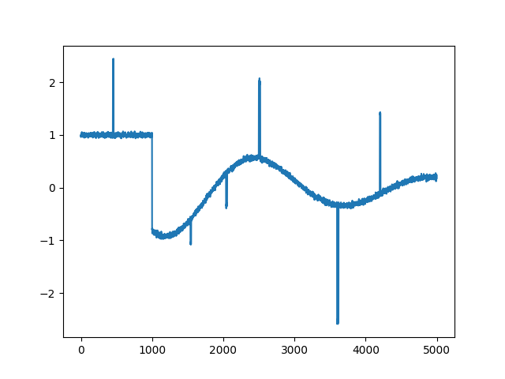

# Tam Varyasyon ile Gürültüyü Yoketmek (Total Variation Denoising)

Bir sinyalden, görüntüden gürültüyü silmek için optimizasyon
kullanılabilir. Orijinal sinyal $x$'in $y = B x + n$ ile bir $n$ gürültüsü
eklenerek bozulduğu (corrupted) farzedilebilir ($B$ bir değişim matrisidir,
tutarlı, bilinen değişimleri temsil eder) biz eldeki $y$ ile $x$'i
kestirmeye uğraşırız.  Fakat literatürde iyi bilindiği üzere $x$'i $y$'den
tahmin etmeye uğraşmak kötü konumlanmış (ill-posed) bir sorudur. Çözüm
olabilecek pek çok $x$ bulunabilir, bu sebeple arama alanını bir şekilde
daraltmak gerekir, ve bunun için bir tür düzenlileştirme / regülarizasyon
(regularization) kullanılması şarttır [3].

Bir sayısal resimden gürültü çıkartma alanında iyi bilinen bir yöntem
problemi çift hedefli bir halde konumlandırmak [4],

$$
|| x-x_{cor}||_2, \qquad \phi_{tv} (x) = \sum_{i=1}^{n-1} | x_{i+1} - x_i | 
\qquad (1)
$$

Burada $x_{cor} \in \mathbb{R}^n$ bize verilen bozulmuş sinyal,
$x \in \mathbb{R}^n$ ise bulmak istediğimiz, gürültüsü çıkartılmış sinyal,
$\phi_{tv}$ ise tam varyasyon fonksiyonu. Üstteki iki hedefi minimize etmek
istiyoruz, böylece aynı anda hem sinyalin kendi içindeki varyasyonu azaltan
hem de bozulmuş sinyale mümkün olduğunca yakın duran bir gerçek $x$ elde
edebilelim.

Her iki hedef fonksiyonunu birleştirip tek bir fonksiyon haline getirip onu
kısıtlanmamış (unconstrained) bir optimizasyon problemi olarak çözebiliriz,

$$
\psi = || x-x_{cor}||_2^2 + \mu \phi_{tv} 
$$

ki $\mu$ bizim seçeceğimiz bir parametre olabilir. Çözüm için mesela Newton
metodunu kullanabiliriz, fakat tek bir problem var, Newton ve ona benzer
diğer optimizasyon metotları için türev almak gerekli, fakat
$\phi_{tv}$'deki L1-norm'unun (tek boyutta mutlak değer fonksiyonu)
$x=0$'da türevi yoktur (birinci terimdeki Oklit normunun karesi alındığı
için onun iki kere türevi alınabilir). Bu durumda $\phi_{tv}$'yi yaklaşık
olarak temsil edebilirsek, onun da türevi alınır hale gelmesi
sağlayabiliriz. Bu yeni fonksiyona $\phi_{atv}$ diyelim,

$$
\phi_{atv} = \sum_{i=1}^{n-1} 
\left( \sqrt{ \epsilon^2 + (x_{i+1})-x_i  } - \epsilon \right)
$$

ki $\epsilon > 0$ yaklaşıklamanın seviyesini ayarlıyor. Bu fonksiyonun iyi
bir yaklaşıklama olduğunu görmek zor değil, toplam içindeki kısmı deneyerek
görelim,

```python
import numpy as np

eps = 1e-6
mu = 50.0

def norm_tv(x):
   return np.sum(np.abs(np.diff(x)))
   
def norm_atv(x):
   return np.sum(np.sqrt(eps + np.power(np.diff(x),2)) - eps)
   
xcor = np.random.randn(1000)

print (norm_tv(xcor))
print (norm_atv(xcor))
```

```text
1146.1068179914787
1146.1098514344671
```

Üstteki fonksiyonun iki kez türevi alınabilir. Şimdi analitik şekilde devam
etmeden önce pür sayısal açıdan bir çözüme bakalım. Üstteki fonksiyonları
direk kodlayarak ve sayısal türev üzerinden işleyebilen bir kütüphane
çağrısıyla hedefi minimize edelim, eldeki sinyal,

```python
import pandas as pd
df = pd.read_csv('xcor.csv',header=None)
xcor = np.reshape(np.array(df[0]), (5000,))
plt.plot(range(len(xcor)), xcor)
plt.savefig('func_60_tvd_01.png')
```



Kütüphane çağrısı ile

```python
x0 = np.zeros_like(xcor)

from scipy.optimize import minimize

def phi(x):
   return np.sum(np.power(x-xcor, 2)) + mu*norm_atv(x)

opts = {'maxiter': 30, 'disp': True}

res = minimize (fun=phi,
                x0=x0,
                options=opts,
                method='L-BFGS-B'
                )

plt.plot(range(5000), res.x)
plt.savefig('func_60_tvd_02.png')
```


Sonuç fena olmadı. Fakat üstteki yaklaşımın hesabı uzun sürecektir, eğer
eldeki problem hakkında bazı ek şeyler biliyorsak, bu bilgileri dahil
ederek elde edilen çözüm daha hızlı olabilir. Mesela analitik olarak
türevler Jacobian ve Hessian bulunabilir, Newton adımı elle kodlanabilir,
ayrıca problemdeki matrislerde muhtemel bir seyreklikten (sparsity)
faydalanılabilir.

Hedef fonksiyonu, $\psi(x)$ diyelim, için birinci ve ikinci türev,

$$
\nabla \psi(x) = 2 (x-x_{cor}) + \mu \nabla \phi_{atv}(x), \qquad
\nabla^2 \psi(x) = 2 I + \mu \nabla^2 \phi_{atv} (x)
$$

Zincirleme Kuralı uygulandı tabii, ve şimdi $\phi_{atv}$ üzerindeki
türevleri bulmak gerekiyor. Sorun değil, daha önceki yaklaşıklamayı bunun
için yapmıştık zaten. Yaklaşık fonksiyonu genel olarak belirtirsek, 

$$
f(u) = \sqrt{\epsilon^2 + u^2} - \epsilon
$$

Bu fonksiyonun 1. ve 2. türevi

$$
f'(u) = u(\epsilon^2 + u^{-1/2} ), \qquad
f''(u) = \epsilon^2 (\epsilon^2 + u^2)^{-3/2}
$$

Şimdi bir $F$ tanımlayalım,

$$
F(u_1,..., u_{n-1}) = \sum_{i=1}^{n-1} f(u_i)
$$

Yani $F(u)$ $u$'nun bileşenlerinin yaklaşık L1 norm'unun toplamıdır. Nihai
amacımız bu tanımdan bir $\phi_{atv}$ ifadesine ulaşmak. $F$'in gradyanı ve
Hessian'ı

$$
\nabla F(u) = \left[\begin{array}{ccc} f'(u_1) & \dots & f'(u_{n-1}) \end{array}\right]
$$

$$
\nabla^2 F(u) = 
\mathrm{diag} 
\left[\begin{array}{ccc} f''(u_1) & \dots & f''(u_{n-1}) \end{array}\right] 
$$

Eğer bir ileri farklılık matrisi $D$ tanımlarsak, 

$$
D = \left[\begin{array}{ccccc}
-1  & 1 & & &    \\
 & -1 & 1 & &   \\
 &  & \ddots  & \ddots &  \\
 &  &  &  -1 & 1
\end{array}\right]
$$

O zaman $\phi_{atv}(x) = F(Dx)$ diyebiliriz. Bir $x$ vektörünü
üstteki matris ile soldan çarpınca öğeleri 
$\left[\begin{array}{ccc} x_2-x_1 & x_3-x_2 & \dots \end{array}\right]$ 
şeklinde giden bir yeni vektör elde edeceğimizi doğrulamak zor değil. Yine
Zincirleme Kuralını uygularsak,

$$
\nabla \phi_{atv}(x) = D^T \nabla F(Dx), \qquad
\nabla^2 \phi_{atv}(x) = D^T \nabla^2 F(Dx) D
$$

Hepsini bir araya koyarsak 

$$
\nabla \psi(x) = 2(x-x_{cor}) + \mu D^T \nabla F(Dx)
$$

$$
\nabla^2 \psi(x) = 2 I  + \mu D^T \nabla^2 F(Dx) D
$$

Kodlamayı alttaki gibi yapabiliriz,

```python
import pandas as pd
import scipy.sparse as sps
import scipy.sparse.linalg as slin

MU = 50.0
EPSILON = 0.001

ALPHA = 0.01;
BETA = 0.5;
MAXITERS = 100;
NTTOL = 1e-10;

n = len(xcor)
data = np.array([-1*np.ones(n), np.ones(n)])
diags = np.array([0, 1])
D = sps.spdiags(data, diags, n-1, n)


x = np.copy(xcor)

for iter in range(MAXITERS):
   d = D.dot(x)

   val1 = np.sum(np.power(x - xcor, 2)) 
   val2_terms = np.sqrt(EPSILON**2 + np.power(d, 2))
   val = val1 + MU * np.sum(val2_terms - EPSILON) 

   grad1 = 2 * (x - xcor) 
   grad2 = MU * D.T.dot(d / val2_terms) 
   grad = grad1 + grad2 

   hess1 = 2 * sps.eye(n) # (n,n)
   hess2_diag_vals = EPSILON**2 / np.power(EPSILON**2 + d**2, 3/2) # (n-1,)
   hess3 = sps.spdiags(hess2_diag_vals, 0, n-1, n-1) # (n-1, n-1)
   
   hess_second_term = MU * D.T.dot(hess3.dot(D)) 
   hess = hess1 + hess_second_term

   v = slin.spsolve(-hess, grad) 

   lambdasqr = np.dot(-grad.T, v) 
   if lambdasqr / 2 < NTTOL:
       break
   t = 1
   while True:
      tmp1 = np.sum(np.power(x + t * v - xcor, 2)) 
      tmp2_terms = np.sqrt(EPSILON**2 + np.power(D.dot(x + t * v), 2))
      tmp_val = tmp1 + MU * np.sum(tmp2_terms - EPSILON) 
      
      if tmp_val < val - ALPHA * t * lambdasqr:
         break
      t = BETA * t

   x = x + t * v 
   
plt.plot(range(n),xcor)
plt.plot(range(n),x,'r')
plt.savefig('func_60_tvd_03.png')
```


Çok daha iyi bir gürültüsüz sonuç elde ettik, üstteki bu işlem çok daha
hızlı. 

Görüntüden Gürültü Silmek

Aynen tek boyutlu sinyalden gürültü silebildiğimiz gibi iki boyutlu
görüntüden de gürültü silmek mümkün. Bu durumda tam varyasyon 

$$
\sum_{i=2}^{m} \sum_{j=2}^{n} (|U_{i,j} - U_{i-1,j}| + |U_{i,j} - U_{i,j-1}|)
$$

olabilir, yani her pikselin bir yanindaki ve bir altındaki pikselle olan
uzaklığının L1-norm'unu almak. Üstteki hesabı yapmak için aslında yine daha
önce hesapladığımız $D$ matrisini kullanabiliriz. Bir $X$ imajı üzerinde
$DX$ hesabı, yani $D$ ile soldan çarpım dikey farklılıkları, sağdan çarpım
$XD$ ise yatay farklılıkları verecektir.

```python
import scipy.sparse as sps

X = [[1, 2, 3, 4],
     [5, 6, 7, 8],
     [1, 2, 3, 4],
     [5, 6, 7, 8]]

X = np.array(X)
print (X)
n = X.shape[0]
data = np.array([-1*np.ones(n), np.ones(n)])
diags = np.array([0, 1])
D = sps.lil_matrix(sps.spdiags(data, diags, n, n))
print (D.todense())
print ('Dikey Farklilik')
print (D.dot(X))
print ('Yatay Farklilik')
print (D.transpose().dot(X.T))
```

```text
[[1 2 3 4]
 [5 6 7 8]
 [1 2 3 4]
 [5 6 7 8]]
[[-1.  1.  0.  0.]
 [ 0. -1.  1.  0.]
 [ 0.  0. -1.  1.]
 [ 0.  0.  0. -1.]]
Dikey Farklilik
[[ 4.  4.  4.  4.]
 [-4. -4. -4. -4.]
 [ 4.  4.  4.  4.]
 [-5. -6. -7. -8.]]
Yatay Farklilik
[[-1. -5. -1. -5.]
 [-1. -1. -1. -1.]
 [-1. -1. -1. -1.]
 [-1. -1. -1. -1.]]
```

L1 norm yaklaşıksallığı için daha önceki yöntemi kullanabiliriz.  

Yine total varyasyon kullanan ama farklı optimizasyon çözücüyle hesabı
yapan bir yöntem allta [1], sonuç (soldaki)

```python
import matplotlib.pyplot as plt
import pylab, skimage
from numpy import random
from PIL import Image

def nabla(I):
    h, w = I.shape
    G = np.zeros((h, w, 2), I.dtype)
    G[:, :-1, 0] -= I[:, :-1]
    G[:, :-1, 0] += I[:, 1:]
    G[:-1, :, 1] -= I[:-1]
    G[:-1, :, 1] += I[1:]
    return G

def nablaT(G):
    h, w = G.shape[:2]
    I = np.zeros((h, w), G.dtype)
    I[:, :-1] -= G[:, :-1, 0]
    I[:, 1: ] += G[:, :-1, 0]
    I[:-1]    -= G[:-1, :, 1]
    I[1: ]    += G[:-1, :, 1]
    return I

def anorm(x):
    return np.sqrt((x*x).sum(-1))

def calc_energy_ROF(X, observation, clambda):
    Ereg = anorm(nabla(X)).sum()
    Edata = 0.5 * clambda * ((X - observation)**2).sum()
    return Ereg + Edata

def calc_energy_TVL1(X, observation, clambda):
    Ereg = anorm(nabla(X)).sum()
    Edata = clambda * np.abs(X - observation).sum()
    return Ereg + Edata

lambda_ROF = 8.0
lambda_TVL1 = 1.0

def project_nd(P, r):
    nP = np.maximum(1.0, anorm(P)/r)
    return P / nP[...,np.newaxis]
    
def shrink_1d(X, F, step):
    return X + np.clip(F - X, -step, step)

def solve_TVL1(img, clambda, iter_n=101):
    L2 = 8.0
    tau = 0.02
    sigma = 1.0 / (L2*tau)
    theta = 1.0

    X = img.copy()
    P = nabla(X)
    for i in range(iter_n):
        P = project_nd( P + sigma*nabla(X), 1.0 )
        X1 = shrink_1d(X - tau*nablaT(P), img, clambda*tau)
        X = X1 + theta * (X1 - X)
    return X

from skimage import io
img = io.imread('lena-noise.jpg', as_gray=True)
res = solve_TVL1(img, 1.0)

res_scaled = (res - res.min()) / (res.max() - res.min())
res_uint8 = (res_scaled * 255).astype(np.uint8)

io.imsave('lenad3.jpg', res_uint8)
```


Ayrıca `cvxpy` adlı bir paket üzerinden aynı şeyi kodlayabiliriz, yani 

$$
\min_{\beta \in \mathbb{R}^n} 
\frac{1}{2} \sum_{i=1}^{n} (y_i - \beta_i)^2 + 
\lambda \sum_{(i,j) \in E)}  |\beta_i - \beta_j|
$$

```python
import cvxpy

lam = 35.0

u_corr = plt.imread("lenad1.jpg")

rows, cols = u_corr.shape

U = cvxpy.Variable(shape=(rows, cols))

obj = cvxpy.Minimize(0.5 * cvxpy.sum_squares(u_corr-U) + lam*cvxpy.tv(U))

prob = cvxpy.Problem(obj)

prob.solve(verbose=True, solver=cvxpy.SCS)

plt.imshow(U.value, cmap='gray')
plt.imsave('lena4.jpg', U.value, cmap='gray')
```

```text
===============================================================================
                                     CVXPY                                     
                                     v1.6.6                                    
===============================================================================
-------------------------------------------------------------------------------
                                  Compilation                                  
-------------------------------------------------------------------------------
-------------------------------------------------------------------------------
                                Numerical solver                               
-------------------------------------------------------------------------------
------------------------------------------------------------------
	       SCS v3.2.7 - Splitting Conic Solver
	(c) Brendan O'Donoghue, Stanford University, 2012
------------------------------------------------------------------
problem:  variables n: 151426, constraints m: 201153
cones: 	  z: primal zero / dual free vars: 50625
	  q: soc vars: 150528, qsize: 50176
settings: eps_abs: 1.0e-05, eps_rel: 1.0e-05, eps_infeas: 1.0e-07
	  alpha: 1.50, scale: 1.00e-01, adaptive_scale: 1
	  max_iters: 100000, normalize: 1, rho_x: 1.00e-06
	  acceleration_lookback: 10, acceleration_interval: 10
lin-sys:  sparse-direct-amd-qdldl
	  nnz(A): 352130, nnz(P): 50625
------------------------------------------------------------------
 iter | pri res | dua res |   gap   |   obj   |  scale  | time (s)
------------------------------------------------------------------
     0| 8.93e+02  3.50e+01  1.58e+09 -7.77e+08  1.00e-01  5.55e-01 
   250| 1.32e+00  4.81e-02  3.99e+01  2.25e+07  1.00e-01  4.92e+00 
   500| 5.62e-01  8.50e-02  2.80e+01  2.25e+07  3.19e-01  8.84e+00 
   750| 2.67e-01  2.15e-02  6.38e+00  2.25e+07  3.19e-01  1.27e+01 
  1000| 3.53e+01  8.82e+00  3.72e+02  2.25e+07  3.19e-01  1.65e+01 
  1250| 8.25e-02  4.00e-03  1.67e+00  2.25e+07  3.19e-01  2.04e+01 
  1500| 7.18e-02  3.42e-03  1.11e+00  2.25e+07  3.19e-01  2.42e+01 
  1750| 4.66e-02  3.68e-03  7.96e-01  2.25e+07  3.19e-01  2.81e+01 
  2000| 4.68e-02  7.17e-04  5.96e-01  2.25e+07  3.19e-01  3.19e+01 
  2250| 3.26e-02  2.28e-04  4.57e-01  2.25e+07  3.19e-01  3.57e+01 
  2500| 2.13e-02  4.08e-04  3.79e-01  2.25e+07  3.19e-01  3.96e+01 
  2750| 2.00e-02  4.70e-04  3.20e-01  2.25e+07  3.19e-01  4.34e+01 
  3000| 1.81e-02  6.73e-04  2.74e-01  2.25e+07  3.19e-01  4.73e+01 
  3250| 1.25e-02  2.68e-03  5.33e-01  2.25e+07  1.01e+00  5.12e+01 
  3500| 9.76e-03  1.93e-03  3.81e-01  2.25e+07  1.01e+00  5.50e+01 
  3750| 8.65e-03  1.13e-03  2.78e-01  2.25e+07  1.01e+00  5.89e+01 
  4000| 6.76e-03  5.35e-04  2.14e-01  2.25e+07  1.01e+00  6.27e+01 
  4250| 6.32e-03  4.87e-04  1.68e-01  2.25e+07  1.01e+00  6.65e+01 
  4500| 5.48e-03  1.47e-04  1.38e-01  2.25e+07  1.01e+00  7.04e+01 
  4750| 5.17e-03  6.63e-05  1.15e-01  2.25e+07  1.01e+00  7.42e+01 
  5000| 5.90e+00  4.68e+00  7.01e-01  2.25e+07  1.01e+00  7.81e+01 
  5250| 3.65e-03  2.40e-04  8.35e-02  2.25e+07  1.01e+00  8.19e+01 
  5500| 3.54e-03  4.04e-04  7.04e-02  2.25e+07  1.01e+00  8.57e+01 
  5750| 3.27e-03  1.43e-04  6.08e-02  2.25e+07  1.01e+00  8.96e+01 
  6000| 3.11e-03  4.98e-04  5.37e-02  2.25e+07  1.01e+00  9.34e+01 
  6250| 3.00e-03  2.91e-05  4.83e-02  2.25e+07  1.01e+00  9.72e+01 
  6500| 2.89e-03  3.28e-05  4.45e-02  2.25e+07  1.01e+00  1.01e+02 
  6550| 2.31e-03  9.40e-04  4.27e-02  2.25e+07  1.01e+00  1.02e+02 
------------------------------------------------------------------
status:  solved
timings: total: 1.02e+02s = setup: 4.84e-01s + solve: 1.01e+02s
	 lin-sys: 6.97e+01s, cones: 1.28e+01s, accel: 4.23e+00s
------------------------------------------------------------------
objective = 22523308.826536
------------------------------------------------------------------
-------------------------------------------------------------------------------
                                    Summary                                    
-------------------------------------------------------------------------------

```


Üstteki resim bu sonucu gösteriyor. Bu yaklaşımda `cvxpy.tv` ile tam
varyasyon hesabını yapan kütüphanenin kendi iç çağrısını kullandık.


Kaynaklar

[1] Mordvintsev, *ROF and TV-L1 denoising with Primal-Dual algorithm*,
    [https://github.com/znah/notebooks/blob/master/TV_denoise.ipynb](https://github.com/znah/notebooks/blob/master/TV_denoise.ipynb)

[2] Chambolle, *An introduction to continuous optimization for imaging*,
    [https://hal.archives-ouvertes.fr/hal-01346507/document](https://hal.archives-ouvertes.fr/hal-01346507/document)

[3] Afonso, *Fast Image Recovery Using Variable Splitting and Constrained Optimization*,
    [http://www.lx.it.pt/~mtf/Afonso_BioucasDias_Figueiredo_twocolumn_v7.pdf](http://www.lx.it.pt/~mtf/Afonso_BioucasDias_Figueiredo_twocolumn_v7.pdf)

[4] Boyd, 
    *Additional Exercises for Convex Optimization*
    [https://web.stanford.edu/~boyd/cvxbook/bv_cvxbook_extra_exercises.pdf](https://web.stanford.edu/~boyd/cvxbook/bv_cvxbook_extra_exercises.pdf)
