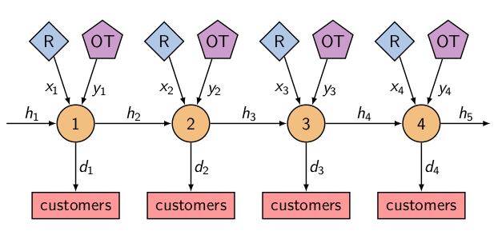
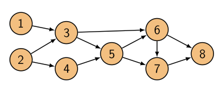
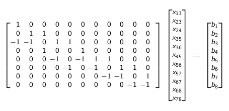
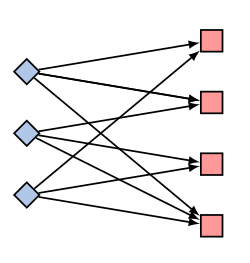
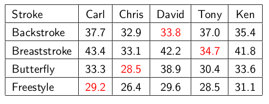
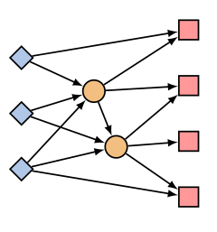
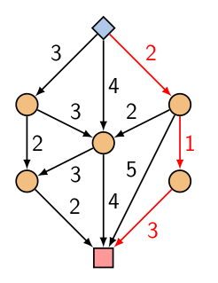
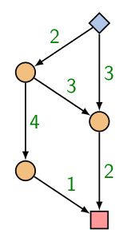

# Ağ Akış Problemleri (Network flow problems)

Daha önce işlediğimiz [3] ağ akış konusunu biraz daha genişletelim. Sailco
adlı hayali bir şirket düşünelim, bu şirket yelkenli tekne (sailbot)
üretiyor. Problem şöyle, önümüzdeki 4 ay içinde alttaki üretim sayısını
gerçekleştirmesi gerekiyor (müşteri talebi)

$$ 
\begin{array}{ccccc}
\hline
\textrm{Ay} & 1 & 2 & 3 & 4 \\
\hline
\textrm{Üretilen tekne sayısı} & 40 & 60 & 70 & 25 \\
\hline
\end{array}
$$

Birinci ayda 40, ikinci ayda 60, vs.. Şirketin bir deposu da var, bitmiş
teknelerin teslim etmeden önce tutuldukları yer burası. 1. ayın başında bu
depoda 10 tane tekne var. Her ay kaç tane tekne (ve nasıl) üretileceğini
hesaplamam lazım, burada işçi türü ve depoda olanlar sayıyı etkiler tabii,
mesela bir ayda 10 tane üretmem gerekiyorsa ve depoda zaten 10 tane varsa,
hiç üretim yapmama gerek yok. Ama gelecekte çok fazla üretmem gerektiğini
biliyorsam ekstra yapıp onları depoda tutabilirim, ki sonra gönderebileyim.

İşçi kısıtlaması şöyle, normal işçiyle 400 lira / tekne üzerinden fazla
mesai ile 450 lira / tekne üzerinden üretim yapabilirim. Tek bir tekneyi
depoda tutmak 20 lira. Ayrıca normal işçi ile ayda sadece 40 tekne
yapabiliyorum, eğer o ayda daha fazla tekne yapmam gerekiyorsa fazla mesai
kullanmam şart.

Problem şöyle, öyle bir üretim ve depolama takvimi planla ki önümüzdeki 4
aydaki üretimi minimum masrafla yapabileyim. 

Karar değişkenleri neler olacak? Görüyorum ki bu tür problemlerle uğraşan
bazı öğrenciler genelde az sayıda değişken kullanmaya meyilli, mesela "X
ayında üretilecek tekne sayısı'' gibi, ve beklenti o ki formüller işin
gerisini halletsin. Yani mesela ilk ay bariz zaten, depoda 10 tane tekne
var, geri kalanını ilk ayda normal işçilere yaptırırım çünkü bu en ucuzu. O
zaman o ayda üretilen tekne sayısı değişkeni yeter, vs. Fakat göreceğiz ki
bu tür yaklaşımlar aslında işi daha zorlaştırıyor. İşimize yaramayabilecek
ekstra değişkenler tanımlamak, sonra o değişkenleri kısıtlayıp probleme
uygun şekilde dahil etmek daha kolay.

Biz de böyle yapacağız. Bir sürü değişken; mesela X ayı için kaç tane
"normal işçi teknesi'' üretilmesi gerektiği, yani bu sayı sadece normal
işçiler tarafından üretilecek tekneleri kontrol edecek, fazla mesai için
farklı olacak.. Her ay depoda kaç tekne tutulduğu ayrı sayılacak, her şey
bir değişken olacak. Belki bu değişkenlerden bazıları fuzuli, hatta başka
bir şeyi tekrar ediyor sanki, başka değişkenlerden türetilebilir gibi
geliyor, olsun, yine de ekstra değişkeni koyun, ama diğer yandan
aklınızdaki o kuralı probleme sınırlama olarak dahil edin. Literatürde bu
değiskenlere karar değiskenleri deniyor ama aslında onlarin direk karar
verdiğimiz şeyler olmasına gerek yok.

Değişkenler şöyle,

$x_1,x_2,x_3,x_4$: her ayda normal işçilik ile üretilen tekne sayısı

$y_1,y_2,y_3,y_4$: her ayda fazla mesai ile üretilen tekne sayısı

$h_1,h_2,h_3,h_4,h_5$: her ay başında depoda olan tekne sayısı. 5 ay var
çünkü ay sonundaki sayıyı $h_5$ değişkeninde tutuyoruz. Tabii problemi iyi
anlayanlarımız farketmiştir ki bu değişkende sıfır değeri olmalı, tüm
tekneler gönderilmiş olmalı.

Parametreler

Bunlar değişken değil dikkat, dışarıdan tanımlanan parametreler. Başta
gördüğümüz sayılar bunlar, her ay müşteriden gelen talep, 

$d_1,d_2,d_3,d_4$: her ay için talep (demand). 

Kısıtlamalar

$0 \le x_i \le 40$, ki $i=1,2,3,4$: normal işçilikle üretilebilecek tekne
sayısı, çünkü üstte belirttik, o tür üretimin sınırı bu

$y_i \ge 0$: fazla mesai ile üretilebilecek tekne sayısı sınırsız. Tabii ki
negatif tekne üretilemez, o sebeple sıfırdan büyüklük var. 

$h_i + x_i + y_i = d_i + h_{i+1}$: teknelerin muhafazası denklemi. Burada
diyoruz ki her ay başında depodaki tekneler artı normal ve fazla mesai
işçilik ile ürettiğim teknelerin toplamı, o aydaki talep ve sonraki aya
kalacak depodaki teknelerin toplamı ile aynı olmalı. 

Ayrıca $h_1=10$ olduğunu biliyoruz.

Önceki noktayı tekrar vurgulamak gerekirse üstteki $h$ değişkenlerini belki
tanımlamam fuzuli, onları $h,d$'ler üzerinden de tanımlayabilirdim. Ama bu
şekilde yapmak çok daha açık. 

[atlandi]

Bu problemin lineer program olduğunu görebiliyoruz, ama hiçbir ağ akışı
filan göstermedim. O zaman dersimizin başlığı niye ağ akışı? Çünkü bu
problemi bir ağ yapısı içinden akış olarak görmek te oldukça doğal. 
Ağdaki 1,2,3,4 düğümleri aylar olacak, ve tekneler o aylar içinden
"akıyorlar'', eğer bir ay sonrasında depoya bir tekne koyuyorsak sanki o
tekne geleceğe doğru gönderiliyor, sonraki aya veriliyor, o sebeple aylar
arasındaki oklar $h_i$. 



Tabii tüm tekneler bir aydan ötekine akmıyor, müşterilerin (customers)
talebine göre o aydan onlara da belli sayıda tekne "akıyor'', $d_i$ ile
gösterilenler. Her aya giren akış üretim, R ile gösterilen normal
işçilikle, OT ile gösterilen fazla mesai ile.  Bu resimle problemi bir ağ
akışı olarak göstermiş olduk.

Daha önce gördüğümüz muhafaza denklemi bu resimde daha bariz hale geldi,
çünkü bu resimle aslında şunu söylüyoruz, her ay düğümüne giren akışlar
çıkış akışlarına eşit olmalı. Bu hem kuvvetli bir ifade ama aynı anda
bariz. Düğümler içinde bir şey tutmamalı, oradan sadece akış var. 

Bugün genel olarak göreceğimiz konu minimum bedel akış problemleri olacak,
ki üstteki problem bunun bir örneği. Pek çok optimizasyon problemi yönlü
bir ağ üzerindeki akış olarak görülebiliyor. 

Alttaki gibi bir ağ düşünelim,


8 tane düğümü var, bazı kenarları var. Bu ağdaki karar değişkenleri her
kenardaki akış. Dikkat, karar değişkeni düğümde değil, kenarda. Bulmak
istediğimiz bu akış çünkü, bilahere karar değişkenleri. Bu kenarların her
birinde ne kadar akış var? 

Her kenardaki akışın bir bedeli olabilir, ayrıca her kenarın bir kapasite
sınırlaması olabilir (bedeli ne olursa olsun üzerine çıkılamayacak bir eşik
değeri). Bedel örneği olarak mesela bir kenar 2 lira/birimlik olabilir
diğeri 10 lira/birim bedelinde olabilir. O zaman ilk kenardan 5 birim
göndermek istersem bunun bana bedeli 10 lira ikincisinden gondermek
istersem 50 lira olacak. Her kenarın akış bedeli, kapasitesi bizim
dışarıdan bir parametre ile tanımladığımız bir şey olacak tabii
ki. Kapasitenin illa sınırlanmış olması gerekmez, sınırsız da olabilir.

Her düğüm bir akış kaynağı (source) da olabilir, yani akışı kendi içinden
"doğuruyor'' olabilir. Bazı düğümler akışı yutuyor olabilir, onlara akış
gelir ve yokolur, bu düğümlere alıcı (sink) diyebiliriz. O zaman önceki
gördüğümüz sadece aktarıcı düğümlere ek olarak bu iki tip düğümü de
kullanabiliriz. Üstteki resimde en soldaki iki düğüm kaynak gibi duruyor,
oradan sadece çıkan akış görüyoruz. En sağdaki ise alıcı, ona akış sadece
giriyor. 

Optimizasyon probleminin sorduğu soru şu olacak, "en minimum bedelli akış
hangisi?''. Pek çok türlü akış olabilir, bizim aradığımız bedeli en az
olan. Bugün göreceğimiz tüm problemler birer minimum bedelli akış problemi
olarak formülize edilebilir. İlk önce en başta gördüğümüz problemi ağ
yapısına tercüme edeceğiz, sonra diğer göreceğimiz problemlerin birer LP
olup olmadığına bakacağız. 

Düğümleri numaralandıralım,



Her akışı, karar değişkenini $x_{ij}$ olarak gösterebiliriz, ki
$(i,j) \in \varepsilon$, 1'den 3'e akış $x_{13}$ olacak. Akış bedeli
$c_{ij}$. Toplam bedel her akış çarpı o akışın bedeli toplanmış
hali. Kapasite sınırları $p_{ij} \le x_{ij} \le q_{ij}$ ile gösterilebilir,
her kenarın bir alt bir de üst sınırı olabilir ($p_{ij}$ çoğu problem için
sıfırdır). Muhafaza denklemi, her düğüm $k$ için [1, 26:22]

$$
\sum_{j \in N} x_{kj} - \sum_{i \in N} x_{ik} = b_k, \quad \forall k \in N
$$

Toplam bedel

$$
\sum_{(i,j) \in \varepsilon } c_{ij} x_{ij}
$$

Üstteki ifade üzerinden toplam bedeli minimize eden akışı bulabiliriz. 

Bu bir lineer program değil mi? Bedel lineer, lineer eşitlik, eşitsizlik
sınırlamaları. Evet bu bir LP. 

Formel ve öz bir şekilde yazmak gerekirse, 

$$
\min_{x_{ij} \in \mathbb{R}} \sum_{(i,j) \in \varepsilon } c_{ij} x_{ij}
\quad \textrm{öyle ki}
$$
$$
\sum_{j \in N} x_{kj} - \sum_{i \in N} x_{ik} = b_k, \quad \forall k \in N
$$
$$
p_{ij} \le x_{ij} \le q_{ij}
$$

Şimdi muhafaza kısıtlamasına dönmek istiyorum, aslında bu formülü matris
formunda yazmanın çok güzel bir yolu var. 



Matrise $A$ sembolü verilir çoğunlukla ve ona oluş, geliş (incidence)
matrisi denir.  Örnek olarak sonuncu satıra bakalım, bu satır 8'inci düğüme
olanları gösteriyor, $-x_{68}-x_{78}$ hesabı var, eksi işareti düğüme giriş
göstergesi, ve sonuç $b_8$'e eşit. 

$A$'da sadece 0, -1 ve +1 değerleri vardır ve eldeki düğüm kadar satırı
vardır, ve eldeki kenar kadar kolonu vardır. Dikkat geliş matrisi sadece ağ
yapısını kodlar, kenarlardan giden akış miktarı hala $x_{ij}$ değerlerinin
kendisinde. 

Eğer gereken yerde vektörler de kullanırsak en öz haliyle model şöyle,

$$
\min_{x \in \mathbb{R}^{|\varepsilon|}} c^T x, \quad \textrm{öyle ki}
$$
$$
Ax = b
$$
$$
p \le x \le q
$$

Denge konusundan bahsedelim, minimum bedelli akış probleminin "dengeli''
olması durumu var. Üstteki örnekteki gibi bir problemi düşünürsek, bazı
düğümle kaynak, bazıları alıcı, tüm düğümlerdeki girenler çıkanlar sıfıra
toplanır, o zaman tüm kaynakların toplamının da tüm talebin toplamına eşit
olması beklenir. Çünkü ekstra kaynak varsa mesela tüm denklemleri tatmin
etmek mümkün olmaz. Bunu ispatlayabiliriz, geliş matrisinin bir özelliği
tüm kolonlarının toplamının sıfır olması, yani $1^T A = 0$. Ayrıca $Ax =
b$'nin de doğru olduğunu biliyoruz çünkü çözeceğimiz sistemin bir
kısıtlaması bu formül. O zaman alttaki de doğru olmalı, 

$$
1^T A x = 1^T b = 0
$$

Eşitliğin sağındaki $1^T b$ tüm $b$ öğelerinin toplamı demek, yani

$$
\sum_{i \in N} b_i = 0
$$

olmalı. Demek ki tüm arz tüm talebe eşit olacak. O zaman size $b$'sı sıfıra
toplanmayan bir minimum bedel akış problemi verirsem bu problem olurlu
olmayacaktır. Toplam sıfır ise bu probleme "dengeli problem''
deniyor. Tabii dengeli bir modelin de illa olurlu olması şart değil, mesela
öyle kapasite sınırlamaları getirebilirsiniz ki olurluluk mümkün olmaz, ama
denge yoksa problem kesinlikle olurlu değildir.

Ama bazen dengesiz problemleri de ufak değişiklikler ile çözmek mümkün
oluyor, mesela bazı $=$'leri $\le$ yaparak, ki bunun karşılığı ağa bir
kukla (dummy) düğüm eklemek olabilir .. Ya da pay bırakma (slack)
değişkenleri ekleyip bazı eşitsizlikleri eşitlikge çevirerek..

Örnek Alanlar 

Ne kadar çok problemin minimum akış problemi olabildiği şaşırtıcı
olabilir. 


* nakliyat problemleri  (transportation)
* görev verme / atama problemleri (assignment)
* aktarmalı gemi nakliyatı (transshipment)
* en kısa yol problemleri (shortest path)
* maksimum akış problemleri (max-flow)


Nakliyat

Hedef belli bir mali birkaç kaynak noktasından farklı varış noktalarına
ulaştırmak. Kaynaklar bir sürü depo, ambar olabilir, varış noktası farklı
müşteriler olabilir, ürünlerin depodan müşterilere gitmesi gerekiyor. Ama
mesela ambar 1'den müşteri 2'ye gönderim olabilir, ya da ambar 4'ten aynı
müşteriye.. ? Karar verilmesi gerekiyor, her müşterinin kendine göre talebi
var, her nakliyat yolunun farklı bedeli var, yolların kapasite limitleri
var, depoların arz limitleri var, bu problem en az bedelli talebi tatmin
eden nakliyat kararını verecek.



Örnek şöyle olabilir, Millco'nun (hayali bir şirket) üç tane bakır işleme
fabrikası var, üç tane de maden bölgesi var. Nakliyatın bedeli km başına 2
lira. Madenler ve fabrikalar arası mesafeler alttaki gibi, o zaman her
talebi tatmin edip en az nakliyat masrafı için hangi nakliyat planı takip
edilmeli?


$$ 
\begin{array}{ccccc}
\hline
Maden & \textrm{Fabrika 1} & 
\textrm{Fabrika 2} & 
\textrm{Fabrika 3} & 
\textrm{Maden başına günlük maksimum kamyon sevkiyatı}\\
\hline
1 & 8 & 15 & 50 & 20 \\
\hline
2 & 10 & 17 & 20 & 30 \\
\hline
3 & 30 & 26 & 15 & 45 \\
\hline
\textrm{Fabrika talebi} & 30 & 35 & 30 & \\
\hline
\end{array}
$$

İlk kontrol edebileceğimiz faktör acaba ağ dengeli mi? Tüm arz toplamı tüm
talep toplamı ile aynı mı? Evet. O zaman üstteki çözülebilecek bir
problem olabilir. Düğümleri $\left[\begin{array}{cccccc} 1&2&3&A&B&C \end{array}\right]$
olarak düzenleyeyim, kaynaklar bir blok olarak önce, alıcılar sonra. Geliş
matrisi altta [1, 43:55],

Bu tamamen bağlantılı (full connected) bir çiziti temsil ediyor, yani
herhangi bir maden düğümünden herhangi bir fabrika düğümüne gitmenin yolu
var. Çözüm

```
   A  B  C
1 20  0  0 
2 10 20  0
3 0  15  30
```

Biz de `linprog` ile kontrol edelim,

```python
A = [[ 1,  1,  1,  0,  0,  0,  0,  0,  0],
      [0,  0,  0,  1,  1,  1,  0,  0,  0],
      [0,  0,  0,  0,  0,  0,  1,  1,  1],
      [-1, 0,  0, -1,  0,  0, -1,  0,  0],
      [0, -1,  0,  0, -1,  0,  0, -1,  0],
      [0,  0, -1,  0,  0, -1,  0,  0, -1]]

b = [ 20, 30, 45, -30, -35, -30 ]

c = [ 8, 15, 50, 10, 17, 20, 30, 26, 15]

A = np.array(A); b = np.array(b); c = np.array(c)

from scipy.optimize import linprog

res = linprog(-c, A_eq=A, b_eq=b)
print (np.round(res.x))
```

```
[ 0.  0. 20.  0. 20. 10. 30. 15.  0.]
```

Bu örnekteki $b$'de hiç sıfır öğesi yok, niye? Çünkü bu ağ yapısında talep
ve arz tüm düğümlerde tanımlı, yani her düğüm ya bir kaynak ya da
alıcı. Böyle olmayabilirdi, arada geçiş düğümleri olsaydı onlar üzerinde
muhafaza mantığı sebebiyle sıfır tanımı yapmak gerekebilirdi. 

Atama (Assignment Problems)

Bu tür problemler nakliyat problemine benzer, ama n tane çalışanım n tane
yapılacak işim var. Amaç her n kişiye birer görev vermek. Diyelim ki her
çalışanın her görev için farklı tercihi var, mesela ev işlerinde bulaşık,
çöp atmak, duvar boyamak için A, B kişileri 1 ile 10 arasında tercih
belirtmiş olabilir. Amaç her işi bir kişiye atamak, öyle ki tüm işler
yapılsın aynı anda herkes olabildiği kadar mutlu olsun. 

Bu problem de nakliyat problemi gibi! Ama şimdi akış 1 ya da 0. Her kaynağa
1 giriyor, her alıcıdan 1 çıkıyor. Kenarlar üzerinde hiç kısıtlama yok. 

Ama bazılarımız sorabilir, 0.2 insanı bir göreve, 0.8 insani diğerine
gönderme gibi bir sonuç ta istemem, bir tür tam sayı kısıtlaması da olmalı
bu problemde, yani her kenardaki akış ya 0 ya da 1 olmalı. Bu tür
kısıtlamaları ileride işleyeceğiz. 

Örnek görelim, bir yüzücü antrenörüyüz diyelim, eğittiğimiz 5 yüzücü
arasından bayrak yarışı için seçme yapmamiz gerekiyor. Bayrak yarışında her
gidiş gelişte ardı ardına dört ayrı stil gerekiyor, dört farklı yüzücü bu
stillerde yarışabiliyor, bir gidip geliş sonrası bir yüzücü diğerine
bayrağı aktarıyor. Stiller sırtüstü (backstroke), kurbağalama
(breaststroke), kelebek (butterfly), serbest stil (freestyle). Her stil bir
turda kullanılınca toplam tüm stilleri en çabuk kullanmış olan takım
kazanıyor. Elimizdeki yüzücülerin bu her alandaki geçmişteki zamanlarını
biliyoruz, bu o yüzücülerin her stildeki kuvvetleri bir bakıma,



Şu mümkün; bir süper yüzücümüz olabilir her stilde en iyi o'dur. Ama bu tek
adamı 4 kez, her stilde kullanamayız, her stil için farklı birini seçmemiz
lazım. Bu iyi yüzücüyü tabii ki bir stil için kullanmak isteriz, ama
hangisi için?  Optimal sonuç için bir dengeleme yapmak lazım.

Bu bir atama / görevlendirme problemi işte, her yüzüş stilini birine
"atıyorum''. Bu arada elimizde 4 stil ama 5 yüzücü var, yani bir yüzücü
görevsiz kalacak. Bir kısıtlama var, o da bir yüzücü birden fazla stilde
yarışamaz.

Üstteki resimde kırmızı renk yapılan tercihi belirtiyor [1, 54:08]. 

Bu konu kodlaması hakkında daha fazla detay ekler bölümünde. 

Aktarmalı gemi nakliyatı

Bu tür nakliyat problemlerinde bir mali kaynaktan alıcıya direk göndermeye
ek olarak arada bir depoda da tutmamız mümkün, bu durum tabii ki lojistik
planlamada değişiklikler getirebilir. Amazon gibi şirketler bunu sürekli
yapıyor mesela, bir ürünü önce büyük bir antrepoya gönderiyorlar, oradan
başka bir yere aktarma yapıyorlar. 



Orta kısımda sarımsı renkle görülen aktarma noktaları. Normal aktarma
problemlerinde olduğu gibi kaynak, alıcı var, arz ve talep sınırları var,
kenarlarda sınırlar olabilir, aktarma noktaları için giren ve çıkan
birbirini dengelemeli, yani muhafaza denklemi onlar için geçerli [1,
56:00]. Aslında başta gördüğümüz Sailco problemi bir aktarmalı nakliyat
problemi.. Depo var, üretici, alıcı var..

En kısa / en uzun yol problemleri

En kısa yol problemleri de minimum bedel akış problemleridir. Size alttaki
gibi bir çizit veriyorum mesela, her kenar, "yol'' uzunluğu / zorluğu /
bedeli çizitte veriliyor ve mavi düğümden kırmızı düğüme en kısa bedelle,
en kısa şekilde ulaşmak istiyorum. Bu problemi minimum bedel akış olarak
çözmek için elimizde sadece tek birimlik akış olduğunu hayal
edebiliriz. 



Yani mavi düğümün tek birimlik arzı var, kırmızı düğümün tek birimlik
talebi var, ve geri kalan her düğüm aktarıcı, yani girişi, çıkışı muhafaza
etmesi gerekiyor. Kenarların bedeli tabii ki o yolun uzunluğu, kısalığı
olarak yorumlanabilir. O zaman, bu akış problemini çözünce, elde ettiğim
akış bana hangi yolun en kısa olduğunu söyleyecektir. Tabii 1 birimlik
arzın bölünüp farklı yönlere gitmesini istemem ve yine bir tam sayı
kısıtlaması gerektiği akla gelebilir. Bu konuya değineceğiz. Fakat bu
problemi bir LP olarak çözünce tam sayı kısıtlaması olmasa bile 1/0 bazlı
sonuçlar alıyorsunuz. Sihirli bir şey sanki.

[uzun yol atlandi]

Maksimum flow problemi de olabilirdi, bir çizit alalım mesela,



Bu çizitteki kenarları kapasite olarak görebiliriz, yani her kenardan ne
kadar akış olabileceği hakkında bir sınır var, mesela üstteki bir su boru
hattı ağı olsaydı, her kenar bir boru olabilirdi ve bu boruların çapına
göre, kimisi küçük kimisi büyük, o borudan ne kadar şu
pompalayabileceğimizle alakalı bir kısıtlama var. Amaçım mavi düğümden
kırmızı düğüme mümkün olduğunca fazla şu pompalamak. 

Peki çıplak gözle bakınca en fazla ne kadar akış gönderebileceğimizi
görebilir miyiz? Evet. Alıcıya bakarsak en fazla 1+2=3 alabilir, o zaman
3'ten fazla göndermeyiz. Bu 3 nasıl gönderilecek? 2 hattından 1, 3
hattından 2 birimle belki.. Dikkat bu problemde yine kaynaktaki akışı
bölebiliyoruz. 

[maks akışı min akışa çeviren numara atlandı]

Tam sayı çözümleri

Nihayet "sonra değineceğiz'' dediğimiz konuya geldik [1, 1:09:21]. Atama
problemi, en kısa yol gibi problemlerde tam sayı sonuçlara ihtiyacımız
vardı. Tam sayı kısıtlama getirmeden tam sayı sonuç elde etmenin bir yolu
var. Yani normal bir LP çözüyorsunuz ve tam sayı bazlı sonuçlar elde
ediyorsunuz. Bu nasıl oluyor? Anlatmadan önce biraz lineer cebire dalmak
gerekiyor. 

Tanım

Bir matris $A$ tamamen tekbirimseldir (totally unimodular -TU-) eğer
$A$'nin her mümkün kare altmatrisinin determinantı 0, 1 ya da -1
ise. Hatırlarsak determinantlar kare matrisler üzerinde hesaplanan şeyler,
burada tüm karesel altmatrislerden bahsediyoruz, ve onların determinanti
belirttiğimiz gibi ise matris TU diyoruz. 

Aslında TU'luğun kontrolü biraz çetrefil olabilir, düşünürsek bir matris ne
kadar buyurse o kadar mümkün altmatrisi olur. Ama bir matris tamamen 0,1,-1
öğelerinden oluşuyorsa bu kontrol belki daha kolay olur..? 

Alttaki matrislerde mesela soldaki TU, ama sağdaki değil. 

$$
\left[\begin{array}{ccc}
1 & 1 & 0 \\ -1 & 0 & 1
\end{array}\right], \quad 
\left[\begin{array}{ccc}
1 & 1 & 1 \\ -1 & 0 & 1
\end{array}\right]
$$

Tamam. Şimdi bir teori daha göreceğiz, resim iyice ortaya çıkacak. 

Teori

Eğer bir matris $A$ TU ise ve $b$ bir tam sayı vektör ise, o zaman
$\{ x : Ax \le b\}$ çözümündeki $x$ tam sayı kordinatlarında olacaktır.
Yani üstteki şartlar yerindeyse $Ax \le b$ çokyüzlüsünün (polyhedron) tüm
köşeleri tam sayı noktalarındadır. Bu teoriyi ispatsız veriyoruz. Ve, bir LP
için eğer elimizde tüm köşeleri tam sayı kordinatlar olan bir çokyüzlü var
ise, o LP'nin çözümünün tam sayılar olacağını biliyoruz.

O zaman, eğer elimde matris $A$'sı tamamen tekbirimsel olan bir LP var ise,
o zaman tam sayı çözümler elde etmem garanti, tabii $b$ de tamamen tam
sayılar içeriyorsa. 

Ve nihai zirveye geldik: tüm geliş matrisleri tamamen tekbirimseldir. 

Yani bir ağ akış problemindeki geliş matrisi tamamen tekbirimsel. Ayrıca
eğer o problemin $b$ vektörü de tam sayı ise sonuç muhakkak tam sayılar
içerecek. 

Bu çok önemli bir sonuç. 

O zaman bir minimum bedel akış problemindeki arzlar tam sayı ise, talepler
tam sayı ise, ve tam sayı kenar kapasiteleri içeriyorsa, bu bir minimum
bedel tam sayı akışıdır. 

Ekler

Kısayol problemine örnek olarak [2]'deki probleme bakalım.


Başlangıç `'s`'den bitiş `x`'e en kısa yol hangisi?  Düğümlere
$s=1$,$t=2$,$y=3$,$x=4$,$z=5$ olarak birer indis verelim, ve
$x = [x_{12}, x_{13}, x_{23}, x_{24}, x_{32}, x_{34}, x_{35}, x_{45},
x_{51}, x_{54}]$ vektörünü tanımlayalım. Geliş matrisini ağdaki
bağlantılara göre yapıp çözersek,

```python
A = [
     [ 1,  1,  0,  0,  0,  0,  0,  0,  0, 0],
     [ -1,  1,  1,  -1,  0,  0,  0,  0,  0, 0],
     [ 0,  -1,  -1,  0,  1,  1,  0,  0,  0, 0],
     [ 0,  0,  0,  -1,  0,  -1,  0,  1,  0, -1],
     [ 0,  0,  0,  0,  0,  0,  -1,  -1,  1, 1]]

# tek birim yolla, 1'den arz, 4'ten tek birim talep et
# geri kalanlarda giris-cikis muhafaza
b = [1, 0, 0, -1, 0]

c= [10, 5, 2, 1, 3, 9, 2, 4, 7, 6]
A = np.array(A); b = np.array(b); c = np.array(c)

from scipy.optimize import linprog

res = linprog(c, A_eq=A, b_eq=b)
res = np.round(res.x)
print (res)
```

```
[0. 1. 0. 1. 1. 0. 0. 0. 0. 0.]
```

Sonuçta $x_{13}$, $x_{24}$, $x_{32}$ kenarlarının 1 değerini aldığını
görüyoruz, bu yollar en kısa yolun parçalarıdır, demek ki 1-3, 3-2, ve 2-4
yolu en kısa yoldur. Orijinal problem çözümünde [2] sonucun ['s', 'y', 't',
'x'] olduğunu görmüştük. Yani aynı sonuca varmış olduk. Dijkstra
algoritmasının bir ayrıksal algoritma olduğunu unutmayalım, ama üstteki LP
bazlı yaklaşım sürekli (continuous) alanda optimizasyon araçları ile aynı
sonuca varıyor!

Yüzücüler

Daha önceki problemi yazılımla çözelim. Atama problemleri aslında oldukca
standart, çünkü iş-işçi ağ yapısı hep aynı, arada aktarma olmayan bir
ağ yapısı. Bu yapıyı $n$ tane iş $n$ tane işçi için mekanik bir şekilde
yaratabiliyoruz. Bu sebeple çözüm yapan `linear_sum_assignment`
çağrısı sadece bir bedel matrisi alıyor, gerisini kendi hallediyor. 

Bir pürüz nokta, elde işten fazla işçi varsa, mesela yüzme örneğinde olduğu
gibi, 5 tane yüzücü, 4 tane stil varsa ortaya çıkar. O zaman numara şudur,
bedel matrisine bir 'boş stil' satırı ekleriz [4, sf. 40], oradaki tüm
bedeller sıfır olur, yani diğer işler için optimal olmayan bir kişiyi
buraya atamak için algoritmayi yönlendirmiş oluruz bir bakıma ve yine
problemi standart bir şekilde çözeriz.

```python
from scipy.optimize import linear_sum_assignment

raw = [ [37.7, 32.9, 33.8, 37.0, 35.4],
        [43.4, 33.1, 42.2, 34.7, 41.8],
        [33.3, 28.5, 38.9, 30.4, 33.6],
        [29.2, 26.4, 29.6, 28.5, 31.1] ]
raw = np.array(raw)
raw = np.vstack( (raw,  np.zeros((1,5))) )
print (raw)
row_ind, col_ind = linear_sum_assignment(raw)
print (col_ind)
print (row_ind)
print (raw[row_ind, col_ind].sum())
```

```
[[37.7 32.9 33.8 37.  35.4]
 [43.4 33.1 42.2 34.7 41.8]
 [33.3 28.5 38.9 30.4 33.6]
 [29.2 26.4 29.6 28.5 31.1]
 [ 0.   0.   0.   0.   0. ]]
[2 3 1 0 4]
[0 1 2 3 4]
126.2
```

Sonuca bakarsak David sırtüstü stiline atanmış, Tony kurbağalamaya
atanmış.. ve Ken hiçbir şeye atanmamış. Bu sonuçların daha önceki tablodaki
kırmızı seçimler aynı olduğunu görebiliriz.

Problemin matematik yapısına gelelim, ufak bir örnek, elde
$c_1,c_2,p_1,p_2$ şeklinde $c$ ile müşteriler $p$ ile ürünleri eşlediğimizi
düşünürsek, ağ yapısında düğümler tüm müşteriler, tüm ürünler, yani
$c_1,c_2,p_1,p_2$ ve tüm kenarlar ise $(c_1,p_1)$, $(c_1,p_2)$,
$(c_2,p_1)$, $(c_2,p_2)$ gibi olurdu. Burada yine tek birim kaynaktan,
müşterilerden gönderilen tek birimlik yükün bir alıcı ürün tarafından
alındığını düşünüyoruz, o zaman geliş matrisi satırlar düğümler, kolonlar
kenarlar olacak şekilde,

$$
\left[\begin{array}{rrrr}
1  & 1 &  0 & 0 \\
0  & 0 &  1 & 1 \\
-1 & 0 & -1 & 0 \\
0  &-1 &  0 &-1  
\end{array}\right]
$$

olurdu, tabii ki $b = [1,1,-1,-1]$. Üstteki matriste kalıp belli oluyor
herhalde, satırların müşteri kısmında her ürün başına tamamen birler var,
ürünler kısmında blok blok yanyana birim matrisleri.. Üstteki matrisi
ötomatik olarak yaratmak mümkün. Hatta şimdi {\em Lineer Programlar,
 Örnekler} yazısındaki problemi ağ mantığı çözelim, 

```python
C = [[17,10,12],[9,8,10], [14,4,7]]
C = np.array(C)
print (C)

n = 3
X = np.zeros((2*n,n**2))
X[0,0:n] = np.ones((1,n))
X[1,n:n+n] = np.ones((1,n))
X[2,2*n:2*n+n] = np.ones((1,n))
X[3:6,0:3] = -np.eye(n,n)
X[3:6,3:6] = -np.eye(n,n)
X[3:6,6:9] = -np.eye(n,n)
print (X)

b = [1, 1, 1, -1, -1, -1]

from scipy.optimize import linprog
res = linprog(C.flatten(), A_eq=X, b_eq=b)
res = np.round(res.x)
print (res)
```

```
[[17 10 12]
 [ 9  8 10]
 [14  4  7]]
[[ 1.  1.  1.  0.  0.  0.  0.  0.  0.]
 [ 0.  0.  0.  1.  1.  1.  0.  0.  0.]
 [ 0.  0.  0.  0.  0.  0.  1.  1.  1.]
 [-1. -0. -0. -1. -0. -0. -1. -0. -0.]
 [-0. -1. -0. -0. -1. -0. -0. -1. -0.]
 [-0. -0. -1. -0. -0. -1. -0. -0. -1.]]
[0. 0. 1. 1. 0. 0. 0. 1. 0.]
```

Aynı sonuca eriştiğimizi görüyoruz. Not: hem üstteki geliş matrisi hem de
diğer LP yazısındaki problemin tamamen tekbirimsel olduğuna dikkat, bu
sebeple her iki problem de tamsayı çözümü veriyor. 

5 yüzücü için ve yine sıfırlı satırı ekleyip, yüzücü problemini de aynı
şekilde çözebilirdik. 

Kaynaklar

[1] Lessard, *Introduction to Optimization, CS/ECE/ISyE 524, Lecture 5*, 
    University of Wisconsin-Madison,
    [https://laurentlessard.com/teaching/524-intro-to-optimization](https://laurentlessard.com/teaching/524-intro-to-optimization)

[2] Bayramlı, *Bilgisayar Bilim, Dijkstra Algoritması ile En Kısa Yol*

[3] Bayramlı, *Fonksiyonel Analiz ve Optimizasyon, Çifteşlik, İkizlik (Duality)*


