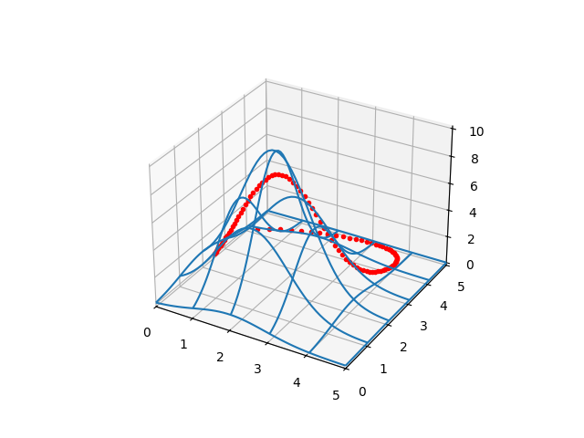
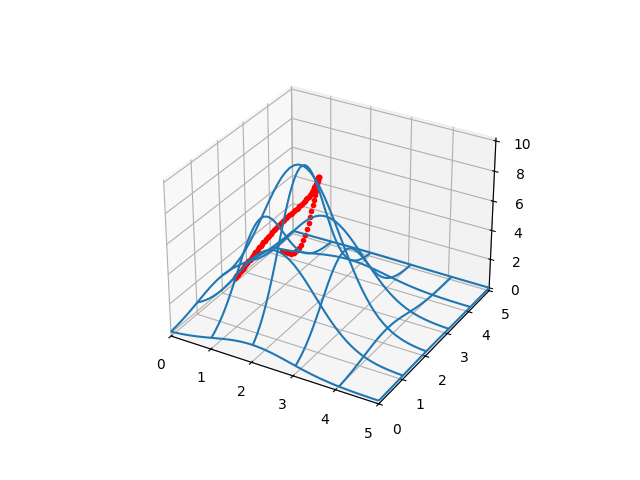
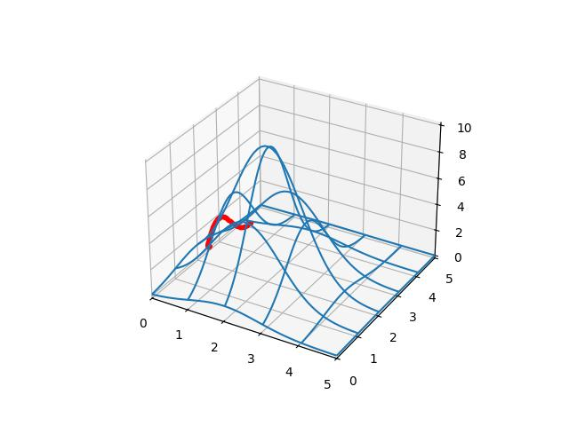
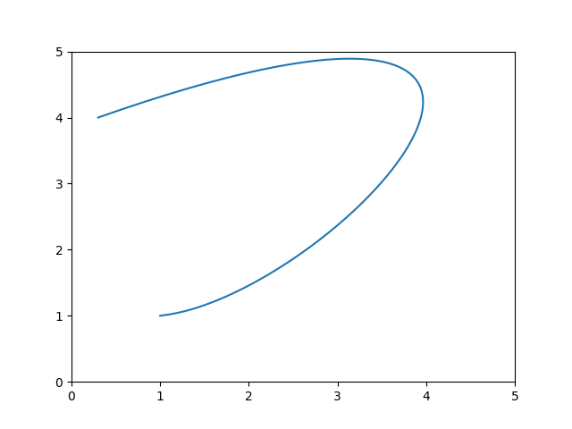

# Yükseklik Fonksiyonu (Tepeler) Arasından En Düz, Optimal Yürüyüş Yolunu Bulmak

Elimizde bir alan içindeki yükseklikleri veren bir fonksiyon $f(x,y)$
olduğunu düşünelim. Acaba verili bir başlangıç ve bitiş noktası arasındaki
en "rahat'' gidiş yolunu nasıl buluruz? 

Yükseklikler bir $E(x,y)$ fonksiyonunda olsun. Yolları nasıl temsil ederiz?
Bir parametrik eğri kullanabiliriz, mesela 

$$
x(t) = a_0 + a_1 t + a_2 t^2 + a_3 t^3 + a_4 t^4
$$

$$
y(t) = b_0 + b_1 t + b_2 t^2 + b_3 t^3 + b_4 t^4
$$

İstediğimiz derecede polinom parametrize eğrileri nasıl yaratacağımızı
biliyoruz [3]. Böylece doğru, optimal bir yolu bulmak demek
$a_0,a_1,a_2,a_3,b_0,b_1,b_2,b_3$ katsayılarını doğru bulmak demek
olacaktır. Bir optimizasyon problemi yani.

Peki o zaman optimize, minimize edilecek bedel fonksiyonu ne olmalı? Burada
farklı yaklaşımlar olabilir. 

Önce yükseklikleri ve eğrileri iki örnek üzerinde görelim. Bir rasgele
tepe, ve bir rasgele yol çiziyoruz,

```python
from mpl_toolkits.mplot3d import Axes3D
from scipy.spatial.distance import cdist
from matplotlib import cm

def gfunc1(x, y):
    s1 = 2.2; x1 = 2.0; y1 = 2.0
    g1 = np.exp( -4 *np.log(2) * ((x-x1)**2+(y-y1)**2) / s1**2)
    return g1 * 10.0

def plot_surf_path(myfunc,a0,a1,a2,a3,a4,b0,b1,b2,b3,b4):

    D = 50
    x = np.linspace(0,5,D)
    y = np.linspace(0,5,D)
    xx,yy = np.meshgrid(x,y)
    zz = myfunc(xx,yy)

    fig = plt.figure()
    ax = fig.gca(projection='3d')
    ax.set_xlim(0,5)
    ax.set_ylim(0,5)
    surf = ax.plot_wireframe(xx, yy, zz,rstride=10, cstride=10)

    t = np.linspace(0,1.0,100)

    x = a0 + a1*t + a2*t**2 + a3*t**3 + a4*t**4 
    y = b0 + b1*t + b2*t**2 + b3*t**3 + b4*t**4

    ax.plot3D(x, y, myfunc(x,y),'r.')
```

```python
# 1. gidis yolunun tanimi, uzun yoldan dolanarak gidiyor
a1,a2,a3 = 1.5, 8.1, 4.0
b1,b2,b3 = 0.3, 0.4, 23.3
a0,b0=(1.0,1.0)
ex,ey=(0.3,4.0)
a4 = ex - a0 - (a1+a2+a3)
b4 = ey - b0 - (b1+b2+b3)
test_coefs1 = (a0,a1,a2,a3,a4,b0,b1,b2,b3,b4)
plot_surf_path(gfunc1,a0,a1,a2,a3,a4,b0,b1,b2,b3,b4)

plt.savefig('calc_multi_40_elev_01.png')
```



Başlangıç ve bitiş noktalarını nasıl formüle dahil ettiğimize dikkat, $t=0$
olduğu anda $x(t),y(t)$ değerleri sırasıyla $a_0$ ve $b_0$'dir bunlar başlangıç
değerleridir. Bitiş noktası ise $t=1$ anında sahip olunması gereken değerdir,
bu noktada

$$
x(1) = a_0 + a_1 + a_2 + a_3 + a_4 ,\quad
y(1) = b_0 + b_1 + b_2 + b_3 + b_4 
$$

olacağı için bitiş noktalarına $e_x,e_y$ diyelim, $x(t)$ için $a_1,a_2,a_3$
katsayılarının değişmesine izin veririz, fakat sonuncu katsayı $a_4$'un ne
olacağını formülde $e_x$ üzerinden zorlarız, yani $a_4 = e_x - (a_0 + a_1 + a_2
+ a_3)$ hesabını yaparız. Böylece $a_0 + a_1 + a_2 + a_3 + a_4$ toplamı $e_x$
sonucunu vermelidir. $y(t)$ ve $e_y$ için benzer mantığı kullanırız.  Bu şekilde
başlangıç, bitiş noktalarını genel formülasyon üzerinde zorlamış olduk.

Şimdi ikinci bir gidiş yoluna bakalım, 

```python
a1,a2,a3 = 1.5, 3.0, 1.0
b1,b2,b3 = 0.0, 1.0, 1.0
a0,b0=(1.0,1.0)
ex,ey=(0.3,4.0)
a4 = ex - a0 - (a1+a2+a3)
b4 = ey - b0 - (b1+b2+b3)
test_coefs2 = (a0,a1,a2,a3,a4,b0,b1,b2,b3,b4)
plot_surf_path(gfunc1,a0,a1,a2,a3,a4,b0,b1,b2,b3,b4)
plt.savefig('calc_multi_40_elev_03.png')
```



Bu yolları tabii ki rasgele parametreler üzerinden yarattık, bunlar optimal
yollar değiller.

Bedel Ölçütü

İlk kullanacağımız ölçüt çit yüksekliği denen [2]'de bahsedilen hesap,
parametrik eğrinin gezdiği yol altında kalan yükseklikleri bir çit gibi
düşünürsek bu çitin yan yüzeyinin alanı bir kısa yol ölçütü olarak
kullanılabilir. 

$$
\int_{t=0}^{t=1} f(x(t),y(t)) \sqrt {x'(t)^2 + y'(t)^2} \mathrm{d} t
$$

Öyle ya, yüksek tepelerden gitmeye kalksak çitin toplam alanı büyür, yol uzarsa
yine büyür, bu sebeple çit alanını minimize etmeye uğraşan bir hesap yolu hem
alçak yerlerden hem de kısa yollardan götürmeye uğraşacaktır.


Şimdi formülün gerektirdiği öğeleri birer birer bulalım, mesela $x'(t)$, ve
$y'(t)$ `sympy` ile hesaplanabilir,

```python
import sympy

vars = 't a0 a1 a2 a3 a4 b0 b1 b2 b3 b4 gamma x y'
t, a0, a1, a2, a3, a4, b0, b1, b2, b3, b4, gamma, x, y = sympy.symbols(vars)

xdef = a0 + a1*t + a2*t**2 + a3*t**3 + a4*t**4
ydef = b0 + b1*t + b2*t**2 + b3*t**3 + b4*t**4

dxdt = sympy.diff(xdef,t)
print (dxdt)
dydt = sympy.diff(ydef,t)
print (dydt)
sqrtdef = sympy.sqrt(sympy.diff(xdef,t)**2 + sympy.diff(ydef,t))
print (sqrtdef)
```

```
a1 + 2*a2*t + 3*a3*t**2 + 4*a4*t**3
b1 + 2*b2*t + 3*b3*t**2 + 4*b4*t**3
sqrt(b1 + 2*b2*t + 3*b3*t**2 + 4*b4*t**3 + (a1 + 2*a2*t + 3*a3*t**2 + 4*a4*t**3)**2)
```

Karekök her zaman lazım değil, karesel hesap ta yeterli olabilir,

```python
sqrdef = sympy.diff(xdef,t)**2 + sympy.diff(ydef,t)
```

Şimdi sembolik olan hesaplara rasgele bazı katsayılar geçelim, ve sayısal bir
sonucu görelim,

```python
xsubs = {a0: 2, a1: 2, a2: 2, a3: 2, a4: 2, t:0.5}
xval = xdef.subs(xsubs)
ysubs = {b0: 3, b1: 3, b2: 3, b3: 3, b4: 3, t:0.5}
yval = ydef.subs(ysubs)
sqrval = sqrtdef.subs(xsubs).subs(ysubs)
g1 = gfunc1(float(xval),float(yval))
print (xval, yval, sqrval, g1)
```

```
3.87500000000000 5.81250000000000 7.21110255092798 0.00032302357084224476
```

Artık optimizasyonun kullanacağı bedeli kodlayabiliriz, bu üstteki bahsettiğimiz
entegral olacak, $t=0,t=1$ arasında hesaplanacak tabii ki (çünkü başlangıç,
bitiş değerlerini de bu kavrama ilintilendirdik), ve fonksiyon değişken olarak
şu anda bilinmeyen katsayıları alacak, optimizasyon rutini ise en optimal
katsayı değerlerini bu bedel üzerinden bulacak.

```python
LARGE_FLOAT = 1e6
pa0,pb0=(1.0,1.0)
pex,pey=(0.3,4.0)
ts = np.linspace(0,1,20)
def calcint_g1(pars):
    pa1,pa2,pa3,pb1,pb2,pb3=pars
    pa4 = pex - pa0 - (pa1+pa2+pa3)
    pb4 = pey - pb0 - (pb1+pb2+pb3)
    argsubs = {a1:pa1, a2:pa2, a3:pa3, a4:pa4, \
               b1:pb1, b2:pb2, b3:pb3, b4:pb4}
    ys = []
    for tcurr in ts:
       sqrval = sqrdef.subs(argsubs).subs({t:tcurr})
       xval = xdef.subs(argsubs).subs({a0: pa0}).subs({t:tcurr})
       yval = ydef.subs(argsubs).subs({b0: pb0}).subs({t:tcurr})
       prod1 = gfunc1(float(xval),float(yval))*sqrval
       ys.append(prod1)
    W = np.trapz(ys,x=ts)
    if W < 0: return LARGE_FLOAT
    return W
```


```python
from scipy.optimize import minimize, Bounds

LIM = 5.0
pa1,pa2,pa3 = 0,0,0
pb1,pb2,pb3 = 0,0,0
x0 = pa1,pa2,pa3,pb1,pb2,pb3
opts = {'maxiter': 40, 'verbose': 3}

res = minimize (fun=calcint_g1,x0=x0,
                method='Nelder-Mead',
                bounds=Bounds([-LIM, -LIM, -LIM, -LIM, -LIM, -LIM],
                              [LIM, LIM, LIM, LIM, LIM, LIM]),
                options=opts)
print (res['x'])
```

```
[-1.92645176  0.87238797  1.45300069  1.5909808   2.46135117  0.73187586]
```

```python
a1,a2,a3,b1,b2,b3 = list(res['x'])
a4 = ex - pa0 - (a1+a2+a3)
b4 = ey - pb0 - (b1+b2+b3)
test_coefs1 = (pa0,a1,a2,a3,a4,pb0,b1,b2,b3,b4)
plot_surf_path(gfunc1,pa0,a1,a2,a3,a4,pb0,b1,b2,b3,b4)
plt.savefig('calc_multi_40_elev_07.jpg')
```



Fena değil, optimal bir yola benziyor, tepelerden kaçınıldı mümkün olduğu kadar
düşük yükseklikli ve kısa yoldan gidildi.

Üstteki optimizasyon kodunda dikkat edilirse bazı püf noktalar var, mesela eğer
`W` değeri sıfırdan küçük ise çok büyük bir değer döndürüyoruz böylece o
tür parametrelerden kaçınmış oluyoruz, optimizasyonu diğer yönlere kanalize
ediyoruz. Bu basit bir sağlama işlemi, çünkü üstte tarif edilen türden entegral
hesabı sıfırdan küçük olamaz, eğer öyle ise o tür sonucu veren parametrelerle
ilgilenmiyoruz.


Başka bir yükseklik fonksiyonunu kullanalım, iki tepe var şimdi, ve
bitiş noktası farklı,

```python
def gfunc2(x, y):
    s1 = 2.2; x1 = 2.0; y1 = 2.0
    g1 = np.exp( -4 *np.log(2) * ((x-x1)**2+(y-y1)**2) / s1**2)
    s2 = 1.2; x2 = 4.0; y2 = 1.0
    g2 = np.exp( -4 *np.log(2) * ((x-x2)**2+(y-y2)**2) / s2**2)
    return g1*10.0 + g2*10.0
```

```python
from scipy.optimize import minimize, Bounds

pa0,pb0=(1.0,1.0)
pex,pey=(4.0,2.0)

ts = np.linspace(0,1,50)

def calcint_g2(pars):
    pa1,pa2,pa3,pb1,pb2,pb3=pars
    pa4 = pex - pa0 - (pa1+pa2+pa3)
    pb4 = pey - pb0 - (pb1+pb2+pb3)
    argsubs = {a1:pa1, a2:pa2, a3:pa3, a4:pa4, \
               b1:pb1, b2:pb2, b3:pb3, b4:pb4}
    ys = []
    for tcurr in ts:
       sqrval = sqrdef.subs(argsubs).subs({t:tcurr})
       if sqrval < 0: sqrval = 0    
       xval = xdef.subs(argsubs).subs({a0: pa0}).subs({t:tcurr})
       yval = ydef.subs(argsubs).subs({b0: pb0}).subs({t:tcurr})
       prod2 = gfunc2(float(xval),float(yval))*sqrval
       ys.append(prod2)
    W = np.trapz(ys,x=ts)
    if W < 0: return LARGE_FLOAT
    return W
    
LIM = 5.0
pa1,pa2,pa3,pb1,pb2,pb3 = 1,1,1,1,1,1
x0 = pa1,pa2,pa3,pb1,pb2,pb3

opts = {'maxiter': 40, 'verbose': 3}

res = minimize (fun=calcint_g2,x0=x0,
                method='Nelder-Mead',
                bounds=Bounds([-LIM, -LIM, -LIM, -LIM, -LIM, -LIM],
                              [LIM, LIM, LIM, LIM, LIM, LIM]),
                options=opts)
print (res['x'])
```

```
[ 2.27463285  1.17233979  1.48426044 -0.08218053  1.12299169  0.40471825]
```

```python
a1,a2,a3,b1,b2,b3  = list(res['x'])
a4 = pex - pa0 - (a1+a2+a3)
b4 = pey - pb0 - (b1+b2+b3)
test_coefs2 = (pa0,a1,a2,a3,a4,pb0,b1,b2,b3,b4)
plot_surf_path(gfunc2,pa0,a1,a2,a3,a4,pb0,b1,b2,b3,b4)
plt.savefig('calc_multi_40_elev_08.jpg')
```


Bu yol da iyi oldu, iki tepe ortasındaki yüksekliği düşük olan yerden
geçildi. 

Eğri Uzunlukları, Yatay, Dikey

Alternatif bir bedel ölçütü şöyle olabilir, eğri altına düşen yüksekliklerin
toplamını bir çizgi entegrali ile hesaplayınca bu yaklaşım yüksekliklerden genel
olarak uzak durabilir, çok inişli çıkışlı yolları hala tercih eder, ama bu tür
yolların yürüyüş olarak yorucu olacağını biliyoruz. 1000 metrelik bir tepeye
çıkıp onun üzerinde düz yürümek habire 1000 metreyi inmek çıkmaktan çok daha
rahat.

Alternatif bir ölçüt şöyle olabilir; Bir eğriyi düşünelim, onun $z$ eksenindeki
yansıması da bir eğridir, $x,y$ düzlemindeki yansıması bir başka eğri. Bu
eğrilerin *uzunluğunu* hesaplarsak [2] ve dikey yöndeki uzunluğu yatay olan
uzunluğu farklı ağırlıklarla çarpıp toplarsak bu bir bedeli temsil eder. Ağırlık
dikey/yatay uzunluklar için 5/1 oranında olabilir, o zaman yatay yöndeki bir
uzunluk / katedilen yol dikeye göre 5 kat daha tercih edilir olur.

Optimallik için gereken uzunluk hesabına gelelim. Bu hesap için
formül, dikey için $I_v$ yatay için $I_h$

$$
I_v = \int_{t=0}^{t=1} \sqrt{1 + \left(\frac{\mathrm{d} z}{\mathrm{d} t} \right)^2 } \mathrm{d} t
$$

$$
I_h = \int_{t=0}^{t=1} \sqrt{
\left(\frac{\mathrm{d} x}{\mathrm{d} t} \right)^2 + 
\left(\frac{\mathrm{d} y}{\mathrm{d} t} \right)^2
} 
\mathrm{d} t
$$

Formülde görülen $\mathrm{d} z/\mathrm{d} t$, $\mathrm{d} x/\mathrm{d} t$ ve $\mathrm{d} y/\mathrm{d} t$, parametrik eğri
üzerinden alınacak tabii ki. Problem çözümü açısından $\mathrm{d} z/\mathrm{d} t$ hesabı
külfetli olabilir, çünkü $z = f(x,y)$ yükseklik fonksiyonundur.

Mesela ilk örnekteki gidiş yoluna kuşbakışı, iki boyutlu ortamda bakmak
istersek,

```python
a1,a2,a3 = 1.5, 8.1, 4.0
b1,b2,b3 = 0.3, 0.4, 23.3
a0,b0=(1.0,1.0)
ex,ey=(0.3,4.0)
a4 = ex - a0 - (a1+a2+a3)
b4 = ey - b0 - (b1+b2+b3)
  
t = np.linspace(0,1.0,100)
x = a0 + a1*t + a2*t**2 + a3*t**3 + a4*t**4 
y = b0 + b1*t + b2*t**2 + b3*t**3 + b4*t**4
plt.xlim(0,5.0)
plt.ylim(0,5.0)
plt.plot(x,y)
plt.savefig('calc_multi_40_elev_02.png')
```



Bunun dikey versiyonunu da hesaplamak kolay. Üstte tarif edilen yaklaşımı
kodlayan bir kod `pathvhlen.py` içindedir. 

Sigmoid Eğri Yöntemi ve Bitiş Noktası Sınırlaması

[3]'te alternatif bir eğri şekli daha gördük, lineer parçalı ya da sigmoid
bazlı parametrize eğriler. Bir parametrize eğriyi 

$$
x = a_0 + a_1 \sigma(t,u_1) + a_2 \sigma(t,u_2) + ... 
$$

$$
x = b_0 + b_1 \sigma(t,v_1) + b_2 \sigma(t,v_2) + ... 
$$

modelleyebilirdik, $u_1,u_2,..$ eksen $x$ için ilmik noktaları,
$v_1,v_2,..$ eksen $y$ için ilmik noktaları olabilirdi ve biraz
değiştirilmiş sigmoid $\sigma$ ifadesi

$$
\sigma (x,k) = (x-k) \frac{1}{1 + exp(-\alpha (x-k))}
$$

Bilindiği gibi normal sigmoid ifadesi

$$
\sigma (x) = \frac{1}{1 + exp(-\alpha x)}
$$

ve $\alpha$ büyüdükçe 0'dan 1'e geçiş sertleşir. 

Bu şekilde parametrize edilmiş eğri ile pek çok farklı şekil ortaya
çıkartılabilir. Bitiş noktasını da farklı bir şekilde optimizasyon kısıtlaması
üzerinden zorluyoruz [3]. Bu yaklasim icin gereken kodlar `pathsig.py`
icinde.


Sadece 3 tane ilmik noktası tanımladık, bu noktalar vektörel notasyon ile
çoğaltılabilir. Fakat optimizasyon gayet optimal bir yolu bulabildi, bu
örnekte iki tane tepe var, ama onların arasından geçerek sonuca ulaştı. 

Bitiş noktalarını cebirsel değil `conx` ve `cony` adlı iki
sınırlama tabiri ile zorladık.

Polinom bazlı eğride bazı türevleri sembolik olarak almıştık, burada
tüm türevler sayısal bazlı fakat sigmoid bazlı parametrik eğrilerin de
sembolik türevini kullanmak zor değil. Burada hızlı kodlama amaçlı bunu
yapmadık. 

Kaynaklar 

[1] Bayramlı, Sayısal Bilim, *Sayısal Entegrasyon (Numerical Integration)*

[2] Bayramlı, Çok Boyutlu Calculus, *Ders 6, Eğri Uzunluğu*

[3] Bayramlı, Çok Boyutlu Calculus, *Ders 5, İki Nokta Arasında Parametrize Edilmiş Eğri*

[5] Bayramlı, Fonksiyonel Analiz ve Optimizasyon, *Newton-umsu Metotlar, DFP, BFGS *


