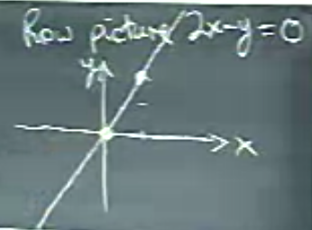
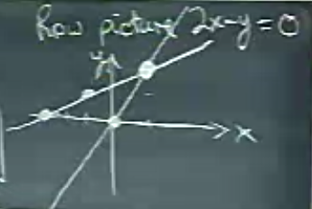
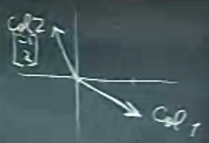
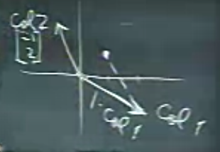
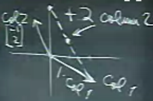
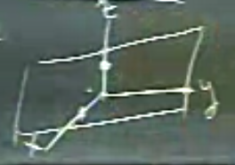
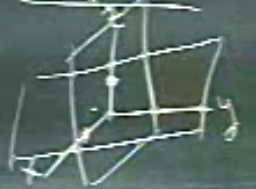
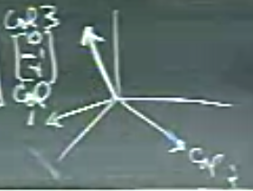
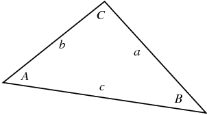

# Ders 1

İlk dersimize hoşgeldiniz, ben Gilbert Strang. Lineer cebirin çözmeye
çalıştığı en temel problem bir lineer denklem sistemini çözmektir. Bu
bağlamda mesela en genel durum "bilinmeyen ve denklem sayısının birbirine
eşit olduğu'' durumdur, ki bu "güzel durum'' olarak nitelenebilir. Boyut
$n \times n$ olunca bu durumda oluyoruz. Ama diğer durumları da
işleyeceğiz. 

Dersin kavramlarını anlamak için  "satır bakışı''na başvuracağız, bu
durumda her denkleme teker teker bakıyoruz gibi olacak, dersimizde pek çok
kez kullanacağımız $A$ matrisimiz olacak mesela, ve bu matrisin satırların
her denklemin değişkenlerinin katsayılarına tekabül edecek.

Kolon bakış açısı belki daha önce görmediğiniz bir açı olacak, bu durumda
her kolon ayrı ayrı işlenecek. 

Cebirsel bakış açısı ise tüm matrisi, bu durumda $A$, aynı anda ele alacak.

Güzel durumdan başlayalım; iki bilinmeyen, iki denklem.

$$ 2x - y = 0 $$

$$ -x + 2y = 3 $$

Katsayıları matrise taşıyalım

$$ 
\left[\begin{array}{cc}
2 & -1 \\
-1 & 2
\end{array}\right]
\left[\begin{array}{c}
x \\
y
\end{array}\right]
=
\left[\begin{array}{c}
0 \\
3
\end{array}\right]
$$

Soldaki matrise ben çoğunlukla $A$ derim, sonra içinde bilinmeyenleri
taşıyan $x$ vektörü koyarım, ki bazıları bunu vektör olduğu için köyü
renkte $\mathbf{x}$ olarak ta yazar, ve sonra bir vektör daha, ki buna ben
çoğunlukla $b$ derim, yani sonuç şöyle olur,

$$ A x = b $$

Şimdi satır bakışına başvuralım. Grafik olarak düşünelim, hangi noktalar
$2x - y = 0$ denklemini tatmin eder? Orijin $(0,0)$ noktası bunlardan biri,
bir diğeri $x=1,y=2$. Bunları çizgi ile birleştirip çizgiyi sonsuza uzatırsak,



İkinci denklemi düşünelim, bu denklem orijinden geçmeyecek. $y$ sıfır
olsaydı $x$ nereden geçerdi..? $x=-3$ noktasından. $x=-1$ işe, $y$ nedir?
$y=1$. Artık ikinci çizgiyi çizebiliriz,



Her iki çizgi $x=1,y=2$ noktasında buluştu (hoca o noktayı daha önceden
tahtaya koymuştu ama buna bir "hazır raslantı'' diyelim). Bu buluşma
noktası her iki denklemi tatmin eden sistemin çözüm noktasıdır.

Kolon bakışına gelelim. Bu bakışa göre

$$ 
x
\left[\begin{array}{r}
2 \\
-1
\end{array}\right]
+
y
\left[\begin{array}{r}
-1 \\
2
\end{array}\right]
=
\left[\begin{array}{r}
0 \\
3
\end{array}\right]
$$

Bu bakış açısı bize ne söylüyor? Bir anlamda diyor ki "eşitliğin solundaki
iki vektörü öyle bir şekilde kombine et ki bu lineer kombinasyon sonucu
eşitliğin sağ tarafını versin''. Bu operasyon, işlem lineer cebir dersinin
en temel işlemidir - kolonların lineer kombinasyonu. 

Kolonları vektörel olarak çizelim, bilindiği gibi bir vektör orijinden
çıkan bir yönü ve büyüklüğü olan bir şeydir. Birinci kolon 2 sağa 1 aşağı
gitmeli, ikincisi bir sola 2 yukarı gitmeli. Çizince,



Peki bu vektörleri nasıl "birleştirelim'' yani hangi katsayılarla çarpıp
toplayalım ki $\left[\begin{array}{rr}3 & 0\end{array}\right]^T$ sonucunu
elde edelim? Not: Burada devrik işaretini kullandık çünkü satır vektörünün
devriğini alınca kolon vektörü olur, yazarken o şekilde yazdık çünkü başka
türlü yazı içine rahat koymak mümkün olmayacaktı.

Neyse, kombine etmek toplamaktır, o zaman ikinci kolonu alıp birinciye
ekleyelim, vektör aritmeğitinde toplamak bir vektörü diğerinin bittiği
noktadan başlatmak demektir, bir tane (yani katsayı 1 ile) ikinci vektörü
birinciye ekleyince



Çözüm noktasına erişemedik daha, 2 tane ekleyince,



Çözüme eriştik. Çözüm $y$ ekseni üzerinde 3,0 noktası. Bu noktaya bir
lineer kombinasyon yaparak eriştik. "Doğru'' lineer kombinasyon bize
sonucu verdi. 

Kendimize şunu soralım: *bütün* lineer kombinasyonlar bize neyi
verirdi? Bu çok önemli bir soru, üzerinde iyi düşünelim, çünkü bu konu
tekrar tekrar karşımıza çıkacak. Tüm kombinasyonlar derken tüm $x,y$'lerin
doğuracağı kombinasyonlar; bu şekilde eşitliğin sağ tarafı ne olursa olsun
onu temsil edebilirdik. Yani bu tüm kombinasyonlar tüm bir düzlemi (plane)
doldururdu. Bunu bir kenara koyalım, konuyu ileride daha detaylı olarak
inceleyeceğiz.

3 Boyut

$$  2x - y = 0  $$

$$ -2x + y - z = -1 $$

$$ -3y + 4z = 4 $$

Bu sistemi nasıl anlarız? Ne gördük: satır bakışı, kolon bakışı. Matris
formuna bakalım, 

$$ A = 
\left[\begin{array}{rrr}
2 & -1 & 0 \\
-1 & 2 & -1 \\
0 & -3 & 4 
\end{array}\right]
,
b = 
\left[\begin{array}{r}
0  \\
-1 \\
4  
\end{array}\right]
$$

Satır bakışı, üstteki ikinci denklemi alalım, grafiği neye benzer?
Orijinden geçen bir şey yok, çünkü $0,0,0$ bir çözüm olamaz. Çözüm neye
benzer? Elimizde bir lineer denklem var ise üç boyutta bu denklemi çözen
tüm noktalar bir düzlem (plane) oluştururlar. Hoca diyor ki ben Rembrandt
değilim, kabaca bir düzlem çizeceğim, 



Birinci denklem neye benzer? $z$ belirtilmemiş, demek ki herhangi bir şey
olabilir, geri kalanlar yine bir düzlem oluştururlar. Mesela alttaki gibi



Bu iki denklemin kesiştiği yer bir çizgidir (line). Bir üçüncü düzlem daha
eklenince (üstte yok), tüm üç düzlemin kesiştiği yer bir nokta olur. Bu
noktanın ne olduğunu ben kafadan bilmiyorum, ama lineer cebir bu noktayı
bulur.

Fakat herhalde görüyorsunuz, satır bakışını zihnimizde canlandırmak biraz
zor. Düzlemler, kesişmeler vs düşünmemiz gerekiyor. İki boyutta iki çizgi
kesişmesinde problem yoktu, fakat üç boyutta işler biraz karıştı. Dört ya
da daha fazla boyutu düşünün! 

Kolon bakışı ile

$$ 
x 
\left[\begin{array}{r}
2 \\
-1 \\
0
\end{array}\right]
+
y
\left[\begin{array}{r}
-1 \\
2 \\
-3
\end{array}\right]
+
z 
\left[\begin{array}{r}
0 \\
-1 \\
4
\end{array}\right]
=
\left[\begin{array}{r}
0 \\
-1 \\
4
\end{array}\right]
$$

Yani eşitliğin sol tarafındaki üç boyutlu vektörlerin hangi kombinasyonu
eşitliğin sağındaki üç boyutlu vektörü verir? Çizmeye uğraşalım,



Hocanın hazırladığı örnekte basit bir çözüm var, $z$ katsayıları ile $b$
aynı, o zaman $\left[\begin{array}{ccc}0&0&1\end{array}\right]$ denklemi çözer,
$z=1$ çözüm için yeterli olur, $z$'yi alırız, geri kalanları "istemiyoruz''
onları sıfır yaparız - $x=0,y=0,z=1$.

Tabii kolon resminin daha düzgün olması her zaman çözümü pat diye
görebileceğimiz anlamına gelmiyor, çoğu zaman, hatta yüksek boyutlarda bu
da mümkün değil. Eliminasyon yöntemini göreceğiz ileriki derslerde,
sistematik olarak herhangi bir boyutta bizim için lineer sistemi çözecek. 

Daha geniş resme bir bakalım. Eşitliğin sağ tarafı başka bir şey olsaydı,
mesela

$$ 
x 
\left[\begin{array}{r}
2 \\
-1 \\
0
\end{array}\right]
+
y
\left[\begin{array}{r}
-1 \\
2 \\
-3
\end{array}\right]
+
z 
\left[\begin{array}{r}
0 \\
-1 \\
4
\end{array}\right]
=
\left[\begin{array}{r}
1 \\
1 \\
3
\end{array}\right]
$$

(Bu sağ tarafı 1. ve 2. kolonları birbirine ekleyerek uydurduk bu arada),
çözüm o zaman ne olurdu? Çözüm basit (çünkü kendimiz pişirdik),
$x=1,y=1,z=0$. Üstteki durumda ve satır bakışında tamamen değişik üç tane
düzlem elde ederdik. Kolon bakışında hala aynı üç vektörle uğraşırız,
sadece onları değişik şekillerde kombine etmemiz gerekir. 

Soru: üstteki denklemi herhangi bir $b$ yani eşitliğin sağ tarafı için
çözebilir miyim? 

Bu soruyu daha değişik bir şekle sokabilir miyiz, öyle ki soru lineer
kombinasyon argümanlarını kullansın. 

Soru: üstteki kolonların lineer kombinasyonu bütün 3-boyutlu uzayı doldurur
mu?

Cevap, üstteki (gibi bir) matris için "evet''. Bu matris nasıl bir matris?
Bu matris iyi huylu, eşsiz (singular) olmayan, tersi alınabilir
(ınvertible) bir matris. Bu tür matrisler için her zaman çözüm var. 

Peki iyi huylu olmayan durum nasıl olurdu? Düşünelim, ne yanlış
gidebilirdi? Eğer tüm vektörler aynı düzlem üzerinde olsaydılar, o zaman bu
vektörlerin her türlü kombinasyonu da aynı düzlem üzerinde olmak
zorundadır, o zaman başımız dertte. Mesela 3. kolon 1. ve 2.'nin toplamı
olsa (ki bu durumda her üç vektör aynı düzlemdedir), o zaman işler
kötü. Niye? Çünkü $b$ farklı bir düzlemde ise artık hiçbir kombinasyonla
oraya erişemem. Eğer $b$ aynı düzlem üzerinde olsaydı tabii erişilebilirdi,
yani *bazı* $b$'ler için çözüm hala var, ama hepsi, çoğunluğu için yok. 

İşte eşsiz durum budur, ki bu durumda çoğu $b$ için çözüm yoktur.

Boyutları arttırdığımızı düşünelim. 9 boyut olsaydı ne olurdu? Bu kadar
boyutu görsel olarak hayal etmek mümkün değil, ama yine aynı durum, $Ax=b$
var, bu sefer 9 boyutlu 9 tane kolon var, bunları kombine edip $b$ elde
edeceğiz? Bunu yapmayı başarabilmemiz tabii ki $A$'nin ne olduğuna
bağlıdır. Rasgele bir $A$ matrisi üretseydim (ki bu Numpy `rand` ile
basitçe yapılabilir) size garanti ediyorum bu matris iyi huylu olurdu,
eşsiz olmayan tersi alınabilen vs. ve bu matris ile $b$'ye
erişebilirdiniz. 

Kötü durum kolonlar bağımsız olmadığı zaman. Mesela 7. kolon 5. kolonun
tıpatıp aynısı, ki bu durumda 7. kolon sisteme "yeni hiç bir bilgi
eklemiyor''. Bu yüzden bazı $b$'lere erişmem imkansız hale geliyor. İyi
huylu durumda 9 bağımsız kolonun kombinasyonu tüm 9 boyutlu uzayı
doldurabilirdi. Ama bir bağımlı vektör var ise o zaman sadece 9 boyutlu
uzayın 8 boyutlu bir alt düzlemini doldurabilirsiniz. Dersimizin ileri
noktalarında bu kısıtlı alt uzaylar ile de iş yapmayı öğreneceğiz, yapmamız
gerekecek. Şimdilik güzel koşula odaklanalım.  

Ayrıca, şimdiye kadar sözel olarak belirttiklerimizi bir de matris
formunda, cebiriyle anlatmayı deneyelim. $Ax=b$ dedik, $A$ matrisi bir $x$
vektörü ile çarpılır. Bir vektörü bir matris ile nasıl çarparsınız? Mesela

$$ 
\left[\begin{array}{rr}
2 & 5 \\
1 & 3
\end{array}\right]
\left[\begin{array}{r}
1 \\
2
\end{array}\right]
$$

Bunu yapmanın iki yolu var. Önce benim en favori yöntemimi söyleyeyim,
belki de sürpriz olmayacak, kolonlar kullanarak. Bu durumda, mesela üstteki
örnekte, $A$'nin 1. kolunundan 1 tane, 2. kolonundan 2 tane alacağım, ve
toplayacağım. Yani,

$$ =
1
\left[\begin{array}{r}
2 \\
1
\end{array}\right]
+
2
\left[\begin{array}{r}
5 \\
3
\end{array}\right]
=
\left[\begin{array}{r}
12 \\
7
\end{array}\right]
$$

Diğer bir yöntem satır bazlı. Bu durumda $A$'nin 1. satırı ile $x$'i
çarpıyorum, yani noktasal çarpımını alıyorum, ve bu tek bir değer sonucunu
verecek, ve tek, skalar değeri alıp sonucun ilk hanesine yazıyorum. Aynı
şekilde $A$'nin 2. satırını tekrar aynı $x$ ile noktsal çarpıyorum, ikinci
haneye yazıyorum. 

Fakat daha önce belirttiğimiz gibi kolon bakışı biraz daha rahat
açıklanabilir halde. O zaman şunu söyleyebiliriz: "$Ax$, $A$'nın
kolonlarının bir kombinasyonudur''. 

Bir sonraki derste herhangi boyuttaki bir sistem için sistematik olarak
eliminasyon yaparak, eğer varsa, bir sonuca ulaşmayı öğreneceğiz. Eğer
eliminasyon başarısız olursa bunun üzerinden ne zaman bir sonuç olmadığını
görmeyi de öğreneceğiz. 

Ekler

Matris Çarpımı

Sırabağımlılık

Matris çarpımı sırabağımlı (commutative) değildir, yani $AB \ne BA$. Bir örnekte
görelim,

$$
\left[\begin{array}{cc}
1&0\\0&0
\end{array}\right]
\left[\begin{array}{cc}
0&1\\0&0
\end{array}\right]
=
\left[\begin{array}{cc}
0&1\\0&0
\end{array}\right]
$$

$$
\left[\begin{array}{cc}
0&1\\0&0
\end{array}\right]
\left[\begin{array}{cc}
1&0\\0&0
\end{array}\right]
=
\left[\begin{array}{cc}
0&0\\0&0
\end{array}\right]
$$

Satır ve Kolon Bakış Açısı

Matris çarpımının tarifini lise derslerinden hatırlayabiliriz. Sol el sol
taraftaki matriste bir satır boyunca, sağ el sağdaki matris üzerinde kolon
boyunca öğe öğe hareket ettirilir, ve bu hareket sırasındaki öğeler çarpılıp, o
çarpımlar sürekli toplanır. Sol ve sağ elin bir hareketi bittiğinde, ele geçen
tek bir sayı vardır, ve o sayı üzerinden geçilen satır $i$ ve kolon $j$ için
sonuç matrisi, mesela $C$'nin, $i$'inci satırı ve $j$'inci kolonuna yazılır.

Daha basit bir $Ax$ örneğine bakarsak, yani solda $A$ ve sağda $x$
var, çarpım

$$
\left[\begin{array}{ccc}
1 & 1 & 6 \\
3 & 0 & 1 \\
1 & 1 & 4 \\
\end{array}\right]
\left[\begin{array}{ccc}
2  \\
5  \\
0  \\
\end{array}\right]
$$

Noktasal Çarpım Bakışı

Bu çarpımı bir kaç şekilde görebiliriz. Eğer üstte tarif edilen gibi gördüysek,

$$
\left[\begin{array}{ccc}
1\cdot 2 + 1\cdot 5 + 6\cdot 0 \\
3\cdot 2 + 0\cdot 1 + 3\cdot 0 \\
1\cdot 2 + 1\cdot 5 + 4\cdot 0 
\end{array}\right]
=
\left[\begin{array}{c}
7 \\
6 \\
7 \\
\end{array}\right]
$$

Kolonsal Kombinasyon Bakışı

Fakat matris çarpımına bakmanın bir yolu daha var, hatta bu bakış açısının daha
önemli bile olduğu söylenebilir, o da $A$'nin kolonlarının kombine edilerek
sağa sonuç olarak geçilmesi bakışıdır. Buna göre

$$ 
2\cdot 
\left[\begin{array}{ccc}
1 \\
3 \\
1 \\
\end{array}\right]
+
5\cdot 
\left[\begin{array}{c}
1 \\
0 \\
1 \\
\end{array}\right]
+
0\cdot 
\left[\begin{array}{c}
6 \\
3 \\
4 \\
\end{array}\right]
=
\left[\begin{array}{c}
7 \\
6 \\
7 \\
\end{array}\right]
$$

Tabii burada ikinci "matris" aslinda bir vektör, ama o vektör de matris
olsaydı,

```python
A = np.array([[1 ,1 , 6],[3 , 0 , 1],[1 , 1 , 4]])
x = np.array([[2], [5], [0]])
print ('vektor ile\n')
print (np.dot(A,x))
B = np.array([[2, 2, 2],[5, 5, 5],[0, 0, 0]])
print ('\nmatris ile\n')
print (np.dot(A,B))
```

```
vektor ile

[[7]
 [6]
 [7]]

matris ile

[[7 7 7]
 [6 6 6]
 [7 7 7]]
```

Satır Kombinasyon Bakışı

Sağdan çarpan vektörü bir genişleterek 2 boyutlu hale getirelim, 

$$
\left[\begin{array}{ccc}
1 & 1 & 6 \\
3 & 0 & 1 \\
1 & 1 & 4 \\
\end{array}\right]
\left[\begin{array}{ccc}
2 & 2  \\
5 & 5  \\
0 & 0  \\
\end{array}\right]
$$

Satırsal bakışa göre soldaki matrisinin herhangi bir $i$ satırındaki her
öge, sağdaki matrisin tüm satırlarını kombine ederek sonucun $i$ satırını
ortaya çıkarır. Mesela en üst (birinci satır) için

$$ 
1 \cdot
\left[\begin{array}{cc}
2 & 2
\end{array}\right] +
1 \cdot
\left[\begin{array}{cc}
5 & 5
\end{array}\right] + 
6 \cdot
\left[\begin{array}{cc}
0 & 0
\end{array}\right] 
=
\left[\begin{array}{cc}
7 & 7 \\
\vdots & \vdots \\
\vdots & \vdots
\end{array}\right] 
$$

Diğerleri için benzer işlem uygulanır, 

$$ 
3 \cdot
\left[\begin{array}{cc}
2 & 2
\end{array}\right] +
0 \cdot
\left[\begin{array}{cc}
5 & 5
\end{array}\right] + 
1 \cdot
\left[\begin{array}{cc}
0 & 0
\end{array}\right] 
=
\left[\begin{array}{cc}
7 & 7 \\
6 & 6 \\
\vdots & \vdots
\end{array}\right] 
$$

ve böyle devam edilir.

Kolon Satır Çarpım Bakışı

Bir diğer bakış açısı $A$'nin bir kolonunu, çarpan matris $B$'nin bir satırı ile
çarpılıp, bu her çarpımdan bir matris elde etmek, ve sonra bu matrisleri
toplamaktır. Örnekte görelim,

$$
\left[\begin{array}{ccc}
1 & 1 & 6 \\
3 & 0 & 1 \\
1 & 1 & 4 \\
\end{array}\right]
\left[\begin{array}{ccc}
2 & 2  \\
3 & 1  \\
9 & 5  \\
\end{array}\right]
$$

Boyutları düşünürsek daha açık hale gelebilir, soldaki matrisin bir kolonu 3 x 1
boyutunda, sağdaki bir satır 1 x 2 boyutunda. Sonuç tabii ki 3 x 2 boyutunda bir
matris olacaktır ve bu boyuttaki bir matris her kolon-satır çarpımından elde
edilecektir. Bu durumda mesela ilk yapılan çarpım,

$$
\left[\begin{array}{ccc}
1  \\
3  \\
1  \\
\end{array}\right]
\left[\begin{array}{ccc}
2 & 2 
\end{array}\right]
$$

çarpımı olur. Hesabı altta yapalım,

```python
A = np.array([[1],[3],[1]])
b1 = np.array([[2, 2]])
print (np.dot(A,b1))
```

```
[[2 2]
 [6 6]
 [2 2]]
```

Bu şekilde diğer kolon-satır kombinasyonlarını da yaparsak (birinci kolon ile
birinci satır, ikinci kolon ile ikinci satır, üçüncü kolon ile üçüncü satır
çarpılacak),

```python
A = np.array([[1 ,1 , 6],[3 , 0 , 1],[1 , 1 , 4]])
B = np.array([[2, 2],[3, 1],[9, 5]])
i = 0; r1 = np.dot(A[:,i].reshape(3,1),B[i,:].reshape(1,2))
i = 1; r2 = np.dot(A[:,i].reshape(3,1),B[i,:].reshape(1,2))
i = 2; r3 = np.dot(A[:,i].reshape(3,1),B[i,:].reshape(1,2))
print (r1)
print (r2)
print (r3)
```

```
[[2 2]
 [6 6]
 [2 2]]
[[3 1]
 [0 0]
 [3 1]]
[[54 30]
 [ 9  5]
 [36 20]]
```

```python
print ('kolon-matris carpim toplami')
print (r1+r2+r3)
print ('tum carpim')
print (A.dot(B))
```

```
kolon-matris carpim toplami
[[59 33]
 [15 11]
 [41 23]]
tum carpim
[[59 33]
 [15 11]
 [41 23]]
```

Aynı sonuca varıldığını görüyoruz.

Vektörler

Bir vektör bir yön ve büyüklüktür, başlangıç noktası olarak genellikle orijin
kabul edilir. 1,2, ya da daha fazla boyutta bir sayı listesi ile gösterilebilir,
tek boyutta ise bu tabii ki bir skalar ile aynı şeydir [5]. 

Toplamak

İki boyutta bir örnek görelim, iki vektör $a,b$ var, toplamları


Toplam sanki birinci vektörü alıp diğerinin bittiği yerden başlatmak gibi,
varılan yeri gösteren yeni vektör toplam vektörüdür. Çıkartmak ise aynı yerden
başlayan iki vektörde birinin sonundan diğerine sonuna giden vektörü bulmak
gibidir. Aslında toplam üzerinden çıkartma doğrulabilir, $a-b$ düşünürken $-b$
diye yeni bir vektör yaratırız (yani vektörü tersine çeviririz) ve $a+(-b)$ ile
toplam işlemini yaparız.

Çıkartmak


Kosinüsler Kanunu (Law of Cosines)

Şöyle bir üçgen olduğunu düşünelim [7],



Eğer, mesela C'nin 90 derece olduğunu bilseydik, Pitagor kuralından

$$
c^2 = a^2 + b^2
$$

diyebilirdik. Ama $C < 90$ ise, farklı bir formül kullanılabilir,

$$
c^2 = a^2 + b^2 - 2 a b \cos C
$$

Eğer $C=90$ ise $\cos(90) = 0$ olduğu için Pitagor kuralını elde ettiğimizi
görürüz. 

Üstteki kurala Kosinüsler Kanunu denir, ispatı şöyle,


Üstteki üçgene bakarsak,

$$
c^2 = (a \sin C)^2 + (b-a\cos C)^2
$$

$$
= a^2 \sin^2 C + b^2 - 2 a b \cos C + a^2 \cos^2 C
$$

$$
c^2 = a^2 + b^2 - 2 a b \cos C
$$

Noktasal Çarpım

İki boyutta iki vektör $\vec{a},\vec{b}$ olduğunu düşünelim. Bu vektör ögelerini
$\vec{a} = [a_1, a_2]$ ve $\vec{b} = [b_1, b_2]$ diye gösterirsek, noktasal
çarpım $\vec{a} \cdot \vec{b}$ her iki vektörün tekabül eden öğelerinin
çarpımının toplamıdır, yani

$$
\vec{a} \cdot \vec{b} = a_1 b_1 + a_2 b_2
$$

Daha yüksek boyutlarda benzer işlem devam ettirilir. 

Norm

Bir vektörün uzunluğunun, büyüklüğünün, ya da normu, ki $||\vec{a}||$ ile
gösterilebilir, karesi

$$
||\vec{a}||^2 = \vec{a} \cdot \vec{a} 
$$

Bu kurallara uygun çünkü

$$
(\vec{a} \cdot \vec{a})^2 = a_1 a_1 + a_2 a_2
$$

Ya da

$$
||\vec{a}|| = \sqrt{\vec{a} \cdot \vec{a}} = \sqrt{a_1 a_1 + a_2 a_2}
$$

Aslında büyüklük formülü Pitagor üçgen formülünden hareketle de anlaşılır çünkü
herhangi bir vektör düşünürsek, $a_1,a_2$ ya da $x$ ekseninde $a_1$ $y$
ekseninde $a_2$ olan bir nokta düşünürsek bu noktaya olan orijinden olan uzaklık
(vektör) Pitagor formülü ile hesaplanabilirdi, $\sqrt{a_1^2 + a_2^2}$.

Noktasal çarpım şu şekilde de hesaplanabilir,

$$
\vec{a} \cdot \vec{b} = ||\vec{a}|| ||\vec{b}|| \cos\theta
$$

İspat

Alttaki şekle bakarsak,


Bu üçgenin kenarları arasında Kosinüsler Kanunu uygularsak,

$$
||\vec{a}-\vec{b}||^2 =
||\vec{a}||^2 + ||\vec{b}||^2 -
2 ||\vec{a}|| ||\vec{b}|| \cos\theta
\qquad (1)
$$

Norm açılımından hareketle

$$
||\vec{a}-\vec{b}||^2 = (\vec{a}-\vec{b}) \cdot (\vec{a}-\vec{b}) 
$$

Noktasal çarpımı parantezler üzerinden açarsak,

$$
= \vec{a}\cdot\vec{a} - \vec{a}\cdot\vec{b} - \vec{b}\cdot\vec{a} + \vec{b}\cdot\vec{b}
$$

$$
= ||\vec{a}||^2 - 2\vec{a}\cdot\vec{b} + ||\vec{b}||^2
$$

(1) formülünde sol tarafı üstteki formülle açarsak,

$$
||\vec{a}||^2 - 2\vec{a}\cdot\vec{b} + ||\vec{b}||^2 =
||\vec{a}||^2 + ||\vec{b}||^2 - 2 ||\vec{a}|| ||\vec{b}|| \cos\theta
$$

$$
- 2\vec{a}\cdot\vec{b} = - 2 ||\vec{a}|| ||\vec{b}|| \cos\theta
$$

$$
\vec{a}\cdot\vec{b} = ||\vec{a}|| ||\vec{b}|| \cos\theta
$$

Üstteki eşitlik veri analizinde kullanışlı bulunmuştur, mesela kimisi
müşterileri $D$ boyutunda vektörler olarak temsil edebilir, 1. öğe yaş, 2. öğe
boy, vs. gibi bilgiler olabilir ve iki vektörün birbirine ne kadar "yakın''
olduğu iki vektörün arasındaki açısal uzaklık üzerinden ölçülebilir,

$$
\cos\theta = \frac{\vec{a}\vec{b}}{||\vec{a}|| ||\vec{b}||}
$$

Eğer vektörler baştan normalize edilmiş ise bölme işlemine de gerek kalmaz, tek
bir noktasal çarpım ile kabaca bir benzerlik ölçütü elde edilmiş olur.

Bir diğer kullanım alanı fizikte "yapılan iş'' hesabı. İş, uygulanan kuvvet
çarpı mesafeden elde edilir fakat mesela bir kuvvet alanı $\vec{F}$ her yerde
farklı olabilir ayrıca bu alanda belli bir $\vec{d}$ yolunda hareket eden bir
parçacığı düşünürsek, parçacık bazen kuvvete karşı bazen onunla beraber hareket
ediyor olabilir, bunun ne oranda olduğunun hesabı $\vec{F}$'yi $\vec{d}$ üzerine
skalar olarak yansıtmakla hesaplanır [3], $W = \vec{F} \cdot \vec{d}$.

Diklik

İki vektörün birbirine dik olup olmadığı (orthogonality) testi de noktasal
çarpım ile yapılır. $\cos(90) = 0$ olduğuna göre $\vec{a}\cdot\vec{b}$ çarpımı
sıfır ise iki vektör dik demektir. 

Kaynaklar

[3] [http://sites.science.oregonstate.edu/math/home/programs/undergrad/CalculusQuestStudyGuides/vcalc/dotprod/dotprod.html](http://sites.science.oregonstate.edu/math/home/programs/undergrad/CalculusQuestStudyGuides/vcalc/dotprod/dotprod.html)

[5] *Math Insight*,
    [https://mathinsight.org/vector_introduction](https://mathinsight.org/vector_introduction)

[7] [https://mathworld.wolfram.com/LawofCosines.html](https://mathworld.wolfram.com/LawofCosines.html)


