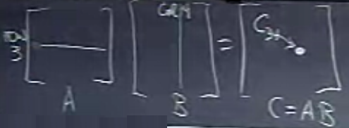
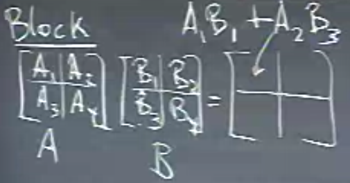

# Ders 3

Önceki derslerde matris çarpımı yaptık, bu derste bu işlemin kurallarını
göreceğiz. Bu işi pek çok şekilde yapmanın yolu var ve hepsi önemli, ve
aynı sonucu veriyor.

Sonra matris tersi (inverse) konusuna gireceğiz, orada bir sürü kavram var,
ve çok önemli. 

İki matrisi çarpma tekniğiyle başlayalım. 

Bu çarpımı elle yaparken bazen soldaki matrisin üzerinde sol işaret
parmağı, sağdakinde sağ işaret parmağı konulur, ve sol el soldan-sağa, sağ
el yukarıdan-aşağı hareket ettirilir, ve parmakların üzerinde olan hücreler
birbiri ile çarpılır, sonra bu çarpımlar toplanır. Üstte soldaki matrisin
3. satırı, sağdaki matrisin 4. kolonu baz alınmış, bu çarpım ve toplama
sonucu $C$'nin 3. satır ve 4. kolonundaki değeri elde ederiz. Bu değere
$c_{34}$ diyelim,

$$ 
\left[\begin{array}{rrrr}
\\
\\
a_{31} & a_{32} & \dots \\
\\
\\
\end{array}\right]
\left[\begin{array}{rrrrr}
& & b_{14} & & \\
& & b_{24} & & \\
& &  & & \\
& &  & & \\
& &  & & 
\end{array}\right] 
=
\left[\begin{array}{rrrrr}
& &  & & \\
& &  & & \\
& & c_{34} & & \\
& &  & & \\
& &  & & 
\end{array}\right]
$$ 

$$ c_{34} = \textrm{ 3. satır } \times \textrm{ 4. kolon } $$

diyebiliriz, ve cebirsel olarak

$$ = a_{31}b_{14} + a_{32}b_{24} + ... $$

Eğer toplama operatörü kullanarak daha temiz yazmak gerekirse,

$$ c_{34} = \sum_{k=1}^{n} a_{3k}b_{k4} $$ 

ki $n$ satır sayısı $n$'dir. 

Bu çarpımı tabii her zaman gerçekleştiremeyiz. Çarpımın olması için matris
boyutlarının uyumlu olması gerekir (illa kare matris olması da gerekmez,
ama uyumluluk gerekir). Üstteki çarpımın nasıl gerçekleştiğine bakarsak bu
uyumu görmeye başlarız herhalde, soldaki matrisin satırı sağdakinin kolonu
çarpılıyorsa bu satır ve kolon büyüklüklerinin eşit olması gerekir. Diyelim
ki $m$ satır $n$ kolon içeren $A$ matrisi $m \times n$ boyutlarında ise, o
zaman bu matris sadece $n \times p$ boyutlarındaki bir $B$ matrisi ile
çarpılabilir, ve sonuç $m \times p$ boyutlarında yeni bir matris
olur. Yeni matrisin boyutları $A$'nin satır sayısı $B$'nin kolon sayısına
eşittir. 

Matris çarpımına kolon bazlı bakabilir miyiz? Evet. Daha önce öğrendiğimiz
kolonla matris çarpımı fikrini kullanmak yeterli, mesela alttaki durumda

$$ 
\underbrace{
\left[\begin{array}{rr}
\dots & \dots   \\
\dots & \dots   \\
\dots & \dots 
\end{array}\right]
}_{A m \times n}
\underbrace{
\left[\begin{array}{rr}
\uparrow &  \dots\\
&  \dots\\
\downarrow & \dots 
\end{array}\right] 
}_{B, n \times p}
=
\underbrace{
\left[\begin{array}{rr}
\uparrow &  \dots \\
&  \dots \\
\downarrow & \dots
\end{array}\right] 
}_{C, m \times p}
$$

$A$'nin *tamamının* $B$'nin en sol kolonu ile çarpılması bize $C$'nin
en sol kolonunu verecektir. Dikkat, bu işlemde $B$'nin diğer kolonları
hiçbir şekilde işleme dahil olmazlar. Yine eğer yine $A$'nin *tamamı*
ile bu sefer ikinci kolonu çarparsak $C$'nin ikinci kolonunu elde ederiz,
vs.

$$ 
\underbrace{
\left[\begin{array}{rr}
\dots & \dots   \\
\dots & \dots   \\
\dots & \dots 
\end{array}\right]
}_{A m \times n}
\underbrace{
\left[\begin{array}{rr}
\dots & \uparrow \\
& \\
\dots & \downarrow
\end{array}\right] 
}_{B, n \times p}
=
\underbrace{
\left[\begin{array}{rr}
\dots & \uparrow \\
& \\
\dots & \downarrow
\end{array}\right] 
}_{C, m \times p}
$$

O zaman şu ifadeyi kullanabiliriz: "$C$'nin kolonları $A$'nin kolonlarının
bir kombinasyonudur''. Bu ifade daha önceki kolon bakışımız ile
uyumlu. Daha önce kolonların kombine edilerek yeni bir kolon elde
edildiğini gördük, bu fikri sadece $B$ üzerinde, tekrar tekrar, her $B$
kolonu ile ayrı ayrı uyguluyoruz, ve sonuç olarak $C$'nin ayrı ayrı
kolonlarını elde ediyoruz.

Satır Bakışı

$$ 
\underbrace{
\left[\begin{array}{rr}
\leftarrow  & \rightarrow  \\
\dots & \dots \\
\dots & \dots 
\end{array}\right]
}_{A m \times n}
\underbrace{
\left[\begin{array}{rr}
\dots & \dots \\
\dots & \dots \\
\dots & \dots
\end{array}\right] 
}_{B, n \times p}
=
\underbrace{
\left[\begin{array}{rr}
\leftarrow  & \rightarrow  \\
\dots & \dots  \\
\dots & \dots 
\end{array}\right] 
}_{C, m \times p}
$$

Aynı çarpımı satırsal olarak düşünelim, tekrar daha önce öğrendiğimiz satır
bakışını ayrı ayrı satırlar olarak kullanıyoruz. $A$'nin tek bir satırı
$B$'nin tamamını, tüm satırlarını kombine ediyor ve bu şekilde $C$'nin
tekabül eden satırını elde ediyoruz. 

Peki 4. yol nedir? Şimdiye kadar gördüklerimiz satır ve kolon noktasal
çarpımı (her $C$ hücresi için), $A$ kolon kombinasyonu, $B$ satır
kombinasyonu. Ya peki $A$'nin kolonunu alıp $B$'nin satırıyla çarpsak ne
olur? Boyut olarak bu neye benzerdi? $A$'dan tek kolon alınca boyut $m
\times 1$. $B$'den satır alınca boyut $1 \times p$. Çarpınca sonuç bir
matris olmaz mı? Evet, boyutu $m \times p$ boyutunda bir matris ortaya
çıkar. Bunu iki vektörün çarpımından elde ettik! Ufak bir örnekte görelim, 

$$ 
\left[\begin{array}{r}
2 \\ 3 \\ 4
\end{array}\right]
\left[\begin{array}{rr}
1 & 6
\end{array}\right]
=
\left[\begin{array}{rr}
2 & 12 \\
3 & 18 \\
4 & 24
\end{array}\right]
$$

Sağdaki matris çok özel bir matristir; öncelikle $C$'nin kolonları mesela
$A$'nin (şu anda bir vektör) katlarıdır aslında. Peki satırlar?  $C$'nin
satırları aynı zamanda $B$ nin satırlarının da katlarıdır! O zaman şunu
söyleyebiliriz. 4. yol $k=1,..,n$ için $A$'nin $k$'inci kolonu ile
$k$'inci satırının çarpımının toplamıdır. Yani alttaki gibi örnekte
göstermek gerekirse, 

$$ 
\left[\begin{array}{rr}
2 & 7 \\
3 & 8 \\
4 & 9
\end{array}\right]
\left[\begin{array}{rr}
1 & 6 \\
0 & 0
\end{array}\right]
=
\left[\begin{array}{r}
2 \\ 3\\ 4
\end{array}\right]
\left[\begin{array}{rr}
1 & 6
\end{array}\right] 
+
\left[\begin{array}{r}
7 \\ 8\\ 9
\end{array}\right]
\left[\begin{array}{rr}
0 & 0
\end{array}\right] 
$$

Eşitliğin sağında her toplamda ayrı birer matris var. Yani her çarpımdan
bir matris elde ediyoruz, sonra bu matrisleri üst üste koyarak
topluyoruz. Bu yaklaşım ayrı ayrı kolonları hesaplayıp onları yanyana
istiflemekten farklı, 4. yolda $m \times p$ boyutlu bir matrisi sürekli
elde ediyoruz, sonra bu matrisleri topluyoruz. 

Eğer iki üstteki örnekteki $C$'nin satırlarını vektör olarak çizseydim,
onların hepsinin aynı yöne işaret ettiğini görürdüm; üst üste binmiş farklı
boyutlarında vektörler olarak gözüküyörlerdi yani. Kolonları çizsem, yine
aynı şekilde olurlardı. Şimdi bir ifade kullanacağım, ki anlamı dersin
ilerisinde daha açık hale gelecek, "$C$'nin satır uzayı da, kolon uzayı da
tek bir çizgidir (ayrı çizgiler tabii)''.

Blok Teknigi

Aslinda matrisleri parcalara bolup carpimi o parcalar uzerinde yapmak ta
mumkundur. 

Mesela $A$'yi ve $B$'yi dört parçaya bölebilirim, ki $A$ mesela $10 \times
10$ boyutlarında olabilir, o zaman çarpım sonucunun sol üst köşesi ne olur?
Alttaki gibi olur,

Yani blokları sanki ayrı bir hücreymiş gibi görüp bildiğimiz çarpım
numarasını uygulayabiliyoruz.

Evet bugünlük matris çarpımı konusunu bitirdik. Artık matris tersi alma
konusuna gelebiliriz. 

Matris Tersi (Inverses)

Matris tersi $A^{-1}$ mesela bir $A$ matrisi için, eğer var ise, öyle bir
matristir ki $A$ ile çarpılınca birim matrisi verir. Yani

$$ A^{-1} A = I $$

Tabii bu durum biraz daha detaylandırılabilir; mesela üstteki matris tersi
soldan ters (left inverse) olarak bilinir, ama kare matrisler için soldan,
sağdan hepsi aynıdır, yani kare durum için 

$$ AA^{-1} = I $$

ifadesi de doğrudur. Bunu ispat etmek pek kolay değildir bu arada. Neyse,
karesel değil dikdörtgensel matris olsaydı o zaman sol ters sağ terse eşit
olmazdı; zaten boyut açıdan bu eşitlik imkansız olurdu. Karesel açıdan
boyutlar da uyumlu. 

Önemli sorular "matris tersi ne zaman mevcuttur?'', ve "mevcut ise nasıl
bulunur?''.

Tersi alınabilen matrisler aynı zamanda eşsiz olmayan (non-singular)
matrislerdir. Şimdi eşsiz olan ve tersi olmayan duruma bakalım. Ufak örnek, 

$$ 
A = 
\left[\begin{array}{rr}
1 & 3 \\ 2 & 6
\end{array}\right]
$$

Bu matrisin niye tersi yoktur? Bu soruya değişik şekillerde cevap
verilebilir. Eğer determinantları görmüş olsaydık derdik ki "determinantı
hesaplayınca sıfır sonuç gelir''. Başka bir sebep? 

Diyelim ki $A$ bir başka matrisle çarpılınca birim matris sonucunu
verdi. Bu başka matris nedir? Eğer ters yoksa, bu mümkün olamaz. Niye?
Şimdi kolon bakışını düşünelim, eğer $A$'yi bir başka matris ile
çarpıyorsam ters olmayan durumda kolonlar birbirinin katıdır. Peki
birbirinin katı olan kolonların kombinasyonu ile birim matris elde edebilir
miyim? Mümkün değil. Çünkü birim matrisin kolonlarında 1 ve 0 değerleri
var, ve üstteki durumda katları ekleyerek çıkartarak, vs bu değerlere
ulaşamam. 

Bir diğer bakış açısı: $Ax = 0$ denklemini tatmin edecek bir $x$ vektörü
bulabilir miyim? Matris formunda yazarsam, 

$$ 
\left[\begin{array}{rr}
1 & 3 \\ 2 & 6
\end{array}\right]
\left[\begin{array}{r}
\dots \\ \dots
\end{array}\right]
=
\left[\begin{array}{r}
0 \\ 0
\end{array}\right]
$$

Noktalı yerlere ne gelmeli? Ne gelebilir? 

$$ 
\left[\begin{array}{rr}
1 & 3 \\ 2 & 6
\end{array}\right]
\left[\begin{array}{r}
3 \\ -1
\end{array}\right]
=
\left[\begin{array}{r}
0 \\ 0
\end{array}\right]
$$
 
Şimdi bir zihin egzersizi: Eğer $A$'nin tersi olsaydı, her iki tarafı
matris tersiyle çarpardım,

$$A^{-1}Ax = A^{-1} 0$$

$$x = 0$$

sonucunu elde ederdim. Yani $x=0$ olması gerekirdi. Fakat $x \ne 0$, biraz
önce üstte bunu bulduk. Burada bir çakışma var (contradiction), demek ki
başlangıç hipotezi yanlıştır; $A$'nin tersi yoktur. 

Tersi olan bir matris alalım. Boşluğa ne gelmeli?

$$ 
\underbrace{
\left[\begin{array}{rrr}
1 & 3 \\
2 & 7
\end{array}\right]
}_{A}
\underbrace{
\left[\begin{array}{rrr}
 &  \\
 & 
\end{array}\right]
}_{A^{-1}}
=
\underbrace{
\left[\begin{array}{rrr}
1 & 0 \\
0 & 1
\end{array}\right]
}_{I}
$$

Kolonsal olarak düşünelim, 

$$ 
\underbrace{
\left[\begin{array}{rrr}
1 & 3 \\
2 & 7
\end{array}\right]
}_{A}
\underbrace{
\left[\begin{array}{rrr}
a &  \\
b & 
\end{array}\right]
}_{A^{-1}}
=
\underbrace{
\left[\begin{array}{rrr}
1 &  \\
0 & 
\end{array}\right]
}_{I}
$$

Yani tersin ilk kolonuna öyle $a,b$ değerleri bulalım ki bu kolon $A$'yi
çarpınca (kolonlarını kombine edince) sonuç $\left[\begin{array}{rr}1 &
 0\end{array}\right]^T$ olsun. 

Aynı şekilde ikinci kolon için ama bu sefer sonuç $\left[\begin{array}{rr}0 &
 1\end{array}\right]^T$ olsun. 

$$ 
\underbrace{
\left[\begin{array}{rrr}
1 & 3 \\
2 & 7
\end{array}\right]
}_{A}
\underbrace{
\left[\begin{array}{rrr}
a & c \\
b & d
\end{array}\right]
}_{A^{-1}}
=
\underbrace{
\left[\begin{array}{rrr}
1 & 0 \\
0 & 1
\end{array}\right]
}_{I}
$$

Belki de şöyle söylemek lazım; burada aynı anda iki denklem sistemi
çözüyor gibiyiz. Bu bağlamda Gauss-Jordan'ın fikri şudur; her iki denklemi
aynı anda çöz. Denklemler şunlardır

$$ 
\left[\begin{array}{rrr}
1 & 3 \\
2 & 7
\end{array}\right]
\left[\begin{array}{r}
a  \\
b 
\end{array}\right]
=
\left[\begin{array}{rrr}
1  \\
0
\end{array}\right]
$$

$$ 
\left[\begin{array}{rrr}
1 & 3 \\
2 & 7
\end{array}\right]
\left[\begin{array}{r}
c  \\
d 
\end{array}\right]
=
\left[\begin{array}{rrr}
0  \\
1
\end{array}\right]
$$

Gauss ile Jordan bu konu hakkında konuşuyorlarmış, Jordan Gauss'a
"bunların ikisini niye aynı anda çözmüyorsun?'' demiş. Hikaye böyle! Bunun
için Jordan'ın fikri eklemlemeyi genişletmektir. Daha önce gördüğümüz gibi,
denklem çözmek demek, eklemlenmiş (augmented) matrisi çözmek demektir,
1. denklem için 

$$ 
\left[\begin{array}{rr|r}
1 & 3 & 1\\
2 & 7 & 0
\end{array}\right]
$$

çözülürdü mesela. İki denklem için fikir 2. sonucu da eklemlenmiş kısma
koymak, yani 
        
$$ 
\left[\begin{array}{rr|rr}
1 & 3 & 1 & 0\\
2 & 7 & 0 & 1
\end{array}\right]
$$

sistemini çözmek. Üstteki sistem çözülünce sonuç matris tersi olacaktır!
Çünkü eklemlenmiş kısıma dikkat edersek, o kısım aslında bir birim
matrisidir. Şimdi eliminasyona başlarız, mesela 1. satırı 2 ile çarpıp
2. satırdan çıkartmak yani,

        
$$ 
\left[\begin{array}{rr|rr}
1 & 3 & 1 & 0\\
0 & 1 & -2 & 1
\end{array}\right]
$$

elde ederiz. Üstteki sol matris üst üçgensel. Bu noktada Gauss "iş
tamamdır'' diyor, fakat Jordan devam et diyor. Şimdi en üst satırdaki 3
sayısını elimine et. O zaman alttaki satırı 3 ile çarpıp 1. satırdan
çıkartırız,

$$ 
\left[\begin{array}{rr|rr}
1 & 0 & 7 & -3\\
0 & 1 & -2 & 1
\end{array}\right]
$$

Böylece sol kısımda birim matris edildi. Ve tanım itibariyle sağ kısımda
ise $A^{-1}$ elde etmiş oldum. Peki bu nasıl oldu? Elimizde bir
$\left[\begin{array}{r|r}A & I\end{array}\right]$ var, ve onda 
eliminasyon yapıyorum, yani onu bir sürü $E$ ile ardarda 
çarpıyorum, ya da tek nihai bir $E$ ile çarpıyorum. 

$$ E \left[\begin{array}{rr}A & I\end{array}\right] = 
\left[\begin{array}{rr}I & ?\end{array}\right]
$$

Eğer $EA = I$ elde edebiliyorsam, $E$ öyle bir şeydir ki $A$ ile çarpınca
bana $I$ vermektedir. Bu "şey'' o zaman matris tersinden başka bir şey
olamaz, yani $E = A^{-1}$. Devam edersek,

$$ E \left[\begin{array}{rr}A & I\end{array}\right] = 
\left[\begin{array}{rr}EA & EI\end{array}\right] =
\left[\begin{array}{rr}I & EI\end{array}\right] =
\left[\begin{array}{rr}I & E\end{array}\right] =
\left[\begin{array}{rr}I & A^{-1}\end{array}\right]
$$

$E$ birim matrisi ile çarpıldı. Demek ki sonuç matrisinin sağ kısmında
görülen matris $E$'dir, yani matris tersidir.

