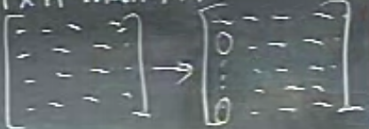
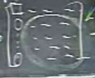

# Ders 4

Bu derste yapacaklarımız şunlar; bir $AB$ çarpımının tersini (inverse)
nasıl alırım? Biliyoruz ki 

$$ AA ^{-1}  = I = A ^{-1} A $$

Soru şu ki 

$$ AB... = I $$

noktalı kısma ne gelirse sonuç birim (identity) matris olur? Sonra bu
bilgiyi bir başka çarpım üzerinde kullanacağız, bu çarpım eliminasyon
matrislerini bir sıra çarpım olarak görecek, ve bu şekilde Gaussian
eliminasyon işlemine değişik bir bakış getirmiş olacağız. 

$AB$'den birim matrise nasıl erişirim? 

$$ ABB ^{-1} A ^{-1} = I $$

Ya da

$$ B ^{-1}A ^{-1} AB  = I$$

Şimdi tersini alma işleminin devriğini alma ile nasıl işleyeceğine
bakalım. Diyelim ki 

$$ AA ^{-1} = I $$

Bunun tersini alırsam ne olur ?

$$ (A ^{-1})^T A^T = I $$

Devrik alınca sıralama değişiyor bildiğimiz gibi, ve birim matrisin devriği
yine kendisi. 

Fakat üstteki ifade bir şeyi daha söylüyor: $A^T$'yi ne çarparsa sonuç $I$
gelir? Cevap $A^T$'nin tersi! Yani $(A ^{-1})^T$ ve  $(A^T) ^{-1}$
ifadelerinin aynı şey olduğunu söylemiş oluyoruz. Bu nasıl kullanılabilir?
Eğer $A^T$'nin tersini hesaplamamız gerekiyorsa, ve $A$'nin tersini bir
şekilde biliyorsam, onun devriğini almam yeterli. Diğer bir deyişle,
tersini alma ve devriğini alma işlemleri herhangi bir sırada yapılabilir. 

Eliminasyona gelelim.

Onlar bir matrisi anlamanın doğru yoludur denebilir. $A = LU$
faktorizasyonu bir matrisi en temel parçalarına ayırır. Diyelim ki $A$'dan
başlıyorum, hiç satır değiş tokuşu yapmadan sadece eliminasyon yaparak
ilerliyorum, ve $U$'ya erişiyorum, pivotlarımın hiçbir sıfır değil. Bu iki
matris arasındaki bağlantı nedir? $A$ ile $U$ nasıl alakalı? Şimdi
göreceğimiz üzere aradaki bağlantı $L$. 

Ornek

$$ \stackrel{A}{
\left[\begin{array}{rr}
2 & 1 \\ 8 & 7
\end{array}\right]
}
$$

$U$'ya yani bir üst üçgenel matrise (upper triangular matrix) erişmek
istiyorum, 1. satırın 4 katını 2. satırdan çıkartırım. Bu işleme 2'den 
1 çıktığını sembolize etmek için $E_{21}$ adını verelim, 

$$ 
\stackrel{E_{21}}{
\left[\begin{array}{rr}
1 & 0 \\ -4 & 1
\end{array}\right]
}
\stackrel{A}{
\left[\begin{array}{rr}
2 & 1 \\ 8 & 7
\end{array}\right]
}
=
\stackrel{U}{
\left[\begin{array}{rr}
2 & 1 \\ 0 & 3
\end{array}\right]
}
$$

O zaman şunu yazarsak, 

$$ 
\stackrel{A}{
\left[\begin{array}{rr}
2 & 1 \\ 8 & 7
\end{array}\right]
}
=
\stackrel{L}{
\left[\begin{array}{rr}
 &  \\  & 
\end{array}\right]
}
\stackrel{U}{
\left[\begin{array}{rr}
2 & 1 \\ 0 & 3
\end{array}\right]
}
$$

$L$ diyen yere ne gelmeli? Basit, $E_{21}$'nin tersi gelmeli. $E_{21}A =
U$'yu $A=LU $ yapmak için her iki tarafı soldan $E_{21}$'nin tersi ile
çarparım, eşitliğin solunda $E_{21}$ yokolur, sağına tersi gelir, yani
bana $E_{21}$'nin tersi gerekli.

Hatırlarsak, eliminasyon matrislerinin tersini almak kolaydır,

$$ 
\stackrel{A}{
\left[\begin{array}{rr}
2 & 1 \\ 8 & 7
\end{array}\right]
}
=
\stackrel{L}{
\left[\begin{array}{rr}
1 & 0 \\ 4 & 1
\end{array}\right]
}
\stackrel{U}{
\left[\begin{array}{rr}
2 & 1 \\ 0 & 3
\end{array}\right]
}
$$

$L$ alt üçgensel (*l*ower triangular) demek, $U$'nun köşegeninde
pivotlar var, sol alt kısmında sıfırlar var. Eşitliğin sağındaki $L$ içinden
pivotları çıkartmak mümkün, mesela 2'yı ve 3'u çekip çıkartırsak, 

$$ 
= \left[\begin{array}{rr}
1 & 0 \\ 4 & 1
\end{array}\right]
\left[\begin{array}{rr}
2 & 0 \\ 0 & 3
\end{array}\right]
\left[\begin{array}{rr}
1 & 1/2 \\ 0 & 1
\end{array}\right]
$$

Bu sonuca $LDU$ denebilir, Matlab her iki sonucu da üretebilmektedir. 

Eğer 3 boyutta olsaydık ne yapardık? Önce $E_{21}$, sonra $E_{31}$,
vs. Hepsi bir arada

$$ E_{32}E_{31}E_{21} A = U$$

Diyelim ki tüm bu eliminasyon $E$ matrislerini eşitliğin sağında
istiyorum. Yani

$$ A = ....U $$

noktalara ne gelecek? 

$$ A = E_{21} ^{-1}  E_{31} ^{-1}  E_{32} ^{-1}  U$$

ve bu terslerin tamamına $L$ diyebiliriz. İlginç bir şey, terslerin
çarpımı ile çalışmak, eliminasyon matrislerinin çarpımıyla çalışmaktan daha
kolay. Niye?

Örnek

$$ 
\stackrel{E_{32}}{
\left[\begin{array}{rrr}
1 & 0 & 0 \\
0 & 1 & 0 \\
0 & -5 & 1
\end{array}\right] }
\stackrel{{E_{21}}}{
\left[\begin{array}{rrr}
1 & 0 & 0 \\
-2 & 1 & 0 \\
0 & 0 & 1
\end{array}\right]}
$$

Bu çarpımı yaptığımızda sonucun ilk kısmını hemen görüyoruz, üstte
sıfırlar, köşegende 1'ler var.

$$ = 
\left[\begin{array}{rrr}
1 & 0 & 0 \\
 & 1 & 0 \\
 &  & 1
\end{array}\right]
$$

Geri kalanlar? 

$$ = 
\left[\begin{array}{rrr}
1 & 0 & 0 \\
-2 & 1 & 0 \\
10 & -5 & 1
\end{array}\right]
$$

Fakat üstteki şu 10 rakamı beni rahatsız ediyor. 

Önce $E_{21}$'in tersiyle başlayalım, tersi matrisin aynısı, sadece eksiler
artı oluyor, sonra  $E_{32}$'nin tersi

$$ 
\left[\begin{array}{rrr}
1 & 0 & 0 \\
-2 & 1 & 0 \\
0 & 0 & 1
\end{array}\right]
\left[\begin{array}{rrr}
1 & 0 & 0 \\
0 & 1 & 0 \\
0 & -5 & 1
\end{array}\right]
=
\left[\begin{array}{rrr}
1 & 0 & 0 \\
2 & 1 & 0 \\
0 & 5 & 1
\end{array}\right] = L
$$

İşte bu sağdaki matris aradığımız $L$. 

$$ EA = U $$

$$ A = LU $$

Bakıyoruz ki $L$ matrisinde 10 gibi bir sayı yok. Bunun sebebi $L$'i
oluşturan çarpımların "doğru matrisler'' olması. Hiçbir satır değişimi
yok, o zaman çarpanlar direk $L$'e dahil oluyorlar. 

Şimdi şu soruyu soralım? Eliminasyon ne kadar pahalı bir işlemdir? İlk önce
sol kısmı sıfırlamak gerekir, pivot en üst sol köşedir, vs.

Eğer $n=100$ ve $n \times n$ bir sistemimiz olsa, kaç tane operasyon yapmamız
gerekir? Bu işlem bir  $n \times n$ matrisin bir diğer  $n \times n$ matris ile
çarpılmasını gerektirdiği için $100^2$ işlem lazım. Sonra geri kalan
bölgede benzer işlemi yaparım (altta hoca yuvarlak ile işaretledi)

bu işlemler yaklaşık $99^2$ tanedir. Toplam

$$ n^2 + (n-1)^2 + ... + 1^2 \approx \frac{ 1}{3} n^3 $$

Üstteki sonucu kabaca şöyle doğrulamak mümkündür, mesela Calculus'ta
$x^2$'nin entegralini alıyor olsaydık, sonuç $x^3/3$ çıkardı. Üstte ise 1
ile n arasındaki sayıların karesini "topluyoruz'' ve bu ayrıksal bir
işlem, ama zaten Calculus'ta entegraller, ayrıksal toplam işleminin
karşılığı değil midirler?

Bu $A$ üzerindeki işlemlerin yükü. Eliminasyon işlemleri yapılırken bir de
$A$'nin yanında tutulan ve aynı işlemlerin uygulandığı bir $b$ kolonu da
var, ayrıca bu kolonu sonra geriye denklemlere sokuyoruz
(backsubstitution). Onun getirdiği işlem yükü $n^2$.

Bu tartıştığımız lineer bir denklem sistemini çözmek için kullanılan en
temel algoritmadır. Çok önemli bir konu. 

Eğer satır değişimi olsaydı, ne olurdu? Pivot pozisyonunda sıfır değeri
varsa, satır değişimi yapmak şart. 

Satır değişimi permutasyon olduğu zaman da devreye girer. Mesela $3 \times
3$ bağlamında düşünürsek, hiçbir değişim yapmayan permutasyon matrisi birim
matristir, yani 

$$ 
\left[\begin{array}{rrr}
1 && \\
 & 1 & \\
 && 1
\end{array}\right]
$$

Eğer 1 ile 2'yi değiştirmek istesem? Bir tiyo: istediğim permutasyon,
değiştirici matrisi elde etmek için, istediğim değişimi birim
matrisi üzerinde gerçekleştiririm, ve bu matrisi hangi diğer matrisle
çarparsam gerekli satır değişimi onun üzerinde gerçekleşir. 

$$ P_{12} = 
\left[\begin{array}{rrr}
0 & 1 & 0\\
1 & 0 & 0 \\
0  & 0 & 1
\end{array}\right]
$$

$$ P_{13} = 
\left[\begin{array}{rrr}
0 & 0 & 1\\
0 & 1 & 0 \\
1  & 0 & 0
\end{array}\right]
$$

$$ P_{23} = 
\left[\begin{array}{rrr}
1 & 0 & 0\\
0 & 0 & 1 \\
0  & 1 & 0
\end{array}\right]
$$

Diğer bazı matrisler, 

$$  
\left[\begin{array}{rrr}
0 & 1 & 0\\
0 & 0 & 1 \\
1  & 1 & 0
\end{array}\right]
$$

$$     
\left[\begin{array}{rrr}
0 & 0 & 1\\
1 & 0 & 0 \\
0  & 1 & 0
\end{array}\right]
$$             
 
Toplam 6 tane. Eğer bu matrislerin ikisini birbiriyle çarpsam ne olur?
Sonuç yine üstteki liste içinde olmalıdır. Tersini alırsam, yine aynı
şekilde. Mesela $P_{12}$'nin tersi nedir? Hangi çarpım bu matrisi birim
matrisi yapar sorusunu soralım, ama zaten bu matrisi birim matrisi üzerinde
değişim ile elde etmemiş miydik? O zaman aynı değişimi bir daha yaparsak
birim matrisi elde ederiz, yani $P_{12}$'nin tersi kendisidir. 

Permutasyon matrisleri hakkında bir gerçek daha, tersi işlemi devrik işlemi
ile aynıdır, yani $P^{-1} = P^{T}$. 

$4 \times 4$ için 24 tane permutasyon var, vs.

