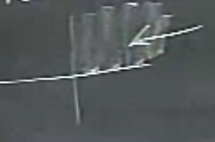
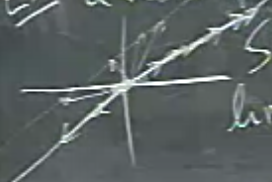
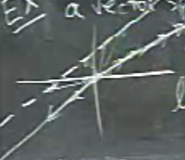
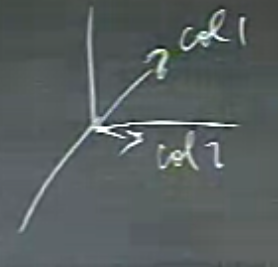
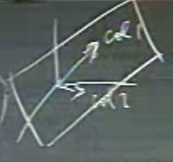

# Ders 5

Permutasyonlar

Bu derste bir anlamda lineer cebirin ruhunu görmeye başlayacağız, sadece
vektörler değil artık vektör uzaylarına bakmaya başlayacağız, yani daha
büyük resme odaklanacağız. Ayrıca herhangi bir uzayın alt-uzaylarını
(subspace) inceleyeceğiz. 

Permutasyonları hatırlayalım: permutasyon matrisi $P$ bir diğer matrisin
satırlarını değiş-tokuş etmek için kullanılıyordu. Bu işleme ihtiyacımız
olabilir, çünkü, elimizde $Ax=b$ çözerken belki de (neredeyse) mükemmel bir
$A$ olsa da bazen mesela tek bir yerdeki sıfır işi bozuyor olabilir, onu
yerinden oynatırsam, düzgün bir pivot elde edersem çözüm olacaktır, işte o
zaman permutasyon kullanabilirim.

Peki $A=LU$'nun bir sistemi çözerken gerekebilecek permutasyonlar ile
alakası nedir?

$A=LU$'nin ne olduğunu hatırlayalım, 


Bu resme bakarsa, bu tür gösterilen bir $LU$ tarifi $P$'nin olmadığını
farz ediyor, yani hiç satır değiş-tokuşuna gerek olmadığı farz
ediliyor. Peki eğer satır değiş tokuşu gerekseydi, bu durumu cebirsel
olarak nasıl gösterirdim?

Aslında üstteki tanımda da $P$ "var'', ya da olduğunu düşünebiliriz, ama
$P$ bu durumda birim matrisidir. 

Şimdi bir dakika durup mesela Matlab [artık Python] lineer cebir
kütüphanelerinin çözümü nasıl yaptığını düşünelim. Bu kütüphaneler pivot'in
sıfır olup olmadığına bakarlar, ki herhangi bir insan da bunu yapar, ayrıca
pivot'in "yeterince büyük olup olmadığına da'' bakılır, çünkü sıfıra
yakın, çok küçük pivotlar sayısal hesap bağlamında kötüdür. Bu durumda
kütüphaneye "çöz'' dediğimizde kodun arka planda satır değiş-tokuşları
yaptığını görürürüz, bu değişimler pür matematiksel olarak gerekli
olmayabilirler, ama hesap / sayısal açıdan gereklidirler. 

Neyse, ya sayısal sebepten, ya da başka bir sebepten dolayı satır değiş
tokuşu gerekebilir, o zaman nihai olarak satır değişimini içeren
eliminasyon şudur:

$$
PA = LU
$$

$P$ satır değiş-tokuşunu yapan matristir. $P$, $A$'yi "ideal'' hale
getirir, sıfırlar pivot'ta olmaz, vs. 

Bu arada bir permutasyon matrisinin yapısını hatırlayalım, temelinde bir
permutasyon matrisi satırlarının yeri değiştirilmiş bir birim
matristir. Permutasyon matrisleri pek çok satır değişimi aynı anda
yapabilir, kaç türlü değişim kombinasyonu vardır? 

$$
n! = n(n-1)...(3)(2)(1)
$$

çünkü üstteki kadar değişik satır sıralaması mümkündür, ve tüm
permutasyonları böyle hesaplayabiliriz. 

Ayrıca $P$ tersi alınabilir (invertible) bir matristir, ve 

$$
P^{-1} = P^T
$$

ya da 

$$
P^TP = I
$$

Bu "güzel'' bir özellik, ve bu tür özelliklere sahip olan matrisler bizi
özellikle ilgilendiriyor.

Örnek

$$ 
\left[\begin{array}{cc}
1 & 3 \\
2 & 3 \\
4 & 1 
\end{array}\right]^T
$$

Basit bir devrik işlemi... Sonuç nedir?

$$ =
\left[\begin{array}{ccc}
1 & 2 & 4 \\
1 & 3 & 3 
\end{array}\right]
$$

Devrik işlemi, formülsel olarak 

$$
A_{ij}^T = A_{ji}
$$

Şimdi simetrik matrislerden bahsedelim, bunlar çok "sevdiğimiz''
matrislerden biri. Bu matrislerin güzel bir özelliği, devriği kendisine
eşit olması,

$$
A^T = A
$$

Mesela

$$ 
\left[\begin{array}{ccc}
3 & 1 & 7 \\
1 & 2 & 9 \\
7 & 9 & 4
\end{array}\right]
$$

Bu tür bir matrisi ne zaman elde ederiz? İki üstteki matris mesela
$3 \times 2$ boyutunda zaten, simetrik olması zaten mümkün değil, çünkü devrik
işlemi boyut değişikliğine sebep oluyor. Fakat dikdörtgensel olsa bile
(çünkü kare şeklinde değil, yani boyutları farklı) bir matristen acaba bir
işlem uyguluyarak simetrik bir matris elde edemez miyim? Fikir: iki üstteki
matrise $R$ diyelim, $R^TR$ ile simetrik bir matris elde edebilirim. Bu
hakikaten mümkün, hatta kural olarak alabiliriz, $R^TR$ her zaman simetrik
matris verir. Örnekte görelim, 

$$ 
\left[\begin{array}{cc}
1 & 3 \\
2 & 3 \\
4 & 1 
\end{array}\right]^T
\left[\begin{array}{ccc}
1 & 2 & 4 \\
1 & 3 & 3 
\end{array}\right]
=
\left[\begin{array}{ccc}
10 & 11 & 7 \\
11 & .. & .. \\
7 & .. & ..
\end{array}\right]
$$  

Gerisi de aynı olacaktı. Sembolik olarak görelim, $R^TR$'in simetrik
olduğunu nasıl bulurum? Onun devriğini alabilirim, ve sonucun değişmemesini
kontrol edebilirim,

$$
(R^TR)^T = R^T(R^T)^T
$$

$(R^T)^T$ nedir? Bir matrisin iki kere devriğini alırsam tekrar kendisine dönmüş
olmaz mıyım? Evet. O zaman,

$$
R^T(R^T)^T = R^T R
$$

Baştaki hale döndük! Demek ki $R^TR$ bir simetrik matristir. İspat
tamamlandı. 

Vektör Uzayları

Vektörlerle ne işlemleri yaptığımızı düşünelim. Onları topluyoruz mesela,
ya da onları bir skalar (yani tek sayı) ile çarpıyoruz... Bir uzayın vektör
uzayı olarak kabul edilmesi için bu tür işlemlerin "aile içinde''
kalabilmesi gerekir, yani toplam, çarpım işlemlerinin sonuçları da uzay
içinde yer almalı. 

Örnek

İçinde tüm 2 boyutlu vektörleri içeren $\mathbb{R}^2$. Sembol $\mathbb{R}$'i
görünce reel sayılar anlıyoruz, yani reel sayılar ama onun iki boyutlu hali.

$$ 
\left[\begin{array}{c}
3 \\ 2 
\end{array}\right], 
\left[\begin{array}{c}
0 \\ 0
\end{array}\right], 
\left[\begin{array}{c}
\pi \\ e
\end{array}\right], 
..
$$

Diğer yönden şöyle görebiliriz, $\mathbb{R}^2$ tüm $x-y$ düzlemidir. Ve bu
düzlem bu uzay bir vektör uzayıdır. Niye? Çünkü ihtiyacımız olan tüm noktalar
oradadır, orijin bile, oradadır ve ona ihtiyaç vardır. Farz edelim orijin
noktasını bu uzaydan çıkardım, yani $x-y$ düzleminin sanki ortasına bir delik
açtım. Fakat vektör uzayı tanımına göre herhangi bir vektörü istediğim bir
skalar ile çarpabilmeliyim, sıfırla da çarpabilmeliyim ve sonuç bu durumda
orijin olacaktır, ama orijin uzayda yoksa erişebileceğim her türlü sonucu
içermediği için bu bir vektör uzayı olamaz. Ya da
$\left[\begin{array}{cc} 3&2 \end{array}\right]^T$ vektörüne
$\left[\begin{array}{cc} -3&-2 \end{array}\right]^T$ ekleyebilmeliyim, ve sonuç
yine orijin olacak, ama yoksa problem çıkar.

Eğer $\mathbb{R}^3$ kullansaydık, bu içinde tüm 3 boyutlu reel vektörleri
içeren uzay olurdu. 

Ya $\mathbb{R}^n$? İçinde $n$ tane reel sayı olan, $n \times 1$ boyutunda
kolon vektörleri. 

Başka bir örnek görelim, mesela alttaki durum. Burada sadece $x-y$
düzleminin sağ üst tarafındaki (altta işaretli) alanı bir uzay olarak almak
istedik. 



Soru şu: bu bir uzay mıdır? Yani içindeki vektörlerin tüm lineer
kombinasyonun yine kendisi içinde midir? 

Eğer oradaki bir vektörü, mesela $\left[\begin{array}{cc} 3 & 2 \end{array}\right]^T$ 
alıp bir diğer vektörle toplarsam mesela $\left[\begin{array}{cc} 6 & 8 \end{array}\right]^T$ 
sonuç hala bu üst sağ köşede olur. Problem bir skalar ile çarptığımızda ortaya çıkar; eğer
$\left[\begin{array}{cc} 3 & 2 \end{array}\right]^T$ alıp $-3$ ile çarparsam, 
sonuç eksi yöne işaret eden bir vektör olur, o zaman sağ üst köşenin dışına
taşmış olurum. Yani tanımladığım alan çarpma işlemi için "kapalı''
(closed) değildir. O zaman bu bir vektör uzayı değildir. 

Üstteki örnekte mevcut bir vektör uzayının bir kısmını aldık, ve vektör
uzayı olmadığını gördük. Peki tüm alt uzaylar (subspace) bu şekilde vektör
uzayı değil midir? $\mathbb{R}^2$'ye dönelim, onun bir alt uzayına
bakalım. 



Eğer orijinden geçen ve yukarı aşağı sonsuza giden çapraz bir çizgi çizsem,
bu çizgi bir vektör uzayı olan alt uzay olur muydu? Evet. Niye? Çünkü onun
üzerindeki herhangi iki vektörü birbirine toplasam yine aynı çizgi üzerine
olurum [hoca bunu göstermek için bir sürü oklar çizdi aynı çizgi
üzerinde]. Eğer sağ yukarı giden bir vektörü negatif bir skalar ile çarpsam
ters yöne giderim ama problem değil, bu yön de mevcut. Unutmayalım, tek
sayı ile çarpınca yönü değiştirebiliriz, ama 180 derece terse gidebiliriz
sadece, azıcık daha yukarı ya da aşağı gidemeyiz. Demek ki hep aynı çizgi
üzerindeyiz. 

Tabii eklemeye gerek yok, orijin muhakkak uzayın içinde olmalı, yoksa sıfır
ile çarpınca orijin sonucu gelir, ama o nokta uzayda değilse yine "dışarı
taşmış'' olurum. Mesela 



öncekine paralel [kesik çizgiyle gösteriliyor] yeni bir çizgi çizdim
mesela. Bu çizgi bir vektör uzayı değildir, çünkü sıfırla çarpınca orijin
sonucu çıkar, bu nokta o kesikli olan uzayda yoktur.

Bu arada $\mathbb{R}^2$'de iken kendimize şu soruyu soralım; kaç tane
farklı alt uzay mümkündür? 

1) $\mathbb{R}^2$'nin kendisi (o da bir alt-uzay)

2) Orijinden geçen her çizgi. Dikkat, bir çizgiden bahsedince ve bu çizgi
tek yönde olunca, akla "acaba bu çizgi $\mathbb{R}^1$ mi?'' sorusu
gelebilir. Bu alt uzay $\mathbb{R}^1$ değil, $\mathbb{R}^1$ olsaydı içinde
iki değil tek sayı olan bir "vektörden'' bahsediyor olurduk. 

3) İçinde sadece sıfır vektör olan bir uzay - ki ben buna çoğu zaman
$\mathbb{Z}$ diyorum. Bu mantıklı değil mi? Sıfır vektörü alıyorum,
kendisiyle topluyorum, aynı uzaydayım. Herhangi bir skalar ile çarpıyorum,
mesela $17$, sıfır çarpı herhangi bir başka şey sıfır olduğuna göre, yine
aynı uzaydayım! Öyle değil mi?

$$
\left[\begin{array}{cc} 0 & 0 \end{array}\right]^T \cdot 17 =
\left[\begin{array}{cc} 0 & 0 \end{array}\right]^T
$$

Peki $\mathbb{R}^3$'un kaç alt uzayı vardır? Yine $\mathbb{R}^3$'un
kendisi, orijin noktası, ve orijinden geçen tüm düzlemler (planes). Ya da
orijinden geçen tüm çizgiler. 

Matrislerin Alt Uzayı

Üstteki örnek alt uzaylar $\mathbb{R}^2$, $\mathbb{R}^3$ 'ten
geldiler. Acaba bir matristen bir alt uzay yaramaz mıyız? Mesela 

$$
A =
\left[\begin{array}{cc}
1 & 3 \\
2 & 3 \\
4 & 1 
\end{array}\right]
$$

matrisinin alt uzayı nedir? 

$A$'nin kolonlarına bakıyorum, bu kolonlar $\mathbb{R}^3$ içindeler. Ve bir
alt uzay yaratıyorum, o zaman bu kolonların o alt uzay içinde olmasını
isterim. Fakat bir alt uzaya iki tane kolon atıp "işte bu bir alt uzay''
diyemem. Oraya başka ne koymam lazım? Bu iki kolonun her türlü lineer
kombinasyonu orada olmalı, mesela $\left[\begin{array}{ccc} 4 & 5 & 5\end{array}\right]^T$ 
orada olmalı o zaman, ya da sıfırla çarpacağım, $\mathbb{Z}^3$ orada olmalı, vs. Ya da ilk 
kolondan bir tane, ikincisinden üç tane alıp toplayacağım, bu sonucun da uzay
olması gerekir. Eğer tüm bunları yaparsam bir alt uzay yaratmış olurum, ki
matris bağlamında bu uzaya "kolon uzayı (columnspace)'' ismi de verilir. Buna
$C(A)$ diyelim.

Bu aradığımız uzay nasıl bir şey olur acaba? İki vektör var, onların tüm
kombinasyonları aynı uzay içinde kalacak, ve orijin dahil
olacak.. Geometrik olarak düşünelim,



iki vektörü böyle çizdik diyelim. Bu her iki vektörü içinde barındıran, ve
her türlü kombinasyonunu da içeren şey nedir? Bu şey her ne ise, herhalde
bir çizgi olamaz, çünkü basit bir kaç örnekle tamamen farklı yönlere işaret
eden kombinasyonlar bulabiliriz, ayrıca bu her iki vektörü üzerinde tutan
bir çizgi zaten mümkün değil. O zaman ne? 

Bir düzlem! Her iki vektörü de üzerinde barındıran ve orijinden geçen
düzlem bir alt uzaydır.



Değil mi? Bu iki vektörün her türlü kombinasyonu bu düzlem üzerindedir. Bu
kritik bir bulgu - üzerinde iyice düşünelim. Görelim. Tabii 3 boyutta
görebiliriz, ama $\mathbb{R}^{10}$ boyutunda da iş yapacağız, ve bu uzayda
diyelim 5 tane vektörün kombinasyonunu alıyoruz, ki bu bir alt uzay
yaratır, [hoca neredeyse $\mathbb{R}^5$'i görsel olarak tarif etmek ister
gibi yaptı, ama bu uzayı görsel olarak düşünmek mümkün değil, bilemeyiz
dedi], 5 vektör ki her birinin 10 tane öğesi var, bunların kombinasyonunu
alıyoruz, sonuç olarak, dikkat, $\mathbb{R}^5$'te değiliz çünkü elimizde 10
öğeli vektörler var. Büyük ihtimalle bu kombinasyon bir düzlemde olacak,
ama.. yani eğer vektörler o şekilde ise bir çizgi de ortaya
çıkabilir. Anlatabiliyor muyum? Her şey o 5 vektörün ne olduğuna bağlı. 

Aynı şekilde, bir önceki örnekte, eğer iki vektör bir çizgi üzerinde
olsaydı, onların kolon uzayı o çizgi olurdu (ama örnekte alt uzay bir
düzlem haline geldi). 

Bu noktada duralım; bir sonraki derste $Ax=b$'yi biraz önce belirttiğim dil
ile nasıl görürüm, ona bakacağız. Bu dilde kolon uzayları, vektör uzayları
var, bunlar $Ax=b$ ile nasıl bağlantılı. Başka ne tür uzaylar vardır? İki
tanesini gördük, başka türleri de var. 

Ekler

Eksi Bakışımlı (Skew Symmetric) Matrisler

Tanım

Bir matris $A$'ya eksi bakışımlı denir sadece ve sadece $A = -A^T$ ise [1,  sf. 59].
Öğe bazında bu $a_{ij} = -a_{ji}$ anlamına gelir ve bunun doğal bir sonucu
olarak köşegen değerleri tamamen sıfır olmalıdır, çünkü sadece o zaman
$a_{ii} = -a_{ii}$ olabilir. Devriği alınca köşegen aynı kalır, eksisi kendisi
ile aynı olan tek şey sıfırdır.

Teori

$A$ bir kare matris olsun. $A + A^T$ simetriktir.

İspat

Eğer ifade simetrik ise $A + A^T$'nin devriği ona eşit olmalı. Bu devriği alalım,

$$
(A + A^T)^T = A^T = (A^T)^T
$$

$$
= A^T = A
$$

$$
= A + A^T
$$

Hakikaten eşit. 

Teori

$A - A^T$ işlemi bir eksi bakışımlı matrisi ortaya çıkartır.

İspat

Önce $A - A^T$'nin devriğini alalım, sonra eksi işaretli halini elde
edip etmediğimizi görelim,

$$
(A-A^T)^T = A^T - (A^T)^T
$$

$$
= A^T - A
$$

$$
= -A + A^T
$$

$$
= - (A-A^T)
$$

Teori

Her kare matris bir simetrik ve bir eksi bakışımlı matrisın toplamı olarak
ayrıştırılabilir / temsil edilebilir, ve bu ayrıştırma özgündür (mümkün sadece
bir tane vardır).

Ispat

Cebirsel olarak

$$
A = \frac{1}{2} (A + A^T) + \frac{1}{2} (A - A^T)
$$

ifadesi doğal olarak doğrudur, kontrol etmek için sağda iki $A^T$'nin iptal
olduğunu, iki $1/2 A$ toplanınca $A$ olduğunu görebiliriz. Ayrıca önceki
teorilere göre eşitliğin sağında birinci terimin simetrik, ikinci terimin eksi
bakışımlı olacağını biliyoruz. Yani bu ayrıştırma doğru. Ayrıca ama şimdiden
söyleyelim, üstteki ayrıştırma $A$'yi simetrik/eksi bakışımlı bazında
ayrıştırmanın tek yoludur.

Devam edelim, diyelim ki $A$'yı ayrıştırmanın başka bir yolu daha var, ilk yolda
birinci terim $P$ ikinci $Q$ ise bu alternatif yolda $R$ ve $S$. Yani

$$
A = R + S
$$

de doğru olacak. Her iki tarafın devriğini alalım, bakalım nereye götürecek
bu bizi,

$$
A^T = R^T + S^T
$$

$R$ simetrik $S$ ekşi bakışımlı farz ettik, o zaman

$$
A^T = R^T + S^T = R - S
$$

Değil mi? $R$'nin devriği kendisi ile aynı olmalı, $S$'nin devriği ise
kendisini eksi hali.

Bu $A^T$ ve $A$ değerlerini $P$ içinde kullanalım,

$$
P = \frac{1}{2} (A + A^T) = \frac{1}{2} (R + S) + \frac{1}{2} (R - S)
$$

$$
P = R
$$

Demek ki $P$ ve $R$ eşitmiş.

$Q$ için

$$
Q = \frac{1}{2} (A-A^T) = \frac{1}{2} (R+S) - (R-S) 
$$

$$
Q = S
$$

$Q$ ile $S$ de eşitmiş. O zaman bir kare $A$ matrisini ayrıştırmanın tek bir
yolu var, bu ayrıştırma özgün.

Çapraz Çarpım ve Eksi Bakışımlı Matrisler

Çapraz çarpım [3]'den bildiğimiz gibi iki vektörün tanımladığı düzleme dik bir
üçüncü vektör verir, ve üç boyutta hesaplaması alttaki gibidir,

$$ 
u \times v = 
\left[\begin{array}{c}
u_2v_3 - u_3v_2 \\
u_3v_1 - u_1v_3 \\
u_1v_2 - u_2v_1 
\end{array}\right]
$$

Fakat üstteki çarpıma başka bir yoldan da erisebiliriz, bu çarpımı eksi
bakışımlı bir matris üzerinden noktasal çarpıma çevirmek mümkündür. Bu
dönüştürme, mesela $u = [u_1, u_2, u_3]$ için

$$
\tilde u =
\left[\begin{array}{ccc}
0 & -u_3 & a_2 \\
u_3 & 0 & -u_1 \\
-u_2 & u_1 & 0
\end{array}\right]
$$

Böylece $u \times v$ yerine $\tilde u v$ ifadesi yeterli oluyor.

Bir örnek üzerinde görelim, bir vektörden üstteki eksi bakışımlı versiyonu
oluşturmak için `skew` diye bir kod yazalım,

```python
import numpy.linalg as lin
  
def skew(a):
   return np.array([[0,-a[2],a[1]],[a[2],0,-a[0]],[-a[1],a[0],0]])

u = np.array([1,2,3])
v = np.array([3,4,5])

print (skew(u))
print ('\n')
print ('carpim 1', np.cross(u,v))
print ('carpim 2', np.dot(skew(u), v))
```

```
[[ 0 -3  2]
 [ 3  0 -1]
 [-2  1  0]]


carpim 1 [-2  4 -2]
carpim 2 [-2  4 -2]
```

İki çarpım aynı.


Kaynaklar

[1] Hecker, *Elementary Linear Algebra*

[2] Quora, *Show that every square matrix can be expressed as the sum of hermitian and skew hermitian?*
    [https://www.quora.com/Show-that-every-square-matrix-can-be-expressed-as-the-sum-of-hermitian-and-skew-hermitian](https://www.quora.com/Show-that-every-square-matrix-can-be-expressed-as-the-sum-of-hermitian-and-skew-hermitian)

[3] Bayramlı, *Cok Boyutlu Calculus*


