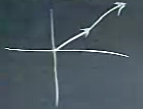
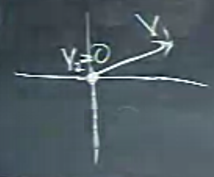
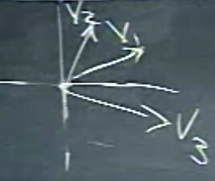
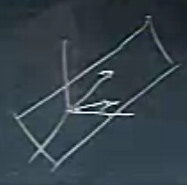

# Ders 9

Bu derste lineer bir vektörler kümesinin bağımsızlık, ya da bağımlılık
durumuna bakacağız. Bir vektör uzayı, ya da altuzay için baz (basis) nedir,
merkezi konumuz bu. Bir altuzayın boyutu ne anlama gelir? Bu kelimelere net
anlamlar yükleyeceğimiz kritik ders bu olacak. Odağımızın ne olduğuna
dikkat, bir matrisin değil bir vektör kümesinin bağımsızlığından, bir
vektör kümesinin bir uzayı kapsamasından (span) bahsediyor olacağız. 

Daha önce vurgulamadığım önemli bir bilgiyi hemen gündeme getirmek
istiyorum; diyelim ki elimde $m \times n$ boyutlarında $A$ matrisi var, ve
$Ax=0$ durumunu inceliyorum, ve $m < n$, yani $m$ tane formül var, ama
ondan daha fazla bilinmeyen var. 

Bu durumda $A$'nin sıfır uzayında birşeyler vardır (sıfır vektör haricinde
tabii). Niye? Sebebini biliyoruz, zaten kabaca düşününce formülden fazla
bilinmeyen olunca bazı çözümler olması normal. Daha detaylı olarak, daha
önce bu işin algoritmasını gördük, elimde kesin serbest değişkenler olacak,
ve bu değişkenlere istediğim değerleri atayacağım, sonra geriye koyma ile
bazı başka değerler bulacağım, vs. Yani sıfır olmayan sonuçlar elde
edebileceğim. 

Bu matris durumu idi. Şimdi bağımsızlık konusuna gelelim. 

Bağımsızlık

Vektör $x_1,x_2,..,x_n$ lineer olarak bağımsızdır (ileride lineer
kelimesini kullanmayacağım, direk bağımsız diyeceğim), eğer bu vektörlerin
hiçbir kombinasyonu, ki kombinasyon $c_1x_1+...+c_nx_n$ olarak
tanımlanabilir, sıfır sonucunu *vermiyor* ise. Burada sıfır
kombinasyonunu ayrı tutuyorum, yani $c_1=..c_n=0$ durumu), sıfır
kombinasyonu, yani her vektörün sıfır ile çarpıldığı durum üstteki tarife
dahil değil. Bu durum tatmin edilmiş ise, o zaman $x_1,..,x_n$
bağımsızdır. Eğer tek bir tane bile sıfır sonucunu verecek kombinasyon var
ise, o zaman bu vektörler bağımlıdır.

Örnek

Diyelim ki arka arkaya duran iki vektör var, biri diğerinin iki katı, ve
aynı yönü gösteriyorlar [hocanın çizimi tam olmadı ama aynı yöndeler
:)]. Bu vektörler bağımsız mıdır? Hayır. Çünkü sıfır elde etmek kolay,
$2v_1 - v_2 = 0$. Yani sıfır sonucunu elde edebilecek bir kombinasyon
mevcut. 

Peki alttaki durumda?

Ki $v_2$ sıfır vektör. Hangi $c_1,c_2$ için $c_1v_1+c_2v_2$ sıfır sonucunu
alırım? Eğer $c_1=0,c_2=6$ dersem sıfır sonucu gelir, tabii $c_1=0$
dedikten sonra $c_2$ ne seçersem seçeyim sıfır sonucu olurdu zaten. Yani
sıfır vektörü işin içine dahil ise, ortada bağımsızlık kalmaz, sıfır
sonucunu verecek ve kendisi sıfır olmayan bir kombinasyon muhakkak
bulunur. 

Ya alttaki durum? 

Gelişigüzel üç tane vektör çizdim. Cevap bağımlı, nereden biliyorum? Çünkü
üstte belirttiğim  $m < n$ durumu sayesinde. Bağlantı nerede? $A$'yi şöyle
yazarsam, 

$$ 
A = 
\left[\begin{array}{rrr}
\uparrow & \uparrow & \uparrow \\
v_1 & v_2 & v_3 \\
\downarrow & \downarrow & \downarrow 
\end{array}\right]
$$

ya da resme bakarak kabaca bazı büyüklükler yazarsam mesela, 

$$ 
A = 
\left[\begin{array}{rrr}
2 & 1 & 2.5 \\
1 & 2 & -1 \\
\end{array}\right]
$$

Bu matrisin boyutları $2 \times 3$. Elimizde bazı serbest değişkenler
olacak, ve 

$$ 
A = 
\left[\begin{array}{rrr}
2 & 1 & 2.5 \\
1 & 2 & -1 \\
\end{array}\right]
\left[\begin{array}{r}
c_1 \\ c_2 \\ c_3
\end{array}\right] = 0
$$

durumunda $c_1,c_2,c_3$ için bir çözüm olacak. $A$'nin kolonları bağımlı,
çünkü onları belli şekillerde kombine ederek sıfır sonucunu elde
edebiliyorum. 

Yani eğer $n$ boyutunda isem bağımsızlık sorusunu vektörleri matrisin
kolonlarına yerleştirerek direk cevaplandırabilirim. Vektörler bağımsızdır
eğer bu vektörlerin yerleştirildiği $A$'nin sıfır uzayında sadece sıfır
vektörü var ise. Eğer yani sıfır uzayında sıfır vektörü haricinde başka
vektörler var ise, o zaman vektörler bağımlıdır. 

Üsttekini kerteler üzerinden ifade edelim; eğer kerte $r = n$ ise
bağımsızlık vardır, çünkü tüm kolonlarda bir pivot olur. Bağımlılık
durumunda $r < n$, serbest değişkenler var, diğer durumda yok. 

Kapsamak (Span) 

Eğer bir uzay $v_1,...,v_n$ vektörlerinin tüm kombinasyonlarından oluşuyor
ise,  bu vektörlerin bu altuzayı kapsadığı söylenir.

Elimde birkaç vektör varsa, $S$ diye bir uzayı kapsadıklarını
söyleyebilirim, ki $S$ bu vektörlerin tüm kombinasyonlarını içerir, bu $S$
uzayı bu vektörleri içinde tutabilecek en ufak uzay olacaktır. Bu
vektörleri içeren başka uzaylar da olabilir, ki tanım itibariyle bu uzaylar
aynı şekilde, en azından, tüm kombinasyonları içermelidir (tabii daha
fazlasına da sahip olabilirler). Ama sadece tüm kombinasyonları içeren uzay
en minimal ve kapsanan uzaydır. 

Kolon uzayına gelelim: bir matrisin kolonlarını alıp tüm kombinasyonlarını
hesaplarsam kolon uzayını elde ederim. Bu kolonlar kolon uzayını
kapsarlar. 

Peki kolonlar bağımsız mıdır? Belki evet, belki hayır, bu kolonların ne
olduğuna bağlı. Bana en ilginç gelen durum bağımsız oldukları durum, çünkü
bu durumda tam kararında vektöre sahibim demektir. Daha fazlası bağımlılık
olur, daha azı, kolon uzayını oluşturamam. Tam kararında olduğu durum
eldeki vektörlerin bir baz oluşturduğu durumdur. İşte "baz'' kelimesi
burada devreye girdi. 

Tanım

Bir vektör uzayının bazı $v_1,...,v_d$ gibi bir vektör dizisidir, ki bu
dizinin iki özelliği vardır

1) Vektörler bağımsızdır

2) Vektörler tüm uzayı kapsarlar

Bir altuzayı tarif etmek için mesela bana onun bazını verirseniz, bu uzayı
tamamen tarif etmiş olursunuz. 

Ornek

Uzay $\mathbb{R}^3$ olsun. Bana bu uzay için bir baz verin. Bu bir vektör
listesi olacak, ve bu vektörler tam kararında olmalı. Bir baz şu olabilir, 

$$ 
\left[\begin{array}{r}
1 \\ 0 \\ 0 
\end{array}\right],
\left[\begin{array}{r}
0 \\ 1 \\ 0 
\end{array}\right],
\left[\begin{array}{r}
0 \\ 0 \\ 1 
\end{array}\right]
 $$

Tek baz değil, dikkat. Ama bu bir baz. Vektörler bağımsız mı? Evet. Yani,
nihayetinde üstteki vektörler $x,y,z$ eksenlerini temsil ediyorlar, ve bu
eksenler birbirinden bağımsız olmasa başımız dertte demektir :) Bağımsızlık
testi neydi, üstteki vektörler $c_1,c_2,c_3$ ile çarpıp toplasam ve sıfır
elde edersem, $c_1=0,c_2=0,c_3=0$ demektir, başka hiçbir kombinasyon bunu
başaramaz.  

Matris dilinde konuşmak istersek, üstteki vektörleri bir matrisin kolonları
yapabilirdim, ve bu matris tanıdığımız, bildiğimiz birim matrisi olurdu. O
zaman "birim matrisinin sıfır uzayı nedir?'' diye bir soru sorabilirdim,
cevap "sadece sıfır vektörü'' olurdu. Bunu duyunca ben de "tamam, o zaman
kolonlar birbirinden bağımsız'' derdim. 

Başka bir baz bulabilir miyim? Diyelim ki [hoca kafadan atarak iki vektör
yazıyor, ama herhalde zihninin bir köşesinde bu vektörlerin birbirinin katı
olmamasına dikkat ediyordur],

$$ 
\left[\begin{array}{r}
1 \\ 1 \\ 2 
\end{array}\right],
\left[\begin{array}{r}
2 \\ 2 \\ 5 
\end{array}\right]
 $$

Tahminimiz "hayır'' değil mi? Herhalde hafiften seziyoruz ki
$\mathbb{R}^3$'te bazı vektörler vardır ki üstteki iki vektörün kombinasyonu
olarak temsil edilemezler. O zaman bir vektör daha eklemek lazım, çünkü
üstteki iki vektör $\mathbb{R}^3$'u kapsamıyor. Hangi vektörü eklemeliyim?
Eğer $\left[\begin{array}{rrr}3&3&7\end{array}\right]^T$ eklersem bu kötü
bir seçim olurdu, çünkü bu vektör üstteki iki vektörün toplamıdır, yani bu
yeni vektör *bağımlı* olur, diğer iki vektör ile aynı düzlemde olur. 

O zaman hangi vektörü seçmeliyim? Üstte tarif ettiğim düzlemde olmayan
herhangi bir vektörü seçebilirim. Bir tane seçiyorum; hepsi bir arada

$$ 
\left[\begin{array}{r}
1 \\ 1 \\ 2 
\end{array}\right],
\left[\begin{array}{r}
2 \\ 2 \\ 5 
\end{array}\right],
\left[\begin{array}{r}
3 \\ 4 \\ 8
\end{array}\right]
 $$

Galiba bu oldu, en azından 3. vektör diğer ikisinin toplamı değil [hoca
burada bir hata yapmıştı, bir sonraki derste düzeltti, buraya düzeltilmiş
hali koyduk]. Peki bu vektörlerin baz olup olmadığının kesin testi nedir?
Onları bir matrisin kolonlarına koyarsınız, eliminasyon uygularsınız,
serbest değişken ortaya çıkıyor mu bakarsınız, ya da tüm kolonlar pivot
kolonları mıdır, ona bakarsınız. Gerçi elimizde bir kare matris olur, o
zaman en basit kontrol matrisin tersi alınabilir olup olmadığı.

Şimdi iki vektör durumuna dönelim,

$$ 
\left[\begin{array}{r}
1 \\ 1 \\ 2 
\end{array}\right],
\left[\begin{array}{r}
2 \\ 2 \\ 5 
\end{array}\right]
 $$

Bu iki vektör herhangi bir uzay için baz oluşturur mu? 

Tabii ki, bu mümkün olabilir. Bu iki vektör bağımsız. Kabaca çizersem onları,

Bu iki vektörün tüm kombinasyonları bir düzlemi kapsayabilir, bu uzay
$\mathbb{R}^3$'un tamamı olmayabilir, ama üstte görüldüğü gibi onun
içindeki bir düzlem olabilir [belki çizimden anlaşılmıyor, iki vektör
düzlemin tam üzerinde, yani içinde]. 

Kötü seçim olan $\left[\begin{array}{rrr}3&3&7\end{array}\right]^T$'i
eklersem, bu üç vektör yine üstteki düzlemi kapsar, ama o zaman eldeki
vektörler bir baz olmaz, çünkü ilk iki vektörü kullanarak 3. vektörü
oluşturabilirim. 

Neler öğrendik? Baz özgün (unique) değil. Aynı uzayı tarif eden pek çok baz
olabilir. Fakat bu bazların bir ortak noktası var. Herhalde ne
söyleyeceğimi hafiften tahmin ediyorsunuz, zaten üstte 3 vektörden 2
vektöre geri dönünce bu iki vektörün bir baz olmayacağını
hissetmiştiniz. Niye? Çünkü sayıları yeterli değil. 3 boyutlu bir uzay olan
$\mathbb{R}^3$'i kapsamak için 3 tane vektör gerekir. Eğer uzay
$\mathbb{R}^n$ olsaydı baz için gerekli vektör sayısı $n$ olurdu. 

Kural 

Verilen bir uzay için, ki bu kolon uzayı, bir sıfır uzayı, vs. bile
olabilir, bu uzay için bulunacak her baz içinde aynı sayıda vektör
olmalıdır. 

$S_1$ uzayının bir bazında 6 vektör var ise, bir diğeri içinde de 6 vektör
olmalıdır. Bu 6 sayısı bana bu uzayın ne kadar büyük olduğunu da söylüyor
bir bakıma. Ve tabii kontrol için de bu iyi, başka bir yönden 7 tane vektör
bulmuşsam 1 tane fazla bulmuşum, 5 tane ise bir tane eksik. 

Bu sayı nedir? Bugünün son tanımına geldik böylece, bu sayı o uzayın
*boyutudur*. 

Örnek

Uzay $C(A)$, yani $A$'nin kolon uzayı. $A$ şöyle,

$$ 
\left[\begin{array}{rrrr}
1 & 2 & 3 & 1 \\
1 & 1 & 2 & 1 \\
1 & 2 & 3 & 1
\end{array}\right]
 $$

Üstteki matrisin kolonları $A$'nin kolon uzayını kapsar mı? Evet, çünkü
zaten kolon uzayının tanımı budur. Peki üstteki kolonlar bir baz oluşturur
mu? Bu kolonlar bağımsız mı? Hayır. Sıfır uzayında sıfır olmayan vektörler
olacak. Mesela? Kolonlara bakıyorum, 3. kolon 1. ve 2. kolonun toplamı, o
zaman 

$$ 
\left[\begin{array}{r}
-1 \\ -1 \\ 1 \\ 0
\end{array}\right]
 $$

vektörü sıfır sonucunu verir. Yani bağımsızlık yok, baz üstteki 4 vektör
değil. Peki hangi vektörler üstteki matrisin kolon uzayı için bir baz?
Ödevlerde, sınavlarda bu soru olarak çıkacak, "vs. matrisinin kolon uzayının
bazını bul''. Tabii ki pek çok farklı cevap olabilir, en doğal olan cevap
nedir? 

Doğal cevap pivotların olduğu kolonlardır. Eğer bu matris üzerinde
eliminasyon yapsam iki tane pivot çıkartabilirdim sadece. Pivot sayısı aynı
zamanda matrisin kertesidir. Eğer pivotlar bir baz oluşturuyorsa o zaman
şunu da söyleyebilirim, pivot sayısı $A$'nin kolon uzayının boyutudur. 

Dilin kullanımına dikkat: $A$'nin boyutu demiyorum, ya da $A$'nin sıfır
uzayının boyutu demiyorum, $A$'nin kolon uzayının boyutu diyorum. Aynı
şekilde, bir altuzayın kertesinden bahsetmiyorum, bu yanlış olurdu, $A$'nin
kertesinden bahsediyorum. $A$'nin kertesi aynı zamanda kolon uzayının
boyutu ile aynı. Terimleri doğru yerlerde kullanmak lazım. 

Peki üstteki matrisin kolon uzayının başka bir bazı ne olabilir? Eh, 1. ve
2. kolonları almıştık önce, niye 1. ve 3. kolonlar olmasın? Ya da 2. ve 3,
ya da 2. ve 4.. Matrisin kolonları dışında bir baz da olabilir bu
arada. Mesela, 

$$ 
\left[\begin{array}{r}
2 \\ 2 \\ 2 
\end{array}\right],
\left[\begin{array}{r}
7 \\ 5 \\ 7 
\end{array}\right]
 $$

1. vektörün nereden geldiği bariz, 2. vektör $A$'nin tüm kolonlarının
toplamı. Vektörler bağımsız, ve sayı doğru, iki tane vektör. 

Sıfır uzayına gelelim: $A$'nin sıfır uzayının boyutu nedir? Mesela biraz
önce bulduğumuz vektör

$$ 
\left[\begin{array}{r}
-1 \\ -1 \\ 1 \\ 0
\end{array}\right]
 $$

bu uzayı kapsamak için yeterli mi? Hayır. En azından bir tane daha vektöre
ihtiyacım var. Üstteki vektörün son iki hücresini serbest değişken denemesi
olarak kabul edersem, değişik serbest değişkenlere göre ilk iki hücre için
farklı değerler hesaplayabilirim,

$$ 
\left[\begin{array}{r}
-1 \\ -1 \\ 1 \\ 0
\end{array}\right],
\left[\begin{array}{r}
-1 \\ 0 \\ 0 \\ 1
\end{array}\right]
 $$

Üstteki vektörler aynı zamanda iki özel çözüm değil mi? Çünkü farklı
serbest değişken atamalarıyla onları elde ettim bir bakıma. Peki bu iki
vektör sıfır uzayı için bir baz oluşturur mu? Evet. İspatını vermiyoruz ama
cevap evet. Sıfır uzayının boyutu 2. Sıfır uzayının boyutu aynı zamanda
serbest değişken sayısına eşit. Ya da $n-r$'ye eşit. 

