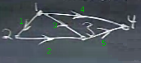
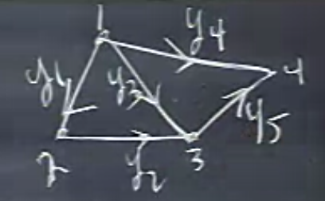
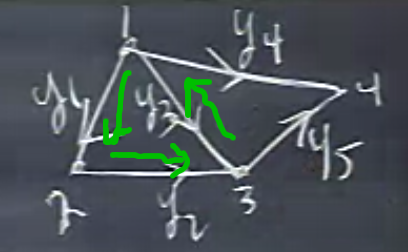
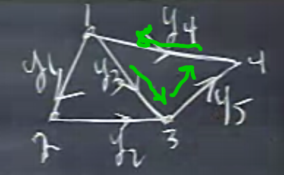
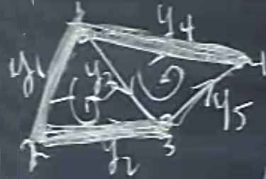
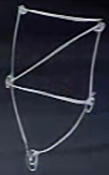
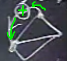

# Ders 12

Bu ders daha çok uygulama ağırlıklı olacak. Şimdiye kadar
farketmişsinizdir, ne zaman bir örnek matris bulmak gerekse, onu hemen
uydurarak ortaya çıkartıyorum, bunun hakkında biraz kendimi suçlu
hissediyorum, çünkü gerçek Lineer Cebir'de çoğunlukla bir gerçek dünya
probleminden gelen matrisler vardır, hocanın kafasından attığı şeyler
değillerdir. Bu matrislerin bir yapısı olur çoğunlukla, ve bu matrislerle
haşır neşir olan kişiler o yapıyı bilirler, vs.

Mesela geçen hafta sonu İleri Kimya konusunda araştırma yapan profosörler
ile beraberdim. Bu hocalar satır azaltılmış (row reduced) matrislerle
uğraşıyorlar, mesela her tür molekülden kaç tanesinin bir reaksiyona
girdiğini takip ediyorlar, ve satır azaltması yaparak bir reaksiyonun
daha net resmini görebiliyorlar. Sonra, önümüzdeki hafta Mathworks
şirketinde bir doğum günü partisine gideceğim, bu şirket Route 9 üzerinde,
ki bilindiği gibi Mathworks'ün ürünü Matlab'dir [ki 1999 yılında hocanın
dersinde Matlab referans ediliyordu, ama biz artık Python kullanıyoruz,
zaten kendisi de başka bir derste bu tavsiyede bulunmuştu]. Matlab çok
başarılı bir ürün tabii ki. Ayrıca bir konferans ta olacak, konusu Lineer
Cebir'in nasıl kullanıldığı. İşte bu sebeplerden dolayı suçluluk
hissediyorum :) Her yer uygulama! 

Bana göre Uygulamalı Matematik (Applied Math) alanındaki en önemli uygulama
çizitler ve ağlar (graphs and networks) konusudur. Bir çizit ortaya
çıkartacağım şimdi, ve onu temsil eden matrisi yazacağım; daha önce
değindiğim gibi mesela Web sitelerinin çiziti çok ilginç olmalı. Ya da tüm
telefonların bağlantılarının çiziti, ya da tüm insanların arasındaki
ilişkilerin çiziti. 

Basit bir örnek,

İşte bir çizit, 4 düğümü 5 kenarı var. Bu çiziti temsil eden matriste o
zaman 5 satır olacak, ve 4 tane kolon olacak, $m=5,n=4$. Bu arada her kenar
için bir +/- olarak betimlenecek bir yön de vereyim [ki bu bilgi de önceden
bilinecek bir şey, uygulamadan gelecek yani, bizim uydurduğumuz bir şey
olmayacak], ve kenarlara bir sayı vereyim [altta yeşil ile işaretli].

Birazdan aklımdaki bir uygulamayla alakalı olarak, potensiyel, akım gibi
kelimeler de kullanacağım, ki aklımdaki uygulama bir elektriksel bir devre
yapısı. Tabii bu sadece bir uygulama, pek çok diğer örnek olabilir,
hidrolik bir ağ yapısı olabilir mesela, suyun akışının da inceliyor
olabilirdim, ya da petrolün borulardan akışını.. İlla bir şeyin akıyor
olması da gerekmez, bir statik yapıyı, mesela bir köprünün yapısını da bir
çizit ile inceliyor olabilirdim.

Neyse, şimdilik potansiyel ve akımlara bakalım. Üstteki resimdeki çizite
tekabül eden bir geliş (incidence) matrisi yazacağım, her satır bir kenar
olacak şekilde,

$$ 
A = 
\left[\begin{array}{rrrr}
-1 & 1 & 0 & 0 \\
0 & -1 & 1  & 0 \\
-1  & 0  & 1  & 0 \\
-1 & 0 & 0 & 1 \\
0 & 0 & -1 & 1
\end{array}\right]
 $$

Kenar 1 düğüm 1'den çıkıyor (onun için o değer -1) ve düğüm 2'ye giriyor
(onun için değeri +1). 

İlk 3 satıra bakarsak ki bu satırlar çizitin sol tarafındaki ufak üçgeni
gösteriyor, orada bir döngü (loop) var, bir çizitte kaç tane döngü olduğu
ve onların nerede olduğu önemli bir konu.

Döngüler hakkında ilginç bir bilgi, eğer 1,2,3 bir döngü oluşturuyorsa,
burada matrissel ilginç bir soru şudur: döngü içindeki 1,2,3 satırlarına
tekabül eden satırlar birbirinden bağımsız mıdır? Çıplak gözle bunu
anlayabilir miyiz? Evet, ve bu satırlar bağımlı, 1. ve 2. satır toplanınca
3. satır ortaya çıkıyor. Bu durum aslında bizim için bir işaret olmalı,
lineer olarak bağımlı olan satırlar döngü olduğuna dair bir işarettir.

Bu matris hakkında ilginç bazı diğer gözlemler; her kenar tek bir yerden
çıkıp tek bir yere girdiğine göre her satır için iki öğe dolu olacak, geri
kalan hücreler sıfır olacak. Bu sebeple görüldüğü gibi matris seyrek
(sparse); matris dolululuğu $2m$. İşte daha önce belirttiğim yapı durumu
buydu, gerçek uygulamalarda karşımıza çıkan matrislerde bir yapı vardır,
işte burada görüyoruz; her satırda sadece iki hücre dolu, gerisi sıfır.

Ya sıfır uzayı? Ondan önce, bu matrisin sıfır uzayını sormak ne demektir?
Matrisin kolonları hakkında bir soru sormak demektir, eğer o kolonlar
bağımsız ise, matrisin sıfır uzayında sadece sıfır vektörü vardır. Çünkü
sıfır uzayı bize kolonları nasıl birleştirip sıfır sonucunu elde
edeceğimizi söyler, eğer bunu yapamıyorsak, bağımlılık yok demektir. 

$Ax=0$'i çözelim, üstteki matrisin yanına çarpan olarak $x$ vektörünü
ekleyeyim,

$$ Ax = 
\left[\begin{array}{rrrr}
-1 & 1 & 0 & 0 \\
0 & -1 & 1  & 0 \\
-1  & 0  & 1  & 0 \\
-1 & 0 & 0 & 1 \\
0 & 0 & -1 & 1
\end{array}\right]
\left[\begin{array}{r}
x_1 \\ x_2 \\ x_3 \\ x_4
\end{array}\right]
= 0
 $$

Bu çarpımı açarsak, 

$$ 
Ax = 
\left[\begin{array}{r}
x_2 - x_1 \\
x_3 - x_2 \\
x_3 - x_1 \\
x_4 - x_1 \\
x_4 - x_3 
\end{array}\right] =
\left[\begin{array}{r}
0 \\ 0 \\ 0 \\ 0 \\ 0
\end{array}\right]
$$

Bu çarpımın ne yaptığına dikkat edelim; her kenarın iki ucundaki düğümünün
farkını hesaplıyor, yani *potansiyel* farkını. Terminolojiye yeni bir
kelime ekledik şimdi, daha iyi tanımlamak gerekirse $x=x_1,x_2,x_3,x_4$
düğümlerin potansiyeli olsun. Hesabı yaparsak, tabii ki ilk akla gelen tüm
$x$ öğelerinin sıfır olması, o zaman sıfır sonucu gelir: sıfır vektörü
sıfır uzayının parçasıdır. Fakat daha fazlası da var. Matrise çıplak gözle
bakarak bile hemen bir tane bulabiliriz, mesela tüm $x$'lere 1 değerini
versem, o zaman üstteki hesapta yine sıfır elde ederim değil mi?  Yani tüm
potansiyeller eşitse, onların farkı sıfır olur.

Sıfır uzayında başka ne var? Sıfır uzayının bazı nedir? İçinde tamamen 1
olan vektör bu bazdır. Tüm sıfır uzayı $x = c \left[\begin{array}{cccc} 1 &
1 & 1 & 1 \end{array}\right]^T$, yani sabitle 
çarpılan tamamen 1 içeren vektör. Bu 4 boyutlu uzayda sonsuza giden bir
çizgiyi temsil edecek. 

Buradaki fiziksel anlam nedir? Eğer farkları temsil ettiysek ve bu
farkların sıfır olduğu durumu çözüyorsak, $x_1,..,x_4$'un hep aynı değerde
olması şaşırtıcı olmamalı, çünkü birbirleri ile aynı değerlerin farkı sıfır
olur. Elektriksel devre olarak düşünürsek, tüm potansiyeller aynı ise, yani
potansiyel farkları sıfır ise akım yoktur. 

Diğer yönden, eğer tüm devrede akımı bulmak istiyorsak, bir düğüm noktası
(üstteki gibi bir örnekte) / bir potansiyel "topraklanır (grounding)'',
yani sıfır değerine eşitlemek gerekir, böylece tüm matris çözülebilir hale
gelir, yani amaç hem fiziksel hem matematiksel, geri kalan bağımsız
değişkenler üzerinden çözüm ve devre üzerinde akım mümkün olur.

$A$ matrisinin kertesi nedir? Kaç bağımsız kolon var? 3 tane. Matristen
hangi 3 kolonu seçersek bu kolonlar birbirinden bağımsız olacaktır. 

$A^T$'nin sıfır uzayını düşünelim; çünkü $A^Ty=0$ denklemi herhalde
uygulamalı matematiğin en önemli denklemlerinden biridir, bunu
bulalım. Ondan önce $dim(N(A^T))$ nedir? $A^T$'nin boyutu $4 \times
5$. Kerte $m-r$, yani 5-3=2. Güzel, boyutu biliyorum, şimdi bu sıfır
uzayının kendisini bulmak istiyorum. Matris,

$$ 
\left[\begin{array}{rrrrr}
-1 & 0 & -1 & -1 & 0 \\
1 & -1 & 0 & 0 & 0 \\
0 & 1 & 1 & 0 & -1 \\
0 & 0 & 0 & 1 & 1
\end{array}\right]
\left[\begin{array}{r}
y_1 \\ y_2 \\ y_3 \\ y_4 \\ y_5
\end{array}\right]
=
\left[\begin{array}{r}
0 \\ 0 \\ 0 \\ 0 
\end{array}\right]
 $$

Daha ilerlemeden önce büyük resmi göstermek istiyorum, 

İlk başta elimizde $x$ değerleri var bunlar potansiyeller (potential at
nodes). $A$ ile çarpınca farkları elde ediyoruz (potential
differences). Ayrıca öyle bir matris $C$ vardır ki bu matris potansiyel
farkları kenarlardaki akımlar (currents on edges) ile ilintilendirir, ve
bu akımlar ve potansiyel farkları arasındaki ilişki Ohm Kanunu'nun ta
kendisidir. Ohm Kanunu potansiyel farkınının akım çarpı bir sayı (ki o sayı
$C$ içinde) olduğunu söylemez mi? Bu sayı tabii ki elektriksel direnç. 

Resimdeki son adım Kirchoff'un Akım Kanunu (Kirchoff's CL), yani birazdan
$Ay=0$ çözdüğüm zaman Kirchoff Kanununu çözmüş olacağım. 

Evet, şimdi $Ay=0$'a dönelim, bu matris içindeki çarpımlara denklem olarak
bakarsak, mesela ilk satır ne der?

$$ -y_1 - y_3 - y_4 = 0 $$

Eğer çiziti hatırlarsak, 

Çizite göre $y_1,y_2,y_3$ "akımları'' 1. düğümü terketmekte, 1. düğüme
tekabül eden 1. satırdaki tüm $y$ değişkenleri eksi değerde.  2. satır,

$$ y_1 - y_2 = 0$$

2. düğüme bakıyoruz, $y_1$ giriyor (işareti artı), $y_2$ çıkıyor, bir denge
var, toplam sıfır. 3. satır?

$$ y_2 + y_3 - y_5 = 0 $$

4. satır

$$ y_4 + y_5 = 0 $$

Bu denklem aslında elektrikte Kirchoff Kanununu ortaya çıkardı, yani bir
düğüme giren ve çıkan akımlar birbirine eşit olmalıdır. Diğer yandan
potansiyel farklarını gösteren denklem Ohm Kanunu idi. Şimdiye kadar
gördüğümüz $A$ ve $A^T$ işlemlerinin direk elektrik konusuna
uygulanabilmesi müthiş bir şey! 

Lineer cebir sorusuna dönelim şimdi, hangi $y$'ler sıfır uzayı sorusunu
çözer (yani Kirchoff kanununu)? Eliminasyona girmek istemiyorum şimdi, bunu
yapabiliriz, yapmayı biliyoruz artık, $A^T$ üzerinde azaltılmış basamaklı
formu (reduced echelon form) elde ederiz, vs., bunlara girmeden sonucu
bulabilir miyim?

Eliminasyon yapsaydım son satır ne olurdu? Tamamen sıfır olurdu. Niye,
çünkü kerte 3, o zaman son satır sıfır. Neyse, çizite tekrar dönelim, öyle
bir $y$'ler olmalı ki akım bu devrede "birikmeden'' sürekli aksın, giren
çıkan aynı olsun.

$N(A^T)$'nin bazında kaç vektör vardır? İki tane, çünkü $N(A^T)$ iki
boyutlu bir uzaydır o zaman iki vektör yeterlidir. 

Çizite göre, bakıyorum, $y_1=1$ olsun mesela, düğüm 1'den 2'ye bir
akım. 2'ye giren akım dışarı çıksın, sonra, $y_3$ üzerinden geriye gitsin
mesela. Geriye kalan $y_4,y_5$ sıfır olabilir. Bu hem Kirchoff Akım
Kanununa hem de sıfır uzayı çözümüyle uyumludur.

İlk çözümü vektör olarak yazalım,$\left[\begin{array}{ccccc}1&1&-1&0&0 \end{array}\right]^T$. 
Bu vektör ilk döngüdeki akım aslında, o zaman  ikinci döngüdeki akım da bir başka çözüme 
işaret eder, yani $\left[\begin{array} {ccccc}0&0&1&-1&1 \end{array}\right]^T$

Yani ilk baz vektörü birinci döngü, ikinci baz vektörü ikinci döngü. Bu baz
vektörleri birbirinden bağımsızdır, ve elime böylece $N(A^T)$ için için iki
çözüm geçer, yani Kirchoff'un Akım Kanununu tatmin eden iki akım. 

Bu noktada akla gelebilir, niye 1-2-3-4-1 şeklinde gidebilecek daha büyük
bir döngü üzerinden bir akım olmasın? Bu akım $\left[\begin{array}
 {ccccc}1&1&0&-1&1 \end{array}\right]^T$ olarak temsil edilirdi, bu vektör
$A^T$'un sıfır uzayında mıdır? Evet. O zaman niye bazlarımıza üçüncü 
bir vektör dahil etmiyoruz? 

Cevap çünkü bu vektör bağımsız değil. Eğer mevcut bazdaki ilk vektörü
ikinciye eklersem üstteki "büyük döngü'' vektörünü elde ederim, akımsal
olarak düşünürsek birinci ufak döngü akıyor, ikincisi de, $y_3$ üzerinde
ikisi karşı karşıya geliyorlar, birbirlerini iptal ediyorlar, ve ortaya
büyük döngü akımı çıkıyor.

Gördüğümüz gibi $N(A^T)$'i çözdüm ama aynı zamanda Kirchoff Akım Kanununu
da çözmüş oldum, ve bunu ağ yapısını bir matris olarak temsil ederek yapmış
oldum. 

$A$'nin satır uzayına gelelim. Boyut 3, çünkü kerte 3. Peki üstteki $A^T$
içinde, ilk 3 kolon birbirinden bağımsız mı? Değil (çünkü raslantısal
olarak yanyana gelmiş kolonlar -satırlar- bunlar, herhangi 3 kolon bağımsız
olacak diye bir kural yok), zaten $N(A^T)$ bazından niye görülüyor,
$1,1,-1$ değerleri bir döngü varlığını gösteriyor. Eğer $A^T$ üzerinde
eliminasyon yapıyor olsaydım bu sebeple 1. 2. kolonu pivot yapardım, ama
3'u atlayıp 4'u pivot haline getirirdim.

Bu pivot kolonları $y_1,y_2,y_4$ kenarlarına tekabül eder, ve bu durumda
hiçbir döngü yoktur. Bağımsızlık çizit bağlamında bu demek, hiç döngü
olmama durumu. Elde 3 tane kenar var, bunlar bağımsız, bir tane bile kenar
bu listeye eklesem bir döngü ortaya çıkar. 

Bu arada, hiç döngüsü olmayan çizite ne denir? Ağaç (tree) denir.

Bu noktada son bir adım daha atalım. Formülü hatırlarsak
$dim(N(A^T))=m-r$. Döngü sayısı

$$ \textrm{döngü sayısı} = \textrm{kenar sayısı} - (\textrm{düğüm sayısı} - 1) $$

Eksi 1 gerekti çünkü $r=n-1$ idi hatırlarsak. Biraz değiştirerek yazarsak, 

$$ \textrm{düğüm sayısı} - \textrm{kenar sayısı}  + \textrm{döngü sayısı} = 1 $$

Üstteki formüle Euler'in Formülü deniyor (yine Euler, bu adam her yerden
çıkıyor!). Demek istiyorum ki pür lineer cebir kullanarak Euler'in
Formülünü ortaya çıkartmış oldum. Euler'in Formülü matematiğin topoloji
alanında çok ünlü bir sonuçtur. Doğrulamak için başka bir çizit görelim
şimdi, mesela şimdi kafadan atıyorum, şöyle olsun,

Bu çizitte $\textrm{düğüm sayısı}=5$, $\textrm{kenar sayısı}=7$,
$\textrm{döngü sayısı}=3$, üstteki formülde yerine koyarsam, 5-7+3=1. Euler
haklı çıktı.

Evet artık büyük resmi tamamlamanın zamanı geldi.

Ders başında gördüğümüz büyük resme döneceğiz. Elde potansiyel farklar var,
ki bunlara $e$ diyelim mesela, o zaman $e=Ax$.  Akımlar potansiyel
farklarla alakalı tabii ki, bu alaka $C$'ler üzerinden, $y=Ce$. Son olarak
Kirchoff'un Kanunu $A^Ty=0$ ile akım şiddetleri arasındaki ilişkiyi
kuruluyor. Uygulamalı Matematiğin belkemiği budur arkadaşlar, bu
denklemlerde gizlidir. Denklemde eksik tek bir şey var, sisteme dışarıdan
giriş yok, ama onu da ekleyebilirdim, mesela çizitin (devrenin) iki
düğümüne bir pil takarak akım verebilirdim, alttaki gibi [rasgele bir devre
çiziyor],

O zaman  $Ay=0$ yerine $Ay=f$ derdim. 

Şimdi dersi tamamlamadan önce bu üç formülü biraraya koyacağım. Bilinmeyen
$x$ ile başladım, onu $A$ ile çarptım bu bana potansiyel farkları verdi,
$e=Ax$. Sonra $C$ ile çarptım, ki $C$ içinde Ohm Kanununu için gereken
fiziki sabitler var, yani $CAx$ oldu, $y$'yi elde ettim. En son olarak
$A^T$ ile çarparım, $A^TCAx$ olur bu da $f$'tır. 

$$ A^TCAx = f $$

Formülün tamamı bu. Bu formül Uygulamalı Matematiğin en temel
formülüdür. Üç adım uygulayarak bu sonuca geldik, ki son adımda bir denge
formülü eklemiş olduk (her problemde, mutlaka bir denge formülü olur). Bu
arada, "en temel formül'' derken denge (equilibrium) durumları için böyle,
çünkü üstteki problemde zaman faktörü yok. Sisteme herşey yerli yerine
oturduktan sonra bakıyorum. Resim böyle.

Bitirmeden ufak bir soru: bana $A^TCA$ hakkında ne söyleyebilirsiniz? Ya da
$A^TA$ hakkında. Bu matris hakkında ne biliyoruz? Bu matris her zaman
simetriktir. Güzel. Şimdilik bu kadar.

