# Ders 15

Bu önemli bir ders, ana konumuz yansıtma / izdüşüm (projection). Mesela
$b$ vektörünü alıp $a$ üzerine olan "yansımasını'' hesaplamak. Bu
yansımayı sanki $a$'ya dik bir şekilde bir lamba açtık ve oradan gelen
ışık sonucunda $b$'nin $a$ üzerine düşen "gölgesini'' hesaplıyoruz gibi
düşünebiliriz. 

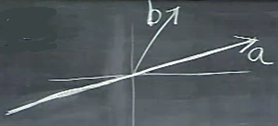

Yansıtmayı yapmak için $b$'nin $a$'ya en yakın olduğu noktayı bulmalıyım. 

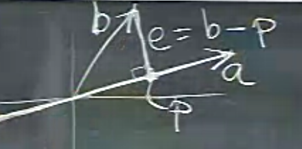

Bu noktaya $p$ diyebilirim, $b,a$ arasındaki en kısa mesafeye de bir nevi
"hata (error)''  olarak bakabilirim, bu mesafeye $e$ harfini
vereceğim. Hata sözünü kullandık, çünkü, sanki $b$, $a$'dan "sapmış'' ve
biz bu sapmanın ölçüsünü buluyoruz gibi bakılabilir bu probleme. 

Peki niye $e = b-p$? Şu resme bakalım, 

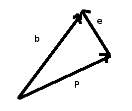

Basit vektör aritmetiğinden biliyoruz ki, birbirine zincirleme duran
vektörlerde, zincirin başından sonuna direk gidilmek için zincirdeki tüm
vektörler birbiriyle toplanır. Üstteki resimde $b = p + e$. Ufak bir
cebirsel işlemle $e = b - p$ buluruz. 

Peki $p$'yi nasıl bulacağız? Amacımız bu, yansımayı bulmak. Muhakkak
elimizde bir dik üçgen var, eğer trigonometri yapıyor olsaydık, $\cos,
\sin$, vs kullanıp birşeyler bulabilirdik. Lıneer Cebir'in metotları çok
daha temiz.

Bildiklerimiz neler? Biliyoruz ki $p$, $a$'nin bir katı, çünkü aynı çizgi
üzerindeler. 

$$ p = xa $$

diyelim. O zaman bulmak istediğim bu $x$ sayısı. 

Bildiğimiz bir diğer şey, $e$ ve $a$'nin birbirine dik olduğu. İki vektörün
dik olmasının tercümesi nedir? İki vektörün noktasal çarpımının sıfır
olması. O zaman

$$ a^T e = 0 $$

$$ a^T(b - p) = 0 $$

$$ a^T(b - xa) = 0 $$

Tekrar düzenlersem

$$ xa^Ta = a^Tb $$

Sol taraftaki $a^Ta$ bir tek sayı artık (çünkü bir noktasal çarpım), onu
alıp sağ tarafa bölüm olarak taşıyabilirim,

$$ x = \frac{ a^Tb}{a^Ta} $$

İşte ihtiyacımız olan katsayı bu. Bunun içinde cosine bir şekilde var
tabii, ama trigonometriye hiç girmemize gerek yok, pür vektörler ile bu işi
hallettik. Sonra bu $x$'i alıp $p = ax$ ile $p$'yi hesaplıyoruz. Hepsini
biraraya koyarsak, 

$$ p = a\frac{ a^Tb}{a^Ta} $$

Biraz zihin egzersizi yapalım: eğer $b$'yi iki katına çıkarırsam, $p$ ne
olur? İki katına çıkar. Peki $a$'yi  iki katına çıkarırsam? Üstteki resmi
düşünürsek, hiç değişmemeli. Cebirsel olarak ta bunu görebiliriz, üstteki
ve alttaki $a$'lardaki artış birbirini iptal edecektir. 

Şimdi, olaya matrissel olarak bakmak gerekirse, bir yansıtma matrisi $P$
olsun istiyorum, öyle ki 

$$ p = P b $$

olsun, yani bu matris $b$'ye uygulanınca $p$'yi bulayım. O zaman iki üstteki $p$
formülü içinden $b$ haricindeki kısımları çekip çıkartmam lazım.

$$ P  = \frac{ aa^T}{a^Ta} $$

Bu bir matris. Bölünen bir matris, bölen bir skalar. Bazı örnekleri
hesaplayalım, ve grafikleyelim,

```python
o = np.array([5,5,5])
b = np.array([[3.,3.,3.]]).T
a = np.array([[0,5.,5.]]).T
P = a.dot(a.T) / a.T.dot(a)
p = P.dot(b)
print (P)
print (p)
```

```text
[[0.  0.  0. ]
 [0.  0.5 0.5]
 [0.  0.5 0.5]]
[[0.]
 [3.]
 [3.]]
```

```python
import sys; sys.path.append('../../phy/phy_072_rot')
import plot3d

fig, ax = plt.subplots(1, 1, subplot_kw={'projection': '3d'})

plot3d.plot_vector(ax, o, b)
plot3d.plot_vector(ax, o, a, 'cyan')
plot3d.plot_vector(ax, o, p, 'yellow')
plt.savefig('linear_15_01.png')
```

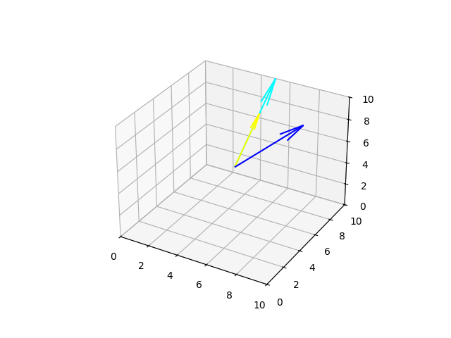

$P$ ilginç bir matristir. Özellikleri nedir?

Kolon uzayı neydi? Bir vektörü o matris ile çarptığımızda sonuç her zaman
matrisin kolon uzayındadır. $P$'nin kolon uzayı $a$'dan geçen çizgidir,
seviyesi (rank) 1'dir, simetriktir (bir vektörü devriği ile sağdan çarpınca
sonuç matrisi simetrik olur), yani $P^T = P$. 

Eger yansıtma matrisini iki kere uygularsam ne olur? Ikinci yansıtmanin
hicbir etkisi olmamasi gerekir, yani $P = P^2$. 

Eğer daha yüksek boyutlara geçersek? O zaman üstüne yansıtma yaptığımız bir
çizgi olmayacak, üç boyutta bir düzlem, daha yüksek boyutlarda N boyutlu
bir altuzay olacak.

Yansıtma neye yarar? Önemli faydalarından biri $Ax = b$ denklemini çözerken
ise yarar. Bazen bu denklemin çözümü yoktur. Belki bilinmeyenlerin sayısından
daha fazla denklem verilmiştir. O zaman tam denklemi çözmeye uğraşmak
yerine, çözülebilecek en yakın şeyi çözmeye uğraşmak gerekir, yani 

$$ A\hat{x} = p $$

ki $p$, $b$'nin $A$'nin kolon uzayına yansıtılmış hali olacak. Bir
"çözüm'' olmak kolon uzayının bir kombinasyonu olmak demek ise, bu kolon
uzayına yansıtılan $b$ üzerinden çözümü elde edebilmeyi umabiliriz. 3
boyutta

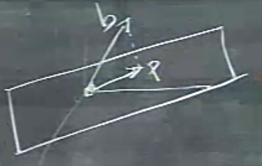

Üzerine yansıtma yapılacak düzlem nedir? Düzlemi belirlemek için onu
tanımlayacak bir baz bulabilirim, iki vektör yani, mesela $a_1,a_2$
diyelim. 

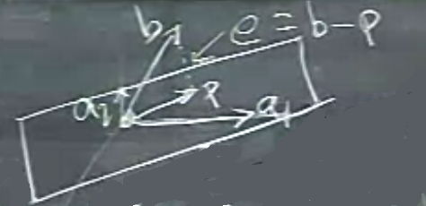

Bu iki vektörün birbirine dik olması şart değil, bağımsız olması gerekli
ama. $a_1,a_2$'nin yarattığı düzlem $A$'nin kolon uzayı ile aynıdır, yani

$$ A = 
\left[\begin{array}{rr}
\uparrow &  \uparrow \\
a_1 &   a_2 \\
\downarrow &  \downarrow 
\end{array}\right]
$$

$e$ düzleme diktir. Peki $p$ nedir? $a$ vektörlerinin bir kombinasyonudur, yani

$$ p = \hat{x}_1a_1 + \hat{x}_2a_2 $$

ya da daha temiz olarak

$$ p = A\hat{x} $$

Aradığımız $\hat{x}$. Anahtar şurada, $e$ yani 

$$  b - A\hat{x}$$

düzleme dik. Ve düzleme dik ise, düzlemdeki *her vektöre* dik. O zaman 

$$ a_1^T( b - A\hat{x}) = 0$$

$$ a_2^T( b - A\hat{x}) = 0$$

Fakat üstteki gibi iki ayrı formül yazmak yerine, matris formu kullanamaz
mıyım? 

$$ 
\left[\begin{array}{rrr}
 & a_1^T & \\
 & a_2^T & 
\end{array}\right]
(b - A\hat{x}) = 
\left[\begin{array}{rrr}
0 \\
0 
\end{array}\right]
$$

Ya da

$$ A^T(b - A\hat{x})  = 0 $$

Bu problemin çizgizel versiyonunde $A$ yerine $a$ kullanmıştık, ve $a$ tek
bir vektördü. Zaten $A$ yerine $a$ kullanırsak, aynı formülü elde
ediyoruz. 

Bir soru soralım şimdi: $e$, yani $b - A\hat{x}$ hangi uzayın içindedir?
Cevap, $A^T$'nin sıfır uzayındadır (nullspace), yani $N(A^T)$ içinde. Sıfır
uzayı hakkında neler biliyoruz? Sıfır uzayı ve kolon uzayları birbirine
dikgendir (orthogonal). O zaman $e$ $N(A^T)$ içinde ise, $e \perp C(A)$
demektir, yani $e$ de kolon uzayına dikgendir. Devam edelim, üstteki
formülü düzenlersek,

$$ A^TA\hat{x} = A^Tb $$

Dikkat edersek, önceki versiyonda $a^Ta$ bir tek sayıydı, böylece onu
bölen olarak sağa geçirmiştik. Şimdi ne yapacağız? 

$$ \hat{x} = (A^TA)^{-1}A^Tb $$

Daha önce 

$$ p = A\hat{x} $$

demiştik, o zaman 

$$ p = A(A^TA)^{-1}A^Tb $$

Demek ki yansıtma matrisi eşitliğin sağında $b$ harici olan tüm semboller, 

$$ P = A(A^TA)^{-1}A^T $$

Şimdi dikkat, bilerek bir hata yapacağım, üstteki formülün sağ tarafını
cebirsel olarak manipüle edeceğim

$$  AA^{-1}(A^T)^{-1}A^T = I$$

Bu yanlış duruyor, $P$ birim matris olamaz. Nerede hata yaptık?
Manipülasyon mekanik, teknik olarak doğru. Hata $A$'nin kare matrisi
olmamasında. O sebeple $A^TA$'yi üstte yaptığım gibi parçalayamam çünkü
bir matrisin tersini alabilmek için onun en azından kare olması gerekir (bu
yeterli şart değil tabii ki). 

Yansıma matrislerinin simetrik olmasını bekliyordum, ve bakıyorum ki öyle. 

$$ P^T = P $$

ve 

$$ P^2 = P $$

Kontrol edelim

$$=  A(A^TA)^{-1}A^T \ A(A^TA)^{-1}A^T $$

$$=  A(A^TA)^{-1}\cancel{A^T \ A(A^TA)^{-1}}A^T $$

$$=  A(A^TA)^{-1}A^T $$

Üstteki son ifade $P$'ye eşit. 

Uygulama: En Az Kareler (Least Squares)

Ne zaman formülden daha fazla veri vardır? Mesela veriye çizgi "uydurmak
(fitting)'' istediğimde durum budur. Diyelim ki $t,D$ eksenleri üzerinde

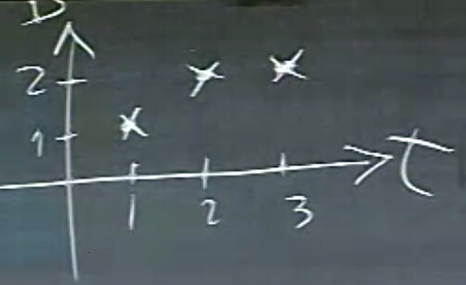

Veri şöyle olsun, $(1,1),(2,2),(3,2)$, üç tane nokta. Bu noktalara en yakın
şekilde geçecek çizgi kabaca şöyle olur [çizgi pek düz olmadı ama neyse].

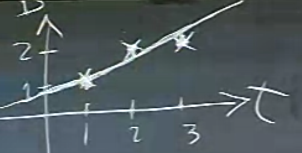

Bu problem ödevde $b = C+Dt$ olarak gösterildi. O zaman 

$$ C + D = 1 $$

$$ C + 2D = 2 $$

$$ C + 3D = 2 $$

Bu tür problemleri çözerken anahtar yaklaşım bu, formülü yazalım, ve çözmek
istediğimiz (ama çözemediğimiz) denklemler serisini ortaya
çıkaralım. Matris olarak yazarsak, 

$$ 
\underbrace{
\left[\begin{array}{rr}
1 & 1 \\
1 & 2 \\
1 & 3 
\end{array}\right]
}_{A}
\underbrace{
\left[\begin{array}{r}
C  \\
D  
\end{array}\right]
}_{x}
=
\underbrace{
\left[\begin{array}{r}
1 \\
2 \\
2  
\end{array}\right]
}_{b}
$$

Gördüğümüz gibi 3 tane denklem ve 2 tane bilinmeyen var. Yani verilen
(denklemler) bilinmeyenlerden daha fazla. Bu sebeple bazı denklemler (ya da
hiçbiri) doğal olarak tam olarak uymayacak. Amaç $Ax = b$'yi çözmek değil,
yansımayı çözmek. O zaman $A$'yi alttaki yerine koyunca, çözüm ortaya
çıkacaktır. 

$$ \hat{x} = (A^TA)^{-1}A^Tb $$

Matris tersi kullanmadan vektörün düzlem üzerine yansıtmasını daha direk
bir şekilde şöyle anlatabilirdik [1]: hatırlarsak, bir $u$ vektörünün diğer
bir $v$ vektörünün üzerine yansıtması (operasyonu $\mathrm{proj}$ ile belirtelim)

$$ \mathrm{proj}_v(u) = \frac{u \cdot v}{||v||^2} $$

idi. O zaman $u$'nun bir düzlem üzerine yansıtmasını $u$'nin içinde o
düzleme dik olan bileşenlerini çıkartarak bulabiliriz. Düzlemi yatay olarak
düşünürsek $u$ içinden düzleme dikey olan bileşenleri çıkartınca geriye
$u$'nun yatay bileşenleri kalır, bu da $u$'nun düzleme yansıtılmış hali
demektir. Peki düzleme dikey olan vektörü nasıl buluyoruz? Bu vektör zaten
biliniyor, bu vektör düzlemin normal vektöründen başka bir şey
değil. Normal vektor $n$ icin formul,

$$ \mathrm{proj}_{\textrm{düzlem}}(u) = u - \mathrm{proj}_{n}(u) = u - \frac{u \cdot n}{||n||^2} n $$

Bir örnek üzerinde görelim, 

```python
import sys; sys.path.append('../../vision/vision_02')
fig, ax = plt.subplots(1, 1, subplot_kw={'projection': '3d'})
import plot3d
o = np.array([5,5,5])
u = np.array([3,3,3])
n = np.array([-1/3.,2/3.,2/3.])

plot3d.plot_plane(ax, o, n, size=5)
plot3d.plot_vector(ax, o, u)
plot3d.plot_vector(ax, o, 3*np.array(n), 'red')
plt.savefig('15_8.png')
```

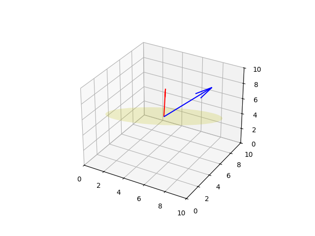

Mavi vektörü düzleme yansıtmak istiyoruz. 

```python
p = u - (np.dot(u,n) / np.dot(n,n)) * n
print (p)
```

```text
[4. 1. 1.]
```

```python
fig, ax = plt.subplots(1, 1, subplot_kw={'projection': '3d'})
plot3d.plot_plane(ax, o, n, size=5)
plot3d.plot_vector(ax, o, u)
plot3d.plot_vector(ax, o, p, 'cyan')
plot3d.plot_vector(ax, o, 3*np.array(n), 'red')
plt.savefig('15_9.png')
```

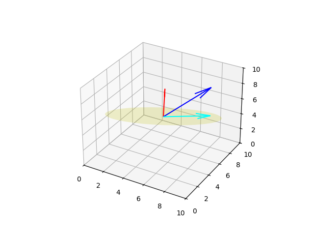

Bir Düzlem Üzerindeki İki Vektör Arasındaki Açıyı Bulmak

Şu resme bakalım,

```python
n = np.array([-1/3.,2/3.,2/3.])
o = np.array([5,5,5])
u1 = np.array([3,3,3])
u2 = np.array([-3,0,3])

fig, ax = plt.subplots(1, 1, subplot_kw={'projection': '3d'})
plot3d.plot_plane(ax, o, n, size=5)
p1 = u1 - (np.dot(u1,n) / np.dot(n,n)) * n
p2 = u2 - (np.dot(u2,n) / np.dot(n,n)) * n
plot3d.plot_vector(ax, o, 3*n,'red')
plot3d.plot_vector(ax, o, u1)
plot3d.plot_vector(ax, o, u2)
plot3d.plot_vector(ax, o, p1,'cyan')
plot3d.plot_vector(ax, o, p2,'skyblue')
plot3d.plot_vector(ax, o, 0.5*np.cross(p1,p2),'yellow')
ax.view_init(elev=30, azim=30)
plt.savefig('15_10.png')
```

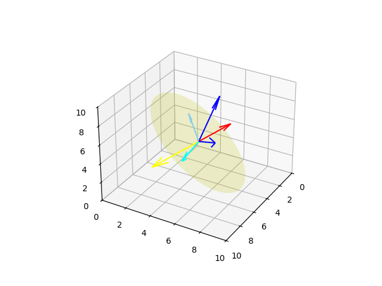

Koyu mavi iki vektörün düzlem üzerinde yansıtılmasını görüyoruz (açık ve
biraz daha açık mavi iki vektör). Bu vektörler arasındaki açı nedir? Tabii
açı derken *hangi yöne doğru açı* bulunmak isteniyor, bu soru da
önemli. Çoğu zaman bir referans vektörüne olan ikinci bir vektörün saat
yönü ya da onun tersi yöndeki açısını isteriz. Eger açıyı bilinen

$$ \theta = \arccos \frac{u \cdot v}{||u||||v|||}$$

ile hesaplarsak, bu hesap bize her zaman iki vektör arası en "yakın''
açıyı verir (yani 180'den daha az olan açıyı). Fakat biz mesela saat yönü
tersindeki açıyı istiyorsak, o zaman potansiyel olarak 180'den fazla açılar
da elde edebilmemiz gerekir.

Çözüm için çapraz çarpım kullanabiliriz, $n \cdot (u \times v)$ hesabına
bakarız, bu hesap artı ise üstteki $\theta$'yi olduğu gibi alırız, değil
ise $360-\theta$'yi kullanırız. Bunun sebebi $u \times v$ bize sağ el
kuralına göre, bkz [2], $u,v$ referanslı bir üçüncü vektör veriyor. Sağ el
kuralınında eğer $u$'dan başlayıp $v$'ye saat yönü tersine giderken 180
dereceden az bir gidiş yeterli ise, üçüncü vektör yukarı doğru işaret
ediyor, yoksa aşağı doğru. Mesela üstteki örnekte vektör düzlem normaline
ters, yani aşağı. Bu bize ilgilendiğimiz gidiş yönündeki açının 180'den
fazla olduğuna dair bir işaret, o zaman $360 - \theta$ kullanmamız
gerekir. Noktasal çarpım aynı yön / terslik hesabı için; üçüncü vektörün
düzlem normali ile noktasal çarpımı eğer aynı yönde ise artı, değil ise
eksi olacağı için 360'dan çıkartma irdelemesini bu şekilde yapabiliriz.

```python
import numpy.linalg as lin
deg = np.rad2deg(np.arccos(np.dot(p1,p2) / (lin.norm(p1)*lin.norm(p2))))
s = np.dot(n, np.cross(p1,p2))
print ('deg', deg)
if s < 0: print ('360 - deg =', 360-deg)
else: print ('deg', deg)
```

```text
deg 135.0
360 - deg = 225.0
```

Ekler

Yansıtma (Projection)

Vektör $\vec{a}$'nin $\vec{b}$ yönündeki büyüklüğü, yansıması nedir sorusunun
cevabı da noktasal çarpım ile bulunabilir, 

$$
\vec{a}\cdot\vec{b} = ||\vec{a}||||\vec{b}||\cos\theta
$$

formülünü biraz manipüle edersek cevabı alabiliriz, 

$$
\frac{\vec{a}\cdot\vec{b}}{||\vec{b}||} = ||\vec{a}|| \cos \theta
$$


Eşitliğin sağ tarafı $||\vec{a}|| \cos \theta$ aradığımız büyüklük, onu elde
etmek için $\frac{\vec{a}\cdot\vec{b}}{||\vec{b}||}$ noktasal çarpımını
kullanabileceğimizi görüyoruz [4].

Eğer büyüklüksel, skalar yansımasını bulabiliyorsak, bir vektörün diğeri
yönündeki tamamen yansımasını da bulabilirdik, $\vec{b}$ yönünü
$\frac{\vec{b}}{||\vec{b}||}$ birim vektörü ile gösteriyoruz, o yöndeki
$\vec{a}$ büyüklüğünü biraz önce bulduk,
$\frac{\vec{a}\cdot\vec{b}}{||\vec{b}||}$.

Yönü büyüklük ile çarpınca istenilen vektör elde edilmiş olur [3], $\vec{a}$'nin
$\vec{b}$ yönündeki yansıması $\mathrm{proj}_{\vec{b}} \vec{a}$

$$
\mathrm{proj}_{\vec{b}} \vec{a} = \frac{\vec{a}\cdot\vec{b}}{||\vec{b}||} \frac{\vec{b}}{||\vec{b}||}
$$

$$
= \frac{\vec{a}\cdot\vec{b}}{||\vec{b}||^2} \vec{b}
$$

Baz Değişimi

Aksi belirtilmediği sürece verili herhangi bir matrisin standart $i,j,k,..$ baza
sahip olduğu kabul edilir, bu sayede mesela $[\begin{array}{cc}1&2\end{array}]$
vektörünü $i$'dan 1 tane $j$'den iki tane şeklinde gösterebiliriz [6].

Her temel baz tek bir eksen icin 1 digeri icin 0 degerindedir,

$$
i = \left[\begin{array}{c}1 \\ 0 \end{array}\right], \quad
j = \left[\begin{array}{c}0 \\ 1 \end{array}\right]
$$


2 boyutta herhangi bir matrisin aslında bu "standart baz üzerinden''
tanımlanmış olduğu kabul edilir,

$$
Bx = 
\left[\begin{array}{ccc}
1 & 0 \\ 0 & 1
\end{array}\right]
\left[\begin{array}{c}
x_1 \\ x_2
\end{array}\right] =
x_1 \left[\begin{array}{c}
1 \\ 0
\end{array}\right] +
x_2 \left[\begin{array}{c}
0 \\ 1
\end{array}\right]
$$

Bu bakış açısı faydalı çünkü böylece herhangi bir transformasyona baz değişimi
olarak bakılabilir, tek gereken yeni $i$, ve yeni $j$'nin (daha üst boyutlarda
$k$, vs) nereye işaret ettiğini bilmek. Mesela kaykılma (shear)
transformasyonunu alırsak, tüm dünyayı 45 derece sağa kaydırmak istiyoruz, bunun
için yeni $i,j$

$$
i = \left[\begin{array}{c}1 \\ 0 \end{array}\right], \quad
j = \left[\begin{array}{c}1 \\ 1 \end{array}\right]
$$

Bu bazla soldan çarparsak, mesela bir $[\begin{array}{cc}1&2\end{array}]^T$ vektörü,

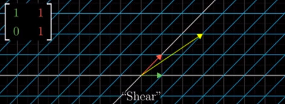

haline gelir.

Baz Değişimi Bakışı Açısı ve Yansıtma

Yansıtmayı baz değişimi (change of basis) olarak görürsek ilginç bir görüşe daha
kavuşuyoruz. Biliyoruz ki $x$ vektörünü transforme edip yeni bir $B$ bazına
taşımak için $x$'i soldan çarpmak yeterli, mesela

$$
Bx = 
\left[\begin{array}{ccc}
a & b \\ c & d
\end{array}\right]
\left[\begin{array}{c}
x_1 \\ x_2
\end{array}\right] =
x_1 \left[\begin{array}{c}
a \\ c
\end{array}\right] +
x_2 \left[\begin{array}{c}
b \\ d
\end{array}\right]
$$

Her ayri baz $B$ kolonlari icinde, her kolon 2 boyutlu, yani 2 boyuttan 2 boyuta
baz degisimi yapmis olduk. Fakat boyut degisimi de olabilirdi, mesela 

$$
Bx = 
\left[\begin{array}{ccc}
a & b 
\end{array}\right]
\left[\begin{array}{c}
x_1 \\ x_2
\end{array}\right] =
x_1 \left[\begin{array}{c}
a 
\end{array}\right] +
x_2 \left[\begin{array}{c}
b 
\end{array}\right]
$$

Son çarpımlar 1x1 boyutlu "matrisler'' içeriyor, yani bunlar skalar, ki son
toplamdan elde edilen sayı da skalar olacaktır, $x_1 a + x_2 b$. İşte noktasal
çarpım, skalar yansıtmaya bakmanın bir diğer yolu bu, bir vektör $v_1$'in bazını
değiştirip $v_2$ haline getirmek ilk vektörü ikincisi üzerinde yansıtmak
anlamına gelmez mi? 

Kaynaklar

[1] Maplesoft, *Projection of a Vector onto a Plane*, [http://www.maplesoft.com/support/help/Maple/view.aspx?path=MathApps/ProjectionOfVectorOntoPlane](http://www.maplesoft.com/support/help/Maple/view.aspx?path=MathApps/ProjectionOfVectorOntoPlane)

[2] Bayramlı, Yapay Görüş ve Robotik, *Ders 2*

[3] [http://sites.science.oregonstate.edu/math/home/programs/undergrad/CalculusQuestStudyGuides/vcalc/dotprod/dotprod.html](http://sites.science.oregonstate.edu/math/home/programs/undergrad/CalculusQuestStudyGuides/vcalc/dotprod/dotprod.html)

[4] *Math Insight*,
    [https://mathinsight.org/dot_product](https://mathinsight.org/dot_product)

[6] 3Blue1Brown, [https://www.youtube.com/watch?v=k7RM-ot2NWY](https://www.youtube.com/watch?v=k7RM-ot2NWY)

[8] [https://tutorial.math.lamar.edu/classes/calcii/dotproduct.aspx](https://tutorial.math.lamar.edu/classes/calcii/dotproduct.aspx)


