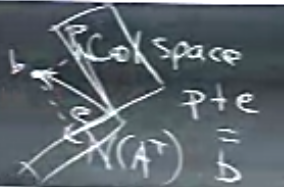
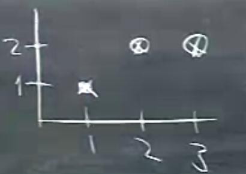
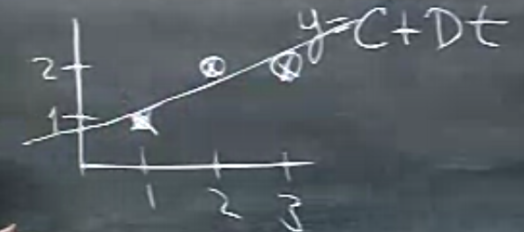
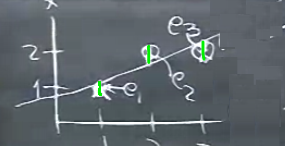
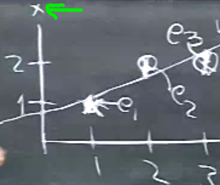
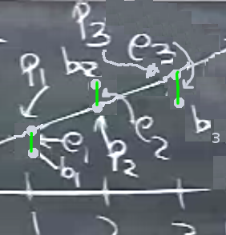
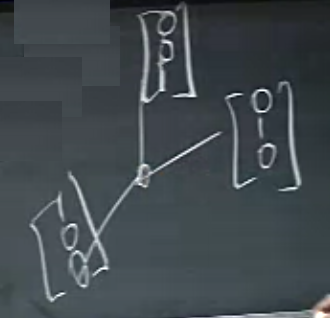
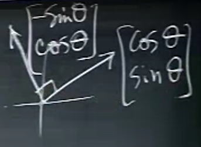

# Ders 16

Önceki dersi hatırlarsak en sonda yansıtma matrisi diye bir matrisle
bitirdik. Bu konunun bir daha üzerinden geçelim. Sihirli formülümüz 

$$ P = A(A^TA)^{-1}A^T $$

ne yapıyordu? Yansıtma matrisi $P$, $b$'yi alıp $Pb$ çarpımı ile onun
$A$'nin kolon uzayındaki izdüşümünü hesaplıyordu. Diyelim ki $b$ zaten
kolon uzayında, o zaman $P$ ne yapar? Hiçbir şey. Yani $Pb=b$. "Bu hiçbir
şey'' cevabı üstteki formülden doğal olarak çıkmalı. Peki eğer $b$, $A$'nin
kolon uzayına tam dik olsaydı? Yani üç boyutta düşünsek, $A$ bir düzlem,
$b$ onun üzerinden yukarı tam dik bir şekilde fırlamış bir vektör. Bu
vektörün alttaki düzlemde yansıması nedir?  Sıfır. Yani $Pb=0$. Bu iki
durum oldukça sıradışı tabii ki, ama iyi zihin egzersizi olmaları açısından
onlardan bahsettim. Çoğu durumda bir yansıma vardır.

Cebirsel olarak $Pb=0$ durumuna inceleyelim; eğer $b$, $A$ kolon uzayına
dik ise o zaman bu $A^T$'nin sıfır uzayındadır. Bu durumda $Pb$, 

$$ Pb =  A(A^TA)^{-1}A^T b =A(A^TA)^{-1}\cancelto{0}{A^T b} = 0  $$

olur çünkü eğer $b$ $A^T$'nin sıfır uzayında ise $A^Tb=0$. 

Öteki durumda, yani $b$'nin $A$'nin kolon uzayında olduğu durumu şöyle
türetiriz; $A$'nin kolon uzayında olmak ne demektir? Bu $Ax$ formundan
ibaret, $Ax$, $A$'nin kolon uzayında çünkü $x$ $A$'nin kolonlarını kombine
ediyor. Bunu artık pat diye görüyor olmamız lazım, hatta bir ufak sınava
bile bu soruyu dahil edebilirim çünkü sürekli bahsettiğimiz bir şey. Neyse,
bu $b=Ax$ kombinasyonunu formüle koyalım,

$$ Pb =  A(A^TA)^{-1}A^TAx = Ax = b$$

Bu nasıl oldu? $(A^TA)^{-1}$ ile $(A^TA)$ yanyana geldi, bu iki ifade birbirinin
tersidir, o zaman çarpımları $I$ olur, geri kalanlar $Ax$, ki o da $b$'ye eşit. 

Resmedersek, 



Elimizde verili "tipik vektör'' $b$ var, tipik çünkü üstteki sıradışı
durumlarda değil, ve bu vektörün kolon uzayına [resimde 'col space' olarak
yazılı] izdüşümü $P$ ile, $A^T$'nin sıfır uzayına izdüşümü ise $e$
ile. $P+e = b$. Bu yansıtmalar $Pb$ ve hata için ona dik olan uzaya
izdüşümü $(I-P)b$. Not: $P$ yansıtma ise $I-P$ de yansıtmadır, $P$ simetrik
ise $I-P$ de simetriktir, $P^2=P$ ise $(I-P)^2=I-P$. Cebir sadece resimde
görülenleri tarif ediyor.

Böylece önceki dersin üzerinden geçmiş olduk, iyi oldu, çünkü baştaki
formülü birden fazla kez görmenizi istedim. Şimdi bu formülü nasıl
kulanacağımıza gelelim.

En iyi düz çizgi bulma probleminden devam ediyoruz. Diyelim ki elimizde
şöyle veriler var, 



Eğer veride sadece ilk iki nokta olsaydı onlar bir düz çizgi oluştururdu,
resimde öyle duruyorlarr, ama üçüncü nokta olası bir çizginin kesinlikle
dışında. Bu noktalar için en iyi düz çizgi $y=C+Dt$'yi arıyorum, ki bu
çizgi kabaca altta görüldüğü gibi birşey olacak.



Bu ideal çizginin tüm noktalardan geçmesi mümkün değil çünkü hiçbir düz
çizgi tüm noktalardan geçemez. Yapmaya uğraşacağımız hata miktarını en aza
indirgeyerek bir çizgi bulmak. 

Her nokta bize bir denklem veriyor (her $t$ için farklı bir denklem), bu
denklemler, $t=1,2,3$ için,

$$ C + D = 1 $$
$$ C + 2D = 2 $$
$$ C + 3D = 2 $$

Ve bu denklem sisteminin çözümü yok. Ama "olabilecek en iyi çözümü''
var. En iyi ile neyi kastetiğimi göstereyim. Matris formunda,

$$ 
\left[\begin{array}{rrr}
1 & 1 \\
1 & 2 \\
1 & 3
\end{array}\right]
\left[\begin{array}{rrr}
C \\
D
\end{array}\right]
=
\left[\begin{array}{rrr}
1 \\
2 \\
2 
\end{array}\right]
$$

$A$ için elimde iki bağımsız kolon var, yani kolon uzayı için elimde bir
baz var, ama eşitliğin sağındaki vektör $b$ bu kolon uzayı içinde değil. O
zaman "en iyi'' olan nedir? Bu çözüm, her ne ise, 1. 2. ve 3. denkleme
verildiğinde $b$ hesabı için bir hata yapacaklar, bu hataların karelerini
alıp toplarsam, bir genel hata elde etmiş olurum. Amacım, 

Minimize Et $||Ax-b||^2 = ||e||^2 = e_1^2+e_2^2+e_3^2$

Hata "vektörünün'' uzunluğunu aldık, çünkü hatanın yönü ile değil
büyüklüğü ile ilgileniyoruz, vektör büyüklüğü de hep pozitif bir sayı
olacak. Ayrıca matematiksel kolaylık sağlaması açısından uzunluğun karesini
aldık (kolaylığın sebebini anlamak için bkz [3]).

Galiba söylemek istediğim şu, olaya iki tür bakış açısı var. Birincisi 3
nokta ve çizgi bakışı. Bu resimde, hatalar nerede, farazi düzlem
üzerinde gösterirsem [yeşil ufak çizgiler],



Genel hata nedir? Tüm bu hataları alıp toplarsak, $e_1^2 + e_2^2 +
e_3^2$. Minimize etmeye çalıştığım bu. Bu işlem, bu arada, İstatistiğin
önemli bir kısmını oluşturur, ki bu işleme regresyon denir, bu örnekte
lineer regresyon. Veriye düz çizgi uydurmak, ayrıca, pek çok bilim dalının
en önemli araçlarından.

Bazı istatistikçiler hata karesi alınması hakkında rahatsız olabilirler /
tetikte olurlar, çünkü diyelim ki 4. veri noktası var elimizde ve bu nokta
diğerlerinden müthiş uzakta,



Bu veri noktası lineer çizgi uyumunu tamamen değiştirirdi çünkü onun hata
karesi aşırı büyük olurdu. İstatistikçiler bu gibi veri noktalarına aykırı
değer (outlier) derler, ve onları saptamak / bilmek isterler, belki bu
noktalar için hata karesi almayacaklardır, ya da regresyona dahil bile
etmeyeceklerdir. Bu da mümkün, çünkü sonuçta aykırı değer bir hatalı ölçüm
durumuna işaret edebilir. Neyse, biz bu örnekte eldeki 3 veri noktası ile
işlem yapacağız.

İki resim demiştik, biri üstteki minimizasyon, denklemler, hatalar. Bu
resimde çizgi *üzerinde* olan noktalar, ki bu noktalara $P_1,P_2,P_3$
diyeyim, nedir? Bizim verili olan $b_1,b_2,b_3$ noktalarımız da var, onları
da gösterelim,



$b$ noktaları çizgi üzerinde değil muhakkak, zaten bunun için bu çizgi
uydurma işine girdik. Eğer denklemde $b$ yerine $P$ noktaları kullansaydım
ne olurdu? Birazdan $P$'lerin ne olduğunu da bulacağım, ama ne olurdu? Bu
denklemi çözebilirdim o zaman, çünkü $P$, $A$'nin kolon uzayındadır.

İkinci resim ise ilk başta gösterdiğimiz. 

Artık $P$'yi hesaplayalım! Problem alttakileri bulmak

$$\hat{x} = \left[\begin{array}{r}
\hat{C} \\ \hat{D}
\end{array}\right]
, 
P
$$

Şapka işareti bu değişkenlerin asıllarının "tahmin edilmiş'' versiyonu
olduklarını göstermek için kullanıldı. Formül neydi? 

$$ A^T A\hat{x} = A^Tb $$

Üstteki formül bu arada, kanımca, İstatistik ve genel olarak tahmin
(estimation) alanındaki en önemli formüldür. Bu formül hata, gürültü, vs
var ise, ne zaman bir uydurma (fitting) işlemi var ise kullanılan ilk
formüldür.

Devam edelim, $A^TA,A^Tb$ hesaplarını yapalım şimdi,

$$ 
A^TA = 
\left[\begin{array}{rrr}
1 & 1 & 1\\
1 & 2 & 3\\
\end{array}\right]
\left[\begin{array}{rr}
1 & 1 \\
1 & 2 \\
1 & 3
\end{array}\right] =
\left[\begin{array}{rr}
3 & 6 \\
6 & 14
\end{array}\right] 
$$

$$ A^Tb = 
\left[\begin{array}{rrr}
1 & 1 & 1\\
1 & 2 & 3\\
\end{array}\right]
\left[\begin{array}{r}
1 \\
2 \\
2
\end{array}\right] =
\left[\begin{array}{r}
5 \\
11 
\end{array}\right]
$$

Sonuç matrisinin simetrik, ve tersi alınabilir olmasını beklerim. Ayrıca.. tüm
derslerimizin sonuna yaklaşınca üsttekinin "kesin artı (positive definite)
olmasını beklerim'' beyanını da yapacağım. Bu konuya daha gelmedik.

Denklemleri yazalım şimdi, ki bu formüllere "normal formüller (normal
equations)'' ismi de veriliyor,

$$ 3C + 6D = 5 $$

$$ 6C + 14D = 11 $$

İşte çözüm bu. Şimdi bu aynı sonucu minimize ifadesinden başlayarak
Calculus kullanarak ta bulmak istiyorum, $||e||^2$ ifadesinin açılmış hali,
şöyle olur, 

$$ (C+D-1)^2 + (C+2D-2)^2 + (C+3D-2)^2 $$

Burada ilk hata terimi ilk denklem $C+D$'nin ne kadar hata yaptığıdır, 2.,
3. aynı şekilde. Üstteki ifadeyi minimize etmek istiyoruz. Lineer Cebir iki
üstte bize bu minimizasyon sonucunu verdi. Fakat Calculus ta
kullanabiliriz, iki değişkenimiz var, $C,D$, ve minimum noktasını arıyoruz.
Bunun için ne yaparız, kısmi türev (partial derivative) alırız değil mi? Bu
türevleri alınca da aynen iki üstteki formüllerin çıktığını görürdük [bu
konu hakkında daha fazla detay için bkz. *Çok Değişkenli Calculus* ders
notları].

Neyse, artık iki üstteki sistemi çözmenin zamanı; eliminasyon yaparak
sonucu bulurum, $D=1/2,C=2/3$, bu demektir ki uydurdurduğumuz çizgi 
$y=2/3+1/2t$ formülüne sahip.

Hataları hesaplarsak $e_1=-1/6,e_2=2/6,e_3=-1/6$, bu $e$ vektörü. 

$P$ vektörünü hesaplarsak her $t=1,2,3$ için $y=2/3+1/2t$, yani
$p_1=7/6,p_2=5/3,13/6$. 

$P+e$ toplamı $b$ sonucunu vermeli demiştik, kontrol edelim,

$$ 
\left[\begin{array}{r}
1 \\ 1 \\ 2
\end{array}\right]
=
\underbrace{
\left[\begin{array}{r}
7/6 \\ 5/3 \\ 13/6
\end{array}\right] 
}_{P}
+ 
\underbrace{
\left[\begin{array}{r}
-1/6 \\ 2/6 \\ -1/6
\end{array}\right]
}_{e}
$$

Bildiğimiz diğer şeyler.. $P \perp e$. $P$, $A$'nin kolon uzayında bunu zaten
biliyoruz. Ayrıca $e \perp C(A)$.

Son beyanı kontrol edelim, $A$'nin kolonlarından birini alalım, mesela
$\left[\begin{array}{ccc} 1&1&1 \end{array}\right]^T$, bu $e$'ye dik midir?  $e$
ile noktasal çarpımını alınca sonuç $=-1/6+2/6-1/6=0$. Evet dik.  Diğer vektör
$\left[\begin{array}{ccc} 1&2&3 \end{array}\right]^T$ için durum aynı.

İki resim umarım artık iyice belirginleşmiştir. Biri vektörler, matrisler
resmi, diğeri noktalar, çizgiler resmi. Fakat bu iki resim de aslında aynı
şeyi anlatıyorlar. İlk resimde $C,D$ ortaya bile çıkmadı, ama sonuç aynı.

$A^TA$ Hakkında

Bu noktada bir pürüze değinmek isterim. Şu teoriyi ortaya atıyorum: "Eğer
$A$'nin kolonları bağımsız ise, o zaman $A^TA$ tersi alınabilir bir
matristir''.

En Az Karelerin kullandığı bir durum bu. Bu ifadeyi ispatlamak istiyorum
şimdi, bu bir, iki, ya tersi alınabilir değil ise? O zaman ne yapacağız?
Önce ispat. 

Farzedelim ki $A^TAx=0$ (Unutmayalım, ispat amacımız $A^TA$'nin tersi
alınabilir olduğunu göstermek, ve bu durumda $A^TAx=0$ dedim, çünkü o sıfır
sonucunu verecek tek $x$'in $x=0$ olduğunu göstermeye uğraşacağım, çünkü
tersi alınabilir *olmasaydı* o zaman sıfır uzayında sıfır haricinde
başka değerler de olurdu, yani $x$ için üstteki denklemde sıfır haricinde
de değerler gelebilirdi).

Her iki tarafı $x^T$ ile soldan çarpalım, 

$$ x^TA^TAx = 0 $$

Parantezleri koyarsam, 

$$ (Ax)^T(Ax) = 0 $$

$Ax$ bir vektördür değil mi? Diyelim $y=Ax$. Eh o zaman $y^Ty$ bize ne
verirdi? Bir uzunluk değeri, yani tek skalar bir değer. Bu skalar değer
sıfır ise o zaman $y$, ya da $Ax$ ifadesi sıfırdır. Başka bir alternatif
yok.

Şimdi bu ek bilgiyle teoriye dönelim, "eğer $A$'nin kolonları bağımsız ise
ve $Ax=0$ ise'' ... buradan devam ediyoruz, varılacak tek bir sonuç var, o
zaman $x=0$ demektir. Hedefimize ulaştık. 

Bir ilginç bilgi daha: hangi durumda kolonlar *kesinlikle* bağımsızdır?
Eğer o kolonlar birim vektörlerden oluşuyor ve birbirlerine dikgen ise.



Üstteki durum mesela, $x,y,z$ eksenlerindeki vektörler, (dikkat, birim,
birbirine dikgen vektörlerin illa eksenler üzerinde olması gerekmez). Bu
durumda $A^TA$ çok güzel çıkıyor, birim (identity) matrisi. 

Not: Birbirine dikgen birim vektörlerine birimdik (orthonormal) vektörler
adı veriliyor. 

En sevdiğimiz birimdik vektör örneği 



Bu vektörler çok iyi çünkü boyları 1'i geçmiyor ($\cos,\sin$ tanımı
itibariyle), ve vektörler birbirlerine bariz olarak dik. 

Sonraki dersteki amacımız niye birimdik vektörlerin çok iyi olduğunu görmek
ve sonra, doğru bir baz seçerek vektörleri birimdik hale getirmeyi
öğrenmek. 

Ek Konu

QR ile En Az Kareler 

Şimdi [1, sf 236], [2], ve [3, sf 346] kaynaklarını baz alarak bazı ekler
yapalım. En Az Kareler için gereken $A^TA$ hesabı, ve onun tersinin
alınması oldukça yük getirebilecek bir işlemdir ve $A^TA$ aşırı sayı
büyümesine sebep olabilir. Bu hesaplardan kaçınmak istiyorsak, şu bilgiyi
kullanabiliriz. 

Her $A$ matrisinin bir $QR$ ayrıştırması vardır, yani 

$$ A = QR $$

ki $Q$ $m \times n$ boyutlu birimdik (orthonormal) bir matris, $R$ ise $n
\times n$ boyutlarındaki üst üçgensel bir matris. $QR$ konusunu ileriki
derslerde Strang hoca işleyecek. Ama bunun işlediğini farzederek şimdiden
bazı sayısal konular için kullanabiliriz.

En Az Kareler formülü

$$ 
A^TA \hat{x} = A^Tb 
\qquad (1) 
$$

için gereken $A^TA$'yi şu halde yazabiliriz,

$$ A^TA = (QR)^TQR = R^TQ^TQR = R^TR $$

(1) içine koyunca

$$ R^TR \hat{x} = R^TQ^Tb $$

$$ R \hat{x} = Q^Tb $$

ya da 

$$ \hat{x} = R^{-1}Q^Tb $$

Böylece ters alma işlemi daha ufak olan $R$ üzerinde gerçekleştiriliyor. 

```python
import numpy.linalg as lin
A = np.array([[1,1],[1,2],[1,3]])
b = np.array([[1],[2],[2]])
q,r = lin.qr(A)
print (q.shape, '\n', r)
print ('qr')
print (np.dot( np.dot(lin.inv(r),q.T), b ))
print ('kutuphane cagrisi lstsq')
print (lin.lstsq(A,b)[0])
```

```
(3, 2) 
[[-1.73205081 -3.46410162]
 [ 0.         -1.41421356]]
qr
[[ 0.66666667]
 [ 0.5       ]]
kutuphane cagrisi lstsq
[[ 0.66666667]
 [ 0.5       ]]
```

Bazı İspatlar

$R$'nin tersi alınabilir olduğunu nereden biliyorum? Çünkü $A$'nin
kolonlarının bağımsız olduğunu farzettim, $A$ kolonları bağımsız ise
$R$ tersi alınabilir bir matristir. 

$A$'nin kolon bağımsız olması uygulamalar açısından pek anormal değil, $m
\times n$ boyutları için cogunlukla $m > n$ olur, En Az Kareler gerektiren
problemler çoğunlukla aşırı tanımlı (overdetermined) problemdirler, çok
denklem az bilinmeyen vardır, ve bu durumda çoğunlukla kerte $n$ olur. Yani
örnek olarak mesela, tipik $A$ içinde $m$ yüzlerce hatta binlerce, $n$
onlarca, böyle bir durumda, onlarca kolonun her birinin binlerce öğesi var,
ve bu öğelerin ya birbiri ile aynı, ya da birbirlerinin katı olması gerekir
ki bağımlılık ortaya çıksın. Gerçek dünyadan gelen verilerde bunun olması
hakikaten ufak bir ihtimal.

$R$'nin tersi alınabilir olmasına gelelim.

İspat

$A^TA = R^TR$

bulmuştuk. Bunu ve bir diğer özelliği kullanacağız: iki eşsiz olmayan
(nonsingular) matrisin çarpımı eşsiz değildir (burada alternatif olarak
*Ders 14*'teki $A$ kolonları bağımsız ise $A^TA$'nin tersi alınabilir
ispatını da kullanabilirdik). $A$ eşsiz değildir, o zaman $A^TA$ aynı
şekilde eşsiz değildir.

[3, sf 20]; Burada iki matris $B,D$ eşsiz ise onların çarpımlarının eşsiz
olduğunu ispatlayacağız. 

İspat

Diyelim ki $X=B^{-1}D^{-1}$, $(DB)X=I$'mi kontrol et.

$$ DB (B^{-1}D^{-1}) = D(BB^{-1})D^{-1} = DD^{-1} = I $$

Bir diğer teori. $A^TA$ eşsiz değil ise $A$ kesin eşsiz değil midir? Evet
öyledir.

İspat

$$ (A^TA)^{-1} (A^TA)= I $$

$$ A^{-1}A^{-T}A^TA = I$$

$$ A^{-1}A = I$$

Bu bilgileri kullanalım; $A^TA = R^TR$ olduğuna göre $R^TR$ da eşsiz
değildir (tersi alınabilir). O zaman üstteki ispata göre $R$ de eşsiz
değildir, demek ki $R$'nin tersi alınabilir.

Kaynaklar 

[1] Strang, G. *Introduction to Linear Algebra, 4th Ed*

[2] Boyd, *EE 263 Lecture*

[3] Meyer, *Matrix Analysis and Applied Linear Algebra*

[4] Bayramlı, Lineer Cebir, *Uzaklıklar, Norm ve Benzerlik*


