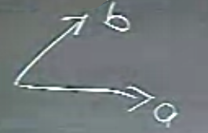
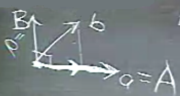
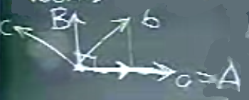

# Ders 17

Bugün dikgenlik (orthogonality) ders dizisinin sonuncusundayız. Dikgen
vektörleri, iki tanesini gördük, dikgen altuzayları gördük, ki bunlar satır
uzayı ve sıfır uzayı idi, bugün dikgen baz ve dikgen matrisi göreceğiz.

Şimdi birimdik (orthonormal) kelimesinden bahsetmek istiyorum. Bu arada bu
derste $q$ harfini dikgen vektörleri temsil etmek için kullanacağım.

Birimdik vektörler 

$$
q_i^Tq_j = \left\{ \begin{array}{lll}
0 & \textrm{eğer} & i \ne j \textrm{ ise}\\
1 & \textrm{eğer} & i = j \textrm{ ise}
\end{array} \right.
$$

Yani $q$ vektörleri diğer her $q$'ya (kendisi haricinde) dikgen. Her biri
bir diğerine 90 derece dik vektörlerden oluşan bir baz olması doğal bir
şey. $q$ vektörleri birim, bu sebeple kendisiyle noktasal çarpımı
1. Birimdik kelimesinin İngilizcesi orthonormal'ın içindeki "normal''
buradan geliyor, normalize edilmiş vektörlerimiz var.

Birimdik baza sahip olmak hesapları basitleştirir, çoğu hesabı iyileştirir,
sayısal lineer cebirin çoğunluğu birimdik vektörlerle iş yapmak etrafında
kurulmuştur, çünkü onlar aşırı büyümezler, aşırı küçülmezler, kontrol
altında iş yapmak mümkün olur.

Bu $q$'leri $Q$ içine koyacağız. Dersin ikinci kısmında eğer birimdik
olmayan bir $A$ matrisim var ise, onu nasıl birimdik yaparım, onu
göreceğiz. Şimdi üstteki 1 ve 0 içeren formülü matris olarak yazmak
istiyorum.

$$
Q = 
\left[\begin{array}{rrr}
\uparrow &  & \uparrow \\
q_1 & ... &  q_n \\
\downarrow &  & \downarrow 
\end{array}\right]
$$

O zaman 

$$
Q^TQ = 
\left[\begin{array}{rrr}
\leftarrow & q_1^T & \rightarrow \\
& &  \\
\leftarrow & q_n^T & \rightarrow 
\end{array}\right]
\left[\begin{array}{rrr}
\uparrow &  & \uparrow \\
q_1 & ... &  q_n \\
\downarrow &  & \downarrow 
\end{array}\right] = 
I
$$

Eğer $Q$ kare ise, $Q^TQ = I$  bize $Q^T = Q^{-1}$ olduğunu söyler. 

Örnek 

Her permutasyon matrisi 

$$
Q = 
\left[\begin{array}{rrr}
0 & 0 & 1 \\
1 & 0 & 0 \\
0 & 1 & 0 
\end{array}\right]
$$

kendi devriği ile çarpılınca, yani 

$$
Q^T = 
\left[\begin{array}{rrr}
0 & 1 & 0 \\
0 & 0 & 1 \\
1 & 0 & 0 
\end{array}\right]
$$

ile, sonuç $I$ olacaktır. Bir diğer örnek 

$$Q = 
\left[\begin{array}{cc}
\cos \theta & -\sin \theta \\
\sin \theta & \cos \theta \\
\end{array}\right]
$$

Fakat şu matris,

$$Q = 
\left[\begin{array}{cc}
1 & 1 \\
1 & -1 \\
\end{array}\right]
$$

dikgen matris değildir (şimdilik). Her kolonun uzunluğu $\sqrt{2}$, o
zaman tüm matrisi $\sqrt{2}$ ile bölerim,

$$Q = \frac{1}{\sqrt{2}}
\left[\begin{array}{cc}
1 & 1 \\
1 & -1 \\
\end{array}\right]
$$

Örnek 

$$Q = \frac{ 1}{2}
\left[\begin{array}{rrrr}
1 & 1& 1& 1 \\
1 & -1& 1& -1 \\
1 & 1& -1& -1 \\
1 & -1& -1& 1 
\end{array}\right]
$$

Örnek 

$$Q = \frac{ 1}{3}
\left[\begin{array}{rr}
1 & -2 \\
2 & -1 \\
2 & 2 
\end{array}\right]
$$

Bir kolon daha eklersem 

$$Q = \frac{ 1}{3}
\left[\begin{array}{rrr}
1 & -2 & 2\\
2 & -1 & -2 \\
2 & 2 & 1
\end{array}\right]
$$

Birimdik vektörler ve özelde Gram-Schmidt ile uğraşırken göreceğiz,
sürekli normal vektörlerle uğraştığımız için sürekli uzunluğa bölmeniz
gerekir, ve bu sürekli bir karekökü hesabın içine çeker. Üstteki örnek
temiz, karekök direk sayı olarak elde edildi. 

Dikgen matrisler niye iyidir? Onlar hangi hesapları basitleştirirler?
$Q$ ne için kullanılır? 

Diyelim ki bir diğer matrisi alıp $Q$'nun kolon uzayına yansıtmak
(projection) istiyorum. Yansıtma formülünü, matrisi $Q$ için yazarsak,

$$P = Q (Q^TQ)^{-1}Q^T$$

Formülde $Q$ olmasının bir avantajı, $Q^TQ = I$, o zaman 

$$P = Q Q^T$$

Bu yansıtma matrisinin özelliklerini / öğelerini (properties) kontrol
edelim. İki tane özellik olması gerekiyor. Eğer kolonlar birimdik ise, ve
yansıtma matrisi kare ise, o zaman kolon uzayı nedir? Tüm uzaydır!
Birimdik kolonlar o uzayı yaratmak / kapsamak (span) için
yeterlidir. Bu uzaydaki her türlü vektörü bu birimdik vektörlerin bir
kombinasyonu üzerinen üretebilirsiniz. Peki, tüm uzaya yansıtmak ne
demektir? Nasıl bir $P$ tüm uzaya yansıtır? Birim (identity) matrisi. Tüm
uzaya yansıtmak hiçbir şeyi değiştirmemek demektir aslında, ve bu
değişmezliği yapacak tek yansıtma matrisi $I$. 

$$P = Q Q^T = I \textit{ eğer I kare ise }$$

Bir diğer özellik yansıtma matrislerinin simetrik olması. Devriği ile
sağdan çarpılmak bir matrisi zaten simetrik yapar, şart $QQ^T$ için
geçerlidir. Bu özelliğin sebebi yansıtıp, sonra tekrar yansıtınca, ikinci
yansıtmanın değişim yaratmaması. Yani 

$$(QQ^T)(QQ^T) = QQ^T$$

olmalı. Kontrol edelim,

$$Q(Q^TQ)Q^T = QIQ^T = QQ^T$$

$Q$'nun özellikleri bize şu şekilde de yarar. Normal formül nedir? 

$$A^TA\hat{x} = A^Tb$$

$A$ yerine $Q$ ise

$$Q^TQ\hat{x} = Q^Tb$$

$Q^TQ = I$ olduğuna göre, 

$$\hat{x} = Q^Tb$$

İşler iyice basitleşti yani. $A$'li versiyonda sol taraftaki iç çarpımları
(inner product) hesaplamak gerekecekti, cebirsel çözüm için uğraşılacaktı,
vs. Bunlar $Q$ ile yok. $\hat{x}$'in $i$'inci elemanı $q_i^Tb$, yani 

$$\hat{x}_i = q_i^Tb$$

Üstteki formülün matematiğin en önemli formüllerinden biri olduğu
söylenebilir. Yani elimizde birimdik baz var ise, yansımasının $i$'inci
öğesi yukarıdaki gibidir. 

Şimdi dersin ikinci bölümüne gelelim. Diyelim ki elimizde birimdik matris
yok, bağımsız vektörler var, onları birimdik yapacağız. Gram-Schmidt
burada ortaya çıkıyor. Tabii "birimdik yapmak'' nedir, onu da
açıklayalım. Eğer vektör $a,b$ bağımsız vektörleri birbirine dik değilse,
onları değişime uğratmadan dik hale getiremeyiz. Birimdikleştirme işlemi
vektörleri "eski haline mümkün olduğunca yakın kalmak suretiyle''
dikleştirir ve normalleştirir. 

Gram-Schmidt

GS hesabı eliminasyon ile aynı şey değildir, amacımız üçgensel değil,
amacımız bir matrisi dikgen, kolonlarını birimdik yapmak. İki
vektörümüz var diyelim, $a,b$. Belki 12 boyutlu bir ortamdalar, belki
(alttaki gibi) 2 boyuttalar. Vektörler bağımsız. 



Bu iki vektörden $q_1,q_2$ birimdik vektörlerini çıkartmak istiyorum. Ya
da, önce dikgen $A,B$, sonra birimdik $q_1,q_2$ diyelim. Bunun için önce

$$q_1 = \frac{ A}{||A||}, q_2 = \frac{ B}{||B||} $$

Aslında $a$'dan $A$ alınca, o vektörün işi bitmiş kabul edilebilir. Bir yön
tamam, ama ilk yön olduğu için onun dikgen hali yeterli. Şimdi ikinci
vektör nasıl birimdik olacak, çünkü artık birinciye göre dik olmalı, onu
olduğu gibi alamayız. 



Aradığımız vektör $b$'nin $a$'ya yansıması değil, ona tam dik olan
$e$. Eğer $b$'nin formülü "$b$'nin $a$'ya yansıması, artı $e$'' ise, o
zaman ters yöne gitmek için çıkartma işlemini kullanırız,

$$B = b - [yansıma]$$

$b$'nin $a$'ya yansıması nedir? Yerine koyalım,

$$B = b - \frac{ A^Tb}{A^TA}A$$

Bu formül doğru mu? Kontrol edelim, eğer $B$ hakikaten $A$'ya dikgen bir
vektör veriyorsa, o zaman $A^T$ ile çarpılınca sıfır elde etmeliyiz. 

$$A^TB = A^T(b - \frac{ A^Tb}{A^TA}A)$$

$$= A^Tb - \frac{ A^Tb}{A^TA}A^TA$$

$$= A^Tb - A^Tb = 0$$

Peki ya iki değil üç tane vektör olsaydı? Yani $A,B$'ye ek olarak bir de
$C$ hesaplamamız gerekiyor. 



Bu hesaba şu şekilde bakabiliriz, aynen $B$'yi bulmak için $b$'den $a$ yönünde
olan yansımasının kısmını çıkarttığımız gibi, $C$'yi bulmak için $c$'den $a$ ve
$b$ yönünde olan yansımasının kısımlarını çıkartmayı düşünebiliriz.

$$C = c - \frac{ A^Tc}{A^TA}A - \frac{ B^Tc}{B^TB}B$$

Yani $C \perp A$, $C \perp B$. 

Örnek

$$
a = 
\left[\begin{array}{r}
1 \\ 1 \\ 1
\end{array}\right],
b = 
\left[\begin{array}{r}
1 \\ 0 \\ 2
\end{array}\right]
$$

Hemen $A = a$ deriz. $B$ nedir?

$$
B = 
\underbrace{
\left[\begin{array}{r}
1 \\ 0 \\ 2
\end{array}\right]}_{b}
-
\frac{ 3}{3}
\underbrace{
\left[\begin{array}{r}
1 \\ 1 \\ 1
\end{array}\right]}_{A}
=
\left[\begin{array}{r}
0 \\ -1 \\ 1
\end{array}\right]
$$

$Q$'yu oluşturalım. Unutmayalım, her $q$ birim vektör, normalize
olmalı. Problem değil, değerleri üstten alırken her elemanı uzunluğuna
böleriz, 

$$Q =
\left[\begin{array}{rrr}
\uparrow &  & \uparrow \\
q_1 & ... &  q_n \\
\downarrow &  & \downarrow 
\end{array}\right]
=
\left[\begin{array}{rr}
1/\sqrt{3} & 0 \\
1/\sqrt{3} & -1/\sqrt{2} \\
1/\sqrt{3} & 1/\sqrt{2} 
\end{array}\right]
$$

Hatırlarsak ilk halimiz

$$A =
\left[\begin{array}{rr}
1 & 1 \\
1 & 0\\
1 & 2
\end{array}\right]
$$

şeklindeydi. 

$Q$'nun kolon uzayı ile $A$'nin kolon uzayı arasındaki bağlantı, fark
nedir? Kolon uzayı bir matrisin kolonlarının tüm kombinasyonları ise, 3
boyutlu uzayda iki kolonum var, demek ki kolon uzayı bir düzlem (plane),
her iki matris için durum bu. Alaka nerede? İki düzlem de aynı! Tek
yaptığım aynı uzayı yaratan ama birbirine dik iki yeni vektör yaratmak
oldu. $Q$ vektörlerinden daha memnunum çünkü $Q$ birimdik. 

Peki Gram-Schmidt'i Lineer Cebir dilinde nasıl daha temiz sekilde
gösteririm? Eliminasyon mesela 

$$A = LU$$

olarak gösterilir. Gram-Schmidt'in karşılığı nedir? Şudur,

$$A = QR$$


$$
\left[\begin{array}{rrr}
\uparrow &  \uparrow \\
a_1 &  a_2 \\
\downarrow &  \downarrow 
\end{array}\right]
=
\left[\begin{array}{rrr}
\uparrow &  \uparrow \\
q_1 &  q_2 \\
\downarrow &  \downarrow 
\end{array}\right]
\left[\begin{array}{rrr}
 &   \\
0 &  
\end{array}\right]
$$

Yani $R$ üst üçgensel (lower triangular) bir matristir, sol alt köşe
sıfırdır. Niye? 

$$
= \left[
\begin{array}{rrr}
\uparrow &  \uparrow \\
q_1 &  q_2 \\
\downarrow &  \downarrow 
\end{array}\right]
\left[\begin{array}{rrr}
a_1^Tq_1 &  * \\
a_1^Tq_2 &  *
\end{array}
\right]
$$

Sıfır $a_1^Tq_1$'dan geliyor. Özetlemek gerekirse, $A$'yi alıp $Q$'yu elde
ediyoruz, ve bu iki matris arasındaki ilişki üst üçgensel olan $R$
matrisi. 

Gram-Schmidt Python kodu altta bulunabilir.

```python
import numpy.linalg as lin

A = np.array([[3., 4.],[5., 6.]])
m,n = A.shape
R = np.zeros((m,n))
Q = np.zeros((m,n))

for j in range(n):
    v = A[:,j]
    for i in range(j):
        R[i,j] = np.dot(Q[:,i].T,A[:,j])
        v=v-np.dot(R[i,j],Q[:,i])
    R[j,j] = lin.norm(v)
    Q[:,j] = v/R[j,j]
print (Q, R)
```

```
[[ 0.51449576  0.85749293]
 [ 0.85749293 -0.51449576]] [[ 5.83095189  7.20294058]
 [ 0.          0.34299717]]
```


