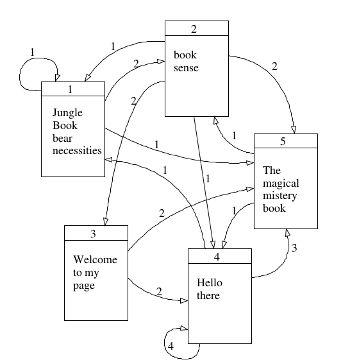
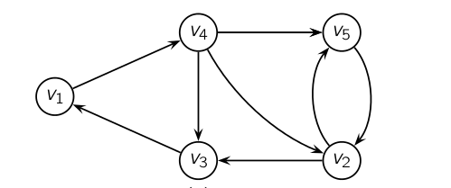
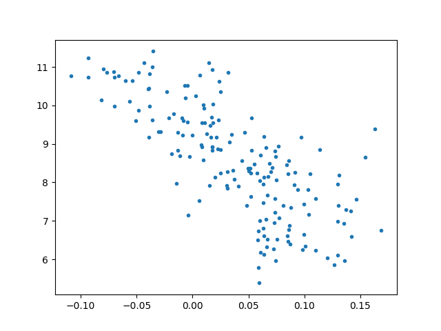

# Google İşleyişi, Ekonomi Teknikleri, Özdeğer, Özvektörler

Lineer Cebir hocaları Google'a müteşekkir olmalı, çünkü bu ünlü arama
motorunun kullandığı PageRank tekniğinin özü aslında lineer cebirin
temelini oluşturan kavramlardan özdeğer / özvektör hesabı. Öğrenciler
"niye bu kavramları öğreniyoruz hocam?''  diye sorunca artık cevap
kolay: "bu yöntemi Google da kullanıyor!''.

Şimdi arama motorunun yapması gerekenleri düşünelim: Google'a bir kelime
yazdığımızda geri gelen sonuçlar nasıl kararlaştırılır? İlk akla gelen
yöntem tabii ki Web'deki tüm sayfaların (milyarlarca sayfa) sayfalar
üzerindeki kelimelerin o sayfa ile ilişkilendirilmesi ve arama yapılınca
kelimeye göre sayfa geri getirilmesi. Mesela alttaki örnekte "book
(kitap)'' yazınca geriye 1., 2. ve 5. sayfalar geri gelecek. Fakat hangi
sırada? Bu sayfalardan hangisi diğerlerinden daha önemli?



PageRank'in temelinde daha fazla referans edilen sayfaların daha üstte
çıkması yatar. Hatta o referans eden sayfaların kendilerine daha fazla
referans var ise bu etki ta en sondaki sayfaya kadar yansıtılır, hatta bu
zincir baştan sona her seviyede hesaplanabilir. Peki bu nasıl
gerçekleştirilir?

PageRank Web sayfalarını bir Markov Zinciri olarak görür. Markov Zincirleri
seri halindeki $X_n, n=0,1,2,..$ rasgele değişkenini modeller ve bu
değişkenler belli sayıdaki konumların birinde olabilirler. Mesela konumları
bir doğal sayı ile ilintilendirirsek $X_n = i$ olabilir ki $i=\{0,1,..\}$
diye kabul edelim.

İlerlemeden önce Markov Zincirleri konusuna bakmak [1,6] iyi olur.

Şimdi en baştaki Web sayfalarına ait geçişleri yazalım,

```python
P = [[1./4, 2./4, 0, 0, 1./4],
     [1./6, 0, 2./6, 1./6, 2./6],
     [0, 0, 0, 2./4, 2./4],
     [1./8, 0, 0, 4./8, 3./8],
     [0, 1./2, 0, 1./2, 0]]

P = np.array(P)
print (P)
```

```
[[ 0.25        0.5         0.          0.          0.25      ]
 [ 0.16666667  0.          0.33333333  0.16666667  0.33333333]
 [ 0.          0.          0.          0.5         0.5       ]
 [ 0.125       0.          0.          0.5         0.375     ]
 [ 0.          0.5         0.          0.5         0.        ]]
```

Şimdi üst metotu kullanarak durağan dağılımı hesaplayalım. Herhangi bir
başlangıç vektörünü $P$ ile 20 kere  çarpmak yeterli olur.

```python
import numpy.linalg as lin
x=np.array([.5, .3, .1, .1, 0]) # herhangi bir vektor
for i in range(20): 
    x = np.dot(x,P)
print ('pi = ', x)
```

```
pi =  [ 0.10526316  0.18421053  0.06140351  0.38596491  0.2631579 ]
```

Not: Aslında cebirsel olarak $P$'yi 20 kere kendisiyle çarpmak ve sonucu
başlangıç vektörü ile bir kere çarpmak ta düşünülebilirdi. Fakat 20 kere
vektör / matris çarpımları yapmak, 20 kere matris / matris çarpımı
yapmaktan daha verimli olacaktır. Büyük Veri ortamı için de bu söylenebilir.

Neyse, eğer özvektör hesabını kendimiz elle yapmak yerine direk kütüphane
çağrısı kullansaydık,

```python
import numpy.linalg as lin
evals,evec = lin.eig(P.T)
pi =  evec[:,0] / np.sum(evec[:,0])
print (np.abs(pi))
```

```
[ 0.10526316  0.18421053  0.06140351  0.38596491  0.26315789]
```

Aynı sonuca ulaştık. Bu sonuç gösteriyor ki "book'' yazdığızda Google bize
5. sayfayı en başta olacak şekilde sonuç döndürmeli, çünkü onun durağan
dağılımı 1,2,5 sayfalarının arasında en yüksek.

Durağan Dağılıma Bakış

MZ ve durağan dağılımın PageRank'le alakasını bir daha düşünelim. MZ ile
$n$ adım sonrasını hesaplayabiliyoruz, durağan dağılım ise sonsuz adım
sonrasını ifade ediyor. Ve bu dağılım, bir anlamda, sonsuz yapılan adımlar
sırasında *en fazla hangi konumlarda* zaman geçirileceğini
gösteriyor. Konum yerine sayfa dersek durağan dağılımın niye en önemli
sayfaları belirlemek için önemli olduğunu anlarız. 

Kullanıcı herhangi bir sayfada iken hangi diğer sayfalara gideceği o sayfa
üzerinde bağlantılar üzerinden anlaşılır, PageRank bu bağlantının
mevcudiyetine bakar sadece, o mevcudiyet üzerinden bir geçiş olasılığı
hesaplar, ve bu olasılığa göre (raslantısal şekilde) bağlantının takip
edileceği düşünülür. Bu arada çoğunlukla sayfalar arasındaki bağlantıların
ağırlığı 1 olacaktır, fakat örnek amaçlı 2,3 gibi sayılar da kullanılıyor. 

Rasgele Sayfa Geçişi

Google veri temsili üzerinde bazı ekler yapmaktadır, mesela kullanıcının
hiçbir bağlantı takip etmeyip tarayıcıya direk URL girerek başka bir
sayfaya zıplaması (teleporting) bir şekilde temsil edilmelidir. Ayrıca hiç
dışa bağlantı vermeyen sayfalar (ölü noktalar) hesaba katılmalıdır. Şimdi
$\pi^T$ yerine $p$, $P$ yerine $N$ kullanalım, PageRank özyineli
algoritması

$$ p = N^Tp $$ 

olarak gösterilebilir. 

Bu her iki durum için formül şu şekilde ikiye ayırılır,

$$ p = (1-d)N^Tp + dN_f^Tp $$

$$ = ((1-d)N^T + dN_f^T) p $$

$$ = M^Tp $$

ki,

$$M = (1-d)N^T + dN_f^T$$ 

olacaktır. $N_f$ bir normalize edilmiş "zıplama'' matrisidir, yani her
sayfadan her diğer sayfaya bir bağlantı "varmış gibi'' yapar, mesela 5x5
boyutunda tüm öğeleri 0.20 olacaktır. $d$ bir ağırlık sabitidir, Google'ın
bunu 0.85 olarak tanımladığı duyulmuştur, ve gerçek bağlantı matrisi ve
rasgele zıplama matrisi arasında bir ağırlık tanımlar, her ikisinde de
birazcık alarak (daha çok ana $N$'den tabii) niahi matrisi oluşturur. Örnek
olarak şu grafiğe bakalım, 



```python
N = [[0, 0, 0, 1., 0],
     [0, 0, 1./2, 0, 1./2],
     [1, 0, 0, 0, 0],
     [0, 1./3, 1./3, 0, 1./3],
     [0, 1, 0, 0, 0]]

N = np.array(N)

Nf = 0.20 * np.ones((5,5))
d = 0.85
M = d*N + (1-d)*Nf
x=np.array([.5, .3, .1, .1, 0]) # herhangi bir vektor
for i in range(20): 
    x = np.dot(x,M)
print ('result = ', x )
```

```
result =  [ 0.18959094  0.24375097  0.18775335  0.19115138  0.18775335]
```

Sonuca göre $v_2$ en yüksek PageRank değerine sahip. 

Mimari

Google tabii ki arama sonuçlarını iyileştirmek için yıllar içinde diğer ek
fonksiyonları motoruna ekledi. Duyumlarımıza göre artık PageRank gibi
onlarca ek kriter kullanılmaktadır; fakat PageRank hala çok önemli ve
şirketin kuruluşu bağlamında Google'ı Google yapan algoritmaydı, onun diğer
motorlara nazaran elindeki avantajı, en büyük ilerlemesiydi.

Sistem kodlaması açısından PageRank'e tüm Web sayfaları ve onların
arasındaki ilişkiler verilmelidir, bu milyarlarca sayfa ve onların
arasındaki bağlantılar demektir. Google bunu yapabilmek için Web "ağını''
örümcek (spider) programları ile sürekli geziyor, ve bu veriyi alıp,
PageRank'e hesap için aktarıyor.

Ülkelerin Ekonomik Kapasiteleri

İstatistiki fizik alanından ekonomiye geçiş yapan araştırmacı Hidalgo'ya
göre ekonomiler için en önemli olan bilgi, yöntem bilgisi (know-how), yani
bilgiyi planlamaya, üretime yönelik kullanabilme yetisi ve bu bilgilere
sahip pek çok insanın olduğu bir ağ. Mesela yazılım alanında Silikon Vadisi
bu tür yoğun bir ağ. Peki ülkelerde bu ağların kuvvetini nasıl ölçeriz?
Ürünlerin karmaşıklığını kullanarak belki bunu yapabiliriz. 

Ekonomide her ürünün bir karmaşıklığı var - bir cep telefonunu üretmek için
gereken bilgi düzeyi, koyun yünü üretmek için gereken bilgi düzeyinden daha
farklı. Bir ülkenin ekonomisinin onun ürettiği ürünleri ortalama
karmaşıklığına oranlı olduğunu düşünebiliriz, ters yöne de gidilebilir, bir
ürünün karmaşıklığı onu üreten ülkelerin karmaşıklığına oranlıdır. Fakat
şimdi burada bir tavuk-yumurta durumu var, ne ülke ne de ürün
karmaşıklığını başta biliyoruz. Bu problemi nasıl çözeriz? Özdeğer ve
özvektörler bu tür problemleri çözmek için sürekli kullanılır.

Ana veri ülkenin hangi ürünü ihraç ettiği. Eğer bir ülke $i$ ürün $j$'yi
üretmiş ve ihraç etmiş ise $m_{ij}=1$ olsun, üretmiyor ise $m_{ij}=0$ olsun
denebilir, fakat bir ülkenin herhangi bir ürünü azıcık bile üretmiş olması
yeterli değil. Bize gereken, [4]'te bahsedilen, ülkenin bir ürünü "hakkına
düşenden'' daha fazlasının ihraç ettiği durumlar. Mesela 2008 yılında soya
fasulyesi 42 milyar dolarlık hacim ile dünya ticaretinin yüzde 0.35\%'ini
temsil ediyordu. Bu toplam içinde Brezilya yaklaşık 11 milyar dolarlık
ihraç yaptı, ve o sene Brezilya'nın toplam ihracatı 140 milyar dolar olduğu
için soya fasulyesi Brezilya'nın ihracatının yüzde 7.8'ini oluşturdu. Bu
miktar Brezilya'nın "hakkına düşen'' ihracatın 21 katıydı (yüzde 7.8 bölü
yüzde 0.35). Yani burada önemli bir ihracat var, ve bu verimizde 1 olarak
işaretlenmeli. O zaman kullanacağımız önişlem büyüklüğüne RCA dersek,

$$
RCA_{ij} = \frac{X_{ij}}{\sum_i X_{ij}} / \frac{\sum_j X_{ij}}{\sum_{i,j} X_{i,j}}
$$

$RCA_{ij} > 1.0$'den büyük ise $m_{ij}=1$ deriz, yoksa 0. 

Birazdan ortalama hesabı için gerekecek ağırlıkları hesaplayalım [5]
$v_{ij} = m_{ij} / d_i$, $w_{ij}=m_{ij}/u_j$. Burada $d$ kelimesi
çeşitlilikten (diversification) geliyor, yani herhangi bir ülkenin kaç
değişik ürünü ürettiği, $u$ ise ürünün yaygınlığı (ubiquity), herhangi bir
ürünü kaç diğer ülkenin ürettiği. Ülke $i$ ve ürün $j$ için bunlar
$d_i = \sum_j m_{ij}$ ve $u_j = \sum_i m_{ij}$.

O zaman ülke $i$'nin ekonomik karmaşıklık / yetkinlik düzeyi $c_i$, ve ürün
$j$ karmaşıklığı $p_j$ şöyle gösterilebilir,

$$
c_i = \alpha \sum_j v_{ij} p_j
$$

$$
p_j  = \beta \sum_i w_{ij} c_i
$$

ki $\alpha,\beta > 0$. Yani bir ülkenin karmaşıklığı onun ürettiği ürünlerin
karmaşıklığının ortalamasıdır, aynı zamanda bir ürünün karmaşıklığı o ürünü
üreten ülkelerin karmaşıklığının ortalamasıdır. Tavuk-yumurta durumu artık
matematiksel olarak üstte görülüyor. Şimdi $c$, $p$ değişkenlerini bir
matris içine alalım, $V=[v_{ij}]$ and $W=[w_{ij}]$. O zaman daha kısaca
$c = \alpha V p$ ve $p = \beta W c$ diyebiliriz. 2. formülü 1. içine
sokarsak $c = \alpha \beta (V^T W) c$ olur, 1. formülü 2. içine sokarsak
$p = \alpha \beta (V W^T) p$. Bu demektir ki ülkelerin ve ürünlerin
çetrefilliği sırasıyla $V^T W$'nin ve $V W^T$'nin özvektörü üzerinden
hesaplanabilir!

Not: hangi özvektör? [4]'e göre en büyük 1. özdeğere tekabül eden özvektör
kullanışlı değil, bu vektördeki ağırlıkların hepsi eşit. Bu durumda
2. büyük özdeğerin özvektörü kullanılıyor. 

Altta bu yaklaşımı kullanan tüm ülkelerin 2014'te yaptığı ihracat verisini
kullanan hesaplar bulunabilir, veri için [2]'yi temel aldık, bizim
ek işlemlerimiz sonrası [3].

```python
import pandas as pd, zipfile
with zipfile.ZipFile('/opt/Downloads/skdata/hidalgo.zip', 'r') as z:
      df =  pd.read_csv(z.open('hidalgo.csv'),sep='\t')
      gdp =  pd.read_csv(z.open('gdp1416.csv'),sep=',',index_col=0)
      hs =  pd.read_csv(z.open('hs.csv'),sep='|')
      hs2 =  pd.read_csv(z.open('hs2.csv'),sep=',',index_col='ProductCode_x')
```

```python
print (len(df))
print (df.tail(10))
```

```
726013
        year origin    hs92  export_val  import_val  export_rca  import_rca
726003  2014    ven  961610     39395.0   2026297.0       0.011       0.947
726004  2014    ven  961620         NaN   1084958.0         NaN       2.413
726005  2014    ven  961700     29666.0   1701096.0       0.005       0.495
726006  2014    ven  961800      2066.0    113839.0       0.001       0.074
726007  2014    ven  970110    210867.0    385141.0       0.004       0.014
726008  2014    ven  970190    179993.0    118881.0       0.136       0.155
726009  2014    ven  970200    976805.0         NaN       0.563         NaN
726010  2014    ven  970300    717009.0    277338.0       0.068       0.045
726011  2014    ven  970500     12723.0         NaN       0.004         NaN
726012  2014    ven  970600         NaN      2484.0         NaN       0.000
```

Ülkeler satırlarda, ürünler kolonlarda olacak şekilde bir tablo oluşturalım,

```python
cp = df.pivot_table('export_val', index='origin', columns='hs92')
print (cp.shape)
print (len(np.unique(df.hs92)), 'urun')
```

```
(220, 4858)
4858 urun
```

```python
denom = cp.sum(axis=1) / cp.sum().sum()
denom = cp.sum(axis=1) / cp.sum().sum()
cp2 = cp.div(cp.sum(axis=0).T)
cp2 = cp2.div(denom,axis=0)
cp2 = cp2.fillna(0)
cp2[cp2 > 1.0] = 1.0
cp2[cp2 != 1.0] = 0.0
cp3 = cp2
cp4 = cp3.div(cp3.sum(axis=1),axis=0)
cp5 = cp3.div(cp3.sum(axis=0),axis=1)
print (cp4.shape, cp5.shape)
```

```
(220, 4858) (220, 4858)
```

Özanaliz ile en ileri 10 ülkeye bakalım, ülkeler için hesaplanan vektöre
ECI adı veriliyor (economic complexity index -ekonomik çetrefillik
indisi-),

```python
import scipy.linalg as lin
print (cp4.shape)
uc,vc = lin.eig(np.dot(cp4,cp5.T))
print (vc.shape)
eci = np.array(vc)[:,1]
print (len(eci))
print (np.argmax(eci))
top_countries = cp.index[np.argsort(eci)[:10]]
print (top_countries)
```

```
(220, 4858)
(220, 220)
220
181
Index([u'jpn', u'che', u'deu', u'kor', u'swe', u'xxb', u'usa', u'sgp', u'cze',
       u'fin'],
      dtype='object', name=u'origin')
```

Şimdi ürünler, buna PCI deniyor (product complexity index -ürün çetrefillik
indisi-). En çetrefil 10 ürün (en sağdaki en yüksek olacak şekilde),

```python
import scipy.sparse.linalg as lin
import scipy.sparse as sps

scp4 = sps.lil_matrix(cp4)
scp5 = sps.lil_matrix(cp5)

A = scp4.T.dot(scp5)
up,vp = lin.eigs(A,k=2)
pci = np.array(vp)[:,1]
top_prods = cp.columns[np.argsort(pci)[-10:]]
print (top_prods)
```

```
Int64Index([851410, 390940, 847990, 847790, 840999, 852610, 841221, 848390,
            870810, 848590],
           dtype='int64', name=u'hs92')
```

Bu ürünler hangileri?

```python
pd.set_option('expand_frame_repr', False)
top_prods2 = [str(x) for x in list(top_prods)]
hs2_index_str = hs2.index.astype(str) # Ensure hs2 index is string type for comparison
valid_top_prods = [p for p in top_prods2 if p in hs2_index_str]

print (len(valid_top_prods))
if valid_top_prods: # Check if there are any valid products to avoid error on empty list
    print (hs2.loc[valid_top_prods][['Product Description_y','Product Description_x']])
else:
    print("No matching product codes found in hs2 for the top products.")
```

```
10
                                           Product Description_y                              Product Description_x
ProductCode_x                                                                                                      
851410         Industrial or laboratory electric furnaces and...             - Resistance heated furnaces and ovens
390940         Amino-resins, phenolic resins and polyurethane...                                  - Phenolic resins
847990         Machines and mechanical appliances having indi...                                            - Parts
847790         Machinery for working rubber or plastics or fo...                                            - Parts
840999         Parts suitable for use solely or principally w...                                           -- Other
852610         Radar apparatus, radio navigational aid appara...                                  - Radar apparatus
841221                                 Other engines and motors.                       -- Linear acting (cylinders)
848390         Transmission shafts (including cam shafts and ...  -Toothed wheels, chain sprockets and other tra...
870810         Parts and accessories of the motor vehicles of...                        - Bumpers and parts thereof
848590         (-2006) Machinery parts not specified or inclu...                                    (-2006) - Other
```

Acaba ECI'yi 2014 yılında ülkelerin kişi başına gayrısafi yurtiçi
hasılasını tahmin etmek için kullanabilir miyiz?

```python
cindex = [x.upper() for x in cp.index]
ecigdp = pd.DataFrame(eci,index=cindex)
ecigdp = ecigdp.join(gdp)
print (ecigdp.shape)
ecigdp.columns = ['eci', u'gdp2014', u'gdp2016']
ecigdp['prods'] = np.array(cp3.sum(axis=1))
ecigdp = ecigdp.dropna()
print (ecigdp.tail())
import statsmodels.formula.api as smf
results = smf.ols('np.log(gdp2014) ~ prods', data=ecigdp).fit()
print (results.rsquared_adj)
results = smf.ols('np.log(gdp2014) ~ eci', data=ecigdp).fit()
print (results.rsquared_adj)
```

```
(220, 3)
          eci      gdp2014      gdp2016  prods
WSM  0.025062  3761.912686  3524.649880  209.0
YEM  0.075479   679.667360  1101.117444  147.0
ZAF  0.008537  7504.295250  7627.851926  742.0
ZMB  0.048409  1622.409958  1620.823290  182.0
ZWE  0.063000   908.829980   932.548383  275.0
0.230701679034
0.55503440264
```

Sonuç yüzde 55 varyansı açıklıyor, fena değil. Yani bir ülkenin zenginliği
onun ürettiği ürünlerin çetrefilliği ile direk alakalı. Dikkat edersek düz
ürün sayısını kullanarak yapılan regresyon o kadar başarılı değil, demek ki
ECI hakikaten bir niceliği yakalayabilmiş.

```python
plt.plot(ecigdp.eci,np.log(ecigdp.gdp2014),'.')
plt.savefig('linear_app03eigen_01.png')
```



Bu alanda daha fazla okuma yapmak isteyenler için [4] güzel bir
kaynak. Üretime uygulanabilen bilgiden bahsedilirken mesela gelişmiş
ekonomilerdeki kişi ağlarında, o kişilerde olan yazılarak anlatılması zor
olan bilgilerden (tacit knowledge) bahsediliyor. Bu "tecrübe'' diye
sınıflanabilecek bir bilgi ama tam o da değil. Bu bilgi kişinin çalışma
şeklinden, neye, nasıl, nerede odaklanacağıyla, günlük çalışma şekli,
davranış şekliyle alakalı, yazıtsal olmayan bir tür bilgi. Aktarılması son
derece zor, neredeyse tek yol o kişiyle yanyana çalışmak. Yoğun bilgi
ağlarının belli yerlerde olmasının bir sebebi de bu.

Kaynaklar

[1] Ross, S., *Introduction to Probability Models, 8th Edition*

[2] Hidalgo, *Veri*, [http://atlas.media.mit.edu/en/resources/data/](http://atlas.media.mit.edu/en/resources/data/)

[3] Bayramlı, *Urun Verisi*, [Data](https://www.dropbox.com/scl/fi/cqqoyqyfpfwkkbiwl4u1z/hidalgo.zip?rlkey=ov8wvd31gncwe3qtt6n8j3uox&st=lfnl4pmi&raw=1)

[4] Hidalgo, *The Atlas of Economic Complexity*, [http://atlas.cid.harvard.edu](http://atlas.cid.harvard.edu)

[5] Inoua, *A Simple Measure of Economic Complexity*, [https://arxiv.org/abs/1601.05012](https://arxiv.org/abs/1601.05012)

[6] Bayramlı, *Istatistik, Markov Zincirleri*

