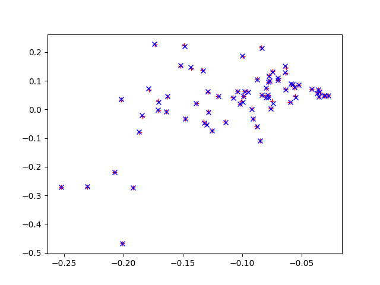

# Rasgele İzdüşümü (Random Projection) 

Eğer ana matrisimiz $A$'nin çok fazla kolonu var ise bunu bir şekilde azaltmanın
yollarını arayabiliriz. [1,6]'ya göre bunu yapmanın yollarından biri rasgele
izdüşüm hesabıdır. İlk önce $n \times k$ boyutunda bir Gaussian rasgele matris
$\Omega$ üretiriz. Ardından

$$ Y = A\Omega $$

hesaplanır. 

İzdüşümü yapılmış matrisın iş mesafelerini muhafaza ettiği ispatlanmıştır,
sayısal olarak kontrol etmek istersek,

```python
import numpy.linalg as lin
import pandas as pd
from scipy.spatial.distance import cdist
t = 'euclid'
k = 7
df = pd.read_csv("../linear_app10rndsvd/w1.dat",sep=';',header=None)
A = np.array(df)[:,1:]
print (A.shape)
d1 = cdist(A,A,metric=t)
d1 = d1 / np.sum(d1)
print (np.mean(d1),d1.shape)

# izdusumu yap
Y = np.dot(A, np.random.normal(0,1,(A.shape[1],k)))
# yeni matrisin ic mesafeleri nedir
d2 = cdist(Y,Y,metric=t)
d2 = d2 / np.sum(d2)
print (np.mean(d2),d2.shape)

# onceki mesafeler ile fark ortalamasi
print (np.mean(np.abs(d1-d2)))
```

```
(71, 30)
0.00019837333862328903 (71, 71)
0.00019837333862328903 (71, 71)
7.264191067984383e-06
```

Demek ki satırlar arası mesafeler muhafaza edildi. Birazdan işlenecek SVD
yöntemi de aynı şekilde boyut azaltma yapabilir, altta rasgele izdüşümü
SVD'ye yardım etmesi için işleyeceğiz, fakat aslında rasgele izdüşümü SVD
yerine de kullanılabilir.

Eğer mesafeler muhafaza ediliyorsa daha ufaltılmış kolon boyutları üzerinde,
mesela tavsiye algoritmaları için, yakınlık hesapları yapmak daha kolaylaşır.
Bir matris $A$ kullanıcı-ürün şeklinde tasarlanmış ise, herhangi bir kullanıcıya
yakın diğer kullanıcıları bulmak azaltılmış boyutta daha hızlı işleyecektir.

SVD

Daha önce gördüğümüz $Y$ üzerinde QR ayrıştırması yaparız, ve elde edilen $Q$
ile

$$ B = Q^T A $$

hesabını da yapabiliriz ve $B$ üzerinde SVD ayrıştırması hesaplanabilir,

$$ B = \hat{U}\Sigma V^T $$

ve

$$ U = Q\hat{U} $$

matrisini hesaplarız. Ana fikir şuradan geliyor,

$$ A = QQ^TA $$

ki bu standart bir cebir numarası olurdu, $Q$ yerine rasgele
izdüşumdan gelen yaklaşıksal $Q$'yu kullanabiliriz, o zaman

$$ A \approx \tilde{Q}\tilde{Q}^TA $$

olacaktır. Yani izdüşümden gelen $Q,R$ gerçek versiyona yakın. Üstteki
çarpımda $R$ yerine $B$ harfi kullanıyoruz, ki $B = \tilde{Q}^T A$
oluyor, yani

$$ A \approx \tilde{Q}B $$

ya da 

$$ B \approx \tilde{Q}^T A $$

O zaman İstatistik notlarımız altındaki [5] yazısında olduğu gibi $B$'nin
SVD'sini alarak yaklaşıksal bir $U$ elde etmek mümkün olacaktır.

Bu yaklaşıksal metot işler çünkü noktaları yaklaşıksal bir altuzaya
yansıttıktan sonra elde edilen yeni noktaların arasındaki mesafelerin
fazla bozulmadan muhafaza edildiği söylenir, daha detaylı söylemek
gerekirse, n-boyutlu verileri $O(\log n / \epsilon^2)$ boyutundaki bir
rasgele altuzaya yansıtmak, pozitif olasılıkla, yeni noktaların
arasındaki mesafeleri sadece $1 \pm \epsilon$ ölçüsünde değiştirir
[2]. $Y$'nin, $A$'nin "menzilini" iyi temsil ettiği de söylenir.

Test olarak şuradaki [3] veri seti üzerinde görelim:

```python
import numpy.random as rand
import numpy.linalg as lin
import pandas as pd

k = 7 # izdusum uzayinin boyutlari
df = pd.read_csv("w1.dat",sep=';',header=None)
A = np.array(df)[:,1:]

print "A",A.shape

rand.seed(1000)

Omega = rand.randn(A.shape[1],k)

Y = np.dot(A, Omega) 

print "Y", Y.shape

Q, R = lin.qr(Y) 

# niye devrigi ile is yaptigimizi altta anlatiyoruz
BT = np.dot(A.T, Q)

print "Q", Q.shape
print "BT", BT.shape

x, x, V = lin.svd(BT)

print 'V', V.shape

Uhat = V.T # cunku B=USV', B'=VSU' U of B icin V' lazim

print "Uhat", Uhat.shape

U = np.dot(Q, Uhat) 

print "U", U.shape

plt.plot(U[:,0],U[:,1],'r+')

plt.hold(True)
        
# gercek SVD ile karsilastir

U, Sigma, V = lin.svd(A);
plt.plot(U[:,0],-U[:,1],'bx')
plt.savefig('rnd_1.png')
```

```
A (71, 30)
Y (71, 7)
Q (71, 7)
BT (30, 7)
V (7, 7)
Uhat (7, 7)
U (71, 7)
```



Mavi noktalar $A$ üzerinde "gerçek" SVD sonucu, kırmızılar yansıtma
sonrası elde edilen $U$. Sonuçlar çok iyi. 

$B$ yerine $B^T$

Kodlama açısından, ya da büyük veri bağlamında başka amaçlar [4] için
$B = Q^T A$ yerine $B^T = A^T Q$ hesabı yapmak istenilebilir. Niye?
Çünkü çıktı olarak $n \times k$ matrisi istiyor olabiliriz, $k \times
n$ matrisi istemiyoruz, yani çok olanın satırlar olmasını istiyoruz,
kolonlar olmasını istemiyoruz.

O zaman, elde edilen $B^T$ işe, $B$ üzerinde değil $B^T$ üzerinde SVD
alacağız demektir, bu da sonuçları birazcık değiştirir, yani

$$ B = U\Sigma V^T $$

$$ B^T = V\Sigma U^T $$

haline gelir. Yani $B$'nin $U$'sunu elde etmek için $B^T$'nin SVD'si
sonrasında ele geçen sonuçta $(U_{BT}^T)^T$ yapmak gerekir. Her şeyin
hafızada yapıldığı durumda bu fark yaratmaz, fakat "ilerisi için", yani
eşle / indirge ortamları için akılda tutmak faydalı olur.

Kaynaklar

[1] Halko, N., *Randomized methods for computing low-rank approximations of matrices*

[2] Gupta, A., Dasgupta, S., *An Elementary Proof of a Theorem of Johnson and Lindenstrauss*

[3] UCI Machine Learning Repository, 
    *Breast Cancer Data Set*, 
    [archive.ics.uci.edu/ml/datasets/Breast+Cancer](archive.ics.uci.edu/ml/datasets/Breast+Cancer)

[4] Bayramlı, *SVD Factorization for Tall-and-Fat Matrices on Map/Reduce Architectures*, 
    [arxiv.org/abs/1310.4664](arxiv.org/abs/1310.4664)

[5] Bayramlı, *Paralel Matris Çarpımı, Ax, QR ve SVD* 

[6] Lu, *On Low Dimensional Random Projections and Similarity Search*,
    [https://www.researchgate.net/publication/221615011_On_Low_Dimensional_Random_Projections_and_Similarity_Search](https://www.researchgate.net/publication/221615011_On_Low_Dimensional_Random_Projections_and_Similarity_Search)


    

