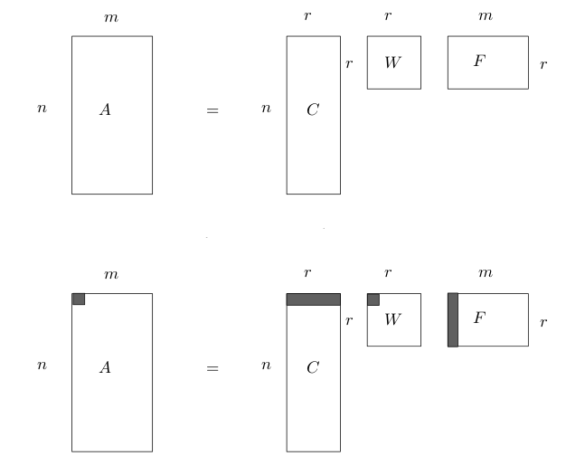
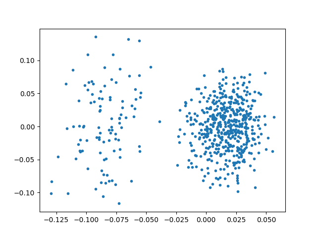
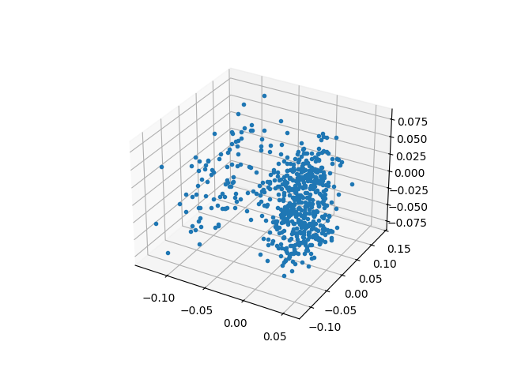
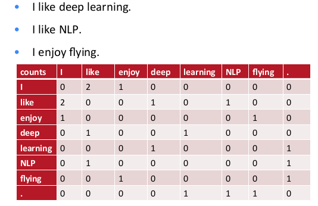
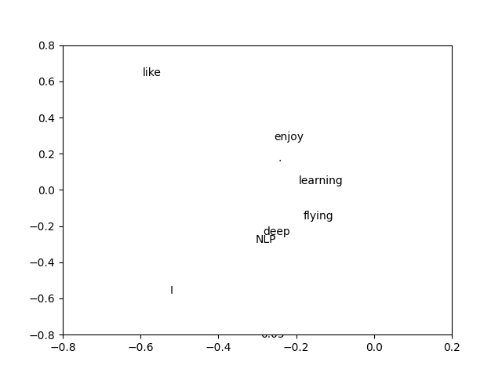
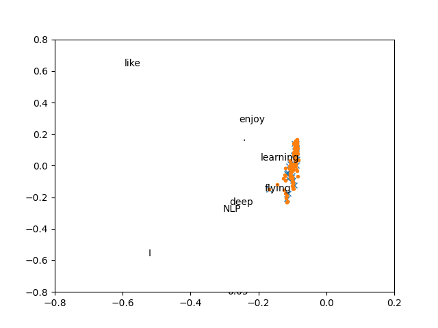
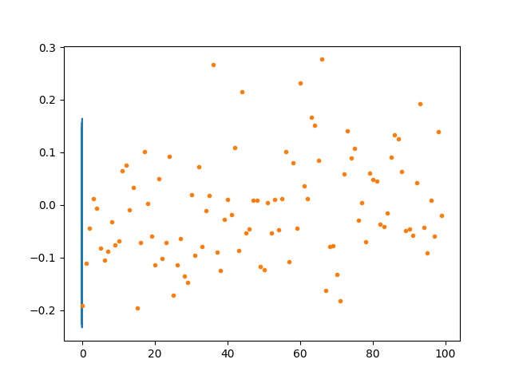

# SVD ile Kümeleme, Benzerlik

Eşsiz Değer Ayrıştırma (Singular Value Decomposition -SVD-) ile bir veri
madenciliği örneği göreceğiz. [6]'da SVD'nin matematiğini işledik. SVD bir
matris $A$ üzerinde ayrıştırma yapar, ve $A$ herhangi boyutta, türde bir
matris olabilir.



Ayrıştırma $m \times n$ boyutlu matrisi $A=CWF$ olarak ayrıştırır, burada $C$,
ana matris ile aynı miktarda satıra sahiptir, $F$ aynı miktarda kolona
sahiptir. Ayrıştırma sonrası $A$'nin kertesi (rank) $r$ ortaya çıkar, eğer tüm
$A$ kolonları birbirinden bağımsız ise, o zaman $r=m$ olacaktır, ama kolonların
bazıları mesela aynı ölçümü değişik katlarda tekrarlıyor ise, o zaman matriste
eşsizlik vardır, ve bu durumda $r < m$ olur, ve ortadaki $W$ matrisi $r \times
r$ olduğu için beklenenden daha ufak boyutlarda olabilir.

Ayrıca SVD, $W$ çaprazındaki özdeğerleri büyüklük sırasına göre dizer, ve her
özdeğere tekabül eden özvektörler de ona göre sıraya dizilmiş olacaktır, ve SVD
tamamlanınca mesela "en büyük 10" özdeğere ait olan $CWF$ değerlerini alıp,
diğerlerini atmayı da seçebiliriz, yani kerte üzerinden yapılan "eleme" üstüne
bir eleme de kendimiz yapabiliriz. Bu elemeyi yapabilmemizin mantığı şöyle;
küçük özdeğerlerin çarptığı özvektörlerin nihai toplama daha az etki ettiği
söylenebilir, ve bu "gürültüyü" elemek sonucu değiştirmeyecektir. Ayrıca bu
elemeyi yaparak bir tür boyut azaltma (dimensionality reduction) işlemini de
aynı zamanda başarmış oluruz.

Ayrıştırmanın Anlamları

Bir ayrıştırmayı değişik şekillerde görmek mümkündür. Bunlardan önemli
birisi çizit bakış açısıdır (graph interpretation). Çizit bilindiği gibi
düğümler ve onlar arasındaki ayrıtlardan (edges) oluşur. Bir çizit matris
formunda temsil edilebilir, satır / kolon kesişimi iki düğüm arasındaki
ayrıtın ağırlığını, ya da varlığını (1 ve 0 üzerinden) temsil edecektir. Bu
durumda SVD sonucunda elde edilen $CWF$, bize iki düğüm arası geçişli
(bipartite) çiziti üç düğüm arası geçişli (tripartite) çizite çevrilmiş
halde geri verir. Ve bu yeni çizitde en fazla $r$ tane geçiş noktaları
(waystations) oluşmuştur, üstte bahsettiğimiz eleme ile geçişler daha da
azaltılabilir.

Şimdi, bu geçiş noktalarına olan $C$'nin "bağlanma şekli'', "bağlanma kuvveti",
ek kümeleme basamağı tarafından kullanılabilir. Bu "azaltılmış" geçişin
üzerindeki her işlem / ona yapılan her referans kümeleme için bir ipucudur. Bunu
görmek için örnek zaman serilerinin SVD sonrası elde edilen $C$ (örnekte
`u`) matrisinin ilk iki kolonunu bile grafiklemek yeterlidir.

```python
import scipy.linalg as lin
data = np.genfromtxt("synthetic_control.data", dtype=float)

# before norm, and take only 10 data points
data = data[:,0:10]

print data.shape

# show the mean, and std of the first time series
print data[0,:]
print np.mean(data[0,:], axis=0)
print np.std(data[0,:], axis=0)

# normalize
data -= np.mean(data, axis=0)
data /= np.std(data, axis=0)

# after norm
print data[0,:]

u,s,v = lin.svd(data, full_matrices=False)
print 'svd'
print u.shape
print s
print v.shape

plt.plot(u[:,0], u[:,1], '.')
plt.savefig('svd_3.png')
```

```
(600, 10)
[ 28.7812  34.4632  31.3381  31.2834  28.9207  33.7596  25.3969  27.7849
  35.2479  27.1159]
30.40918
3.16894521278
[-0.35501371  0.85457443 -0.10641642 -0.16202975 -0.51986031  0.56762802
 -1.19371757 -0.29304061  1.27639519 -0.2095089 ]
svd
(600, 10)
[ 48.29293361  30.97232928  24.52860861  20.63081553  20.0940039
  17.52035809  16.48932523  16.03796372  15.41270426  14.27678793]
(10, 10)
```



Görüldüğü gibi net bir şekilde iki tane küme ortaya çıktı. Bu kümeler yazının
başındaki iki ayrı zaman serisi öbeklerine tekabül ediyorlar.

O zaman serilerini ayırtetmek için ne yaparız? Üstteki veriler üzerinde kmeans
işletebilirdik, ya da kabaca bakıyoruz, dikey olarak -0.025 seviyesinde bir
çizgi ayıraç olarak görülebilir. Numpy filtreleme tekniği

`u[:,0] < -0.025`

bize ana veri üzerinde uygulanabilecek `True` ve `False`  değerleri
verir, bunları alarak ana veriye filtrele olarak uygularız,

`data[u[:,0] < -0.025]`

ve mesela birinci kümeye ait zaman serilerini bulabiliriz. 

Kontrol etmek için ilk 3 kolonun değerlerini üç boyutta grafikleyelim.

```python
from mpl_toolkits.mplot3d import Axes3D
import scipy.linalg as lin

data = np.genfromtxt("synthetic_control.data", dtype=float)

data = data[:,0:10]

print data.shape

data -= np.mean(data, axis=0)
data /= np.std(data, axis=0)

u,s,v = lin.svd(data)
print 'svd'
print u.shape
print s
print v.shape

fig = plt.figure()
ax = Axes3D(fig)
ax.plot(u[:,0], u[:,1], u[:,2],',', zs=0, zdir='z', label='zs=0, zdir=z')
plt.savefig('svd_4.png')
```

```
(600, 10)
svd
(600, 600)
[ 48.29293361  30.97232928  24.52860861  20.63081553  20.0940039
  17.52035809  16.48932523  16.03796372  15.41270426  14.27678793]
(10, 10)
```



Yine iki tane küme olduğunu görüyoruz. 

Kelime Vektorleri [5]

Diyelim ki elimizde üç tane cümle var. Bu cümlelere dayanarak bir kelimenin
vektörsel temsilini bulmak istiyoruz. 



Matris içindeki sayılar her kelimenin bir diğeri ile beraber kaç kere aynı
cümlede olduğuna (cooccurence) göre oluşturuldu. Mesela "I'' ile "like''
kelimesi beraber 2 kere çıkmış, bu matriste 1,2 ve 2,1 kordinatlarında
görülüyor.  O zaman bu matrise bir kelimenin satırsal ya da kolonsal
temsiline bakarak o kelimenin vektörsel halini bulabiliriz. Mesela
"enjoy'' icin bu $\left[\begin{array}{cccccccc} 1&0&0&0&0&1&0 \end{array}\right]$.

Fakat gerçek uygulamalarda bu şekilde bir temsil performans ve depolama
açısından bedeli olabilir; eğer eldeki kelime sayısı 1 milyon ise bu matris
1 milyon x 1 milyon öğeye ihtiyaç duyar. 

Çözüm: boyut azaltmak. SVD bu iş için biçilmiş kaftan. 

```python
import scipy.linalg as lin
words = ["I", "like", "enjoy",
         "deep", "learning", "NLP", "flying", "."]
X = np.array([[0,2,1,0,0,0,0,0],
              [2,0,0,1,0,1,0,0],
              [1,0,0,0,0,0,1,0],
              [0,1,0,0,1,0,0,0],
              [0,0,0,1,0,0,0,1],
              [0,1,0,0,0,0,0,1],
              [0,0,1,0,0,0,0,1],
              [0,0,0,0,1,1,1,0]])

U, s, Vh = lin.svd(X, full_matrices=False)
print U.shape, s.shape, Vh.shape

for i in xrange(len(words)):
    plt.text(U[i,0], U[i,1], words[i])

plt.ylim(-0.8,0.8)
plt.xlim(-0.8,0.2)              
plt.savefig('svd_8.png')
```

```
(8, 8) (8,) (8, 8)
```



$U$'nun ilk iki kolonunu grafikledik çünkü en büyük iki eşsiz değere
tekabül eden kolonlar bunlar, yani en "önemli'' değerler orada. 

En önemli kolonları bulduk, o zaman diyebiliriz ki bu iki kolon üzerinden
bir kelimenin vektörsel temsilini de bulmuş olduk. Bu temsil eskisine göre
daha küçük, ve özetleme açısından daha kuvvetli. Artık kelimelerin
birbirine yakınlığı, benzerliği gibi hesaplar bu vektör üzerinden
yapılabilir. 

Üstteki grafik yakınlık açısından bazı anlamsal yapıyı göstermeye başladı
bile: mesela "like'' ve "enjoy'' birbirine yakın, bu mantıklı çünkü ikisi
de birinin yaptığı şeyler. Diğer yandan "learning'' kelimesine en yakın
"flying'' bu da mantıklı, her iki kelime de cümle sonlarında ortaya
çıkıyorlar ve hedef kelimeler. 

Gerçek uygulamalar için bazı taklalar: 

İngilizce'nin yapısı sebebiyle sürekli görülen ama çok anlam katmayan bazı
kelimeler var, mesela "the'', "he'', "has'' gibi. Bu kelimeler direk
sayılırsa bu sayı çok yüksek. Çözüm, belli bir sayı üstünü saymamak, ya da
onları tamamen devreden çıkartmak.

Word2Vec

Yapay Sinir Ağları (YSA) literatüründe duyulan word2vec aslında üstteki
vektörsel temsilin başka bir yoldan öğrenilmesinden ibaret. YSA yaklaşımı
ile beraber olma sayısı hesaplanmadan vektörsel temsil direk öğreniliyor,
bunun için her kelime için o kelime yakınındaki (bir pencere içindeki)
diğer kelimeler tahmin edilmeye uğraşılıyor, daha doğrusu hedef fonksiyon
budur, ve eğitim verisine bakılarak bu tahmindeki başarı geriye yayılım
(backpropagation -backprop-) ile düzeltilerek arttırılıyor. 

Word2Vec'in insanı şaşırtabilen bazı ilginç özellikleri var: mesela çok
büyük veriler üzerinden vektörler hesaplandıktan sonra mesela kral
vektörünü alıp ondan erkek vektörünü çıkartıyorsunuz, ve kadın vektörünü
toplayorsunuz ve kraliçe vektörünü elde ediyorsunuz (ona yakın bir vektörü
en azından). İlginç değil mi? Bu keşif pek çok araştırmacıya "vay canına''
dedirtirdi, tabii ki bunun istatistiki sebepleri var, bu konuya bakanlar da
oldu, detaylar için [5, 18:50]. 

Örnek

Şimdi biraz daha değişik bir probleme bakalım, bu sefer bir grup kelimeyi
birbirlerine benzerlikleri (ya da uzaklığı) üzerinden kümelemeye uğraşacağız.

Benzerlik, Levenhstein mesafesi adlı ölçüt [2] üzerinden olacak. Matrisimiz her
kelimenin her diğer kelime ile arasındaki uzaklığı veren bir matris olmalı, eğer
100 kelime var ise, bu matris 100 x 100 boyutlarında olacak. SVD sonrası elde
edilen `u` üzerinde kmeans işleteceğiz, ve kümeleri bulacağız. Ayrıca her
küme için bir "temsilci'' seçebilmek için kmeans'in bize verdiği küme ortası
kordinatının en yakın olduğu kelimeyi çekip çıkartacağız, ve onu temsilci olarak
alacağız.

Kelime mesafesi olarak

```python
def levenshtein(s1, s2):
  l1 = len(s1)
  l2 = len(s2)

  matrix = [range(l1 + 1)] * (l2 + 1)
  for zz in range(l2 + 1):
    matrix[zz] = range(zz,zz + l1 + 1)
  for zz in range(0,l2):
    for sz in range(0,l1):
      if s1[sz] == s2[zz]:
        matrix[zz+1][sz+1] = min(matrix[zz+1][sz] + 1,
                                 matrix[zz][sz+1] + 1,
                                 matrix[zz][sz])
      else:
        matrix[zz+1][sz+1] = min(matrix[zz+1][sz] + 1,
                                 matrix[zz][sz+1] + 1,
                                 matrix[zz][sz] + 1)
  return matrix[l2][l1]

```

```python
import leven
s1 = "pizza"
s2 = "pioazza"   
distance = leven.levenshtein(s1, s2)       
print 'The Levenshtein-Distance of ',s1, ' and ', s2, ' is ', distance

s1 = "hamburger"
s2 = "haemmurger"   
distance = leven.levenshtein(s1, s2)       
print 'The Levenshtein-Distance of ',s1, ' and ', s2, ' is ', distance
```

```
The Levenshtein-Distance of  pizza  and  pioazza  is  2
The Levenshtein-Distance of  hamburger  and  haemmurger  is  2
```

```python
import scipy.linalg as lin
from sklearn.cluster import KMeans
import itertools

words = np.array(
    ['the', 'be', 'to', 'of', 'and', 'a', 'in', 'that', 'have',
     'I', 'it', 'for', 'not', 'on', 'with', 'he', 'as', 'you',
     'do', 'at', 'this', 'but', 'his', 'by', 'from', 'they', 'we',
     'say', 'her', 'she', 'or', 'an', 'will', 'my', 'one', 'all',
     'would', 'there', 'their', 'what', 'so', 'up', 'out', 'if',
     'about', 'who', 'get', 'which', 'go', 'me', 'when', 'make',
     'can', 'like', 'time', 'no', 'just', 'him', 'know', 'take',
     'people', 'into', 'year', 'your', 'good', 'some', 'could',
     'them', 'see', 'other', 'than', 'then', 'now', 'look',
     'only', 'come', 'its', 'over', 'think', 'also', 'back',
     'after', 'use', 'two', 'how', 'our', 'work', 'first', 'well',
     'way', 'even', 'new', 'want', 'because', 'any', 'these',
     'give', 'day', 'most', 'us'])

print "calculating distances..."

(dim,) = words.shape

f = lambda (x,y): leven.levenshtein(x,y)

res=np.fromiter(itertools.imap(f, itertools.product(words, words)),
                dtype=np.uint8)
A = np.reshape(res,(dim,dim))

print "svd..."

u,s,v = lin.svd(A, full_matrices=False)

print u.shape
print s.shape
print s[:10]
print v.shape

data = u[:,0:8]
k=KMeans(init='k-means++', n_clusters=25, n_init=10)
k.fit(data)
centroids = k.cluster_centers_
labels = k.labels_
print labels[:10]

def dist(x,y):   
    return np.sqrt(np.sum((x-y)**2, axis=1))
    
print "clusters, centroid points.."
for i,c in enumerate(centroids):
    idx = np.argmin(dist(c,data[labels==i]))
    print words[labels==i][idx]
    print words[labels==i]
    
plt.plot(centroids[:,0],centroids[:,1],'x')
plt.hold(True)
plt.plot(u[:,0], u[:,1], '.')
plt.savefig('svd_5.png')

from mpl_toolkits.mplot3d import Axes3D
fig = plt.figure()
ax = Axes3D(fig)
ax.plot(u[:,0], u[:,1], u[:,2],'.', zs=0,
        zdir='z', label='zs=0, zdir=z')
plt.savefig('svd_6.png')
```

```
calculating distances...
svd...
(100, 100)
(100,)
[ 357.98820225   46.49125611   32.1352688    23.80316426   21.48889925
   17.53558749   17.2577475    15.08233454   13.60531866   12.78642892]
(100, 100)
[ 0 12 20 17  4 23  3  7  9 14]
clusters, centroid points..
she
['the' 'she']
even
['one' 'get' 'year' 'over' 'after' 'even' 'new']
not
['for' 'not' 'on' 'you' 'who' 'into' 'now' 'how']
if
['in' 'it' 'his' 'if' 'him' 'its']
any
['and' 'say' 'an' 'all' 'can' 'back' 'way' 'want' 'any' 'day']
most
['about' 'just' 'also' 'first' 'most']
come
['people' 'some' 'come']
that
['that' 'what' 'than']
only
['only' 'well']
have
['have' 'make' 'take']
with
['with' 'will' 'which']
like
['like' 'time' 'give']
be
['be' 'he' 'we' 'me' 'see' 'use']
could
['would' 'could']
I
['I' 'by' 'my']
this
['this' 'think']
good
['from' 'know' 'good' 'look' 'work']
our
['of' 'or' 'out' 'your' 'our']
other
['her' 'there' 'their' 'other']
because
['because']
do
['to' 'do' 'so' 'go' 'no' 'two']
up
['but' 'up' 'us']
these
['these']
at
['a' 'as' 'at']
they
['they' 'when' 'them' 'then']
```





Bu tekniğin uygulanabileceği daha pek çok alan var. Mesela her dokümanın
içindeki belli kelimelerin sayıları kolonlarda (her kolon özel bir kelimeye
tekabül edecek şekilde), ve dökümanların kendisi satırlarda olacak şekilde bir
matrisimiz olsaydı, SVD bu matris üzerinde de bir kümeleme için
kullanılabilirdi. Bu örnekte "kaç tane kelime olduğu'' gibi bir ölçüt vardır
(daha önce kelimelerin birbirine uzaklığını kullandık), ama teknik yine de ise
yarar.

Kaynaklar

Not: `np.fromiter .. itertools.imap` kullanımının tarifi için [4].

[1] Alcock, *Synthetic Control Chart Time Series*, [kdd.ics.uci.edu/databases/synthetic_control/synthetic_control.data.html](kdd.ics.uci.edu/databases/synthetic_control/synthetic_control.data.html)

[2] Bayramlı, 
    *Kelime Benzerligi - Levenshtein Mesafesi*, 
    [https://burakbayramli.github.io/dersblog/sk/2012/07/kelime-benzerligi-levenshtein-mesafesi.html](https://burakbayramli.github.io/dersblog/sk/2012/07/kelime-benzerligi-levenshtein-mesafesi.html)

[3] Skillicorn, D., *Understanding Complex Datasets Data Mining with Matrix Decompositions*

[4] Bayramlı, 
    *Dongu Yazmamak, Fonksiyonel Diller, Python*, 
    [https://burakbayramli.github.io/dersblog/sk/2012/07/dongu-yazmamak-fonksiyonel-diller-python.html](https://burakbayramli.github.io/dersblog/sk/2012/07/dongu-yazmamak-fonksiyonel-diller-python.html)

[5] Socher, {\em CS224d, Deep Learning for Natural Language Processing,
  Lecture 2}, [https://www.youtube.com/watch?v=T8tQZChniMk](https://www.youtube.com/watch?v=T8tQZChniMk)

[6] Bayramlı, Lineer Cebir, *Ders 29*


