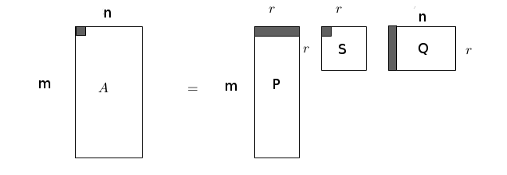

# Yaklaşıksal SVD ile Tavsiye Sistemleri

Geçmiş verilere bakarak bir kullanıcının hiç seyretmediği bir filme nasıl
not vereceğini tahmin etmek ünlü Netflix yarışmasının konusuydu. Önceki bir
yazı [14]'te benzer bir veri seti Movielens üzerinde SVD uygulayarak önce
boyut azaltmıştık, azaltılmış boyut üzerinden yeni (o film için notu
bilinmeyen) bir kullanıcının diğer mevcut kullanıcılara mesafesini
hesaplamış, ve böylece beğeni açısından en çok benzediği diğer kullanıcıyı
bulmuştuk (birkaç tane de bulunabilir). Bu kullanıcının bir film için
verdiği notu yeni kullanıcı için tahmin olarak baz almıştık. SVD'yi
kullanmanın bir yöntemi daha var, Netflix yarışmasında kullanılan [1] bir
yaklaşım şöyle; alttaki SVD ayrıştırmasına bakalım,



1'inci kullanıcının 1'inci filme verdiği not üstte köyü gösterilen
satırların çarpımı ile oluyor, eğer ufak harfler ve kullanıcı (user) için
$u$, film için $i$ indisini, ve $q,p$ vektörlerini $Q,P$ matrislerinin
sırasıyla kolon ve satırlarını göstermek için kullanırsak, ayrıştırma
sonrası beğeni değeri (önemli bir kısmı daha doğrusu) $q_i^Tp_u$
çarpımındadır. Çarpım içinde $S$'ten gelecek eşsiz değeri (singular value)
ne olacak?  Şimdi formülasyonda bir değişiklik düşünelim, bu değerin çarpım
dışına alındığını hayal edelim; bu değerin kabaca birkaç toplamın sonucuna
dönüştüğünü düşünelim. Matematiksel olarak imkansız değil. Bu toplam
terimleri, toplam oldukları için, bir baz seviyesi tanımlayabilirler. Bir
kullanıcının ne kadar yanlı (bias) not verdiğini, ya da bir filmin nasıl
not almaya meyıllı olduğunu modelleyebilirler (ki bu da bir yanlılık
ölçüsü). Ayrıca tüm filmlere verilen notların yanlılığı da ayrı bir terim
olarak gösterilebilir. Tüm bunları bir araya koyarsak, bir beğeni notunu
tahmin edecek formül şöyle gösterilebilir,

$$
\hat{r}_{ui} = \mu + b_i + b_u + q_i^Tp_u
$$

$\mu$ bir skalar, tüm filmlere verilen ortalamayı gösteriyor, ki tüm beğenilerin
sayısal ortalaması üzerinden basit bir şekilde hızla
hesaplanabilir. $\hat{r}_{ui}$'ya bir tahmin dedik çünkü modelimizdeki
vektörlerin değerlerini bulduktan sonra (eğitim verisiyle bu hesabı yapacağız)
modeli kullanarak gerçek not $r_{ui}$ için bir tahmin olarak kullanılacak.

Yanlılık hakkında bazı örnekler vermek gerekirse, diyelim ki kullanıcı Bob not
verirken yüksek seviyede oy vermeye meyıllı. Bu durumda bu kullanıcının ortalama
hatta düşük oy vermesi onun bir filmden hakikaten hiç hoşlanmadığını
sinyalleyebilir. Ya da bir film genellikle ortalama oy almaktadır, bu durumda
ona çok iyi not veren bir kişinin bu filmi çok beğendiği ortaya çıkar. Modeldeki
yanlılık parametreleri bu durumu saptayabilirler. Eğer verimizde / gerçek
dünyada yanlılık var ise, modelin bu bilgiyi kullanması onun başarısını
arttıracaktır.

Eğitim

Eğitim için ne yapmalı? Minimize edeceğimiz bir hedef fonksiyonu kuralım, ki
çoğunlukla bu karesi alınmış hata ile olur. Mesela gerçek not $r_{ui}$
değerinden tahmin notu $\hat{r}_{ui}$'yi çıkartıp karesini alabiliriz. Bu işlemi
tüm $u,i$'ler için yaparak sonuçları toplarız, ve bu toplamı minimize etmeye
uğraşabiliriz. Yani

$$
\min_{b\star,q\star,p\star} \sum_{u,i} (r_{ui} - \hat{r}_{ui})^2 + 
\lambda (b_i^2 + b_u^2 + ||q_i||^2 + ||p_u||^2)
$$

$$
= \min_{b\star,q\star,p\star} \sum_{u,i} (r_{ui} - \mu - b_i - b_u - q_i^Tp_u)^2 + 
\lambda (b_i^2 + b_u^2 + ||q_i||^2 + ||p_u||^2)
$$

Kısaltma olarak $e_{ui}$ tanımlayalım, bu faydalı olabilir, formüldeki ilk
parantez içindeki kısımda kullanmak üzere,

$$ e_{ui} := r_{ui} - \hat{r}_{ui} $$

$\lambda$ ile çarpılan bölüm regülarizasyon için. İstatistik, yapay öğrenimde
modelimizin aşırı uygunluk (överfitting) yapmasını engellemek için
regülarizasyon kullanılır, bunun için istediğimiz değişkenlerin fazla büyümesini
cezalandırırız, üstteki minimizasyon modelinde bu ceza için tüm değerlerin
büyüklüğünü (magnitude) hesapladık -skalar değerlerin karesini, vektör
değerlerinin kare norm'unu alarak- ve bu büyüklükleri bizim dışarıdan
tanımlayacağımız bir sabitle çarpımı üzerinden minimizasyon problemine direk
dahil ettik. Böylece bu büyüklükler azaltılma hedefinin parçası haline
geldiler. Yani hem $e_{ui}^2$ hem de hatayı oluşturan değerlerin kendileri
minimize edilecek. Bu minimizasyon sırasında bazı değişkenlerin sıfıra inip o
$u,i$ için tamamen etkisiz hale gelmesi bile mümkündür (ki bu bize o
parametrenin önemsiz olduğunu sinyalleyebileceği için faydalıdır).

Rasgele Gradyan İnişi (Stochastic Gradient Descent -SGD-)

Modeli nasıl minimize ederiz? Bu model konveks (convex) değil, ki
konvekslik bilindiği gibi fonksiyonun düzgün bir çukur gibi olduğu
problemlerdir. Böyle çukur fonksiyonlarında herhangi bir noktadan
başlarsınız, gradyanı hesaplarsınız, ve bu gradyan hep optimal iniş
noktasını (daha doğrusu tersini) gösterir, ve yolda giderken takılıp
kalabileceğiniz yerel minimumlar mevcut değildir, ve sonunda çukur dibine
ulaşılır. Bizim problemimizde $q_i^Tp_u$ var, bu değişkenlerin ikisi de
bilinmiyor, ve bu çarpımın karesi alındığı için genel karesellliği
(quadratic) kaybetmiş oluyoruz. Fakat yine de SGD bu problemi
çözebiliyor. Bunun sebeplerini, SGD SVD'nin hikayesiyle beraber yazının
sonunda bulanabilir.

SGD için gradyanlar lazım, her değişken için minimizasyon toplamı içindeki
kısmın (bu kısma $E$ diyelim) ayrı ayrı kısmı türevini almak lazım. Mesela
$b_u$ için

$$ \frac{\partial E}{\partial b_u}  = -2e_{ui} + 2 \lambda b_u
$$

Gradyan her zaman en yüksek çıkışı gösterir, o zaman hesapsal algoritma onun
tersi yönüne gitmelidir. Bu gidişin adım büyüklüğünü kontrol etmek için
dışarıdan bizim belirlediğimiz bir $\gamma$ sabiti ile çarpım yapabiliriz, ve
bir numara daha, sabit 2 değerlerinin $\gamma$ içinde eritilebileceğini
farzederek onları sileriz. Yani adım $\gamma(e_{ui} - \lambda b_u)$ haline
geldi. Bir döngü içinde eski $b_u$ bulunacak, gördüğümüz yönde adım atılacak,
yani adım önceki değere toplanacak, ve yeni değer elde edilecek. Diğer
değişkenler için türev alıp benzer işlemleri yaparsak, sonuç şöyle,

$$ b_u \leftarrow b_u + \gamma (e_{ui} - \lambda \cdot b_u) $$

$$ b_i \leftarrow b_i + \gamma (e_{ui} - \lambda \cdot b_i) $$

$$ q_i \leftarrow q_i + \gamma (e_{ui}\cdot p_u - \lambda \cdot q_i) $$

$$ p_u \leftarrow p_u + \gamma (e_{ui}\cdot q_i - \lambda \cdot p_u) $$

Her değişken için başlangıç noktası rasgele olarak seçilebilir, hatta
seçilmelidir; İnternet'te bu konu hakkında "efendim tüm değerleri 0.1
değeri yapsanız olur'' gibi yorumlar okuyabilirsiniz, bu durumda $q_i,p_u$
değişkenlerinin tüm hücreleri aynı değerde kalır! Yani $q_3$ mesela,
tamamen 0.6 değerine sahip olur, ki bu istenen bir şey
olmaz. $\gamma,\lambda$ sabitleri için en iyi değerler deneme/ yanılma ya
da çapraz sağlama (crossvalidation) ile bulunabilir, biz bu örnekte deneme
/ yanılma yöntemini seçtik.

Rasgelelik, aynen *Lojistik Regresyon* örneğinde olduğu gibi verinin
rasgeliliğinden geliyor, her veri noktasını teker teker sırayla işliyoruz
aslında fakat bu "sıranın'' rasgele olduğunu farzettiğimiz için özyineli
algoritmamız rasgelelik elde ediyor. Python kodu altta, eğitim için kod sadece
bir kere verinin üzerinden geçiyor. Başa dönüp birkaç kere (hatta yüzlerce)
veriyi işleyenler de olabiliyor.

```python
from numpy.linalg import linalg as la
import numpy as np
import random, pandas as pd

def create_training_test(df,collim=2,rowlim=200):
    test_data = []
    df_train = df.copy()
    for u in range(df.shape[0]):
        row = df.ix[u]; idxs = row.index[row.notnull()]
        if len(idxs) > collim:
            i = random.choice(idxs); val = df.ix[u,i]
            test_data.append([u,i,val])
            df_train.ix[u,i] = np.nan
        if len(test_data) > rowlim: break
    return df_train, test_data

def ssvd(df_train,k):
    lam = 0.02 # regularizasyon
    gamma = 0.01 # adim katsayisi
    m,n = df_train.shape
    b_u = np.random.uniform(0, 0.1, size=m)
    b_i = np.random.uniform(0, 0.1, size=n)
    p_u = np.random.rand(m,k)
    q_i = np.random.rand(k, n)
    r_ui = np.array(df_train)
    for u in range(m):
        row = df_train.ix[u]; idxs = row.index[row.notnull()]
        for i in idxs:
            i = int(i)
            r_ui_hat = np.dot(q_i[:,i].T,p_u[u,:])
            e_ui = r_ui[u,i] - r_ui_hat
            q_i[:,i] = q_i[:,i] + gamma * (e_ui*p_u[u,:].T - lam*q_i[:,i])
            p_u[u,:] = p_u[u,:] + gamma * (e_ui*q_i[:,i].T - lam*p_u[u,:])
    return q_i,p_u
            
```

Kodun önemli bir özelliği şudur, boş yani `nan` değeri içeren notlar eğitim
sırasında atlanır. SGD seyrek verilerle de işleyebilen bir eğitim yöntemidir. Bu
durumda verinin seyrekliği (sparsıty) bizim için çok faydalı, çünkü o veri
noktalarına bakılmayacak, `row.notnüll()` ile boş olmayan öğelerin indis
değerlerini alıyoruz. Bilindiği üzere Movielens, Netflix verileri oldukça
seyrektir, kullanıcı binlerce film içinden onlar, yüzler bağlamında not verimi
yapar, geri kalan değerler boştur.

Pratikte Atlanabilecek Formüller

Üstteki formülasyon içinde genel, film ve kullanıcı yanlılıkları formül içinde
belirtilmiştir. Pratikte sayısal hesap açısından bu yanlılıkları daha SVD
başlamadan önce veriden çıkartmak, ve yanlılılıkları rasgele güncelleme
mantığından çıkartmak daha iyi sonuç veriyor. Bu çıkartma şöyle yapılır; önce
film ortalamaları hesaplanır, her kullanıcı için o kullanıcının o film
ortalamasına olan farkı (offset) hesaplanır ve bu fark eğitim sırasında not
olarak kullanılır. Böylece SVD tüm yanlılıklardan arınmış bir fark hesabı ile
çalışır sadece, ve sayısal olarak bu daha avantajlıdır. Yoksa ilk atılan adımda
fark çok büyük olacağı için bu fark gradyan inişinin yönününü ağırlıklı olarak
belirleyecektir, ve bu ilk atılan adım hesabın geri kalanına aşırı baskın
çıkabilecektir (dominate). Zaten SVD'nin kuzeni olan PCA'den de bildiğimiz gibi,
bu yöntem ortalamadan arındırılmış (demeaned) farklarla iş yapıyor.

Niye Azar Azar (Incremental) Hesap? 

Madem $U,S,V$ hesabı yapar gibi $q_i,p_u$ hesaplıyoruz, niye bu hesabı adım
adım yapıyoruz? 

Bu sorunun cevabı azar azar hesap yaparken hafızaya sadece o satırı alarak daha
az bellek kullanmamız. Milyarlarca boyut ve milyarlarca satır işliyor olsaydık
bu matrisin tamamını hafızaya almamız mümkün olmazdı.

Ayrıca olmayan verileri atlamak bu SVD hesabını bir "veri tamamlama problemi''
haline getiriyor, piyasadaki neredeyse diğer tüm kütüphaneler olmayan veriyi
sıfır olarak kabul eder. Bu farklı bir problemdir. Bu diğer SVD yöntemlerinde
her ne kadar olan veriyi ortalasak ve sıfır değerleri sıfır averajla aynı anlama
gelmeye başlasa bile, yine de olmayan veriyi sıfır kabul etmek onu atlamaktan
farklıdır [12].

Basit bir örnek

```python
import pandas as pd
import ssvd
d =  np.array(
[[  5.,   5.,   3.,  nan,   5.,   5.],
 [  5.,  nan,   4.,  nan,   4.,   4.],
 [ nan,   3.,  nan,   5.,   4.,   5.],
 [  5.,   4.,   3.,   3.,   5.,   5.],
 [  5.,   5.,  nan,  nan,  nan,   5.]
])
data = pd.DataFrame (d, columns=['0','1','2','3','4','5'],
       index=['Ben','Tom','John','Fred','Bob'])
avg_movies_data = data.mean(axis=0)
data_user_offset = data.apply(lambda x: x-avg_movies_data, axis=1)
q_i,p_u = ssvd.ssvd(data_user_offset,k=3)
print 'q_i',q_i
print 'p_u',p_u
u = 4; i = 2 # Bob icin tahmin yapalim
r_ui_hat = np.dot(q_i[:,i].T,p_u[u,:]) + avg_movies_data.ix[i] + \
           np.nan_to_num(data_user_offset.ix[u,i])
print r_ui_hat
```

```
q_i [[ 0.77564986  0.1768796   0.56224297  0.42870962  0.94723452  0.55772707]
 [ 0.74100171  0.18146607  0.07704434  0.17631144  0.48868432  0.90470742]
 [ 0.70541948  0.28729857  0.091619    0.46184649  0.64498754  0.27410096]]
p_u [[ 0.41549541  0.59784095  0.45227968]
 [ 0.7756159   0.1197948   0.2921504 ]
 [ 0.82274016  0.58432802  0.46501307]
 [ 0.1877425   0.21364635  0.1924456 ]
 [ 0.80554597  0.59254732  0.9775562 ]]
3.92146103113
```

Not: Artımsal SVD için bir diğer teknik için bkz. *Ders 29*. 

Test Etmek

Test verisi oluşturmak için eğitim verisinde rasgele olarak bazı notları seçtik,
bunları bir kenara kaydederek onların ana matris içindeki değerini sildik
(yerine `nan`  koyarak), ve bir kısmı silinmiş yeni bir eğitim matrisi
yarattık, `create_training_test` işlevinde bu görülebilir. Bu işlevde her
kullanıcıdan sadece bir tane not verisi alıyoruz, ve bunu sadece belli bir
sayıda, `collim` kadar, not vermiş kullanıcılar için yapıyoruz, ki böylece
az sayıda not vermiş kullanıcıların verisini azaltmamış oluyoruz. Ayrıca belli
miktarda, `rowlim` kadar test noktası elde edince iş bitti kabul
ediyoruz. Test verisi yaratmak için \%80-\%20 gibi bir ayrım yapmadık, yani
eğitim verişindeki tüm kullanıcıları ve onların neredeyse tüm verisini eğitim
için kullanıyoruz.

Movielens verisine gelelim, [14] yazısındaki `movielens_prep.py` ile
gerekli eğitim dosyası üretildiğini farzederek,

```python
import pandas as pd, os
df = pd.read_csv("%s/Downloads/movielens.csv" % os.environ['HOME'] ,sep=';')
print df.shape
df = df.ix[:,1:3700] # id kolonunu atla,
df.columns = range(3699) # kolon degerlerini tekrar indisle
print df.shape
```

```
(6040, 3731)
(6040, 3699)
```

```python
avg_movies = df.mean(axis=0)
df_user_offset = df.apply(lambda x: x-avg_movies, axis=1)
print df.ix[6,5], avg_movies.ix[5], df_user_offset.ix[6,5]
```

```
4.0 3.87872340426 0.121276595745
```

Eğitim ve test verisi yaratıyoruz,

```python
import ssvd
df_train, test_data = ssvd.create_training_test(df_user_offset,rowlim=500,collim=300)
print len(test_data)
```

```
501
```

```python
q_i,p_u = ssvd.ssvd(df_train,k=8)
```

Test

```python
rmse = 0; n = 0
for u,i,real in test_data:
    r_ui_hat = np.dot(q_i[:,i].T,p_u[u,:])
    rmse += (real-r_ui_hat)**2
    n += 1
print "rmse", np.sqrt(rmse / n)
```

```
rmse 0.936136196897
```

Sonuç fena değil.

Formülasyonun Hikayesi

SGD SVD'nin hikayesi şöyle. Yıl 2009, Netflix Yarışması [11] katılımcılarından
Simon Funk (gerçek adı Brandyn Webb) SGD SVD yaklaşımını kodlayıp veri üzerinde
işletince birden bire sıralamada ilk 3'e fırlar; Webb artık çok ünlü olan blog
yazısında [1] yaklaşımı detayıyla paylaşıp forum'da haberini verince bu haber
tam bir bomba etkisi yaratır. Pek çok kişi yaklaşımı kopyalar, hatta kazanan
BellKor ürününde Webb'in SVD yaklaşımının kullanıldığı biliniyor.

Bu metotun keşfi hangi basamaklardan geçti? Beni meraklandıran minimizasyon
formülasyonun konveks olmamasıydı -- genellikle optimizasyon problemlerinde
konveksliğin mevdudiyeti aranır, çünkü bu durumda sonuca yaklaşmak (convergence)
için bir garanti elde edilir. Bu durumda konvekslik yoktu. "O zaman Webb nasıl
rahat bir şekilde SGD kullanabildi?'' sorusunun cevabını merak ediyorduk
yani. Biraz araştırınca Bottou ve LeCunn gibi araştırmacıların yazılarına
ulaştık [4]. Onlara göre konvekslik olmaması yapay öğrenim araştırmacılarını
korkutmamalı, eğer sayısal (empiriçally) işleyen bir algoritma var ise, teorik
ispat gelene kadar bu metotun kullanılmasında sakınca yoktur.

Fakat böyle buluşlarda yine de bazı garantiler temel alınmış olabilir,
araştırmacı tamamen balıklama atlayış yapmaz. Webb'in kendisine bu soruları
sorduk ve bize buluşun hangi seviyelerden geçtiğini anlattı. Geriye sarıyoruz,
Webb Netflix'den çok önce yapay sınır ağlarını araştırmaktadır, ve Sanger,
Oja'nın [5,6] yayınlarını baz alarak kurduğu bir YSA için bir çözüm bulduğunu
farkeder. Sayısal çözümde özdeğer/vektör bulmaya yarayan Üstel Metotun (power
method) bir şeklini kullanmıştır, ki Sanger'in Genel Hebbian Algorıtmasının
(GHA) üstel metot ile bağlantıları var, ve bu GHA yayınında "eğitilince''
özdeğer/vektör ve PCA hesabı yapabilen bir YSA'dan bahsediliyor. Daha önemlisi
GHA 1 olasılıkla (yani kesin) bu sonuçlara erişebiliyor.

Daha sonra Webb bu çözümü arkadaşı Gorrell ile tartışırken Gorrell ona
problem formülasyonunun SVD olarak görülebileceğini söyler. Bilindiği gibi
özdeğer/vektör hesabı ile SVD yakın akraba sayılır. İkili bu bağlamda
birkaç yayın da yaparlar. Daha sonra Netflix yarışması başladığında Webb
çözüm için gradyan baz alarak SGD kullanabileceğini farkediyor, ki SGD ile
üstel metot arasında teorik bağlantı var [7]. Ve sonuç olarak SGD SVD
metotu ortaya çıkıyor.

Tabii ki "SGD SVD ne kadar SVD sayılır?'' gibi bir soru sorulabilir. Evet,
regülarizasyon bazı gayrı lineerlikleri probleme sokar, zaten bu çözümü
"yaklaşıksal'' yapan kısım da budur. Fakat belli şartlarda, regülarizasyon
olmasa çözüm tam SVD olacaktır. Bu buluşun püf noktası bu bilgide, ve üstteki
teorik benzerliklerde, onları biliyor olmakta yatıyor. Eğer bunlar biliniyor
ise, ve sağlam lineer cebir bilgisi ile gerektiği zaman onları ne kadar
esnetebileceğimizi biliriz. Konu hakkındaki daha fazla detay [10]'da
bulunabilir.

Tavsiye

```python
movies = pd.read_csv("../../stat/stat_pandas_ratings/movies.dat",\
         sep='::',names=['idx','movie','type'])
def eval_user(u):
    res = {}
    for i in range(df_user_offset.shape[1]):
        r_ui_hat = np.dot(q_i[:,i].T,p_u[u,:])
        res[i] = float(r_ui_hat) + avg_movies.ix[i] + df_user_offset.ix[u,i]
    res = sorted(res.items(), key=lambda x:x[1], reverse=True)

    print "\n\nTavsiyeler\n\n"
    for j,(si,sm) in enumerate(res):
        print movies[movies['idx'] == si]['movie']
        if j == 10: break

    print "\n\nMevcut Filmler\n\n"
    row = df.ix[u]
    idxs = row.index[row.notnull()]
    for j,idx in enumerate(idxs):
        print movies[movies['idx'] == idx]['movie'], row[idx]
        if j == 10: break

eval_user(300)
eval_user(2900)
```

```
Tavsiyeler


3441    Frequency (2000)
Name: movie, dtype: object
105    Muppet Treasure Island (1996)
Name: movie, dtype: object
Series([], dtype: object)
2    Grumpier Old Men (1995)
Name: movie, dtype: object
4    Father of the Bride Part II (1995)
Name: movie, dtype: object
1    Jumanji (1995)
Name: movie, dtype: object
3    Waiting to Exhale (1995)
Name: movie, dtype: object
0    Toy Story (1995)
Name: movie, dtype: object
5    Heat (1995)
Name: movie, dtype: object
6    Sabrina (1995)
Name: movie, dtype: object
7    Tom and Huck (1995)
Name: movie, dtype: object


Mevcut Filmler


Series([], dtype: object) 5.0
0    Toy Story (1995)
Name: movie, dtype: object 3.0
1    Jumanji (1995)
Name: movie, dtype: object 4.0
3    Waiting to Exhale (1995)
Name: movie, dtype: object 3.0
4    Father of the Bride Part II (1995)
Name: movie, dtype: object 5.0
9    GoldenEye (1995)
Name: movie, dtype: object 4.0
15    Casino (1995)
Name: movie, dtype: object 4.0
19    Money Train (1995)
Name: movie, dtype: object 5.0
20    Get Shorty (1995)
Name: movie, dtype: object 3.0
23    Powder (1995)
Name: movie, dtype: object 4.0
30    Dangerous Minds (1995)
Name: movie, dtype: object 5.0


Tavsiyeler


Series([], dtype: object)
0    Toy Story (1995)
Name: movie, dtype: object
1    Jumanji (1995)
Name: movie, dtype: object
2    Grumpier Old Men (1995)
Name: movie, dtype: object
3    Waiting to Exhale (1995)
Name: movie, dtype: object
4    Father of the Bride Part II (1995)
Name: movie, dtype: object
5    Heat (1995)
Name: movie, dtype: object
6    Sabrina (1995)
Name: movie, dtype: object
7    Tom and Huck (1995)
Name: movie, dtype: object
8    Sudden Death (1995)
Name: movie, dtype: object
9    GoldenEye (1995)
Name: movie, dtype: object


Mevcut Filmler


19    Money Train (1995)
Name: movie, dtype: object 4.0
23    Powder (1995)
Name: movie, dtype: object 4.0
37    It Takes Two (1995)
Name: movie, dtype: object 3.0
45    How to Make an American Quilt (1995)
Name: movie, dtype: object 5.0
48    When Night Is Falling (1995)
Name: movie, dtype: object 5.0
66    Two Bits (1995)
Name: movie, dtype: object 5.0
78    Juror, The (1996)
Name: movie, dtype: object 4.0
104    Nobody Loves Me (Keiner liebt mich) (1994)
Name: movie, dtype: object 5.0
118    Race the Sun (1996)
Name: movie, dtype: object 4.0
134    From the Journals of Jean Seberg (1995)
Name: movie, dtype: object 2.0
142    Brothers McMullen, The (1995)
Name: movie, dtype: object 3.0
```

Numba ve Funk SVD

Eğer Numba [13] kullanırsak, SVD kodunu çok daha hızlı işletebiliriz. Ayrıca
Funk'ın kodlaması (ki alttaki kodu onu temel alacak) biraz daha ilginç, mesela
en dış döngü özellikler (feature) geziyor, onun içindeki birkaç yüz kez yine
kendi içinde olan tahmin/hata hesabını yapıyor, tüm veri seti üzerinde. Bunun
için Movielens 100k verisi lazım, ardından `data_m100k.py` ile veri
yaratılır,

```python
# Requires Movielens 100k data 
from scipy.io import mmread, mmwrite
import numpy as np, time, sys
from numba import jit
import os

def create_user_feature_matrix(review_matrix, NUM_FEATURES):
    num_users = review_matrix.shape[0]
    user_feature_matrix = 1./NUM_FEATURES * \
        np.random.randn(NUM_FEATURES, num_users).astype(np.float32)
    return user_feature_matrix

def create_movie_feature_matrix(review_matrix, NUM_FEATURES):
    num_movies = review_matrix.shape[1]
    movie_feature_matrix = 1./NUM_FEATURES * \
        np.random.randn(NUM_FEATURES, num_movies).astype(np.float32)
    return movie_feature_matrix

@jit(nopython=True)
def predict_rating(user_id, movie_id, user_feature_matrix, movie_feature_matrix):
    rating = 1.
    for f in range(user_feature_matrix.shape[0]):
        rating += \
            user_feature_matrix[f, user_id] * \
            movie_feature_matrix[f, movie_id]
    if rating > 5: rating = 5
    elif rating < 1: rating = 1
    return rating

@jit(nopython=True)
def sgd_inner(feature, A_row, A_col, A_data,
              user_feature_matrix, movie_feature_matrix,
              NUM_FEATURES):
    K = 0.015
    LEARNING_RATE = 0.001
    squared_error = 0
    for k in range(len(A_data)):
        user_id = A_row[k]
        movie_id = A_col[k]
        rating = A_data[k]
        p = predict_rating(user_id,
                           movie_id,
                           user_feature_matrix,
                           movie_feature_matrix)
        err = rating - p            
        squared_error += err ** 2
        user_feature_value = user_feature_matrix[feature, user_id]
        movie_feature_value = movie_feature_matrix[feature, movie_id]
        user_feature_matrix[feature, user_id] += \
            LEARNING_RATE * (err * movie_feature_value - K * user_feature_value)
        movie_feature_matrix[feature, movie_id] += \
            LEARNING_RATE * (err * user_feature_value - K * movie_feature_value)

    return squared_error

def calculate_features(A_row, A_col, A_data,
                       user_feature_matrix, movie_feature_matrix,
                       NUM_FEATURES):
    MIN_IMPROVEMENT = 0.0001
    MIN_ITERATIONS = 200
    rmse = 0
    last_rmse = 0
    print len(A_data)
    num_ratings = len(A_data)
    for feature in xrange(NUM_FEATURES):
        iter = 0
        while (iter < MIN_ITERATIONS) or  (rmse < last_rmse - MIN_IMPROVEMENT):
            last_rmse = rmse
            squared_error = sgd_inner(feature, A_row, A_col, A_data,
                                      user_feature_matrix, movie_feature_matrix,
                                      NUM_FEATURES)
            rmse = (squared_error / num_ratings)
            iter += 1
        print ('Squared error = %f' % squared_error)
        print ('RMSE = %f' % rmse)
        print ('Feature = %d' % feature)
    return last_rmse

def main():
    LAMBDA = 0.02
    NUM_FEATURES = 30

    A = mmread('%s/Downloads/A_m100k_train' % os.environ['HOME'])

    user_feature_matrix = create_user_feature_matrix(A, NUM_FEATURES)
    movie_feature_matrix = create_movie_feature_matrix(A, NUM_FEATURES)

    A = A.tocoo()

    rmse = calculate_features(A.row, A.col, A.data,
                              user_feature_matrix, movie_feature_matrix,
                              NUM_FEATURES )
    print 'rmse', rmse

    np.savetxt("/tmp/user_feature_matrix2.dat", user_feature_matrix)
    np.savetxt("/tmp/movie_feature_matrix2.dat", movie_feature_matrix)

if __name__ == "__main__": 
    main()
```

Üstteki script'i işlettikten sonra bazı tavsiyeleri gösterebiliriz,

```python
import pandas as pd, os
items_file = '%s/Downloads/ml-100k/u.item' % os.environ['HOME']
item_df = pd.read_csv(items_file, sep='|',header=None)
item_df['idx'] = item_df[0] - 1
item_df = item_df.set_index('idx')

from scipy.io import mmread, mmwrite
import numpy as np, time, sys, os
import funk2, pandas as pd

user_feature_matrix = np.loadtxt("/tmp/user_feature_matrix2.dat")
movie_feature_matrix = np.loadtxt("/tmp/movie_feature_matrix2.dat")

preds = []
user_id = 110
for movie_id in range(1682):
    pred = funk2.predict_rating(user_id, movie_id, user_feature_matrix, movie_feature_matrix)
    preds.append([movie_id, pred])

preds_df = pd.DataFrame(preds,columns=['movie','score'])
preds_df.sort_index(by='score',ascending=False,inplace=True)
preds_df['movie_name'] = item_df[1]
print preds_df.head(10)
```

```
      movie     score                                         movie_name
1448   1448  4.600873                             Pather Panchali (1955)
407     407  4.538450                              Close Shave, A (1995)
168     168  4.424078                         Wrong Trousers, The (1993)
482     482  4.406603                                  Casablanca (1942)
99       99  4.402690                                       Fargo (1996)
11       11  4.362673                         Usual Suspects, The (1995)
319     319  4.323309  Paradise Lost: The Child Murders at Robin Hood...
49       49  4.315158                                   Star Wars (1977)
113     113  4.308009  Wallace & Gromit: The Best of Aardman Animatio...
172     172  4.288836                         Princess Bride, The (1987)
```

Bu kişinin seyrettiği ve en çok beğendiği filmler altta

```python
A = mmread('%s/Downloads/A_m100k_train' % os.environ['HOME']).tocsc()
movies = A[user_id,:].nonzero()[1]
ratings = A[user_id,A[user_id,:].nonzero()[1]]
ratings = np.ravel(ratings.todense())
likes_df = pd.DataFrame()
likes_df['movie'] = movies; likes_df['rating'] = ratings
likes_df = likes_df.set_index('movie')
likes_df.sort_index(by='rating',ascending=False,inplace=True)
likes_df['movie_name'] = item_df[1]
print likes_df.head(10)
```

```
       rating                     movie_name
movie                                       
301         5       L.A. Confidential (1997)
314         5               Apt Pupil (1998)
257         4                 Contact (1997)
285         4    English Patient, The (1996)
303         4           Fly Away Home (1996)
310         4  Wings of the Dove, The (1997)
353         4     Wedding Singer, The (1998)
302         3             Ulee's Gold (1997)
320         3                  Mother (1996)
304         2          Ice Storm, The (1997)
```

Kaynaklar

[1] Funk, *Netflix Update: Try This at Home*,
    [http://sifter.org/~simon/journal/20061211.html](http://sifter.org/~simon/journal/20061211.html)

[2] Koren, Bell, *Recommender Systems Handbook*,
    [http://www.cs.bme.hu/nagyadat/Recommender_systems_handbook.pdf](http://www.cs.bme.hu/nagyadat/Recommender_systems_handbook.pdf)

[3] Koren, *MATRIX FACTORIZATION TECHNIQUES FOR RECOMMENDER SYSTEMS *,
    [https://datajobs.com/data-science-repo/Recommender-Systems-%5BNetflix%5D.pdf](https://datajobs.com/data-science-repo/Recommender-Systems-%5BNetflix%5D.pdf)

[4] LeCun, *Who is Afraid of Non-Convex Loss Functions?*,
    [http://videolectures.net/eml07_lecun_wia](http://videolectures.net/eml07_lecun_wia)

[5] Sanger, *Optimal Unsupervised Learning in a Single-Layer Linear  Feedforward Neural Network *,
    [http://courses.cs.washington.edu/courses/cse528/09sp/sanger_pca_nn.pdf](http://courses.cs.washington.edu/courses/cse528/09sp/sanger_pca_nn.pdf) %

[6] Oja, *A Simplified Neuron Model as a Principal Component Analyzer*,
    [http://users.ics.aalto.fi/oja/Oja1982.pdf](http://users.ics.aalto.fi/oja/Oja1982.pdf)

[7] Cotter, *Stochastic Optimization for Machine Learning*,
    [http://arxiv.org/pdf/1308.3509](http://arxiv.org/pdf/1308.3509)

[8] Touchette, *Introduction to Numerical Computing*,
    [http://www.maths.qmul.ac.uk/~wj/MTH5110/notes/MAS235_lecturenotes1.pdf](http://www.maths.qmul.ac.uk/~wj/MTH5110/notes/MAS235_lecturenotes1.pdf)

[10] Stack Exchange, *Gradient Descent on Non-Convex Function Works But How?*,
     [http://math.stackexchange.com/questions/649701/gradient-descent-on-non-convex-function-works-but-how](http://math.stackexchange.com/questions/649701/gradient-descent-on-non-convex-function-works-but-how)

[11] Netflix, *Netflix Prize*,
     [http://www.netflixprize.com](http://www.netflixprize.com)

[12] Gleich, *SVD on the Netflix matrix*,
     [https://dgleich.wordpress.com/2013/10/19/svd-on-the-netflix-matrix](https://dgleich.wordpress.com/2013/10/19/svd-on-the-netflix-matrix)

[13] Bayramlı, *Numba, LLVM, ve SVD*, 
     [https://burakbayramli.github.io/dersblog/sk/2014/09/numba-llvm-ve-svd.html](https://burakbayramli.github.io/dersblog/sk/2014/09/numba-llvm-ve-svd.html)

[14] Bayramlı, Istatistik, *SVD, Toplu Tavsiye*


