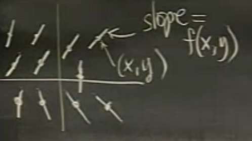
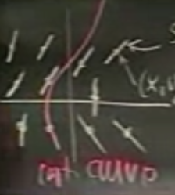
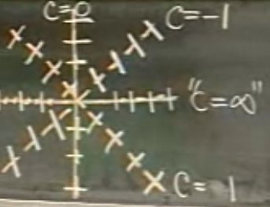
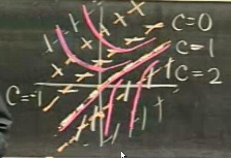
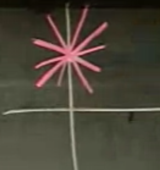
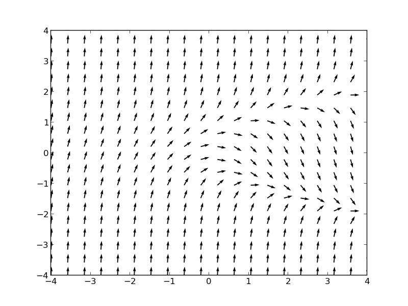

# Ders 1

Birinci derece normal diferansiyel denklemler (ordinary differential equtions
-ODE-) standart formunda $y'=f(x,y)$ gibi dururlar (bu form her zaman
elde edilemeyebilir, ama şimdilik yapılabildiğini kabul edelim).  Mesela

$$ y' = \frac{x}{y'} $$ 

ya da

$$y' = x-y^2$$

ya da

$$y' = y-x^2$$

Bu denklemlerden birincisi değişkenleri ayırma (seperation of variables)
yöntemiyle rahatça çözülebilir. 2. ve 3. denklemlerde bu
yapılamaz. 3. denklem başka bir şekilde kolayca çözülebilir, ama
2. analitik, formülsel olarak çözülemez. Yani daha ise başlar başlamaz en
basit gözüken, sadece birinci derece türevi içeren ODE'de bile analitik
çözüm olamayacağını görüyoruz. Bu formülü ileride sayısal olarak çözeceğiz.

Ve bu tür formüller matematikte istisna olmaktan ziyade kural sayılıyorlar (yani
çok karşımıza çıkıyorlar). 

Şimdi ODE'lere geometrik ve sayısal bakmanın yollarını göreceğiz.

Diyelim ki elimizde $y' = f(x,y)$ ODE'si var. Çözümlerden birinin
$y_1(x)$ olduğunu düşünelim. Geometrik olarak 

$$
\begin{array}{cc}
Analitik & Geometrik \\
\hline
y' = f(x,y)  & \textrm{Yön Alanları (Direction Field)} \\
y_1(x)  & \textrm{Entegral Eğrileri (Integral Curves)}
\end{array}
$$

Entegral eğimleri nasıl çizilir? Her $x,y$ için $f(x,y)$'in verdiği değer o
noktaya tekabül eden yerde bir "eğim (slope)'' olarak kabul edilir, ve o eğime
göre o noktada çizilir. Rasgele bir resim altta.



Sonra bu eğim parçacıklarına "her noktada'' teğet geçen çizgiler çizilir
(kırmızı renkliler), bunlar entegral eğimleridir.



Bir entegral eğimi, bir analitik çözüme eşdeğerdir. Teorisel olarak $y_1(x)$
$y'=f(x,y)$ için bir çözümdür, sadece ve sadece $y_1(x)$'in grafiği bir entegral
eğri ise. İspat: $y_1(x)$'i ODE içine koyalım, $y_1(x) = f(x,y_1(x))$. Peki
$y_1(x)$'in eğimleri nelerdir? Bu eğim $f(x,y_1(x))$'tır. İki taraf birbirine
eşit olduğuna göre entegral eğrileri ve analitik çözüm birbirine eşittir.

Bu eğimleri nasıl çizeriz? Bilgisayar şöyle yapar: bir x,y seçer, o x,y için
f(x,y)'yi mekanik olarak hesaplar ve o noktada bir eğim çizer. İnsan ne yapar:
Bir "eğim'' $c$ önceden "seçer'', ve o $f(x,y)=c$ için bu formüle uyacak
$f(x,y)$ ve onun üzerindeki eğim parçalarını birleştirerek çizmeye uğraşır.

Örnek 

$$ y' = \frac{-x}{y} $$

$$ \frac{-x}{y} = c $$

$$ y = \frac{-1}{c}x $$

c=1 için 0,0 noktasından geçen bir çizgi vardır.



O zaman entegral eğrileri neye benzer? Bir çembere. Hatta değişken ayırma
(seperation of variables) yöntemiyle çözseydik, sonuç $x^2+y^2=c^2$ türünde
olacaktı ki bu bir çemberin formülüdür.

Bir başkası

$$y' = 1+x-y$$

Bir c için eğimler

$$y = 1+x-c$$

ya da

$$y = x+(1-c)$$



Entegral eğrilerini çizerken bazı kurallar vardır: Biri, entegral eğrileri
çakışamazlar. Niye? Bu olabilseydi bir x,y noktasında iki ayrı eğim
hesaplanabilir demek olacaktı, fakat elimizde tek bir $f(x,y)$ fonksiyonu
var. Demek ki bu mümkün değil.

Ayrıca sonuşur olarak (sonsuza giderken, asymptotically) x sonsuza giderken
eğrilerin sağ tarafta bir yöne doğru gruplandığını, meyil ettiğini
görüyoruz. $y=x$'e doğru toparlanıyorlar. Demek ki $y=x$ bir
çözümdür. Kontrol edelim, diferansiyel denkleme koyarsak,

$$y' = 1+x-y$$

$$x' = 1+x-x$$

$$1 = 1$$

Demek ki $y=x$ bir çözüm ve bunu sadece geometriye bakarak anladık.

İkinci kural: iki entegral eğrisi birbirlerine teğet bile olamazlar, yani
birbirlerine dokunamazlar. İspat mevcudiyet ve özgünlük kanunu (existence and
uniqueness theorem). Teori der ki $x_o, y_o$ noktasında $y'=f(x,y)$'in bir ve
sadece bir tane çözümü vardır. 

Örnek: 

$$xy' = y - 1 $$

$$ \frac{dy}{y-1} = \frac{dx}{x} $$

İki tarafın entegralini al

$$ln|y-1| = ln|x| + c_1$$

$$y=1 = cx$$

$$y = 1-cx$$


Çözüm neye benzer? y=1 noktasından geçen her türlü düz çizgi bir çözümdür. 



Fakat y kordinatı tamamı üzerinde çözüm yoktur. Kesişme olan noktada ise
özgünlük yoktur. Yanlız diferansiyel denklemi $\frac{dy}{dy}$ solda olacak
şekilde, formda tanımlamamız lazım. 

$$ \frac{dy}{dy} = \frac{y-1}{x} $$

O zaman bu formülde x=0 noktasında formülün sürekliliğinin olmadığını (not
continuous) görüyoruz, ve hakikaten de bu süreksizlik diferansiyel denklemin
çözümünde mevcudiyet ve özgünlüğün bozulduğu yer ile aynı. 

ODE dünyasında bu çözümsüz noktalar her zaman ortaya çıkabiliyorlar. 

Grafik

Altta $y' = y^2-x$ formülünün vektör akış diyagramını grafiklemek için
kullanılan Python kodları bulunabilir.

```python
#
# MIT OCW ODE Mathlet Isoclines replacement in Python
#
from pylab import *
xmax = 4.0
xmin = -xmax
D = 20
ymax = 4.0
ymin = -ymax
x = linspace(xmin, xmax, D)
y = linspace(ymin, ymax, D)
X, Y = meshgrid(x, y)
deg = arctan(Y**2 - X)
QP = quiver(X,Y,cos(deg),sin(deg))
plt.savefig('isoclines.png')
```




