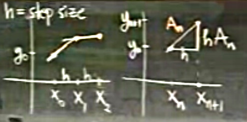
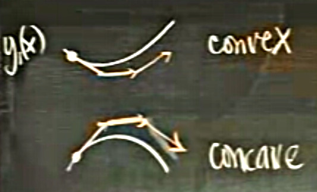
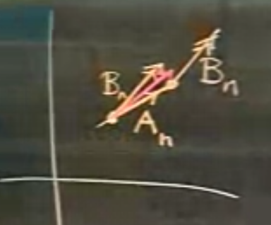
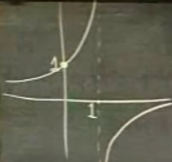
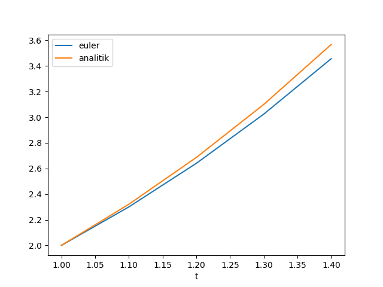
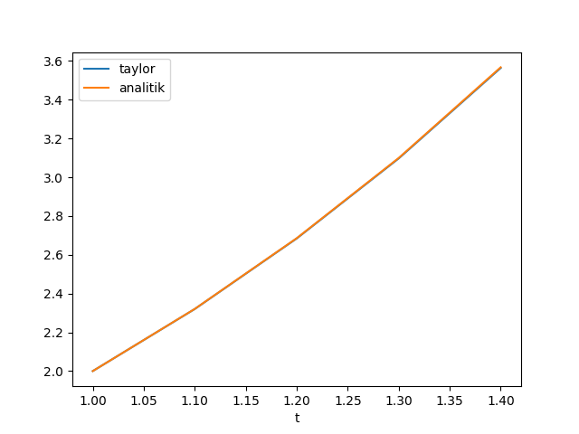

# Ders 2

Gerçek dünyada çoğu ODE sayısal (numerical) yöntemlerle
çözülür. Bilgisayarınızda bir ODE'yi grafiklettirdiğiniz zaman da aslında arka
planda bilgisayar o denklemi sayısal olarak çözmekte ve sonucu
grafiklettirmektedir. Bir başlangıç değerli (initial value) probleminin formunu
yazalım: 

$$
y' = f(x,y)
$$

$$
y_1(x_o) = y_o
$$

Problemde ilk satır ODE, ikinci satır bu ODE'nin başlangıç değeri, $x_0$ ve $y_0$
sabit değerler. 

Sayısal olarak (mesela Euler yöntemiyle) bu denklemi çözmek ne demektir?
Alttaki çizime bakalım, $y_0$'dan değerinden başlıyoruz, bu noktada
$x_0,y_0$ noktasındaki eğimi $y'$ ile hesaplıyoruz, ve bu eğim bize $y$'nin
olacağı bir sonraki yeri söylüyor. Bu eğim ile yukarı ya da aşağı
çıkıyoruz, ve bunu devam ettiriyoruz, ta ki bir sonuca gelinceye kadar.



Peki bahsedilen ODE bağlamında bir yere "gitmek'' ne demektir? Takip ettiğimiz,
cevap olarak odaklandığımız $y$ fonksiyonudur. Unutmayalım ki bu fonksiyonun tam
hali $y(x)$, yani $y$, $x$'in bir fonksiyonu, $y$'nin türevi $y$'nin $x$'e göre
türevi demek. Türev eğim demektir, eğim fonksiyonun o noktadaki kabaca,
yaklaşıksal bir yönüdür. O yönü takıp edersek o fonksiyonu aşağı yukarı takip
ediyoruz demektir.

Grafikte $h$ basamak mesafesi, yani $x$ üzerinde yaptığımız sabit zıplama
mesafesi. Bu kordinatta hangi aralıkla zıplıyoruz? 0.1 mi, 1 mi, 5 mi? Bunun
seçimini biz yapıyoruz. 

Euler Denklemleri bir adım için şöyle tanımlıdır:

$$ x_{n+1} = x_n + h $$

$$ y_{n+1} = y_n + hA_n $$

$$ A_n = f(x_n, y_n) $$

Bu basamaklar özyineli (recursive) olarak tanımlanır, bir sonraki adım, bir
önceki adımın değerlerini kullanır. 

Örnek

$$ y' = x^2 - y^2 $$

$$ y_1(0) = 1 $$

$$ h = 0.1 $$

Üstteki formül temel (elementary) fonksiyonlar kullanılarak çözülemez. O yüzden
Euler'in yöntemi gibi bir sayısal çözüm burada uygun olur. 

$$
\begin{array}{ccccc}
n & x_n & y_n & A_n & hA_n \\
\hline
0 & 0 & 1 & -1 & -0.1 \\
\hline
1 & .1 & .9 & -.80 & -0.08 \\
\hline
2 & .2 & .82 &  & 
\end{array}
$$

$y$ için eriştiğimiz sonuç .82 değeridir. Şimdi şunu soralım: Bu cevap çok
yukarıda mı çok aşağıda bir cevap mı? Pür sayısal sonuçlarda karşılaşılan bir
problem budur, gerçek cevabı analitik olarak bilmediğimiz için ona ne kadar
yaklaşıp yaklaşmadığımız. Cevabı geometrik olarak verelim. Eğer çözüm bir düz
çizgi olsaydı, Euler metodu her bu çizgi üzerinde hep doğru cevabı veriyor
olurdu. 



Eğer çözüm dışbükey (concave) olsaydı, üstteki gibi Euler metodu çok aşağı
düşecekti. İlk adımda fazla aşağı inecekti, ve sonra bu hatadan dönemeyecek, hep
esas fonksiyona uzak kalacaktı. İçbükey olunca benzer şekilde, ama fazla
yukarıda kalacaktı. 

Peki elimizde bir analitik cevap olmadığına göre cevabın düşbükey (convex) mi
içbükey mi (concave) olup olmadığını nereye bakarak anlayacağız? Calculus tekrar
hızır gibi imdada yetişiyor. İkinci türevi hatırlayalım: Eğer $y'' > 0$ ise
birinci türev sürekli artıyor demektir, yani $y$ dişbükeydir. Eğer $y'' < 0$ ise
tam tersi. Fakat hala bir problem var, analitik fonksiyon yok ise ikinci türevi
nasıl hesaplayacağız? Cevap: Diferansiyel fonksiyonun kendisini kullanarak.

$y' = x^2 - y^2$'nin türevini alırsak, 

$y'' = 2x - 2yy'$ sonucunu elde ederiz (türev alırken zincirleme kanununu
kullandığımıza dikkat).

O zaman başlangıç noktası $(0,1)$ de $y''$ nedir? $y'(0) = -1$, $y''= 2 \cdot 0
- 2\cdot 1 = 2$. Demek ki çözüm başlangıçta dişbükey, ve Euler çözümünü
uzun süreli takip etmezsek çözümün çok altında kalabiliriz. 

Tabii ki çözüm bir dış bir iç olarak sürekli değişen, dalgalı bir yapıda
olabilir, bu da mümkün. Burada asıl göstermek istediğimiz diferansiyel denklemin
kendisini kullanarak çözüm hakkında analitik hiçbir şey bilmeden onun hakkında
nasıl bilgi edinebileceğimizi görmektir. 

Hata Analizi


Hata analizi Euler'in çözüme ne kadar uzak kaldığının hesabıdır, yani $e$
sayısını hesaplamaktır. Bu değerin mutlak değeri (absolute value) kullanılır. 

Daha iyi sonuçlar için daha küçük $h$ basamakları kullanılabilir, o zaman sonuca
daha yakın kalabiliriz. O zaman $e$'nin $h$'ye bağlı olduğunu
söyleyebiliriz. Formülsel olarak bu ifade suna benzer:

$$
|e \sim c_1 h|
$$

Buna ifadeye göre Euler metotu birinci derece bir metottur denir, bu derecenin
ODE'nin derecesiyle alakası yok, $h$'nin üstteki formülde hangi üstel formde
olduğuyla alakalı. Birincil derecede bir ilişki mesela basamağı yarısına
indirince hatayı yarısına indirirmek demektir.

Euler metodundan daha bir yöntem bulmak demek, eğimi daha iyi hesaplayan bir
yöntem bulmak demektir. Eğer hatada rol oynayan en önemli faktör eğim olduğuna
göre, daha az hata için daha iyi eğim hesaplamak mantıklı olacaktır. 



Daha iyi eğim nasıl hesaplanır? Diyelim ki tek bir zıplama yerine iki kere
zıpladık. Dişbükey durumda birinci zıplamada çok aşağı, ikincide biraz daha
yukarı gidiyor olurduk, o zaman bunların ortalamasını alırsak, daha iyi bir eğim
elde edebilirdik. 

$$ x_{n+1} = x_n + h $$

$$ \hat{y}_{n+1} = y_n + h A_n $$

$$ B_n = f(x_{n+1},\hat{y}_{n+1}) $$

$$ y_{n+1} = y_n + h(\frac{A_n+B_n}{2}) $$

Niye şapkalı $y$ yani $\hat{y}$ kullandık? Çünkü ortalama hesaplamak için
aslında n+1 noktasında geçici bir değer hesaplıyoruz, bu geçiciliği göstermek
için $\hat{y}$ ifadesini kullandık.

Bu metot Heun, Geliştirilmiş (Improved) Euler, Değiştirilmiş (Modified)
Euler, RK2 gibi isimlerle anılır. RK2 Runga-Kutta'nın kısaltması, '2'
ibaresi bu yöntemin ikinci dereceli bir metot olmasıdır. Yani

$$ e \sim c_2 h^2 $$

Basamağı yarısına indirmek hatayı dörtte birine indirmek demektir. O zaman niye
bu metot her yerde kullanılmıyor? Çünkü RK2 ile eğim iki kere hesaplanıyor,
Euler ile bir kere, yani sayısal kod iki kat daha fazla çalışmak, yani daha
yavaşlamak zorundadır. 

RK4 te var, bu dördüncü seviyede bir metot. Eğim şöyle hesaplanır:

$$ \frac{A_n + 2B_n + 2C_n + D_n}{6} $$

Sayısal Yöntemlerde Bazı Tehlikeli Noktalar

1) Hoca ödevde bizim keşfetmemizi istedi

2) Şu basit denkleme bakalım: $y' = y^2$. Değişkenleri ayıralım ve analitik cevabı
$y=\frac{1}{c}$. O zaman bu denklemi sayısal olarak çözerken alttaki grafik
takip ediliyor olacak.



Diyelim ki $y(0) = 1$'den başladık ve $y(2)$'i bulacağız. Sağa doğru yavaş yavaş
gidiyoruz ama problem, bu fonksiyon $y(1)$ değerinde sonsuza gidiyor. Demek ki
adım adım sağa giden sayısal çözüm o noktayı hiçbir zaman aşamayacaktır,
sonsuzlukta kaybolacaktır. Bu tehlikeli noktayı önceden tahmin edemez miydik?
Hayır. Üstteki diferansiyel denklemin her çözümünün kendine has bir eşsizsel
(singularity) noktası vardır ve bundan sadece kendisi haberdadır.

Ekler

Taylor Açılımı Bağlantıları

Euler yöntemininin çoğu kaynakta ODE sistemini "entegre ettiği'' söylenir;
hakikaten de bir entegrasyon yapıyoruz, yani $dy$ değişim formülünü $y$'ye
uygulayarak adım adım ilerliyoruz, $y$'nin değerlerini bulmuş oluyoruz, bu
bir entegrasyon işlemidir. Euler fonksiyonu ile analitik fonksiyonları
sayısal entegre etmiş oluyoruz.

Range-Kutta ile atılan adımlar üzerinde oynama yapılarak ilerleme sağlanmaya
uğraşılıyor. Fakat aslında Taylor açılımı kullanarak ta ODE çözmek mümkün [1,
  sf. 395]. Bu metot çoğunlukla teşvik edilmiyor çünkü bazı denklemlerin 2.,
3. türevini sembolik olarak almak çok zor. Fakat otomatik türev ile, bkz [2], bu
türevler rahatlıkla alınabilir. Altta gösterme amaçlı olarak sembolik alınabilen
türevli ODE gösteriyoruz.

ODE bir $y(t)' = f(x,y)$ sistemidir, 

$$ y(t)' = t + y , \quad y(1) = 2$$

Bu sistemin çözümü biliniyor, 

$$ y(t) = -t -1 + 4e^{-1}e^t$$

Eğer çözüm bilinmeseydi, sayısal olarak çözmek gerekecekti. $a$ yakınında
$g(x)$'in Taylor açılımını analitik olarak biliyoruz,

$$ g(x) = g(a) + g'(a)(x-a) + g''(a) \frac{(x-a)^2}{2}$$

Eğer $x$'i $h$ adım atarak $a$'den gelinen nokta olarak belirtirsek

$$ x=a+h$$

$$ g(a+h) = g(a) + g'(a)h + g''(a)\frac{h^2}{2}$$

Bu açılım özyineli bir hesabı ima ediyor; yani $h$ adımı sonrasında elde
edilen yeni $g$'nin bir önceki adımdaki değerler ile nasıl bağlantılı
olduğunu gösteriyor. O zaman $g$ yerine üstteki $f$ tanımını geçirirsek,

$$ y_{k+1} = y_k + h \frac{d}{dt} f(t_k,y_l) + \frac{h^2}{2} \frac{d^2}{dt} f(t_k,y_l)$$

$$  = y_k + hf(t_k,y_k) + \frac{h^2}{2} \frac{d}{dt} f(t_k,y_l)$$

Aslında Euler yöntemi olarak bilinen yöntem üstteki formülde ilk iki
terimin tutulup gerisinin atılmasıyla elde edilmiştir. O zaman daha iyi
hesap için üstteki tüm terimleri (hatta açılımı devam ettirerek daha bile
fazlasını) kullanabilirdik. 3. terimdeki diferansiyel hesabı için, tam
diferansiyel (total derivative) tanımından,


$$ 
df = \frac{\partial f}{\partial t} dt + \frac{\partial f}{\partial y} dy
$$

Yani

$$ 
\frac{df}{dt} = \frac{\partial f}{\partial t} + 
\frac{\partial f}{\partial y} \frac{dy}{dt} 
$$

$y'(t)=dy/dt$ olduğuna göre $t + y$'ye eşittir, onu üstte yerine koyarız,
kısmi türevleri de hesapladıktan sonra,

$$ 
\frac{df}{dt} =  1 + t + y
$$

O zaman 

$$  = y_k + hf(t_k,y_k) + \frac{h^2}{2} (1 + t_k + y_k) $$

İlk önce normal Euler gösterelim,

```python
import pandas as pd
y1 = 2; t = 1.; N = 5; h = 0.1
vals = []
for i in range(N): 
    yreal = -t-1+4*(1./np.e)*np.exp(t)
    vals.append([t, y1, yreal])
    y1 = y1 + (t + y1)*h
    t = t + h
df = pd.DataFrame(vals)
df.columns = ['t','euler', 'analitik']
df = df.set_index('t')
print df
df.plot()
plt.savefig('2_6.png')
```

```
      euler  analitik
t                    
1.0  2.0000  2.000000
1.1  2.3000  2.320684
1.2  2.6400  2.685611
1.3  3.0240  3.099435
1.4  3.4564  3.567299
```



Oldukça büyük bir sapma var. Şimdi tüm Taylor terimlerini kullanalım,

```python
import pandas as pd
y2 = 2; t = 1.; N = 5; h = 0.1
vals = []
for i in range(N): 
    yreal = -t-1+4*(1./np.e)*np.exp(t)
    vals.append([t, y2, yreal])
    y2 = y2 + (t + y2)*h + (1+t+y2)*(h**2/2)
    t = t + h
df = pd.DataFrame(vals)
df.columns = ['t','taylor', 'analitik']
df = df.set_index('t')
print df
df.plot()
plt.savefig('2_7.png')
```

```
       taylor  analitik
t                      
1.0  2.000000  2.000000
1.1  2.320000  2.320684
1.2  2.684100  2.685611
1.3  3.096931  3.099435
1.4  3.563608  3.567299
```



Runge-Kutta

Taylor Serileri ile hesap yapmanın bir dezavantajı var, hesaplanan
fonksiyonun ikinci, üçüncü ve daha yüksek türevlerinin analitik olarak
elde edilebilmesi gerekiyor. Bu hesap her zaman kolay elde
edilmeyebilir. Runge-Kutta metotu daha yüksek türevlerin yerine farklı
$f$ hesaplarının bir şekilde ağırlıklarını alarak aynı sonuç erişiyor
[3, sf. 282]. RK yönteminin hata payı Taylor yöntemine eşittir, daha
doğrusu RK2 ikinci derece sonrası terimleri atılmış Taylor
yaklaşıksallamasına eşittir, RK4 aynı şekilde dördücü derece için.

RK yaklaşımını direk Taylor serilerinden türetmek mümkün, RK4 için gereken
dördüncü derece ve üstü cebirsel türetim olarak oldukca çetrefilli, fakat bir
fikir vermesi açısından ikinci derece için gereken türetimi burada göstereceğiz.

Yine Taylor serilerinden başlayalım, eldeki bir diferansiyel denklem

$$
y' = f(x,y)
$$

için [4, sf. 713],

$$
y_{i+1} = y_i + f(x_i,y_i) h + \frac{f'(x_i,y_i)}{2!} h^2 + ...
\qquad (1)
$$

ya da

$$
y_{i+1} = y_i + y'_i h + \frac{y_i''}{2!} h^2 + ..
$$

olduğunu biliyoruz. İkinci derece Runge-Kutta için deriz ki üstteki formüldeki
$y_i$ sonrası $f$ bazında bir formül olacak, türev içermeyecek [4, sf. 730],

$$
y_{i+1} = y_i + (a_1 k_1 + a_2 k_2) h
\qquad (2)
$$

ki

$$
k_1 = (x_i,y_i), \quad k_2 = f(x_i+p_1 h, y_i + q_{11}k_1h)
$$

Dikkat değerler $a_1,a_2,p_1,q_{11}$ katsayıdır, onların ne olduğunu bulmamız
gerekiyor. Bunun için $k_2$'nin Taylor Serisi açılımını yapıp birleşik formülün
ana Taylor serisi açılımıyla olan benzerliklerine bakıp katsayıları bu benzerlik
üzerinden bulmaya çalışacağız.

Ana Taylor serisi açılımının başlangıç noktası (1), tabi bir $f'(x_i,y_i)$
türevi var, bu türevi Zincirleme Kanunu ile açacağız, genel formda bu kanun

$$
f'(x_i,y_i) = \frac{\partial f(x,y)}{\partial x} +
\frac{\partial f(x,y)}{\partial y} \frac{\mathrm{d} y}{\mathrm{d} x}
$$

Üstteki formülü (1) içine sokarsak,

$$
y_{i+1} = y_i + f(x_i,y_i) h +
\left( \frac{\partial f(x,y)}{\partial y} \frac{\mathrm{d} y}{\mathrm{d} x}  \right) \frac{h^2}{2}
\qquad (3)
$$

Şimdi $k_2$'nin açılımına gelelim, burada iki değişkenli Taylor açılımı gerekli,
bu açılım genel formda şöyle gider,

$$
g(x+r,y+s) = g(x,y) + r \frac{\partial g}{\partial x} + s \frac{\partial g}{\partial y} + ...
$$

Uygulanırsa,

$$
f(x_i+p_1 h, y_i + q_{11}k_1h) = f(x_i,y_i) +
p_1 h \frac{\partial f}{\partial x} +
q_{11} k_1 h \frac{\partial f}{\partial y} + ...
$$

Bu ifadeyi (2) içindeki $k_2$'ye sokalım, $k_1$ tanımını da kullanalım, ve
(2)'yi bu şekilde tekrar yazalım,

$$
y_{i+1} = y_i + a_1 h f(x_i,y_i) + a_2 h f(x_i,y_i) +
a_2 p_1 h^2 \frac{\partial f}{\partial x} +
a_2 q_{11} h^2 f(x_i,y_i) \frac{\partial f}{\partial y} + ..
$$

$h$ ve $h^2$ bazlı terimleri toplayıp ayrı gruplar halinde yazarsak, ve
nokta noktalı bölümü atalım,

$$
y_{i+1} = y_i + [a_1 f(x_i,y_i) + a_2 f(x_i,y_i)] h +
\left[a_2 p_1 \frac{\partial f}{\partial x} +
 a_2 q_{11} f(x_i,y_i) \frac{\partial f}{\partial y}
\right] h^2
$$

Şimdi üstteki son formül ile (3) karşılaştırması yapalım, bu iki denklemin eşit
olması için ne gerekir? Şunlar,

$$
a_1 + a_2 = 1
$$

$$
a_2 p_1 = \frac{1}{2}
$$

$$
a_2 q_{11} = \frac{1}{2}
$$

Bu denklemleri çözersek ve sabitleri bulursak bize gereken türevsiz, $f$'nin
ağırlıklanmış halini kullanarak çözüm yapabiliriz. Fakat bir problem var, elde 3
denklem ama 4 bilinmeyen var, özgün bir çözüm bulmak mümkün değil. Şöyle bir
çözüm olabilir, eğer bir sabite bir değeri kendimiz atarsak, geri kalanları ona
göre bulabiliriz. Diyelim ki $a_2 = 1/2$ dedik, o zaman $a_1 = 1/2$ ve $p_1 =
q_{11} = 1$. Bu bize Heun metodu denen yaklaşımı verir,

$$
y_{i+1} = y_i + \left( \frac{1}{2} k_1 + \frac{1}{2} k_2 \right) h
$$

ki

$$
k_1 = f(x_i,y_i)
$$

$$
k_2 = f(x_i + h, y_i + k_1 h)
$$

Örnek

Alttaki denklemi Heun yaklaşımı ile çözelim,

$$
y' = -2x^3 + 12x^2 - 20x + 8.5
$$

```python
h = 0.5
yreal = [1, 3.21875, 3, 2.21875, 2, 2.71875, 4, 4.71875, 3]
def f(x,y): return -2*(x**3) + 12*(x**2) - 20*x + 8.5
x = np.linspace(0,4,9)
yrk = np.zeros(len(x))
yrk[0] = 1
for i in range(1,len(yreal)):
    k1 = f(x[i-1],None)
    k2 = f(x[i],None)
    yrk[i] = yrk[i-1] + 0.5* (k1 + k2)*h
    
plt.plot(x,yreal)
plt.plot(x,yrk)
plt.legend([u'Gerçek','RK2'])
plt.savefig('2_8.jpg')
```


RK4

En popüler Runge-Kutta metotu dördüncü derecedir, aynen ikinci
derecede olduğu gibi sonsuz tane çeşidi olabilir (hatırlarsak RK2 ile
bir sabite değeri biz atadık, farklı atamalar için farklı RK çeşitleri
elde edilebilir), fakat alttaki form en yaygın kullanılan formdur [4,
sf. 735].

$$
y_{i+1} = y_i + \frac{1}{6} (k_1 + k_2 + k_3 + k4) h
$$

ki

$$
k_1 = f(x_i,y_i)
$$

$$
k_2 = f \left( x_i + \frac{1}{2} h, y_i + \frac{1}{2}k_1 h  \right)
$$

$$
k_3 = f \left( k_i + \frac{1}{2} h, y_i + \frac{1}{2}k_2 h  \right)
$$

$$
k_4 = f(x_i+h, y_i + k_3 h)
$$

Şimdi Runge-Kutta dördüncü derece çözüm yaklaşımını bir örnekte görelim.

Sarkaç Problemi

Bağlantı noktasında sürtünme içerebilecek basit bir şarkacın hareket denklemleri
[5, sf. 842],

$$
\ddot{\theta} + b\dot{\theta}  c\sin(\theta) = 0,
\quad
t \ge 0, \theta(0)=\theta_0,
\quad
\dot{\theta} = \dot{\theta}_0
\qquad (1)
$$

olarak verilebilir. Bu denklemi ODE sistemi olarak çözmek için yeni değişken
tanımları üzerinden onu iki parçaya ayırıyoruz,

$$
\vec{x} = x =
\left[\begin{array}{ccc}
    x_1 \\ x_2
\end{array}\right] = 
\left[\begin{array}{c}
    \theta \\ \dot{\theta}
\end{array} \right],
\quad
f(t,x) = \left[\begin{array}{c}
\dot{\theta} \\ -b \dot{\theta} - c\sin\theta
\end{array} \right]
$$

Bu tanımlarla $\dot{x}$ ifadesi

$$
\dot{x} = \left[
  \begin{array}{c} \dot{\theta} \\ \ddot{\theta} \end{array}
\right]
$$

haline gelir,  ve $\dot{x} = f(t,x)$ matris denkleminde 

$$
\left[\begin{array}{c} \dot{\theta} \\ \ddot{\theta} \end{array}\right]=
\left[\begin{array}{c} \dot{\theta} \\ -b \dot{\theta} - c\sin\theta \end{array}\right]
$$

alt satıra odaklanırsak, orada (1) denklemine geri gidebileceğimizi görebiliriz.

Sayısal çözüme gelirsek, benzer bir problemin çözümünü [6]'de işlemiştik.  O
derste bir paket çağrısı olan `odeint` kullanılmıştı, bu paketin
entegrasyonu nasıl yaptığından bahsedilmemişti. Şimdi daha detaylandıralım,
`odeint` kodu iç mantığında dördünce derece Runge-Kutta çözümü kullanır,
yani RK4 yaklaşımını. RK4 formülleri üstte verildi, [5, sf. 803] üzerinden
bir daha paylaşalım,

$$
k_1 = h f(t_i, y_i)
$$

$$
k_2 = h f(t_i + h/2, y_i + k_1/2)
$$

$$
k_3 = h f(t_i + h/2, y_i + k_2/2)
$$

$$
k_4 = h f(t_i + h, y_i + k_3)
$$

$$
y_{i+1} = y_i + (k_1 + 2 k_2 + 2 k_3 + k_4) / 6
$$

ki başlangıç değerleri $y_0 = (\theta_0,\dot{\theta}_0)$ olmak üzere. Çözmek
istediğimiz sistemde sürtünme yok, yani $b=0$, geri kalan değerler $c=1$,
$\theta_0=0.1$, $\dot{\theta}_0 = 1.0$.


```python
n = 256; theta0 = 0.1; dtheta0 = 1.0; h = 0.1; c = 1.0

theta_values = np.zeros(n)

for i in range(n):
    K1theta = h * dtheta0
    K1dtheta = -h * c * np.sin(theta0)
    theta1 = theta0 + 0.5 * K1theta
    dtheta1 = dtheta0 + 0.5 * K1dtheta # b=0, bir terim yokoldu burada
    K2theta = h * dtheta1
    K2dtheta = -h * c * np.sin(theta1)

    theta1 = theta0 + 0.5 * K2theta
    dtheta1 = dtheta0 + 0.5 * K2dtheta
    K3theta = h * dtheta1
    K3dtheta = -h * c * np.sin(theta1)
    theta1 = theta0 + K3theta
    dtheta1 = dtheta0 + K3dtheta
    K4theta = h * dtheta1
    K4dtheta = -h * c * np.sin(theta1)
    theta1 = theta0 + (K1theta + 2.0 * K2theta + 2.0 * K3theta + K4theta) / 6.0
    dtheta1 = dtheta0 + (K1dtheta + 2.0 * K2dtheta + 2.0 * K3dtheta + K4dtheta) / 6.0
    theta_values[i] = theta1
    theta0 = theta1
    dtheta0 = dtheta1

plt.ylim(-1.20,1.20)
plt.plot(range(n), theta_values)
plt.savefig('phy_005_basics_06_01.jpg')
```


Çözümün üstteki grafiği şarkacın (dikey eksene göre olan) açılarının zamana göre
grafiğini gösteriyor. Metot stabil gözüküyor, açıda azalma ya da patlama olmadı,
$b=0$ şartını koştuğumuz için bunun hesaba yansıması iyi oldu, sürtünme yoksa
sönüm (damping) görülmemeliydi. 

Kaynaklar

[1] Ackleh, *Classical and Modern Numerical Analysis Theory*

[2] Bayramlı, Bilgisayar Bilim, Yapay Zeka, *Otomatik Türev Almak*

[3] Faires, *Numerical Analysis, 9th Ed*

[4] Canale, *Numerical Methods for Engineers, 7th Ed*

[5] Eberly, *Game Physics 2nd Ed*

[6] Bayramlı, *Gayrı-Lineer Dinamik ve Kaos Ders 1*


