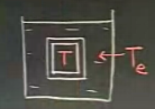
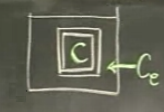

# Ders 3

Birinci Derece Lineer ODE

ODE konusunda en önemli denklemler 1. derece lineer
ODE'lerdir. Matematiksel pek çok modelde sürekli ortaya çıkarlar, ve
analitik olarak çözülebilir haldedirler. Şuna benzerler:

$$ a(x)y' + b(x)y = c(x) $$

Niye lineer? Çünkü üstteki formül $y$ ve $y'$ bağlamında lineer, 
$ay_1 + by_2 = c$'de $y_1$ ve $y_2$'nin lineer olması gibi lineer.

Eğer $c = 0$ ise bu denkleme homojen denir. 

1'inci formül yaygın form'dur, ama standart form değildir. Standart lineer
form alttakine benzer. İlk katsayı (coefficient) 1 değerinde olmalıdır,
yaygın formu standarta çevirmek için tüm denklem $a(x)$'e
bölünebilir. $b/a$ olunca harf değiştirilir, $p$ denir, diğerine $q$ denir.

$$ y' + p(x)y = q(x) $$

1'inci derece lineer ODE'lerin ortaya çıktığı modeller ısı (heat) konsantrasyon
modelleri, karışım (mixing) modelleri, daha az önemliler radyoaktif çürüme, faiz
hesabı, bazı hareket modelleri, vs. Bugün kullanacağımız model ısı konsantrasyon
modeli, ismini değiştirerek iletim (conduction) ve yayılma (diffusion)
kelimelerini kullanacağız.

Aktarma modeli ile başlayalım. 

Diyelim ki elimizde içinde şu olan bir kap var, ve bu kap içinde tam ortada
(bir şekilde) asılı duran bir kutu (küp) var. Bu kutunun duvarları kısmen
izole edilmiş. İçerideki kutunun sıcaklığı $T$ ve dış bölmenin sıcaklığı
$T_e$, $t$ zaman. Bu durum için nasıl bir diferansiyel denklem kurarız?

Newton'un Soğuma Kanununu kullanıyoruz ve sıcaklığın aktarılarak başka bir
noktaya geçtiğini düşünüyoruz (sıcaklık radyasyon üzerinden de seyahat
edebilir), ve şu modeli kuruyoruz.

$$ \frac{dT}{dt} = k(T_e - T) $$

$k > 0$ akışkanlık (conductivity), bir sabit.

$$ T(0) = T_0 $$

$T$'nin zamana göre bir fonksiyon olduğunu unutmayalım. Kısa olsun diye
çoğu zaman $T(t)$ ibaresi kullanılmıyor.

Yayılma (diffusion) modeli nasıl olurdu? 

Bu model formülsel olarak neredeyse aynı, diyelim ki bu sefer küp içinde
tuz var, konsantrasyonu $C$, dışarıdaki tuz kontsantrasyonu $C_e$. Yayılma
modelinde tuzluluk "yayılıyor'', yüksek konstrasyondan alçak olana doğru
gidiyor. Bu modelde tuzun yayılma hızı, konstantrasyonlar arasındaki farka
bağlıdır.

$$ \frac{dC}{dt} = k(C_e - C) $$

Isı aktarım formülü standart lineer formda değil, bu değişimi yapalım, ki
en azından lineer olduğunu görmüş olalım.

$$ \frac{dT}{dt} + kT = kT_e $$

Çözelim

$$ y' + p(x)y = q(x) $$

Bu formülü entegre edici faktör (integrating factor) $u(x)$ kullanarak
çözeceğiz.

$$ uy' + puy = qu $$

Burada yapmak istediğimiz öyle bir $u$ bulmak ki sağ ve sol taraf
onunla çarpılınca sol taraf bir şeyin türevi haline gelsin:

$$ ( ... )' = ..  $$

Böylece $x$'e göre iki tarafın entegralini alınca türev işlemi
kaybolur, daha temiz bir ifade geriye kalır. 

Parantez içinde ulaşmaya çalışacağımız ifade neye benzemeli? Hoca
$(uy)'$ fikrini ortaya attı. Bunun niye mantıklı bir seçim olduğunu
görmek zor değil, eğer $(uy)'$ üzerinde türevin çarpım kuralını
kullanırsak, açılımı zaten 

$$ uy' + u'y $$

olacaktır, ki bu ifade $uy' + puy = qu$ formülünün sol tarafına
yakındır. Tek bir farkla, $u'$ yerine elimizde $pu$ var. O zaman u
öyle seçilmeli ki $u' = pu$ olsun. 

$$ u' = pu $$

Değişkenleri ayır

$$ \frac{du}{u} = p $$

Entegrali al

$$ \int \frac{du}{u}  = \int p $$

$$ ln (u) = \int p(x) \mathrm{d} x $$

Buradan $u$'nun ne olacağını kestirebiliriz. Unutmayalım, tüm $u$'lara
ihtiyacım yok, üstteki ifadeyi tatmin eden herhangi bir $u$
olabilir. Üstteki formülün iki tarafını $e$ bazına tabi tutarsak

$$ u = e^{\int p(x) \mathrm{d} x} $$

İşte entegre edici faktörü bulduk. Herhangi bir (arbitrary) sabite ihtiyaç
yok çünkü tek $u$ kullandık.

Metotu tekrar baştan gözen geçirelim. Elimizde şu var:

$$ y'+py = q $$

1. Eğer formül standart lineer formda değilse o forma geçir, çünkü
entegre edici formülde $p$ var, eğer form doğru değilse doğru $p$
gelmez, işler sarpa sarar.

2. Entegre edici faktör $$ e^{\int p(x) \mathrm{d} x} $$ bul.

3. ODE'nin iki tarafını bu faktör ile çarp.

4. Entegre et

Örnek

$$ xy' - y= x^3 $$

Standart form

$$ y' - \frac{1}{x}y = x^2 $$

Entegre edici faktör

$$ e^{-ln(x)} $$

Bunu daha basitleştirebiliriz,

$$ e^{-ln(x)} = (e^{ln(x)})^{-1} = x^{-1} = \frac{1}{x}  $$

Standart formun iki tarafını bu faktör ile çarpalım

$$ \frac{1}{x}y' - \frac{1}{x^2}y = x $$

Eğer her şeyi doğru yaptıysak sol tarafı direk entegre
edebiliriz. Parantezli forma koyalım, ve parantez içinin hakikaten
üstteki sonucu verip vermediğine de dikkat edelim.

$$ (\frac{1}{x}y)' = x $$

Entegrali alınca

$$ \frac{1}{x}y = \frac{x^2}{2} + C $$

$$ y = \frac{x^3}{2} + C $$

Sonucu bulduk.

Örnek 

$$ (1+\cos(x))y' - (\sin(x))y = 2x $$

$$ y' = \frac{\sin(x)}{1+\cos(x)}y = \frac{2x}{1+\cos(x)} $$

Ent. edici faktör

$$ - \int \frac{\sin(x)}{1+\cos(x)} \mathrm{d} x $$

Bu bayağı korkutucu bir entegral gibi gözüküyor. Fakat dikkatli bakarsak
bölümün üst tarafı alt tarafının türevi. Bu çok iyi, o zaman entegrasyon şu
sonucu verir:

$$ \ln (1+\cos(x)) $$

Faktör ise

$$ e^{\ln (1+\cos(x))} = 1+\cos(x) $$

İki tarafı faktör ile çarpalım

$$ (1+\cos(x)) y' - \sin(x)y = 2x $$

Burada ilginç bir durum var, bu sonuç örneğin ta kendisi! Buradan anlıyoruz
ki ODE daha baştan beri parantez içinde gruplanabilir bir haldeymiş. Yani

$$ [(1+\cos(x))y]' = 2x $$

İki tarafın entegralini alalım

$$ (1+\cos(x))y = x^2 $$

$$ y = \frac{x^2+C}{1+\cos(x)} $$

Diyelim ki problem bize bir başlangıç şartı, $y(0) = 1$ verdi. O zaman

$$ 1=\frac{c}{2}, c=2 $$

Bunu $y$ formülüne koyarsak çözümü tamamlamış oluruz. 

k Tane Sabit İçeren Lineer ODE

Bu formda $p(x)$ bir sabit olacak, bu sabitli form oldukça önemli, banka
hesapları vs. gibi pek çok modelde karşımıza çıkıyor.

$$ \frac{dT}{dt} + kT = kT_e $$

Faktör? k'nın entegrali nedir? $\int k \mathrm{d} t = kt$. O zaman

$$ e^{kt} $$

İki tarafı bununla çarpalım. 

$$ (e^{kt} T)' = kT_e e^{kt} $$

İki tarafın entegralini alalım

$$ e^{kt} T = \int kT_e(t) e^{kt} \mathrm{d} t + C$$

$$ T = e^{-kt} \int kT_e(t) e^{kt} \mathrm{d} t + C e^{-kt} $$

Çoğu insan, çoğunlukla mühendislik literatüründe, üstteki çözümü tanımsız
(indefinite) entegral halinde bırakmayı sevmez, çünkü tanımsız entegral
.. tanımsızdır; başka bir deyişle tanımsız bir entegral bir değil pek çok
mümkün fonksiyonları aynı anda temsil eder, ve bu tüm mümkün fonksiyonların
arasındaki fark sonsuz tane farklı olabilecek sabit sayıdır (bu yüzden
zaten başlangıç şartını alarak somut bir $C$ değeri bulmaya çalışırız).

Bu tür literatürde eğer bir başlangıç şartı var ise, mesela $T(0) = T_0$
gibi, bu kişiler tanımsız entegrali şu şekilde tanımlı hale getirmeyi
seviyorlar.

$$ T = e^{-kt} \int_0^t kT_e(t_1) e^{kt_1} \mathrm{d} t_1 + C e^{-kt} $$

Yani alt sınır olarak sıfır, üst sınır olarak $t$ alınıyor. Yeni bir $t_1$
değişkeni koyulur, bu bir fuzuli (dummy) bir değişkendir, sadece yer
tutması için oraya konur. Bu neyi sağlar? Zaman $t=0$ olduğunda ne olduğuna
bakalım, o zaman toplamın sol tarafı tamamen yokoluyor, geriye sadece
$C = T_0$ kalıyor, böylece hem $C$ değerini $T_0$ olarak kullanabilmiş
oluruz, hem de tanımsız entegrali tanımlı hale getirmiş oluruz.

Peki $t$ sonsuza giderken, yani çok zaman geçtikçe, bu sisteme ne olur?
$k > 0$ şartını unutmayalım, sonsuza gidilirken bu sefer toplamın sağ
tarafı sıfıra gider. Çünkü eksi değerli bir üstel değer $k$ hep artı
kalacağına göre büyüdükçe $e$ değerini sıfıra götürür. Bu sistemin
istikrarlı konum (steady state) çözümü şudur.

$$ T = e^{-kt} \int_0^t kT_e(t_1) e^{kt_1} \mathrm{d} t_1 $$

Sıfıra giden kısım "geçici'' bölüm olarak adlandırılır.

Bu bize bir şey daha söylüyor. Sonsuza giderken sıfıra giden bölümde
başlangıç şartı vardı. Demek ki başlangıç şartının uzun zaman geçtikçen
sonra varılacak nokta konusunda hiçbir önemi, etkisi yoktur. Nereden
başlarsak başlayalım, bir süre sonra aynı noktaya varırız.

