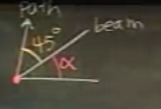
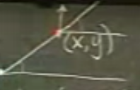
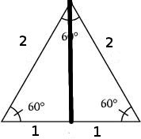

# Ders 4

Bu derste diferansiyel denklemlerde "değişken değiştirme'' tekniğini
göreceğiz. Önceki derslerde iki türlü ODE çözme yöntemi gördük. Birinde
değişkenleri ayırabiliyorduk, diğeri lineer denklemler idi. İşin ilginç
tarafı o tür denklemler ve gösterilen çözümler her zaman işleyen yegane
"genel'' yaklaşımlardır. Diğer tür denklemlerde değişkenin yerine bir
başkasını geçirerek onu kesinlikle çözebildiğimiz bir forma indirgemeye
uğraşırız.

İlk göreceğimiz değiştirme tekniği ölçekleme (scaling) olacak. 

Ölçekleme, denklemin kullandığı kordinat sisteminde eksenleri (birini,
ya da hepsini) uzatıp, kısaltmak anlamına gelir.

Diyelim ki $y' = f(x,y)$ formülümüz var. Yeni kordinat şöyle olsun

$$ x_1 = \frac{x}{a} $$

$$ y_1 = \frac{y}{a} $$

$a,b$ sabit değerler. Böylece $x,y$ kordinatlarını ölçeklemiş olduk.

Niye kordinat sistemini değiştirmek isteriz? 1. Belki ölçümlerin birimini
değiştirmek istiyoruzdur (fizikte buna ihtiyaç oluyor mesela). 2. Bazen
değişkenleri boyutsuz yapmak istiyor olabiliriz -kg, cm birimler olmadan-,
yani değiştirdiğimiz şeyi hiç bir birime sahip olmayacak hale getirmek,
sadece pür sayı yapmak. Fizikte birimlerle boğuşmanın dertleri malum. 3. Ya
da ODE'deki sabit sayısını azaltmak ya da sabitleri basitleştirmek için bu
yapılabilir.

Bir örnek görelim. Bu örnek çok yüksek derecelerde kullanılan
soğuma kanunudur. 

$$ \frac{dT}{dt} = k(M^4 - T^4) $$

T: iç sıcaklık

M: sabit

Tekrarlayalım, bu kanun çok büyük sıcaklık farklarında kullanılır, çünkü o
seviyelerde Newton'un Soğuma Kanunu işlemiyor.

İlk değişimi yapalım, bu bir ölçekleme operasyonu olsun. $T$ ve $M$'nin
arasında bir bağlantı kuralım. Yeni değişken $T_1$ olsun ve şöyle
tanımlansın

$$ T_1 = \frac{T}{M} $$

$T$ değişkeni sıcaklık belirttiği için, celcius, fahrenheit gibi bir birime
sahiptir, $M$ aynı şekilde. Üstteki bölümü yapınca sonuç birimsiz bir hale
gelecektir. Peki denklemdeki değişkeni nasıl değiştireceğim?

Yerine geçireceğimiz değişken $T$ olduğuna göre, o formda bir formül
kullanırsak daha iyi olur. Yani

$$ T = T_1M $$

ODE bu formüle göre tekrar düzenlenirse

$$ M\frac{dT_1}{dt} = kM^4(1-T_1^4)$$

$$ \frac{dT_1}{dt} = k_1(1-T_1^4)  $$

$kM^3 = k_1$ dedik, yani yeni bir sabit yaratmış olduk, bu tekniğe
"sabitleri toparlama (lumping)'' adı veriliyor.

Ne değiştirmiş, ilerletmiş olduk? Denklemin sağ tarafı birimsiz hale geldi
($T_1$ birimsiz). Sol tarafta tek birim zamanın tersi, yani $zaman^{-1}$,
$1/zaman$. Birimler azaldı. Ayrıca artık denklemde bir tane daha az sabit
var, daha temiz duruyor.

İki tür yerine geçirme (substitution) yöntemi vardır. Biri direk yöntem,
yeni bir değişken getirilir, bu değişken eskilerin bir tür kombinasyonudur,
önceki örnekte $T_1 = T / M$. Öteki tersine çevirme (inverse), bu yöntemde
eski bir değişken eski ve yeni olanların bir tür kombinasyonu olur, mesela
$T = MT_1$.

Bu farklılığı Calculus dersinde görmüşsünüzdür, hatırlatmak gerekirse,
tipik olarak şu entegrali çözmek gerekince

$$ \int x \sqrt{1-x^2} \mathrm{d} x $$

Yerine geçirmek için $u = 1-x^2$ kullanılır, böylece $dx$ $du$ geçişi
yapılabilir, vs. Bu direk yöntemin bir örneği olurdu. Eğer şu olsaydı

$$ \int \sqrt{1-x^2} \mathrm{d} x $$

ki $x = \sin(u)$ kullanmak daha iyi olurdu. Bu da tersten yöntemin bir
örneği.

Örnek

Direk Yerine Geçirme

$$ y' = p(x)y + q(x)y^n, \quad  n \neq 0,1 $$

Bu denkleme Bernoulli Denklemi denir. 

Denklemi $y^n$'e bölelim. 

$$ \frac{y'}{y^n} = p(x) \frac{1}{y^{n-1}} + q(x) $$

Bunu bir lineer denkleme çevirebiliriz, nasıl? Yerine geçirme için $v$
diye yeni bir değişken kurgulayalım:

$$ v = \frac{1}{y^{n-1}} = y^{1-n}$$

Türevi alalım

$$ v' = (1-n)\frac{1}{y^n}y' $$

Görüyoruz ki $v'$ üstte belirtilen $\frac{y'}{y^n}$ ile aynı (bir sabit
oranı hariç). O zaman denklemimizin yeni hali nedir?

$$ \frac{v'}{1-n} = p(x)v + q(x) $$

ki bu denklem lineer bir denklemdir. Hala standart formda değil ama o
değişimi hemen yapabiliriz.

Örnek

$$ y' = \frac{y}{x} - y^2 $$

Bernoulli Denklemi 

$$ \frac{y'}{y^2} = \frac{1}{x}\frac{1}{y} - 1 $$

$$ v = \frac{1}{y}, v' = \frac{-1}{y^2}y' $$

$$ -v' = \frac{v}{x} - 1 $$

Standart form

$$ v' + \frac{v}{x} = 1 $$

Entegre edici faktör, $e^{ln(x)} = x$

$$ xv' + v = x $$

$$ (xv)' = x $$

$$ xv = \frac{1}{2}x^2 + C $$

$$ v = \frac{1}{2}x + \frac{c}{x} $$

İşimiz bitti mi? Hayır. Sonucu $y$ olarak almamız lazım.

$$ v = \frac{1}{2}x + \frac{c}{x} = \frac{x^2+2c}{2x}$$

$v = 1/y$ olduğuna göre

$$ y = \frac{2x}{x^2+2c_1}$$

Tersine Çevirme Tekniği Örneği

Homojen ODE

Homojen kelimesinin bir anlamı ODE bağlamında eşitliğin sağında 0 olduğu
durumdur, fakat şimdi kullanılacak anlamı değişik; buradaki anlamı şu
formdaki bir denklem demek

$$ y' = F(y/x) $$

Yani eşitliğin sağ tarafında ne zaman bir değişken görürsek, o değişkenin
$y/x$ "türünde'' formunda olduğu türden bir denklem (türünde derken ne
demek istediğimizi birazdan anlatacağız). Bazen bu bölüm form bariz olarak
gözükmeyebilir, mesela

$$ y' = \frac{x^2y}{x^3 + y^3} $$

Fakat bu denklem homojendir, eğer bölümün üstünü ve altını $x^3$'e bölersek

$$ \frac{y/x}{1+(y/x)^3} $$

Görüldüğü gibi bu denklem homojen. Peki şu denklem?

$$ xy' = \sqrt{x^2 + y^2} $$

Bu da homojen. İki tarafı da $x$'e bölelim, ve $x$'i $\sqrt{..}$ içine
taşırken onu $x^2$ yapmayı unutmayalım. Böylece

$$ y' = \sqrt{1+(y/x)^2} $$

Şimdi türünde kelimesine gelelim: $y/x$ durumunun bir diğer ifade ediliş
tarzı şudur: Homojen ODE'ler büyütme, odaklanma (zoom) operasyonu sonrası
değişmezler (invariant under zoom). Yani sanki kordinat sistemine zoom
yaptığımızı, ufak bir noktayı büyüttüğümüzü farzedelim, eksen değişimi
şöyle,

$$ x = ax_1 $$

$$ y = ay_1 $$

Bu değişim sonrası homojen denklemde hiçbir değişiklik olmaz.

Homojen ODE'leri nasıl çözeriz?

$$ y' = F(y/x) $$

Değişken değiştirme nasıl yaparız? Şöyle $z = y/x$. Fakat direk değil
tersten değiştirme yöntemini kullanırız, direk kullansaydık $z'$ hesaplamak
gerekecekti, fakat orada Bölüm Kanunu vs. derken işler sarpa
saracaktı. Daha basit olan tersten olan yöntemi kullanmaktır.  $y =
zx$. Niye böyle? Bu iyi bir kulağa küpe kuralıdır: Aradığımız şey nedir?
$y$'dir. O zaman $y$'yi değiştirmeye uğraşmalıyız.

$$ y = zx $$

$$ y' = z'x + z = F(z)$$

$$ x - \frac{dz}{dx} = F(z) - z $$

Görüyoruz ki değişkenler ayrılmış durumda. Entegral alarak gerisini
hallederiz. Tabii $z$'yi bulduktan sonra yerine koyarak $y$'ye erişmeyi
unutmayalım.

Problem

Denizde bir ışık kulesi (lighthouse) var, ve kuledeki kişi ışığı (beam)
çevresinde istediği yere yöneltebiliyor. Denizde bu ışığa yakalanmamak
isteyen bir tekne var. Kule tekneye ışığı yöneltince, tekne ona 45 derece
açıyla başka bir yere gitmeye çalışıyor. Ardından kule hemen onu tekrar
izliyor. Bu böyle devam ediyor. Soru: Geminin takip edeceği yol (path)
nedir? $x,y$ teknenin yerini temsil etmektedir, $\alpha$, ışığın x ekseni
ile olan açısıdır.

$$ tan (\alpha) = \frac{y}{x} $$

$$ y' = tan(\alpha + 45) = \frac{tan(\alpha) + tan(45)}{1 - tan(\alpha)tan(45)} $$

$$ y' = \frac{y/x + 1}{1-y/x} =  \frac{y+x}{x-y} $$

Bölümün hem üstünü hem altını $x$ ile çarpıyoruz, form daha güzel
gözüküyor. Ama ondan önceki formda, içinde $y/x$ olan form, zaten denklemin
homojen olduğunu belli ediyordu.

$$ z = y/x $$

$$ y' = z'x + z $$

$$ z'x +z = \frac{z+1}{1-z} $$

Değişkenleri ayırmak istiyoruz, o zaman $z$'leri gruplayıp bir tarafa
atalım.

$$ x \frac{dz}{dx} = \frac{z+1}{1-z} - z = \frac{1+z^2}{1-z} $$

$$ \frac{1-z}{1+z^2}dz = \frac{dx}{x} $$

$$ \frac{1}{1+z^2} - \frac{z}{1+z^2} dz = \frac{dx}{x} $$

İki tarafın entegralini alalım

$$ \tan^{-1}z - \frac{1}{2} ln (1+z^2) = \ln(x) + c $$

$$ \tan^{-1}z = \ln (1+z^2)^{1/2} + \ln(x) + c $$

$$ \tan^{-1}z = \ln \sqrt{1+z^2} + \ln(x) + c $$

$$ \tan^{-1}(y/x) = \ln(\sqrt{1+(y/x)^2}) + \ln(x) + c $$

$$ \tan^{-1}(y/x) = \ln(x \sqrt{1+(y/x)^2}) + c $$

$$ \tan^{-1}(y/x) = \ln(\sqrt{x^2+y^2}) + c $$

Üstteki form kutupsal (polar) kordinatların formuna benziyor. Hakikaten:

$$ \theta = \ln(r) + C $$

$$ r = C_1e^{\theta} $$

Ekler

Not: Kolay Sin ve Cos Hesabı

45, 30, 60 gibi belli bazı açılar için çabuk $\sin,\cos$ hesabı şöyle
yapılabilir. 30 için üstteki gibi eşit kenarlı üçgen düşünülür, bu üçgenin
ortasından bir çizgi çekilir, ve üstte 30 derece, yani $\pi/6$, sağda 60
derece yani $\pi/3$ kalır. Çekilen çizginin boyu
$\sqrt{2^2 - 1^2} = \sqrt{3}$. Buna göre $\sin(30)$ nedir? Karşı bölü
hipotenüs = $1/2$. $\cos(30)$ aynı üçgene göre $\sqrt{3}/2$ olur.

$\square$

Alttakiler İngilizce ders notlarından aktarılıyor:

Bir "lineer ODE'', "standart forma'' çevirilebilen bir denklemdir.

$$ r(t)x' + p(t)x = q(t) $$

$r(t)$ ve $p(t)$ katsayıdır (coefficient). Denklemin sol tarafı "sistemi''
temsil etmektedir, sağ tarafi ise, bir anlamda, bir girdi (input) sinyalini
temsil etmektedir. Bu denklemin çözümü olan $x(t)$ ise sistemin cevabıdır,
ya da çıktı (output) sinyalidir.

Bu denklemin tamamını $r(t)$'ye bölersek indirgenmiş standart formu elde
ederiz.

$$ x' + p(t)x = q(t) $$

Bu denklemin sağ tarafındaki $q(t)$ eğer sıfır sinyali (null signal) ise,
yani $q(t) = 0$ değerindeyse, bu denkleme homojen denir. Bunun sezgisel
tercümesi sistemin izole bir halde evrildiği / değiştiği / dönüştüğü bir
durumdur: banka örneğinde hiç para yatırılmadığı, ve çekilmediği, RC
(devre) örneğinde ise devrede pil, enerji olmadığı, voltaj sağlanmadığı bir
duruma tekabül eder.

Homojen lineer denklem

$$
x' + p(t) x = 0 
\qquad (1)
$$

ayırılabilir (seperable) bir denklemdir. Önce ayır:

$$ dx/x = - p(t) dt $$

Entegre et

$$ ln|x| = - \int p(t) \mathrm{d} t + c $$

Üstelleştir (exponentiate)

$$ |x| = e^c e^{ - \int p(t) \mathrm{d} t } $$

Mutlak (absolute) değeri elimine et ve kayıp çözümü tekrar içeri sok

$$ x = C e^{- \int p(t) \mathrm{d} t} $$

Eğer $p(t) = 2t$ olsaydı üstteki basamaklar şöyle olacaktı

$$ x' + 2tx = 0 $$

$$ dx/x = - 2t dt $$

$$ ln|x| = - t^2 + c $$

$$ |x| = e^c e^{-t^2} $$

$$ x = C e^{-t^2} $$

Dikkat edelim, örnekte $k$'nin belli bir anti-türevini kullandık, yani
$kt$. Bu entegralin "görülmeyen'' sabiti ilerideki basamaklarda ortaya
çıkan $C$ tarafından halledildi.

Yani formül (1)'in genel çözümü $C x_h$ formundadır, ki $x_h$ sıfır olmayan
herhangi bir çözümdür.

$$ x_h = e^{- \int p(t) \mathrm{d} t} , \quad x = C x_h $$

İleride genel durumun bir cebirsel numara ile çözülebildiğini ve iki
entegrasyon içeren bir dizi (sequence) ortaya çıkardığını göreceğiz.

Ekler

İçinde tanımsız $C$ sabiti içeren çözüm genel çözümdür, bu çözümler mümkün
olan "tüm çözüm kümesini'' temsil ederler bir bakıma. O sebeple
geneldirler. Özel (particular) çözüm başlangıç şartlarını tatmin eden ve
$C$ içermeyen çözümlerdir. Entegral eğrileri genel çözümün
grafikleridir. Her türlü $C$ olasılığı için çizilmiş eğrilerdir onlar.

Bazen 

$$ x' + p(t)x = q(t) $$
 
formülünün tamamı aynı anda tamamen çözülür ve $C$ içeren sonuç hemen elde
edilir. Ama bazen üstteki formüle bağlı olan homojen formülü çözmek daha
basit gelebiliyor, yani

$$ x' + p(t)x = 0 $$
 
cozuluyor, ve $x_h$ elde ediliyor. Sonra bir şekilde, belki tahmin ederek,
$x_p$ bulunuyor. Sonra şu kurala sığınılarak

$$ x = x_p + cx_h $$

genel çözüm o şekilde elde edilebiliyor. 

Örnek

$$ \dot{x} + tx = (1+t)e^t $$

Alakalı homojen denklem 

$$ \dot{x} + tx = 0$$

Ayırılabilir bir denklem

$$ \frac{dx}{dt} + tx = 0 $$

$$ \frac{dx}{dt} = - tx  $$

$$ \frac{dx}{x} = -tx $$

$$ \int \frac{dx}{x} = \int -tx $$

$$ ln |x| = -t^2 / 2 + C $$

$$ x_h = e^{-t^2/2} $$

$C$ sabiti de var aslında ama homojen çözüm olduğu için sabiti dahil
etmiyoruz, nasıl olsa $x = x_p + cx_h$ tanımından sabit dahil oluyor.

Şimdi özel çözümü $y_p$'yi nasıl buluruz? Burada kullanılan tekniklerden
biri, $vx_h$, $v(t)$ yani $t$'nin bir fonksiyonu, şeklinde çözümü homojen
çözümden "üretebileceğimiz''. Bu uğraştığımız türden lineer ODE'ler için
hakikaten mümkün. $x_p$ bir şekilde bulunuyor demiştik, işte şekillerden
biri bu.

Teorisi:

$x=vx_h$ formülünü 

$$ x' + p(t)x = q(t) $$
 
yani standart forma sokuyoruz, 

$$ \dot{v}x_h + v\dot{x_h} + pvx_h = q $$

İkinci ve üçüncü terim toplanınca sıfır olur. Değil mi? Çünkü $x_h$ homojen
denkleminin çözümü, o denklem de

$$ x' + p(t)x = 0 $$
 
şeklinde. O zaman

$$ v\dot{x_h} + pvx_h = v(\dot{x_h} + px_h) = v \cdot 0 = 0 $$

Geriye kalan 

$$ \dot{v}x_h  = q $$

$$ \dot{v} = x_h^{-1} q $$

Direk entegrasyon ile $v$'yi buluruz, özel çözümü temsil etmesi için $v_p$
diyelim

$$ v_p = \int x_h^{-1} q \mathrm{d} t$$

Yani 

$$ x_p = v_p x_h = x_h \int x_h^{-1} q \mathrm{d} t $$

Örneğimize dönersek

$$ x_h = e^{-t^2/2} $$
 
bulmuştuk, o zaman 

$$ x_p =  e^{-t^2/2} \int e^{t^2/2} (1+t)e^t \mathrm{d} t$$

Entegrali ayrı olarak

$$
\int e^{t^2/2} (1+t)e^t \mathrm{d} t  = 
\frac{e^{t+ t^2/2}}{(1+t)}{(1+t)} = 
e^{t+ t^2/2}
$$

$$ x_p =  e^{-t^2/2} e^{t+ t^2/2} $$

$$ x_p = e^t $$

Genel çözüm 

$$ x = x_p + cx_h $$

$$ x = e^t + ce^{-t^2/2}  $$

