# Ders 5

Bu derste özel bir ODE türü göreceğiz, bu ODE'lerde sağ tarafında bağımsız
değişken hiç yer almıyor. Bağımsız değişken $dy/dt = ..$ gibi bir formülde
$t$ değişkenidir, bahsettiğimiz türde sağ tarafta $t$ içeren bir terim
bulunmaz. Genel olarak

$$ \frac{dy}{dt} = f(y) $$

Tabii bu tür bir denklemde değişken ayırma yöntemi kullanmak (bazen, ilk
bakışta) kolay. O zaman niye hemen çözmüyoruz? Cevap şu ki çözmemize gerek
kalmadan bu tür denklemler hakkında bazı bilgiler edinmek istiyoruz. Hızlı
olduğu için, konunun ruhu, özü hakkında bilgi (insight) kazandırdığı
için. Bazen değişken ayırma da işlemeyebilir, ya da denklem hakkında çok
özel bir soru sormak istiyoruz ve bu soru için çözümle uğraşmak
istemeyebiliriz.

Grafiksel olarak düşünelim, öncelikle tüm izoklinler (isoclines), yani eğimi
aynı olan parçaların çizimleri düz yataydır. Niye? $dy/dx = f(y)$ türü bir formül
her $x$ (ya da $t$) için aynı $y$'yi vermek zorundadır, o zaman her $y$ için
(mesela $y_0$ diyelim) eğim (slope), yani $dy/dx$ her yerde aynıdır, yana doğru
düzdür. O zaman bir $f(y_o)$ için çizim şuna benzer.

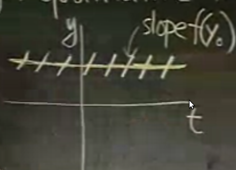

Diğer $y$ değerleriyle

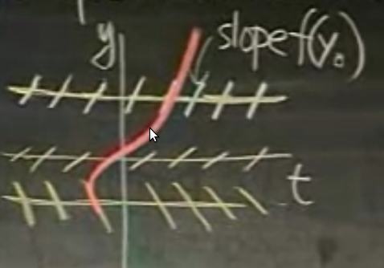

Diğer entegral eğrileri

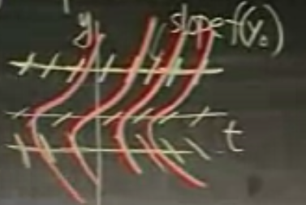

Bu formüllerde entegral eğrilerinin birisi diğerlerinin yana itilmiş haline
benzer, yani entegral eğrileri taşıma sırasında değişmez (invariant under
translation) olma özelliğe sahiptirler. Birini çizince hepsini görmüş
oluruz, diğerleri paralel şekilde hemen yandadırlar.

Bilgi nasıl elde ederiz? Kritik nokta (critical points) adlı kavramı
kullanmamız lazım.

Kritik Noktalar

Bu noktalar diferansiyelin sıfır olduğu $y_0$ noktasıdır yani $f(y_o) = 0$.

Adımlar

1) Kritik noktayı bul

2) $f(y)$'yi grafikle, nerede negatif, nerede pozitif bul. Nerede sıfır
olduğunu biliyoruz zaten, onun üstünde ve altında negative ve pozitif
olması lazım. Bu niye önemli? Çünkü formül unutmayalım ki $dy/dt =
f(y)$.  Eger $f(y) > 0$ ise o zaman $dy/dt > 0$ demektir yani $y(t)$ artacaktır.

Örnek

$y$ = bankadaki para 

$r$ = sürekli faiz oranı

$$ \frac{dy}{dt} = ry $$

Diyelim ki bankada kötü niyetli bir kişi var, paranızı zimmetine
geçiriyor. 

$w$ = zimmete geçirme oranı

O zaman

$$ \frac{dy}{dt} = ry - w$$

Formülü çözmek kolay, değişkenleri ayır, entegre et. Fakat biz çözmeden,
çözümlerin, $y(t)$'lerin, nasıl davrandığına bakalım. ODE beklediğimiz, bu
yazının konusu olan formda (otonom) çünkü sağ tarafta $t$ değişkeni
yok. Adımları takip edelim:

1) Kritik noktayı bulalım

$$ ry - w = 0 $$

$$ y = \frac{w}{r} $$

2) Grafikleyelim

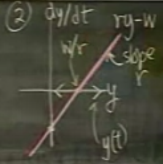

Bu grafikte bizim için tek önemli şey, nerede $ry-w$ ekseni üzerinde,
nerede onun altında olduğumuz. Çünkü o değerin üzerindeysek $f(y) > 0$, o
zaman $y$ artıyor, diğerinde $f(y) < 0$, o zaman $y$ azalıyor. Ortadaki
nokta ise $w/r$ noktası.

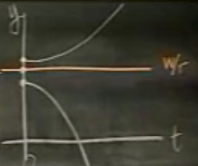

O zaman $y$ nasıl davranır? Başlangıç noktasına bağlı. Eğer başlangıç
noktası $w/r$ üzerinde ise, o zaman bir artmaya başladı mı üstel
(exponential) olarak artmaya başlar.

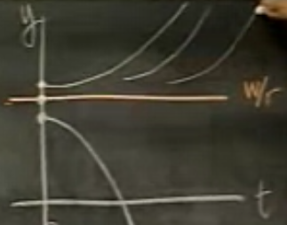

$w/r$ üzerindeki tüm başlangıç noktaları diğerlerinin tercümesi, taşınmış
hali (translations), üstte belirttiğimiz gibi. 

Lojistik Denklem

Bu denklem nüfus artışını hesaplamak için kullanılır. 

Nüfus $y(t)$.  Temel denklem

$$ \frac{dy}{dt} = ky$$

$k$ büyüme hızı

$k$ sabit ise büyümeye basit büyüme adı verilir. Lojistik büyüme biraz daha
çetrefil bir tür büyümedir. Bu model der ki sabit büyüme şekli fazla
temeldir, hiçbir canlı sınırsız bir şekilde büyüyemez, kaynaklar buna
müsaede etmez. 

Lojistik denkleme göre artma oranı (rate) da zaman göre değişir, nüfus
arttıkça oran azalır. Bu azalışı modellemek için en basit form $k = a - by$
gibi bir fonksiyondur. Önceki formülün içine koyarsak

$$ \frac{dy}{dt} = ay - by^2 $$

Bu nihai denklem Lojistik Denklemidir, ve nüfus artışı haricinde pek çok
kullanım alanı vardır. Hastalık yayılması, dedikodu (rumor) aktarımı,
büyümesi, vs. gibi.

Denklemi çözmek için değişkenler ayrılır, ayrıca kısmı kesirler (partial
fractions) adında bir teknik lazımdır. Biz çözümü yapmadan denklem hakkında
bilgi edinmeye uğraşacağız. 

Kritik noktalar: 

$$ 0 = ay - by^2 $$

$$ y(a-by) = 0$$

$$ y = 0, y=a/b $$

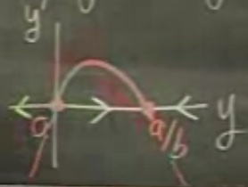

İki kritik nokta bulduk. Şimdi eksenleri $y'$ ve $y$ olan bir grafik
çizelim. Bu grafikte $y'$ nin pozitif mi negatif mi olduğuna göre $y$'nin
azalıp azalmayacağını oklar ile göstereceğiz. Parabolun altında $y'$
negatiftir, $y$ buradalarda artar (ok sağa doğru), diğer yerlerde tam
tersi. 

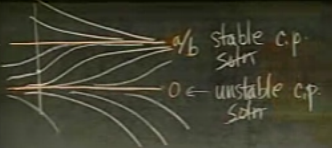

Şimdi $y$ ve $t$ grafiği çizelim. Eğer başlangıç noktası $a/b$ altındaysa
ve orada artış var ise, ayrıca entegral eğrilerinin hiçbir zaman
birbirleriyle çakışamayacağını söylemiştik, o zaman bu artış $a/b$ düz
çizgisine gelip dayanacak ama onu geçmeden ona paralel sağa doğru devam
edecektir. Her artış birbirinin sağa doğru tercümesidir, çizim bunu tam
gösteremiyor ama aşağı yukarı o temsil edilmeye uğraşıldı.

$a/b$ üzerinde benzer ama tersi bir durum, başlangıçtan $a/b$'ye azalış
oluyor. $a/b$ noktasına stabil kritik nokta (critical point, hoca
c.p. yazdı) ismi veriliyor, $0$ noktası stabil olmayan kritik nokta. Hoca
çözüm (solution) kelimesinin üzerini çizdi, ama, tabii ki bu noktaların
aynı zamanda birer çözüme de tekabül ettiğini söyledi.

Stabiliteyi anlamak için grafikte kritik noktalara bakılır, oklar eğer o
noktadan "kaçıyorsa'' o nokta stabil olmayan, o noktaya doğru
"gidiyorsa'' o nokta stabil nokta demektir.

Üçüncü bir seçenek ise şu. Eğer $y'$ ve $y$ eğrisi alttaki gibiyse ne olur?

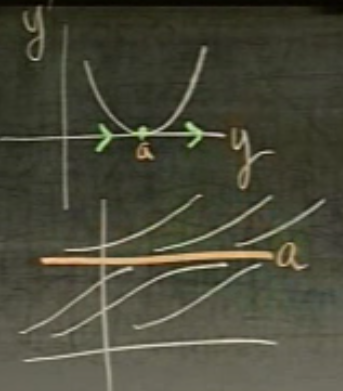

Bu durumda başlangıç $y$'sı $a$ altında ise $a$'ya doğru gidilir, üstünde
ise ondan kaçılır. Yani stabilite $a$'nin neresinde olduğunuza göre
değişir. Bu tür noktalara bu sebeple "yarı stabil (semi-stable)'' adı
veriliyor. 

Şimdi lojistik denklemin değişik bir türüne gelelim. 

Hasatla Eksiltilen Lojistik Denklemi

Mesela somon balığı yetiştirilen bir balık çiftliği düşünelim. 

Hasat $h$: sabit sayıda alınan balık

Yani nüfusa oranla değil, belli sabit sayıda somonun alınmasından
bahsediyoruz. Denklem

$$ \frac{dy}{dt} = ay - by^2 - h $$

Dikkat, $hy$ değil, sadece $h$. 

Bunu çözmek için ne yapardık? Yapılmaması gereken onu sıfıra eşitleyip
karesel denklem ile boğuşmak, koca bir formülü çözmeye uğraşmak, vs. Daha
iyisi, hemen bir grafik çizelim. 

Eğer $h=0$ ise, grafik neye benzer? $h$'yi arttırdıkça grafik nasıl değişir
(aşağı iner)? 

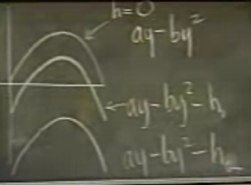

Eğer $h=0$ eğrisini yatay eksene değecek kadar, bir $h_m$ değeri kadar
aşağı indirseydik, 

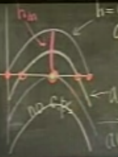

$h_m$ için $y$ ve $t$ grafiği şuna benzer. 

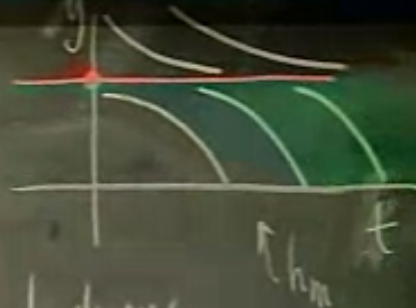

Yani kırmızı çizgi hem altında hem üstünde iniş vardır. $h_m$ noktasının
model açısından şu anlamı vardır: $h_m$ yapılabilecek en fazla hasat
oranını gösterir, o orandan fazla yapılacak hasat zamanla somonları
tüketecektir. Kırmızı çizgi üstünden başladığımız ve $h_m$ oranından fazla
(çok az fazla bile olabilir) bir oranla hasat yaptığımız takdirde, somonlar
bitmez.

