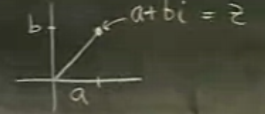
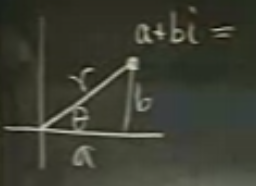
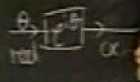
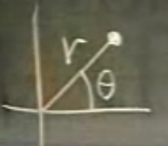
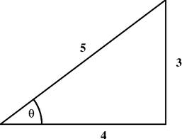
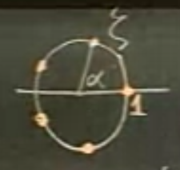
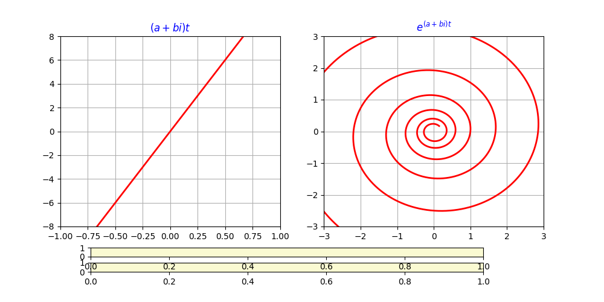

# Ders 6

Kompleks Değişkenler (Complex Variables)



Kompleks sayılar içinde $i$ değerini içeren sayılardır, bu değer
$\sqrt{-1}$'e eşittir, bu da hayali bir sayıdır. 

$z=a+bi$ sayısının kompleks eşleniği (complex conjugate) artı
işaretini eksiye çevirerek elde edilir, $\bar{z}=a-bi$. Bu iki sayının
çarpımı, $z\bar{z} = a^2+b^2$ değeridir. Bu özellik bir kompleks sayıyı
gerçek (real) sayıya çevirmek için kullanılan numaralardan biridir, ki
bölme işleminde bu numara kullanılır.

Mesela

$$ \frac{2+i}{1-3i} $$

Bu bölümü gerçekleştirmek için bölümün üstünü ve altını bölenin kompleks
eşleniği ile çarparız, böylece onu gerçek sayı haline getiririz.

$$ \frac{2+i}{1-3i} \cdot \frac{1+3i}{1+3i}$$

Not: Sağdaki çarpan faktör hem bölen hem bölünende aynı değeri taşıdığı
için aslında 1 değerine sahip, yani bu değerle çarpım yapmak aslında sol
taraftaki faktör üzerinde "büyüklük olarak'' hiçbir değişim yaratmıyor.

$$ \frac{2+i}{1-3i} \cdot \frac{1+3i}{1+3i} = \frac{-1+7i}{10}$$


$a+bi$ formunda yazarsak

$$ \frac{-1}{10} + \frac{7}{10}i $$

Bu teknik çoğunlukla lisede öğretilir. Bir diğer kavram "kutupsal form
(polar form)'' kavramıdır, bu lisede öğretilebiliyor bazen, fakat öğretilen
şey bizim ihtiyaçlarımızı açısından yeterince gelişmiş değil. 



Kutupsal form bir kompleks sayının grafiksel gösterimi ile alakalı. Eğer x
ekseni $a$ ise, y ekseni $b$ ise, o zaman bir $r$ çizgisi ve $\theta$ açısı
üzerinden kutupsal forma geçilebilir. Buradan hareketle kompleks sayı şu
şekilde de gösterilebilir. 

$$ a+bi = r\cos(\theta) + ir\sin(\theta) $$

$$ = r (\cos(\theta) + i\sin(\theta)) $$

Tarihten bir anektod: bu formu bulan Euler bu noktada "parantez içindekine
$e^{i\theta}$ diyeceğim'' der. Niye? Pek çok bulgu, diğer matematik bu yönü
gösteriyor gibiydi. Bu matematikte önemli buluşlardan biridir, ve her
açıdan görmemiz, anlamamız iyi olur. 

Bu eşitlik nasıl işliyor? Niye işliyor? Çünkü bazı önemli özelliklere sahip:

1. Üstel kanun (exponential law):

$$ a^x \cdot a^x = a^{x+y} $$

2. $e^{at}$, $dy/dt = ay$ diferansiyel denkleminin çözümüdür. Bu özgün
(unique) çözüm değildir, ama bir başlangıç şartı ekleyerek onu özgün hale
getirebiliriz, mesela $y(0)=1$ gibi.

3. $e^x$'in türevi yine kendisidir. 

Yani

$$ e^{i\theta_1} \cdot  e^{i\theta_2} = e^{i(\theta_1 + \theta_2)}$$

$$ \frac{d}{d\theta} e^{i\theta} = i e^{i\theta} $$

Şimdi bu kavramları kullanarak Euler formunu ispatlayalım. 

Diyelim ki $\sin$, $\cos$ içeren eşitliği alıp üstteki çarpımın içine
koyuyoruz.

$$ 
(\cos\theta_1 + i\sin\theta_1) \cdot (\cos\theta_1 + i\sin\theta_1) =
$$ 

$$  
\cos\theta_1\cos\theta_2 - \sin\theta_1\sin\theta_2 +
i(\sin\theta_1\cos\theta_2 + \sin\theta_2\cos\theta_1 )
$$ 

Biraz karışık gibi duruyor fakat dikkat edersek, üstteki formülün gerçek
sayı kısmı $\cos(\theta_1 + \theta_2)$'den ibaret (trigonometrik eşitliklerden biri). 
Kompleks kısmı ise $\sin(\theta_1 + \theta_2)$. O zaman elde ettiğimiz $$
\cos(\theta_1+\theta_2) + i\sin(\theta_1+\theta_2) $$ 
yani $e^{i(\theta_1+\theta_2)}$'in açılımı!

$e^{i\theta_1} \cdot e^{i\theta_2}$'den ise başladık, bir eşitliği kullanarak, basitleştirdik, 
ve üstel kanunun söylediği aynı sonuca erişmiş olduk. Demek ki $\sin$ ve $\cos$ 
içeren eşitlik doğru bir eşitlik.

Şimdi türevi kullanarak aynı şeyi ispatlamaya uğraşalım. 

$$ e^{i\theta} = \cos(\theta) + i\sin(\theta) $$

$e^{i\theta}$ nedir? Bir üstel fonksiyondur. Bu fonksiyona girdi olarak
verilen bir gerçek sayıdır, dışarı çıkan ise bir kompleks sayıdır. Girdi
$\theta$'dir, çıkan $e^{i\theta}$'dir.



$\theta$ yerine $t$ kullanarak açıklamaya devam edelim. Kompleks sonuç
üreten bir fonksiyonu "kompleks değerli bir fonksiyon'' ismi verilir. $t$
girdisi alan bir kompleks değerli fonksiyon şu genel formla temsil
edilebilir. 

$$ u(t) + iv(t) $$

$u$ yerine $\cos$, $v$ yerine $\sin$ olduğunu düşünebiliriz. Böyle bir
fonksiyonun türevini nasi alırız? Her terimin teker teker türevini
alarak. Türev işlemi olarak $D(..)$ kullanırsak,

$$ D(u+iv) = Du + iDv $$

O zaman şu türevi alalım ($\theta$ yerine $t$ kullanıyoruz) 

$$ \frac{d}{dt}e^{it} = \frac{d}{dt}(\cos(t) + i\sin(t)) $$

$$ = -\sin(t) + i\cos(t) $$

$i$'yi dışarı çekelim

$$ = i \bigg( \cos(t) + i\sin(t) \bigg) $$

Bu neye eşittir? $ie^{it}$ değerine! Türevi aldık, $\sin, \cos$ eşitliğine
atladık, ve türevi onun üzerinden hesapladık. Daha sonra
basitleştirdiğimizde sonucun $e^{it}$'in bildiğimiz direk türevine aynen
eşit olduğunu gördük! Bir ispat daha. 

Başlangıç değerlerini düşünelim: $e^{i\cdot 0}$ neye eşittir? 

Dikkat: Hemen $i \cdot 0 = 0$ ve $e$ üzeri $0$ eşittir 1 cevabını
vermeyelim. Bu doğru sonuçtur ama tamamiyle doğru bir mantık zinciri
değildir. Unutmayalım, $e^{i\theta}$'nin açılımı $\cos(\theta) +
i\sin(\theta)$, O zaman

$$ e^{i \cdot 0} = \cos(0) + i\sin(0) $$

$\sin(0) = 0$ olduğuna göre

$$ e^{i \cdot 0} = 1 + i \cdot 0 $$

$$ = 1 +  0  = 1$$

Şimdi sonuç 1 diyebiliriz.

Kutupsal forma dönersek, 

$$ e^{a+ib}  = e^a \cdot e^{ib}$$



Yani kutupsal form olarak $re^{i\theta}$. 

Bu sayının modülüsü (modulus) $r$'dir, argümanı $\theta$'dir denir. Modülüs
için $|..|$ işareti, argümanı için $arg(..)$ kullanıldığı da oluyor.

Kutupsal formun avantajı nedir? Kompleks sayıların çarpılması sırasında çok
işe yarar. Bu formda çalışıyorsak işlemler çok kolaylaşıyor ve sonuç çok
temiz bir şekilde geliyor. Mesela

$$ r_1 e^{i\theta_1} \cdot r_2 e^{i\theta_2} = r_1r_2 e^{i(\theta_1+\theta_2)}$$

Gördüğümüz gibi hemen modülusları çarpıyoruz, argümanları (açıları)
topluyoruz. Buna bakarak sonucun geometrik içeriği son derece açık. Eğer 

$$ (a+bi)(c+di) $$

işlemini yapsaydık, karmakarışık sonuçlar elde edecektik.

Bazı Ekler 

Bir kompleks sayı $a+ib$'yi aslında bir vektör gibi görmek faydalı
olabilir. Vektör dünyasında mesela $a\vec{i} + b\vec{j}$ ifadesi vardır
(dikkat bu $\vec{i}$ kompleks i değil), ve bu ifade de bir toplam olarak
gösterilir. Düşünsel bir benzerlik var, bir eksende $a$ adımı atıyoruz,
diğerinde $b$ adımı atıyoruz, ve gittiğimiz yer vektörel toplamın
gösterdiği yer.



Buradan hareketle toplam vektörün işaret ettiği noktayı açısal olarak ta
gösterebiliriz, ki kutupsal form buradan ileri geliyor. Eğer $3 + 4i$ varsa
mesela (üstteki üçgene dikkat), $r$'nin 5 olduğunu hesaplayabiliriz, ve
oradan kenarları bu tek uzunluğa referans ederek açısal olarak ta
gösterebiliriz:

$$ z = 5(\cos\theta + i \sin\theta ) $$

Şimdi diğer bir yönden, Euler Eşitliği devreye girebilir. Bu eşitlik
parantez içinin $e$'nin üstü olarak gösterilebileceğini söylemiştir!
Böylece ifade daha basitleşiyor.

$$ z = 5e^{i\theta} $$

Dikkat edilecek bir nokta daha:

Derste bir kompleks sayının *üstel olarak kullanılabileceği*
belirtildi, mesela $e^{a+ib}$ gibi, bu başka bir şey. 

Üstel Form ve Calculus

Üstel formu kullanarak Calculus'taki bazı eşitlikleri hatırlamanın,
türetmenin ne kadar kolay olduğuna bakalım şimdi. Mesela

$$ \int e^{-x}\cos(x) \mathrm{d} x $$

Bunu tabii ki parçalı entegral kullanarak çözebilirdik. Fakat parçalı
entegrali iki kere kullanmamız gerekirdi, biraz giriftli bir işlem
olurdu. Onun yerine kompleks sayıları hemen kullanalım. 

Formüle bakalım ve formüldeki $\cos(x)$'i bir kompleks sayı olan $e^{ix}$'in
$\cos(..)$ bölümü olarak görelim. O zaman $e^{-x}\cos(x)$ çarpımını
$e^{-x}Re(e^{ix}) $ olarak görebiliriz. $Re$ tabiri bir kompleks sayının
"reel bölümü'' anlamına geliyor. Hatta $e^{-x}$ zaten reel bir sayı
olduğuna göre $Re(e^{-x}e^{ix})$ sözünü de söyleyebiliriz. Entegral için
işte bu mantığı yürütüyoruz.

$$ e^{-x}e^{ix} = e^{-x + ix} = Re(e^{(-1+i)x}) $$

$$ \int e^{-x}\cos(x) \mathrm{d} x = Re (\int e^{(-1+i)x} \mathrm{d} x) $$

Bu işleme "entegrali kompleksleşirmek'' adı veriliyor, önümüzde olan
tamamen reel sayılı bir formülü çözmek yerine, onu sanki kompleks bir
sayının reel kısmıymış gibi görerek çözüyoruz. Bunu niye yapıyoruz? Çünkü
üstel (exponential) bir sayıyı entegre etmek çok kolay!

$$ \int e^{(-1+i)x} \mathrm{d} x = \frac{e^{(-1+i)x}}{-1+i}$$

Bu formülün reel kısmını istiyoruz, onu nasıl elde ederiz? İşte kompleks
sayıları bölebilme yeteneği şimdi faydalı olacak.

$$  \frac{e^{(-1+i)x}}{-1+i} = \frac{1}{-1+i} e^{-x}(\cos(x) + i\sin(x))$$

Bölenin eşleniği (conjugate) $-1-i$, onunla bölen ve bölüneni
çarpıyoruz.

$$ (-1+i)(-1-i) = 1-i^2-i+i = 1-(-1) = 1+1 = 2$$

Demek ki üstteki formül

$$ = \frac{-1-i}{2} e^{-x}(\cos(x) + i\sin(x)) $$

Bu formülün reel bölümü? $e^{-x}$ ve $1/2$ zaten reel çarpımlar olduğu için
onları kenara alalım şimdilik. Sadece şu kısmın reel bölümünü bulmalıyız.

$$ = (-1-i)(\cos(x) + i\sin(x)) $$

Çarpımı yaparken $i$ içeren terimleri atlarsak, geriye kalanlar

$$ -\cos(x) + \sin(x) $$

Kenara aldığımız reel ifadeleri geriye getirirsek, entegralin sonucu

$$ \frac{e^{-x}}{2}(-\cos(x) + \sin(x)) $$

olacaktır. 

Kompleks sistemine bu şekilde gelip gitmek ODE dünyasında önemli bir
yetenek. Mesela $e^{x}$ ve $\cos$ yanyana görünce, hocanın aklına hemen
kompleks sisteme gitmek geliyor. 

Kompleks Kökleri Bulmak

Temel problem 1'in n'inci köklerini bulmaktır, yani $\sqrt[n]{1}$. Reel
dünyada sonuç kaç tanedir? Bazen bir tane, 1'in kendisi, bazen 2 tane:
sonucun kaç tane olduğu $n$'in çift mi tek mi sayı olduğuna göre değişir.

Kompleks dünyada sonuç $n$ tanedir. Bu cevaplar nerededir? Geometrik olarak
bunu görmek kolay. Birim çemberi çizip mesela 5 parçaya bölelim:



$\alpha$ açısı nedir? Radyan olarak 

$$ \alpha = \frac{2\pi}{5} $$

Geometrik olarak bariz bir şekilde bu noktalar aradığımız 5 tane 5'inci
kök. Diyelim ki köklerden birincisi $\zeta$ noktasının 5 üstü nedir?
Modülüs yani $r$ değeri 1, çember birim çember, bu normal, $\zeta$'yi yazalım:

$$ \zeta = e^{i\frac{2\pi}{5}} $$

O zaman

$$ 
\zeta^5 = (e^{i\frac{2\pi}{5}})^5 = e^{i\frac{2\pi}{5} \cdot 5} = e^{i2\pi} =
1 
$$

Bu çember üzerinde $2\pi$ 0'a tekabül ediyor, bir tur atıp geri döndük. 

Problemler 2, 6d

Bu problemde bir kompleks üstel sayının grafiklenmesi işleniyor. Görmek
için MIT OCW ODE Mathlet sayfasından erişilebilecek "Complex Exponential''
programına gidilmesi söyleniyor. Bu program bir Applet, biz programı Python
ile tekrar kodladık. Programın alt kısmında görülen iki ayar ile değişik a
ve b değerleri denenebiliyor. Sağdaki $e^{(a+bi)t}$'nin hesaplanabilmesi
için şu açılımı kullandık:

$$ e^{(a+bi)t} = e^{at} e^{bit}$$

$$ = e^{at} (\cos(bt) + i\sin(bt) $$

$$ = e^{at}\cos(bt) + e^{at} i\sin(bt) $$

Reel kısmı (x ekseni) hesaplarken $e^{at}\cos(bt)$, hayali kısmı (y ekseni)
hesaplarken $e^{at} i\sin(bt)$ formülündeki $i$ haricinde geri kalan terimleri
hesaplıyoruz.

```python
# Create the figure and a set of subplots
fig, (ax1, ax2) = plt.subplots(1, 2, figsize=(10, 5))
plt.subplots_adjust(left=0.1, bottom=0.25)

# Left subplot: (a + bi)t
l1, = ax1.plot([], [], lw=2, color='red') # Initialize with empty lists
ax1.set_xlim([-1, 1])
ax1.set_ylim([-8, 8])
ax1.set_title('$(a + bi)t$', color='blue')
ax1.grid(True)

# Right subplot: e^(a + bi)t
l2, = ax2.plot([], [], lw=2, color='red') # Initialize with empty lists
ax2.set_xlim([-3, 3])
ax2.set_ylim([-3, 3])
ax2.set_title('$e^{(a + bi)t}$', color='blue')
ax2.grid(True)

# Define slider axes
axcolor = 'lightgoldenrodyellow'
axa = plt.axes([0.15, 0.1, 0.65, 0.03], facecolor=axcolor) # Use facecolor instead of axisbg
axb = plt.axes([0.15, 0.15, 0.65, 0.03], facecolor=axcolor) # Use facecolor instead of axisbg

a = -0.5
b = -6
t = np.arange(-1.0, 1.0, 0.001)
l1.set_xdata(t)
l1.set_ydata((b/a)*t)

t = np.arange(-3.0, 3.0, 0.001)
l2.set_xdata(np.exp(a*t)*np.cos(b*t))
l2.set_ydata(np.exp(a*t)*np.sin(b*t))

fig.canvas.draw_idle() # Use draw_idle for efficiency

plt.savefig('compexp.png')
```



Problemler 2, 7b

$\dot{z} + 3z = e^{2it}$ denkleminin $we^{2it}$ formunda çözümünü bul, ki
bu formda $w$ bir kompleks sayıdır. Genel çözüm nedir? 

Bu problem ders notlarında daha önce verilen $y' + ky = q_e(t)$ formuna
benzer. Entegre edici faktör kullanarak çözebiliriz. 

Entegre edici faktör: $e^{\int 3 \mathrm{d} t}$ = $e^{3t}$. İki tarafı da bu faktör
ile çarpalım. 

$$ \dot{z}e^{3t} + 3e^{3t}z = e^{2it}e^{3t} $$

$$ (ze^{3t})' = e^{(3+2i)t} $$

İki tarafın entegralini alırsak

$$ \int (ze^{3t})' = \int e^{(3+2i) t} $$

$$ ze^{3t} =  \frac {e^{(3+2i)t}}{(3+2i)} + c$$

Bölende olan kompleksliği yukarı çıkarmak için kompleks eşleniği ile
çarpma numarasını kullanalım. 

$$ =  \frac {e^{(3+2i)t}(3-2i)}{(3+2i)(3-2i)} + c$$

$$ =  \frac {e^{(3+2i)t}(3-2i)}{13} + c$$

$$ z =  \frac {e^{(3+2i)t}e^{3t}(3-2i)}{13} + c e^{-3t}$$

$$ z = \frac {(3-2i)}{13} e^{2it} + c e^{-3t}$$

Ekler

Euler Eşitliği

Bu yazımızda ilginç bir eşitlik olan Euler eşitliğini işleyeceğiz. Euler
eşitliği şöyledir:

$$ e^{i \theta} = \cos \theta + i\sin \theta $$

i sayısı irrasyonel bir sayıdır ve değeri -1'in kareköküdür. 

Euler eşitliği önemli bir eşitliktir. Bir yöntem, üstel (exponential)
kanununu kullanmak. Bu kanun çok basit: $e^{a}e^{b} = e^{a+ b}$. Yani bazı
aynı olan üstel sayıların çarpımında üstel bölümler toplanır. Şimdi ispatın
devamında üstel kanununu kullanmadan, çarpımı değişik bir yönden yapalım ve
toplama eşit çıkıp çıkmayacağına bakalım:

$$ e^{a}e^{b} = ( \cos(\cos(a) + \cos'(a)(x-a) + \frac{\cos''(a)}{2!}(x-a)^2 $$

$a=0$ için McLaurin serisi olur

$$ \cos(\theta) \approx \cos(0) + \sin(0)(\theta - 0) +
\frac{-\cos(a)}{2!}(\theta - 0)^2 + ... $$

$$ \cos(\theta) = \frac{0 \cdot \theta}{1!} + \frac{-1 \cdot \theta^2}{2!} +
\frac{-1 \cdot \theta^3}{3!} + ..
$$

$$ \cos(\theta) =
1-\frac{\theta^2}{2!}+\frac{\theta^4}{4!}-\frac{\theta^6}{6!} + ..$$

Sin açılımı

$$ f(x) \approx f(a) + f'(a)(x-a) + \frac{f''(a)}{2!}(x-a)^2 + ...$$

$$ \cos(0) = 1, \sin(0) = 0 $$

$$ \sin'(\theta) = \cos(\theta), \sin''(\theta) = -\sin(\theta) $$

$$ \sin'''(\theta) = -\cos(\theta), \sin'''(\theta) = \sin(\theta) $$

$$ \sin''''(\theta) = \cos(\theta) $$

$$ \sin(\theta) = \sin(a) + \sin'(a)(x-a) + \frac{\sin''(a)}{2!}(x-a)^2 $$

$a = 0$ McLaurin serisi

$$ \sin(\theta) = \sin(0) - \cos(0)(\theta-0) + \frac{-\sin(0)}{2!}(\theta-0)^2 +
\frac{-\cos(0)}{3!}(\theta-0)^3 + ...
$$

$$ = 0 + \frac{1 \cdot \theta}{1!} + \frac{0 \cdot \theta^2}{2!} + \frac{-1
\cdot \theta^3}{3!} + ...$$

$$ = 0 + \frac{\theta}{1!} - \frac{\theta^3}{3!} + \frac{\theta^5}{5!}$$

$e^{\theta}$ açılımı: 

$$ f(x) \approx f(a) + f'(a)(x-a) + \frac{f''(a)}{2!}(x-a)^2 + ...$$

$$ e^0 = 1 $$

$e^\theta$'nin her dereceden türevi yine kendisi olacaktır. O zaman

$$ e^{\theta} = e^{a} + e^{a}(x-a) + \frac{e^{a}}{2!}(x-a)^2 +
\frac{e^{a}}{3!}(x-a)^3 + ...    $$

$a = 0$ McLaurin serisi

$$ e^{\theta} = e^{0} + e^{0}(\theta-0) + \frac{e^{0}}{2!}(\theta-0)^2 +
\frac{e^{0}}{3!}(\theta-0)^3 + ... $$

$$ = 1 + \theta + \frac{\theta^2}{2!} + \frac{\theta^3}{3!} +
\frac{\theta^4}{4!} + .. $$

Sin ve cos fonksiyonlarının açılımı alt alta konulunca şöyle gözükecek...

$$ \sin(\theta) \approx 0 + \frac{\theta}{1!} - \frac{\theta^3}{3!} + \frac{\theta^5}{5!}$$

$$ \cos(\theta) \approx
1-\frac{\theta^2}{2!}+\frac{\theta^4}{4!}-\frac{\theta^6}{6!} + ..$$

Hmm... Acaba bu iki açılımı toplarsak, $e^\theta$'nın tanımına yaklaşabilir
miyiz? Deneyelim.

$$ \cos(\theta) + \sin(\theta) = 1+ \frac{\theta}{1!} + \frac{\theta}{2!} -
\frac{\theta}{3!} - \frac{\theta}{4!} + \frac{\theta}{5!} + ..$$

Olmadı. Çünkü $e^\theta$'nın açılımı yukarıda görüldüğü gibi. 

İşaretlerde uyumsuzluk var.

Bu noktada Euler'in yaptığı en büyük buluş, irrasyonel sayı olan i'yi bu
karışıma koymaktır. İşaretleri tam uymayan önceki toplamın işaretlerinin
eksi ve artı olma tekrarına bakarak, i sayısının üstlerinin yardımıyla
sonuç denklemine daha yaklaşacağını düşünmüştür. Tekrarı (pattern) görmek,
matematikçilerin ana yeteneklerinden biridir.

Devam edelim, $e^\theta$ yerine $e^{i \cdot \theta}$'yı McLaurin serisi
kullanarak açarsak, şunu elde ederiz:

$$ e^{i\theta} = 1 + i\theta + \frac{(i\theta)^2}{2!} +
\frac{(i\theta)^3}{3!} + \frac{(i\theta)^4}{4!} + \frac{(i\theta)^5}{5!}     $$

$$ e^{i\theta} = 1 + i\theta + \frac{-\theta^2}{2!} +
\frac{-i\theta^3}{3!} + \frac{\theta^4}{4!} + \frac{i\theta^5}{5!}     $$

Bu son açılımın i içeren terimleri biraraya toplar, ve i'yi bunlardan
dışarı çekersek

$$ 
e^{i\theta} = 1 + \frac{-\theta^2}{2!} + \frac{\theta^4}{4!} + ...
i (\theta - \frac{-\theta^3}{3!} +  \frac{\theta^5}{5!} + ... ) 
$$

Bu toplamın sol bölümündeki terimler $\cos$'un açılımı, öteki de (i hariç)
sin'in açılımına benzemiyor mu? Evet.

O zaman ispatı tamamlamış olduk. 
