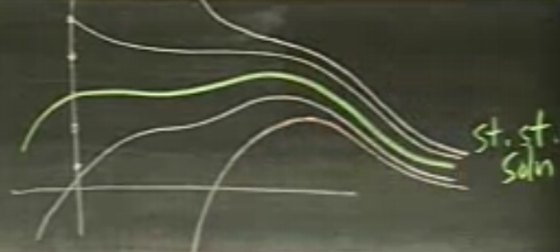
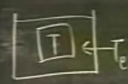
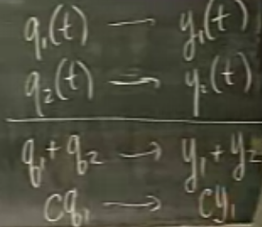
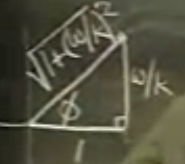

# Ders 7

Özel form

$$ y' + ky = kq_e(t) $$

Şu çözülünce

$$ y'+ky = q(t) $$

şu elde edilir

$$ y = e^{-kt} \int q(t) e^{kt} \mathrm{d} t + ce^{-kt}$$

Bu denklemdeki sağ ilk $kt$ ve soldaki $-kt$ üst değerlerinin ters işaretli
olduğunu hatırlamanın iyi bir yolu $q(t) = 1$ olunca iç ve dış $e$
değerlerinin birbirini iptal etmesi ve bu sayede sonucun sabit bir sayı
olması.

$c$'yi içeren terim artı işaretinden sonra da (üstteki gibi)
koyulabilir. Ya da onun yerine entegrale sıfır alt sınırı ve $t$ fuzuli
(dummy) değişkeni verilerek tanımsız entegral tanımlı entegral haline de
getirilebilir. 

Bu denklemde, sadece ve sadece $k>0$ olduğu zaman, $t$ sonsuzluğa giderken
$e^{-kt}$ sıfıra gider (ve $c$'nin ne olduğu farketmez), geri kalan

$$ y = e^{-kt} \int q(t) e^{kt} \mathrm{d} t  $$

denklemi ise istikrarlı konum (steady-state) çözümü olacaktır. 

Denklemdeki $c$ $y(0)$ değerini kullanır. 

Birkaç çözümü grafiklersek şöyle bir sonuç görebiliriz. Sarı renkli olan
istikrarlı olan çözümdür, diğer tüm çözümler ona yaklaşır. Peki sarı renkli
olan grafiğin özel tarafı nedir? Aslında yoktur, tüm çözümler sarıya değil,
birbirlerine yaklaşırlar. Daha detaylandırmak gerekirse, aslında bir değil,
birden fazla istikrarlı çözüm vardır. 

O zaman hangi istikrarlı çözümden bahsetmek gerekir?  $ce^{-kt}$'in sıfıra
gittiği en basit olanı tabii ki, fakat $ce^{-kt}$'dan önce gelen terim bir
şekilde $ce^{-kt}$ ile beraber daha basit bir formüle de izin verebilir. Yani,
duruma göre değişir. Genel olarak bizim en basit erişebileceğimiz istikrarlı
çözüm seçilir.

$q(t)$'yi bu problemde "girdi'' olarak niteleyeceğiz, çünkü hep daha önce
bahsettiğimiz sıcaklık problemini, ve o problemdeki $T_e$'yi düşünüyoruz,
$T_e$ havuza pompalanan bir sıcaklık girdisi. 

Sistemin "cevabı (response)'' ise diferansiyel denklemin çözümü $y(t)$. 

$q(t)$ yerine $q_e(t)$ kullanalım. 

Bu arada, bu denklemde girdilerin üst üste eklenebilmesi özelliği vardır.

$q_1+q_2$ birbirine eklenince sonuç $y_1+y_2$ olur. 

Soru: Eğer girdi trigonometrik bir fonksiyon ise ne olur? Bu en önemli
durumdur (Fourier serilerinin mevcudiyeti sebebiyle, bu konuya ileride
gireceğiz). 

$$ y' + ky = kq_e(t) $$

için girdi olarak $\cos(\omega t)$ verilmiş. $\omega$ açısal frekans olarak
modelleniyor, yani $2\pi$ içinde kaç tane tam salınımın (oscillation)
olduğu. $\cos$ eğrisini hatırlarsak, bir salınım 0 ile $2\pi$ arasındadır,
fonksiyon başladığı yere döner, salınım biter. $\omega$ ile salınım şıklığı
arttırılabilir, $\omega = 2$ ile 0 ile $2\pi$ arasında iki kere tam salınım
olur. Yani frekans kelimesi burada biraz karışıklık yaratabilir, çünkü
$2\pi$ içinde olanlara bakıyoruz, 1 birimlik zaman içinde neler olduğuna
bakmıyoruz (ki bu frekansın çoğunlukla kullanılan tanımıdır). 

Problem

$q_e = \cos \omega t$ girdisini kullanarak cevabı hesapla (yani ODE'yi
çöz). 

Çözüm için kompleks sayıları kullanacağız. ODE'yi alıp kompleks sayıları
kullanan bir hale çevireceğiz. Onu çözeceğiz, sonra elimizdeki cevapla reel
sayıların dünyasına döneceğiz. Niye bu geçiş? Çünkü üstel fonksiyonları
entegre etmek kolaydır. 

$$ e^{i\omega t} = \cos \omega t + i \sin \omega t $$

ODE'yi tekrar yazalım, girdiyi kompleks olarak yazalım

$$ y' + ky = k e^{i\omega t} $$

Fakat bunu yapınca tüm $y$'lerin kompleks hale geldiğini görmek lazım, bunu
belirgin hale getirmek için $y$ yerine $\tilde{y}$ kullanalım

$$  \tilde{y}' + k\tilde{y} = k e^{i\omega t}  $$

$\tilde{y}$ kompleks çözümdür ve $\tilde{y} = y_1 + iy_2$. O zaman her şeyi
çözüp çözümü bulup $\tilde{y}$'yi elde edersek aradığımız çözüm
$\tilde{y}$'nin reel kısmıdır. Bunun niye işlediğinin ispatı bu dokümanın
altında.

Çözelim. Entegre edici faktör $e^{kt}$. İki tarafı çarpalım

$$ (\tilde{y} e^{kt} )' = k e^{(k + i\omega)t}  $$

$$ \tilde{y}e^{kt} = \frac{k}{k+iw} e^{(k+i\omega)t}$$

$$ \tilde{y} = \frac{k}{k+iw} e^{i\omega t}$$

Bir ölçekleme yaparak bölümü $k$'ye bölelim ve sabitleri gruplayalım

$$ \tilde{y} = \frac{1}{1+i(\frac{w}{k})} e^{i\omega t}$$

Reel kısmını bulalım. Nasıl? Üstteki sonucun iki kısmı var, birinci faktör
kartezyen, ikinci kısım kutupsal. Elimizdeki seçenekler de bunlar. 

1. Kutupsal forma geç

2. Kartezyen forma geç

Biz kutupsal formu deneyelim. $\tilde{y}$'nin sadece bölenine bakalım. Oradaki
form $\cos(1) + i\sin(w/k)$'un grafiksel hali alttaki gibi

Aradaki açı $\phi$, yani $arg(1+i(w/k)) = \phi$. 

Kompleks sayılarda bir kural şöyledir, eğer kompleks sayı 1'i bölüyorsa,
açı değeri negatiflenir, ayrıca mutlak (absolute), yani $r$ değeri, $1/r$
haline gelir, o zaman

$$ \frac{1}{1+i(w/k)} = A e^{-i\phi} $$

Peki A nedir? A üstteki üçgenin hipotenüsü böleninde yer alan $1 /
\sqrt{1+(w/k)^2}$. 

$$ A e^{-i\phi} = \frac{1}{\sqrt{1+(w/k)^2}} e^{-i\phi}$$

Artık $\tilde{y}$'yi yazabiliriz. $Ae^{-i\theta}$ ve $e^{i\omega t}$'yi 
biraraya koyarsak

$$ \tilde{y} = A e^{i\omega t - i\phi} $$

$$ = \frac{1}{\sqrt{1+(w/k)^2}} e^{i(\omega t - \phi)} $$

Reel sonuç için kompleks sistemden reel'e dönüyoruz. Reel kısım kartezyen
formda $\cos$ altında olan terimdir, $\sin$ kısmını atarız, o zaman

$$ y_1 = \frac{1}{\sqrt{1+(w/k)^2}} \cos(\omega t - \phi) $$

$\phi$'nin formülü nedir? Üstteki resme göre $\phi = tan^{-1}(w/k)$.

$\cos(\omega t - \phi)$ bağlamında bakarsak $\phi$'ye faz gecikmesi de
denebilir, çünkü $\phi$ olmadan $\cos$ eğrisinin nasıl olacağını biliyoruz,
$\phi$ eklenince bu $\cos$ eğrisine bir gecikme etkisi yapacaktır.

Ekler

Teori: Alttaki denklem

$$y' + ky = kq_e(t)$$

için girdi $q_e(t)$, $\cos \omega t$ olarak veriliyor. Biz problemi
kompleksleştiriyoruz, ve $e^{i\omega t}$ ibaresinin reel tarafının
kullanıyoruz çünkü bu ibare Euler formülünün bir parçası. O zaman elimizde
şu var

$$y' + ky = k e^{i \omega t}$$

Fakat sonuç ta kompleksleşeceği için notasyonu $y$'den $\tilde{y}$'ye  değiştiriyoruz,

$$\tilde{y}' + k\tilde{y} = k e^{i \omega t}$$

kompleks çözüm $\tilde{y} = y_1 + iy_2$. İddiamız $\tilde{y}$'yi bulursak,
o zaman $y_1$ ilk, orijinal ODE'yi de çözer.

İspat

$\tilde{y} = y_1 + iy_2$ ifadesini kompleksleşmiş ODE içine koyuyoruz.

$$(y_1 + iy_2)' + k(y_1 + iy_2) = k e^{i\omega t}$$

$$y_1' + iy_2' + ky_1 + kiy_2 = ke^{i\omega t}$$

Reel ve kompleks sayıları yanyana olacak şekilde grupluyoruz

$$(y_1+ky_1) + i(y_2' + ky_2) = ke^{i\omega t}$$

Ve görüyoruz ki üstteki denklemin sol tarafı içindeki reel kısım
$(y_1+ky_1)$, orijinal ODE'nin ($y$ için $y_1$ kullanılırsa olacağı) sol
tarafı ile tıpatıp aynı, ayrıca üstteki denklemin sağ tarafının reel kısmı
$k \cos \omega t$, orijinal ODE'nin sağ tarafına eşit. Yani beklediğimiz
çözüm sol tarafta ortaya çıkınca, sağ tarafta girdi olarak verdiğimiz şeyi
aynen görüyoruz. 

