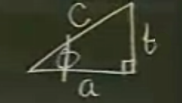
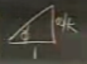
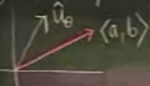
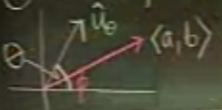
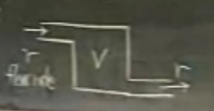
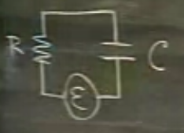

# Ders 8

Önceki dersi hatırlarsak iki tarafında da $k$ olan, girdisi $\cos \omega t$
olan bir ODE üzerinde çalıştık. 

$$ y' + ky = k \cos \omega t $$

Çözmek için problemi kompleks dünyaya getirdik

$$ \tilde{y} + k\tilde{y} = ke^{i\omega t} $$

Sağ tarafın kompleks bir sayının reel bölümü olduğunu farzettik
böylece. Bunu yaptık çünkü üstel sayıların entegralini almak kolay. Çözüm

$$
\tilde{y} = \frac{1}{1+i(w/k)} e^{i\omega t} 
\qquad (1)
$$

ölmüştü, yani çözüm şunun reel bölümü olacaktı:

$$
\frac{1}{\sqrt{1+(w/k)^2}} \cos(\omega t - \phi) 
\qquad (2)
$$

Bu metotu kutupsal metot olarak nitelemiştik. 

Kartezyen yöntemini kullansaydık (1) formülünün hem üst hem alt
tarafını kartezyene, $a+ib$ formuna çevirecektik. İlk önce altı reel yapmak
için altı ve üstü bölenin eşleniği (conjugate) ile çarpalım

$$ \frac{1-i(w/k)}{1+(w/k)^2} (\cos \omega t + i\sin \omega t)$$

Şimdi bunun reel kısmını alalım. Çarpımı yaparken bir yandan da hayali sayı
kısmı atıyoruz, iki işlemi aynı anda yapıyoruz yani

$$ \frac{1}{1+(w/k)^2} (\cos \omega t + \frac{w}{k} \sin \omega t )$$

Böylece sonuca eriştik. Şimdi sonucu kontrol edelim, hem kutupsal hem
kartezyen yönden gelince aynı sonuç erişmemiz lazım. Bu sonuç (2)
ile aynı mı?

Aynı. Kontrol etmek için bir trigonometrik eşitlik (identity) kullanacağız,
bu tür geçişleri yapabilmek dersimiz için çok önemli. Geçiş genel formuyla
şöyle:

$$ a \cos \theta + b \sin \theta = C \cos(\theta - \phi)$$

$C$ ve $\phi$ reel sayılardır. Onların hesabının bir formülü var, onu
hatırlamak yerine şu resmi hatırlamak daha kolay olacaktır

Bizim örneğimiz için

Geçişi yapalım

$$ \frac{1}{1+(w/k)^2} \sqrt{1+(w/k)^2} \cos (\omega t - \phi) $$

$$ \phi = tan^{-1}(w/k) $$

Formülün sol kısmında biraz temizleme yapmamız mümkün

$$ \frac{1}{1+(w/k)^2} \sqrt{1+(w/k)^2} $$

$$ = \frac{1}{ \sqrt{ \bigg(1+(w/k)^2} \bigg)^2} \sqrt{1+(w/k)^2} $$

Karekökler artık birleşebilir, içerideki terimler aynı olduğu için sağdaki
terim yokolur, kare yerine 1 gelir

$$ = \frac{1}{\sqrt{1+(w/k)^2}} $$

o zaman nihai formül

$$ \frac{1}{\sqrt{1+(w/k)^2}} \cos (\omega t - \phi) $$

ve bu formül (2) ile aynıdır.

Trigonometrik geçişin ispatları:

İspat 1

Vektörel olarak düşünürsek

$<a,b>$ bir vektör olarak düşünülüyor, $\hat{u}_\theta$ ise birim vektör,
içeriği $<\cos \theta, \sin \theta>$. Nasıl birim peki? Çünkü $\cos^2\theta +
\sin^2\theta = 1$ değerini verir.

Böylece $a \cos \theta + b \sin \theta$ formülünü iki vektörün nokta çarpımı
(dot product) olarak görebiliriz, yani $<a,b> \cdot <\cos \theta, \sin \theta>$. 
Bu formu yazınca noktasal çarpımların diğer tanımına zıplayabiliriz.

$$ < a,b > \cdot < \cos \theta, \sin \theta > $$

$$ = |< a,b >| \cdot 1 \cdot \cos(\theta - \phi) $$

$$ = |< a,b >| \cdot \cos(\theta - \phi) $$

Bu formül noktasal çarpımın tanımından ileri geliyor, $x \cdot y =
|x|\cdot|y| \cos \beta$, $\beta$ iki vektör arasındaki açı. $\theta - \phi$
çünkü iki vektör arasındaki açı böyle.

1 değeri ile çarpıldı, çünkü birim vektörün büyüklüğü (magnitude) 1
değerindedir. $|<a,b>| = \sqrt{a^2+b^2}$ demektir, yani resimde $C$ olarak
gösterilen şeydir. Böylece ispatı tamamlamış olduk. 

İspat 2

Bu ispat kompleks sayıları kullanacak. $a \cos \theta + b \sin \theta$
formülünü, reel kısmı eşit olacak şekilde, alttaki şekilde temsil
edeceğiz. Stratejimiz o noktadan kutupsal forma atlamak, sonra onun reel
kısmını ilk formülümüz $a \cos \theta + b \sin \theta$ ile karşılaştırmak
olacak. 

$$
(a - bi) (\cos \theta + i\sin \theta) 
\qquad (3)
$$

Soldaki eksi işaretinin sebebi bariz, çünkü sağdaki eksi ile çarpılınca
$i^2 = -1$ ile beraber artıya dönüşmesi için. Şimdi parça parça kutupsal
forma geçelim. $(a-bi)$ nasıl kutupsal forma geçer? $(a+bi)$ arasındaki açı
$\phi$ ise, $(a-bi)$ arasındaki açı $-\phi$ olur. İkinci kısım zaten
$e^{i\theta}$'dir. Hep beraber

$$ = \sqrt{a^2+b^2}e^{-i\phi} e^{i\theta}$$

$$ = \sqrt{a^2+b^2} e^{i(\theta - \phi) }  $$

Formül (3)'ün reel kısmını alırsak, $a \cos \theta + b \sin \theta$
elde ederiz. Üstteki son formülün reel kısmı nedir? 

$$ = \sqrt{a^2+b^2}e^{i(\theta - \phi)}$$

$$ = \sqrt{a^2+b^2}\cos(\theta - \phi) + i\sin(\theta - \phi) $$

Reel kısmı

$$ \sqrt{a^2+b^2}\cos(\theta - \phi)$$

Yani geçişi tekrar ispatlamış olduk. 

Hoca kompleks sayı sisteminin kullanılmasına çok vurgu yapıyor. Dersi
öğretirken bir anlamda matematik alanının yaşadıklarını tekrar yaşatıyor
öğrencilere, matematikçilerin kompleks sayı sistemine alışması için 300
küsur sene geçti, eğer öğrencileri üç hafta bu konuda harcarsa bu pek ağır
bir yük sayılmamalı.

Şimdi lineer formüllere geri döneceğiz. Daha önceki derslerde genelden
özele geçmiştik, şimdi ters yönde gidelim. 

Temel Lineer ODE

$$1. \  y' + ky = kq_e(t) $$ 

En özel formüllerden biri olan bu formül ısı / konsantrasyon ya da iletim /
difüzyon (conduction / diffusion) formülü idi.

Fakat fizik başta olmak üzere pek çok alanda $k$ sabitinin sağ tarafta
olmayabileceği durumlar da olacaktır. Bunlardan da bahsetmek gerekir.

$$ 2. \ y' + ky = q(t) $$

Nihayet en genel durumlardan birinde $k$'nin sabit olmadığı durumdur.

$$ 3. \ y' + p(t)y = q(t) $$

Bu formu tanımsız entegral kullanarak çözmeyi biliyoruz, dersin başında
bunu işlemiştik zaten.

Bu ODE'leri çözerken çok önemli bir irdeleme, karar anı $k$'nin eksi mi
artı mı olduğuna bağlıdır. Şimdiye kadar hep $k>0$ olduğunu farzettik. 

Karışım Problemi

Hacmi $V$ olan bir içine $r$ hızında sıvı gelen bir kap düşünelim. $x(t)$:
kaptaki $t$ anındaki tuz miktarı, $C_e$ gelen sıvının tuz konsantrasyonu. 

$$ \frac{dx}{dt} = \textrm{ gelen tuz hızı - giden tuz hızı } $$

Hız niye böyle temsil edildi? Hızı ölçmek için iki zaman aralığında yapılan
ölçümlerin farkını zaman aralığına böleriz. Üstteki formülde, sol tarafta
bu zaman aralığı en küçük (infinitesimal) kesit olacak şekilde
hesaplanıyor, bu yüzden sol tarafta diferansiyel form var. 

$$ = r C_e - r \frac{x}{V} $$

Sivinin geliş hızı $r$'nin hem gidiş hem geliş için kullanıldığına dikkat
edelim, kap tamamen dolu, o yüzden gelen sıvı oranında sıvı mutlaka dışarı
çıkmalı. 

Standart lineer form

$$ \frac{dx}{dt} + \frac{rx}{V} = rC_e(t) $$

$$ C(t) = \frac{x}{V} $$

İki tarafın diferansiyelini alırsak

$$ \frac{dC}{dt} = \frac{1}{V}\frac{dx}{dt}$$

$$ V\frac{dC}{dt} = \frac{dx}{dt}$$

Buna göre ana diferansiyel denklemdeki formül şöyle değişir

$$ V \frac{dC}{dt} + rC = rC_e$$

Standart forma koyalım. Bunu yaparken $r$'nin değil, $r/V$'nin kritik öğe
olduğunu görüyoruz.

$$ \frac{dC}{dt} + \frac{r}{V} = \frac{r}{V} C_e $$

Bu formülde tuz miktarı yerine konsantrasyon bağımlı değişkendir, ve
formülün bu halinin üstteki listede 1. form kategorisine girdiğini
görüyoruz. Tabii konsantrasyon derken (biraz kelimeler karışmış olabilir),
iletim / difüzyon modelinden bahsediyoruz aslında. 

Ve iletim problemindeki akışkanlık sabiti $r/V$, sadece $r$ değil. $r$
hacim / dakika, $V$ hacim, o zaman $r/V$ 1/dakika, yani
$\textrm{dakika}^{-1}$ olur.

Örnek

Diyelim ki $C_e$ sinüssel, $\cos \omega t$. Eğer $k$ çok büyük ise, $C(t)$,
$C_e(t)$'yi ne kadar yakında takip eder? İletim probleminden biliyoruz ki
eğer akışkanlık sabiti büyükse iç ısı dış ısıyı yakından takip
eder. Difüzyonda aynı durum.

Bizim problemimize bu nasıl tercüme edilir? Eğer $r$ çok büyükse (hızlı
akış) o zaman içerideki konsantrasyon dışa oldukça yakın olur. Ya da $V$
çok küçüktür, o zaman da kap hızla boşalacaktır, yine aynı durum
olur. Sezgizel olarak anlamlı bir şey yani.

Bu demektir ki gecikme (lag) $\phi$ küçüktür, büyüklük (amplitude) ise 1'e
yakındır. 

Bu dersin geri kalanında 1. formülün, hatta bazen 2. formülün nerede ise
yaramadığına bakalım. 

2'nin işlediği durumlar:

$q$ kapasitorün üzerindeki yük (charge). 

$$ \frac{dq}{dt} = i $$

Dikkat, "i'' burada kompleks sayı değil, akım. 

Kırchoff Kanununa göre

$$ R\frac{dq}{dt} + \frac{q}{C} = \varepsilon(t) $$

Standart forma koyarsak

$$ q' + \frac{q}{RC} = \frac{\varepsilon}{R} $$

Bu formülü 1. forma yaklaştırmak için $k=RC$ diye kabul edip, sonra sağ
tarafı $k$'leştirmek için $\varepsilon \cdot C$ almaya uğraşmak gibi
numaralar yapılabilir, fakat bu oldukça doğal olmayan bir yaklaşımdır, yani
bu formül 1'de ziyade 2. form ile çözülür. 

Diğer bir örnek, zincirleme radyoaktif çürümesi (radioactive chain decay). 

A ve B adında iki element var (bunlar periyodik tablodaki elementlerden),
ve A çürüyor, B oluyor, sonra B çürümeye devam ediyor. Basitlik için tek A
atomu tek B atomuna dönüşüyor diyelim. Çürüme nedir? Atomun parçalarını
kaybetmektir, bu sebeple element değişimi olur. Elimdeki ne kadar B
olduğunu merak ediyorum mesela, şöyle modelleyebilirim 

$$ \frac{dB}{dt} = k_1 A - k_2 B$$

$$ = k_1A_0 e^{-k_1t} - k_2B $$

Ufak bir yer değişiminden sonra diferansiyel denklem 

$$ B' + k_2 B = k_1A_0 e^{-k_1t}$$

Fakat buna bakınca anlıyoruz ki $A_0$ sabitinin $k$ sabitinin hiçbir
alakası yok. Bu sebeple üstteki denklem 1. forma uygun değil, doğal
durmuyor. Bu örnekte de 2. form doğru olandır. 

Şimdi ufak bir kötü haber: Eğer $k < 0$ ise, şimdiye kadar gördüğümüz
terminolojideki geçici (transient), istikrarlı konum (steady-state), girdi
(input), cevap (response) sözlerinin hiçbiri geçerli olmaz. Denklemi
"çözme'' yöntemi aynıdır, mesela

$$ \frac{dy}{dt} - ay = q(t)$$

yani $a > 0$ ve $k < -a$

O zaman çözüm olan şu formül

$$ e^{-kt} \int q(t) e^{kt} \mathrm{d} t + ce^k$$

şu hale gelecektir

$$ e^{at} \int q(t) e^{-at} \mathrm{d} t + ce^{at}$$

Ne oldu? $a>0$ olduğu için $ce^{at}$ sonsuzluğa gider, bilahere tüm çözüm
sonsuzluğa gider, $c < 0$ ise eksi sonsuzluğa gider. O zaman bu kısım
geçici değil, çünkü sıfıra gitmiyor, ve ne olacağı başlangıç şartlarına çok
bağlı. Kıyasla $k>0$ olduğu diğer durumda görmüştük ki başlangıç
şartlarının ne olduğu hiç farketmiyordu.

Hangi bilim dallarında $k > 0$ ya da $k < 0$. 

Biyolojide, ekonomide çoğunlukla $k < 0$. 

Fizikte çoğunlukla $k > 0$ [Hocanın esprisi yaşamayan şeyler varsa $k > 0$,
yaşayan şeyler varsa $k < 0$]. 

