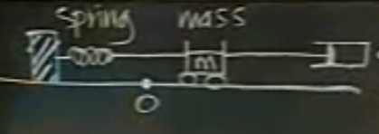
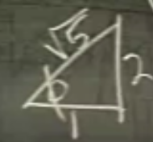
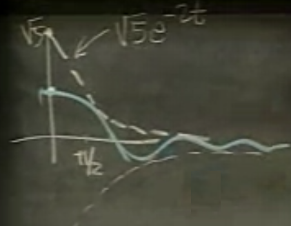

# Ders 9

Sabit Katsayılı (Coefficients) Lineer 2. Seviye ODE'ler 

Standart formu şu şekildedir

$$ y'' + Ay' + By = 0 $$

Sıfıra eşit olması denklemin homojen olduğu anlamına gelir. $A$ ve $B$
sabittir. Bu denklemin en genel hali değildir, mesela $A$ ya da $B$ bağımsız
değişkenin ($x$, $t$, vs) bir fonksiyonu ise daha genel olabilir. Sağ kısım 0
yerine bir fonksiyon ise o zaman denklem homojen olmayan (inhomogeneous)
demektir. O tür denklemlerin fiziksel bağlamda ayrı bir anlamı var tabii, o
yüzden önce homojen denklemler incelenmeye başlanır, sonra homojenliğe olmayan
duruma geçilir.

Genel çözümün şöyle olduğunu farz edelim

$$ y = c_1 y_1 + c_2 y_2 $$

Çözümde iki tane rasgele (arbitrary) sabit olmasının sezgisel bir tarifi
şudur: Denklem 2. derece, ve $y''$'den $y$'yi elde etmek için iki kere
entegre etmek gereklidir, ve o sırada entegrasyon sonucu sonuca ardı ardına
iki tane rasgele sabit ekler, kabaca bir tarif böyledir. Niye ayrı $y_1$ ve
$y_2$?  Mesela $c_1 = 0, c_2 = 1$ diyelim, o zaman $y_2$ bir çözüm
olmalıdır, tersinden düşünürsek $y_1$ aynı şekilde [bu konu hakkındaki ek
bir ispat bu ders notlarının altındaki ekler kısmında, ayrıca iki çözümün
altta işlenecek karakteristik denklem ile alakası var, oradan iki kök
geliyor].

Bunu söylemekle problemin nihai çözümünü bulmayı (bir şekilde) iki tane çözüm
bulmaya indirgemiş oluyoruz aslında. Çünkü iki çözüm bulunca genel çözüm $y$, o
iki çözümün rasgele sabitlerle çarpılıp toplanmasından müteşekkil
oluyor. Başlangıç değerleri ise $c_1$ ve $c_2$ değerleri üzerinden
karşılanabilir, bu sabitler teoride rasgele olduklarına göre onları uygun
şekilde seçerek başlangıç şartlarını da tatmin edebiliriz.

Örnek

İkinci derece ODE için klasik örnek bir yay (spring), kütle (mass) ve
engelleyici (dashpot) sistemidir. Engelleyici denen bazı kapıların üst,
arka kısmında olan kapı sert kapanmasın diye onu yavaşlatan mekanizmadır.

Eksen yatay olduğu için ona $x$ değişkenini atayalım, tabii bu yüzden ODE'deki
bağımlı değişken o olacak, yani üstteki $y$ yerine $x$ kullanıyoruz. Kafa
karıştırmasın diye vurguladık, çünkü çoğunlukla $x$ bağımsız değişken olarak
kullanılır.

Devam edelim. Diyelim ki 0 ile işaretlenen yer bir denge noktası. Yani bu
noktada hem yayın, hem de engelleyicinin itme / çekme noktası tatmin ediliyor
durumda. Eğer o noktadan daha sola gidersek, yay itmeye uğraşacak, sağa gidersek
çekmeye uğraşacak, tabii engelleyici de birşeyler yapacak.

Denklem şöyle: 

$$
\underbrace{mx''}_{Kuvvet} =
- \underbrace{kx}_{Yay} 
- \underbrace{cx'}_{Engelleyici}
$$

$mx''$ sistemde ortadaki kütlenin uyguladığı kuvvettir, artı, eksi olması
kuvvetin sağ ya da sol yönünde olduğunu gösterir. Bu kuvvet Newton Kanunu'na
göre ivme (ikinci türev, $x''$) ve kütlenin çarpımıdır. Unutmayalım, bağımsız
değişken $t$, o zaman $x'$ hız, $x''$ ivme.

Sistemdeki yay sadece kütleye "tepki'' verir, kütle ne yapıyorsa tersini
yapar. Eğer kütle sola gelirse sağa, sağa gelirse sola doğru karşı kuvvet
uygular, o yüzden ve eşitliğin sağında olduğu için sistemde $-kx$ (ters işaret)
ile belirtildi (eksiyi tekrar artıya çevirmek için). Bu tepkinin alınan mesafe
$x$ ile orantılı (bir sabitle çarpılarak) olması Hooke Kanunu'ndan ileri
geliyor.

Engelleyici ise yaya benziyor ama onun tepkisi hız ile orantılı, mesafe ile
değil. Bu mekanizmaya sahip olan kapıları hatırlayın, çok hızlı kapatmaya
uğraşınca çok daha sert engelleme yaparlar. Bu tepki, yine ters işaretle $-cx'$
ama birinci türeve (hız) içerecek şekilde temsil edilir.

Nihai denklem ise şöyle

$$ mx'' + cx' + kx = 0 $$

$$ x'' + \frac{c}{m}x' + \frac{k}{m}x = 0 $$

ODE'yi çözmek için 2 çözüm bulmak gerekir. 

2 çözümün birbirinden bağımsız olması lazımdır, yani mesela $y_1$ bulunmuşsa,
$y_2$ onun bir sabitle çarpılmış hali olamaz. Çünkü sabitlerle çarpma işi
denklemde zaten rasgele sabitlerin işi, iki çözüm birbirinin kati ise o zaman
genel çözümü yaratamayız, çünkü rasgele sabitlerin işi zaten yapılmış olur.

Çözüm için en basit, temel yöntem tahmin etmektir. $y = e^{rt}$ çözümünü
deneyelim deriz. Niye $e^{rt}$? Türevini, entegralini almak kolay. Yerine
koyalım.

$$ r^2e^{rt} + Are^{rt} + Be^{rt} = 0 $$

Öyle bir $r$ bulalım ki denklemin sol tarafı sıfır olsun. $e^{rt}$ hiçbir zaman
sıfır olamayacağına göre sıfırlık denklemin "geri kalanında'' demektir,
$e^{rt}$'yi iptal edelim.

$$ r^2 + Ar + B = 0 $$

Bu bir karesel denklemdir! Çözümü lisede öğretilir. Bu denkleme ODE'nin (ya da
yay / kütle sisteminin) karakteristik denklemi ismi de verilir.

1'inci Durum: kökler reel ve $r_1 \ne r_2$

Bu en basit, direk sonuç. O zaman nihai çözüm

$$ y = c_1 e^{r_1t} + c_2  e^{r_2t}$$

Örnek

$$ y'' + 4y' + 3y = 0 $$

Karakteristik denklem

$$ r^2 + 4r + 3 = 0 $$

$$ (r+3)(r+1) = 0 $$

Genel çözüm

$$ y = c_1e^{-3t} + c_2e^{-t} $$

Başlangıç şartları 

$$ y(0) = 1 $$

$$ y'(0) = 0 $$

Şartlar ne anlama geliyor? $t=0$'da, başlangıçta, kütle $x=1$ noktasında. Yani
yay sağa doğru gerilmiş olacak. İkinci şart sisteme başlangıçta dışarıdan ek bir
güç vermiyoruz demek, $x=1$ noktasına getiriyoruz, ve bırakıyoruz. Bırakınca
kütlenin sola, sonra sağa, vs. gidip geleceğini tahmin edebiliriz.

İki koşul var, çünkü bulmamız gereken iki sabit var. 

Koşulların ikincisi için türeve ihtiyaç var, türevi hesaplayalım

$$ y' = -3c_1e^{-3t} + - c_2 e^{-t} $$

$t = 0$ ise, $y$ formülü (ilk koşul) $1 = c_1 + c_2$ olur. İkinci koşul
$0 = -3c_1 - c_2$. 

Şimdi elimizde beraber çözülecek (simultaneous) iki tane lineer denklem
var. Bunları çözmeyi de lisede öğrenmiştik. Bu arada karesel denklemler, ve
üstteki tür lineer denklemlerin çözümünün en önemli uygulama alanı işlediğimiz
türden fiziksel problemler içindir. Lise çağı bizi bunlar için hazırlıyormuş
demek ki.

$$ c_1 = -1/2 $$

$$ c_2 = 3/2 $$

Çözüm: 

$$ y = -\frac{1}{2}e^{-3t} + \frac{3}{2}e^{-t} $$

Peki bu çözüm grafiksel olarak neye benzer? İki üstel fonksiyonun kombinasyonunu
elle çizmek pek kolay değildir, onun için bilgisayarı kullanmak daha iyi.

İkinci Durum: kökler kompleks

$r = a \pm bi$

Bu şekilde bir $r$ çözüme nasıl etki eder? Çözüm

$$ y = e^{(a+bi)t} $$ 

şeklinde olacaktır, fakat bu çözümün bizim için hiçbir anlamı yok. Biz $y$'nin,
$x$'in nasıl davrandığını görmek istiyoruz. Şu teori yardımımıza yetişiyor:

Teori: Eğer $u + iv$ kompleks sayısı, $y'' + Ay' + By = 0$ reel ODE denkleminin
kompleks çözümü ise o zaman $u$ ve $v$ reel çözüm için kullanılabilirler.

İspat: Çözüm olmak ne demek? Su denklemin doğru olması demek: 

$$ (u+iv)'' + A(u+iv)' + B(u+iv) = 0$$

Reel ve hayali kısımlarına ayıralım

$$ 
\underbrace{u'' + Au' + Bu}_{reel} + 
i\underbrace{(v'' + Av' + Bv)}_{hayali} = 0
$$

Üstteki denklemin sol tarafının sıfıra eşit olmasının tek yolu, hem reel, hem
hayali bölümün sıfıra eşit olmasıdır. Onların sıfıra eşit olması demek her iki
denklemin de ana denklem olan $y'' + Ay' + By = 0$'a tıpatıp benzemeleri
demektir. O zaman hem $u$, hem $v$ ana ODE için bir çözümdür.

Bu arada ispatta $A$ ve $B$'nin reel olması zorunluluğunu dolaylı olarak
kullandık, çünkü eğer $A$ ve $B$ hayali olabilseydi, üstteki denklemdeki reel
bölüme reel diyemezdik, denklemin tamamını üstteki şekilde gruplayamazdık, ve
hayali bir sayının sıfıra eşitlenebilmesi için yürüttüğümüz mantığı
yürütemezdik. O zaman neresi reel neresi hayali olacaktı?

Çözüme dönelim. 

$$ y = e^{(a+bi)t} $$ 

Üstel kompleks değerler ve $\cos, \sin$ formuna geçişi hatırlayalım

$$ e^{i\theta} = \cos \theta + i\sin \theta $$

O zaman iki üsttekini genişleterek devam edelim

$$ y = e^{at} e^{ibt} $$

Sadece ikinci kısım $\cos, \sin$ formuna çevirilebilir

$$ e^{ibt} = \cos(bt) + i\sin(bt) $$

Biraraya koyarsak

$$ y = e^{at} (\cos(bt) + i\sin(bt)) $$

Reel bölüm

$$ y = e^{at}\cos(bt) $$ 

Hayali bölüm

$$ y = e^{at}\sin(bt) $$ 

O zaman çözüm

$$ y = e^{at} \bigg( c_1 \cos(bt) + c_2 \sin(bt) \bigg) $$

Bu fonksiyon neye benzer? Dikkat edelim, $e^{at}$ yüksekliği (amplitude)
kontrol ediyor, geri kalanı iki sinüsoidal salınımın kombinasyonu, farklı
yükseliği ama aynı frekansı olan iki salınım. Bu yüzden onların toplamı da
bir sinüsoidal salınım. Bu fonksiyon aslında daha önceki bir derste
bahsedilen bir trigonometrik eşitliği kullanmak için de uygun [hoca
herhalde 8. dersteki eşitlikten bahsediyor].

Şimdi engelleyici / sönüm (damping) faktörünü değiştirelim. Önceki örnekte sönüm
zayıftı, yayın etkisi daha fazlaydı, zaten o sebeple bir salınım görmüştük, bu
kütleyi bırakınca bir süre sağa, sola sallanması demekti. Yeni denklem:

$$ y'' + 4y' + 5 $$

Karakteristik denklem

$$ r^2 + 4r + 5 = 0 $$

$$ r = -4 \pm \frac{\sqrt{-4}}{2} = -2 \pm i$$

Çözüm

$$ e^{(-2+i)t} $$

Reel çözüm

$$ e^{-2t}\cos t \ , \ e^{-2t}\sin t$$

$$ y = e^{-2t} (c_1 \cos t + c_2 \sin t) $$

Başlangıç şartları yine aynı olsun

$$ y(0) = 1 $$

$$ y'(0) = 0 $$

Hesabı yaptıktan sonra sonuç

$$ y = e^{-2t} (\cos t + 2 \sin t) $$

Trigonometrik eşitliği kullanalım

$$ = \sqrt{5}e^{-2t} \cos (t - \phi) $$

$\sqrt{5}$ nasıl bulundu? Önceki dersten şu üçgeni hatırlayalım

O zaman $\phi \approx 70^{o} \pm 5$

Çözümün grafiğini çizersek

Bu yetersiz sönüm (underdamped) durumudur. 

Şimdi sönümün ne az, ne de fazla olduğu duruma bakalım. Burada sönüm "tam
yerinde'', bu koşula kritik sönümlü (critically damped) şartı
deniyor. Karakteristik denklemdeki kökler ayrı ve reel değil, kompleks
değil. Reel ama birbirine eşit, diyelim ki $r = -a$.

$$ (r+a)^2 = 0 $$

$$ r^2 + 2ar + a^2 = 0 $$

ODE

$$ y'' + 2ay' + a^2y = 0 $$

Yani yay sabiti ve sönüm sabiti arasında bir ilişki var. 

Fakat burada bir problem var. Çözümlerden biri $e^{-at}$ evet, ama bu
elimdeki tek çözüm. 2. derece ODE için iki çözüm lazım. 

Gerekli ikinci çözümü elde etmenin değişik yolları var. Bir tanesi şöyle:

Eğer $y'' + py' + qy = 0$ için bir $y_1$ çözümü biliyorsak, $y = y_1 u$ şeklinde
ikinci bir çözüm de muhakkak vardır. $u$'yu nasıl hesaplayabileceğimizi görelim.

Elimizde $y = e^{-at}$ var. $y'' + 2ay' + a^2y = 0$ için bir $u$ bulacağız,
yani şu formda bir çözüm arayacağız

$$ y = e^{-at} u $$

Birinci türev

$$ y' = -a e^{-at}u + e^{-at} u' $$

Bunun bir kere daha türevini alalım

$$ a^2e^{-at}u - 2ae^{-at}u' + e^{-at}u'' $$

Üstteki üç denklemden en alttakini 1 ile çarparız (yani değişmez), ortadakini
$2a$ ile çaprarız, baştakini $a^2$ ile çarparız. Bu çarpımları toplarız,
eşitliğin sol tarafında 0 elde ederiz. Eşitliğin sağ tarafındaki neredeyse her
terim toplanarak sıfır hale gelir, sadece $e^{-at}u''$ geriye kalır. O zaman
şunu söyleyebiliriz:

$$ e^{-at} = 0 $$

Demek ki 

$$ u'' = 0 $$

Bu ne demektir?

$$ u = c_1t + c_2 $$

Öyle değil mi? İkinci türevi sıfır olan şey nedir? Üstteki form'daki bir
formüldür, $c_1$ ve $c_2$ rasgele iki sabittir. Birinci türevi alırken $c_2$
yokolacaktı $c_1$ kalacaktı, ikinciyi alırken $c_1$ yokolacaktı.

Bu sonuç bana bir sürü çözüm bulma imkanı sağlar, ama sadece tek başına $t$'yi
bile kullansam olur, çünkü bana $e^{-at}$'den farklı sadece bir tane daha çözüm
lazım. O zaman ikinci çözüm şu olabilir:

$$ y_2 = e^{-at} \cdot t $$

Kritik sönüm durumunun çözümü de budur. 

Ekler

Teori

Eğer $y=f_1(x)$ ve $y=f_2(x)$ şu diferansiyel denklemin çözümü ise

$$ \frac{d^ny}{dx^n} + a_1 \frac{d^{n-1}y}{dx^{n-1}} + .. + a_n y = 0$$

O zaman $y=c_1f_1(x) + c_2f_2(x)$ te aynı diferansiyel denklemin bir çözümüdür,
ki $c_1$ ve $c_2$ herhangi bir (arbitrary) sabit değerler olabilirler.

İspat

Eğer $f_1$ bir çözüm ise [sf. 118], diferansiyel denklemde $y$ yerine
koyabilmemiz gerekir, $f_2$ ve $c_1f_1 + c_2f_2$, aynı şekilde. Hepsine bakalım.

$$ \frac{d^nf_1}{dx^n} + a_1 \frac{d^{n-1}f_1}{dx^{n-1}} + .. + a_n f_1 = 0$$

$$ \frac{d^nf_2}{dx^n} + a_1 \frac{d^{n-1}f_2}{dx^{n-1}} + .. + a_n f_2 = 0$$

$$ \frac{d^n(c_1f_1 + c_2f_2)}{dx^n} + 
a_1 \frac{d^{n-1}(c_1f_1 + c_2f_2)}{dx^{n-1}} + .. + 
a_n (c_1f_1 + c_2f_2) = 0
$$

Sonuncu formül için $c_1$ ve $c_2$'leri dışarı çekip gruplamayı onlara göre
yaparsak

$$ 
c_1 \bigg[
\frac{d^nf_1}{dx^n} + a_1 \frac{d^{n-1}f_1}{dx^{n-1}} + .. + a_n f_1
\bigg] +
c_2 \bigg[
\frac{d^nf_2}{dx^n} + a_1 \frac{d^{n-1}f_2}{dx^{n-1}} + .. + a_n f_2
\bigg]
$$

Büyük parantezler içindeki değerler diferansiyel denklemin $f_1$ ve $f_2$
kullanılarak açılmış hali değil mi? O zaman o değerler sıfır. Yani

$$ c_1 \cdot 0 + c_2 \cdot 0 $$

Bu değer de tabii ki sıfıra eşit. 

$$ c_1 \cdot 0 + c_2 \cdot 0 = 0$$

ve bu sıfır sonucu, ana diferansiyel denklemin sonucuyla aynı. O zaman ispat
tamamlanmış demektir.

Kaynaklar 

[1] Kishan, *Differential Equations*

