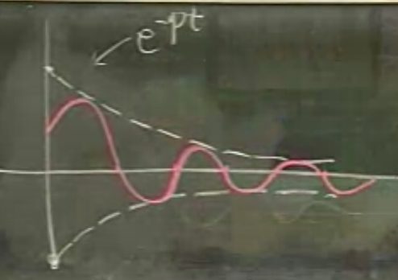
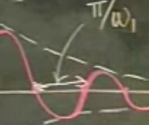
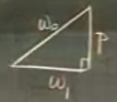

# Ders 10

Bu dersin konusu salınımlar (oscillations), ki bu kavram günlük hayatta
sürekli karşılaşılan ve önemli bir kavramdır. Bizim önceden gördüğümüz
salınımlar karakteristik denklem $r^2 + br + k = 0$'in kompleks kökleri ile
alakalıydı. Kompleks kökler 

$$ r = a \pm bi $$

formundadırlar. 

[önceki derste $a$ ve $b$ reel kısımları kullanmak yerine niye $a$ ve $-b$
kullanmanın gereksiz olduğu hakkındaki bölüm atlandı].

Şu resme dönelim. 

Formüller

$$ mx'' + cx' + kx = 0 $$

$$ x'' + \frac{c}{m}x' + \frac{k}{m}x = 0 $$

En alttaki standart form. Bu formülü değişik bir şekilde yazalım - hem
eklektik [farklı şeylerin birleşimi], hem değişiklik olsun diye, böylece
$x$ bazlı kullanıma fazla bağlı olmayız, her türlü kullanımla iş
yapabiliriz. Şöyle bir form kullanalım:

$$ y'' + 2p y' + \omega_0^2y = 0 $$

Niye 2 ve niye $\omega_0$'in karesini kullandığımızı ileride anlayacağız
(bu şekilde kullanım bazı ilgili formüllerin daha temiz olmasını sağlıyor).

Biz bu derste salınımlarla ilgilendiğimiz için üstteki formülün kompleks
kökleri olduğu koşullarla ilgileniyoruz, eğer kökler reel olsaydı o zaman
sistem aşırı sönümlü (overdamped) olurdu, bu durumla ilgilenmiyoruz. Genel
olarak ta sönümsüz durum daha çok ilgi çeken bir durumdur.

Karakteristik denklem nedir?

$$ r^2 + 2pr + \omega_0^2 $$

$p$ bir sabit, çoğunlukla denklemde o pozisyondaki bir $p$ değişkenini
$p(t)$ şeklinde kullanıyordum, ama burada $p$ sabit. 

Denklemin kökleri nedir? Şimdi $p$'nin önüne bir 2 koymanın faydalarını
görüyoruz herhalde, karesel çözüm denklemi:

$$ \frac{-b \pm \sqrt{b^2-4ac}}{2a} $$

Birinci kısım, $a=1$ olduğuna göre $-b / 2$, o zaman $-2p / 2 = -p$. 2 
sayesinde temiz bir sonuç oldu. $\sqrt{b^2-4ac} / 2$ için bölümün üstü 
$\sqrt{4p^2 - 4\omega_0^2}$, karekök içindeki 4'ler dışarı 2 olarak 
çıkabilirler, çıkınca da bölen 2 ile iptal olabilirler. Geriye $\sqrt{p^2 -
  \omega_0^2}$ kalır. Sonucun 
tamamı

$$ -p \pm \sqrt{p^2 - \omega_0^2} $$

Yani bir karesel denklemde matematikçiler ikinci terime ne zaman bir 2
yerleştirirlerse, bunu yapmalarının sebebi karesel çözüm formülünü
kullanmak istemeleri ve ekstra 2 sayılarının formülü karıştırmasını
engellemek istemeleridir.  

Eğer $p=0$, yani $c/m = 0$, yani ortada engelleyici yok. Bu sönümsüz
(undamped) durum. O zaman o terim yokolunca geri kalan denklem

$$ y'' + \omega_0^2y = 0 $$

Bu basit harmonik hareket (simple harmonic motion) denklemidir, ki
öğrenciler bu denklemi zaten üstteki gibi görmeye alışıktır. Niye? Çünkü o
zaman $\omega_0$ terimi salınımın dairesel frekansını temsil eden
terimdir. O formdaki bir denkleme bakarak anında frekansın ne olduğunu
çıkartabilmiş oluruz. 

Genel çözümler o zaman $r=\pm i \omega_0$ şeklinde olurlar, kompleks
açılımı kullanırsak 

$$ y = c_1 \cos(\omega_0 t) + c_2 i\sin (\omega_0 t) $$

ya da

$$ y = A \cos(\omega_0 t - \phi) $$

Tüm bunlar $k/n$ yerine niye $\omega_0$'in karesini kullandığımızı
ispatlamıştır herhalde. Şimdi sorumuz sönümlü koşulun neye benzeyeceği. Bu
durum probleme biraz daha yakından bakmayı ve daha fazla düşünmeyi
gerektiriyor.

Sönümlü koşulu düşünelim. Bu sistemde ne zaman salınım elde ederim?
$\sqrt{p^2 - \omega_0^2}$'in içi negatif olduğu zaman, yani $p^2 -
\omega_0^2 < 0$. Ayrica $p$ ve $\omega_0$'in pozitif olması mecbur olduğuna
göre (çünkü öyle tanımladık) $p < \omega_0$ olmalıdır.

Bu koşulu konuşma ile belirtmek gerekirse, "sönüm terimi dairesel
frekanstan küçük olduğu zaman''. Tabii sönümün yarısı demek istiyoruz
aslında çünkü $p$'yi 2 ile çarptık, bir de orijinal formülde $m$ ile bölüm
var, bunu da hesaba katmalı. Yani, belki sönüm yerine $p$ demek daha
doğru olur.

Önceki dersten hatırlarsak, çözümün grafiği üsttekine benzer. Özel
(particular) çözüm kırmızı çizgidir, y eksenini kestiği nokta başlangıç
şartı tarafından tanımlanır, altında kaldığı $e^{-pt}$ eğrisi onun bir nevi
yüksekliğidir (amplitude). 

Bu noktada sorulabilecek ilk ilginç sorulardan biri, çözümün t eksenini
kestiği her noktanın arasındaki boşluk nedir? 

Bu mesafe, yani periyotun büyüklüğünü $\pi / \omega_1$ olarak belirtelim,
$\pi$ çünkü hemen yanındaki parçayı da dahil etseydik o nokta bir salınımın
tamamlandığı noktadır, orada $2\pi$ kullanılacaktı. Genel bağlamda bu
fonksiyon aslında yarı-periyodik diye nitelenen fonksiyonlardan, tam
periyodik değil çünkü fonksiyonun yüksekliği sürekli azalıyor ama periyodik
"olmaya uğraşıyor'', en azından bir şeyi periyodik olarak yapıyor, t
eksenini periyodik olarak kesiyor. $\omega_1$ frekans, ama ona aslında
"yarı (pseudo) frekans'' demek lazım, aynen fonksiyonun "yarı-periyodik''
olması gibi.

Sezgisel olarak düşünelim: Eğer sönüm $c$ artarsa, yarı-frekans
$\omega_1$'e ne olur? Düşer. Şimdi formülsel olarak düşünelim. $\omega_1$
nedir? Ana denklemin çözümüne bakalım

$$ r = -p \pm \sqrt{-(\omega_0^2 - p^2)} = -p \pm \sqrt{-\omega_1^2}$$

$(\omega_0^2-p^2)$ parentezi dışına bir eksi işareti koydum, çünkü o terimin
negatif bir sayı olduğunu vurgulamak istedim, $\omega_0^2-p^2$ ifadesinin
karesi elimizdeki yeni frekans olacak. 

Burada yeni frekans $\omega_1$ olacaktır, çözümü yazalım, ve $\omega_1$'in
karesinin karekökü yine kendisidir, ama önündeki eksinin karekök dışına
çıkarken bir $i$ ortaya çıkartacağını hesaba alarak

$$ e^{-pt}(c_1 \cos \omega_1 t + c_2 \sin \omega_1 t) $$

ya da 

$$
 e^{-pt} A \cos (\omega_1 t - \phi) 
\qquad (1)
$$

ve böylece $\omega_1$'in yarı-frekans olduğunu görüyoruz. Niye? Çözümün t
eksenini kestiği ilk yeri $t_1$ olarak düşünelim. O zaman $t_2$ nedir? 
$t_2 = t_1 + 2\pi / w_1$. Değil mi? t eksenini kesmek demek $\cos (\omega_1 t -
\phi)$ ibaresinin sıfır olması, bir $\cos$ teriminin sıfır olması ise
$\pi/2$'nin katlarında olduğumuzu gösterir.  

$$ \omega_1 t - \phi = \pi / 2 $$

Bir dahaki kesişme

$$ \omega_2 (t_1 + \frac{2\pi}{\omega_1}) - \phi = \pi / 2 + 2\pi$$

Şimdi formül (1)'de neyin neye bağlı olduğunu görmek
istiyorum. Elimizdekiler şunlar: $p$, $\phi$, $A$, $\omega_1$.

$p$: sadece ODE'ye bağlı ($c/2m$)

$\phi$: Başlangıç koşullarına bağlı

$A$: Başlangıç koşullarına bağlı

$\omega_1$: sadece ODE'ye bağlı. $\omega_1$'i içeren formül neydi?
$\omega_0^2 - p^2  = \omega_1^2$. Bu Pitagor'un Teoremi ile alakalı, şekil altta.
$\omega_1$ sönüm, o zaman yaya, yani yay sabitine bağlı. 

