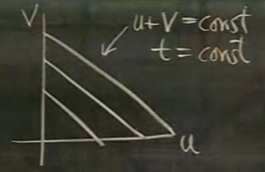
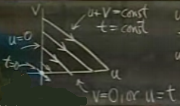
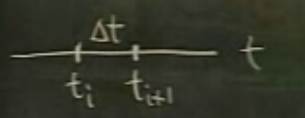

# Ders 21

Evrişim (convolution) tekniği, iki fonksiyon üzerinde işlem yaparak üçüncü bir
fonksiyon elde eder, ve özel bir işareti vardır.

$$ f(t) * g(t) $$

Elde edilen fonksiyon $f(t)$'ye neredeyse hiç benzemeyecektir. Evrişim işlemini
faydalı hale getiren iki sebep var. Birinci fayda formel tanımıyla
alakalı. Diyelim ki üstteki iki fonksiyonun ayrı ayrı Laplace Transformu

$$ F(s) = \int_0^{\infty} e^{-st} f(t) \mathrm{d} t $$

$$ G(s) = \int_0^{\infty} e^{-st} g(t) \mathrm{d} t $$

İki fonksiyonun çarpımının Laplace transformunu elde etmek için fonksiyonların
ayrı ayrı transformunu bir şekilde bir şekilde kullanan bir formül olsa iyi
olmaz mıydı? Böyle bir fonksiyon var mıdır?

Dolaylı yoldan evet. Transformların çarpımı, fonksiyonların çarpımının değil ama
"evrişimlerinin'' transformuna eşittir. Yani

$$
F(s)G(s) =  \int_0^{\infty} e^{-st} (f*g) \mathrm{d} t 
\qquad (1)
$$

Peki niye böyle bir kısayolun olması iyi bir şey? Faydayı belirttik ama sebebini
belirtmedik.

Bunu anlamak için önce üstel serilere bakalım. Hatırlayalım, Laplace
transformunun güç serileriyle (power series) paralelliği vardı

$$ F(x) = \sum a_n x^n $$

$n$'yi $t$ yapıp sürekli ortama geçince Laplace transformunu elde
ediyorduk.

Şimdi ikinci fonksiyon

$$ G(x) = \sum b_n x^n $$

Üstteki formüllerde katsayı için $a_nb_n$ kullansam, bu $F(x)$ ve $G(x)$ ile bir
şekilde bağlantı yaratır mıydı? Cevap dolaylı yoldan evet. Aşağıdaki formülde
$c_n$'i $a_n,b_n$ ile ilintilendiren bir formül lazım bize.

$$ F(x)G(x) = \sum c_n x^n $$

Bu formül ödeviniz olsun, ama bu formülü bir kere bulunca sürekli ortam için
birazdan vereceğimiz formüle ne kadar benzediğini göreceksiniz.

$$ f(t)*g(t) = \int_0^t f(u)g(t-u) \mathrm{d} u $$

Ne biçim bir formül bu? Onu anlamanın en iyi yolu onu kullanarak bir şeyler
hesaplamak herhalde. Not: Kabaca bir tanım şöyle olabilir, $t$ bazlı iki
fonksiyon alınıyor, sıfır ile $t$ değeri arasındaki tüm değerler $f$ için olduğu
gibi, $g$ için tam tersi şekilde $f,g$'ye hesaplattırılıp birbirleri ile
çarpılıyor.

Bu arada evrişim sırabağımsız (commutative) bir işlemdir, yani 

$$ 
f \star g = g \star f 
$$

Evrişim formülüne bakınca sırabağımsızlık bariz değil, çünkü formül simetrik
durmuyor, ama evrişim formülünü (1)'deki gibi görürsek, o zaman bariz.

$$ \mathcal{L} (f*g) \leadsto F(s)G(s) $$

işe, $F(s)$ ve $G(s)$ çarpımı sırabağımsızdır, o zaman evrişim de
sırabağımsızdır.

Örnek

$t^2 * t$'yi hesaplayalım

$$
t^2 * t =\int_0^t u^2 \cdot (t - u) \mathrm{d} u
$$

$$ = \frac{u^3}{3}t - \frac{u^4}{4} \bigg]_{0}^{t} = 
\frac{t^4}{3} - \frac{t^4}{4} =
\frac{t^4}{12}
$$

Pür formül kullanan çözüm böyle. Ama hile (!) yaparak Laplace transformunu
kullanabiliriz.

$$ t^2 \leadsto \frac{2}{s^3}, t \leadsto \frac{1}{s^2} $$

Bu transformların çarpımını alırsak 

$$F(s)G(s) = \frac{2}{s^5} $$

Üsttekinin ters Laplace'i nedir? 

$$ \mathcal{L}^{-1}(\frac{2}{s^5}) = \frac{1}{12}t^4 $$

Bunu nasıl hemen bulduk? Bildiğimiz bir ters transform şöyle

$$ \mathcal{L}^{-1}(\frac{4!}{s^5}) = t^4 $$

Bunu alıp iki üsttekine çevirmek için 12 ile bölmek gerekiyordu.

Örnek

$$ f(t) * 1 = \int_0^t f(u) \ 1 \mathrm{d} u $$

$$  = \int_0^t f(u) \mathrm{d} u $$

Şimdi evrişim işleminin Laplace Transformu ile bağlantısını ispatlayacağız. 

$$ F(s)G(s) = \int_0^{\infty}  e^{-su}f(u) \mathrm{d} u \cdot  
\int_0^{\infty}  e^{-sv} g(v) \mathrm{d} v
$$

Üsttekini cebirsel olarak bir yere "doğru'' manipüle etmeden önce, belki şunu
düşünsek daha iyi olur. "Neyi'' manipüle edersek üstteki forma geliriz? Çift
entegrallerde entegre edilenleri her biri "tek bir şeyin'' fonksiyonu olan ayrı
grupların çarpımı olarak görmek ise yarar, çünkü o zaman mesela iç entegral her
neyse o değişkene göre diğeri sabit sayılır, dışarı atılabilir, vs. Yani
üsttekine alttaki formülden gelebiliriz

$$ = \int_{0}^{\infty} \int_{0}^{\infty} e^{-s(u+v)} f(u)g(v) \mathrm{d} u \mathrm{d} v $$

Daha da basitleştirelim. Eğer $t=u+v$ olsaydı (ki $t$ burada yeni bir değişken
olarak dışarıdan formüle dahil ediliyor) işimiz kolaylaşırdı. $u=u$ olarak
alırız, $v$ artık kullanılmaz, $t-u = v$ yeterli.

$$ = \int \int  e^{-st} f(u)g((t-u)) \mathrm{d} u \_\_ \mathrm{d} t $$

Üstte $dt$ kullanmak istiyorum ama bu değişimi dikkatli yapmak lazım, boş
bırakılan yere ne geleceğini bulmak için Jacobian matrisini kullanmam lazım.

$$ \mathrm{d} u \mathrm{d} v = \frac{\partial(u,v)}{\partial(u,t)} \mathrm{d} u \mathrm{d} t $$

$$ u = u $$

$$ v = t - u $$

$$
J = \left|\begin{array}{rr} 1 & 0 \\ -1 &1 \end{array}\right| = 1
$$

Yani 

$$ \mathrm{d} u \mathrm{d} v = 1 \mathrm{d} u \mathrm{d} t $$

O zaman 

$$ = \int \int e^{-st} f(u)g((t-u)) \mathrm{d} u \mathrm{d} t $$

Tamam. Bir adım daha kaldı, entegral sınırlarını da değiştirmek lazım. Bu biraz
daha zor olabilir.

İç entegrale bakalım, $u$ değişiyor, $t$ sabit tutuluyor. Daha doğrusu
$t=u+v$ olduğuna göre $u+v$ bir sabit. Bir $u,v$ grafiği düşünürsek, 

$u+v$ gösterilen düz çizgiler üzerinde sabittir. 

$u$ üstteki oklar yönünde artar. Peki $u$ bölgeye soldan girdiğinde değeri
nedir? Sıfır. Alttan çıkarken değeri nedir? O noktada $v=0$, $u+v = t$ olduğuna
göre, $u=t$.

$$ = \int \int_0^t e^{-st} f(u)g((t-u)) \mathrm{d} u \mathrm{d} t $$

Dış entegral, orijin noktasındaki $t=0$'dan başlayarak tüm çizgiler için bu
işlemi yapmak istiyorum, bu işlem sonsuza kadar devam ediyor. 

$$ = \int_0^{\infty} \int_0^t e^{-st} f(u)g((t-u)) \mathrm{d} u \mathrm{d} t $$

İspat tamamlandı. 

Laplace Transformunu ile evrişim işlemi arasındaki bağlantıyı gördük. 

Evrişim çok önemli bir işlemdir, ama onu kullanan pek çok kişi onu Laplace
Transformuyla alakalı olarak kullanmaz. Onu olduğu gibi tek başına
kullanırlar. Bir örnek vereyim: benim kızım bir doğa / çevre mühendisi
(environmental engineer), ve müşterileri için risk analizi yapmak gibi işleri
var. Bir gün bir müşterisi için bir bilimsel makale okuyordu, makale asit
yağmuru ile alakalıydı, yağmur gelirse çevre ne kadar zarar görür gibi konularla
ilgiliydi. Verilen zararın hesabı için evrişim kullanılıyor dedi, bana sordu
"evrişim nedir?''. Makaleyi ben de okudum, hakikaten ilginçti, yani bu alanda
evrişim hesabının olması ilginçti.

Sonraları diğer insanlar da benzer sorularla bana geldiler. Kuzey Kutbu'nda
delme işlemi yapan bir mühendis geldi mesela, delme sırasında algılanan
radyoaktiviteyi kullanıp milyonlarca yıl önceki iklim şartları hakkında hesap
yapmakla ilgileniyordu, o da evrişim hesabını kullandı.

O yüzden şimdi ben de size pek çok alana adapte edilebilecek, genel, basit bir
model göstereceğim, bu modeli örnek olarak aklınızda tutmanız evrişim hesabını
anlamanız için iyi olur. Problem radyoaktif atıklarla alakalı.

Bir fabrika radyoaktif atık üretiyor. 

$f(t)$: atım hızı (rate), $t$ sene. İki zaman noktasını düşünürsek,
$t_i,t_{i+1}$ arasında üretilen radyoaktif atık $\approx f(t_i) \cdot \Delta
t$. Zaman aralığı küçüldükçe bu hesap kesinleşecek.

Problemim, $t=0$'dan başlarsam $t$ anında ne kadar radyoaktif atık biriktiğinin
hesabı. Bu hesabı zorlaştıran radyoaktif maddelerin aynı anda çürüyor olmasıdır.

Yani bir yandan atık üretiliyor, bir yandan bu atıklar bir şekilde radyoaktif
özelliklerini kaybediyorlar. O zaman yaptığımız hesap üretilen madde
öbeklerinin, parçalarının birikintide "ne kadar beklediğini'' de hesaba katmalı
*ki* onun çürümesini de bir yandan hesaplayabilelim.

Çürüme hesabı basit bir diferansiyel denklem, $t$ anında kalan madde için,
eğer $A_0$ ile başlanırsa çözümü

$$ A_0e^{-kt} $$

$t$ ekseninin ismini değiştirip $u$ yapalım (bunu niye yaptığımız birazdan belli
olacak)

O zaman daha önce hesapladığımız gibi $[u_i,u_{i+1}]$ arasında üretilen
radyoaktif atık $\approx f(u_i)\Delta u$.

$t$ anında çürüme ise 

$$  \approx f(u_i)\Delta u \cdot e^{-k ( \ \ \ )}$$

$e$'nin solundaki kısım atılan, eklenen kısım. Çürüme hesabına göre orası bir
nevi $A_0$. Peki $e$'nin üstündeki boşluğa ne yazılmalı? Oraya eklenen kısmın
çürüdüğü zaman aralığı konulmalı. O zaman aralığı nedir? $u_i$'da atılmış, $t$
anına bakıyorum, o zaman $t-u_i$ aralığı kadar çürümüş demektir.

$$  \approx f(u_i)\Delta u \cdot e^{-k ( t-u_i )}$$

Şimdi tüm $u$ aralıklarını alıp birbiriyle toplarsam, $t$ anındaki toplamı
bulurum,

$$ \approx \sum_{i=1}^{n} f(u_i) e^{-k(t-u_i)} \Delta u $$

$\Delta u \to 0$ iken üstteki "Riemann toplamı'' alttaki formüle yaklaşır
(aralıklar $u_1 = 0$, ve $u_n = t$ arasında)

$$ \to \int_0^{t} f(u) e^{k(t-u)}du $$

Üstteki fonksiyon bir evrişimdir, 

$$ = f(t) * e^{-kt} $$

Yani hesap atık fonksiyonu ile çürüme fonksiyonun bir evrişimidir (convolution
of).

Pek çok diğer problem üstteki probleme indirgenebilir, onun merceğinden
anlaşılablir. Mesela çöp atıklarını düşünelim, ama çöp atıkları çürümüyor
olsunlar. O zaman evrişim hesabı

$$ f(t) * 1 $$

1 kullanıldı çünkü çürüme yok. 

Bir diğer örnek, tavuk yetiştiriliyor, $f(t)$ yeni tavukların üretilme oranı
(kg), $t$ doğdukları anda civcivlerin büyüme büyüme oranı, $t$ anında kaç kilo
tavuk olduğu $f(t) * t$.

