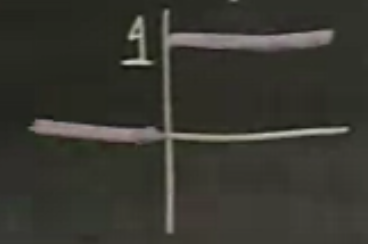
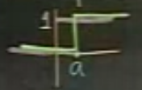
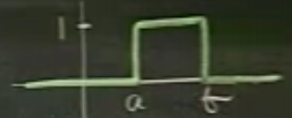
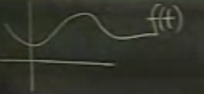
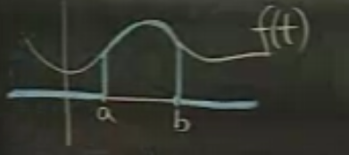
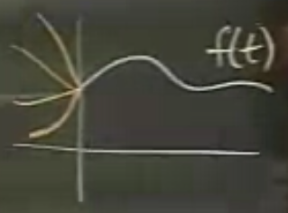
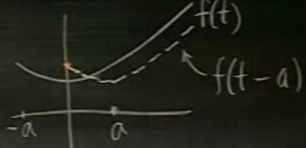
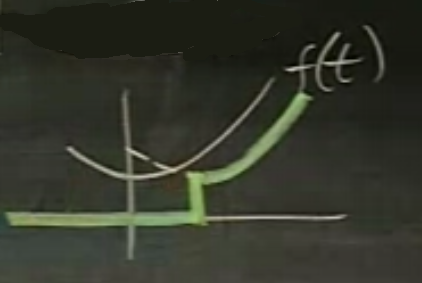
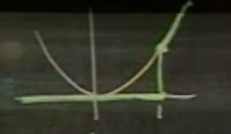
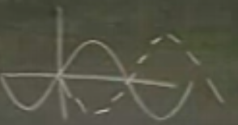

# Ders 22

Mühendislerin Laplace Transformunu sevmesinin sebeplerinden biri
fonksiyonlarda kesintili / birdenbire zıplayan geçişleri (jump
discontinuities) durumlarında bozulmadan işleyebiliyor olmasıdır. 

Kesintili fonksiyonlardan biri birim adım fonksiyonudur. Fonksiyonun
kendisi tartışma yaratan bir fonksiyon aslında, sıfır noktasında hangi
değere sahip olduğu hala kararlaştırılamadı. Bazıları 0 diyor, bazıları 1
diyor, ben bu derste tanımsız bırakacağım. Yani

$u(t)$ birim adım

$u(0)$ tanımsız

Bazen sıfır yerine başka bir noktada zıplama olmasını isteyebilirim. O
zaman fonksiyonu kaydırmak mümkün, mesela $a$ kadar. 

$$ u_a(t) = u(t-a) $$

Birim Kutu

Kutuyu birim adımlar kullanarak temsil edebilirsek iyi olur, çünkü
birim adımların Laplace transformunu biliyoruz. 

$$ u_{ab} := u_a(t) - u_b(t) $$

$$ = u(t-a) - u(t-b) $$

Mantıklı gözüküyor, $b$'ye gelene kadar birim adım gibi gidiyoruz, $b$'de
birim adımı iptal edecek şekilde birim adımı çıkartıyoruz. 

Peki bu fonksiyonlar niye faydalı? Diğer fonksiyonları çarptıklarında o
fonksiyonları faydalı şekillerde değiştirebildikleri için. Diyelim ki şöyle
bir $f(t)$ var.

$$ u_{ab}f(t) $$

neye benzerdi? Eğer $a,b$ arasında $u_{ab}$ 1 değerine eşitse, çarpım bu
aralıkta $f(t)$'yi olduğu gibi alır. Diğer noktalarda sıfır yapar. Alttaki
şekil ortaya çıkar (mavi çizgiler). 

$f(t)$'nin bir parçasını çekip çıkartıyoruz yani. Bu çok ise yarayan bir
numara / teknik. 

Birim adımın Laplace Transformunu alalım.

$$ \mathcal{L}(u(t)) = \int_{0}^{\infty} e^{-st} u(t) \mathrm{d} t  $$

Entegral alt sınırı 0'dan başlıyor. Birim adım 0'dan büyükse hep 1, o zaman
üstte $u(t)$'yi 1 alabiliriz. Yani üstteki aslında 1'in Laplace
Transformudur. 

$$ = \frac{1}{s} \ \ \ s>0 
\qquad (1)
$$

Kaydırılmış birim adımın Laplace'i

$$
\mathcal{L} (u(t-a)) = 
\int_{a}^{\infty} 1 \cdot e^{-st} \mathrm{d} t
$$

Alt sınır $a$ oldu çünkü $a$'dan önce sıfır, sonrası 1. Bizi tek
ilgilendiren kısım fonksiyon 1 olduktan sonra, o zaman alt sınırı 
değiştiririz. 

$$ = \frac{e^{-st}}{-s} \bigg|_{a}^{\infty} =
\frac{e^{-as}}{s}
$$

Diğer bir özellik

$$ \mathcal{L}(e^{ct}f(t)) = F(s-c) $$

İspat: Eğer entegral temsilini açarsak

$$
= \int_{0}^{\infty} e^{ct}f(t)e^{-st} \mathrm{d} t  = \int e^{(c-s)t} f(t) \mathrm{d} t
$$

Bu son ifadeye başka bir yönden erişebilir miyiz? Mesela $F(s-c)$ nedir? 
$s$ yerine $s-c$ koyarsak (temel formülden türetelim)

$$ F(s-c) = \int_{0}^{\infty} f(t) e^{-(s-c)t} ft  $$

$$ = \int_{0}^{\infty} e^{(-s+c)t} \mathrm{d} t  = \int_{0}^{\infty} e^{(c-s)t} \mathrm{d} t $$

Aynı ifadeye eriştik. 

(1) formülünde de ters yönde gidersek

$$ \mathcal{L}^{-1}(\frac{1}{s}) = ?  $$

Geriye giderken 1'e mi, birim adıma mı döneceğim? Şimdiye kadar geriye
giderken hep 1 seçtim. Artık bu yeterli değil. Problem nerede? Çünkü
Laplace Transformu entegral alt sınırı 0'dan başlıyor, yani transform 0
öncesine bakmıyor bile. Bir fonksiyon $f(t)$ 0'dan önce envai türde değere
sahip olabilir, Laplace Transformu aynı olacaktır. 

Eğer hangi tür problem ile uğraştığımızı biliyorsak bu durum bir sorun
çıkarmaz. Mühendisler şöyle kategorize ederler; eğer bir problem şimdiki
zamandan, $t=0$, başlayıp ileri gidiyorsa o bir Laplace Transform
problemidir, eğer geçmiş zaman verisi gerekiyorsa o bir Fourier Transform
problemidir. 

Eğer 1 noktasından ( $t=0$ ) geriye giderken ortaya çıkan tanımsızlıktan
(ambiguity) kurtulmak istiyorsak, ters Laplace'dan elde edilen fonksiyonu
birim adım ile çarparız, böylece $t=0$ öncesi sıfır olmasını garanti etmiş
oluruz.

$$ f(t) \leadsto F(s) $$

$$ \mathcal{L}^{-1}(F(s)) = u(t)f(t) $$

Böylece ters Laplace özgün (unique) hale gelir.

Taşıma (translation) ve Laplace 

$\mathcal{L}(f(t-a))$'yi $\mathcal{L}(f(t))$ temel alarak yazabilir miyiz?
Bu ne yazik ki mumkun degil. 

Üstte $f(t)$'yi $a$ kadar sağa kaydırdık. Kesik çizgili yeni, taşınmış
fonksiyonu niye düz çizgili fonksiyon bağlamında temsil edemiyorum? Sebep
bariz, çünkü $f(t)$'nin sıfır öncesi değeri. O değer Laplace Transformu
sırasında kullanılmaz, ama taşındıktan sonra yeni fonksiyonda
kullanılır. Aradaki bu uyuşmazlığı, eksikliği kapatmak mümkün değildir. 

Yapabileceğimiz en iyi şey, kaybettiğimiz bölümü $u(t-a)f(t-a)$ kullanımıyla
Laplace Transformundan silmektir. Altta koyu çizgili olan kısmın
transformunu alırız yani.

$$ u(t-a)f(t-a) \leadsto e^{-as}F(s) 
\qquad (2)
$$

(2) geçişi Laplace Tablosunda görülebilir.

Fakat $f$ çoğunlukla $t-a$ formunda gelmez, mesela $\sin(t)$, $\cos(t)$
olur, o zaman şu teknik kullanılabilir,

$$ u(t-a)f(t) \leadsto e^{-as}\mathcal{L}(f(t+a)) $$

Bu tekniğe bazıları üstel kaydırma fonksiyonu (exponential shift formula)
diyor. Biz bu terimi kullanmayacağız. Biz $t$ ekseni taşınması (t-axis
translation) formülü diyeceğiz. 

(2)'nin ispatı

$$ \int_{0}^{\infty}e^{-st}u(t-a)f(t-a) \mathrm{d} t $$

Ama formülde $F(s)$ kullanmak istiyorum, o zaman $f(t-a)$'yi bir şekilde
$f(t)$ yapmam lazım. Değişken değişimi yaparım. 

$$ t_1 = t-a $$

$$ = \int_{a}^{\infty}e^{-s(t_1+a)}u(t_1)f(t_1) \mathrm{d} t_1 $$

$$ = e^{-sa} \int_{-a}^{\infty}e^{-st_1}u(t_1)f(t_1) \mathrm{d} t_1 $$

$u(t_1)$ $t_1<0$ için sıfır olduğuna göre $-a,0$ arasını entegral alt
sınırından atabiliriz, 

$$ = e^{-sa} \int_{0}^{\infty}e^{-st_1}f(t_1) \mathrm{d} t_1 $$

$u(t_1)$'in kendisini niye attık? Çünkü sıfır sonrası 1 değerinde zaten. 

"Ama $t$ değişkeni $t_1$ haline geldi, artık bu Laplace Transformu olmaz''
diye düşünenler olabilir. Fakat entegrasyonda kullanılan fonksiyonun illa
$t$ ismini taşıması gerekmiyor, çünkü o değişken bir yer tutucu (dummy)
sadece. Entegre edilen, sınırlar düzgünse, üstteki de bir Laplace
Transformudur.

Yani

$$ u(t-a)f(t-a) \leadsto e^{-as}\mathcal{L}(f(t)) $$

$t$ yerine $t+a$ geçirdim.

Eğer $u(t-a)f(t)$ olsaydı?

$$ u(t-a)f(t-a+a) \leadsto e^{-as}\mathcal{L}(f(t+a))) $$

Örnek 

$$ u_{ab} = u(t-a) - u(t-b) $$

$$ \leadsto \frac{e^{-as}}{s} - \frac{e^{-bs}}{s} $$

Örnek

$$ u(t-1)t^2 $$

Transformu nedir? 

$$ \leadsto e^{-s}\mathcal{L}((t+1)^2) = 
e^{-s}\mathcal{L} (t^2+2t+1) =
e^{-s}(\frac{2}{s^3} + \frac{2}{s^2} + \frac{1}{s})
$$

Bayağı kalabalık bir sonuç oldu, fakat transformunu aldığımızda elde edilen
yukarıdaki fonksiyon da o kadar basit bir fonksiyon değil zaten; altta
yeşil renkle işaretli 

Fonksiyon kesintili (discontinuous) bir fonksiyon. Kesintinin nerede
oluştuğu $e^{-as}$ formülünde $a$, yani $e^{-s} = e^{-1\cdot s}$ için 1. 

$$ \mathcal{L}^{-1}\bigg( \frac{1+e^{-\pi s}}{s^2+1} \bigg) $$

Cevabın bir kesikli fonksiyon olacağını şimdiden biliyoruz, çünkü formül
içinde üstel bir fonksiyon var. İlk yapacağımız iş üstel fonksiyonu yanlız
kalacak şekilde ifadeyi parçalamak. 

$$ = \frac{1}{s^2+1} + \frac{e^{-\pi s}}{s^2 + 1}$$

Önce suna bakalım

$$ \frac{1}{s^2+1} \stackrel{-1}{\leadsto}  \ \ ? $$

Eğer üsttekine cevap olarak $\sin(t)$ dersek, yanlış olur. Eğer üstel
fonksiyon formülün geri kalanında olmasaydı, o zaman $\sin(t)$ olabilirdi,
ama şimdi 

$$ \frac{1}{s^2+1} \stackrel{-1}{\leadsto} u(t)\sin(t) $$

kullanmamız lazım. Peki

$$ \frac{e^{-\pi s}}{s^2 + 1} \stackrel{-1}{\leadsto} \ \ ? $$

Yine (2)'yi kullanırım, 

$$\stackrel{-1}{\leadsto} u(t-\pi)sin(t-\pi) $$

Nihai cevap nedir? İki parçayı toplarım

$$ \frac{1}{s^2+1} + \frac{e^{-\pi s}}{s^2 + 1} \stackrel{-1}{\leadsto} 
u(t)\sin(t) + u(t-\pi)\sin(t-\pi) 
$$

Bu cevap teknik olarak doğru, ama biraz masajlayıp onu daha düzgün bir hale
getirmek lazım [hatta hoca şakayla karışık bu halde bırakırsanız sınavda
not kırarım diyor]. 

O zaman her parçaya teker teker bakalım. Formülün $u(t)\sin(t)$ kısmı
sadece $t \ge 0$ için anlamlı, çünkü ondan önce birim step fonksiyonu
sıfır. $u(t-\pi)\sin(t-\pi)$ kısmi ise $t \ge \pi$ için anlamlı. Elimizde
iki tane senaryo var aslında, o zaman bu fonksiyonu parçalı, senaryolu
olarak gösterebiliriz. 

$$ 
f(t) = 
\left\{ \begin{array}{ll}
sin(t) & 0 \le t \le \pi \\
sin(t) + (-sin(t)) & t \ge \pi
\end{array} \right.
$$

Terim $-\sin(t)$, $\sin(t-\pi)$'dan geldi, çünkü $\sin$'i $\pi$ kadar yana
kaydırırsak (altta kesik çizgili) 

elde edilen $-\sin(t)$'dir. Nihai formül

$$ 
f(t) = 
\left\{ \begin{array}{ll}
sin(t) & 0 \le t \le \pi \\
0 & t \ge \pi
\end{array} \right.
$$

