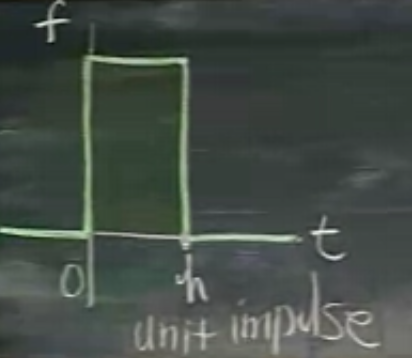

# Ders 23 

Bu ders Laplace Transformlarının son dersi, aynı zamanda, yeni bir girdi
fonksiyonunu göreceğiz -- birim dürtü (unit impulse) fonksiyonları. Bu
fonksiyonlar ne ise yarar? Mesela tüm paranızı bankaya koydunuz, sonra
yarısını çektiniz, vs. Bu tür hesaplar dürtü fonksiyonu ile yapılır. Peki
dürtü nedir? Dürtü, mesela bir objeye bir zaman sürecinde $f(t)$ kuvveti
uyguladığımızda,

$$ f(t) \textit{ dürtü } = \int_{a}^{b}f(t) \mathrm{d} t $$

Eğer $f(t)$ sabit ise, üstteki şu hale gelir

$$ \textrm{Dürtü} = F \cdot (b-a) $$

Peki güç derken nasıl bir sistemden bahsediyoruz? Mesela

Bu sisteme sağdan, belli bir süre bir güç uyguladığımızı düşünelim, $f(t)$
bu işte. 

Bu sistemin davranışını Laplace Transform ile çözmek için kuvveti nasıl
modellerim? Diyelim ki 

0 anında kuvvet uygulaması başlıyor, 0'dan yukarı çıkıyoruz, $h$ kadar
devam ediyor, sonra sıfıra iniyoruz. Eğer bu dürtünün, yani grafik altındaki
entegral alanının 1 olmasını istiyorsak (ki dürtü birim olabilsin), o zaman
kuvvet sıfırdan $1/h$'ye yükselmeli. 

Yay sistemini modellersek (ve birim adım fonksiyonunu kullanırsak)

$$ y'' + y  = \frac{1}{h}u_{0h}(t) $$

Birim adım notasyonumuz, hatırlanacağı gibi, $a,b$ arasında 1 olan bir
durum için $u_{ab}$ idi, ama bu örnekte 1 değil, $1/h$'ye çıkıyoruz, o
zaman her şeyi $1/h$ ile çarparız.

Üstteki sistemi çözmek istiyorsak, sağ tarafın Laplace Transformunu almamız
lazım. Her şeyi birim adım fonksiyonu ile yazalım, ve transformu yapalım

$$ \frac{1}{h} [ u(t) - u(t-h) ] 
\stackrel{\mathcal{L}}{\leadsto} \ \ ?
$$

Hatırlarsak

$$ u(t-a)g(t-a) \stackrel{\mathcal{L}}{\leadsto}  e^{-as}G(s) $$

O zaman iki üstteki

$$ = \frac{1}{h}[ \frac{1}{s} - \frac{e^{-hs}}{s} ]$$

Şimdi şu soruyu soralım: eğer $h$ sıfıra giderse ne olur? Laplace Transform
ne olur? Elimizdeki birim dürtü olduğuna göre, $a,b$ aralığı küçüldükçe,
alan 1 kalmak zorunda olduğu için kuvvet sonsuza gitmelidir. 

$$ \lim_{h \to 0} \frac{1-e^{-hs}}{hs} $$

$u=hs$ kullanalım, temiz olsun 

$$ \lim_{u \to 0} \frac{1-e^{-u}}{u} $$

Limite bakarsak bölüm ve bölen aynı anda sıfır oluyor, yani $0/0$
durumu. Bu istenen bir şey değil. Çözüm nedir? Bazıları Taylor açılımı
yaparak şerideki ilk birkaç terimi üsttekinin yerine geçirebilir. Ama
çoğunuz bu noktada herhalde L'Hospital Kuralını kullanacaktır. Bölüm ve
bölenin ayrı ayrı türevini alırız,

$$ = \lim_{u \to 0} \frac{e^{-u}}{1} = 1$$

Başa dönersek, 

$$ \frac{1}{h}u_{0h}(t) \leadsto \frac{1-e^{-hs}}{hs} $$

Üstteki $h \to 0$ iken 1' yaklaşıyor.  

