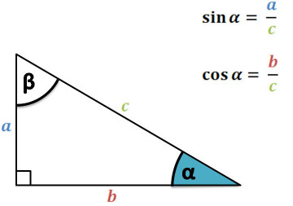
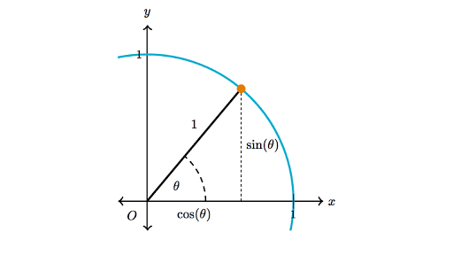
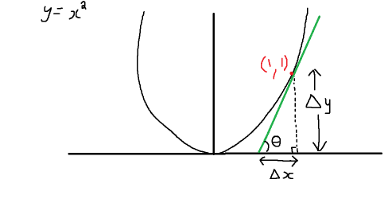

# Trigonometri

Basit bazı temel bilgilerin üzerinden geçelim. Sinüs, kosinüs, tanjant nedir?
Karşı, komşu, hipotenüs kullanan bazı tanımlar akılda kalmış olabilir, mesela
alttaki açı $\alpha$ ve dik üçgenler için, karşı bölü hipotenüs sinüs, komşu
bölü hipotenüs kosinüs, karşı bölü komşu tanjant.



Aslında tanjant'ın esas tanımı sinüs bölü kosinüs,

$$
\tan \alpha = \frac{\sin\alpha}{\cos\alpha} = \frac{a / c}{b / c} = \frac{a}{b}
$$

bölen $c$ iptal olduğu için geri kalanlar karşı bölü komşu. 

Pitagor Kanunu

$a^2 + b^2 = c^2$

İspat

Dik üçgenimizi alıp yanyana koyarak bir kare oluşturuyoruz, artık hem dış
çeperde bir kare var, ayrıca iç kısımda da bir kare var. 


Bu karenin kenarları $b-a$ büyüklüğünde, alanı tabii ki $(b-a)^2$. Büyük karenin
alanı $c^2$. Ama eğer büyük karenin alanını görülen beş tane parçayı toplayarak
elde edebilirsek, Pitagor formülüne erisebiliriz.

$$
(b-a)^2 + 4 \frac{ab}{2} = (b-a)^2 + 2 ab = b^2 -2ab + a^2 + 2ab = a^2 + b^2
$$

Büyük kare eşitliğinden bu alan $c^2$'dir demiştik, o zaman

$$
c^2 = a^2 + b^2
$$

İspatı tamamlamış olduk.

Şimdi Pitagor kullanarak önemli bir trigonometrik eşitlik elde edeceğiz, alttaki
dik üçgeni oluşturursak, $\theta$ ne olursa olsun mavi renkli çemberin yarıçapı,
ve dik üçgenin hipotenüsü 1 olacaktır, ve $\sin\theta = a / 1$ olduğu için
$\sin\theta = a$, yani karşı kenar $\sin\theta$, komşu kenar $\cos\theta$.



Bu kenar bilgilerine Pitagor üzerinden

$$
a^2 + b^2 = 1^2 
$$

$a,b$ yerine koyarsak,

$$
\cos^2\theta + \sin^2\theta = 1
$$

Kosinüsler Kanunu (Law of Cosines)

Bir üçgenin tüm kenar uzunlukları biliniyorsa o üçgenin tüm açılarını
hesaplamak mümkündür, Kosinüsler Kanunu altında verilen üç formül
bunu yapabilir [4].


Formüller

$$
A = \cos^{-1} \left( \frac{b^2 + c^2 - a^2}{2bc}  \right)
$$

$$
B = \cos^{-1} \left( \frac{a^2 + c^2 - b^2}{2ac}  \right)
$$

$$
C = \cos^{-1} \left( \frac{a^2 + b^2 - c^2}{2ab}  \right)
$$

Gerçi son açıyı hesaplamaya gerek yok, $A,B$ biliniyorsa üçüncü açı $C$ 180
dereceden ilk iki açı toplamı çıkartılarak bulunabilir.

```python
def tri_angles(a,b,c):
    tmp = (b**2 + c**2 - a**2) / (2*b*c)
    tmp = np.clip(tmp, -1, 1)
    A = np.arccos(tmp)
    tmp = (a**2 + c**2 - b**2) / (2*a*c)
    tmp = np.clip(tmp, -1, 1)
    B = np.arccos(tmp)
    C = np.pi - (A+B)
    return A,B,C
```

Örnek olarak $b,c$ kenarları $a$'ya göre uzun olan bir üçgen kullanalım,
bu üçgende tabii ki $A$ açısı diğerlerine göre küçük olmalıdır,

```python
A,B,C = tri_angles(20,80,80)
print (A,B,C)
```

```
0.2506556623361308 1.4454684956268313 1.445468495626831
```

```python
np.rad2deg(A)
```

```
Out[1]: 14.361511562916563
```

İspat için alttaki üçgeni referans alalım [5],


Üstteki figürde bir dik üçgen $BCD$ var. Kosinüs tanımına göre

$$
\cos C = \frac{CD}{a}
$$

Ya da

$$
CD = a \cos C
$$

Bu değeri $b$ kenarından çıkartırsak, alttakini elde ederiz,

$$
DA = b - a \cos C
$$

Yine $BCD$ üçgenine bakalım, sinüs tanımına göre,

$$
\sin C = \frac{BD}{a}
$$

Ya da

$$
BD = a \sin C
$$

Şimdi $ADB$ üçgeni üzerinen Pitagor Teorisini uygularsak ve o hesap için şimdiye
kadar bulduğumuz büyüklükleri kullanırsak,

$$
c^2 = BD^2 + DA^2
$$

Üstte $BD,DA$ için önceden bulduğumuz değerleri koyalım,

$$
c^2 = (a \sin C)^2 + (b - a \cos C)^2
$$

Kare çarpımını yaparak parantezleri açalım,

$$
c^2 = a^2 \sin^2 C + b^2 - 2ab\cos C + a^2 \cos^2 C
$$

Tekrar duzenleyelim,

$$
c^2 = a^2 \sin^2 C + a^2 \cos^2 C + b^2 - 2ab \cos C
$$

$a^2$ terimini disari cekelim,

$$
c^2 = a^2 (\sin^2 C + \cos^2 C) + b^2 - 2ab\cos C
$$

Parantez içindeki büyüklüğün 1 olduğunu biliyoruz, o zaman

$$
c^2 = a^2 + b^2 - 2ab\cos C
$$

$$
\cos C = \frac{a^2 + b^2 - c^2}{2ab}
$$

$$
C = cos^{-1} \left( \frac{a^2 + b^2 - c^2}{2ab}  \right)
$$

Diğer iki açı formülünün ispatı benzer şekilde yapılabilir.

Radyan

Acıları 0 ile 360 arasında temsil edebildiğimiz gibi radyan (radian) olarak ta
temsil edebiliriz. Zaten radyan yaklaşımı çemberle alakalı her türlü hesaba
doğal olarak dahildir; bir çemberin çevresi $2 \pi \cdot r$ olarak hesaplanır,
ki $r$ yarıçaptır, buradaki $2 \pi$ tüm 360 dereceye tekabül eden radyan açısı
olarak görülebilir, yani 360 = 6.28.. diye gider, $\pi$ sayısının iki katıdır.


Buradan hareketle çemberin ufak bir parçasının uzunluğunu radyan açısı ile
bulabiliriz, eğer tüm çevre $2 \pi r$ ise 45 derecelik parçanın uzunluğu
nedir? $\pi / 4 \cdot r$ tabii ki, yani $\pi / 4$ radyan açısı ile yarıçap
çarpılır.

Zaten tüm yaygın kullanılan matematiksel yazılım paketleri de trigonometrik
fonksiyonları için radyan açı olarak parametre beklerler. Mesela `numpy`
ile,

```python
np.cos(6.28)
```

```
Out[1]: 0.9999949269133752
```

```python
np.sin(6.28)
```

```
Out[1]: -0.0031853017931379904
```

Tam sıfır çıkmadı sıfıra yakın çünkü $\pi$'nin iki katını noktadan sonra iki
basamağa yuvarladık.

```python
np.sin(6.28318)
```

```
Out[1]: -5.307179586686775e-06
```

Aynı paketlerde dereceden radyana geçiş için fonksiyonlar vardır,

```python
np.deg2rad(180)
```

```
Out[1]: 3.141592653589793
```

Eğer küçük açılardan bahsediyorsak ufak çember parçalarını hayal ederek bazı
yaklaşıklamalar mümkündür [2]. Alttaki ufak $\theta$ açısına bakalım,


Görülen çemberin ufak $s$ parçası radyan ile $s = A \theta$ olur, değil mi?
Buradan ilerlersek ve çok ufak açılar için $s \approx O$ ve $H \approx A$
olmasından hareket ederek bazı ilginç sonuçlara varacağız.

Tanjant karşı bölü komşudur, resimde bu $O / A$, fakat küçük açı durumunda
$O \approx s$, o zaman, 

$$
\tan \theta = \frac{O}{A} \approx \frac{s}{A} = \frac{A\theta}{A} = \theta
$$

Yani ufak açı sözkonusu ise $\tan \theta \approx \theta$! Böyle durumlarda
sadece karşı bölü komşu bölüm hesabı yaparak radyan üzerinden $\theta$
açısını bulabiliyoruz!

Devam edelim, sinüs hesabı karşı bölü hipotenüs, yani $O / H$, küçük açı
durumunda $H \approx A$, o zaman

$$
\sin \theta = \frac{O}{H} \approx \frac{O}{A} \approx \frac{s}{A} = \frac{A\theta}{A} = \theta
$$

Aynı $\theta$ sonucuna eriştik. 

Üstteki geometrik bir yaklaşımdı, Calculus kullanan bir diğer ispat altta
bulunabilir.

Diğer Trigonometrik Eşitlikler

Toplam Formülleri

Açı toplama eşitliklerine bakalım. Bu eşitlikler

$$
\cos(A+B) = \cos A \cos B - \sin A \sin B
$$

$$
\sin(A+B) = \sin A \cos B + \cos A \sin B
$$

Ispata gelelim. Önce Euler eşitliği,

$$
e^{i\theta} = \cos\theta + i\sin\theta
$$

Şimdi diyelim ki $\theta = A+B$, o zaman [1],

$$
\cos(A+B) + i\sin(A+B) = e^i(A+B)
$$

$$
= e^{iA} \cdot e^{iB}
$$

$$
= (\cos A + i\sin A) (\cos B + i\sin B)
$$

Çarpımı açarsak,

$$
= \cos A \cos B + i\cos A \sin B +
i\sin A \cos B - \sin A \sin B
$$

Dikkat son terimdeki eksi işaretin sebebi $i \cdot i = -1$ olması çünkü hayali
sayı $i$'nin tanımı $i = \sqrt{-1}$. 

Bir gruplama yapalım, 

$$
= \cos A \cos B - \sin A \sin B + i (\cos A \sin B + \sin A \cos B )
$$

Buraya nereden geldiğimizi hatırlayalım, üstteki ifadenin $\cos(A+B) + i\sin(A+B)$'e
eşit olması gerekir. Eşitlik ne demektir? Üstteki formülün reel kısmını
$\cos(A+B) + i\sin(A+B)$'in reel kısmına, hayali kısmının yine aynı formülün
hayali kısmı ile eşit olması demektir. O zaman ispat tamamlanmış oldu.

Tanjant için ilginç bir eşitlik,

$$
\tan (\alpha + \beta) = \frac{\tan\alpha + \tan\beta}{1 - \tan\alpha \tan\beta}
$$

Çıkartma için benzer bir eşitlik geçerli,

$$
\tan (\alpha - \beta) = \frac{\tan\alpha - \tan\beta}{1 + \tan\alpha \tan\beta}
$$

İspat [3] oldukça mekanik şekilde yapılabilir, direk tanjant tanımı ile başlayalım,

$$
\tan A = \frac{\sin A}{\cos A}
$$

$$
\tan (\alpha + \beta) = \frac{\sin (\alpha + \beta)}{\cos (\alpha + \beta)}
$$

Esitligin sag tarafi su sekilde genisletilebilir,

$$
\frac{\sin (\alpha + \beta)}{\cos (\alpha + \beta)} =
\frac{\sin\alpha \cos\beta + \cos\alpha + \cos\alpha \sin\beta }
     {\cos\alpha \cos\beta - \sin\alpha - \sin\alpha \sin\beta}
$$

Sağ tarafı $(\cos\alpha)(\cos\beta)$ ile bölelim, bu bize 

$$
\dfrac{\dfrac{\sin\alpha\cos\beta}{\cos\alpha\cos\beta} + \dfrac{\cos\alpha\sin\beta}{\cos\alpha\cos\beta}}
      {\dfrac{\cos\alpha\cos\beta}{\cos\alpha\cos\beta} - \dfrac{\sin\alpha\sin\beta}{\cos\alpha\cos\beta}}
$$

$$
= \frac{\tan\alpha + \tan\beta}{1 - \tan\alpha \tan\beta}
$$

Böylece ilk eşitliğe erişmiş olduk, eski işaretli versiyona aynı yaklaşımla erişilebilir.

Çift Açı Formülleri

İspatladığımız

$$
\cos(A+B) = \cos A \cos B - \sin A \sin B
$$

formülünde eğer $B$ yerine $A$ kullanırsak, o zaman $2A$ elde ederiz, bunun
açılımı neye eşit olur?

$$
\cos(A+B) = \cos(A+A) = \cos(2A) = \cos A \cos A - \sin A \sin A
$$

$$
\cos(2A) = \cos A^2 - \sin A^2
$$

Ayni teknigi $\sin(A+B)$ uzerinde uygularsak,

$$
\sin(A+B) = \sin(A+A) = \sin(2A) =
\sin A \cos A + \cos A \sin A
$$

Bu iki terim birbirinin aynısı, o zaman

$$
\sin(2A) = 2\sin A \cos A
$$

Şimdiye kadar elde ettiğimiz

$$
\cos^2\theta + \sin^2\theta = 1, \quad
\cos^2\theta - \sin^2\theta = \cos2\theta
$$

formüllerinden ek eşitlikler türetmek mümkün. Eğer iki formülü toplarsak

$$
2\cos^2\theta = 1 + \cos2\theta 
$$

eğer 2'inciyi 1'inciden çıkartırsak,

$$
2\sin^2\theta = 1 - \cos2\theta
$$

elde ederiz.

Küçük Açı Yaklaşıklaması (Small Angle Approximation)

Bazı fizik kitaplarında ve eğer ufak açılar sözkonusu ise bazen $\sin\theta
\approx \theta$ geçişi yapıldığını görüyoruz. Bu nereden geliyor?

Sinüs fonksiyonu üzerinde Maclaurin açılımı [2] yaparsak (yani sıfır etrafında
Taylor açılımı),

$$
\sin\theta =
\theta -
\frac{\theta^3}{3!} +
\frac{\theta^5}{5!} -
\frac{\theta^7}{7!} + ...
$$

Radyan olarak düşünürsek eğer $\theta$ çok küçük, yani sıfıra yakın ise küpü
alınan çok küçük değer daha da küçülecektir, o zaman ikinci terim dahil olmak
üzere tüm diğer terimler yok sayılabilir,

$$
\sin\theta \approx \theta
$$

Dahası da var! Çok ufak bir açının kosinüsü 1'e yakındır, ve tanjant sinüs bölü
kosinüs olduğu için bölen 1 iptal edilir, geriye kalanlar,

$$
\tan\theta \approx \sin\theta \approx \theta
$$

Faydalı olabilir!

Sayısal olarak kontrol edelim,

```python
theta = 0.01
print (np.sin(theta))
print (np.tan(theta))
```

```
0.009999833334166664
0.010000333346667207
```

Üstteki numaralar bazen ilginç şekillerde karşımıza çıkabilir, mesela bir
eğrinin eğiminin ne olduğunu hatırlarsak,



Eğim $\Delta y / \Delta x$, ki bu yaklaşık olarak türevin ta kendisi değil
midir, yani $dy / dx$? Evet. Aynı şekilde üstte gördüklerimizden hareketle
bu eğime $\tan\theta$ diyebiliriz, ve ufak açılar sözkonusu ise
$\tan\theta \approx \theta \approx dy / dx$!

Ufak sayılar sözkonusu ise $\arctan$ için benzer bir durum geçerli, ufak
değerlerde $\arctan(x) \approx x$. İspat için $\arctan$ Taylor açılımına
bakalım,

$$
\arctan(x) = x - \frac{x^3}{3} + \frac{x^5}{5} + ...
$$

Ufak $x$ var ise bu durumda $x^3$ ve $x^5$ gibi üstel hesaplar daha da
ufalacaktır, yaklaşık olarak sıfıra yakın kabul edilebilirler. O zaman üstteki
formülde kesirli terimler yok sayılabilir, sonuç olarak $\arctan(x) \approx x$.

Ters Trigonometrik Formüller (Inverse Trigonometric Functions)

$\cos x$ için $\cos^{-1} x$ ya da $\arccos x$ ile gösterilen ters
trigonometrik formüldür. $\sin x$ ve $\tan x$ için aynı şekilde. 

Bu ters fonksiyonların türevi nasıl alınır? $\theta = \tan^{-1}x$ örneğinde
görelim. Elde etmek istediğimiz $d\theta/dx$. 

Eğer

$$ \tan^{-1}x = \theta$$

ise, o zaman 

$$ \tan\theta = x $$

$x$'i aslında $\theta$'ya bağlı bir $x(\theta)$ fonksiyonu olarak görebiliriz. 
Eğer iki tarafın $\theta$'ya göre türevini alırsak

$$ \frac{dx}{d\theta} = \sec^{2}\theta $$

Bizim istediğimiz bunun tersi, o zaman bölümü tersine çevirelim

$$ \frac{d\theta}{dx} = \frac{1}{\sec^{2}\theta} $$

Pitagor Eşitliklerinden bildiğimize göre

$$ \sec^{2}\theta = \tan^{2}\theta + 1 $$

Yerine geçirelim

$$ \frac{d\theta}{dx} = \frac{1}{\tan^{2}\theta + 1} $$

İlk başta tanımladığımıza göre $\tan\theta = x$, bunu da üstte yerine
koyalım

$$  = \frac{1}{x^2 + 1} $$

Kaynaklar 

[1] Blackpenredpen, *Angle Sum formula, proof by complex number*,
     [https://www.youtube.com/watch?v=OcXqF8l2crI](https://www.youtube.com/watch?v=OcXqF8l2crI)
     
[2] Wikipedia, *Small angle approximation*,
    [https://en.wikipedia.org/wiki/Small-angle_approximation](https://en.wikipedia.org/wiki/Small-angle_approximation)

[3] Math Guide,
    [https://www.mathguide.com/lessons2/SDAT.html](https://www.mathguide.com/lessons2/SDAT.html)

[4] Law of Cosines Calculator,
    [https://www.calculatorsoup.com/calculators/geometry-plane/triangle-law-of-cosines.php](https://www.calculatorsoup.com/calculators/geometry-plane/triangle-law-of-cosines.php)

[5] Proof of the Law of Cosines,
    [https://www.mathopenref.com/lawofcosinesproof.html](https://www.mathopenref.com/lawofcosinesproof.html)
    

