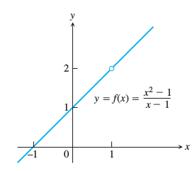
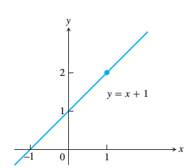
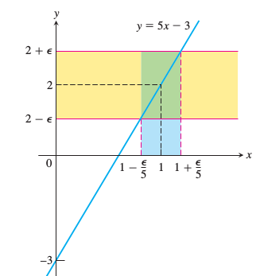

# Limitler (Limits)

$x$ değeri $x_o$'a yeterince yaklaşırken bir fonksiyonun limitinin $L$
olduğu söylenir, eğer $x$'i $x_0$'a yakınlaştırırken $L$'e herhangi bir
yakınlıkta / istediğimiz kadar yaklaşıyorsak [1, sf. 77]. Notasyon olarak,

$$ \lim_{x \to x_0} f(x) = L  $$

Üstteki paragraf formel bir tanım değil, çünkü "yeterince yaklaşırken'',
"$L$'e istediğimiz kadar yaklaşıyorsak'' gibi kelimeler matematiksel
kesinliğe sahip değiller. Bir makine teknisyeni için yakınlık santimetrinin
binde biri olabilir, yıldızları inceleyen bir astronom için yakınlık birkaç
bin ışık yılı olabilir. Fakat bu tanım bazı spesifik fonksiyonların
limitlerini bulmak için yeterli. Daha kesin tanım sonra gelecek.

Alttaki fonksiyon $x=1$ noktası yakınında nasıl davranır? 

$$ f(x) = \frac{x^2 - 1}{x-1} $$

Dikkat edilirse fonksiyon tam $x=1$ noktasında tanımlı değil, tüm diğer
reel sayılar için tanımlı (çünkü sıfır ile bölüm yapamıyoruz). İfadeyi
çarpanlara ayırarak, bölüm, bölendeki aynı çarpanları iptal ediyoruz,

$$ f(x) = \frac{(x + 1)(x-1)}{x-1} = x+1, \qquad x \ne 1 \textrm{ için }$$

Demek ki $f$'in grafiği $x+1$ çizgisi gibidir, daha doğrusu neredeyse
aynısıdır tek fark o çizginin içinden (1,2) noktasının *çıkartılmış*
halidir. Bu çıkartılan nokta alttaki grafikte bir boşluk olarak
gösteriliyor, yani $f(x)$ o noktada tanımlı değil.

Fakat grafiğe bakıyoruz, açık bir şekilde görülüyor ki, $f(1)$ tanımlı
olmamasına rağmen $x$'i *yeterince* 1' yaklaştırarak $f(x)$'in değerini
2'ye *istediğimiz kadar* yaklaştırabiliriz. 

İşte limit ifadesini şimdi devreye sokabiliriz, $x$ 1'e yaklaşırken
$f(x)$'in limitinin 2'ye yaklaştığını söyleriz, ve formül olarak

$$ \lim_{x \to 1} f(x) = 2 , \qquad \textrm { ya da } \qquad
\lim_{x \to 1} \frac{x^2 - 1}{x-1} = 2
$$

Limit Matematiğinin Kuralları

Eğer $L,M,c,k$ reel sayılar ise, ve

$$ \lim_{x \to c} f(x) = L, \qquad \lim_{x \to c} g(x) = M $$

ise, 

Toplam Kuralı

$$ \lim_{x \to c} ( f(x)+g(x) ) = L + M  $$

Fark Kuralı

$$ \lim_{x \to c} ( f(x)-g(x) ) = L - M  $$

Çarpım Kuralı

$$ \lim_{x \to c} ( f(x) \cdot g(x) ) = L \cdot M  $$

Sabit İle Çarpım Kuralı

$$ \lim_{x \to c} ( k \cdot f(x) ) = k \cdot L  $$

Bölüm Kuralı

$$ \lim_{x \to c} ( \frac{f(x)}{g(x)} ) = \frac{L}{M}, \qquad M \ne 0  $$

Örnek

$$ \lim_{x \to c} \frac{x^4 + x^2 - 1}{x^2 + 5} $$

nedir? Haldır huldur bölüm yapmaya uğraşmaya gerek yok, Bölüm Kuralını
kullanırsak, bölüm ve bölenin ayrı ayrı limitini alabiliriz,

$$ = \frac{\lim_{x \to c} x^4 + \lim_{x \to c} x^2 - \lim_{x \to c} 1}
{\lim_{x \to c} x^2 + \lim_{x \to c} 5} 
$$

$$ = \frac{c^4 + c^2 - 1}{c^2 + 5} $$

Formel Tanım

Fonksiyon $f(x)$'in $x_0$ etrafındaki açık aralık (open interval)
tanımlanmış olsun, tam $x_0$ üzerinde tanımlı olması şart değil. $x$,
$x_0$'a yaklaşırken $f(x)$'in limiti $L$ deriz, ve bunu 

$$ \lim_{x \to x_0} f(x) = L $$

olarak belirtiriz, eğer her $\epsilon > 0$ değeri için bir $\delta > 0$
mevcut ise ve

$$ 0 < |x - x_0| < \delta 
\qquad \Rightarrow \qquad
|f(x) - L| < \epsilon
$$

olmak üzere.

Örnek

$$ \lim_{x \to 1}  (5x - 3)  = 2$$

olduğunu gösterin. 

Üstteki limit tanımında $x_0 = 1$ olacak, $f(x) = 5x - 3$ ve $L=2$.
Yapmamız gereken herhangi bir $\epsilon > 0$ için $\delta > 0$ bulmamız,
öyle ki $x \ne 1$, $x$ $x_0$'in $\delta$ yakınında. Yani ne zaman

$$ 0 < |x-1| < \delta $$

ise, $f(x)$, $L=2$ değerinin en fazla $\epsilon$ kadar yakınında, yani

$$ |f(x) - 2| < \epsilon $$

Şimdi $\delta$ değerini $\epsilon$ eşitsizliğinden geriye giderek
hesaplamaya uğraşacağız, 

$$ |(5x-3) - 2| = |5x-5| < \epsilon $$

$$ 5 |x-1| < \epsilon $$

$$ |x-1| < \epsilon / 5 $$

O zaman $\delta = \epsilon / 5$ alabiliriz, çünkü $0 < |x-1| < \delta$ için 

$$ |(5x-3)-2| = |5x-5| = 5|x-1| < 5 (\epsilon/5) = \epsilon $$

doğru olur. Böylece $\lim_{x \to 1} (5x-3) = 2$ olduğunu ispatlamış olduk.

Resimde de görülüyor, eğer $f(x) = 5x-3$ ise $0 < |x-1| < \epsilon/5$
olması $|f(x)-2| < \epsilon$ olmasını garanti hale getiriyor. 

Bir Limit Olarak $e$

Matematikteki ünlü eşitliklerden birisi

$$ e = \lim_{n \to \infty} (1+ \frac{1}{n})^n $$

Diyelim ki $f(x)=\ln x$. Şimdi $f'(x)$ ifadesini düşünelim, türevin $1/x$
olduğunu biliyoruz. Şimdi bu ifadenin limit açılımını yapalım,

$$
= \lim_{h \to 0} \frac{f(x+h)-f(x)}{h}
= \lim_{h \to 0} \frac{\ln(x+h)-\ln(x)}{h} 
$$

$$
= \lim_{h \to 0} \frac{1}{h} \ln(x+h)-\ln(x)
= \lim_{h \to 0} \frac{1}{h} \ln \big(\frac{x+h}{x} \big)
$$

$$ = \lim_{h \to 0} \frac{1}{h} \ln \big( 1 + \frac{h}{x} \big) = \frac{1}{x}  $$

ki $1/x$ daha önceki türevden geldi. 

Şimdi, basitleştirme amaçlı $r=1/x$ dersek,

$$ = \lim_{h \to 0} \frac{1}{h} \ln \big( 1 + rh \big) = r  $$

$$ = \lim_{h \to 0}  \ln \big( 1 + rh \big)^{1/h} = r  $$

İki tarafın $\exp$'sini alırsak, 

$$ = \lim_{h \to 0}  \exp \ln \big( 1 + rh \big)^{1/h} = e^r  $$

altta $\exp$ ve $\ln$ birbirini iptal eder, ve $n = 1/h$ dersek,

$$ = \lim_{n \to \infty}  \big( 1 + \frac{r}{n} \big)^{n} = e^r  $$

Limitin nasıl değiştiğine dikkat: $h$ sıfıra gidiyordu, ama $n=1/h$ sonsuza
gidiyor. Özel durum $r=1$ için  

$$ e = \lim_{n \to \infty}  \big( 1 + \frac{1}{n} \big)^{n}$$

$e^x$'mi $x^e$'mi Daha Hızlı Büyür

Bu soru akla gelebilir, mesela $sabit^{degisken}$ mi yoksa
$degisken^{sabit}$ formunun mu daha hızlı büyüdüğü. Örnek olarak
$e^{x}$,$x^e$ alabiliriz, $e$ bir sabittir, yeterince büyüktür
(2.718..). Hipotez şöyle olsun, $e^{x}$ daha hızlı büyür, acaba doğru mu?
Bu soruyu sormak, $\lim_{x \to \infty} x^e / e^{x}$'nun sıfıra gidip
gitmediğini hesaplamak ile aynıdır. 

L'Hospital uygularsak, yani $\lim_{z \to z_0} f(z)/g(z) = \lim_{z \to z_0} f'(z)/g'(z)$

$$ 
\lim_{x \to \infty} \frac{x^e}{e^{x}} = 
\lim_{x \to \infty} \frac{e \cdot x^{e-1}}{e^{x}} = 
\lim_{x \to \infty} \frac{e(e-1) \cdot x^{e-2}}{e^{x}} 
\lim_{x \to \infty} \frac{e(e-1)(e-2) \cdot x^{e-3}}{e^{x}} = 0
$$

Sonuçta bölen hiç değişmeden kaldı, sonuçta altta sonsuza giden bir ifade
var, üstte ise küçülen bir ifade. $e^x$ daha çok daha hızlı büyüyen bir
ifadedir.

L'Hospital (l'Hôpital) Kuralı [1, sf. 292]

$$ \lim_{x \to a} \frac{f(x)}{g(x)}$$

bazen hesaplanamaz, çünkü hem $f(a)$ hem $g(a)$ sıfıra eşittir. Bu durum
$0/0$ gibi acaip bir durum ortaya çıkarır, ki böyle bir şeyi hesaplamak mümkün
değildir. $0/0$'in diğer bir adı "hesaplanamayan form (indeterminate
form)''. Fakat L'Hospital 1. Senaryo kuralına göre, 

$$ \lim_{x \to a} \frac{f(x)}{g(x)} = 
\frac{f'(a)}{g'(a)} 
$$

eşitliği kullanılabilir. 

Bir diğer form,

$$ \lim_{x \to a} \frac{f(x)}{g(x)} = 
\lim_{x \to a} \frac{f'(x)}{g'(x)} 
$$

İspat

$f'(a)$ ve $g'(a)$'dan geriye doğru gidelim, ki bu tanımların kendisi de
birer limit zaten. 

$$ 
\frac{\displaystyle f'(a)}{g'(a)} = 
\frac
{\lim_{x \to a}\frac{\displaystyle f(x) - f(a)}{\displaystyle x-a}}
{\lim_{x \to a}\frac{\displaystyle g(x) - g(a)}{\displaystyle x-a}}
$$

$$ =
\lim_{x \to a } \frac
{\frac{\displaystyle f(x) - f(a)}{\displaystyle x-a}}
{\frac{\displaystyle g(x) - g(a)}{\displaystyle x-a}}
$$

$$ =
\lim_{x \to a } \frac
{f(x) - f(a) }{g(x)-g(a)}
\qquad (1)
$$

$x \to a$ iken $g(a)$ ve $f(a)$'nin sıfıra gittiğini biliyoruz, tüm bu
işlere girmemizin sebebi oydu zaten, o zaman 

$$ =
\lim_{x \to a } \frac
{f(x) - 0 }{g(x)- 0} = 
\lim_{x \to a }  \frac{f(x)  }{g(x)}
$$

Bir diğer hesaplanamayan form $\infty/\infty$ için de L'Hospital Kuralı
aynen geçerli. O formun ispatı biraz daha çetrefil, ama kullanma bağlamında
aynen işliyor. 

Uyarı: Eğer $0/0$ ya da  $\infty/\infty$ durumu ortada yoksa L'Hospital
Kuralını kullanmayın. İspat da zaten böyle bir durumun olduğu bilgisinden 
hareketle sonuca ulaşıyor. 

$\infty/\infty$ Durumu

Bu ispat için

$L=\lim_{x \to \infty} f'(x)/g'(x)$ kabul edelim ve öyle bir $a$ seçelim ki

$\frac{f'(x)}{g'(x)} \stackrel{\approx}{\epsilon} L$, $x>a$. 

olsun. 

Not: Hocanın notasyonuna göre eğer $a,b$ birbirlerine $\epsilon$ kadar
yakınlarsa $a \stackrel{\approx}{\epsilon} b$ kullanılır.

Şimdi ispatın geri kalanında şu alttaki iki yaklaşıksallığı ispat
etmek bir yöntemdir, ($x\gg 1$ olmak üzere)

$$ 
\frac{f(x)}{g(x)} \stackrel{\approx}{\epsilon}
\frac{f(x)-f(a)}{g(x)-g(a)} \stackrel{\approx}{\epsilon}
L
 $$

Ortadaki ifade (1)'e benziyor. Şimdi ilk yaklaşıksallık için 

$$ f(x) - f(a) = f(x) [ 1 - f(a)/f(x)]  $$

yazarız. Bu basit bir cebirsel manipülasyon. Aynı şeyi $g(x)$'li bölen için
de yaparız. Birada yazarsak

$$ \frac{f(x)}{g(x)} \stackrel{\approx}{\epsilon}
\frac{f(x) [ 1 - f(a)/f(x)] }{g(x) [ 1 - g(a)/g(x)] } 
$$

Her iki taraftan $f(x)/g(x)$ iptal olabilir. 

Sonra limit teorisini kullanırız. Bu yaklaşıksallığın varlığı bariz, çünkü,
herhangi bir $\epsilon$ için $x_0$'i yeterince büyük seçebiliriz ki alttaki

$$ 1 - \epsilon < \frac{1 -  f(a)/f(x)}{1-g(a)/g(x)} < 1 + \epsilon $$

$x > x_0$ için hep doğru olur. Unutmayalım, $f(x),g(x)$, $x\to \infty$ iken
sonsuzluğa gidiyorlar. Sabit bir $f(a),g(a)$ değerini sonsuza giden bir
değerle bölünce ortaya sıfır çıkıyor, elde kalanlar yaklaşıksal olarak $1/1$. 

İkinci yaklaşıksallık için, Cauchy Ortalama Değer Teorisi (Cauchy
Mean-value Theorem) kullanırız [ispatı altta].  $a < c < x$ şeklinde öyle
bir $c$ vardır ki $(f(x) - f(a))g'(c) = (g(x)-g(a))f'(c)$ doğrudur. Yani

$$ \frac{f(x)-f(a)}{g(x)-g(a)} = \frac{f'(c)}{g'(c)} $$

ki bu ifade $L$'e  $\epsilon$ kadar yakındır.

