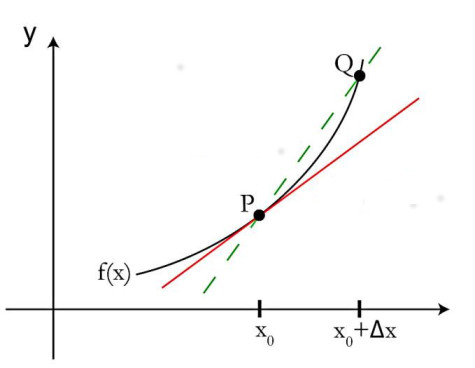
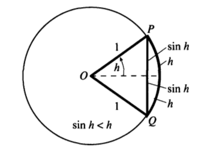

# Türevler ve Entegraller

Türev ve entegral kavramlarını teorik olarak nasıl açıklarız? Her iki kavram da
modern matematikte artık limitler üzerinden temsil ediliyor.

Türev

Geometrik olarak bakarsak, bir $f(x)$ fonksiyonu var diyelim, bu fonksiyona $P$
noktasında teğet olan sekant çizgisi olsun [1],

Bu çizgi üzerinde iki nokta seçelim, $P,Q$'ya tekabül eden x ekseni üzerinde
biri $x_0$'da diğeri $x_0 + \Delta x$ üzerinde. Bu bölgeye yakından bakarsak,

$f'(x_0)$'nin, yani $x_0$ noktasında $f$'nin türevinin limitler üzerinden tanımı
şöyledir,

$$
\lim_{\Delta x \to 0} \frac{\Delta f}{\Delta x} =
\lim_{\Delta x \to 0} \frac{f(x_0 + \Delta x) - f(x_0)}{\Delta x} =
f'(x_0)
$$

Giriş seviyesinde Calculus'tan bilinen üsteli bir azaltıp çarpım haline getirme
tekniğini hatırlarsak, mesela $f(x) = x^2$ ise $f'(x) = 2x$ gibi, bu tekniği
limitler ile türetebiliriz. Genel bir $x^n$ için türetelim, aradığımız oran
şudur,

$$
\frac{\Delta f}{\Delta x} = \frac{(x_0-\Delta x)^n - x_0^n}{\Delta x}
\qquad (1)
$$

Son ifadede $x_0$ yerine $x$ kullandık, notasyonu basitleştirmek için. Devam
edelim, $(x+\Delta x)^n$ nedir? Genel bir $(p + q)^n$ için düşünürsek,

$$
(p+q)^2 = p^2 + 2pq + q^2
$$

$$
(p+q)^3 = p^3 + 3 p^2 q + 3pq^2 + q^3
$$

$$
(p+q)^4 = p^4 + 4p^3 q + 6p^2 q^2 + 4p q^3 + q^4
$$

gibi devam edecektir.. Nihai formül için Binom Teorisi konusuna bakılabilir [3].
Fakat eldeki formüllerde bile bir kalıp farkedebiliyoruz, bu kalıp

$$
(p+q)^n = p^n + n p^{n-1} q + O(q^2) + q^n
$$

olarak ifade edilebilir. $O(q^2)$ olarak gösterilen "$q^2$ ve üstü derecesini
içeren terimlerin toplamı'' notasyonudur. Bu tür bir gruplamak yapmak bize limit
alırken faydalı olacak. Problemimize uygularsak,

$$
(x+\Delta x)^n = x^n + n (\Delta x)x^{n-1} + O(\Delta x^2)
$$

Bu ifadeyi (1) içine koyalım,

$$
\frac{\Delta f}{\Delta x} =
\frac{x^n + n (\Delta x)x^{n-1} + O(\Delta x^2) - x^n}{\Delta x}
$$

$x^n$'ler iptal olacaktır, $\Delta x$ ile böldükten sonra

$$
= n x^{n-1} + O(\Delta x) - \frac{x^n}{\Delta x}
$$

Üstteki ifadenin limitini alınca $\Delta x$ içeren ifadeler yokolur,

$$
\lim_{\Delta x \to 0} \frac{\Delta f}{\Delta x} =
n x^{n-1}
$$

Yani

$$
\frac{\mathrm{d} }{\mathrm{d} x} x^n = n x^{n-1}
$$

Her türlü fonksiyon için limit yaklaşımı kullanılabilir, mesela $\sin(x)$
örneğine bakalım.

Türev: $\sin(x)$

[4, sf. 66]. Sinüs fonksiyonunun türevi derken aslında kastedilen şudur,

$$ \lim_{h \to 0} \frac{sin(x+h) - sin(x)}{h} $$

Trigonometrik eşitliklerden bildiğimize göre, 

$$ sin(a+b) = \sin a \cos b + \cos a \sin b $$

Bu eşitliği iki üstteki fonksiyonu açmak için kullanalım,

$$ \lim_{h \to 0} \frac{\sin x \cos h + \cos x \sin h - \sin x }{h} $$

$$ = \lim_{h \to 0} \sin x \bigg( \frac{\cos h - 1}{h} \bigg) + \cos x \bigg( \frac{\sin h}{h} \bigg) $$

Pür trigonometri ve cebir bizi buraya getirdi; bundan sonrası limitler ve
Calculus. Şu soruyu soralım, $h \to 0$ iken üstteki formüllere ne olur? 

Limit: $\sin h / h$

Önce $\sin h / h$'e bakalım. Ufak $h$ değerleri için 

$$ \sin h < h, \qquad \tan h > h $$

eşitsizliklerinin doğru olduğunu biliyoruz. Ya da

$$ \frac{\sin h}{h} < 1, \qquad  \frac{\sin h}{\cos h} > h $$

İkinci eşitsizliği biraz değiştirelim,

$$ \frac{\sin h}{h} < 1, \qquad  \frac{\sin h}{h} > \cos h $$

Şimdi bu eşitsizlikleri ispatlayalım. 1. eşitsizliğin ispatı için alttaki
figür yeterli,

İki nokta arasındaki en kısa mesafe düz çizgi olduğuna göre $2h < 2\sin h$
olmalı, yani $\sin h < h$, ya da $\sin h / h < 1$.

2'inci eşitsizliğin ispatı için alan hesabını kullanacağız. 

Üstteki figürdeki üçgenin alanı $\tan h \cdot 1 / 2$'dir, değil mi, çünkü
üçgen alanı iki kenarın çarpımının iki ile bölümüne eşittir, kenarın
büyüklüğü $\tan h$, bunu temel trigonometriden biliyoruz, diğer kenar ise
1. Gri alan ise dairenin bir parçası, onun $h/2\pi$'lik oranında bir
parçası daha doğrusu, ve o parçanın alanı alanı $h/2\pi \cdot \pi r^2$,
$\pi r^2$ tüm alanı temsil eder, $r=1$ olduğuna göre sonuç $1/2 h$. Eh,
dairenin parçası olan alan onu kapsayan üçgenden daha küçük olduğuna göre
$1/2 h < 1/2 \tan h$, yani $h < \tan h$. İspat tamam.

Şimdi $h \to 0$ iken ne olur? Formüllere tekrar bakalım,

$$ \frac{\sin h}{h} < 1, \qquad  \frac{\sin h}{h} > \cos h $$

Bu durumda $\cos h$ zaten 1'e yaklaşıyordu (çünkü $\cos 0 = 1$), yani $\sin h
/ h$ hem 1'den küçük olmak hem de 1' yaklaşmak arasında "sıkışacak
(squeezed)''. O zaman limite giderken bu değer 1'e yaklaşmalıdır.

Limit: $(\cos h -1) / h$ Sıfıra Gider

Bu ispat için $(\sin h)^2 + (\cos h)^2 = 1$'den faydalanacağız. 

$\sin h < h$ olduğunu artık biliyoruz, onu üstteki formüle koyalım,

$$ (\sin h)^2 = 1 -  (\cos h)^2$$

$$ h^2 > 1 -  (\cos h)^2$$

Üstteki ifadelerin hepsinin pozitif olduğuna dikkat, çünkü $h^2$ bir kare
işlemi, ayrıca $\cos h$ $h$ sıfıra "yaklaşırken'' 1'e yaklaşır, o zaman
$1-\cos h$ her zaman sıfırdan büyük olur. Bunu ekleyelim, bir de ufak
açılım yapalım,

$$ 0 > h^2 > (1 + \cos h)(1 - \cos h)$$

Şimdi tüm terimleri önce $h$ sonra $1+\cos h$ ile bölersek, 

$$ 0 < \frac{1 + \cos h}{h} <  \frac{h}{1+\cos h} $$

Yine arada sıkışmışlık argümanını kullanacağız, $h \to 0$ iken en sağdaki
formül sıfıra gider, ve ortadaki formül 0 ile 0'a gitmek arasında
sıkışır. Demek ki ortadaki ifade de sıfıra gider.

Şimdi ana ifadeye dönelim. $h$ sıfıra giderken $\sin h/h$ 1'e gidiyor,
$(\cos h-1)/h$ ise sıfıra gidiyor, o zaman üstteki formülde geriye tek
kalan $\cos x$ ifadesidir. 

$$ \lim_{h \to 0}  
\sin x \bigg( \cancelto{0}{\frac{\cos h - 1}{h}} \bigg) + 
\cos x \bigg( \cancelto{1}{\frac{\sin h}{h}} \bigg)
$$

$$ = cos(x) $$

Böylece $\sin x$'in türevinin $\cos x$ olduğunu ispatlamış olduk.

Entegral

Bir eğrinin altındaki alanı entegral ile hesaplıyoruz. Modern matematikte
entegralin formel tanımı da limit kavramı üzerinden yapılıyor. İki nokta $a,b$
arasındaki bir eğrinin altında kalan alan

olsun. Bu alanın hesabı için ayrıksal bir hesapla başlıyoruz, alanı $n-1$ tane
dikdörtgen şerite bölüyoruz,

Dikdörtgenler $x_0,x_1,..,x_n$ noktalarını baz alıyor, her aralık içinde
herhangi bir $\xi_i$ seçerek bu değere tekabül eden $f(\xi_i)$ ile her
dikdörgenin alanı hesaplanıyor [2, sf. 124]. Tum dikdortgenleri toplarsak,

$$
F_n = f(\xi_1)(x_1 - x_0) + f(\xi_2)(x_2 - x_1) + .. + f(\xi_n)(x_n - x_{n-1})
$$

$\Delta x_i = x_i - x_{i-1}$ diyelim, 

$$
F_n = f(\xi_1)\Delta x_1 + f(\xi_2)\Delta x_2 + .. + f(\xi_n)\Delta x_n
$$

Toplam sembolu kullanarak

$$
F_n = \sum _{i=1}^{n} f(\xi_i) (x_i - x_{i-1}) 
$$

Ya da

$$
F_n = \sum _{i=1}^{n} f(\xi_i) \Delta x_i
$$

Entegralin formel tanımı üstteki toplam üzerinden,

$$
\int _{a}^{b} f(x) \mathrm{d} x = \lim_{n \to \infty} F_n
$$

Entegralin "türevin tersi olduğu'' bilgisinden bugün standart matematik bilgisi
$x^2$ entegralinin türevde yapılan üstel azaltmanın tersini yapacağını içerir,
azaltmak yerine çoğaltırız, $x^2$ için $x^3 + C$ elde ederiz (tanımsız
-indefinite- entegral için $C$ sabiti eklenir çünkü türev sırasında yokolması
mümkün olabilecek bir sayıdır bu, tanımlı entegral için şart değil), fakat
bu ilişkiyi bilmeseydik hala formel tanım üzerinden bu kurala erisebilirdik. 

Eşit aralıklara bölelim büyüklükleri $h = (b-a)/n$ olsun. Toplam

$$
F_n = (a+h)^2 h + (a+2h)^2 h + ... + (a+nh)^2 h
$$

olarak gösterilir, cebirsel işlemleri yaparsak,

$$
= na^2 h + 2ah^2 (1+2+..+n) + h^3 (1^2+2^2+...+n^2)
$$

$$
= na^2h + n(n+1)ah^2 + \frac{1}{6} (n(n+1)(2n+1))h^3
$$

$$
= a^2 (b-a) + (1+\frac{1}{n})a (b-a)^2 +
  \frac{1}{6} (1+\frac{1}{n})(2+\frac{1}{n})(b-a)^3
$$

$\lim_{n\to\infty} 1/n = 0$ olduğu için

$$
\lim_{n\to\infty} F_n = a^2(b-a) + a(b-a)^2 + \frac{1}{3} (b-a)^3 
$$

$$
= \frac{1}{3} (b^3 - a^3)
$$

Aradığımız sonuca eriştik.

Bir diğer örnek $f(x) = x$, yani 45 dereceli çizginin altındaki alan hesabı,
$I = \int_{0}^{b} x \mathrm{d} x$.

Her parca esit genislikte, $n$ tane var, $\Delta x = (b - 0) / n = b/n$,
parcalar $P = \left\{ 0, \frac{b}{n}, \frac{3b}{n}, ..., \frac{nb}{n}
\right\}$ her $c_k = \frac{kb}{n}$. O zaman 

$$ 
\sum_{k=1}^{n} f(c_k) \Delta x = \sum_{k=1}^{n} \frac{kb}{n} \cdot \frac{b}{n}
$$

$f(x) = x$ olduğu için doğal olarak $f(c_k)=c_k$ diyebildik. Devam edelim, 

$$ 
= \frac{kb^2}{n^2} = \frac{b^2}{n^2} \sum_{k=1}^{n} k
$$

$\sum_{k=1}^{n} k$ ilginç bir toplam, aslında 1'den n'ye kadar tüm
sayıları topla diyor, bu toplamın $\frac{n(n+1)}{2}$ olduğunu biliyoruz, 

$$ 
= \frac{b^2}{n^2} \frac{n(n+1)}{2}
$$

$$ 
\frac{b^2}{2} (1 + \frac{1}{n})
$$

$n \to \infty$ iken üstteki ifadenin $b^2/2$ limitine yaklaştığını
biliyoruz, yani

$$ 
\int_{0}^{b} x \mathrm{d} x = \frac{b^2}{2}
$$

Calculus'un Temel Teorileri

Bu teoriler iki tane, biz ikincisi ile başlayalım [2]. Eğer

$$
F(x) = \int _{a}^{x} f(t)\mathrm{d} t 
$$

ise ve $f(t)$ sürekli ise, o zaman

$$
F'(x) = f(x)
$$

demektir.

İspat için geometrik yaklaşımı kullanacağız. Entegralin alan hesabı olduğundan
hareket edelim, $F(x)$ eğri altında $a,b$ arasında kalan alandır. Şimdi bu
alanın sınırları dışına $\Delta x$ büyüklüğünde bir adım atalım, 

Fark alan $\Delta F$ olsun, ki büyüklüğü

$$
\Delta F = F(x + \Delta x) - F(x)
$$

Fakat ayrı olarak kendi başına $\Delta F$'yi şu şekilde de temsil edebilirdik,
$\Delta F$ aşağı yukarı taban çarpı yüksekliğe eşittir, yani

$$
\Delta F \approx (\Delta x) f(x)
$$

Ya da

$$
\frac{\Delta F}{\Delta x} \approx f(x)
$$

Limitler üzerinde belirtmek gerekirse

$$
\lim_{\Delta x \to 0} \frac{\Delta F}{\Delta x} = f(x)
$$

Fakat türevin tanımına erişmiş olmadık mı? Türev tanımı neydi?

$$
\lim_{\Delta x \to 0} \frac{\Delta F}{\Delta x} = F'(x)
$$

Demek ki $F'(x) = f(x)$. İspat tamamlandı.

Şimdi Calculus'un Birinci Temel Teorisine bakalım, bu teori der ki eğer $f$
sürekli ise ve $F' = f$ ise o zaman 

$$
\int_{a}^{b} f(x) \mathrm{d} x = F(b) - F(a)
$$

Ispat

$F' = f$ ile başlıyoruz, sonra $G(x) = \int _{a}^{b} f(t) \mathrm{d} t$ tanımlıyoruz.
İkinci Temel Teoriye göre $G'(x) = f(x)$. O zaman $(F-G)' = F'-G'=f-f=0$ bu
demektir ki $F-G$ bir sabite eşittir. O zaman $F(x) = G(x) + c$. Devam edelim
$G(a) = 0$'dan hareketle

$$
\int _{a}^{b} f(t) \mathrm{d} t = G(b) - G(a) = G(b) 
$$

$$
= ( F(b) - c ) - (F(a) - c) = F(b) - F(a)
$$

$$
\int _{a}^{b} f(t) \mathrm{d} t =  F(b) - F(a)
$$

Üstteki Birinci Temel Teori değil midir? İspat tamamlandı.

Kaynaklar

[1] Jerison, *18.01 Single Variable Calculus, Fall 2006*,
    [https://ocw.mit.edu/courses/18-01-single-variable-calculus-fall-2006](https://ocw.mit.edu/courses/18-01-single-variable-calculus-fall-2006)

[2] Courant, *Introduction to Calculus and Analysis, Volume 1*

[3] Wikipedia, *Binomial Theorem*,
    [https://en.wikipedia.org/wiki/Binomial_theorem](https://en.wikipedia.org/wiki/Binomial_theorem)
    
[4] Strang, *Calculus*

