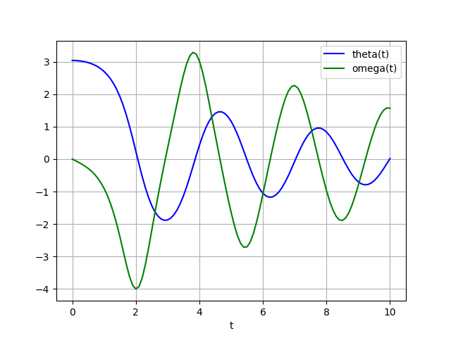
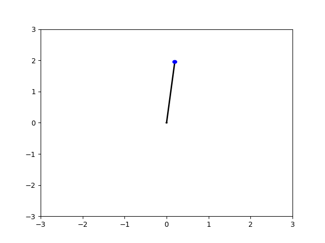
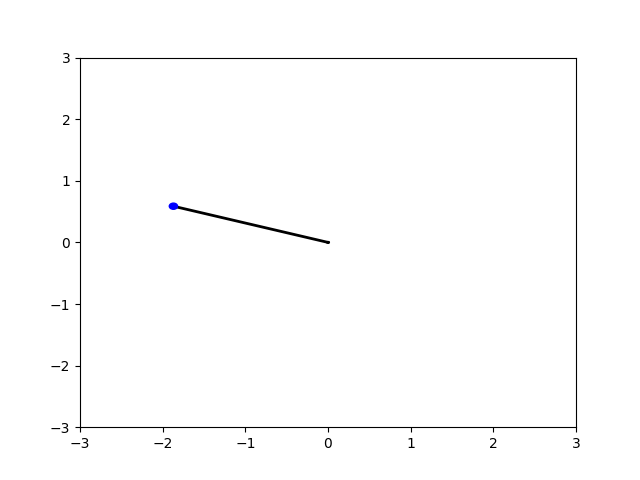
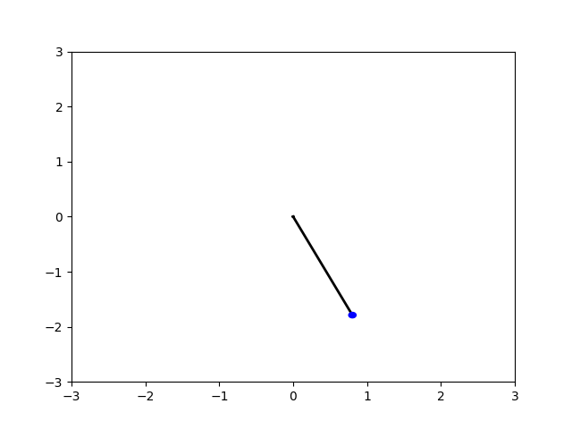
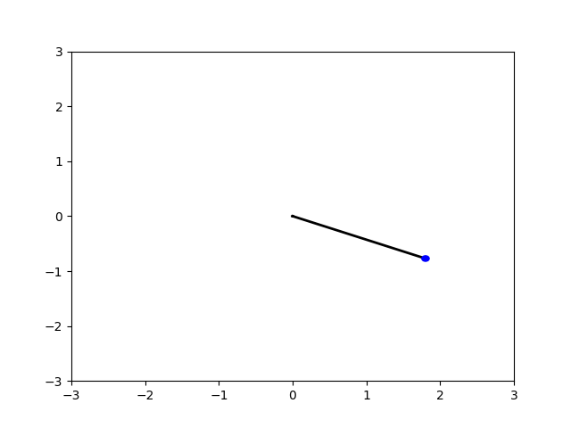
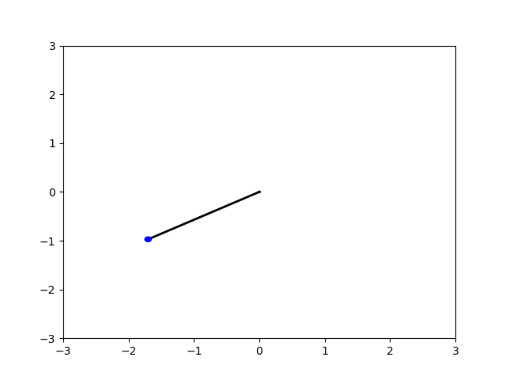

# Bir ODE Sistemi Sayısal Olarak Nasıl Çözülür

Yazıda `scipy` paketinin içindeki `odeint` çözücüyü işleyeceğiz.
Sayısal çözümler önemli çünkü çoğu ODE sisteminin analitik çözümü
yoktur. Onları sayısal paketler kullanarak çözmek gerekir. 

Bir sarkaç denklemi düşünelim, bu denklem ikinci dereceden $\theta$'yi baz
alan bir denklemdir,

$$
\ddot{\theta}(t) + \frac{b}{m} \dot{\theta}(t) +  \frac{g}{L} \sin(\theta(t)) = 0
$$

Ya da $m = 1$ dersek ve $\frac{g}{L} = c$ ile

$$
\ddot{\theta}(t) + b \dot{\theta}(t) +  c \sin(\theta(t)) = 0
$$

ki $b,c$ dışarıdan tanımlanan sabitler, ve üst nokta zamansal türevi temsil
ediyor. 

Bu denklemi `odeint` ile çözmek için onu ilk önce bir birinci derece
denklemler sistemine çevirmemiz gerekiyor.

$$
\omega(t) = \dot{\theta}(t)
$$

dersek (okunuş olarak $\omega$ omega, $\theta$ theta),

$$
\dot{\theta} = \omega(t)
$$

$$
\dot{\omega}(t) = -b \omega(t) - c\sin(\theta(t))
$$

elde ederiz. Şimdi `pend` adlı bir fonksiyon tanımlayalım,

```python
b = 0.25
c = 5.0

def pend(y, t):
    theta, omega = y
    return [omega, -b*omega - c*np.sin(theta)]
```

Bu fonksiyon ana ODE çözücünün denklemimiz hakkında bilgi aldığı nokta,
`y` dizini içinde $\dot{\theta}$ ve $\dot{\omega}$ var, onları $y$
içinde aynen bu sırada almayı bekliyoruz ve yenilerini hesapladıktan sonra
geri döndürürken de aynen bu sırada döndürüyoruz. Mesela döndürülen dizinde
ilk öğe `omega` var, bu doğru, çünkü biraz önce
$\dot{\theta} = \omega(t)$ tanımını yapmıştık, yani ilk öğede `theta`
turevi geri vermiş olduk, alırken `theta,omega=y` ile `theta`
aldığımız gibi.

`t` değişkeninde çoğunlukla zaman tanımlanır, ve bu zaman
ilgilendiğimiz zaman aralığı belli (çoğunlukla eşit aralıklı) noktalar
üzerinden dizin olarak `odeint`'e verilir, bunu `linspace` ile
yapabiliriz. $y$ için başlangıç şartlarını ayrı bir değişken içinde, mesela
`y0`, tanımlarız, bu aynen `y` büyüklüğünde bir dizin olacaktır
ve `y`  için olduğu gibi ilk öğe `theta` ikinci öğe `omega`
için başlangıç değerini tanımlayacak.

Hepsi bir arada

```python
from scipy.integrate import odeint

b = 0.25
c = 5.0

def pend(y, t):
    theta, omega = y
    return [omega, -b*omega - c*np.sin(theta)]

t = np.linspace(0, 10, 101)

y0 = [np.pi - 0.1, 0.0]

sol = odeint(pend, y0, t)

print (sol.shape)
```

```
(101, 2)
```

Başlangıç noktası $\theta$ için $\pi - 0.1$, yani şarkacın en üst
noktasından biraz yanda. Açı olarak $\theta=0$ sarkacın nötr durduğu nokta,
$\pi$ en üst noktası.

Sayısal çözüm sırasında bir dizi $\theta,\omega$ elde edildi. Bu değerler
hesaplandıkları gibi zamansal sırada, bir dizin içindeler ve üstte
gördüğümüz gibi `101,2` boyutlu bir dizin bu. En son varılan değer

```python
print (sol[-1])
```

```
[0.02001168 1.56781812]
```

Degiskenleri grafiklersek

```python
import matplotlib.pyplot as plt
plt.plot(t, sol[:, 0], 'b', label='theta(t)')
plt.plot(t, sol[:, 1], 'g', label='omega(t)')
plt.legend(loc='best')
plt.xlabel('t')
plt.grid()
plt.savefig('ode_mattuck_70_odeint_01.png')
```



Şarkaçın hareketini görmek istiyorsak,

```python
L = 9.8 / c
x1 = L*np.sin(sol[:,0])
y1 = -L*np.cos(sol[:,0])
```

```python
from matplotlib.patches import Circle
import matplotlib.pyplot as plt
from numpy import cos, sin

def make_plot(fout,x1,y1):
    r = 0.05
    fig = plt.figure()
    ax = fig.add_subplot(111)
    ax.set_xlim(-3,3)
    ax.set_ylim(-3,3)
    plt.plot([0, x1], [0, y1], lw=2, c='k')
    c0 = Circle((0, 0), r/2, fc='k', zorder=10)
    c1 = Circle((x1, y1), r, fc='b', ec='b', zorder=10)
    ax.add_patch(c0)
    ax.add_patch(c1)
    plt.savefig(fout)

for i in range(len(x1)):
    if i % 5 == 0: 
        make_plot('frames/img{:04d}.png'.format(i),x1[i],y1[i])
```








Animasyon yaratabiliriz,

```python
import os
os.system("convert -loop 0 -delay 100 frames/*.png frames/pend.gif")
```

Sonuç [2]'de görülebilir.

Not: Bir ODE sistemini çözmek hakkında konuşurken bazen onu "entegre
ettiğimiz'' de söylenir. Bu aslında yanlış bir tarif değil, çünkü
eşitliklerin sol tarafında $\dot{x}_1$, $\dot{x}_2$ gibi değişkenler var,
bizim ilgilendiğimiz, çözerek elde etmek istediğimiz sonuç $x_1$, $x_2$
değerleri. Aslında yapılanın bir bakıma sistemi "ileri doğru işletmek''
olduğu da söylenebilir, değişim denklemlerini kullanarak sistemın
simülasyonunu yapıyoruz bir bakıma.

Kaynaklar

[1] SciPy.org, *scipy.integrate.odeint*, [https://docs.scipy.org/doc/scipy/reference/generated/scipy.integrate.odeint.html](https://docs.scipy.org/doc/scipy/reference/generated/scipy.integrate.odeint.html)

[2] Bayramlı, *Sarkac Animasyonu*, [https://github.com/burakbayramli/classnotes/blob/master/ode/ode_mattuck_70_odeint/frames/pend.gif](https://github.com/burakbayramli/classnotes/blob/master/ode/ode_mattuck_70_odeint/frames/pend.gif)


