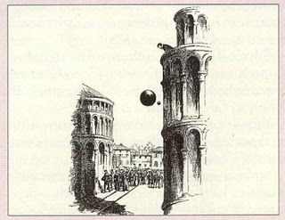
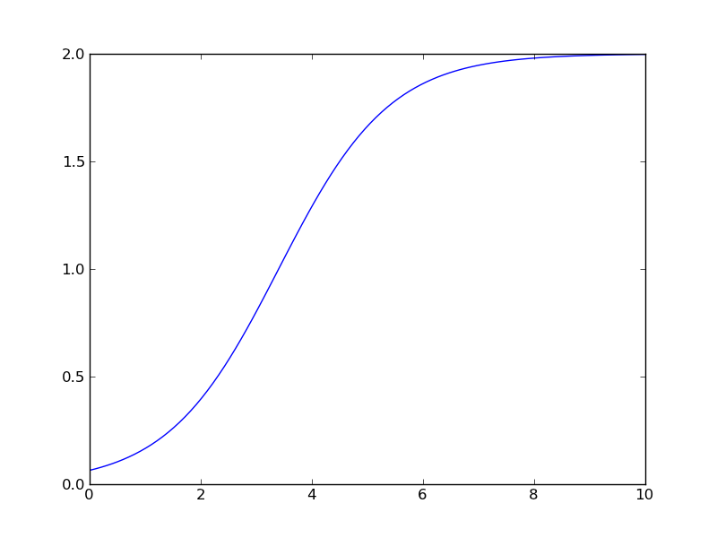
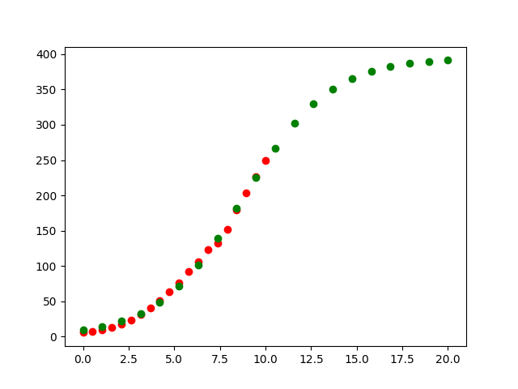

# Matematiksel Modelleme

Babil medeniyetinden dikkatli ölçmeyi ve gözlem yapmayı öğrenen eski
Yunanlılar, tabiatı, mantıklı analiz dizisi ile anlamaya
uğraştılar. Aristo'nun oldukça inandırıcı olan söylemlerinden biri olan,
"dünya düz değildir"'den esinlenen günün diğer felsefecileri, "o zaman
dünyanın çapı nedir?" gibi sorular ile uğraşmaya başladılar. Hayret verici
olan bir gelişme, Eratostenes'in bu ölçüyü oldukça yakın olarak bulmasıdır,
hem de yaşadığı şehir olan İskenderiye'den dışarı ayak bile basmadan!
Kullanılan yöntem bazı kestirmeler ve temel alınan birkaç varsayım
içeriyordu. Dünya mükemmel bir küredir (olmasa da onun hesabı için bu
uygundu), güneşin ışınları birbirine paralel olarak yol alır, Syene şehri
İskenderiye'nin 5000 stadya (bir ölçü birimir) kadar güneyde yer alır,
vs.. Bu varsayımlardan yola çıkarak, Erotostenes bir matematiksel dünya
yarattı ve bu dünya üzerinde geometri'nin uygulanabilir olduğunu gördü!



Günümüzde, aynen Yunanlı bilginlerin yaptığı gibi, bilim adamları
etrafımızdaki dünyayı daha pragmatik bir seviyede anlayabilmek ve akabinde
teknik sorulara çözüm bulabilmek için, etrafımızdaki dünyayı matematiksel
terimlerle temsil etmeye devam ediyorlar. Gerçeği matematiksel bir dil ile
'taklit etmeye' yardım eden bu işlem ve düşünce şekline, matematiksel
modelleme adı veriliyor.

Bir problemi matematiksel terimler kullanarak göstermenin bazı yararları
var. İlki, altında olduğumuz şartları öne sürmemizi ve tanımlamamız için
bizi zorlaması, ki bu güzel bir şey. Gerçek dünyada olmakta olan problemler
çetrefilli olduklarından, hangi değişkenlerin çözümümüz için önemli,
hangisinin önemsiz olduğunu daha matematiksel uygulama başlamadan
kararlaştırmak önemli. Bu seçim yapıldıktan sonra, genelde bazı kanunlar ve
kuramlar kuruluyor ve bu varsayımlar, modelimizin idealleştirilmiş hali adı
altında irdelenmeye başlanıyor.

Matematik'in en önemli yararı, mantıksal sonuçlara varabilmek için
elimizdeki varsayımlardan başlayarak bu formülleri değişimden geçirmemize
yardım eden temel teknikler vermesi. Böylece elimize analiz yapabilmemiz
için sağlam bir temel geçiyor, aradığımız sonucun ne olduğunu baştan tam
kestirmesek bile, bu modelleme işlemi bize yolda yardım edecek araçlar
sağlıyor.

Ayrıca matematiğin, bilgisayarlar tarafından sayısal cevaplar alınabileceği
bir ortam sağlaması da önemli bir avantaj.

Etkili matematiksel modeller kurmak oldukça yetenek isteyen bir iş,
tasavvur ve tarafsız irdeleyebilme kabiliyeti gerektiriyor. Daha önceden
kurulmuş olan öteki modelleri örnek olarak incelemek, modelleme sürecinin
nasıl bir şey olduğunu hissetmek için yararlı olabilir. Revaçta modellemeyi
öğreten çok güzel kitaplar ve makaleler var. Bu yazımızda bizim
odaklanacağımız, birinci derecen türevsel denklem içeren matematik
modelleri olacak. İzleyeceğimiz modelleme işleminin ana hatları şöyle
olacak.


Problemi Formüllere Dök

Bu safhada amacımız bir formülü kurmak. Böylece cevabın matematiksel olarak
'bulunabileceğini' umuyoruz. Tabii bu işlem hem matematiği hem de problem
alanını bilmemizi gerektiyor. Bu seviyede, matematikçi olmasa bile problem
alanında uzman olanlar kimseler ile konuşmanız yararlı olabilir. Ayrıca
problem alanını anlatan eserleri okumanız iyi olacaktır.

Modeli Geliştir

Burada yapılacak iki şey var. İlk önce hangi değişkenler önemli, hangiler
değil ona karar vermeniz gerekiyor. Önemli olanların arasından, bazıları
bağımlı bazıları bağımsız değişken olarak tanımlanacaklar. Önemsiz
değişkenleri şöyle farketmeniz mümkün; modellenen süreç üzerinde hiç etkisi
olmayan değişkenler sizin için önemli değildir ve atılabilir. Mesela,
binadan aşağı düşen bir topun hareketini incelemek istiyorsanız, topun
hangi renkte olduğu modeliniz için önemsizdir.

Bağımsız değişkenler modeli etkileyebilecek, modele giriş olarak
verilebilecek değerlerden seçilir. Yere düşen cisim için, cismin şekli,
kütlesi, başlangıç noktası, başlangıç hızı, ve hangi zamanda bırakıldığı bu
tür bağımsız değişkenlerdendir. Bağımlı değişkenler, adı üzerinde,
değerleri bağımsız değişkenlere bağlı olan fakat, gene de model için önemli
olan değişkenlerdir. Yere düşen cisim için bunlar hız, katledilen mesafe,
yere çarpma zamanı gibi değişkenler bağımlı değişkenler arasında
sayılabilir.

İkinci yapmak gereken şey, bu değişkenler arasındaki bağlantıları bulmak
(mesela birinci derece türevsel denklem kurarak). Bunu yapmak problem alanı
hakkında bilgi ve vizyon gerektirir. Taslak bir modelle başlanabilir, ve
testler sonucunda modeli rafine etmek mümkündür. Mesela yukarıdaki örnek
için başlangıçta sürtünme kuvvetini hesaba katmayabiliriz, fakat ileride
daha net sonuçlar için sürtünmeyi modele eklemek gerekebilir.

Modeli Test Et

Modeli hemen test verileri ile 'doğrulamaya' uğraşmadan önce, şunlara
tekrar göz atalım.


   * Varsayımlar akla yatkın mı?
   * Denklemler birim değerlerini doğru kullanıyor mu? (Mesela kuvvet
     değerlerini, hız değeri ile toplamak yanlış olur) 
   * Model iç yapısı bakımından tutarlı mı? Yani, modeli oluşturan
     denklemler birbiri ile çatışma halinde mi?
   * Elimizde olan denklemler çözüm verebilecek nitelikte mi?
   * Çözümü bulmak, elimizdeki denklemler ile ne kadar zor olacak?
   * Çözüm, incelediğimiz probleme yardım edecek türden olacak mı?


Nüfus Artış Modeli

Bir ülkenin nüfus artışını nasıl tahmin edebiliriz? Eğer bir gurubun nüfus
artışını tahmin etmek istiyorsak, bu gurubu her dış etkiden uzak izole bir
kapalı kutu halinde düşünebiliriz. Bu kutu mesela biyolojide Petri tabağı
denen bir ortam, ya da günlük hayatta bir ada olarak tanımlanabilecek bir
ortam olabilir. Böylece nüfus artışını izole bir şekilde 'tek odada'
incelememiz mümkün olacak.

Diyelim ki, $p(t)$, $t$ zamanında ölçülecek olan nüfusu veriyor
olsun. Şimdi çoğalma (doğum) ve azalma (ölüm) hızlarını hesaplayalım.

Örnek olarak şöyle düşünelim, bir bakteri kendini ikiye bölerek
çoğalır. Bizim modelimiz için de, büyüme hızının, o anki mevcut nüfusa
oranlı olduğunu varsayalım. Bu varsayım bakterilerin büyüme şekli ile
tutarlı. Büyüyecek yer ve yeteri kadar yiyecek olduğu sürece, bakteriler
büyüyeceğini biliyoruz. Bir diğer varsayım da şöyle olsun, ölüm oranı
sıfır. (Unutmayalım ki, hücre bölünmesinde ebeveyn hücre ölmez, iki hücre
haline gelir). Yani bakteri nüfusu için bir model şöyle olabilir.

$$ \frac{dp}{dt} = k_1p$$

$$ p(0) = p_0 $$

$k_1 > 0$ olarak tasavvur edeceğiz. $k_1$ büyüme oranı 'sabitidir'. $p_0$,
nüfusun $t = 0$ (yani başlangıçtaki) sayısıdır. Şimdi bakterilerden, insan
nüfusuna gelelim. İnsan nüfusu için hiç ölmeme varsayımı tabii ki yanlış!
Fakat, insanların sadece doğal sebeplerden olduğunu varsayarsak, ölüm
oranının da o anki nüfus sayısına orantılı olduğunu düşünebiliriz. Bu
yüzden, ilk denklemi değiştirip, şu hale getiriyoruz.

$$ \frac{dp}{dt} = k_1p - k_2p = (k_1-k_2)p = kp$$

$k_2$ olarak nitelenen sabit, ölüm oranı olarak temsil edildi. $k_1$'in her zaman
$k_2$'den büyük olduğunu farzedersek, asâgıdaki model çıkar.

$$ \frac{dp}{dt} = kp $$

$$ p(0) = p_0 $$

Birçok k sabiti kullanılmış olması aklınızı karıştırmasın. Doğum ve ölüm
oranlamaları değişik sabitler gerektiyor, ama önemli olan bir 'sabit'
kullanıldığını farketmek. Sonuçta demeye çalıştığımız nüfus ile nüfus
büyümesi arasında doğrusal bir bağlantı olması. Sabite ihtiyacamız da
buradan geliyor.

Elimize geçen son formül, ünlü bir formüldür, Maltezyen ya da nüfus
artışının üstel (exponential) kanunu olarak bilinir. Denklem ayırılabilir
olduğu için, işlemden geçirip p fonksiyonunu bulmak mümkün.

$$ \frac{dp}{dt} = kp, p(0) = p_0 $$

$$ \frac{dp}{p} = kdt $$

$$ \int \frac{dp}{p} = \int k \mathrm{d} t$$

$$ ln p = kt + C $$

$$ p = e^Ce^{kt} $$

$$ e^C = C_1 $$

$$ p = C_1e^{kt} $$

Maltezyen modelini test etmek için, Amerika'nın nüfus artış verisini
kullanabiliriz.

```
Sene Nufus Maltezyen Lojistik

1770 3.93 3.93  3.3
1800 5.31 5.19  5.30
1810 7.24 6.84  7.13
1820 9.64 9.03  9.58
1830 12.87 11.92  12.82
1840 17.07 15.73  17.07
1850 23.19 20.76  22.60
1860 31.44 27.39  29.70
1870 39.82 36.15  38.65
1880 50.16 47.70  49.69
1890 62.95 62.95  62.95
1900 75.99 83.07  78.37
1910 91.97 109.63  95.64
1920 105.71 144.67  114.21
1930 122.87 190.91  133.28
1940 131.67 251.94  152.00
1950 151.33 332.47  169.56
1960 179.32 438.75  185.35
1970 203.21 579.00  199.01
1980 226.50 764.08  210.46
1990 249.63 1008.32  219.77
2000 ? 1330.63  227.19
```

Örnek 1

Eğer t = 0 değeri için 1790 senesini alırsak, son formüle göre şöyle p(t)
formülü nasıl bulunabilir?

$$ p(t) = (3.93)e^{kt} $$

$$ p(100) = 62.95 = (3.93)e^{100k} $$

$$ k = \frac{ln(62.95)-ln(3.93)}{100} \approx 0.027737 $$

$$ p(t) = (3.93)e^{(0.027737)t} $$

$p(t)$'yi bulduk. Yukarıda ki verilerden formülü kontrol edersek, Maltezyen
tahmini 1900 tarihine kadar tuttuğunu görürüz. Fakat 1900'den sonra tahmin
edilen nüfusun çok fazla, bu yüzden modelin işlemediğini görüyoruz.

Acaba model niye her zaman için işlemedi? Düşünelim. Model, nüfus çok
arttıktan sonra bozulmaya başladığına göre, nüfus fazlalığı ile alakalı, ve
bizim modele almadığımız bir faktör var demektir.

Maltezyen modeli, sadece doğal sebeplerden olan ölümü göz önüne
almıştı. Öteki ölüm sebepleri de önemli olabilir, mesela yiyecek
darlığından olan ölümler, yeterli sağlık malzemesi olmaması, ilaç
yokluğundan olan ölümler, bulaşıcı hastalılar ya da suç işleyen insanlar
yüzünden ölenler olabilir.

Bu tür faktörler insanlar arasında etkileşim gerektirdiği ve belli
kaynaklara olan yarışma sırasında vuku bulan ölme durumlerı olduğu için,
modele, ikili ilişkilerin de dikkate alındığı bir şekilde genişletmemiz
gerekiyor. Yani, p sayısındaki bir nüfus için, p(p - 1) kadar ikili ilişki
olduğunu düşünürsek, o zaman bu ikili ilişki ve yarış sonucundaki ölüm
oranını şu şekilde modelleyebiliriz.

$$ \frac{dp}{dt} = ap - bp^2 $$

Burada $p$ ve $p^2$ ifadelerinin katsayıları, sabitleri değişik, çünkü bir
sabit normal doğum ölümü, diğeri ise kaynaklara olan yarıştaki ölümler
seçildi. 

Şimdi biraz notasyon değişikliği, Cebirsel işlemleri kolaylaştırmak için
sabitlerde biraz oynama yapacağız. $a = k$, ve $b = k/K$ diyelim. 

$$ kp - \frac{k}{K}p^2 = \frac{dp}{dt} $$

$$ kp (1 - \frac{p}{K}) = \frac{dp}{dt} $$

Değişken ayırma (seperation of variables) yöntemini kullanırsak

$$ \frac{dp}{p(1-p/K)}  = k \ dt$$

İki tarafın da entegralini alalım

$$ \int \frac{dp}{p(1-p/K)}  = \int k \mathrm{d} t$$

$$ \int \frac{1}{p(1-p/K)}dp  = \int k \mathrm{d} t$$

Eşitliğin sol tarafında entegralin içindeki ifadede hem bölüm, hem böleni
$K$ ile çarparsak

$$ = \frac{K}{p(K-p)} $$

Bunun üzerinde kısmi kesirler yöntemini (partial fractions method)
kullanabiliriz, özellikle bölümdeki çarpanların toplamının bölümde olduğu
durumlarda, ki bizim örneğimizde bu $p + K - p = K$, bu ifadeyi ayırmak çok
kolay, kısmi kesirlerin bölümü hemen 1 olabilir

$$ = \frac{1}{p}  + \frac{1}{K-p}$$

Entegralde yerine koyalım

$$ \int \frac{1}{p}  + \frac{1}{K-p} \mathrm{d} p  = \int k \mathrm{d} t$$


$$ \int \frac{dp}{p} + \int \frac{dp}{K-p} = \int k \mathrm{d} t $$

$$ ln|p| - ln|K-p| = kt + C $$

$$ ln \bigg| \frac{p}{K-p}\bigg|  = kt + C$$

$$ ln \bigg| \frac{K-p}{p}\bigg|  = -kt - C$$

İki tarafı $e$ bazında hesaplarsak

$$ \bigg| \frac{K-p}{p}\bigg| = e^{-kt - C} $$

Eğer $A = \pm e^{-C}$ alırsak

$$ \frac{K-p}{p} = A e^{-kt }  
\qquad (1)
$$

$$ \frac{K}{p} - 1 = Ae^{-kt} $$

$$ \frac{K}{p}  = 1 + Ae^{-kt} $$

$$ \frac{p}{K}  = \frac{1}{ 1 + Ae^{-kt}}$$

$$ p(t) = \frac{K}{ 1 + Ae^{-kt}} $$

Final formüle eriştik. 

Peki $A$ nedir? Eğer (1) ifadesine $t=0$ verirsek

$$ \frac{K-p(0)}{p(0)} = A e^{k \cdot 0} = A$$

$p(0) = p_0$ diyelim

$$  \frac{K-p_0}{p_0} = A $$     

Bu denklemin tahminleri çok daha iyi işleyecektir. 

Elde ettiğimiz $p(t)$ fonksiyonunu grafiklediğimiz zaman çıktı suna
benzeyecektir. 



Elde edilen şekilde bir 'S' görüntüsünde, bu fonksiyona "S eğrisi'' adı
verildiği de oluyor. Bir diğer isim "Hill fonksiyonu''. 

Veri Uydurmak 

Hill fonksiyonunu sayısal yöntemler kullanarak tarihi veriye uydurarak,
sabitlerini hesaplatmak mümkündür. Scipy paketindeki
`scipy.optimize.leastsq` fonksiyonu bu işi yapabilir. Uydurmanın
işlemesi için önce bir `f` tanımlanır, daha sonra bu fonksiyonun
gerçek veri ile arasındaki hatayı tanımlayan bir fonksiyon verilir. Bu iki
fonksiyon üzerinden veri uydurması yapılacaktır. 

```python
# US population prediction, Logistic growth, Hill function
# Amerika nufus artisi, lojistik denklem

from scipy import optimize

def f(t,A,k,K):
    return K / (1+A*np.exp(-k*t))    

def resid(p, y, t):
    A,k,K = p
    return y - f(t,A,k,K)

t, x1 = np.loadtxt('us.txt', unpack=True)
t = np.linspace(0,10,len(t))

A0,k0,K0 = 1, 1, 1

[A,k,K], flag  = optimize.leastsq(resid, [A0,k0,K0], args=(x1, t))

print flag, A, k, K
    
plt.plot(t, x1, 'ro')
plt.hold(True)            
t = np.linspace(0,20,len(t))    
plt.plot(t, f(t,A,k,K), 'go')    
plt.savefig('us.png')
```

```
1 43.0658055581 0.427360301123 394.758729112
```

Program işletildikten sonra grafik basılacak. Grafikte kırmızı noktalar
gerçek veri, yeşil noktalar ise uyumu yapılmış fonksiyonun gelecek yıllar
için gösterdiği tahmindir. 



Sonuç

Bu yazıda hem model kurmanın ve türevsel denklemlerin yararlarını
gördük. Türevsel denklem kurarken düşünülmesi gereken, $dp/dt$ görünce
'oran' düşünmek, yani akla 'değişim' getirmek. Tabii daha türevleri daha
detaylı anlayabilmek için (ispatı ile birlikte) limitlerin kuramı yararlı
olur, fakat unutmayalım ki limitlerin ispatı için yetişinceye kadar
yüzyıllar geçmişti! Calculus'un tam ispatı daha gelmeden, mühendisler ve
bilim adamları türevleri ve entegralleri kullanıyorlardı.

Calculus, dinamik olan sistemler için kullanılır, yani değişmekte olan
sistemler için gereklidirler. Calculus'un tarihinin fizik ile yakın alakası
bundandır.

Kaynaklar

[1] Lerma, *Math 214-2 Integral Calculus Lecture Notes* [http://www.math.northwestern.edu/~mlerma/courses/math214-2-03f](http://www.math.northwestern.edu/~mlerma/courses/math214-2-03f)

[2] Chan, *Scientific Scripting with Python for Computational Immunology*


