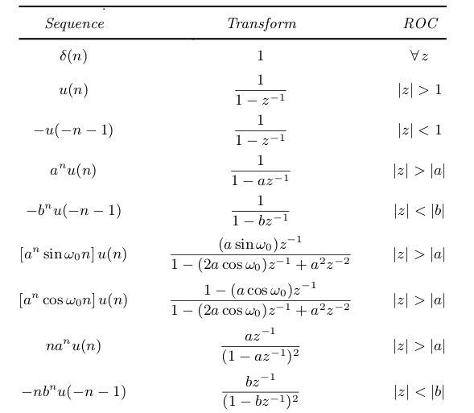

# Ekler

Seriler

Çok basit bir sonlu seri

$$ 1 + \theta + \theta^2 + ... + \theta^{n-1} $$

Üstteki toplamı daha kısa bir formülle ifade edebilir miyiz? 

$$ s_n = 1 + \theta + \theta^2 + ... + \theta^{n-1} $$

$$ \theta s_n = \theta + \theta^2 + \theta^3 + ... + \theta^n $$

Eğer 2. ifadeyi 1.'den çıkartırsak, pek çok terim iptal olacaktır,

$$ s_n - \theta s_n = 1 - \theta^n $$

$$ s_n ( 1 - \theta) = 1 - \theta^n $$

$$ s_n = \frac{1 - \theta^n}{1 - \theta} $$

Çoğunlukla fonksiyonlar sonsuz bir serinin toplamı olarak temsil
edilebilirler. Mesela ünlü üstel baz $e^x$in açılımı [8,9],

$$ e^x = 1 + x + \frac{1}{2!}x^2 + \frac{1}{3!}x^3 + ... $$

İspat

$e^x$'in özelliği nedir? Türevinin kendisine eşit olmasıdır. O zaman öyle
bir seri düşünelim ki türevini alınca kendisine eşiti olsun. Mesela

$$ 1 + x + x^2 + x^3 + ... $$

serisi "neredeyse'' bu şarta uyuyor, çünkü türevini alınca 

$$ 0 + 1 + 2x + 3x^2 + ... $$

Bu seri, $e^x$ açılımına benzer, üstel değerler doğru, ama katsayılar
tam uymuyor. Onu telafi edebiliriz. $2x$'i $2$ ile, $3x^2$'i $3$ ile, vs
bölersek, yani $n=0,1,2,..$ için $n!$ ile bölersek, katsayılar da uyumlu
hale gelir, yani 

$$ e^x = \sum_{ n=0}^{\infty} \frac{ x^n}{n!} $$

Bir güç serisinin genel şekli

$$ f(x) = a_0 + a_1(x-x_0) + a_2(x-x_0) + ... = \sum_{ n=0}^{\infty} a_n (x-x_0)^n$$

olarak gösterilir, $a_n$ katsayıları bilinmesi gereken katsayılardır. Çoğu
durumda $x_0=0$'dir. O zaman 

$$ f(x) = \sum_{ n=0}^{\infty} a_n x_n^n = 1+x+x^2+x^3+..$$

diye gider. Herhangi bir polinom herhangi bir $c$ merkezi etrafında rahat
bir şekilde bir güç serisi (power series) olarak temsil edilebilir
(muhakkak bu serinin çoğu katsayısı sıfır değerinde olacaktır). 

Bir güç serisinin faydalı olması için sabit bir sayıya yakınsaması
(converge) gerekir. Mesela matematikteki en önemli güç serilerinden biri
olan geometrik serilere bakalım, 

$$ 1 + x + x^2 + x^3 + .. = \sum_{n=0}^{\infty} x^n  $$

Bu toplam $n \to \infty$ iken bir sayıya yaklaşır mı? 

$$ s_N = 1 + x + x^2 + ..  $$

diyelim. Şimdi bir numara, iki tarafı $x$ ile çarpalım, 

$$ x s_N = x + x^2 + x^3 + ..  $$

Eğer $s_N - xs_N$ hesaplarsak ne olur? İki üstteki formülde eşitliğin sağ
tarafından bir üsttekinin sağ tarafını çıkartırız, her iki tarafta da $x +
x^2 + x^3 + ..$ var ve bunlar iptal olur, geri kalanlar, 

$$ s_N - xs_N = 1  $$

$$ s_N(1-x) = 1 $$

$$ s_N = \frac{1}{1-x} $$

Bu seri "başlangıcı 1, oranı $x$ olan bir geometrik seri'' olarak ta ifade
edilebilir, oran her terimin ortak katsayısı gibi görülür. Eğer başlangıç 1
oran $1-\alpha$ olsaydı,

$$ 1 + (1-\alpha) + (1-\alpha)^2 + .. $$

o zaman sonuç

$$ \frac{1}{1 - (1-\alpha)} $$

olarak çıkardı. Bu üstteki yöntemle kontrol edilebilir. Yani sonuç için
başlangıç değeri bölünene, oran denilen değer ise 1'den çıkartılıp
bölünene yazılır.

Bir diğer seri

$$ 1 - x + x^2 - x^3 + .. $$

güç serisi neye yaklaşır? 

Yine aynı numara, ama bu sefer $-x$ ile çarpalım,

$$ s_N  = 1 - x + x^2 - x^3 + .. $$

$$ -x s_N = -x + x^2 - x^3 + .. $$

1. formülden 2.'yi çıkartalım, 

$$ s_N + x s_N = 1$$

$$ (x+1)s_N  = 1$$

$$ s_N  = \frac{1}{x+1} $$

Türev Alırken Bölüm Kuralı (Quotient Rule)

Bölüm kuralı şöyle gösterilir 

$$ \frac{ u(x)}{v(x)} = \frac{u(x)'v(x) - u(x)v(x)'}{v(x)^2} $$

Ya da $x$ göstermeden

$$ \frac{ u}{v} = \frac{u'v - uv'}{v^2} $$

Bu formülü hatırlamak biraz zor gelebilir. Eğer hatırlamıyorsak hatırlaması
daha basit olan Çarpım Kuralı (product rüle) üzerinden
türetebiliriz. Çarpım kuralı bildiğimiz gibi

$$ (uv)' = u'v + uv' $$

Burada bir numara yaparak 

$$ (u \ \frac{ 1}{v})' $$

üzerinde Carpım Kuralını kullanarak türev alacağız, böylece otomatik olarak
arka planda aslında $u/v$'nin türevini aldırtmış olacağız. 

$$ \bigg(u \ \frac{ 1}{v}\bigg)' = 
u \bigg(\frac{1}{v}\bigg)' + u' \bigg(\frac{1}{v}\bigg)
$$

Bu arada

$$ \bigg(\frac{ 1}{v}\bigg)'  = -\frac{v'}{v^2} $$

Bölümde $v'$ var, çünkü unutmayalım $v$ aslında $v(x)$, o zaman ana
formülde yerine koyalım

$$  = 
-u\frac{v'}{v^2}  + u' \bigg(\frac{1}{v}\bigg)
$$

$$  = 
\frac{u' }{v} -\frac{uv'}{v^2}
$$

Birinci terimde bölüm ve böleni $v$ ile çarpalım, ki iki terimi
birleştirebilelim, 

$$  = 
\frac{u'v }{v^2} -\frac{uv'}{v^2} = 
\frac{u'v-uv'}{v^2}
$$

Bazı $e$, Log Özellikleri

Bazen $\log$ bazen $\ln$ kullanıldığını görürsünüz. Eğer $\ln$
kullanılırsa bu $\log$ ifadesinin $e$ baz kullanan hali demektir, yani
$\log_e$. 

Çarpım log'u, logların toplamı olur.

$$ \log xy = \log x + \log y $$

Bölüm log'u, logların çıkartılması olur.

$$ \log x/y = \log x - \log y  
\qquad (1)
$$

Aynı baz kullanan çarpımlar, tek baza indirilip üstleri toplanabilir.

$$ e^a \cdot e^b = e^{a+b} $$

Üstü olan bir ifadenin log'u, üst değerini aşağı indirir.

$$ \log(x^y) = y \log(x) $$

Üstün üstü (son üst tüm bazı kapsayacak şekilde ise) direk üstlerin
çarpımına çevirilebilir.

$$ (e^x)^y = e^{xy} $$

$\ln$'nin bazı $e$ olduğuna göre, $e$ üzeri $\ln$ birbirini iptal eder,
yani

$$ x = e^{\ln x} $$

Bu ifade (1)'den türetilebilir ama yine de ayrı vermek iyi olur, $1/x$'in
log'u $x$'in negatifini verir. 

$$ \log(1/x) = -\log(x) $$

Kısmi Kesirler Yöntemi (Partial Fractions Method)

Bazen şu şekildeki bir kesiri 

$$ \frac{8x + 22}{(x-1)(x+5)} $$

bölendeki her çarpan ayrı bir kesir parçasında olacak şekilde o parçaların
toplamı olarak göstermek faydalıdır. 

$$ \frac{...}{(x-1)} + \frac{...}{(x+5)} $$

Bu tür bir parçalı kesirin verisini almak çok daha kolaydır
mesela. Fakat bu parçalama işlemini nasıl yapacağız?

Cebir kullanarak bu problemi çözebiliriz. Üstte nokta nokta olan yerlerin
ne olduğunu merak ediyoruz, o zaman onlara $A,B$ değişkenlerini atarsak

$$ \frac{A}{(x-1)} + \frac{B}{(x+5)} = \frac{8x + 22}{(x-1)(x+5)}$$

Eğer bölüm kısmında temiz bir eşitlik elde etmek istiyorsak, o zaman
üstteki kesirlerin bölen kısmını birbirinin aynısı haline getirmeliyiz. İlk
terimin bölüm, bölen kısmını $(x+5)$, ikincisinin bölüm, bölen kısmını
$(x-1)$ ile çarparsak, bu eşitliği elde ederiz. 

$$ \frac{(x+5)A}{(x-1)(x+5)} + \frac{(x-1)B}{(x+5)(x-1)} = 
\frac{8x + 22}{(x-1)(x+5)}
$$

Bölen kısmı birbirine eşit olduğuna göre, artık sadece kesirlerin üst
kısmını kullanabiliriz, çünkü aradığımız bilinmeyenler orada. 

$$ (x+5)A + (x-1)B = 8x+22 $$

Eşitliğin sol tarafının açılımını düşünürsek, 

$$ xA + .. + Bx + .. = 8x + .. $$

$$ x(A + B) +  .. = 8x + .. $$

ve her iki tarafta $x$'in katsayılarının aynı olması zorunluluğundan
hareketle

$$ A + B = 8 $$

olacaktır. Benzer şekilde geri kalan sabitleri eşitlersek 

$$ 5A - B = 22 $$

O zaman elimizde iki bilinmeyen, iki denklem var, bu sistemi çözmek çok
kolay! 

$$ B = 5A - 22 $$

Öteki denkleme sokalım

$$ A + 5A - 22 = 8 $$

$$ 6A = 30 $$

$$ A = 5 $$

$$ B = 3 $$

Demek ki kısmi kesirlerimiz şöyle olacak 

$$ \frac{5}{(x-1)} + \frac{3}{(x+5)} = \frac{8x + 22}{(x-1)(x+5)}$$

İçiçe Fonksiyonlar (Composite Functions) [1, sf. 191, 227]

$$ y = \frac{3}{2}x = \frac{1}{2}3x $$

bir içiçe fonksiyon olarak görülebilir. 

$$ y = \frac{1}{2}u, \ u=3x $$

dersek, $y$ içindeki $u$ bir başka fonksiyon olabilir. Yani aslında 

$$ y = f(u) $$

$$ u = g(x) $$

Yani

$$ y = f(g(x)) $$

Üstteki form bazen 

$$ y = f \circ g $$

olarak ta gösterilebiliyor. 

Zincirleme Kanunu (İçiçe Fonksiyonlar İçin)

Eğer $f(u)$, $u=g(x)$ noktasında, ve $g(x)$, $x$ noktasında türevi
alınabilir durumda ise, o zaman içiçe fonksiyon $(f \circ g)(x) = f(g(x))$
$x$ noktasında türevi alınabilir demektir, ve

$$ (f \circ g)'(x) = f'(g(x)) \cdot g'(x) $$

doğru olacaktır. Leibniz notasyonu ile 

$$ \frac{ dy}{dx} = \frac{ dy}{du} \cdot \frac{ du}{dx} $$

Üstteki formülü kesirlerin çarpımı olarak görmek kısmen doğru olabilir, en
azından hatırlamak için iyi, ama formel ispat başka şekilde yapılıyor,
detaylar için "$dy/dx$ bir kesir olarak görülebilir mi?'' yazısına
bakabilirsiniz.

Türev alırken $'$ işaretinin kullanılabilme sebebi fonksiyonda tek değişken
olduğu zaman neye göre türev alındığının bariz olması.

Örnek 

Başta verilen örnek için $dy/dx$' i bulun. 

$$ \frac{ dy}{dx} = \frac{ 3}{2}, \
\frac{dy}{du} = \frac{ 1}{2}, \
\frac{ du}{dx} = 3
 $$

$$ \frac{ dy}{dx} = \frac{ dy}{du} \cdot \frac{ du}{dx} $$

O zaman 

$$ \frac{ 1}{2} \cdot 3 = \frac{ 3}{2} $$

Parçalı Entegral (Integration by Parts)

Aslında parçalı entegral türevlerin çarpım kuralının bir uzantısı sadece
[12, sf. 17]. 

$$
\frac{\mathrm{d} }{\mathrm{d} x} [u v] = \frac{\mathrm{d} u}{\mathrm{d} x} v + u \frac{\mathrm{d} v}{\mathrm{d} x}
$$

Şimdi iki tarafın entegralini alalım,

$$
\int_{a}^{b} \frac{\mathrm{d}}{\mathrm{d} x} [u v] \mathrm{d} x =
\int_{a}^{b} \frac{\mathrm{d} u}{\mathrm{d} x} v \mathrm{d} x +
\int_{a}^{b} u \frac{\mathrm{d} v}{\mathrm{d} x} \mathrm{d} x 
$$

Altta sol taraftaki değişim Temel Calculus Kanunundan geliyor,

$$
\Rightarrow u v |_{a}^{b} =
\int_{a}^{b} \frac{\mathrm{d} u}{\mathrm{d} x} v \mathrm{d} x + 
\int_{a}^{b} u \frac{\mathrm{d} v}{\mathrm{d} x} \mathrm{d} x 
$$

Yer değişimi sonrası,

$$
\Rightarrow \int_{a}^{b} u \frac{\mathrm{d} v}{\mathrm{d} x} \mathrm{d} x =
u v |_{a}^{b}  -
\int_{a}^{b} \frac{\mathrm{d} u}{\mathrm{d} x} v \mathrm{d} x
$$

Bu parçalı entegral formülüdür. Daha rahat hatırlamak için çoğu zaman
$u=f(x),v=g(x)$ kabul edilir, o zaman $du = f'(x)dx$ ve $dv = g'(x)dx$
olur, ve şu form ortaya çıkar,

$$ \int u \mathrm{d} v = uv - \int v \mathrm{d} u$$

Bu formül birinci entegral $\int u \mathrm{d} v$'yi ikinci bir entegral $\int v \mathrm{d} u$
üzerinden tarif etmiş olur, bazı durumlarda ikinci entegral hesabı daha kolay
olabileceği için o tercih edilebilir, ve parçalı entegral formülüyle o entegrale
geçiş yapılmış olur [1, sf. 562].

Eşsizlikler (Singularities) 

Eşsiz nokta bir fonksiyonun analitikliği kaybettiği yerdir. Sıfır ile
bölünmek mesela eşsizlik sebeplerinden bir tanesidir. Ya da içinde dallanma
noktası taşıyan tüm fonksiyonlar o noktada analitikliği kaybederler,
türevleri alınamaz, bu sebeple eşsizlik taşırlar. Mesela $f(z) = z^{1/2}$
ya da $f(z) = \sqrt{z}$ fonksiyonunda, her $z$ değeri için iki tane
$z^{1/2}$ değeri vardır.

Basit örnek, 

$$ f(z) = \frac{ \sin z}{z} $$

Bu fonksiyon $z=0$ noktasında tanımsızdır, çünkü $f(0) = 0/0$ ve sıfır ile
bölmek tanımsızdır, o zaman $f(z)$ sonlu hayali düzlemin her yerinde
analitiktir, sadece $z=0$ noktasında değildir [5, sf 364]. 

Şimdi ilginç bir numara, bazen eşsizliği "çıkartmak'' mümkündür; önce suna
dikkat, $z \to 0$ iken fonksiyonun limiti var,
$$ \lim_{z \to 0} \frac{ \sin z}{z} = \lim_{z \to 0} \frac{\cos z}{1} = 1 $$

Üstteki $\cos z/1$ geçişini yapabildik çünkü L'Hospital kuralını hatırlarsak
$\lim_{z \to z_0} f(z)/g(z) = \lim_{z \to z_0} f'(z)/g'(z)$. O zaman parçalı bir
fonksiyon yaratarak eşsiz noktadaki "boşluğu doldurmak'' mümkündür, yani bu
fonksiyonu her noktasında türevi alınır hale getirebiliriz. Fonksiyon $f(z)$'yi
"sarmalayan'' yeni bir $f(z)$ yaratırsak,

$$ 
g(z) = \left\{ \begin{array}{ll}
\frac{\sin z}{z} & z \ne 0 \\
1 & z = 0
\end{array} \right.
 $$

Bu fonksiyonun $z=0$ noktasında artık türevi alınabilir. Kontrol edelim, 

$$ f'(0) = \lim_{z \to 0} \frac{f(0)-f(z)}{z}  $$

$$ = \lim_{z \to 0} \frac{1-\sin(z)/z}{z} $$

$$ = \lim_{z \to 0} \frac{z-\sin(z)}{z^2} $$

L'Hospital,

$$ = \lim_{z \to 0} \frac{1 - \cos z}{2z} $$

Tekrar

$$ = \lim_{z \to 0} \frac{ \sin(z)}{2} $$

$$ = 0 $$

$z=0$ noktasına *çıkartılabilen eşsizlik* ismi verilir, çünkü
fonksiyonun eşsizlik noktasındaki değerini o noktadaki limiti haline
getirirsek, o noktadaki eşsizliği çıkartmış oluruz. 

Bazı yaygın z-transform'ları 

Kaynaklar 

[1] Thomas, *Thomas Calculus, 11th Edition*

[2] Ifeachor, *Digital Signal Processing*, pg. 105

[3] Slicer, *Digital Signal Processing using Matlab*, pg. 119

[5] B. A. Shenoi, *Introduction to DSP and Filter Design*, pg. 41

[6] Mauch, *Introduction to Methods of Applied Mathematics*

[7] Mattuck, *Introduction to Analysis*

[8] Wikipedia, *Power Series*, [http://en.wikipedia.org/wiki/Power_series](http://en.wikipedia.org/wiki/Power_series)

[9] Moore, *Introduction to Partial Differential Equations*

[10] Strogatz, *Infinite Powers*

[12] Gockenbach, *Understanding and Implementing FEM*

